::: {.callout-important}
## 本节考纲要求

本页依据 9709 Mathematics 2026–2027 syllabus 1.4 Circular measure：

- 理解 radian 的定义，并在 radians 与 degrees 之间转换；
- 使用

$$s=r\theta,\qquad A=\frac12r^2\theta$$

计算 arc length 与 sector area；
- 在 triangles、sectors、segments 和 composite regions 中结合三角函数解决 length、angle、perimeter 与 area 问题。

下列 20 组题目均来自工作区保存的 Paper 1 原始 past-paper PDF。题干只把 PDF 排版符号整理为 LaTeX，没有改写或编造题目；答案按对应 mark scheme 的得分步骤展开。图形只在有助于理解题干时加入，并从原始 PDF 独立提取为 SVG，不使用截图。
:::

## 1. Core knowledge

::: {.study-card}
### Radians and degrees

一个完整圆周是

$$2\pi\text{ radians}=360^\circ,\qquad \pi\text{ radians}=180^\circ.$$

因此

$$\theta_{\text{rad}}=\frac{\pi}{180}\theta_{\text{deg}},\qquad
\theta_{\text{deg}}=\frac{180}{\pi}\theta_{\text{rad}}.$$

在 $s=r\theta$ 与 $A=\frac12r^2\theta$ 中，$\theta$ 必须使用 radians。
:::

::: {.formula-panel}
### Arc length and sector area

对半径为 $r$、圆心角为 $\theta$ radians 的 sector：

$$s=r\theta,\qquad A_{\text{sector}}=\frac12r^2\theta.$$

圆弧对应的 chord length 使用

$$c=2r\sin\frac{\theta}{2},$$

三角形面积使用

$$A_{\triangle}=\frac12ab\sin C.$$

所以 segment area 通常是 sector area 减去对应 triangle area；composite region 则把 outer sector、inner sector、triangle 和 straight sections 分别计算后相加或相减。
:::

::: {.study-card}
### A reliable method

1. 先确认题目中的角是 radians，必要时先转换。
2. 画出或标记 radius、chord、perpendicular 和 tangent。
3. 先用 $s=r\theta$ 或 $A=\frac12r^2\theta$ 求弧长、扇形面积。
4. 再用 triangle area、Pythagoras 或 sine rule 处理剩余部分。
5. 最后检查边界：perimeter 只加边界，area 只加或减区域；题目要求 exact 时不要过早取小数。
:::

::: {.formula-panel}
### Circular measure toolkit

弧长与扇形面积只在 angle 用 radians 时直接使用：

$$
s=r\theta,qquad A_{\text{sector}}=\frac12r^2\theta.
$$

若 angle 以 degrees 给出，先用 $\theta_{\rm rad}=\pi\theta_{\rm deg}/180$ 转换。半径为 $r$、圆心角为 $\theta$ 的 chord length 是

$$c=2r\sin\frac{\theta}{2},$$

而由两条半径和夹角组成的 triangle area 是

$$A_{\triangle}=\frac12r^2\sin\theta.$$

因此 minor segment area 是 sector area 减 triangle area；major segment 通常用整个圆面积减去相应 minor segment。Composite perimeter 要只加外边界上的 arcs 和 straight lengths。
:::

::: {.study-card}
### Sector and segment problem workflow

先画出 radii、chord、perpendicular 和 symmetry line。对等腰三角形可用 perpendicular bisector 把问题拆成 right triangle，再使用 $\sin$、$\cos$ 或 Pythagoras。面积题要区分 sector、triangle、segment 和 annular sector，最后保留 exact form，除非题目要求 decimal answer。
:::

## 2. Verified Paper 1 past-paper questions

::: {.question-card #p1-cm-q01}
### Question 1 · 9709/12/M/J/20 Q7

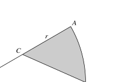{.note-figure fig-alt="Original extracted sector diagram for 2020 May June Paper 1 Question 7"}

In the diagram, $OAB$ is a sector of a circle with centre $O$ and radius $2r$, and angle $AOB=\frac16\pi$ radians. The point $C$ is the midpoint of $OA$.

(a) Show that the exact length of $BC$ is $r\sqrt{5-2\sqrt3}$. **[2]**

Show detailed mark scheme answer

In triangle $OCB$, $OC=r$, $OB=2r$ and $\angle COB=\frac{\pi}{6}$. By the cosine rule,

$$BC^2=r^2+(2r)^2-2(r)(2r)\cos\frac{\pi}{6}
=r^2(5-2\sqrt3).$$

Since length is positive,

$$\boxed{BC=r\sqrt{5-2\sqrt3}}.$$

<label class="done-toggle"><input type="checkbox" data-progress="p1-cm-q01"> Completed</label>

<strong>Source:</strong> PastPaper/2020/2020/9709-s20-qp-12.pdf, Q7, and matching 9709-s20-ms-12.pdf.

:::

::: {.question-card #p1-cm-q02}
### Question 2 · 9709/11/O/N/20 Q10(a–b)

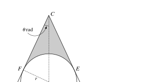{.note-figure fig-alt="Original extracted tangent-circle sector diagram for 2020 October November Paper 1 Question 10"}

The diagram shows a sector $CAB$ which is part of a circle with centre $C$. A circle with centre $O$ and radius $r$ lies within the sector and touches it at $D$, $E$ and $F$, where $COD$ is a straight line and $\angle ACD=\theta$ radians.

(a) Find $CD$ in terms of $r$ and $\sin\theta$. **[3]**

(b) It is now given that $r=4$ and $\theta=\frac16\pi$. Find the perimeter of sector $CAB$ in terms of $\pi$. **[3]**

Show detailed mark scheme answer

(a) In the right triangle formed by dropping a perpendicular from $O$ to a side,

$$r=CO\sin\theta\Longrightarrow CO=\frac{r}{\sin\theta}.$$

Since $C,O,D$ are collinear and $OD=r$,

$$\boxed{CD=CO+OD=\frac{r(1+\sin\theta)}{\sin\theta}}.$$

(b) With $r=4$ and $\theta=\pi/6$,

$$CD=\frac{4(1+\frac12)}{\frac12}=12.$$

The sector angle is $2\theta=\pi/3$, so the arc length is $12(\pi/3)=4\pi$. Therefore

$$\boxed{\text{perimeter}=12+12+4\pi=24+4\pi}.$$

<label class="done-toggle"><input type="checkbox" data-progress="p1-cm-q02"> Completed</label>

<strong>Source:</strong> PastPaper/2020/2020/9709_w20_qp_11.pdf, Q10(a–b), and matching 9709_w20_ms_11.pdf.

:::

::: {.question-card #p1-cm-q03}
### Question 3 · 9709/12/O/N/20 Q8(a–b)

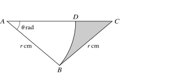{.note-figure fig-alt="Original extracted triangle and sector diagram for 2020 October November Paper 1 Question 8"}

{.note-figure fig-alt="Original extracted isosceles triangle and sector diagram for 2020 October November Paper 1 Question 8"}

In the diagram, $ABC$ is an isosceles triangle with $AB=BC=r$ cm and angle $BAC=\theta$ radians. The point $D$ lies on $AC$ and $ABD$ is a sector of a circle with centre $A$.

(a) Express the area of the shaded region in terms of $r$ and $\theta$. **[3]**

(b) In the case where $r=10$ and $\theta=0.6$, find the perimeter of the shaded region. **[4]**

Show detailed mark scheme answer

The angles at $A$ and $C$ are both $\theta$, so $\angle ABC=\pi-2\theta$. Hence

$$A_{ABC}=\frac12r^2\sin(\pi-2\theta)=\frac12r^2\sin2\theta.$$

The sector $ABD$ has radius $r$ and angle $\theta$, so

$$A_{ABD}=\frac12r^2\theta.$$

Thus

$$\boxed{A_{\text{shaded}}=\frac12r^2(\sin2\theta-\theta)}.$$

(b) Here $AC=2r\cos\theta=20\cos0.6$, so $CD=AC-AD=20\cos0.6-10$. The sector arc $BD$ has length $10(0.6)=6$. Hence

$$
\boxed{P=10+(20\cos0.6-10)+6=22.5\text{ cm (3 s.f.)}}.
$$

<label class="done-toggle"><input type="checkbox" data-progress="p1-cm-q03"> Completed</label>

<strong>Source:</strong> PastPaper/2020/2020/9709_w20_qp_12.pdf, Q8(a–b), and matching 9709_w20_ms_12.pdf.

:::

::: {.question-card #p1-cm-q04}
### Question 4 · 9709/13/O/N/20 Q9(a–c)

In the diagram, arc $AB$ is part of a circle with centre $O$ and radius $8$ cm. Arc $BC$ is part of a circle with centre $A$ and radius $12$ cm, where $AOC$ is a straight line.

(a) Find angle $BAO$ in radians. **[2]**

(b) Find the area of the shaded region. **[4]**

(c) Find the perimeter of the shaded region. **[3]**

Show detailed mark scheme answer

Because $AO=OB=8$ and $AB=12$, the cosine rule in triangle $AOB$ gives

$$\cos\angle BAO=\frac{12^2+8^2-8^2}{2(12)(8)}=\frac34.$$

Therefore

$$\boxed{\angle BAO=\cos^{-1}\frac34=0.723\text{ rad (3 s.f.)}}.$$

Let $\alpha=\cos^{-1}(3/4)$. The shaded area is the sector $ABC$ of radius $12$ minus triangle $AOB$:

$$
\begin{aligned}
A&=\frac12(12)^2\alpha-\frac12(8)^2\sin(\pi-2\alpha)\\
&=72\alpha-32\sin2\alpha\\
&=\boxed{20.3\text{ cm}^2\text{ (3 s.f.)}}.
\end{aligned}
$$

The perimeter is $BO+OC+$ arc $BC=8+4+12\alpha$, so

$$
\boxed{P=20.7\text{ cm (3 s.f.)}}.
$$

<label class="done-toggle"><input type="checkbox" data-progress="p1-cm-q04"> Completed</label>

<strong>Source:</strong> PastPaper/2020/2020/9709_w20_qp_13.pdf, Q9(a–c), and matching 9709_w20_ms_13.pdf.

:::

::: {.question-card #p1-cm-q05}
### Question 5 · 9709/11/M/J/21 Q8(a–b)

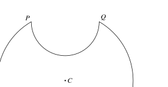{.note-figure fig-alt="Original extracted symmetrical plate diagram for 2021 May June Paper 1 Question 8"}

The diagram shows a symmetrical metal plate made by removing two identical pieces from a circular disc with centre $C$. The radius of the circle with centre $C$ is $4$ cm, and $PQ=RS=4$ cm.

(a) Show that angle $PCS=\frac23\pi$ radians. **[2]**

(b) Find the exact perimeter of the plate. **[3]**

Show detailed mark scheme answer

The chord $PS$ has length $4$ in a circle of radius $4$:

$$4=2(4)\sin\frac{\angle PCS}{2}.$$

The angle shown is obtuse, so $\angle PCS/2=\pi/3$ and

$$\boxed{\angle PCS=\frac{2\pi}{3}}.$$

The two original-circle arcs have total length $2(4)(2\pi/3)=16\pi/3$. Each semicircle has diameter $4$ and length $2\pi$, so the two semicircles contribute $4\pi$. Thus

$$\boxed{\text{perimeter}=\frac{28\pi}{3}\text{ cm}}.$$

<label class="done-toggle"><input type="checkbox" data-progress="p1-cm-q05"> Completed</label>

<strong>Source:</strong> PastPaper/2021/2021/9709_s21_qp_11.pdf, Q8(a–b), and matching 9709_s21_ms_11.pdf.

:::

::: {.question-card #p1-cm-q06}
### Question 6 · 9709/13/M/J/21 Q5(a–b)

The diagram shows a triangle $ABC$ in which angle $ABC=90^\circ$ and $AB=4$ cm. The sector $ABD$ is part of a circle with centre $A$. The area of the sector is $10$ cm$^2$.

(a) Find angle $BAD$ in radians. **[2]**

(b) Find the perimeter of the shaded region. **[4]**

Show detailed mark scheme answer

From the sector area,

$$\frac12(4)^2\theta=10\Longrightarrow \boxed{\theta=1.25\text{ rad}}.$$

The arc $BD$ has length $4(1.25)=5$. Also

$$BC=4\tan(1.25)=12.04\ldots,$$

and

$$CD=\frac{4}{\cos(1.25)}-4\cos(1.25)=8.69\ldots.$$

Therefore

$$\boxed{\text{perimeter}=5+12.04\ldots+8.69\ldots=25.7\text{ cm}}.$$

<label class="done-toggle"><input type="checkbox" data-progress="p1-cm-q06"> Completed</label>

<strong>Source:</strong> PastPaper/2021/2021/9709_s21_qp_13.pdf, Q5(a–b), and matching 9709_s21_ms_13.pdf.

:::

::: {.question-card #p1-cm-q07}
### Question 7 · 9709/12/M/J/21 Q12(a–c)

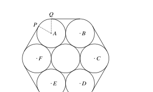{.note-figure fig-alt="Original extracted seven-pipe rope diagram for 2021 May June Paper 1 Question 12"}

Seven cylindrical pipes each have radius $20$ cm. The centres of the six outer pipes are $A,B,C,D,E,F$. A thin rope is wrapped tightly around the pipes.

(a) Show that angle $PAQ=\frac13\pi$ radians. **[2]**

(b) Find the length of the rope. **[4]**

(c) Find the area of hexagon $ABCDEF$, giving your answer in terms of $\sqrt3$. **[2]**

Show detailed mark scheme answer

The six equal angles make a complete turn:

$$6\angle PAQ=2\pi\Longrightarrow \boxed{\angle PAQ=\frac{\pi}{3}}.$$

Adjacent outer centres are $40$ cm apart. The six straight sections therefore total $6(40)=240$ cm. The six exposed arcs total

$$6\left(20\cdot\frac{\pi}{3}\right)=40\pi.$$

Thus

$$\boxed{\text{rope length}=240+40\pi\text{ cm}}.$$

The regular hexagon is six equilateral triangles of side $40$:

$$6\left(\frac12\cdot40^2\sin\frac{\pi}{3}\right)
=\boxed{2400\sqrt3\text{ cm}^2}.$$

<label class="done-toggle"><input type="checkbox" data-progress="p1-cm-q07"> Completed</label>

<strong>Source:</strong> PastPaper/2021/2021/9709_s21_qp_12.pdf, Q12(a–c), and matching 9709_s21_ms_12.pdf.

:::

::: {.question-card #p1-cm-q08}
### Question 8 · 9709/12/O/N/21 Q7(a–b)

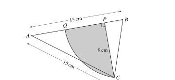{.note-figure fig-alt="Original extracted triangle and arc diagram for 2021 October November Paper 1 Question 7"}

In the diagram, $AB=AC=15$ cm. $P$ is the foot of the perpendicular from $C$ to $AB$, $CP=9$ cm. An arc of a circle with centre $B$ passes through $C$ and meets $AB$ at $Q$.

(a) Show that angle $ABC=1.25$ radians, correct to 3 significant figures. **[2]**

(b) Calculate the area of the shaded region bounded by the arc $CQ$ and the lines $CP$ and $PQ$. **[4]**

Show detailed mark scheme answer

$$AP=\sqrt{15^2-9^2}=12,\qquad BP=15-12=3.$$

Hence

$$\boxed{\angle ABC=\tan^{-1}\frac93=1.249\ldots=1.25\text{ rad}}.$$

Also $BC=\sqrt{3^2+9^2}=\sqrt{90}$. The shaded region is the sector $CBQ$ minus triangle $BCP$:

$$A_{\text{sector}}=\frac12(\sqrt{90})^2\tan^{-1}3=45\tan^{-1}3,$$

$$A_{\triangle BCP}=\frac12(3)(9)=13.5.$$

Therefore

$$\boxed{A=45\tan^{-1}3-13.5=42.7\text{ cm}^2\text{ (3 s.f.)}}.$$

<label class="done-toggle"><input type="checkbox" data-progress="p1-cm-q08"> Completed</label>

<strong>Source:</strong> PastPaper/2021/2021/9709_w21_qp_12.pdf, Q7(a–b), and matching 9709_w21_ms_12.pdf.

:::

::: {.question-card #p1-cm-q09}
### Question 9 · 9709/11/M/J/22 Q5(a–b)

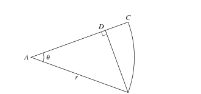{.note-figure fig-alt="Original extracted sector and perpendicular diagram for 2022 May June Paper 1 Question 5"}

The diagram shows a sector $ABC$ of a circle with centre $A$ and radius $r$. $BD$ is perpendicular to $AC$. Angle $CAB=\theta$ radians.

(a) Given $\theta=\frac16\pi$, find the exact area of $BCD$ in terms of $r$. **[3]**

(b) Given instead that the length of $BD=\frac{\sqrt3}{2}r$, find the exact perimeter of $BCD$ in terms of $r$. **[4]**

Show detailed mark scheme answer

(a)

$$A_{\text{sector}}=\frac12r^2\cdot\frac{\pi}{6}=\frac{\pi r^2}{12}.$$

Also $BD=r/2$ and $AD=\sqrt3r/2$, so

$$A_{\triangle ABD}=\frac12\cdot\frac r2\cdot\frac{\sqrt3r}{2}=\frac{\sqrt3}{8}r^2.$$

Therefore

$$\boxed{A_{BCD}=\left(\frac{\pi}{12}-\frac{\sqrt3}{8}\right)r^2}.$$

(b) Since $BD=r\sin\theta=\sqrt3r/2$, $\theta=\pi/3$. Then $AD=r/2$, $CD=r/2$, $BD=\sqrt3r/2$, and arc $BC=r\theta=\pi r/3$. Hence

$$\boxed{\text{perimeter}=\left(\frac{\sqrt3}{2}+\frac12+\frac{\pi}{3}\right)r}.$$

<label class="done-toggle"><input type="checkbox" data-progress="p1-cm-q09"> Completed</label>

<strong>Source:</strong> PastPaper/2022/2022/9709_s22_qp_11.pdf, Q5(a–b), and matching 9709_s22_ms_11.pdf.

:::

::: {.question-card #p1-cm-q10}
### Question 10 · 9709/12/M/J/22 Q7(a–b)

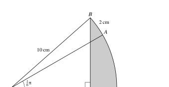{.note-figure fig-alt="Original extracted sector and chord diagram for 2022 May June Paper 1 Question 7"}

The diagram shows a sector $OBAC$ of a circle with centre $O$ and radius $10$ cm. $P$ lies on $OC$ and $BP$ is perpendicular to $OC$. Angle $AOC=\frac16\pi$ and the length of arc $AB$ is $2$ cm.

(a) Find angle $BOC$. **[2]**

(b) Hence find the area of the shaded region $BPC$, correct to 3 significant figures. **[4]**

Show detailed mark scheme answer

$$\angle AOB=\frac{2}{10}=0.2.$$

From the diagram,

$$\boxed{\angle BOC=\frac{\pi}{6}+0.2=\frac{5\pi+6}{30}=0.724\text{ rad}}.$$

Let $\phi=(5\pi+6)/30$. Then $BP=10\sin\phi$ and $OP=10\cos\phi$. Therefore

$$
A_{BPC}=\frac12(10)^2\phi-\frac12(10\sin\phi)(10\cos\phi)
=11.370\ldots,
$$

so

$$\boxed{A_{BPC}=11.4\text{ cm}^2}.$$

<label class="done-toggle"><input type="checkbox" data-progress="p1-cm-q10"> Completed</label>

<strong>Source:</strong> PastPaper/2022/2022/9709_s22_qp_12.pdf, Q7(a–b), and matching 9709_s22_ms_12.pdf.

:::

::: {.question-card #p1-cm-q11}
### Question 11 · 9709/13/M/J/22 Q9(a–b)

The diagram shows triangle $ABC$ with $AB=BC=6$ cm and angle $ABC=1.8$ radians. The arc $CD$ is part of a circle with centre $A$ and $ABD$ is a straight line.

(a) Find the perimeter of the shaded region. **[5]**

(b) Find the area of the shaded region. **[3]**

Show detailed mark scheme answer

The common radius is

$$AC=2(6)\sin\frac{1.8}{2}=9.40\text{ cm}.$$

The base angle is

$$\angle CAD=\frac{\pi-1.8}{2}=0.6708\text{ rad}.$$

Thus arc $CD$ has length $9.40(0.6708)=6.306\ldots$. Since $AD=AC$ and $AB=6$, $BD=9.40-6=3.40$. Hence

$$\boxed{\text{perimeter}=6+3.40+6.306\ldots=15.7\text{ cm}}.$$

(b) Let $r=AC=12\sin0.9$ and $\beta=(\pi-1.8)/2$. The shaded region is the sector $ACD$ minus triangle $ABC$:

$$
\begin{aligned}
A&=\frac12r^2\beta-\frac12(6)(6)\sin1.8\\
&=\boxed{12.1\text{ cm}^2\text{ (3 s.f.)}}.
\end{aligned}
$$

<label class="done-toggle"><input type="checkbox" data-progress="p1-cm-q11"> Completed</label>

<strong>Source:</strong> PastPaper/2022/2022/9709_s22_qp_13.pdf, Q9(a–b), and matching 9709_s22_ms_13.pdf.

:::

::: {.question-card #p1-cm-q12}
### Question 12 · 9709/11/O/N/22 Q5(a–b)

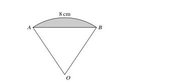{.note-figure fig-alt="Original extracted sector segment diagram for 2022 October November Paper 1 Question 5"}

The diagram shows a sector $OAB$ of a circle with centre $O$. The length of arc $AB$ is $8$ cm and the perimeter of the sector is $20$ cm.

(a) Find the perimeter of the shaded segment. **[4]**

(b) Find the area of the shaded segment. **[2]**

Show detailed mark scheme answer

The two radii total $20-8=12$, so $r=6$. The sector angle is

$$\theta=\frac sr=\frac86=\frac43\text{ rad}.$$

The chord is

$$AB=2(6)\sin\frac23=7.42\ldots,$$

so

$$\boxed{P_{\text{segment}}=8+12\sin\frac23=15.4\text{ cm}}.$$

The sector area is $24$, while

$$A_{\triangle OAB}=\frac12(6)^2\sin\frac43=17.49\ldots.$$

Therefore

$$\boxed{A_{\text{segment}}=24-18\sin\frac43=6.51\text{ cm}^2}.$$

<label class="done-toggle"><input type="checkbox" data-progress="p1-cm-q12"> Completed</label>

<strong>Source:</strong> PastPaper/2022/2022/9709_w22_qp_11.pdf, Q5(a–b), and matching 9709_w22_ms_11.pdf.

:::

::: {.question-card #p1-cm-q13}
### Question 13 · 9709/12/O/N/22 Q10(a–c)

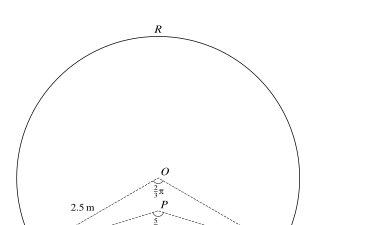{.note-figure fig-alt="Original extracted aircraft cross-section sectors diagram for 2022 October November Paper 1 Question 10"}

The cross-section $RASB$ consists of a sector $OARB$ of radius $2.5$ m with centre $O$, a sector $PASB$ of radius $2.24$ m with centre $P$, and quadrilateral $OAPB$. Angle $AOB=\frac23\pi$ and angle $APB=\frac56\pi$.

(a) Find the perimeter of the cross-section, correct to 2 decimal places. **[3]**

(b) Find the difference in area of triangles $AOB$ and $APB$, correct to 2 decimal places. **[2]**

(c) Find the area of the cross-section, correct to 1 decimal place. **[3]**

Show detailed mark scheme answer

(a)

$$P=2.5\cdot\frac{2\pi}{3}+2.24\cdot\frac{5\pi}{6}
=\boxed{\frac{26\pi}{5}=16.34\text{ m}}.$$

(b)

$$A_{AOB}=\frac12(2.5)^2\sin\frac{2\pi}{3}=2.706\ldots,$$

$$A_{APB}=\frac12(2.24)^2\sin\frac{5\pi}{6}=1.254\ldots.$$

Thus $\boxed{A_{AOB}-A_{APB}=1.45\text{ m}^2}$.

(c) The sector areas are $13.09\ldots$ and $6.57\ldots$. Add the difference from (b):

$$\boxed{A_{RASB}=13.09+6.57+1.45=21.1\text{ m}^2}.$$

<label class="done-toggle"><input type="checkbox" data-progress="p1-cm-q13"> Completed</label>

<strong>Source:</strong> PastPaper/2022/2022/9709_w22_qp_12.pdf, Q10(a–c), and matching 9709_w22_ms_12.pdf.

:::

::: {.question-card #p1-cm-q14}
### Question 14 · 9709/12/F/M/23 Q8(a–b)

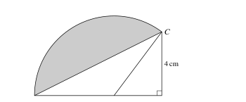{.note-figure fig-alt="Original extracted triangle and sector diagram for 2023 February March Paper 1 Question 8"}

In the diagram, triangle $ABC$ has right angle $B$, $AB=8$ cm and $BC=4$ cm. Point $D$ on $AB$ satisfies $AD=5$ cm. The sector $DAC$ is part of a circle with centre $D$.

(a) Find the perimeter of the shaded region. **[5]**

(b) Find the area of the shaded region. **[3]**

Show detailed mark scheme answer

In right triangle $BDC$,

$$\angle BDC=\tan^{-1}\frac43=0.9273\ldots,\qquad
\angle ADC=\pi-\angle BDC=2.214\ldots.$$

The arc has radius $DA=5$, so arc $AC=5(2.214\ldots)=11.07\ldots$. Also $AC=\sqrt{8^2+4^2}=8.94\ldots$. Therefore

$$\boxed{P=11.07\ldots+8.94\ldots=20.0\text{ cm}}.$$

The sector area is $\frac12(5)^2(2.214\ldots)=27.7\ldots$, and triangle $ADC$ has area $\frac12(5)(4)=10$. Hence

$$\boxed{A_{\text{shaded}}=27.7\ldots-10=17.7\text{ cm}^2}.$$

<label class="done-toggle"><input type="checkbox" data-progress="p1-cm-q14"> Completed</label>

<strong>Source:</strong> PastPaper/2023/2023/9709_m23_qp_12.pdf, Q8(a–b), and matching 9709_m23_ms_12.pdf.

:::

::: {.question-card #p1-cm-q15}
### Question 15 · 9709/11/M/J/23 Q4

The diagram shows a sector $ABC$ of radius $8$ cm with centre $A$. The area of the sector is $\frac{16\pi}{3}$ cm$^2$. Point $D$ lies on the arc $BC$.

Find the perimeter of the segment $BCD$. **[4]**

Show detailed mark scheme answer

$$\frac12(8)^2\theta=\frac{16\pi}{3}\Longrightarrow\theta=\frac{\pi}{6}.$$

The arc length is $8(\pi/6)=4\pi/3$. The chord is

$$BC=2(8)\sin\frac{\pi}{12}=16\sin15^\circ.$$

Therefore

$$\boxed{P=\frac{4\pi}{3}+16\sin15^\circ=8.33\text{ cm}}.$$

<label class="done-toggle"><input type="checkbox" data-progress="p1-cm-q15"> Completed</label>

<strong>Source:</strong> PastPaper/2023/2023/9709_s23_qp_11.pdf, Q4, and matching 9709_s23_ms_11.pdf.

:::

::: {.question-card #p1-cm-q16}
### Question 16 · 9709/12/M/J/23 Q6(a–b)

The diagram shows a sector $OAB$ with centre $O$. Angle $AOB=\theta$ radians and $OP=AP=x$.

(a) Show that the arc length $AB$ is $2x\theta\cos\theta$. **[2]**

(b) Find the area of the shaded region $APB$ in terms of $x$ and $\theta$. **[4]**

Show detailed mark scheme answer

In the isosceles triangle used in the diagram, $OA=2x\cos\theta$. Hence

$$\boxed{\text{arc }AB=OA\theta=2x\theta\cos\theta}.$$

The sector area is

$$\frac12(2x\cos\theta)^2\theta=2x^2\theta\cos^2\theta.$$

The triangle removed from the sector has area

$$\frac12(2x\cos\theta)(x\sin\theta)=x^2\sin\theta\cos\theta.$$

Therefore

$$\boxed{A_{APB}=2x^2\theta\cos^2\theta-x^2\sin\theta\cos\theta}.$$

<label class="done-toggle"><input type="checkbox" data-progress="p1-cm-q16"> Completed</label>

<strong>Source:</strong> PastPaper/2023/2023/9709_s23_qp_12.pdf, Q6(a–b), and matching 9709_s23_ms_12.pdf.

:::

::: {.question-card #p1-cm-q17}
### Question 17 · 9709/13/M/J/23 Q6(a–b)

The diagram shows a sector $OAB$ of radius $r$ cm and angle $\theta$ radians. The arc length is $9.6$ cm and the sector area is $76.8$ cm$^2$.

(a) Find the area of the shaded region. **[5]**

(b) Find the perimeter of the shaded region. **[2]**

Show detailed mark scheme answer

Since $A/s=r/2$, we have $76.8/9.6=8$, so $r=16$ cm. Then $\theta=9.6/16=0.6$ rad.

The sector area is $76.8$ and the triangle area is

$$\frac12(16)^2\sin0.6=72.27\ldots.$$

Thus

$$\boxed{A_{\text{shaded}}=76.8-72.27\ldots=4.53\text{ cm}^2}.$$

The chord is $2(16)\sin0.3=9.46\ldots$, so

$$\boxed{P=9.6+9.46\ldots=19.1\text{ cm}}.$$

<label class="done-toggle"><input type="checkbox" data-progress="p1-cm-q17"> Completed</label>

<strong>Source:</strong> PastPaper/2023/2023/9709_s23_qp_13.pdf, Q6(a–b), and matching 9709_s23_ms_13.pdf.

:::

::: {.question-card #p1-cm-q18}
### Question 18 · 9709/11/O/N/23 Q6(a–c)

The motif is formed by the major arc $AB$ of a circle with radius $r$ and centre $O$, and the minor arc $AOB$ of another circle with radius $r$ and centre $C$. Point $C$ lies on the circle with centre $O$.

(a) Given angle $ACB=k\pi$ radians, state $k$. **[1]**

(b) State the perimeter of the shaded motif in terms of $\pi$ and $r$. **[1]**

(c) Find the area of the shaded motif in terms of $\pi$, $r$ and $\sqrt3$. **[5]**

Show detailed mark scheme answer

The equal radii give the equilateral-triangle configuration, so

$$\boxed{k=\frac23}.$$

The two arcs together have length one full circumference:

$$\boxed{P=2\pi r}.$$

The major sector has angle $4\pi/3$ and area $2\pi r^2/3$. Each removed segment has area

$$\frac{\pi r^2}{6}-\frac{\sqrt3r^2}{4}.$$

Therefore

$$\boxed{A=\frac{2\pi r^2}{3}
-2\left(\frac{\pi r^2}{6}-\frac{\sqrt3r^2}{4}\right)
=\frac{\pi r^2}{3}+\frac{\sqrt3r^2}{2}}.$$

<label class="done-toggle"><input type="checkbox" data-progress="p1-cm-q18"> Completed</label>

<strong>Source:</strong> PastPaper/2023/2023/9709_w23_qp_11.pdf, Q6(a–c), and matching 9709_w23_ms_11.pdf.

:::

::: {.question-card #p1-cm-q19}
### Question 19 · 9709/13/M/J/24 Q3(a–b)

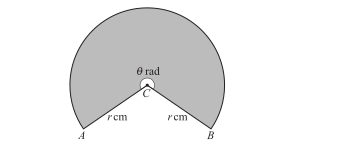{.note-figure fig-alt="Original extracted reflex sector diagram for 2024 May June Paper 1 Question 3"}

The sector has centre $C$, radii $CA=CB=r$ cm, and reflex angle $ACB=\theta$ radians. Its perimeter is $65$ cm and its area is $225$ cm$^2$.

(a) Find $r$ and $\theta$. **[4]**

(b) Find the area of triangle $ACB$. **[2]**

Show detailed mark scheme answer

The equations are

$$2r+r\theta=65,\qquad \frac12r^2\theta=225.$$

Thus $r\theta=450/r$ and

$$2r+\frac{450}{r}=65
\Longrightarrow 2r^2-65r+450=0
\Longrightarrow (2r-45)(r-10)=0.$$

The reflex-angle condition selects $r=10$ rather than $22.5$. Hence

$$\boxed{r=10\text{ cm},\qquad\theta=\frac{450}{100}=4.5\text{ rad}}.$$

The triangle uses the smaller angle $2\pi-\theta$:

$$\boxed{A_{\triangle ACB}=\frac12(10)^2\sin(2\pi-4.5)=48.9\text{ cm}^2}.$$

<label class="done-toggle"><input type="checkbox" data-progress="p1-cm-q19"> Completed</label>

<strong>Source:</strong> PastPaper/2024/2024/qp-202406-mathematics-p13.pdf, Q3(a–b), and matching ms-202406-mathematics-p13.pdf.

:::

::: {.question-card #p1-cm-q20}
### Question 20 · 9709/11/O/N/24 Q3

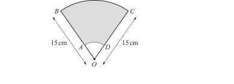{.note-figure fig-alt="Original extracted annular sector diagram for 2024 October November Paper 1 Question 3"}

The diagram shows a sector with centre $O$, where $OB=OC=15$ cm and angle $BOC=\frac25\pi$ radians. Points $A$ and $D$ are joined by an arc of a circle with centre $O$. The shaded region has area $\frac{209}{5}\pi$ cm$^2$.

Find the perimeter of the shaded region, giving your answer in terms of $\pi$. **[5]**

Show detailed mark scheme answer

Let the inner radius be $x$. The area equation is

$$\frac12(15)^2\frac{2\pi}{5}-\frac12x^2\frac{2\pi}{5}
=\frac{209}{5}\pi.$$

This gives

$$45\pi-\frac{x^2\pi}{5}=\frac{209\pi}{5}
\Longrightarrow x^2=16\Longrightarrow x=4.$$

The straight sections total $2(15-4)=22$. The outer and inner arcs total

$$15\frac{2\pi}{5}+4\frac{2\pi}{5}=6\pi+\frac{8\pi}{5}.$$

Therefore

$$\boxed{P=22+\frac{38\pi}{5}\text{ cm}}.$$

<label class="done-toggle"><input type="checkbox" data-progress="p1-cm-q20"> Completed</label>

<strong>Source:</strong> PastPaper/2024/2024/qp-202410-mathematics-p11.pdf, Q3, and matching ms-202410-mathematics-p11.pdf.

:::

## 3. Quick checklist

- [ ] radians 与 degrees conversion
- [ ] $s=r\theta$
- [ ] $A=\frac12r^2\theta$
- [ ] chord、triangle、sector 与 segment 的关系
- [ ] perimeter 中只计算真实边界
- [ ] exact form 与 decimal accuracy
