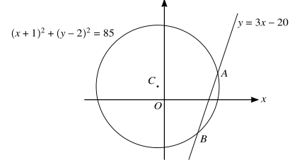
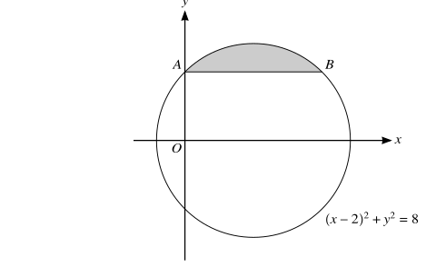
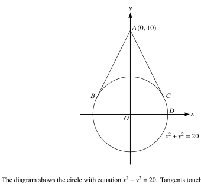
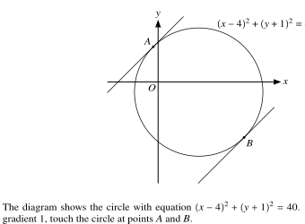

::: {.callout-important}
## 本节考纲要求

本页依据 9709 Mathematics 2026–2027 syllabus 1.3 Coordinate geometry：

- 使用 $y=mx+c$、$y-y_1=m(x-x_1)$、$ax+by+c=0$ 等直线形式；
- 计算 gradient、distance、midpoint，并判断 parallel/perpendicular；
- 理解 $(x-a)^2+(y-b)^2=r^2$ 及 expanded circle equation；
- 用 algebraic methods 处理 lines and circles，包括 tangent perpendicular to radius、angle in a semicircle 和 symmetry；
- 用交点的代数方程理解 graph 与 equation 的关系。

下列 20 组题目均来自工作区保存的 Paper 1 原始 past-paper PDF。题干只把 PDF 排版符号整理为 LaTeX，没有改写或编造题目；答案按对应 mark scheme 的步骤展开。题目中的必要图形均从原始 PDF 独立提取为 SVG，不使用整页截图。
:::

## 1. Core knowledge

::: {.study-card}
### Lines and gradients

两点 $(x_1,y_1)$、$(x_2,y_2)$ 的 gradient 是

$$m=\frac{y_2-y_1}{x_2-x_1}.$$

因此：

$$
\text{parallel}\Longleftrightarrow m_1=m_2,
\qquad
\text{perpendicular}\Longleftrightarrow m_1m_2=-1.
$$

过 $(x_1,y_1)$ 且 gradient 为 $m$ 的直线写成

$$y-y_1=m(x-x_1).$$

Vertical line 要单独写成 $x=a$，不能强行写成 $y=mx+c$。
:::

::: {.formula-panel}
### Circles

标准式

$$
(x-a)^2+(y-b)^2=r^2
$$

的 centre 是 $(a,b)$，radius 是 $r$。一般式

$$x^2+y^2+2gx+2fy+c=0$$

可通过 completing the square 化为标准式。圆上点 $P$ 处的 tangent 与 radius $CP$ perpendicular；因此先求 centre，再用 perpendicular gradient 或点到直线距离，通常是最稳妥的方法。
:::

::: {.study-card}
### Intersections and tangency

求 line 与 circle 的交点时，把 line equation 代入 circle equation，得到关于 $x$ 或 $y$ 的 quadratic。两 distinct intersections 对应 two distinct real roots；tangent 对应 repeated root，也就是 discriminant 为 0。

若圆心为 $C$，直线为 $ax+by+c=0$，圆心到直线的距离为

$$
d=\frac{|a x_C+b y_C+c|}{\sqrt{a^2+b^2}}.
$$

当直线是 tangent 时，$d=r$。
:::

::: {.study-card}
### Perpendicular bisector and circle geometry

线段 $AB$ 的 perpendicular bisector：

1. 求 midpoint $M$；
2. 求 $AB$ 的 gradient；
3. 取 perpendicular gradient；
4. 写出经过 (M) 的直线。

圆的 diameter 的 midpoint 是 centre；若 $AB$ 是 diameter，则 centre 是 $AB$ 的 midpoint，radius 是 $AB/2$。
:::

::: {.formula-panel}
### Coordinate formula toolkit

两点 $A(x_1,y_1)$、$B(x_2,y_2)$ 之间的 distance 与 midpoint 为

$$
AB=\sqrt{(x_2-x_1)^2+(y_2-y_1)^2},qquad
M=\left(\frac{x_1+x_2}{2},\frac{y_1+y_2}{2}\right).
$$

直线可以写成 $y=mx+c$、$y-y_1=m(x-x_1)$ 或 $ax+by+c=0$。Vertical line 必须写成 $x=k$；parallel lines 有相同 gradient，perpendicular lines 满足 $m_1m_2=-1$。
:::

::: {.study-card}
### Circle methods

标准圆方程

$$
(x-a)^2+(y-b)^2=r^2
$$

的 centre 是 $(a,b)$，radius 是 $r$。一般式

$$x^2+y^2+2fx+2gy+c=0$$

要分别对 $x$、$y$ completing the square。若直线与圆相交，把直线代入圆方程；two intersections、tangent 和 no intersection 分别对应 quadratic 的 $\Delta>0$、$\Delta=0$ 和 $\Delta<0$。

圆上点的 tangent perpendicular to the radius。求 tangent 时可先求 radius gradient，再取 negative reciprocal；也可以使用 centre 到直线的 perpendicular distance 等于 $r$。
:::

## 2. Verified Paper 1 past-paper questions

::: {.question-card #p1-cg-q01}
### Question 1 · 9709/11/O/N/20 Q5(a–b)

The equation of a line is $y=mx+c$, where $m$ and $c$ are constants, and the equation of a curve is $xy=16$.

(a) Given that the line is a tangent to the curve, express $m$ in terms of $c$. **[3]**

(b) Given instead that $m=-4$, find the set of values of $c$ for which the line intersects the curve at two distinct points. **[3]**

Show detailed mark scheme answer

The curve can be written as $y=16/x$. At an intersection with $y=mx+c$,

$$x(mx+c)=16,$$

so

$$mx^2+cx-16=0.
$$

(a) Tangency means a repeated root, so

$$c^2-4(m)(-16)=0\Longrightarrow c^2+64m=0.$$

Hence

$$\boxed{m=-\frac{c^2}{64}}.
$$

(b) With $m=-4$,

$$-4x^2+cx-16=0,$$

or equivalently $4x^2-cx+16=0$. For two distinct points,

$$c^2-4(4)(16)>0\Longrightarrow c^2>256.$$

Therefore

$$\boxed{c<-16\text{ or }c>16}.$$

<label class="done-toggle"><input type="checkbox" data-progress="p1-cg-q01"> Completed</label>

<strong>Source:</strong> `PastPaper/2020/2020/9709_w20_qp_11.pdf`, Q5(a–b), and matching `9709_w20_ms_11.pdf`.

:::

::: {.question-card #p1-cg-q02}
### Question 2 · 9709/11/O/N/20 Q10(a–c)

The coordinates of the points $A$ and $B$ are $(-1,-2)$ and $(7,4)$ respectively.

(a) Find the equation of the circle $C$, for which $AB$ is a diameter. **[4]**

(b) Find the equation of the tangent $T$ to circle $C$ at the point $B$. **[4]**

(c) Find the equation of the circle which is the reflection of circle $C$ in the line $T$. **[3]**

Show detailed mark scheme answer

(a) The midpoint of (AB) is

$$C=\left(\frac{-1+7}{2},\frac{-2+4}{2}\right)=(3,1).$$

Also,

$$AB^2=(7+1)^2+(4+2)^2=8^2+6^2=100,$$

so the radius is (5). Therefore

$$\boxed{(x-3)^2+(y-1)^2=25}.
$$

(b) The radius $CB$ has gradient $\frac68=\frac34$. The tangent gradient is $-\frac43$, so

$$y-4=-\frac43(x-7).$$

Hence

$$\boxed{4x+3y=40}.
$$

(c) Reflect the centre $C=(3,1)$ in $4x+3y-40=0$. The perpendicular distance calculation gives the reflected centre

$$C'=(11,7).$$

Reflection preserves the radius, so the reflected circle is

$$\boxed{(x-11)^2+(y-7)^2=25}.
$$

<label class="done-toggle"><input type="checkbox" data-progress="p1-cg-q02"> Completed</label>

<strong>Source:</strong> `PastPaper/2020/2020/9709_w20_qp_11.pdf`, Q10(a–c), and matching `9709_w20_ms_11.pdf`.

:::

::: {.question-card #p1-cg-q03}
### Question 3 · 9709/12/M/J/20 Q11(a–d)

The equation of a circle with centre (C) is

$$x^2+y^2-8x+4y-5=0.$$

(a) Find the radius of the circle and the coordinates of (C). **[3]**

The point (P(1,2)) lies on the circle.

(b) Show that the equation of the tangent to the circle at $P$ is $4y=3x+5$. **[3]**

The point (Q) also lies on the circle and (PQ) is parallel to the (x)-axis.

(c) Write down the coordinates of (Q). **[2]**

The tangents to the circle at (P) and (Q) meet at (T).

(d) Find the coordinates of (T). **[3]**

Show detailed mark scheme answer

(a)

$$x^2-8x+y^2+4y-5=0
\Longrightarrow (x-4)^2+(y+2)^2=25.
$$

Thus $\boxed{C=(4,-2)}$ and $\boxed{r=5}$.

(b) The radius $CP$ has vector $(-3,4)$, so its gradient is $-\frac43$. The tangent gradient is $\frac34$. Through $P=(1,2)$,

$$y-2=\frac34(x-1)\Longrightarrow \boxed{4y=3x+5}.
$$

(c) Since $PQ$ is horizontal, $y_Q=2$. Substitution into the circle gives

$$
(x-4)^2+16=25\Longrightarrow x-4=\pm3.
$$

The point different from $P$ is $\boxed{Q=(7,2)}$.

(d) The tangent at (Q) has gradient (-3/4), so

$$y-2=-\frac34(x-7)\Longrightarrow 3x+4y=29.
$$

Together with $4y=3x+5$,

$$6x=34\Longrightarrow x=\frac{17}{3},\qquad y=\frac{11}{2}.
$$

Therefore $\boxed{T=(17/3,11/2)}$.

<label class="done-toggle"><input type="checkbox" data-progress="p1-cg-q03"> Completed</label>

<strong>Source:</strong> `PastPaper/2020/2020/9709-s20-qp-12.pdf`, Q11(a–d), and matching `9709-s20-ms-12.pdf`.

:::

::: {.question-card #p1-cg-q04}
### Question 4 · 9709/13/M/J/20 Q10(a–b)

The coordinates of two points $A$ and $B$ are $(-7,3)$ and $(5,11)$ respectively.

(a) Show that the equation of the perpendicular bisector of $AB$ is $3x+2y=11$. **[4]**

(b) A circle passes through $A$ and $B$ and its centre lies on the line $12x-5y=70$. Find an equation of the circle. **[5]**

Show detailed mark scheme answer

(a) The midpoint is

$$M=\left(\frac{-7+5}{2},\frac{3+11}{2}\right)=(-1,7).$$

The gradient of $AB$ is $\frac8{12}=\frac23$, so the perpendicular gradient is $-\frac32$. Hence

$$y-7=-\frac32(x+1)\Longrightarrow \boxed{3x+2y=11}.
$$

(b) The centre lies on both $3x+2y=11$ and $12x-5y=70$. Solving,

$$\boxed{C=(5,-2)}.
$$

The radius squared using (A) is

$$r^2=(5+7)^2+(-2-3)^2=144+25=169.$$

Therefore

$$\boxed{(x-5)^2+(y+2)^2=169}.
$$

<label class="done-toggle"><input type="checkbox" data-progress="p1-cg-q04"> Completed</label>

<strong>Source:</strong> `PastPaper/2020/2020/9709-s20-qp-13.pdf`, Q10(a–b), and matching `9709-s20-ms-13.pdf`.

:::

::: {.question-card #p1-cg-q05}
### Question 5 · 9709/12/F/M/21 Q8(a–b)

The points $A=(7,1)$, $B=(7,9)$ and $C=(1,9)$ are on the circumference of a circle.

(a) Find an equation of the circle. **[5]**

(b) Find an equation of the tangent to the circle at (B). **[2]**

Show detailed mark scheme answer

Since $AB$ is vertical, its perpendicular bisector is $y=5$. Since $BC$ is horizontal, its perpendicular bisector is $x=4$. Thus the centre is $O=(4,5)$.

The radius squared is

$$r^2=(7-4)^2+(1-5)^2=9+16=25.$$

Therefore

$$\boxed{(x-4)^2+(y-5)^2=25}.
$$

At (B), the radius has gradient (4/3), so the tangent gradient is (-3/4). Hence

$$y-9=-\frac34(x-7),$$

or

$$\boxed{3x+4y=57}.
$$

<label class="done-toggle"><input type="checkbox" data-progress="p1-cg-q05"> Completed</label>

<strong>Source:</strong> `PastPaper/2021/2021/9709_m21_qp_12.pdf`, Q8(a–b), and matching `9709_m21_ms_12.pdf`.

:::

::: {.question-card #p1-cg-q06}
### Question 6 · 9709/11/M/J/21 Q10(a–b)

The equation of a circle is

$$x^2+y^2-4x+6y-77=0.$$

(a) Find the $x$-coordinates of the points $A$ and $B$ where the circle intersects the $x$-axis. **[2]**

(b) Find the point of intersection of the tangents to the circle at (A) and (B). **[6]**

Show detailed mark scheme answer

(a) On the $x$-axis, $y=0$:

$$x^2-4x-77=0=(x-11)(x+7).
$$

Thus the points are $(-7,0)$ and $(11,0)$, so the $x$-coordinates are $\boxed{-7,11}$.

(b) Complete the square:

$$
(x-2)^2+(y+3)^2=90,
$$

so the centre is $(2,-3)$. At $(-7,0)$, the radius gradient is $-1/3$, so the tangent is $y=3x+21$. At $(11,0)$, the radius gradient is $1/3$, so the tangent is $y=-3x+33$.

Solving,

$$3x+21=-3x+33\Longrightarrow x=2,qquad y=27.
$$

Therefore the tangents meet at $\boxed{(2,27)}$.

<label class="done-toggle"><input type="checkbox" data-progress="p1-cg-q06"> Completed</label>

<strong>Source:</strong> `PastPaper/2021/2021/9709_s21_qp_11.pdf`, Q10(a–b), and matching `9709_s21_ms_11.pdf`.

:::

::: {.question-card #p1-cg-q07}
### Question 7 · 9709/12/O/N/21 Q6

Points $A$ and $B$ have coordinates $(8,3)$ and $(p,q)$ respectively. The equation of the perpendicular bisector of $AB$ is $y=-2x+4$.

Find the values of (p) and (q). **[4]**

Show detailed mark scheme answer

The perpendicular bisector has gradient $-2$, so $AB$ has gradient $1/2$:

$$\frac{q-3}{p-8}=\frac12\Longrightarrow p=2q+2.$$

The midpoint $\left(\frac{8+p}{2},\frac{3+q}{2}\right)$ lies on $y=-2x+4$:

$$\frac{3+q}{2}=-2\left(\frac{8+p}{2}\right)+4=-4-p.
$$

Hence $2p+q=-11$. Combining with $p=2q+2$,

$$q=-3,qquad p=-4.
$$

Therefore $\boxed{p=-4,\ q=-3}$.

<label class="done-toggle"><input type="checkbox" data-progress="p1-cg-q07"> Completed</label>

<strong>Source:</strong> `PastPaper/2021/2021/9709_s21_qp_12.pdf`, Q6, and matching `9709_s21_ms_12.pdf`.

:::

::: {.question-card #p1-cg-q08}
### Question 8 · 9709/11/O/N/21 Q7(a–b)

A circle with centre $(5,2)$ passes through the point $(7,5)$.

(a) Find an equation of the circle. **[2]**

The line $y=5x-10$ intersects the circle at $A$ and $B$.

(b) Find the exact length of the chord $AB$. **[7]**

Show detailed mark scheme answer

(a)

$$r^2=(7-5)^2+(5-2)^2=13,$$

so

$$\boxed{(x-5)^2+(y-2)^2=13}.
$$

(b) Substitute $y=5x-10$:

$$
(x-5)^2+(5x-12)^2=13.
$$

This simplifies to

$$26x^2-130x+156=0
\Longrightarrow (x-2)(x-3)=0.
$$

The intersection points are $(2,0)$ and $(3,5)$. Thus

$$AB=\sqrt{(3-2)^2+(5-0)^2}=\boxed{\sqrt{26}}.$$

<label class="done-toggle"><input type="checkbox" data-progress="p1-cg-q08"> Completed</label>

<strong>Source:</strong> `PastPaper/2021/2021/9709_w21_qp_11.pdf`, Q7(a–b), and matching `9709_w21_ms_11.pdf`.

:::

::: {.question-card #p1-cg-q09}
### Question 9 · 9709/12/F/M/22 Q6(a–b)

{.note-figure fig-alt="Original extracted diagram of a circle and line for 2022 February March Paper 1 Question 6"}

The circle with equation $(x+1)^2+(y-2)^2=85$ and the straight line with equation $y=3x-20$ are shown in the diagram. The line intersects the circle at $A$ and $B$, and the centre of the circle is at $C$.

(a) Find, by calculation, the coordinates of $A$ and $B$. **[4]**

(b) Find an equation of the circle which has its centre at $C$ and for which the line with equation $y=3x-20$ is a tangent to the circle. **[4]**

Show detailed mark scheme answer

(a) Substitute $y=3x-20$:

$$
(x+1)^2+(3x-22)^2=85
\Longrightarrow 10x^2-130x+400=0.
$$

Thus

$$x^2-13x+40=0=(x-5)(x-8).
$$

The corresponding $y$-coordinates are $-5$ and $4$. Hence the two points are

$$\boxed{(5,-5)\text{ and }(8,4)}.
$$

(b) The centre is $C=(-1,2)$. The distance from $C$ to $3x-y-20=0$ is

$$
r=\frac{|3(-1)-2-20|}{\sqrt{3^2+(-1)^2}}=\frac{25}{\sqrt{10}}.
$$

Therefore the required circle is

$$\boxed{(x+1)^2+(y-2)^2=\frac{125}{2}}.
$$

<label class="done-toggle"><input type="checkbox" data-progress="p1-cg-q09"> Completed</label>

<strong>Source:</strong> `PastPaper/2022/2022/9709_m22_qp_12.pdf`, Q6(a–b), and matching `9709_m22_ms_12.pdf`. The diagram is an independently extracted, annotation-cleaned SVG from the original PDF.

:::

::: {.question-card #p1-cg-q10}
### Question 10 · 9709/12/F/M/22 Q8(a–b)

{.note-figure fig-alt="Original extracted diagram of a circle and horizontal chord for 2022 February March Paper 1 Question 8"}

The diagram shows the circle with equation $(x-2)^2+y^2=8$. The chord $AB$ of the circle intersects the positive $y$-axis at $A$ and is parallel to the $x$-axis.

(a) Find, by calculation, the coordinates of $A$ and $B$. **[3]**

Show detailed mark scheme answer

Since $A$ is on the positive $y$-axis, $x=0$. Hence

$$(-2)^2+y^2=8\Longrightarrow y^2=4,$$

so $A=(0,2)$. Because $AB$ is parallel to the $x$-axis, $y_B=2$. Then

$$
(x_B-2)^2+2^2=8\Longrightarrow (x_B-2)^2=4.
$$

The point other than $A$ has $x_B=4$, so

$$\boxed{A=(0,2),\quad B=(4,2)}.
$$

(b) The shaded segment is between the circle and the chord $AB$, and is rotated about the $x$-axis. Since the circle is

$$
y^2=8-(x-2)^2,
$$

the volume is

$$
\begin{aligned}
V&=\pi\int_0^4\left(8-(x-2)^2-2^2\right)dx\\
&=\pi\int_0^4\left(4-(x-2)^2\right)dx
=\boxed{\frac{32\pi}{3}}.
\end{aligned}
$$

<label class="done-toggle"><input type="checkbox" data-progress="p1-cg-q10"> Completed</label>

<strong>Source:</strong> `PastPaper/2022/2022/9709_m22_qp_12.pdf`, Q8(a–b), and matching `9709_m22_ms_12.pdf`. The diagram is an independently extracted, annotation-cleaned SVG from the original PDF.

:::

::: {.question-card #p1-cg-q11}
### Question 11 · 9709/11/M/J/22 Q9(a–b)

The equation of a circle is

$$x^2+y^2+6x-2y-26=0.$$

(a) Find the coordinates of the centre of the circle and the radius. Hence find the coordinates of the lowest point on the circle. **[4]**

(b) Find the set of values of the constant $k$ for which the line $y=kx-5$ intersects the circle at two distinct points. **[6]**

Show detailed mark scheme answer

(a)

$$
(x+3)^2+(y-1)^2=36.
$$

Thus the centre is $(-3,1)$, radius $6$, and the lowest point is

$$\boxed{(-3,-5)}.
$$

(b) Substitute $y=kx-5$:

$$
(1+k^2)x^2+(6-12k)x+9=0.
$$

For two distinct intersections,

$$
\begin{aligned}
\Delta&=(6-12k)^2-36(1+k^2)>0\\
&=36(3k^2-4k)>0\\
&=36k(3k-4)>0.
\end{aligned}
$$

Hence

$$\boxed{k<0\text{ or }k>\frac43}.$$

<label class="done-toggle"><input type="checkbox" data-progress="p1-cg-q11"> Completed</label>

<strong>Source:</strong> `PastPaper/2022/2022/9709_s22_qp_11.pdf`, Q9(a–b), and matching `9709_s22_ms_11.pdf`.

:::

::: {.question-card #p1-cg-q12}
### Question 12 · 9709/11/O/N/22 Q11(a–c)

{.note-figure fig-alt="Original extracted diagram of tangents from a point to a circle for 2022 October November Paper 1 Question 11"}

The diagram shows the circle with equation $x^2+y^2=20$. Tangents touching the circle at points $B$ and $C$ pass through $A=(0,10)$.

(a) By letting the equation of a tangent be $y=mx+10$, find the two possible values of $m$. **[4]**

(b) Find the coordinates of $B$ and $C$. **[3]**

The point (D) is where the circle crosses the positive (x)-axis.

(c) Find angle (BDC) in degrees. **[3]**

Show detailed mark scheme answer

(a) Substitute $y=mx+10$ into $x^2+y^2=20$:

$$
(1+m^2)x^2+20mx+80=0.
$$

Tangency gives

$$
(20m)^2-4(1+m^2)(80)=0
\Longrightarrow m^2=4.
$$

Thus $\boxed{m=2\text{ or }m=-2}$.

(b) The repeated root is $x=-20m/[2(1+m^2)]=-2m$. Therefore the points of contact are

$$\boxed{B=(-4,2),\quad C=(4,2)}$$

in either order.

(c) $D=(2\sqrt5,0)$. Using vectors $\overrightarrow{DB}$ and $\overrightarrow{DC}$,

$$\cos\angle BDC=\frac{\overrightarrow{DB}\cdot\overrightarrow{DC}}{|DB||DC|}=\frac1{\sqrt5}.
$$

Hence

$$\boxed{\angle BDC=\cos^{-1}\left(\frac1{\sqrt5}\right)=63.4^\circ}$$

to 1 decimal place.

<label class="done-toggle"><input type="checkbox" data-progress="p1-cg-q12"> Completed</label>

<strong>Source:</strong> `PastPaper/2022/2022/9709_w22_qp_11.pdf`, Q11(a–c), and matching `9709_w22_ms_11.pdf`. The diagram is an independently extracted SVG from the original PDF.

:::

::: {.question-card #p1-cg-q13}
### Question 13 · 9709/12/F/M/23 Q5

Points $A=(7,12)$ and $B$ lie on a circle with centre $(-2,5)$. The line $AB$ has equation $y=-2x+26$.

Find the coordinates of (B). **[6]**

Show detailed mark scheme answer

The radius through (A) has squared length

$$r^2=(7+2)^2+(12-5)^2=9^2+7^2=130.$$

Any point $B=(x,-2x+26)$ on the circle satisfies

$$
(x+2)^2+(-2x+21)^2=130.
$$

Expanding and simplifying,

$$5x^2-80x+315=0
\Longrightarrow (x-7)(x-9)=0.
$$

The root $x=7$ gives the known point $A$. Thus $x_B=9$, and

$$y_B=-2(9)+26=8.
$$

Therefore $\boxed{B=(9,8)}$.

<label class="done-toggle"><input type="checkbox" data-progress="p1-cg-q13"> Completed</label>

<strong>Source:</strong> `PastPaper/2023/2023/9709_m23_qp_12.pdf`, Q5, and matching `9709_m23_ms_12.pdf`.

:::

::: {.question-card #p1-cg-q14}
### Question 14 · 9709/13/O/N/23 Q2(a–b)

The circle with equation $(x-3)^2+(y-5)^2=40$ intersects the $y$-axis at points $A$ and $B$.

(a) Find the $y$-coordinates of $A$ and $B$, expressing your answers in terms of surds. **[2]**

(b) Find the equation of the circle which has $AB$ as its diameter. **[2]**

Show detailed mark scheme answer

On the $y$-axis, $x=0$:

$$9+(y-5)^2=40\Longrightarrow (y-5)^2=31.$$

Thus the $y$-coordinates are $\boxed{5+\sqrt{31}\text{ and }5-\sqrt{31}$}.

The midpoint of $A$ and $B$ is $(0,5)$, and their distance is $2\sqrt{31}$, so the circle with $AB$ as diameter has centre $(0,5)$ and radius $\sqrt{31}$:

$$\boxed{x^2+(y-5)^2=31}.
$$

<label class="done-toggle"><input type="checkbox" data-progress="p1-cg-q14"> Completed</label>

<strong>Source:</strong> `PastPaper/2023/2023/9709_w23_qp_13.pdf`, Q2(a–b), and matching `9709_w23_ms_13.pdf`.

:::

::: {.question-card #p1-cg-q15}
### Question 15 · 9709/11/O/N/23 Q11(a–c)

{.note-figure fig-alt="Original extracted diagram of parallel tangents to a circle for 2023 October November Paper 1 Question 11"}

The diagram shows the circle $(x-4)^2+(y+1)^2=40$. Parallel tangents, each with gradient 1, touch the circle at points $A$ and $B$.

(a) Find the equation of the line $AB$, giving the answer in the form $y=mx+c$. **[3]**

(b) Find the coordinates of (A), giving each coordinate in surd form. **[4]**

(c) Find the equation of the tangent at $A$, giving the answer in the form $y=mx+c$, where $c$ is in surd form. **[2]**

Show detailed mark scheme answer

(a) The centre is $(4,-1)$. A line of gradient 1 has form $y=x+c$. The distance from the centre to $x-y+c=0$ must be $2\sqrt{10}$:

$$\frac{|4-(-1)+c|}{\sqrt2}=2\sqrt{10}\Longrightarrow |5+c|=2\sqrt5.
$$

The line joining the two contact points is perpendicular to the parallel tangents, so it has gradient $-1$ and passes through the centre $(4,-1)$. Hence

$$\boxed{AB:y=-x+3}.
$$

(b) The radius $CA$ is perpendicular to $AB$, so its gradient is $-1$. The perpendicular through $C$ is $y=-x+3$. Intersecting with the upper tangent,

$$-x+3=x-5+2\sqrt5
\Longrightarrow x=4-\sqrt5,
$$

and

$$y=\sqrt5-1.
$$

Therefore $\boxed{A=(4-\sqrt5,\sqrt5-1)}$.

(c) The radius gradient is (-1), so the tangent gradient is (1). Thus the tangent at (A) is the upper parallel tangent:

$$\boxed{y=x-5+2\sqrt5}.
$$

<label class="done-toggle"><input type="checkbox" data-progress="p1-cg-q15"> Completed</label>

<strong>Source:</strong> `PastPaper/2023/2023/9709_w23_qp_11.pdf`, Q11(a–c), and matching `9709_w23_ms_11.pdf`. The diagram is an independently extracted SVG from the original PDF.

:::

::: {.question-card #p1-cg-q16}
### Question 16 · 9709/12/O/N/23 Q11(a–c)

The coordinates of points $A$, $B$ and $C$ are $(6,4)$, $(p,7)$ and $(14,18)$ respectively, where $p$ is a constant. The line $AB$ is perpendicular to the line $BC$.

(a) Given that $p<10$, find the value of $p$. **[4]**

A circle passes through the points (A), (B) and (C).

(b) Find the equation of the circle. **[3]**

(c) Find the equation of the tangent to the circle at $C$, giving the answer in the form $dx+ey+f=0$. **[3]**

Show detailed mark scheme answer

(a) The perpendicular condition gives

$$\frac{3}{p-6}\cdot\frac{11}{14-p}=-1.
$$

Therefore

$$
(p-6)(14-p)=-33
\Longrightarrow p^2-20p+51=0.
$$

So $p=3$ or $17$. Since $p<10$, $\boxed{p=3}$, hence $B=(3,7)$.

(b) Let the circle be $x^2+y^2+Dx+Ey+F=0$. Substitution of $A$, $B$, $C$ gives

$$
6D+4E+F=-52,
$$
$$
3D+7E+F=-58,
$$
$$
14D+18E+F=-520.
$$

Solving gives $D=-20$, $E=-22$, $F=156$. Hence

$$\boxed{x^2+y^2-20x-22y+156=0}.
$$

(c) The centre is $(10,11)$, so the radius $C=(14,18)$ has gradient $7/4$. The tangent gradient is $-4/7$. Thus

$$y-18=-\frac47(x-14),$$

which simplifies to

$$\boxed{4x+7y-182=0}.
$$

<label class="done-toggle"><input type="checkbox" data-progress="p1-cg-q16"> Completed</label>

<strong>Source:</strong> `PastPaper/2023/2023/9709_w23_qp_12.pdf`, Q11(a–c), and matching `9709_w23_ms_12.pdf`.

:::

::: {.question-card #p1-cg-q17}
### Question 17 · 9709/11/M/J/24 Q10

The equation of a circle is $(x-3)^2+y^2=18$. The line with equation $y=mx+c$ passes through the point $(0,-9)$ and is a tangent to the circle.

Find the two possible values of $m$ and, for each value of $m$, find the coordinates of the point at which the tangent touches the circle. **[8]**

Show detailed mark scheme answer

Since the line passes through $(0,-9)$, it is $y=mx-9$, or $mx-y-9=0$. The centre is $(3,0)$ and the radius is $3\sqrt2$. Tangency gives

$$
\frac{|3m-9|}{\sqrt{m^2+1}}=3\sqrt2.
$$

Squaring and simplifying,

$$
(m-3)^2=2(m^2+1)
\Longrightarrow m^2+6m-7=0.
$$

Thus $\boxed{m=1\text{ or }m=-7}$.

For $m=1$, the line is $x-y-9=0$. The perpendicular foot from $(3,0)$ is $\boxed{(6,-3)}$.

For $m=-7$, the line is $7x+y+9=0$. The perpendicular foot from $(3,0)$ is $\boxed{\left(-\frac65,-\frac35\right)}$.

Both points lie on $(x-3)^2+y^2=18$, confirming the tangent points.

<label class="done-toggle"><input type="checkbox" data-progress="p1-cg-q17"> Completed</label>

<strong>Source:</strong> `PastPaper/2024/2024/qp-202406-mathematics-p11.pdf`, Q10, and matching `ms-202406-mathematics-p11.pdf`.

:::

::: {.question-card #p1-cg-q18}
### Question 18 · 9709/12/M/J/24 Q7(a–b)

The equation of a circle is $(x-6)^2+(y+a)^2=18$. The line with equation $y=2a-x$ is a tangent to the circle.

(a) Find the two possible values of the constant $a$. **[5]**

(b) For the greater value of $a$, find the equation of the diameter which is perpendicular to the given tangent. **[3]**

Show detailed mark scheme answer

The centre is $C=(6,-a)$, radius $3\sqrt2$. The line is $x+y-2a=0$. The distance from $C$ to the line is

$$
\frac{|6-a-2a|}{\sqrt2}=\frac{|6-3a|}{\sqrt2}.
$$

Tangency requires this to equal $3\sqrt2$:

$$|6-3a|=6\Longrightarrow |a-2|=2.
$$

Thus $\boxed{a=0\text{ or }a=4}$.

For the greater value $a=4$, the centre is $(6,-4)$. The given tangent has gradient $-1$, so the perpendicular diameter has gradient $1$ and passes through the centre:

$$y+4=x-6.$$

Therefore $\boxed{y=x-10}$.

<label class="done-toggle"><input type="checkbox" data-progress="p1-cg-q18"> Completed</label>

<strong>Source:</strong> `PastPaper/2024/2024/qp-202406-mathematics-p12.pdf`, Q7(a–b), and matching `ms-202406-mathematics-p12.pdf`.

:::

::: {.question-card #p1-cg-q19}
### Question 19 · 9709/13/M/J/24 Q8

A circle with equation

$$x^2+y^2-6x+2y-15=0$$

meets the $y$-axis at the points $A$ and $B$. The tangents to the circle at $A$ and $B$ meet at the point $P$.

Find the coordinates of (P). **[8]**

Show detailed mark scheme answer

Complete the square:

$$
(x-3)^2+(y+1)^2=25.
$$

On the $y$-axis, $x=0$:

$$y^2+2y-15=0=(y-3)(y+5).
$$

Thus $A=(0,3)$, $B=(0,-5)$.

The centre is $(3,-1)$. At $A$, the radius gradient is $-4/3$, so the tangent gradient is $3/4$:

$$y-3=\frac34x.$$

At $B$, the radius gradient is $4/3$, so the tangent gradient is $-3/4$:

$$y+5=-\frac34x.$$

Solving,

$$3+\frac34x=-5-\frac34x
\Longrightarrow x=-\frac{16}{3},qquad y=-1.
$$

Therefore $\boxed{P=(-16/3,-1)}$.

<label class="done-toggle"><input type="checkbox" data-progress="p1-cg-q19"> Completed</label>

<strong>Source:</strong> `PastPaper/2024/2024/qp-202406-mathematics-p13.pdf`, Q8, and matching `ms-202406-mathematics-p13.pdf`.

:::

::: {.question-card #p1-cg-q20}
### Question 20 · 9709/12/O/N/24 Q8(a–b)

The equation of a circle is

$$x^2+y^2+px+2y+q=0,$$

where $p$ and $q$ are constants.

(a) Express the equation in the form $(x-a)^2+(y-b)^2=r^2$, where $a$ is to be given in terms of $p$ and $r^2$ is to be given in terms of $p$ and $q$. **[2]**

The line $x+2y=10$ is the tangent to the circle at $A(4,3)$.

(b) (i) Find the equation of the normal to the circle at $A$. **[3]**

(ii) Find the values of $p$ and $q$. **[5]**

Show detailed mark scheme answer

(a)

$$
x^2+px+y^2+2y+q=0
$$

gives

$$
\boxed{\left(x+\frac p2\right)^2+(y+1)^2=\frac{p^2}{4}-q+1}.
$$

Thus the centre is $\left(-\frac p2,-1\right)$.

(b)(i) The tangent $x+2y=10$ has gradient $-\frac12$, so the normal has gradient $2$. Through $A=(4,3)$,

$$y-3=2(x-4),$$

so $\boxed{y=2x-5}$.

(b)(ii) The centre lies on the normal. Since its $y$-coordinate is $-1$,

$$-1=2x-5\Longrightarrow x=2.$$

Therefore $-\frac p2=2$, so $p=-4$. Substituting $A=(4,3)$ into the original equation,

$$16+9-16+6+q=0\Longrightarrow q=-15.
$$

Hence $\boxed{p=-4,\quad q=-15}$.

<label class="done-toggle"><input type="checkbox" data-progress="p1-cg-q20"> Completed</label>

<strong>Source:</strong> `PastPaper/2024/2024/qp-202410-mathematics-p12.pdf`, Q8(a–b), and matching `ms-202410-mathematics-p12.pdf`.

:::

## 3. Quick checklist

::: {.study-card}

- [ ] 能由两点求 gradient、midpoint 和 straight-line equation
- [ ] 能写出 perpendicular bisector，并使用 (m_1m_2=-1)
- [ ] 能把 circle equation 化为标准式并读出 centre/radius
- [ ] 能用 radius perpendicular to tangent 求 tangent equation
- [ ] 能用 substitution 和 discriminant 判断 line-circle intersections
- [ ] 能使用 distance from a point to a line 处理 tangent condition

:::
