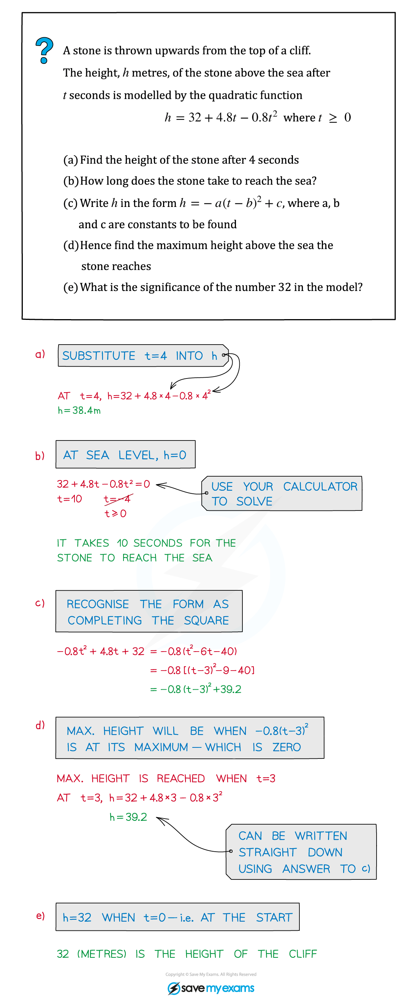
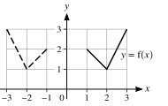
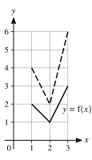
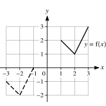
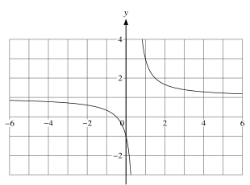
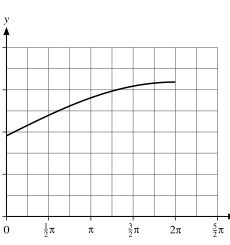
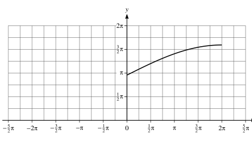
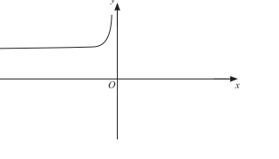
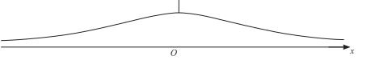
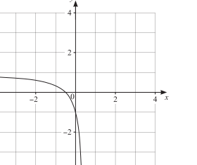

::: {.callout-important}
## 本节考纲要求

本页依据 9709 Mathematics 2026–2027 syllabus 1.2 Functions：

- 理解 function、domain、range、one-one function、inverse function 和 composite function；
- 在简单情形下求 range 和 composition，并检查 composite function 的 domain/range 条件；
- 判断函数是否 one-one，并求 one-one function 的 inverse；
- 用图像理解 (y=f(x)) 与 (y=f^{-1}(x)) 关于 (y=x) 的镜像关系；
- 使用 (y=f(x)+a)、(y=f(x+a))、(y=af(x))、(y=f(ax)) 及其简单组合描述 graph transformations。

下列 20 组题目均来自工作区保存的 Paper 1 原始 past-paper PDF。题干只把 PDF 排版符号整理为 LaTeX，没有改写或编造题目；答案按对应 mark scheme 的得分步骤展开。题目中的图像均从原始 PDF 独立提取为 SVG，不使用整页截图。
:::

## 1. Core knowledge

::: {.study-card}
### Domain, range and notation

函数 (f:A\to B) 的 domain 是允许的输入集合 (A)，range 是实际输出集合 (f(A))，不一定等于给出的 codomain (B)。

做题时先保留原题的限制，例如 (x>2)、(x\le -a) 或 (x\in\mathbb R)。求 range 时要同时考虑：

- algebraic restriction，例如分母不能为 0、根号内必须非负；
- domain restriction，例如只取抛物线 vertex 的一侧；
- endpoint 是否包含，例如 (x>2) 通常会导致 range 的相应 endpoint 不包含。
:::

::: {.study-card}
### One-one and inverse functions

函数 one-one 的意思是不同输入不会得到相同输出。图像上可以用 horizontal line test 判断：任一水平线至多与图像相交一次。

求 inverse 的标准步骤是：

$$
y=f(x)\quad\Longrightarrow\quad x= f^{-1}(y),
$$

先交换 (x,y)，再解出 (y)，最后写清楚 (f^{-1}) 的 domain。原函数的 domain 会成为 inverse 的 range，原函数的 range 会成为 inverse 的 domain。

图像上，(y=f^{-1}(x)) 是 (y=f(x)) 关于镜像线 (y=x) 的反射；但只有 one-one function 才能把 inverse 当成 function。
:::

::: {.worked-example}
Worked example · 原始笔记单卡片

{.note-figure fig-alt="Original extracted worked example connecting a quadratic function to its graph and maximum value"}

这张原始笔记例题虽然以 quadratic model 为背景，但连接了本节最常用的 function graph 思路：由 algebraic form 读出 domain、vertex、range 和 graph behaviour。工作区没有单独的 Paper 1 Functions note PDF，因此只加入这一张与本节直接相关的原始 worked example。
:::

::: {.formula-panel}
### Composite functions

复合函数按从右向左代入：

$$
fg(x)=f(g(x)),\qquad gf(x)=g(f(x)).
$$

要形成 (gf)，必须满足 (f) 的 range 落在 (g) 的 domain 内；要形成 (fg)，必须满足 (g) 的 range 落在 (f) 的 domain 内。不能只把符号 (fg) 当成乘法。
:::

::: {.study-card}
### Transformations

从 (y=f(x)) 出发：

$$
y=f(x)+a \Rightarrow \text{vertical translation by }(0,a),
$$

$$
y=f(x+a) \Rightarrow \text{horizontal translation by }(-a,0),
$$

$$
y=af(x) \Rightarrow \text{vertical stretch by scale factor }a,
$$

$$
y=f(ax) \Rightarrow \text{horizontal stretch by scale factor }\frac1a.
$$

若题目给出多个 transformation，必须按照题目指定顺序逐步代入；特别要注意 horizontal transformation 作用在 (x) 的输入上，方向与直觉容易相反。
:::

## 2. Verified Paper 1 past-paper questions

::: {.question-card #p1-fn-q01}
### Question 1 · 9709/13/M/J/20 Q3(a–c)

In each of parts (a), (b) and (c), the graph shown with solid lines has equation (y=f(x)). The graph shown with broken lines is a transformation of (y=f(x)).

{.note-figure fig-alt="Original extracted Paper 1 graph for 2020 May June Question 3 part a"}

(a) State, in terms of (f), the equation of the graph shown with broken lines. **[1]**

{.note-figure fig-alt="Original extracted Paper 1 graph for 2020 May June Question 3 part b"}

(b) State, in terms of (f), the equation of the graph shown with broken lines. **[1]**

{.note-figure fig-alt="Original extracted Paper 1 graph for 2020 May June Question 3 part c"}

(c) State, in terms of (f), the equation of the graph shown with broken lines. **[2]**

Show detailed mark scheme answer

(a) The broken graph is the reflection of (y=f(x)) in the (y)-axis, so

$$\boxed{y=f(-x)}.$$

(b) Every (y)-coordinate has been doubled, so

$$\boxed{y=2f(x)}.$$

(c) The graph has moved 4 units left and 3 units down. A move 4 units left gives (f(x+4)), and a move 3 units down gives

$$\boxed{y=f(x+4)-3}.$$

<label class="done-toggle"><input type="checkbox" data-progress="p1-fn-q01"> Completed</label>

<strong>Source:</strong> `PastPaper/2020/2020/9709-s20-qp-13.pdf`, Q3(a–c), and matching `9709-s20-ms-13.pdf`. The three diagrams are independently extracted SVGs from the original PDF.

:::

::: {.question-card #p1-fn-q02}
### Question 2 · 9709/13/M/J/20 Q9(a–d)

The functions (f) and (g) are defined by

$$
f(x)=x^2-4x+3\quad\text{for }x>c,
\qquad
g(x)=\frac1{x+1}\quad\text{for }x>-1,
$$

where (c) is a constant.

(a) Express (f(x)) in the form ((x-a)^2+b). **[2]**

It is given that (f) is a one-one function.

(b) State the smallest possible value of (c). **[1]**

It is now given that (c=5).

(c) Find an expression for (f^{-1}(x)) and state the domain of (f^{-1}). **[3]**

(d) Find an expression for (gf(x)) and state the range of (gf). **[3]**

Show detailed mark scheme answer

(a)

$$f(x)=x^2-4x+3=(x-2)^2-1.$$

(b) The vertex is at (x=2). To keep only one branch of the parabola, the domain (x>c) must start at (c=2) or to its right. Hence the smallest possible value is (oxed{c=2}).

(c) With (c=5), let (y=(x-2)^2-1). Then

$$x-2=\pm\sqrt{y+1}.$$

Since the original domain is (x>5), choose the positive branch:

$$\boxed{f^{-1}(x)=2+\sqrt{x+1}}.$$

For (x>5), (f(x)>f(5)=8), so the domain of the inverse is (oxed{x>8}).

(d)

$$
gf(x)=g(f(x))=\frac1{f(x)+1}
=\frac1{(x-2)^2}.
$$

For (x>5), ((x-2)^2>9), hence

$$\boxed{gf(x)=\frac1{(x-2)^2}},
\qquad
\boxed{0<gf(x)<\frac19}.
$$

<label class="done-toggle"><input type="checkbox" data-progress="p1-fn-q02"> Completed</label>

<strong>Source:</strong> `PastPaper/2020/2020/9709-s20-qp-13.pdf`, Q9(a–d), and matching `9709-s20-ms-13.pdf`.

:::

::: {.question-card #p1-fn-q03}
### Question 3 · 9709/12/M/J/20 Q5(a–b)

The function (f) is defined for (x\in\mathbb R) by (f:x\mapsto a-2x), where (a) is a constant.

(a) Express (ff(x)) and (f^{-1}(x)) in terms of (a) and (x). **[4]**

(b) Given that (ff(x)=f^{-1}(x)), find (x) in terms of (a). **[2]**

Show detailed mark scheme answer

(a)

$$
ff(x)=f(a-2x)=a-2(a-2x)=4x-a.
$$

For the inverse, let (y=a-2x). Then (2x=a-y), so

$$\boxed{f^{-1}(x)=\frac{a-x}{2}}.
$$

(b)

$$
4x-a=\frac{a-x}{2}
\Longrightarrow 8x-2a=a-x
\Longrightarrow 9x=3a.
$$

Therefore (oxed{x=\frac a3}).

<label class="done-toggle"><input type="checkbox" data-progress="p1-fn-q03"> Completed</label>

<strong>Source:</strong> `PastPaper/2020/2020/9709-s20-qp-12.pdf`, Q5(a–b), and matching `9709-s20-ms-12.pdf`.

:::

::: {.question-card #p1-fn-q04}
### Question 4 · 9709/12/O/N/20 Q5(a–b)

Functions (f) and (g) are defined by

$$
f(x)=4x-2\quad(x\in\mathbb R),
\qquad
g(x)=\frac4{x+1}\quad(x\in\mathbb R,\ x\ne-1).
$$

(a) Find the value of (fg(7)). **[1]**

(b) Find the values of (x) for which (f^{-1}(x)=g^{-1}(x)). **[5]**

Show detailed mark scheme answer

(a)

$$g(7)=\frac4{8}=\frac12,
\qquad
fg(7)=f\left(\frac12\right)=2-2=\boxed0.
$$

(b) From (y=4x-2),

$$\boxed{f^{-1}(x)=\frac{x+2}{4}}.
$$

From (y=4/(x+1)),

$$y(x+1)=4\Longrightarrow x=\frac4y-1,
$$

so

$$\boxed{g^{-1}(x)=\frac4x-1},\qquad x\ne0.
$$

Equating,

$$
\frac{x+2}{4}=\frac4x-1
\Longrightarrow x(x+2)=16-4x
\Longrightarrow x^2+6x-16=0.
$$

Thus

$$
(x+8)(x-2)=0,
$$

and (oxed{x=-8\text{ or }x=2}). Both satisfy the inverse-function domain restrictions.

<label class="done-toggle"><input type="checkbox" data-progress="p1-fn-q04"> Completed</label>

<strong>Source:</strong> `PastPaper/2020/2020/9709_w20_qp_12.pdf`, Q5(a–b), and matching `9709_w20_ms_12.pdf`.

:::

::: {.question-card #p1-fn-q05}
### Question 5 · 9709/12/F/M/21 Q7(a–c)

Functions (f) and (g) are defined as follows:

$$
f:x\mapsto x^2+2x+3\quad\text{for }x\le-1,
$$

$$
g:x\mapsto 2x+1\quad\text{for }x\ge-1.
$$

(a) Express (f(x)) in the form ((x+a)^2+b) and state the range of (f). **[3]**

(b) Find an expression for (f^{-1}(x)). **[2]**

(c) Solve the equation (gf(x)=13). **[3]**

Show detailed mark scheme answer

(a)

$$f(x)=x^2+2x+3=(x+1)^2+2.
$$

Because (x\le-1), the smallest value is 2, so

$$\boxed{\text{range of }f=[2,\infty)}.
$$

(b) Let (y=(x+1)^2+2). Since (x+1\le0), choose the negative square-root branch:

$$x+1=-\sqrt{y-2}.
$$

Therefore

$$\boxed{f^{-1}(x)=-1-\sqrt{x-2}},\qquad x\ge2.
$$

(c)

$$
gf(x)=2f(x)+1=2\bigl((x+1)^2+2\bigr)+1=2(x+1)^2+5.
$$

So

$$2(x+1)^2+5=13
\Longrightarrow (x+1)^2=4.
$$

The algebraic possibilities are (x=1) and (x=-3), but the original domain is (x\le-1). Hence (oxed{x=-3}).

<label class="done-toggle"><input type="checkbox" data-progress="p1-fn-q05"> Completed</label>

<strong>Source:</strong> `PastPaper/2021/2021/9709_m21_qp_12.pdf`, Q7(a–c), and matching `9709_m21_ms_12.pdf`.

:::

::: {.question-card #p1-fn-q06}
### Question 6 · 9709/13/M/J/21 Q2

The function (f) is defined by

$$f(x)=\frac13(2x-1)^{3/2}-2x\quad\text{for }\frac12<x<a.$$

It is given that (f) is a decreasing function.

Find the maximum possible value of the constant (a). **[4]**

Show detailed mark scheme answer

Differentiate:

$$
f'(x)=\frac13\cdot\frac32(2x-1)^{1/2}\cdot2-2
=\sqrt{2x-1}-2.
$$

For (f) to be decreasing,

$$
\sqrt{2x-1}-2\le0
\Longleftrightarrow \sqrt{2x-1}\le2
\Longleftrightarrow x\le\frac52.
$$

The interval begins at (x=1/2), so the greatest possible upper endpoint is

$$\boxed{a=\frac52}.$$

<label class="done-toggle"><input type="checkbox" data-progress="p1-fn-q06"> Completed</label>

<strong>Source:</strong> `PastPaper/2021/2021/9709_s21_qp_13.pdf`, Q2, and matching `9709_s21_ms_13.pdf`.

:::

::: {.question-card #p1-fn-q07}
### Question 7 · 9709/12/O/N/21 Q2(a–b)

The graph of (y=f(x)) is transformed to the graph of (y=f(2x)-3).

(a) Describe fully the two single transformations which have been combined to give the resulting transformation. **[3]**

The point (P(5,6)) lies on the transformed curve (y=f(2x)-3).

(b) State the coordinates of the corresponding point on the original curve (y=f(x)). **[2]**

Show detailed mark scheme answer

(a) Replacing (x) by (2x) is a horizontal stretch with scale factor (1/2). Subtracting 3 gives a translation 3 units down. Thus the transformations are

$$\boxed{\text{horizontal stretch factor }\frac12\text{, followed by translation }(0,-3)}.$$

(b) Since (P(5,6)) lies on (y=f(2x)-3),

$$6=f(2\cdot5)-3\Longrightarrow f(10)=9.$$

Therefore the corresponding point on (y=f(x)) is (oxed{(10,9)}).

<label class="done-toggle"><input type="checkbox" data-progress="p1-fn-q07"> Completed</label>

<strong>Source:</strong> `PastPaper/2021/2021/9709_w21_qp_12.pdf`, Q2(a–b), and matching `9709_w21_ms_12.pdf`.

:::

::: {.question-card #p1-fn-q08}
### Question 8 · 9709/11/O/N/21 Q8(a–e)

(a) Express (-3x^2+12x+2) in the form (-3(x-a)^2+b), where (a) and (b) are constants. **[2]**

The one-one function (f) is defined by (f:x\mapsto-3x^2+12x+2) for (x\le k).

(b) State the largest possible value of (k). **[1]**

It is now given that (k=-1).

(c) State the range of (f). **[1]**

(d) Find an expression for (f^{-1}(x)). **[3]**

The result of translating the graph of (y=f(x)) by

$$\begin{pmatrix}-3\\1\end{pmatrix}$$

is the graph of (y=g(x)).

(e) Express (g(x)) in the form (px^2+qx+r). **[3]**

Show detailed mark scheme answer

(a)

$$-3x^2+12x+2=-3(x-2)^2+14.$$

(b) The vertex is at (x=2). For the restricted domain (x\le k) to stay on one branch, the largest possible value is (oxed{k=2}).

(c) With (k=-1),

$$f(-1)=-3-12+2=-13,$$

and (f(x)\to-\infty) as (x\to-\infty). Hence (oxed{\text{range of }f=(-\infty,-13]}.
$$

(d) Let (y=-3(x-2)^2+14). Since (x\le-1), choose the left branch:

$$x=2-\sqrt{\frac{14-y}{3}}.
$$

Therefore

$$\boxed{f^{-1}(x)=2-\sqrt{\frac{14-x}{3}}},\qquad x\le-13.
$$

(e) A translation by ((-3,1)) gives (g(x)=f(x+3)+1). Thus

$$
\begin{aligned}
g(x)&=-3((x+3)-2)^2+14+1\\
&=-3(x+1)^2+15\\
&=\boxed{-3x^2-6x+12}.
\end{aligned}
$$

<label class="done-toggle"><input type="checkbox" data-progress="p1-fn-q08"> Completed</label>

<strong>Source:</strong> `PastPaper/2021/2021/9709_w21_qp_11.pdf`, Q8(a–e), and matching `9709_w21_ms_11.pdf`.

:::

::: {.question-card #p1-fn-q09}
### Question 9 · 9709/12/F/M/22 Q9(a–b)

Functions (f), (g) and (h) are defined as follows:

$$
f(x)=x-4\sqrt{x}+1\quad(x\ge0),
$$

$$
g(x)=mx^2+n\quad(x\ge-2),
\qquad
h(x)=\sqrt{x}-2\quad(x\ge0),
$$

where (m) and (n) are constants.

(a) Solve (f(x)=0), giving your solutions in the form (x=a+b\sqrt c). **[4]**

(b) Given that (f(x)=gh(x)), find the values of (m) and (n). **[4]**

Show detailed mark scheme answer

(a) Let (u=\sqrt{x}), so (u\ge0) and (x=u^2). Then

$$u^2-4u+1=0,$$

giving

$$u=2\pm\sqrt3.$$

Both are non-negative, so

$$
x=(2\pm\sqrt3)^2=7\pm4\sqrt3.
$$

Thus (oxed{x=7-4\sqrt3\text{ or }x=7+4\sqrt3}).

(b)

$$
gh(x)=g(\sqrt{x}-2)=m(\sqrt{x}-2)^2+n.
$$

Expanding,

$$gh(x)=m(x-4\sqrt{x}+4)+n.
$$

Comparing with (f(x)=x-4\sqrt{x}+1), the coefficient of (x) gives (m=1), and then (4+n=1), so

$$\boxed{m=1,\quad n=-3}.$$

<label class="done-toggle"><input type="checkbox" data-progress="p1-fn-q09"> Completed</label>

<strong>Source:</strong> `PastPaper/2022/2022/9709_m22_qp_12.pdf`, Q9(a–b), and matching `9709_m22_ms_12.pdf`.

:::

::: {.question-card #p1-fn-q10}
### Question 10 · 9709/11/M/J/22 Q6(a–c)

The function (f) is defined by

$$f(x)=\frac{x^2-4}{x^2+4}\quad\text{for }x>2.
$$

(a) Find an expression for (f^{-1}(x)). **[3]**

(b) Show that (1-\frac8{x^2+4}) can be expressed as \(\frac{x^2-4}{x^2+4}\) and hence state the range of (f). **[4]**

(c) Explain why the composite function (ff) cannot be formed. **[1]**

Show detailed mark scheme answer

(a) Let (y=(x^2-4)/(x^2+4)). Then

$$
y(x^2+4)=x^2-4
\Longrightarrow x^2(y-1)=-4(y+1)
\Longrightarrow x^2=\frac{4(y+1)}{1-y}.
$$

Since (x>2), take the positive square root:

$$\boxed{f^{-1}(x)=2\sqrt{\frac{x+1}{1-x}}}.
$$

(b)

$$
1-\frac8{x^2+4}=\frac{x^2+4-8}{x^2+4}=\frac{x^2-4}{x^2+4}=f(x).
$$

For (x>2), (x^2+4>8), so (0<8/(x^2+4)<1). Hence

$$\boxed{0<f(x)<1}.
$$

(c) The range of (f) is ((0,1)), but the domain of (f) is (x>2). Since the range of the inner (f) is not contained in the domain of the outer (f), (ff) cannot be formed.

<label class="done-toggle"><input type="checkbox" data-progress="p1-fn-q10"> Completed</label>

<strong>Source:</strong> `PastPaper/2022/2022/9709_s22_qp_11.pdf`, Q6(a–c), and matching `9709_s22_ms_11.pdf`. The graph is an independently extracted SVG from the original PDF.

:::

::: {.question-card #p1-fn-q11}
### Question 11 · 9709/12/M/J/22 Q10(a–d)

Functions (f) and (g) are defined as follows:

$$
f(x)=\frac{2x+1}{2x-1}\quad\text{for }x\ne\frac12,
\qquad
g(x)=x^2+4\quad(x\in\mathbb R).
$$

{.note-figure fig-alt="Original extracted graph of f for the 2022 May June Paper 1 Question 10"}

(a) State the domain of (f^{-1}). **[1]**

(b) Find an expression for (f^{-1}(x)). **[3]**

(c) Find (gf^{-1}(3)). **[2]**

(d) Explain why (g^{-1}(x)) cannot be found. **[1]**

Show detailed mark scheme answer

(a) Rewrite (f):

$$f(x)=1+\frac2{2x-1}.$$

As (x\to\pm\infty), (f(x)\to1), but (f(x)\ne1). Therefore the range of (f), and hence the domain of (f^{-1}), is

$$\boxed{x\in\mathbb R,\ x\ne1}.$$

(b) Let (y=(2x+1)/(2x-1)). Then

$$
y(2x-1)=2x+1
\Longrightarrow 2x(y-1)=y+1.
$$

Thus

$$\boxed{f^{-1}(x)=\frac{x+1}{2(x-1)}},\qquad x\ne1.
$$

(c)

$$f^{-1}(3)=\frac{4}{4}=1,
\qquad
gf^{-1}(3)=g(1)=1^2+4=\boxed5.
$$

(d) (g(x)=x^2+4) is not one-one on (mathbb R), because (g(t)=g(-t)). Therefore (g^{-1}) cannot be a function on the stated domain.

<label class="done-toggle"><input type="checkbox" data-progress="p1-fn-q11"> Completed</label>

<strong>Source:</strong> `PastPaper/2022/2022/9709_s22_qp_12.pdf`, Q10(a–d), and matching `9709_s22_ms_12.pdf`.

:::

::: {.question-card #p1-fn-q12}
### Question 12 · 9709/13/O/N/22 Q2(a–c)

The function (f) is defined by (f(x)=-2x^2-8x-13) for (x<-3).

(a) Express (f(x)) in the form (-2(x+a)^2+b), where (a) and (b) are integers. **[2]**

(b) Find the range of (f). **[1]**

(c) Find an expression for (f^{-1}(x)). **[3]**

Show detailed mark scheme answer

(a)

$$f(x)=-2(x^2+4x+4)-13+8=-2(x+2)^2-5.
$$

(b) On (x<-3), we have (x+2<-1). As (x\to-3^{-}), (f(x)\to-7), but (x=-3) is excluded; as (x\to-\infty), (f(x)\to-\infty). Hence

$$\boxed{\text{range of }f=(-\infty,-7)}.
$$

(c) Let (y=-2(x+2)^2-5). Then

$$
(x+2)^2=-\frac{y+5}{2}.
$$

Since (x+2<0), choose the negative root:

$$\boxed{f^{-1}(x)=-2-\sqrt{-\frac{x+5}{2}}},\qquad x<-7.
$$

<label class="done-toggle"><input type="checkbox" data-progress="p1-fn-q12"> Completed</label>

<strong>Source:</strong> `PastPaper/2022/2022/9709_w22_qp_13.pdf`, Q2(a–c), and matching `9709_w22_ms_13.pdf`.

:::

::: {.question-card #p1-fn-q13}
### Question 13 · 9709/12/F/M/23 Q2

A function (f) is defined by (f(x)=x^2-2x+5) for (x\in\mathbb R). A sequence of transformations is applied in the following order to the graph of (y=f(x)) to give the graph of (y=g(x)):

- Stretch parallel to the (x)-axis with scale factor (1/2);
- Reflection in the (y)-axis;
- Stretch parallel to the (y)-axis with scale factor 3.

Find (g(x)), giving your answer in the form (ax^2+bx+c). **[4]**

Show detailed mark scheme answer

The horizontal stretch factor (1/2) gives (y=f(2x)). Reflecting in the (y)-axis gives (y=f(-2x)). Finally stretch parallel to the (y)-axis by factor 3:

$$
g(x)=3f(-2x).
$$

Since (f(t)=t^2-2t+5),

$$
\begin{aligned}
g(x)&=3\left((-2x)^2-2(-2x)+5\right)\\
&=3(4x^2+4x+5)\\
&=\boxed{12x^2+12x+15}.
\end{aligned}
$$

<label class="done-toggle"><input type="checkbox" data-progress="p1-fn-q13"> Completed</label>

<strong>Source:</strong> `PastPaper/2023/2023/9709_m23_qp_12.pdf`, Q2, and matching `9709_m23_ms_12.pdf`.

:::

::: {.question-card #p1-fn-q14}
### Question 14 · 9709/12/M/J/23 Q8(a–d)

The diagram shows the graph of (y=f(x)), where

$$f(x)=3+2\sin\frac14x\quad\text{for }0\le x\le2\pi.
$$

{.note-figure fig-alt="Original extracted graph of f for the 2023 May June Paper 1 Question 8"}

(a) On the diagram above, sketch the graph of (y=f^{-1}(x)). **[2]**

(b) Find an expression for (f^{-1}(x)). **[2]**

{.note-figure fig-alt="Original extracted graph of g for the 2023 May June Paper 1 Question 8"}

(c) The diagram above shows part of the graph of (g(x)=3+2\sin\frac14x) for (-2\pi\le x\le2\pi). Complete the sketch of the graph of (g(x)) on the diagram above and hence explain whether the function (g) has an inverse. **[2]**

(d) Describe fully a sequence of three transformations which can be combined to transform the graph of (y=\sin x) for (0\le x\le\frac12\pi) to the graph of (y=f(x)), making clear the order in which the transformations are applied. **[6]**

Show detailed mark scheme answer

(a) The inverse graph is the reflection of the given graph in the line (y=x).

(b)

$$y=3+2\sin\frac{x}{4}
\Longrightarrow \sin\frac{x}{4}=\frac{y-3}{2}.
$$

On the given domain, (0\le x/4\le\pi/2), so the principal inverse sine is valid:

$$\boxed{f^{-1}(x)=4\sin^{-1}\left(\frac{x-3}{2}\right)},\qquad 3\le x\le5.
$$

(c) On ([-2\pi,2\pi]), the input (x/4) runs from (-\pi/2) to (\pi/2), where sine is increasing. Therefore (g) is one-one and its graph passes through the corresponding reflected/extended points; (oxed{g\text{ has an inverse}}).

(d) Starting with (y=\sin x):

1. stretch parallel to the (x)-axis by scale factor (4), giving (y=\sin(x/4));
2. stretch parallel to the (y)-axis by scale factor (2), giving (y=2\sin(x/4));
3. translate 3 units upwards, giving (y=3+2\sin(x/4)).

<label class="done-toggle"><input type="checkbox" data-progress="p1-fn-q14"> Completed</label>

<strong>Source:</strong> `PastPaper/2023/2023/9709_s23_qp_12.pdf`, Q8(a–d), and matching `9709_s23_ms_12.pdf`. Both graphs are independently extracted SVGs from the original PDF.

:::

::: {.question-card #p1-fn-q15}
### Question 15 · 9709/12/O/N/23 Q8(a–c)

Functions (f) and (g) are defined by

$$
f(x)=(x+a)^2-a\quad\text{for }x\le-a,
$$

$$g(x)=2x-1\quad(x\in\mathbb R),
$$

where (a) is a positive constant.

(a) Find an expression for (f^{-1}(x)). **[3]**

(b) (i) State the domain of (f^{-1}). **[1]**

(ii) State the range of (f^{-1}). **[1]**

(c) Given that (a=\frac72), solve the equation (gf(x)=0). **[3]**

Show detailed mark scheme answer

(a) Let (y=(x+a)^2-a). Since (x\le-a), (x+a\le0), so

$$x+a=-\sqrt{y+a}.$$

Therefore

$$\boxed{f^{-1}(x)=-a-\sqrt{x+a}}.$$

(b) The minimum of (f) occurs at (x=-a), giving (f(-a)=-a). Thus

$$\boxed{\operatorname{dom}(f^{-1})=[-a,\infty)},
\qquad
\boxed{\operatorname{range}(f^{-1})=(-\infty,-a]}.
$$

(c)

$$gf(x)=2f(x)-1=0\Longrightarrow f(x)=\frac12.
$$

With (a=7/2),

$$
(x+\tfrac72)^2-\tfrac72=\frac12
\Longrightarrow (x+\tfrac72)^2=\frac92.
$$

The domain (x\le-7/2) selects the negative root:

$$\boxed{x=-\frac{7+3\sqrt2}{2}}.$$

<label class="done-toggle"><input type="checkbox" data-progress="p1-fn-q15"> Completed</label>

<strong>Source:</strong> `PastPaper/2023/2023/9709_w23_qp_12.pdf`, Q8(a–c), and matching `9709_w23_ms_12.pdf`.

:::

::: {.question-card #p1-fn-q16}
### Question 16 · 9709/13/O/N/23 Q7(a–c)

The function (f) is defined by

$$f(x)=1+\frac3{x-2}\quad\text{for }x>2.
$$

(a) State the range of (f). **[1]**

(b) Obtain an expression for (f^{-1}(x)) and state the domain of (f^{-1}). **[4]**

The function (g) is defined by (g(x)=2x-2) for (x>0).

(c) Obtain a simplified expression for (gf(x)). **[2]**

Show detailed mark scheme answer

(a) Since (x-2>0), (3/(x-2)>0), so (oxed{\text{range of }f=(1,\infty)}).

(b) Let (y=1+3/(x-2)). Then

$$y-1=\frac3{x-2}\Longrightarrow x=2+\frac3{y-1}.$$

Therefore

$$\boxed{f^{-1}(x)=2+\frac3{x-1}},\qquad \boxed{x>1}.
$$

(c)

$$
gf(x)=2\left(1+\frac3{x-2}\right)-2
=\boxed{\frac6{x-2}}.
$$

<label class="done-toggle"><input type="checkbox" data-progress="p1-fn-q16"> Completed</label>

<strong>Source:</strong> `PastPaper/2023/2023/9709_w23_qp_13.pdf`, Q7(a–c), and matching `9709_w23_ms_13.pdf`.

:::

::: {.question-card #p1-fn-q17}
### Question 17 · 9709/11/M/J/24 Q6(a–d)

The function (f) is defined by

$$f(x)=\frac2{x^2}+4\quad\text{for }x<0.$$

{.note-figure fig-alt="Original extracted graph for 2024 May June Paper 1 Question 6"}

(a) On this diagram, sketch the graph of (y=f^{-1}(x)). Show any relevant mirror line. **[2]**

(b) Find an expression for (f^{-1}(x)). **[3]**

(c) Solve the equation (f(x)=4.5). **[1]**

(d) Explain why the equation (f^{-1}(x)=f(x)) has no solution. **[1]**

Show detailed mark scheme answer

(a) The inverse graph is the reflection of the given graph in (y=x), using the negative branch because the original domain is (x<0).

(b) Let (y=2/x^2+4). Then

$$y-4=\frac2{x^2}\Longrightarrow x^2=\frac2{y-4}.$$

Since (x<0),

$$\boxed{f^{-1}(x)=-\sqrt{\frac2{x-4}}},\qquad x>4.
$$

(c)

$$\frac2{x^2}+4=4.5
\Longrightarrow \frac2{x^2}=\frac12
\Longrightarrow x^2=4.
$$

The domain (x<0) gives (oxed{x=-2}).

(d) (f(x)>4), so every output of (f) is positive. But the domain of (f) is (x<0), whereas (f^{-1}(x)) is defined only for (x>4). There is no common input (x), so (oxed{f^{-1}(x)=f(x)\text{ has no solution}}).

<label class="done-toggle"><input type="checkbox" data-progress="p1-fn-q17"> Completed</label>

<strong>Source:</strong> `PastPaper/2024/2024/qp-202406-mathematics-p11.pdf`, Q6(a–d), and matching `ms-202406-mathematics-p11.pdf`. The graph is an independently extracted SVG from the original PDF.

:::

::: {.question-card #p1-fn-q18}
### Question 18 · 9709/12/M/J/24 Q4(a–c)

The function (f) is defined as follows:

$$f(x)=\sqrt{x}-1\quad\text{for }x>1.
$$

(a) Find an expression for (f^{-1}(x)). **[1]**

The diagram shows the graph of (y=g(x)), where

$$g(x)=\frac1{x^2+2}\quad(x\in\mathbb R).
$$

{.note-figure fig-alt="Original extracted graph of g for 2024 May June Paper 1 Question 4"}

(b) State the range of (g) and explain whether (g^{-1}) exists. **[2]**

The function (h) is defined by (h(x)=1/(x^2+2)) for (x\ge0).

(c) Solve the equation (hf(x)=f(25/16)). Give your answer in the form (a+b\sqrt c). **[4]**

Show detailed mark scheme answer

(a) Let (y=\sqrt{x}-1). Then (sqrt{x}=y+1), so (x=(y+1)^2). Hence

$$\boxed{f^{-1}(x)=(x+1)^2},\qquad x>0.
$$

(b) Since (x^2\ge0), (x^2+2\ge2), so

$$\boxed{0<g(x)\le\frac12}.
$$

The graph is not one-one on (mathbb R), because (g(x)=g(-x)). Therefore (oxed{g^{-1}\text{ does not exist on }\mathbb R}).

(c)

$$f\left(\frac{25}{16}\right)=\frac54-1=\frac14.
$$

Let (u=f(x)=\sqrt{x}-1). Then (h(f(x))=1/(u^2+2)), so

$$
\frac1{(\sqrt{x}-1)^2+2}=\frac14
\Longrightarrow (\sqrt{x}-1)^2=2.
$$

Since (x>1), (sqrt{x}-1>0), giving (sqrt{x}=1+\sqrt2). Therefore

$$\boxed{x=3+2\sqrt2}.$$

<label class="done-toggle"><input type="checkbox" data-progress="p1-fn-q18"> Completed</label>

<strong>Source:</strong> `PastPaper/2024/2024/qp-202406-mathematics-p12.pdf`, Q4(a–c), and matching `ms-202406-mathematics-p12.pdf`. The graph is an independently extracted SVG from the original PDF.

:::

::: {.question-card #p1-fn-q19}
### Question 19 · 9709/12/O/N/24 Q5(a–b)

The function (f) is defined by

$$f(x)=\frac{2x+1}{2x-1}\quad\text{for }x<\frac12.
$$

(a) (i) State the value of (f(-1)). **[1]**

(ii) The diagram shows the graph of (y=f(x)). Sketch the graph of (y=f^{-1}(x)) on this diagram. Show any relevant mirror line. **[2]**

{.note-figure fig-alt="Original extracted graph of f for 2024 October November Paper 1 Question 5"}

(iii) Find an expression for (f^{-1}(x)) and state the domain of the function (f^{-1}). **[4]**

The function (g) is defined by (g(x)=3x+2) for (x\in\mathbb R).

(b) Solve the equation (f(x)=gf(1/4)). **[3]**

Show detailed mark scheme answer

(a)(i)

$$f(-1)=\frac{-2+1}{-2-1}=\boxed{\frac13}.
$$

(a)(ii) The inverse graph is the reflection of the original graph in (y=x), using the branch corresponding to the restricted domain (x<1/2).

(a)(iii) Let (y=(2x+1)/(2x-1)). Then

$$
y(2x-1)=2x+1
\Longrightarrow 2x(y-1)=y+1
\Longrightarrow x=\frac{y+1}{2(y-1)}.
$$

For (x<1/2), the range is (y<1), so

$$\boxed{f^{-1}(x)=\frac{x+1}{2(x-1)}},\qquad \boxed{x<1}.
$$

(b)

$$f\left(\frac14\right)=\frac{\frac12+1}{\frac12-1}=-3,
\qquad
gf\left(\frac14\right)=g(-3)=-7.
$$

Thus

$$
\frac{2x+1}{2x-1}=-7
\Longrightarrow 2x+1=-14x+7
\Longrightarrow x=\boxed{\frac38}.
$$

This satisfies (x<1/2).

<label class="done-toggle"><input type="checkbox" data-progress="p1-fn-q19"> Completed</label>

<strong>Source:</strong> `PastPaper/2024/2024/qp-202410-mathematics-p12.pdf`, Q5(a–b), and matching `ms-202410-mathematics-p12.pdf`. The graph is an independently extracted SVG from the original PDF.

:::

::: {.question-card #p1-fn-q20}
### Question 20 · 9709/13/O/N/24 Q8(a–c)

(a) Express (3x^2-12x+14) in the form (3(x+a)^2+b), where (a) and (b) are constants to be found. **[2]**

The function (f(x)=3x^2-12x+14) is defined for (x\ge k), where (k) is a constant.

(b) Find the least value of (k) for which the function (f^{-1}) exists. **[1]**

For the rest of this question, assume that (k) has the value found in part (b).

(c) Find an expression for (f^{-1}(x)). **[3]**

Show detailed mark scheme answer

(a)

$$3x^2-12x+14=3(x^2-4x+4)+2=3(x-2)^2+2.
$$

Thus (a=-2), (b=2).

(b) The vertex is at (x=2). Restricting the domain to (x\ge2) leaves one branch of the parabola, so the least possible value is (oxed{k=2}).

(c) Let (y=3(x-2)^2+2). On (x\ge2), choose the positive branch:

$$x-2=\sqrt{\frac{y-2}{3}}.
$$

Hence

$$\boxed{f^{-1}(x)=2+\sqrt{\frac{x-2}{3}}},\qquad x\ge2.
$$

<label class="done-toggle"><input type="checkbox" data-progress="p1-fn-q20"> Completed</label>

<strong>Source:</strong> `PastPaper/2024/2024/qp-202410-mathematics-p13.pdf`, Q8(a–c), and matching `ms-202410-mathematics-p13.pdf`.

:::

## 3. Quick checklist

::: {.study-card}

- [ ] 能区分 domain、codomain 和 range
- [ ] 能判断 one-one，并用 horizontal line test 解释
- [ ] 能求 inverse，并写清楚 inverse 的 domain
- [ ] 能按从右向左正确计算 composite functions
- [ ] 能检查 composite function 的 domain/range compatibility
- [ ] 能识别 (f(x)+a)、(f(x+a))、(af(x))、(f(ax)) 的 graph transformations

:::
