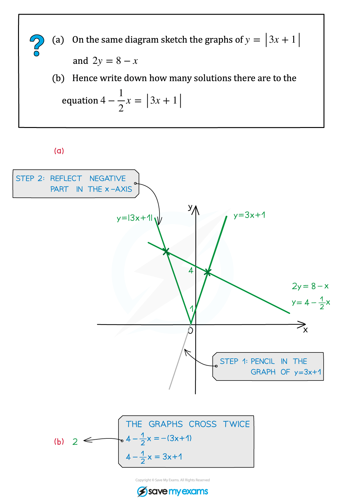
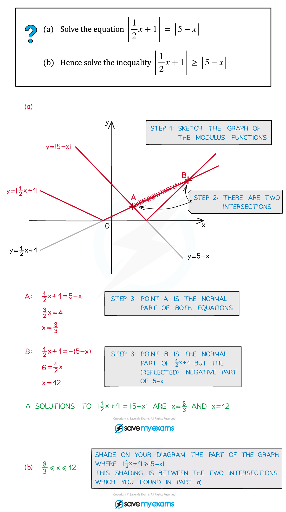
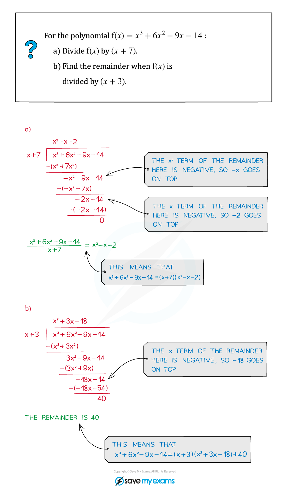
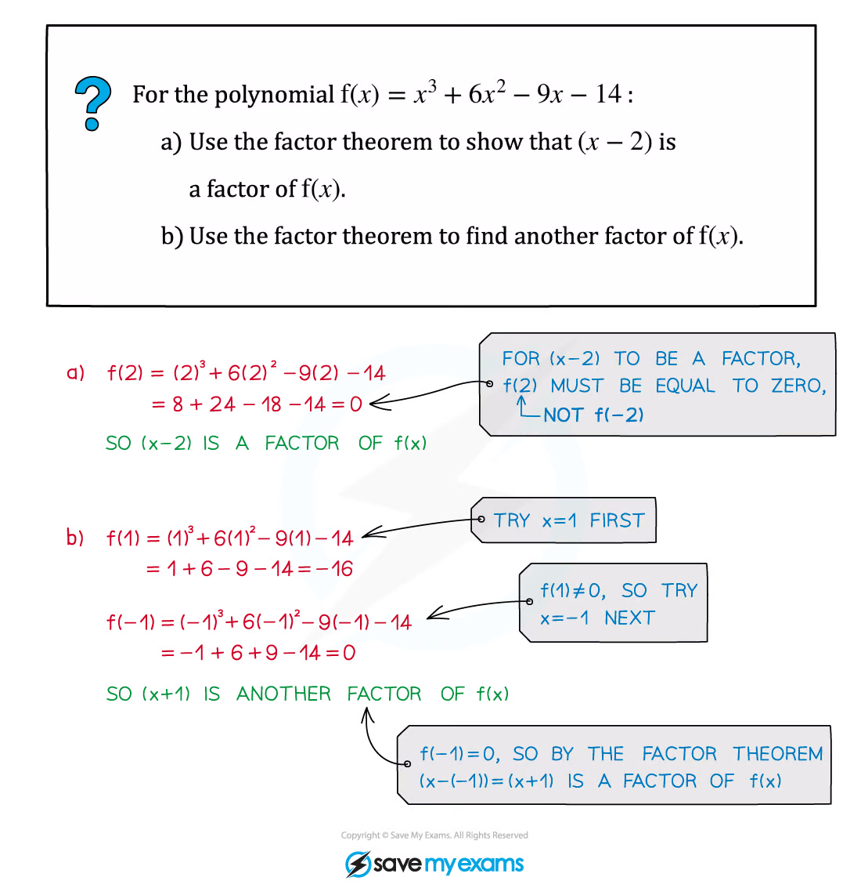
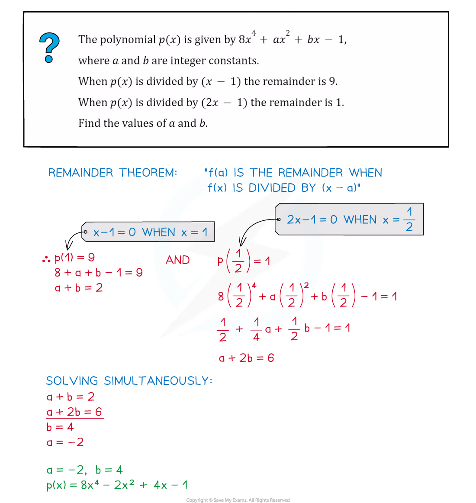

::: {.callout-important}
## 本节考纲要求

本页依据 9709 Mathematics 2026–2027 syllabus 2.1：

- 理解 $|x|$，画出 $y=|ax+b|$，并解 modulus equations and inequalities；
- 将次数不超过 4 的 polynomial 除以 linear 或 quadratic polynomial，并识别 quotient 与 remainder；
- 使用 factor theorem 和 remainder theorem，包括因式 $ax+b$。

工作区中没有独立的 Paper 2 Algebra note PDF，因此知识点图片复用同一套 Algebra note PDF 中的相关原始 worked examples；不把 Paper 3 的 partial fractions、binomial expansion 题目混入本页。
:::

## 1. Core knowledge

::: {.formula-panel}
### Modulus

$$
|u|=\begin{cases}u,&u\ge0,\\-u,&u<0,\end{cases}
\qquad
|a|=|b|\Longleftrightarrow a^2=b^2.
$$

当 $b>0$ 时，

$$
|x-a|<b\Longleftrightarrow a-b<x<a+b.
$$

解 $|f(x)|<|g(x)|$ 时可以平方（两边均非负），但最后要检查原不等式。
:::

::: {.worked-example}
Worked example · shared Algebra note p.5

{.note-figure fig-alt="Original extracted Algebra note worked example on a modulus graph"}
:::

::: {.worked-example}
Worked example · shared Algebra note p.8

{.note-figure fig-alt="Original extracted Algebra note worked example on solving a modulus inequality"}
:::

::: {.formula-panel}
### Polynomial division

若 $f(x)$ 除以 $d(x)$，则

$$
f(x)=d(x)q(x)+r(x),\qquad \deg r<\deg d.
$$

除式为 quadratic 时，remainder 至多为 linear。做完 division 后，把 $d(x)q(x)+r(x)$ 展开复核。
:::

::: {.worked-example}
Worked example · shared Algebra note p.14

{.note-figure fig-alt="Original extracted Algebra note worked example on polynomial division"}
:::

::: {.formula-panel}
### Factor and remainder theorems

$$
(x-a)\text{ is a factor of }f(x)\Longleftrightarrow f(a)=0.
$$

当 $f(x)$ 除以 $(x-a)$ 时，remainder 是 $f(a)$；当除式为 $(mx-n)$ 时，remainder 是 $f(n/m)$。
:::

::: {.worked-example}
Worked example · shared Algebra note p.18

{.note-figure fig-alt="Original extracted Algebra note worked example on the factor theorem"}
:::

::: {.worked-example}
Worked example · shared Algebra note p.20

{.note-figure fig-alt="Original extracted Algebra note worked example on the remainder theorem"}
:::

## 2. Verified Paper 2 past-paper questions

以下题目均来自本地保存的 Paper 2 原始 PDF。题干只将 PDF 的排版符号规范为 LaTeX；没有为了凑题数改写或编造题目。本页保留 17 道已核对题目。

::: {.question-card #p2-alg-q01}
### Question 1 · 9709/21/M/J/20 Q2

The polynomial $p(x)$ is defined by

$$
p(x)=6x^3+ax^2+9x+b,
$$

where $a$ and $b$ are constants. It is given that $(x-2)$ and $(2x+1)$ are factors of $p(x)$.

Find the values of $a$ and $b$. **[5]**

Show detailed mark scheme answer

由 factor theorem，$p(2)=0$ 且 $p(-1/2)=0$：

$$
66+4a+b=0,
\qquad
-\frac34+\frac14a-\frac92+b=0.
$$

即 $4a+b=-66$、$a/4+b=21/4$，解得

$$
\boxed{a=-19,\qquad b=10}.
$$

<label class="done-toggle"><input type="checkbox" data-progress="p2-alg-q01"> Completed</label>

<strong>Source:</strong> `PastPaper/2020/2020/9709-s20-qp-21.pdf`, Q2, and matching mark scheme.

:::

::: {.question-card #p2-alg-q02}
### Question 2 · 9709/21/M/J/20 Q4(a–c)

(a) Sketch, on the same diagram, the graphs of $y=|3x+2a|$ and $y=|3x-4a|$, where $a$ is a positive constant. Give the coordinates of the points where each graph meets the axes.

(b) Find the coordinates of the point of intersection of the two graphs.

(c) Deduce the solution of the inequality $|3x+2a|<|3x-4a|$. **[3+3+1]**

Show detailed mark scheme answer

For $y=|3x+2a|$, the intercepts are $(-2a/3,0)$ and $(0,2a)$. For $y=|3x-4a|$, they are $(4a/3,0)$ and $(0,4a)$.

The non-trivial intersection satisfies $3x+2a=-(3x-4a)$, so

$$
\boxed{(x,y)=\left(\frac a3,3a\right)}.
$$

Squaring the inequality,

$$
(3x+2a)^2<(3x-4a)^2
\Longleftrightarrow 12a(3x-a)<0.
$$

As $a>0$,

$$
\boxed{x<\frac a3}.
$$

<label class="done-toggle"><input type="checkbox" data-progress="p2-alg-q02"> Completed</label>

<strong>Source:</strong> `PastPaper/2020/2020/9709-s20-qp-21.pdf`, Q4(a–c), and matching mark scheme.

:::

::: {.question-card #p2-alg-q03}
### Question 3 · 9709/21/M/J/20 Q7(a–b)

(a) Find the quotient when $9x^3-6x^2-20x+1$ is divided by $(3x+2)$, and show that the remainder is 9.

(b) Hence find

$$
\int_1^6\frac{9x^3-6x^2-20x+1}{3x+2}\,dx,
$$

giving the answer in the form $a+\ln b$ where $a$ and $b$ are integers. **[3+5]**

Show detailed mark scheme answer

Polynomial division gives

$$
9x^3-6x^2-20x+1=(3x+2)(3x^2-4x-4)+9.
$$

Thus the quotient is $3x^2-4x-4$ and the remainder is $9$.

Therefore

$$
\begin{aligned}
I&=\int_1^6\left(3x^2-4x-4+\frac9{3x+2}\right)dx\\
&=\left[x^3-2x^2-4x+3\ln(3x+2)\right]_1^6\\
&=\boxed{125+3\ln4}.
\end{aligned}
$$

<label class="done-toggle"><input type="checkbox" data-progress="p2-alg-q03"> Completed</label>

<strong>Source:</strong> `PastPaper/2020/2020/9709-s20-qp-21.pdf`, Q7(a–b), and matching mark scheme.

:::

::: {.question-card #p2-alg-q04}
### Question 4 · 9709/22/M/J/20 Q5(a–b)

(a) Sketch, on the same diagram, the graphs of $y=|2x-3|$ and $y=3x+5$.

(b) Solve the inequality $3x+5<|2x-3|$. **[2+3]**

Show detailed mark scheme answer

For $x\ge3/2$, the inequality becomes $3x+5<2x-3$, which has no solution in that interval. For $x<3/2$ it becomes

$$
3x+5<3-2x\Longleftrightarrow x<-rac25.
$$

Hence

$$
\boxed{x<-rac25}.
$$

<label class="done-toggle"><input type="checkbox" data-progress="p2-alg-q04"> Completed</label>

<strong>Source:</strong> `PastPaper/2020/2020/9709-s20-qp-22.pdf`, Q5(a–b), and matching mark scheme.

:::

::: {.question-card #p2-alg-q05}
### Question 5 · 9709/22/M/J/20 Q6(a–b)

The polynomial $p(x)$ is defined by

$$
p(x)=6x^3+ax^2-4x-3,
$$

where $a$ is a constant. It is given that $(x+3)$ is a factor of $p(x)$.

(a) Find the value of $a$.

(b) Using this value of $a$, factorise $p(x)$ completely. **[2+3]**

Show detailed mark scheme answer

$$
p(-3)=-162+9a+12-3=9a-153=0,
$$

so $a=17$. Then

$$
p(x)=6x^3+17x^2-4x-3=(x+3)(6x^2-x-1).
$$

Finally,

$$
6x^2-x-1=(3x+1)(2x-1),
$$

so

$$
\boxed{p(x)=(x+3)(3x+1)(2x-1)}.
$$

<label class="done-toggle"><input type="checkbox" data-progress="p2-alg-q05"> Completed</label>

<strong>Source:</strong> `PastPaper/2020/2020/9709-s20-qp-22.pdf`, Q6(a–b), and matching mark scheme.

:::

::: {.question-card #p2-alg-q06}
### Question 6 · 9709/21/O/N/20 Q2

The polynomial $p(x)$ is defined by

$$
p(x)=x^3+ax^2+bx+16,
$$

where $a$ and $b$ are constants. It is given that $(x+2)$ is a factor of $p(x)$ and that the remainder is 72 when $p(x)$ is divided by $(x-2)$.

Find the values of $a$ and $b$. **[5]**

Show detailed mark scheme answer

The two conditions are

$$
p(-2)=-8+4a-2b+16=0,
$$

and

$$
p(2)=8+4a+2b+16=72.
$$

Thus $2a-b=-4$ and $2a+b=24$, giving

$$
\boxed{a=5,\qquad b=14}.
$$

<label class="done-toggle"><input type="checkbox" data-progress="p2-alg-q06"> Completed</label>

<strong>Source:</strong> `PastPaper/2020/2020/9709_w20_qp_21.pdf`, Q2, and matching mark scheme.

:::

::: {.question-card #p2-alg-q07}
### Question 7 · 9709/22/O/N/20 Q7(a)

A curve has equation $y=f(x)$ where

$$
f(x)=x^4-5x^3+6x^2+5x-15.
$$

As shown in the diagram, the curve crosses the $x$-axis at the points $A$ and $B$ with coordinates $(a,0)$ and $(b,0)$ respectively.

(a) Use the factor theorem to show that $(x-3)$ is a factor of $f(x)$. **[2]**

Show detailed mark scheme answer

$$
f(3)=3^4-5(3^3)+6(3^2)+5(3)-15=81-135+54+15-15=0.
$$

By the factor theorem, $\boxed{(x-3)\text{ is a factor of }f(x)}$.

<label class="done-toggle"><input type="checkbox" data-progress="p2-alg-q07"> Completed</label>

<strong>Source:</strong> `PastPaper/2020/2020/9709_w20_qp_22.pdf`, Q7(a), and matching mark scheme.

:::

::: {.question-card #p2-alg-q08}
### Question 8 · 9709/22/F/M/21 Q6(a)

The polynomial $p(x)$ is defined by

$$
p(x)=x^3+ax+b,
$$

where $a$ and $b$ are constants. It is given that $(x+2)$ is a factor of $p(x)$ and that the remainder is 5 when $p(x)$ is divided by $(x-3)$.

(a) Find the values of $a$ and $b$. **[5]**

Show detailed mark scheme answer

$$
p(-2)=-8-2a+b=0,
\qquad p(3)=27+3a+b=5.
$$

Solving $2a-b=-8$ and $3a+b=-22$ gives

$$
\boxed{a=-6,\qquad b=-4}.
$$

<label class="done-toggle"><input type="checkbox" data-progress="p2-alg-q08"> Completed</label>

<strong>Source:</strong> `PastPaper/2021/2021/9709_m21_qp_22.pdf`, Q6(a), and matching mark scheme.

:::

::: {.question-card #p2-alg-q09}
### Question 9 · 9709/21/M/J/21 Q1

Solve the inequality $|3x-7|<|4x+5|$. **[4]**

Show detailed mark scheme answer

Both sides are non-negative, so square:

$$
(3x-7)^2<(4x+5)^2
\Longleftrightarrow
-(x+12)(7x-2)<0.
$$

Thus $(x+12)(7x-2)>0$, giving

$$
\boxed{x<-12\quad\text{or}\quad x>\frac27}.
$$

<label class="done-toggle"><input type="checkbox" data-progress="p2-alg-q09"> Completed</label>

<strong>Source:</strong> `PastPaper/2021/2021/9709_s21_qp_21.pdf`, Q1, and matching mark scheme.

:::

::: {.question-card #p2-alg-q10}
### Question 10 · 9709/21/M/J/21 Q7(a–b)

The polynomial $p(x)$ is defined by

$$
p(x)=ax^3-11x^2-19x-a,
$$

where $a$ is a constant. It is given that $(x-3)$ is a factor of $p(x)$.

(a) Find the value of $a$.

(b) When $a$ has this value, factorise $p(x)$ completely. **[2+3]**

Show detailed mark scheme answer

$$
p(3)=27a-99-57-a=26a-156=0,
$$

so $a=6$. Then

$$
p(x)=6x^3-11x^2-19x-6=(x-3)(6x^2+7x+2),
$$

and

$$
6x^2+7x+2=(3x+2)(2x+1).
$$

Hence

$$
\boxed{p(x)=(x-3)(3x+2)(2x+1)}.
$$

<label class="done-toggle"><input type="checkbox" data-progress="p2-alg-q10"> Completed</label>

<strong>Source:</strong> `PastPaper/2021/2021/9709_s21_qp_21.pdf`, Q7(a–b), and matching mark scheme.

:::

::: {.question-card #p2-alg-q11}
### Question 11 · 9709/22/M/J/21 Q5(a–b)

(a) Find the quotient when $x^4-32x+55$ is divided by $(x-2)^2$ and show that the remainder is 7.

(b) Factorise $x^4-32x+48$. **[3+2]**

Show detailed mark scheme answer

Since $(x-2)^2=x^2-4x+4$,

$$
x^4-32x+55=(x^2-4x+4)(x^2+4x+12)+7.
$$

Thus the quotient is $x^2+4x+12$ and the remainder is $7$.

For the second polynomial,

$$
x^4-32x+48=(x-2)^2(x^2+4x+12).
$$

Therefore

$$
\boxed{(x-2)^2(x^2+4x+12)}.
$$

<label class="done-toggle"><input type="checkbox" data-progress="p2-alg-q11"> Completed</label>

<strong>Source:</strong> `PastPaper/2021/2021/9709_s22_qp_22.pdf`, Q5(a–b), and matching mark scheme.

:::

::: {.question-card #p2-alg-q12}
### Question 12 · 9709/22/M/J/22 Q5(a)

The polynomial $p(x)$ is defined by

$$
p(x)=2x^3+ax^2-3x-4,
$$

where $a$ is a constant. It is given that $(x-4)$ is a factor of $p(x)$.

(a) Find the value of $a$ and hence factorise $p(x)$. **[4]**

Show detailed mark scheme answer

$$
p(4)=128+16a-12-4=112+16a=0,
$$

so $a=-7$. Polynomial division gives

$$
p(x)=(x-4)(2x^2+x+1).
$$

Hence

$$
\boxed{a=-7,\qquad p(x)=(x-4)(2x^2+x+1)}.
$$

<label class="done-toggle"><input type="checkbox" data-progress="p2-alg-q12"> Completed</label>

<strong>Source:</strong> `PastPaper/2022/2022/9709_s22_qp_22.pdf`, Q5(a), and matching mark scheme.

:::

::: {.question-card #p2-alg-q13}
### Question 13 · 9709/21/O/N/21 Q6(a–c)

The polynomials $f(x)$ and $g(x)$ are defined by

$$
f(x)=4x^3+ax^2+8x+15,
\qquad
g(x)=x^2+bx+18,
$$

where $a$ and $b$ are constants.

(a) Given that $(x+3)$ is a factor of $f(x)$, find the value of $a$.

(b) Given that the remainder is 40 when $g(x)$ is divided by $(x-2)$, find the value of $b$.

(c) When $a$ and $b$ have these values, factorise $f(x)-g(x)$ completely. **[2+2+3]**

Show detailed mark scheme answer

$$
f(-3)=-108+9a-24+15=0\Longrightarrow a=13,
$$

and

$$
g(2)=4+2b+18=40\Longrightarrow b=9.
$$

Thus

$$
f(x)-g(x)=4x^3+12x^2-x-3
=(x+3)(2x-1)(2x+1).
$$

Therefore

$$
\boxed{a=13,\quad b=9,\quad f(x)-g(x)=(x+3)(2x-1)(2x+1)}.
$$

<label class="done-toggle"><input type="checkbox" data-progress="p2-alg-q13"> Completed</label>

<strong>Source:</strong> `PastPaper/2021/2021/9709_w21_qp_21.pdf`, Q6(a–c), and matching mark scheme.

:::

::: {.question-card #p2-alg-q14}
### Question 14 · 9709/22/O/N/21 Q1(a–b)

The polynomial $p(x)$ is defined by

$$
p(x)=ax^3+bx-10,
$$

where $a$ and $b$ are constants. It is given that $(x+2)$ is a factor of $p(x)$ and that the remainder is $-55$ when $p(x)$ is divided by $(x+3)$.

(a) Find the values of $a$ and $b$.

(b) Hence factorise $p(x)$ completely. **[5+3]**

Show detailed mark scheme answer

The conditions are

$$
-8a-2b-10=0,
\qquad -27a-3b-10=-55.
$$

Solving gives $a=4,b=-21$. Therefore

$$
p(x)=4x^3-21x-10=(x+2)(4x^2-8x-5)
=(x+2)(2x+1)(2x-5).
$$

Hence

$$
\boxed{a=4,\quad b=-21,\quad p(x)=(x+2)(2x+1)(2x-5)}.
$$

<label class="done-toggle"><input type="checkbox" data-progress="p2-alg-q14"> Completed</label>

<strong>Source:</strong> `PastPaper/2021/2021/9709_w21_qp_22.pdf`, Q1(a–b), and matching mark scheme.

:::

::: {.question-card #p2-alg-q15}
### Question 15 · 9709/21/O/N/22 Q6(a)

The polynomial $p(x)$ is defined by

$$
p(x)=12x^3-9x^2+8x-4.
$$

(a) Find the quotient when $p(x)$ is divided by $(4x-3)$ and show that the remainder is 2. **[3]**

Show detailed mark scheme answer

$$
12x^3-9x^2+8x-4=(4x-3)(3x^2+2)+2.
$$

Thus

$$
\boxed{\text{quotient}=3x^2+2,\qquad \text{remainder}=2}.
$$

<label class="done-toggle"><input type="checkbox" data-progress="p2-alg-q15"> Completed</label>

<strong>Source:</strong> `PastPaper/2022/2022/9709_w22_qp_21.pdf`, Q6(a), and matching mark scheme.

:::

::: {.question-card #p2-alg-q16}
### Question 16 · 9709/22/O/N/22 Q4(a–b)

The polynomial $p(x)$ is defined by

$$
p(x)=ax^3+23x^2-ax-8,
$$

where $a$ is a constant. It is given that $(2x+1)$ is a factor of $p(x)$.

(a) Find the value of $a$ and hence factorise $p(x)$ completely.

(b) Hence solve the equation $p(e^{4y})=0$, giving your answer correct to 3 significant figures. **[5+2]**

Show detailed mark scheme answer

Since $x=-1/2$ is a root,

$$
p\left(-\frac12\right)=-\frac a8+\frac{23}4+\frac a2-8=0,
$$

so $a=6$. Division by $(2x+1)$ gives

$$
p(x)=(2x+1)(3x^2+10x-16).
$$

The roots are $x=-1/2$ and

$$
x=\frac{-5\pm\sqrt{73}}3.
$$

Because $e^{4y}>0$, only $(-5+\sqrt{73})/3$ is admissible. Hence

$$
y=\frac14\ln\left(\frac{-5+\sqrt{73}}3\right)
\approx\boxed{0.0416}\quad\text{(3 s.f.)}.
$$

<label class="done-toggle"><input type="checkbox" data-progress="p2-alg-q16"> Completed</label>

<strong>Source:</strong> `PastPaper/2022/2022/9709_w22_qp_22.pdf`, Q4(a–b), and matching mark scheme.

:::

::: {.question-card #p2-alg-q17}
### Question 17 · 9709/21/M/J/22 Q7(a)

The polynomial $p(x)$ is defined by

$$
p(x)=2x^3+5x^2+ax+2a,
$$

where $a$ is an integer.

(a) Find, in terms of $x$ and $a$, the quotient when $p(x)$ is divided by $(x+2)$, and show that the remainder is 4. **[3]**

Show detailed mark scheme answer

Polynomial division gives

$$
p(x)=(x+2)(2x^2+x+a-2)+4.
$$

Therefore

$$
\boxed{\text{quotient}=2x^2+x+a-2,\qquad \text{remainder}=4}.
$$

<label class="done-toggle"><input type="checkbox" data-progress="p2-alg-q17"> Completed</label>

<strong>Source:</strong> `PastPaper/2022/2022/9709_s22_qp_21.pdf`, Q7(a), and matching mark scheme.

:::

## 3. 2024 Paper 2 additions

以下题目来自新增的 2024 Paper 2 原始 PDF，并已与对应 mark scheme 核对。

::: {.question-card #p2-algebra-q18}
### Question 18 · 9709/22/M/J/24 Q1

Solve the inequality

$$
|5x+7|>|2x-3|.
$$

**[4]**

Show detailed mark scheme answer

Both sides are non-negative, so squaring preserves the inequality:

$$
(5x+7)^2>(2x-3)^2.
$$

Use difference of two squares:

$$
\bigl((5x+7)-(2x-3)\bigr)\bigl((5x+7)+(2x-3)\bigr)>0,
$$

so

$$
(3x+10)(7x+4)>0.
$$

The critical values are $x=-\dfrac{10}{3}$ and $x=-\dfrac47$. The product is positive outside these two values. Therefore

$$
\boxed{x<-\frac{10}{3}\quad\text{or}\quad x>-\frac47}.
$$

<label class="done-toggle"><input type="checkbox" data-progress="p2-algebra-q18"> Completed</label>

<strong>Source:</strong> `PastPaper/2024/2024/qp-202406-mathematics-p22.pdf`, Q1, and matching mark scheme.

:::

::: {.question-card #p2-algebra-q19}
### Question 19 · 9709/22/M/J/24 Q5(a)

The polynomial $p(x)$ is defined by

$$
p(x)=9x^3+18x^2+5x+4.
$$

Find the quotient when $p(x)$ is divided by $(3x+2)$, and show that the remainder is $6$. **[3]**

Show detailed mark scheme answer

Long division gives

$$
9x^3+18x^2+5x+4=(3x+2)(3x^2+4x-1)+6.
$$

Indeed,

$$
(3x+2)(3x^2+4x-1)=9x^3+18x^2+3x-2,
$$

and adding $6$ gives the original polynomial. Hence

$$
\boxed{\text{quotient}=3x^2+4x-1,\qquad \text{remainder}=6}.
$$

<label class="done-toggle"><input type="checkbox" data-progress="p2-algebra-q19"> Completed</label>

<strong>Source:</strong> `PastPaper/2024/2024/qp-202406-mathematics-p22.pdf`, Q5(a), and matching mark scheme.

:::

## Exam checklist

::: {.study-card}

1. Factor condition 用 $p(r)=0$，remainder condition 用 $p(r)=\text{remainder}$。
2. 除以 quadratic 时，remainder 的次数必须小于 2。
3. Modulus inequality 要在分界点处分段，并检查原题不等号。
4. 因式分解后代回展开，确认 quotient、remainder 和系数。

:::
