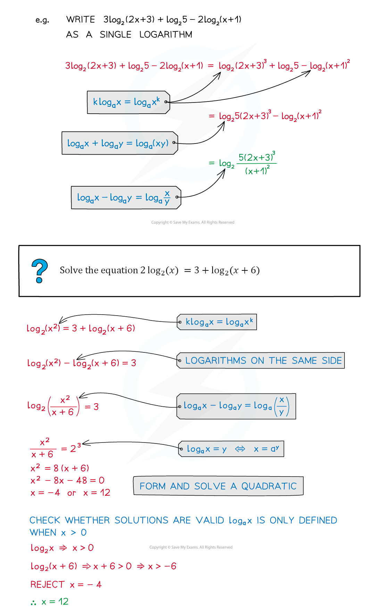
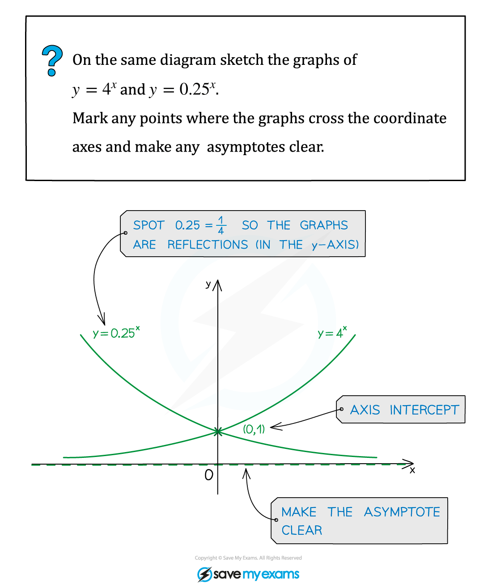
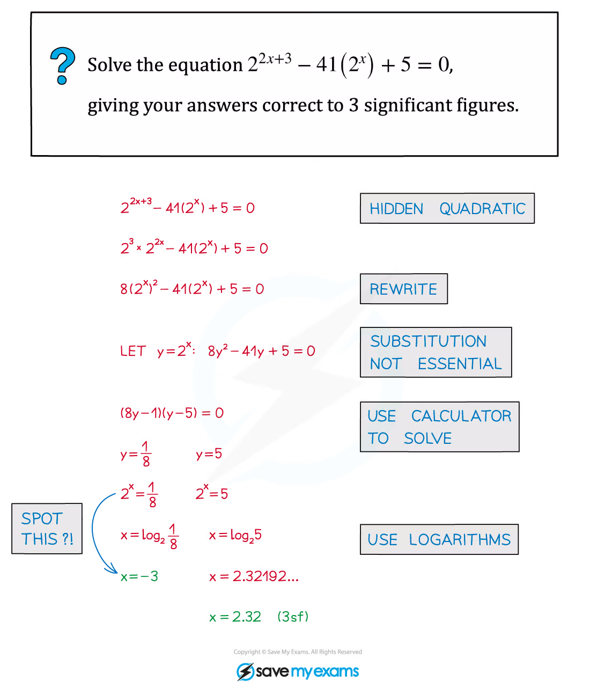
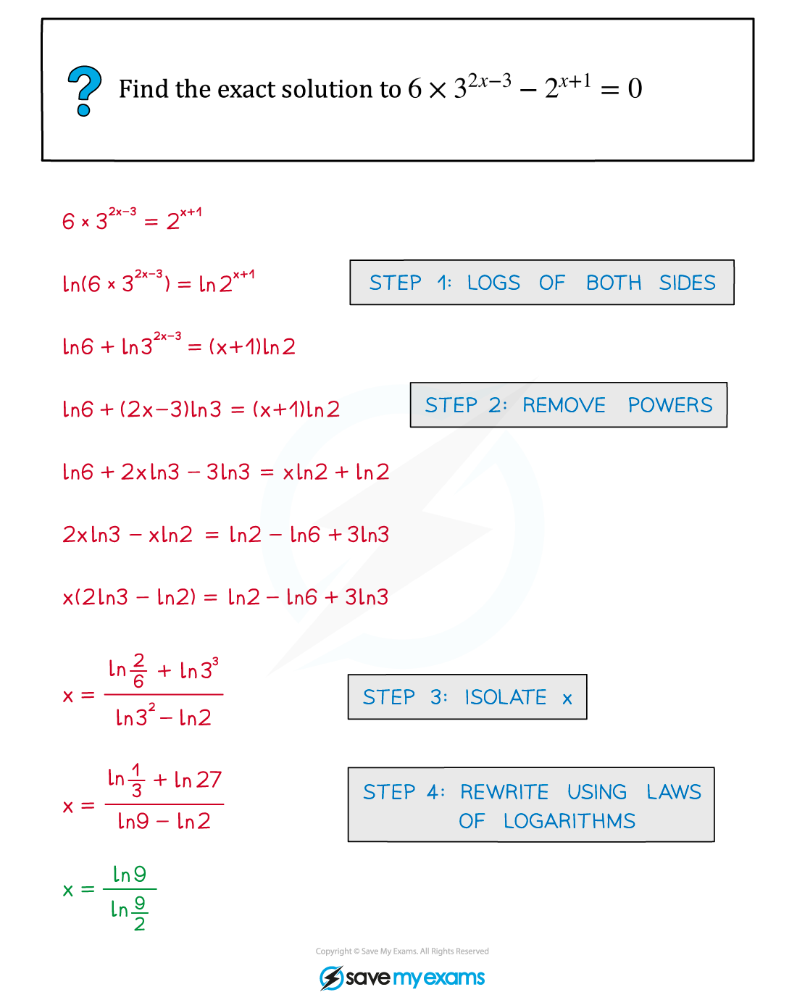
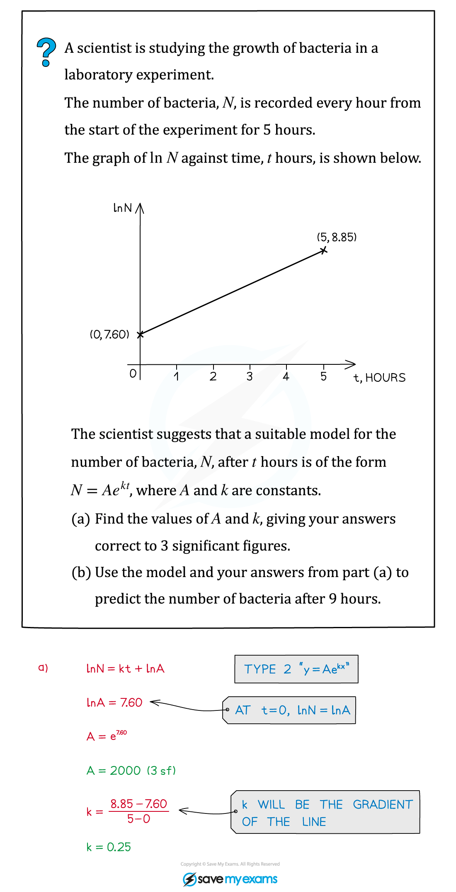
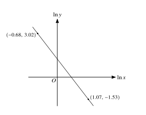

::: {.callout-important}
## 本节考纲要求

本页依据 9709 Mathematics 2026–2027 syllabus 2.2：使用 laws of logarithms；理解 $e^x$ 与 $\ln x$ 的 inverse relationship 和图像；用 logarithms 解指数 equations；把 given relationship transform to linear form，并由 gradient/intercept 求未知常数。

工作区没有独立的 Paper 2 note PDF，因此 worked examples 使用同一套 Logarithmic and exponential note PDF 中的原始图片；真题全部来自本地 Paper 2 原始 PDF，数量不足时不补造题目。
:::

## 1. Core knowledge

::: {.formula-panel}
### Logarithm laws and domain

$$
\log_a(xy)=\log_a x+\log_a y,
\quad
\log_a\left(\frac{x}{y}\right)=\log_a x-\log_a y,
\quad
\log_a(x^n)=n\log_a x.
$$

每个 logarithm 的 argument 必须为正；解完方程后要检查原式定义域。
:::

::: {.worked-example}
Worked example · shared Logarithmic and exponential note p.26

{.note-figure fig-alt="Original extracted logarithmic note worked example on combining logarithms and checking domains"}
:::

::: {.formula-panel}
### Exponential equations and linearisation

若 $a^{f(x)}=b$，则

$$
f(x)\ln a=\ln b.
$$

若 $y=kx^n$，取 logarithms 得

$$
\ln y=\ln k+n\ln x.
$$

所以在 graph of $\ln y$ against $\ln x$ 中，gradient 是 $n$，intercept 是 $\ln k$。
:::

::: {.worked-example}
Worked example · shared Logarithmic and exponential note p.5

{.note-figure fig-alt="Original extracted exponential note worked example on exponential graphs"}
:::

::: {.worked-example}
Worked example · shared Logarithmic and exponential note p.10

{.note-figure fig-alt="Original extracted exponential note worked example on a hidden quadratic"}
:::

::: {.worked-example}
Worked example · shared Logarithmic and exponential note p.31

{.note-figure fig-alt="Original extracted exponential note worked example using logarithms"}
:::

::: {.worked-example}
Worked example · shared Logarithmic and exponential note p.53

{.note-figure fig-alt="Original extracted logarithmic note worked example on linearisation"}
:::

::: {.formula-panel}
### Definitions, graphs and change of base

对 $a>0$ 且 $a\ne1$，

$$a^y=x\Longleftrightarrow y=\log_a x,$$

所以 logarithm 的 argument 必须满足 $x>0$。常用换底公式为

$$\log_a x=\frac{\ln x}{\ln a}.$$

$y=a^x$ 的 graph 经过 $(0,1)$，horizontal asymptote 是 $y=0$；当 $a>1$ 时 increasing，当 $0<a<1$ 时 decreasing。$y=\ln x$ 是它在交换 $x,y$ 后的 inverse graph，vertical asymptote 是 $x=0$。
:::

::: {.study-card}
### Solving exponential and logarithmic equations

优先把两边写成相同 base；若不能，取 natural logarithm。使用 logarithm laws 合并前，必须确认每一个 argument 都是 positive。若令 $u=a^x$ 或 $u=e^x$ 把方程化成 quadratic，解出 $u$ 后要保留 $u>0$ 的限制，再回代求 $x$。

含有 $ln(f(x))$ 的方程最后要检查 $f(x)>0$；平方、指数化或乘以 variable 产生的 extraneous roots 必须代回原方程。
:::

::: {.formula-panel}
### Linearised models

若模型为 $y=ka^{x}$，则

$$\ln y=\ln k+x\ln a.$$

在 graph of $\ln y$ against $x$ 中，gradient 是 $\ln a$、intercept 是 $\ln k$；若模型为 $y=kx^n$，在 graph of $\ln y$ against $\ln x$ 中 gradient 是 $n$、intercept 是 $\ln k$。读出 intercept 后要取 exponential 才能得到 $k$。
:::

## 2. Verified Paper 2 past-paper questions

以下题目均已在本地 Paper 2 原始 PDF 及对应 mark scheme 中核对；题干只把 PDF 排版规范为 LaTeX，没有改写或编造题目。

::: {.question-card #p2-log-q01}
### Question 1 · 9709/21/M/J/20 Q1

Solve the equation

$$
\ln(x+1)-\ln x=2\ln2.
$$

**[3]**

Show detailed mark scheme answer

The domain is $x>0$. Combine the logarithms:

$$
\ln\left(\frac{x+1}{x}\right)=\ln4
\Longrightarrow
\frac{x+1}{x}=4.
$$

Thus $x+1=4x$, so

$$
\boxed{x=\frac13}.
$$

This satisfies $x>0$.

<label class="done-toggle"><input type="checkbox" data-progress="p2-log-q01"> Completed</label>

<strong>Source:</strong> `PastPaper/2020/2020/9709-s20-qp-21.pdf`, Q1, and matching mark scheme.

:::

::: {.question-card #p2-log-q02}
### Question 2 · 9709/22/M/J/20 Q1

Given that

$$
2^y=9^{3x},
$$

use logarithms to show that $y=kx$ and find the value of $k$ correct to 3 significant figures. **[3]**

Show detailed mark scheme answer

Take logarithms:

$$
y\ln2=3x\ln9.
$$

Therefore

$$
y=\frac{3\ln9}{\ln2}x=kx,
$$

and

$$
\boxed{k=\frac{3\ln9}{\ln2}\approx9.51}.
$$

<label class="done-toggle"><input type="checkbox" data-progress="p2-log-q02"> Completed</label>

<strong>Source:</strong> `PastPaper/2020/2020/9709-s20-qp-22.pdf`, Q1, and matching mark scheme.

:::

::: {.question-card #p2-log-q03}
### Question 3 · 9709/22/M/J/20 Q4

The variables $x$ and $y$ satisfy the equation $y=Ax^{-2p}$, where $A$ and $p$ are constants. The graph of $\ln y$ against $\ln x$ is a straight line passing through the points $(-0.68,3.02)$ and $(1.07,-1.53)$, as shown in the diagram.

Find the values of $A$ and $p$. **[5]**

{.note-figure fig-alt="Independently extracted vector diagram for 9709/22/M/J/20 Q4"}

Show detailed mark scheme answer

Taking logarithms gives

$$
\ln y=\ln A-2p\ln x.
$$

The gradient is

$$
m=\frac{-1.53-3.02}{1.07-(-0.68)}=-\frac{4.55}{1.75}=-2.6.
$$

Thus $-2p=-2.6$, so $p=1.3$. Using $(-0.68,3.02)$,

$$
3.02=\ln A+(-2.6)(-0.68)=\ln A+1.768.
$$

Hence $\ln A=1.252$ and

$$
\boxed{p=1.30,\qquad A=e^{1.252}\approx3.50}.
$$

<label class="done-toggle"><input type="checkbox" data-progress="p2-log-q03"> Completed</label>

<strong>Source:</strong> `PastPaper/2020/2020/9709-s20-qp-22.pdf`, Q4, and matching mark scheme.

:::

::: {.question-card #p2-log-q04}
### Question 4 · 9709/22/F/M/21 Q5(a)

Given that

$$
2\ln(x+1)+\ln x=\ln(x+9),
$$

show that

$$
x=\frac9{x+2}.
$$

**[3]**

Show detailed mark scheme answer

The logarithm arguments require $x>0$. Combine the left-hand side:

$$
\ln\left(x(x+1)^2\right)=\ln(x+9)
\Longrightarrow x(x+1)^2=x+9.
$$

Expanding and cancelling $x$ gives

$$
x^3+2x^2=9
\Longrightarrow x^2(x+2)=9.
$$

Since $x>0$, divide by $x^2$:

$$
\boxed{x=\frac9{x+2}}.
$$

<label class="done-toggle"><input type="checkbox" data-progress="p2-log-q04"> Completed</label>

<strong>Source:</strong> `PastPaper/2021/2021/9709_m21_qp_22.pdf`, Q5(a), and matching mark scheme.

:::

::: {.question-card #p2-log-q05}
### Question 5 · 9709/22/M/J/21 Q1(a–b)

(a) Solve the equation

$$
\ln(2+x)-\ln x=2\ln3.
$$

(b) Hence solve the equation

$$
\ln(2+\cot y)-\ln(\cot y)=2\ln3
$$

for $0<y<\frac12\pi$. Give your answer correct to 4 significant figures. **[3+2]**

Show detailed mark scheme answer

(a) The domain is $x>0$ and

$$
\frac{x+2}{x}=9
\Longrightarrow 2=8x
\Longrightarrow \boxed{x=\frac14}.
$$

(b) Replace $x$ by $\cot y$:

$$
\frac{\cot y+2}{\cot y}=9
\Longrightarrow \cot y=\frac14.
$$

In the specified interval,

$$
\boxed{y=\tan^{-1}4\approx1.326\text{ radians}}.
$$

<label class="done-toggle"><input type="checkbox" data-progress="p2-log-q05"> Completed</label>

<strong>Source:</strong> `PastPaper/2021/2021/9709_s21_qp_22.pdf`, Q1(a–b), and matching mark scheme.

:::

::: {.question-card #p2-log-q06}
### Question 6 · 9709/21/O/N/20 Q1

Given that

$$
\ln(2x+1)-\ln(x-3)=2,
$$

find $x$ in terms of $e$. **[4]**

Show detailed mark scheme answer

The domain is $x>3$. Combine and exponentiate:

$$
\frac{2x+1}{x-3}=e^2.
$$

Therefore

$$
2x+1=e^2x-3e^2
\Longrightarrow
x(e^2-2)=1+3e^2.
$$

Hence

$$
\boxed{x=\frac{1+3e^2}{e^2-2}}.
$$

<label class="done-toggle"><input type="checkbox" data-progress="p2-log-q06"> Completed</label>

<strong>Source:</strong> `PastPaper/2020/2020/9709_w20_qp_21.pdf`, Q1, and matching mark scheme.

:::

::: {.question-card #p2-log-q07}
### Question 7 · 9709/22/O/N/20 Q2

Given that

$$
\frac{2^{3x+2}+8}{2^{3x}-7}=5,
$$

find the value of $2^{3x}$ and hence, using logarithms, find the value of $x$ correct to 4 significant figures. **[5]**

Show detailed mark scheme answer

Let $t=2^{3x}$. Then

$$
\frac{4t+8}{t-7}=5
\Longrightarrow 4t+8=5t-35
\Longrightarrow t=43.
$$

Thus

$$
2^{3x}=43
\Longrightarrow
x=\frac{\ln43}{3\ln2}
\approx\boxed{1.808}\quad\text{(4 s.f.)}.
$$

<label class="done-toggle"><input type="checkbox" data-progress="p2-log-q07"> Completed</label>

<strong>Source:</strong> `PastPaper/2020/2020/9709_w20_qp_22.pdf`, Q2, and matching mark scheme.

:::

::: {.question-card #p2-log-q08}
### Question 8 · 9709/21/O/N/22 Q2

Use logarithms to solve the equation

$$
14e^{-2x}=5^{x+1},
$$

giving your answer correct to 3 significant figures. **[4]**

Show detailed mark scheme answer

Taking natural logarithms,

$$
\ln14-2x=(x+1)\ln5.
$$

Therefore

$$
x(2+\ln5)=\ln14-\ln5=\ln\frac{14}{5},
$$

so

$$
x=\frac{\ln(14/5)}{2+\ln5}\approx\boxed{0.285}.
$$

<label class="done-toggle"><input type="checkbox" data-progress="p2-log-q08"> Completed</label>

<strong>Source:</strong> `PastPaper/2022/2022/9709_w22_qp_21.pdf`, Q2, and matching mark scheme.

:::

::: {.question-card #p2-log-q10}
### Question 9 · 9709/22/M/J/24 Q2

Use logarithms to solve the equation

$$
6^{2x-1}=5e^{3x+2}.
$$

Give your answer correct to 4 significant figures. **[4]**

Show detailed mark scheme answer

Take natural logarithms:

$$
(2x-1)\ln6=\ln5+3x+2.
$$

Rearrange as a linear equation in $x$:

$$
x(2\ln6-3)=\ln5+\ln6+2.
$$

Therefore

$$
x=\frac{\ln5+\ln6+2}{2\ln6-3}=9.256250\ldots,
$$

and hence

$$
\boxed{x=9.256}\qquad\text{(4 s.f.)}.
$$

<label class="done-toggle"><input type="checkbox" data-progress="p2-log-q10"> Completed</label>

<strong>Source:</strong> `PastPaper/2024/2024/qp-202406-mathematics-p22.pdf`, Q2, and matching mark scheme.

:::

::: {.question-card #p2-log-q11}
### Question 10 · 9709/21/O/N/24 Q1(a–b)

The variables $x$ and $y$ satisfy the equation

$$
a^{2y}=e^{3x+k},
$$

where $a$ and $k$ are constants. The graph of $y$ against $x$ is a straight line.

(a) Use logarithms to show that the gradient of the straight line is $\dfrac{3}{2\ln a}$.

(b) Given that the straight line passes through the points $(0.4,0.95)$ and $(3.3,3.80)$, find the values of $a$ and $k$. **[1+4]**

Show detailed mark scheme answer

(a) Take logarithms:

$$
2y\ln a=3x+k
\quad\Longrightarrow\quad
y=\frac{3}{2\ln a}x+\frac{k}{2\ln a}.
$$

Therefore the gradient is

$$
\boxed{\frac{3}{2\ln a}}.
$$

(b) The gradient from the two points is

$$
m=\frac{3.80-0.95}{3.3-0.4}=\frac{2.85}{2.9}.
$$

Equating this to the result in part (a),

$$
\frac3{2\ln a}=\frac{2.85}{2.9}
\quad\Longrightarrow\quad
\ln a=\frac{29}{19}.
$$

Thus $a=e^{29/19}=4.60119\ldots\approx4.60$. Using $(0.4,0.95)$,

$$
0.95=\frac{2.85}{2.9}(0.4)+\frac{k}{2\ln a},
$$

which gives $k=1.70$. Hence

$$
\boxed{a=4.60,\qquad k=1.70}.
$$

<label class="done-toggle"><input type="checkbox" data-progress="p2-log-q11"> Completed</label>

<strong>Source:</strong> `PastPaper/2024/2024/qp-202410-mathematics-p21.pdf`, Q1(a–b), and matching mark scheme.

:::

::: {.question-card #p2-log-q09}
### Question 11 · 9709/21/O/N/21 Q4(a–b)

The curve with equation

$$
y=xe^{2x}+5e^{-x}
$$

has a minimum point $M$.

(a) Show that the $x$-coordinate of $M$ satisfies the equation

$$
x=\frac13\ln5-\frac13\ln(1+2x).
$$

**[5]**

(b) Use an iterative formula, based on the equation in part (a), to find the $x$-coordinate of $M$ correct to 3 significant figures. Use an initial value of $0.35$ and give the result of each iteration to 5 significant figures. **[3]**

Show detailed mark scheme answer

At a stationary point,

$$
\frac{dy}{dx}=e^{2x}(1+2x)-5e^{-x}=0.
$$

Hence

$$
e^{3x}(1+2x)=5.
$$

Taking logarithms,

$$
3x+\ln(1+2x)=\ln5,
$$

which rearranges to

$$
\boxed{x=\frac13\ln5-\frac13\ln(1+2x)}.
$$

(b) Use

$$
x_{n+1}=\frac13\ln5-\frac13\ln(1+2x_n),
\qquad x_1=0.35.
$$

The iterations are

$$
\begin{array}{c|c}
n&x_n\\\hline
1&0.35000\\
2&0.28579\\
3&0.29635\\
4&0.29455\\
5&0.29485\\
6&0.29480
\end{array}
$$

Hence the required coordinate is

$$
\boxed{x=0.295}\qquad\text{(3 s.f.)}.
$$

<label class="done-toggle"><input type="checkbox" data-progress="p2-log-q09"> Completed</label>

<strong>Source:</strong> `PastPaper/2021/2021/9709_w21_qp_21.pdf`, Q4(a–b), and matching mark scheme.

:::

## Exam checklist

::: {.study-card}

1. 先写 logarithm 的 domain，再合并 logarithms。
2. 指数方程取 logarithm 后，要把未知数的项完整收集。
3. Linearisation 中 gradient 对应指数，intercept 对应常数的 logarithm。
4. 解完后代回原式，排除 logarithm argument 非正的解。

:::
