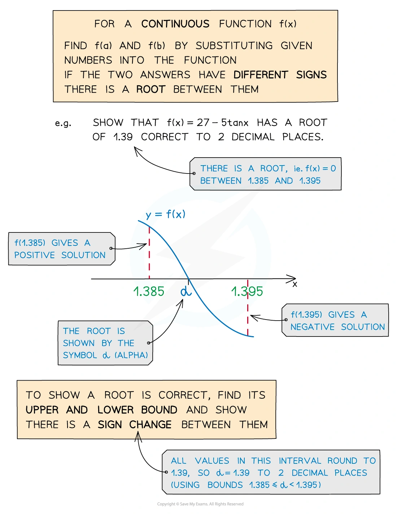
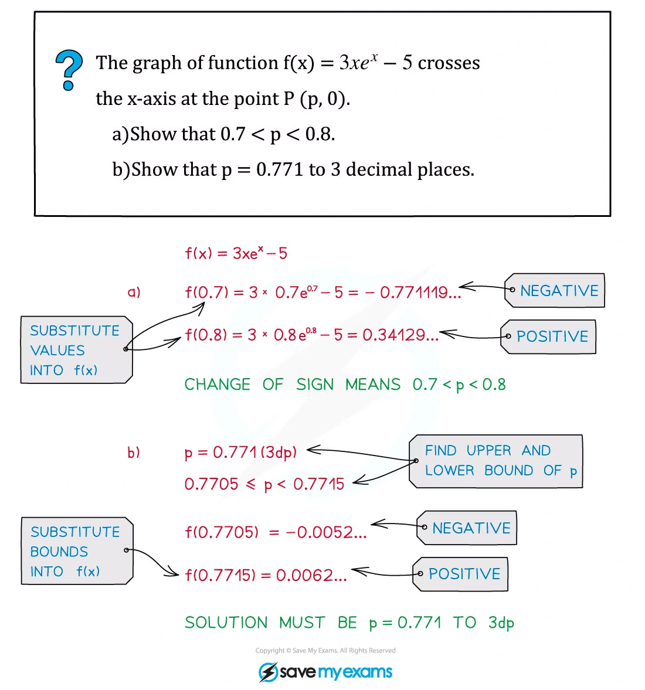
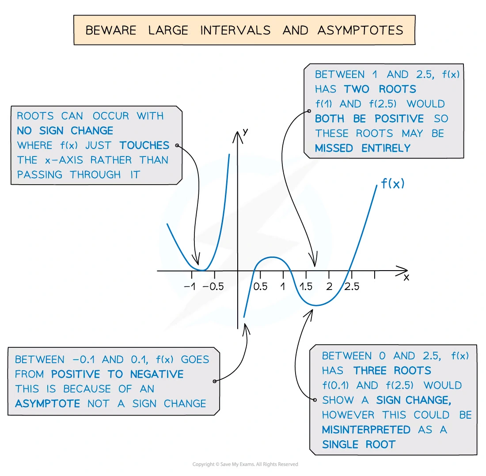
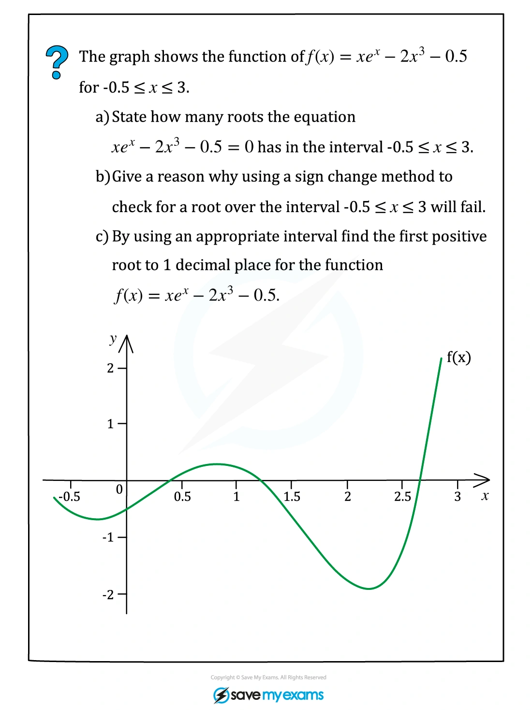
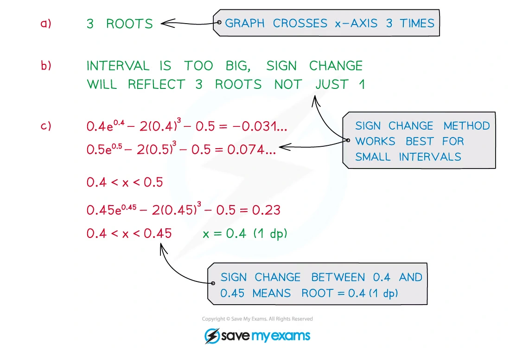
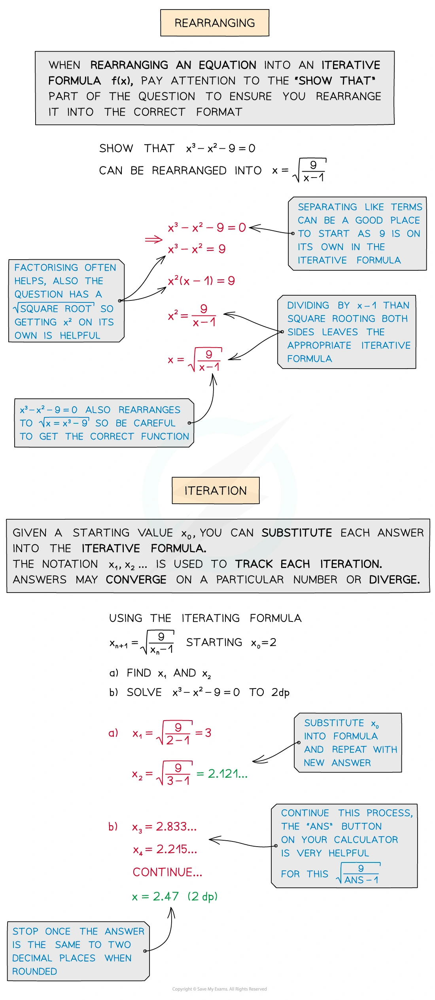
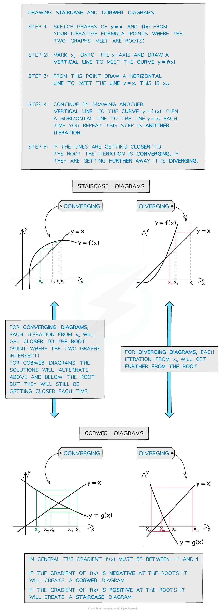
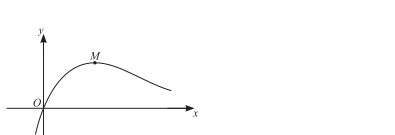

::: {.callout-important}
## 本节考纲要求

本页依据 9709 Mathematics 2026–2027 syllabus 2.6：通过 graphical considerations 或 sign change 定位 root；理解 convergent sequence of approximations；由 equation 推出给定的 fixed-point iteration $x_{n+1}=F(x_n)$，并用 iteration 求 root 到指定 accuracy。考纲不要求 convergence condition 的理论证明，但要知道 iteration 可能 fail to converge。

工作区没有独立的 Paper 2 note PDF，因此 worked examples 使用同一套 Numerical Methods note PDF 中已经独立提取的相关原始图片；每个例题单独成卡。真题全部来自本地 Paper 2 原始 PDF，题干只把 PDF 排版规范为 LaTeX，没有改写或编造题目。
:::

## 1. Core knowledge

::: {.formula-panel}
### Root and sign change

若 $f$ 在 $[a,b]$ 上 continuous，且

$$
f(a)f(b)<0,
$$

则 $[a,b]$ 内至少有一个 root。题目若说该区间只有一个 root，sign change 就能把它定位在这两个 endpoints 之间。

图像题要先明确比较的是哪两个 functions，并检查交点数量；“有 sign change”本身不能证明区间内只有一个 root。
:::

::: {.worked-example}
Worked example · Numerical Methods note p.3

{.note-figure fig-alt="Original extracted numerical methods note worked example showing sign changes and root bounds"}
:::

::: {.worked-example}
Worked example · Numerical Methods note p.4

{.note-figure fig-alt="Original extracted numerical methods note worked example showing a graphical root"}
:::

::: {.formula-panel}
### Fixed-point iteration

若 equation rearranged 为

$$
x=F(x),
$$

则从给定的 $x_1$ 或 initial value 开始，反复计算

$$
x_{n+1}=F(x_n).
$$

如果 sequence converges to $\alpha$，则取 limit 得 $\alpha=F(\alpha)$，所以 limit 是原 equation 的 root；但必须结合题目给出的 root uniqueness 或区间信息来确定它是所求 root。
:::

::: {.worked-example}
Worked example · Numerical Methods note p.5

{.note-figure fig-alt="Original extracted numerical methods note worked example introducing iteration notation"}
:::

::: {.worked-example}
Worked example · Numerical Methods note p.7

{.note-figure fig-alt="Original extracted numerical methods note worked example rearranging an equation into an iterative formula"}
:::

::: {.formula-panel}
### Accuracy and iteration table

保留比最终要求更多的 intermediate figures，直到 consecutive iterates round 到同一个答案。例如要求 3 significant figures 时，不能过早把每一步都 round 到 3 s.f.。

题目若要求“each iteration to 5 significant figures”，表格中按要求显示，但判断 convergence 时使用未过早舍入的 values。
:::

::: {.worked-example}
Worked example · Numerical Methods note p.8

{.note-figure fig-alt="Original extracted numerical methods note worked example showing repeated fixed-point iteration"}
:::

::: {.worked-example}
Worked example · Numerical Methods note p.10

{.note-figure fig-alt="Original extracted numerical methods note worked example showing accuracy and stopping rule"}
:::

::: {.worked-example}
Worked example · Numerical Methods note p.11

{.note-figure fig-alt="Original extracted numerical methods note worked example showing an iteration table"}
:::

::: {.worked-example}
Worked example · Numerical Methods note p.12

{.note-figure fig-alt="Original extracted numerical methods note worked example showing convergence"}
:::

## 2. Verified Paper 2 past-paper questions

以下 5 组题均已在本地 Paper 2 原始 PDF 及对应 mark scheme 中核对；题目没有因为数量不足而补造。

::: {.question-card #p2-num-q01}
### Question 1 · 9709/21/O/N/20 Q5(a–b)

The sequence of values given by the iterative formula

$$
x_{n+1}=\frac{6+8x_n}{8+x_n^2}
$$

with initial value $x_1=2$ converges to $\alpha$.

(a) Use the iterative formula to find the value of $\alpha$ correct to 4 significant figures. Give the result of each iteration to 6 significant figures.

(b) State an equation satisfied by $\alpha$ and hence determine the exact value of $\alpha$. **[3+2]**

Show detailed mark scheme answer

(a) Starting with $x_1=2$:

$$
\begin{array}{c|c}
n&x_n\\\hline
1&2.00000\\
2&1.83333\\
3&1.81907\\
4&1.81736\\
5&1.81715\\
6&1.81712\\
7&1.81712
\end{array}
$$

The iterates stabilise to 4 significant figures, so

$$
\boxed{\alpha=1.817}.
$$

(b) At the limit, $x_{n+1}=x_n=\alpha$:

$$
\alpha=\frac{6+8\alpha}{8+\alpha^2}.
$$

Thus

$$
\alpha(8+\alpha^2)=6+8\alpha
\quad\Longrightarrow\quad
\alpha^3=6.
$$

The convergent sequence is positive, so

$$
\boxed{\alpha=\sqrt[3]{6}}.
$$

<label class="done-toggle"><input type="checkbox" data-progress="p2-num-q01"> Completed</label>

<strong>Source:</strong> `PastPaper/2020/2020/9709_w20_qp_21.pdf`, Q5(a–b), and matching mark scheme.

:::

::: {.question-card #p2-num-q02}
### Question 2 · 9709/21/M/J/22 Q5(b–d)

The equation

$$
|5-2x|=3\ln x
$$

has exactly two roots.

(b) Show that the value of the larger root satisfies the equation

$$
x=2.5+1.5\ln x.
$$

(c) Show by calculation that the value of the larger root lies between $4.5$ and $5.0$.

(d) Use an iterative formula, based on the equation in part (b), to find the value of the larger root correct to 3 significant figures. Give the result of each iteration to 5 significant figures. **[1+2+3]**

Show detailed mark scheme answer

(b) The larger root is greater than $2.5$, so $|5-2x|=2x-5$. Hence

$$
2x-5=3\ln x
\quad\Longrightarrow\quad
\boxed{x=2.5+1.5\ln x}.
$$

(c) Let $F(x)=2.5+1.5\ln x$. Then

$$
F(4.5)=4.7561\ldots>4.5,
\qquad
F(5.0)=4.9148\ldots<5.0.
$$

Equivalently, the sign changes across the rearranged equation show that the larger root lies in

$$
\boxed{4.5<x<5.0}.
$$

(d) Use $x_{n+1}=2.5+1.5\ln x_n$, starting with $x_1=4.5$:

$$
\begin{array}{c|c}
n&x_n\\\hline
1&4.5000\\
2&4.75612\\
3&4.83915\\
4&4.86511\\
5&4.87313\\
6&4.87561\\
7&4.87637\\
8&4.87660
\end{array}
$$

Therefore the larger root is

$$
\boxed{x=4.88}\qquad\text{(3 s.f.)}.
$$

<label class="done-toggle"><input type="checkbox" data-progress="p2-num-q02"> Completed</label>

<strong>Source:</strong> `PastPaper/2022/2022/9709_s22_qp_21.pdf`, Q5(b–d), and matching mark scheme.

:::

::: {.question-card #p2-num-q03}
### Question 3 · 9709/21/M/J/24 Q5(a–c)

A curve has equation

$$
y=\frac{1+e^{2x}}{1+3x}.
$$

The curve has exactly one stationary point $P$.

(a) Find $dy/dx$ and hence show that the $x$-coordinate of $P$ satisfies the equation

$$
x=\frac16+\frac12e^{-2x}.
$$

(b) Show by calculation that the $x$-coordinate of $P$ lies between $0.35$ and $0.45$.

(c) Use an iterative formula based on the equation in part (a) to find the $x$-coordinate of $P$ correct to 3 significant figures. Give the result of each iteration to 5 significant figures. **[4+2+3]**

Show detailed mark scheme answer

(a) By the quotient rule,

$$
\frac{dy}{dx}=\frac{(1+3x)2e^{2x}-(1+e^{2x})3}{(1+3x)^2}.
$$

At a stationary point the numerator is zero:

$$
2e^{2x}+6xe^{2x}-3-3e^{2x}=0,
$$

so

$$
e^{2x}(6x-1)=3
\quad\Longrightarrow\quad
x=\frac16+\frac12e^{-2x}.
$$

(b) Let $G(x)=\dfrac16+\dfrac12e^{-2x}$. Then

$$
G(0.35)=0.4149\ldots>0.35,
\qquad
G(0.45)=0.3700\ldots<0.45,
$$

which brackets the stationary-point coordinate in the stated interval.

(c) Starting with $x_1=0.40000$ and using $x_{n+1}=G(x_n)$:

$$
\begin{array}{c|c}
n&x_n\\\hline
1&0.40000\\
2&0.39133\\
3&0.39526\\
4&0.39347\\
5&0.39428\\
6&0.39391\\
7&0.39408\\
8&0.39401
\end{array}
$$

Thus

$$
\boxed{x=0.394}\qquad\text{(3 s.f.)}.
$$

<label class="done-toggle"><input type="checkbox" data-progress="p2-num-q03"> Completed</label>

<strong>Source:</strong> `PastPaper/2024/2024/qp-202406-mathematics-p21.pdf`, Q5(a–c), and matching mark scheme.

:::

::: {.question-card #p2-num-q04}
### Question 4 · 9709/22/M/J/24 Q6(b–d)

The curve with equation

$$
y=\frac{\ln(2x+1)}{x+3}
$$

has a maximum point $M$.

{.note-figure fig-alt="Independently extracted vector diagram showing the curve and maximum point M"}

(b) Show that the $x$-coordinate of $M$ satisfies the equation

$$
x=\frac{x+3}{\ln(2x+1)}-0.5.
$$

(c) Show by calculation that the $x$-coordinate of $M$ lies between $2.5$ and $3.0$.

(d) Use an iterative formula based on the equation in part (b) to find the $x$-coordinate of $M$ correct to 4 significant figures. Give the result of each iteration to 6 significant figures. **[2+2+3]**

Show detailed mark scheme answer

(b) Differentiating by the quotient rule gives

$$
\frac{dy}{dx}=\frac{\dfrac{x+3}{2x+1}-\ln(2x+1)}{(x+3)^2}.
$$

At the maximum point, $dy/dx=0$, so

$$
\frac{x+3}{2x+1}=\ln(2x+1).
$$

Rearranging gives

$$
\boxed{x=\frac{x+3}{\ln(2x+1)}-0.5}.
$$

(c) Using the fixed-point function

$$
F(x)=\frac{x+3}{\ln(2x+1)}-0.5,
$$

we find

$$
F(2.5)=2.5696\ldots>2.5,
\qquad
F(3.0)=2.5834\ldots<3.0,
$$

so the root lies between $2.5$ and $3.0$.

(d) Starting with $x_1=2.75000$ and using $x_{n+1}=F(x_n)$ gives a convergent sequence:

$$
\begin{array}{c|c}
n&x_n\\\hline
1&2.75000\\
2&2.57191\\
3&2.56917\\
4&2.56917
\end{array}
$$

Therefore, to 4 significant figures,

$$
\boxed{x=2.569}.
$$

<label class="done-toggle"><input type="checkbox" data-progress="p2-num-q04"> Completed</label>

<strong>Source:</strong> `PastPaper/2024/2024/qp-202406-mathematics-p22.pdf`, Q6(b–d), and matching mark scheme.

:::

::: {.question-card #p2-num-q05}
### Question 5 · 9709/21/O/N/22 Q4(a–b)

(a) By sketching a suitable pair of graphs on the same diagram, show that the equation

$$
e^{-\frac12x}=x^5
$$

has exactly one real root.

(b) Use the iterative formula

$$
x_{n+1}=\sqrt[5]{e^{-\frac12x_n}}
$$

to determine the root correct to 4 significant figures. Give the result of each iteration to 6 significant figures. **[2+3]**

Show detailed mark scheme answer

(a) For $x\le0$, $x^5\le0$ whereas $e^{-x/2}>0$, so there is no root. For $x>0$, the graph of $x^5$ is increasing and the graph of $e^{-x/2}$ is decreasing. They can therefore meet only once; the positive intersection is the unique real root.

(b) Since the paper does not prescribe an initial value for this part, take $x_1=1$. Using the given iteration,

$$
x_{n+1}=e^{-x_n/10},
$$

the values converge to

$$
\begin{array}{c|c}
n&x_n\\\hline
1&1.000000\\
2&0.904837\\
3&0.913489\\
4&0.912699\\
5&0.912771\\
6&0.912765\\
7&0.912765
\end{array}
$$

Thus the root is

$$
\boxed{x=0.9128}\qquad\text{(4 s.f.)}.
$$

<label class="done-toggle"><input type="checkbox" data-progress="p2-num-q05"> Completed</label>

<strong>Source:</strong> `PastPaper/2022/2022/9709_w22_qp_21.pdf`, Q4(a–b), and matching mark scheme.

:::
