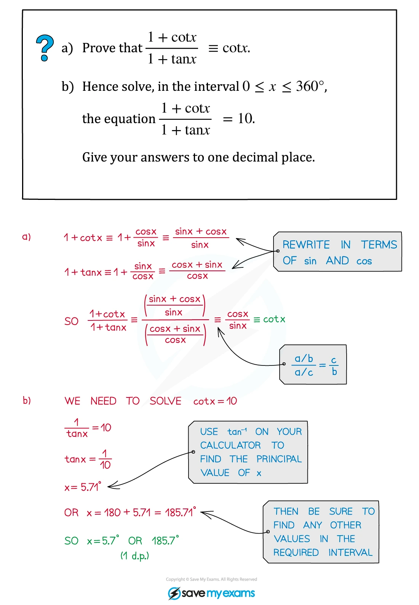
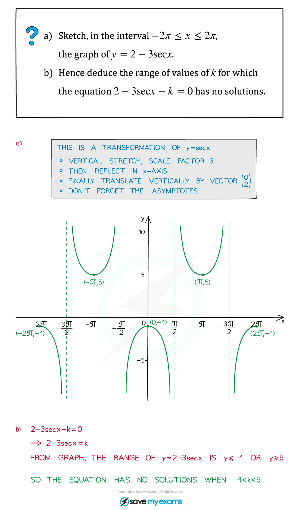
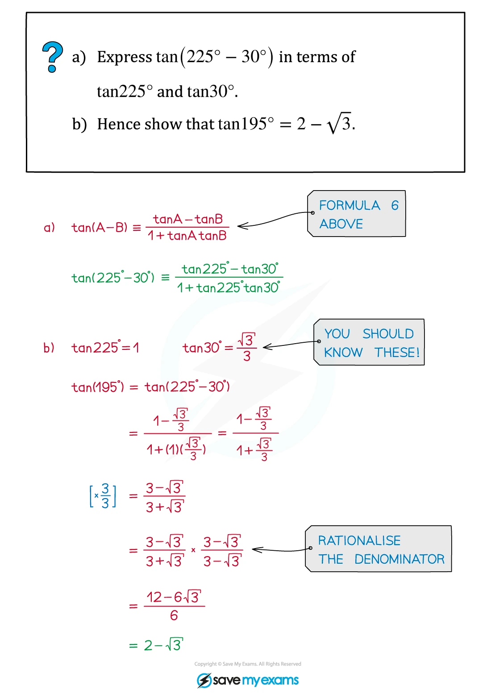
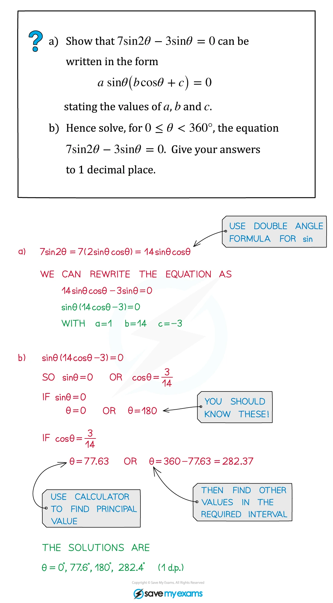
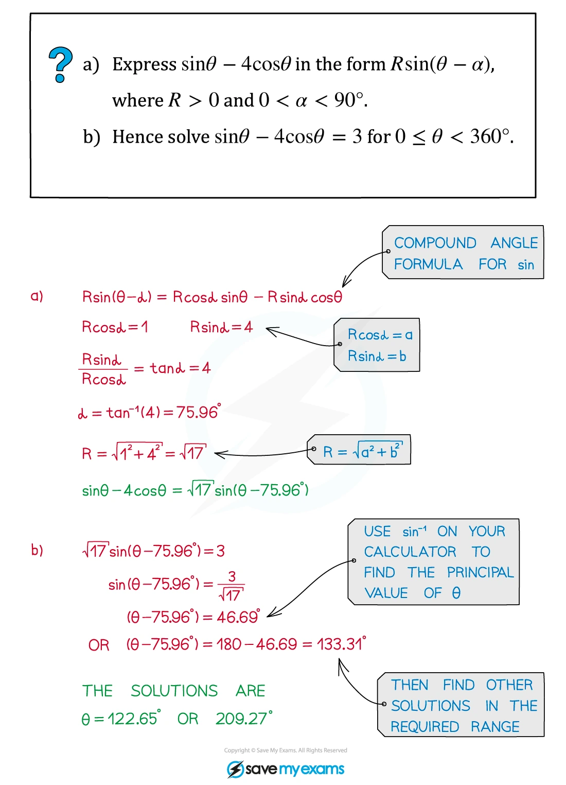
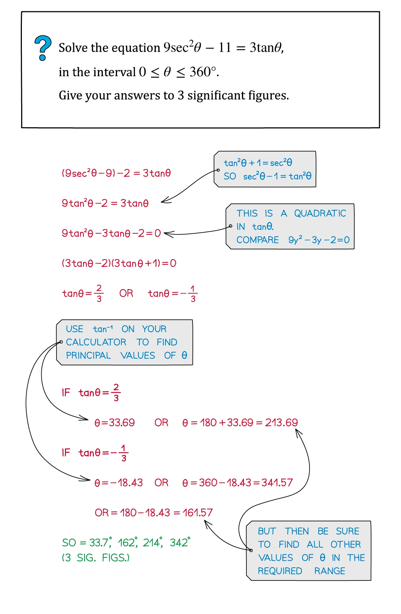
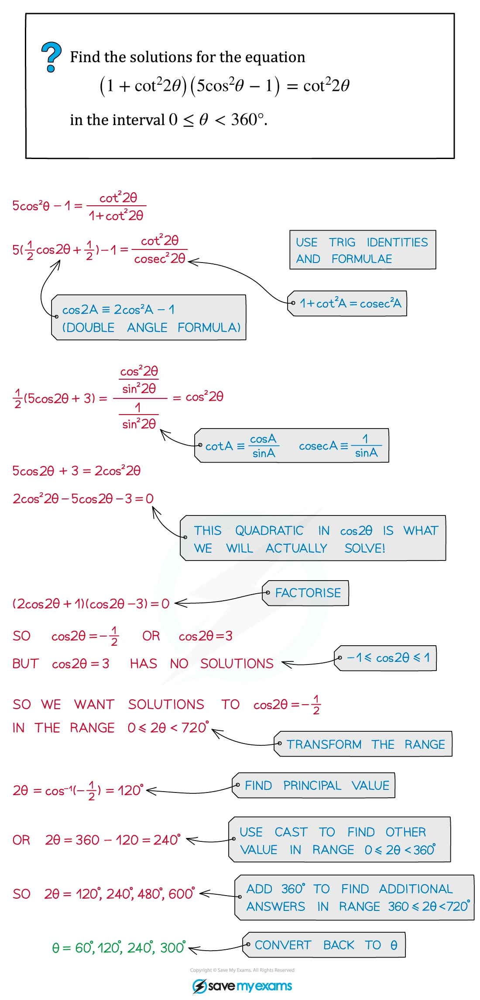
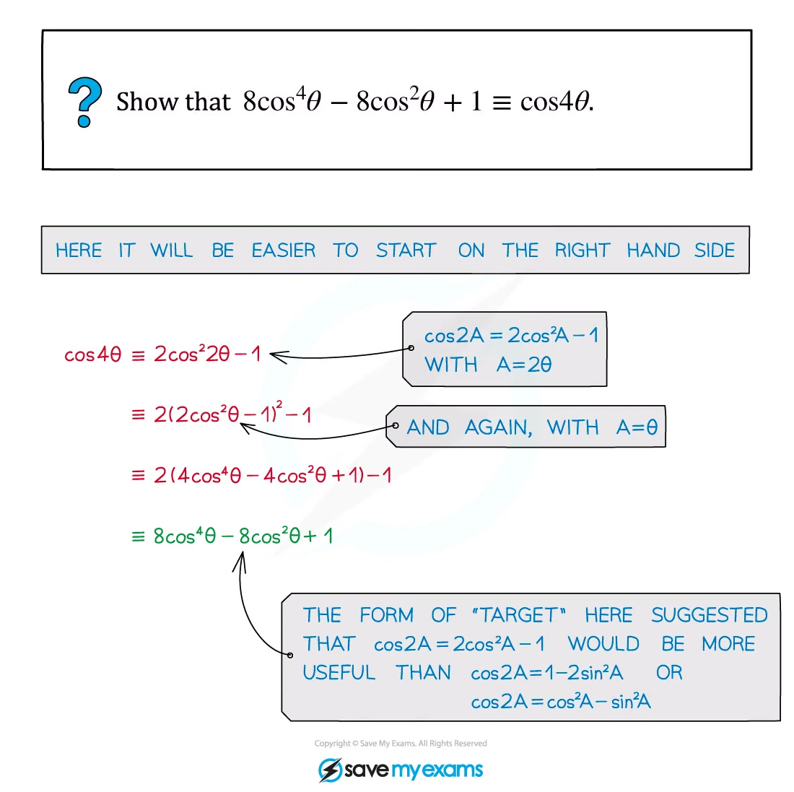

::: {.callout-important}
## 本节考纲要求

本页依据 9709 Mathematics 2026–2027 syllabus 2.3：理解 six trigonometric functions 的关系、性质与图像；使用恒等式进行化简、exact evaluation 和解方程；掌握 compound-angle、double-angle、以及 $a\sin\theta+b\cos\theta$ 的 $R$-form。

工作区没有独立的 Paper 2 note PDF，因此 worked examples 使用同一套 Trigonometry note PDF 中的原始图片；每个例题单独成卡。真题全部来自本地 Paper 2 原始 PDF，题干只把 PDF 排版规范为 LaTeX，没有改写或编造题目。
:::

## 1. Core knowledge

::: {.formula-panel}
### Six trigonometric functions

$$
\tan\theta=\frac{\sin\theta}{\cos\theta},\qquad
\cot\theta=\frac{\cos\theta}{\sin\theta},\qquad
\sec\theta=\frac1{\cos\theta},\qquad
\operatorname{cosec}\theta=\frac1{\sin\theta}.
$$

对应的恒等式是

$$
\sec^2\theta=1+\tan^2\theta,
\qquad
\operatorname{cosec}^2\theta=1+\cot^2\theta,
\qquad
\sin^2\theta+\cos^2\theta=1.
$$

先检查定义域：$\sec\theta$ 要求 $\cos\theta\ne0$，而 $\operatorname{cosec}\theta$ 与 $\cot\theta$ 要求 $\sin\theta\ne0$。
:::

::: {.worked-example}
Worked example · Trigonometry note p.3

{.note-figure fig-alt="Original extracted trigonometry note worked example on reciprocal trigonometric functions"}
:::

::: {.formula-panel}
### Graphs and periodicity

$$
\sin(\theta+2\pi)=\sin\theta,
\quad \cos(\theta+2\pi)=\cos\theta,
\quad \tan(\theta+\pi)=\tan\theta.
$$

$\sec\theta$ 和 $\operatorname{cosec}\theta$ 是 reciprocal graphs，必须标出 vertical asymptotes：$\sec\theta$ 的 asymptotes 在 $\cos\theta=0$，$\operatorname{cosec}\theta$ 的 asymptotes 在 $\sin\theta=0$。
:::

::: {.worked-example}
Worked example · Trigonometry note p.7

{.note-figure fig-alt="Original extracted trigonometry note worked example on a transformed secant graph"}
:::

::: {.formula-panel}
### Compound-angle and double-angle formulae

$$
\begin{aligned}
\sin(A\pm B)&=\sin A\cos B\pm\cos A\sin B,\\
\cos(A\pm B)&=\cos A\cos B\mp\sin A\sin B,\\
\tan(A\pm B)&=\frac{\tan A\pm\tan B}{1\mp\tan A\tan B},\\
\sin2A&=2\sin A\cos A,\\
\cos2A&=\cos^2A-\sin^2A=2\cos^2A-1=1-2\sin^2A,\\
\tan2A&=\frac{2\tan A}{1-\tan^2A}.
\end{aligned}
$$
:::

::: {.worked-example}
Worked example · Trigonometry note p.12

{.note-figure fig-alt="Original extracted trigonometry note worked example applying the tangent subtraction formula"}
:::

::: {.worked-example}
Worked example · Trigonometry note p.15

{.note-figure fig-alt="Original extracted trigonometry note worked example solving a double-angle equation"}
:::

::: {.formula-panel}
### $R$-form

$$
a\sin\theta+b\cos\theta=R\sin(\theta+\alpha),
$$

where

$$
R=\sqrt{a^2+b^2},\qquad R\cos\alpha=a,\qquad R\sin\alpha=b.
$$

For $R\cos(\theta-\alpha)$ instead, use $R\cos\alpha=a$ and $R\sin\alpha=b$ when matching $a\cos\theta+b\sin\theta$.
:::

::: {.worked-example}
Worked example · Trigonometry note p.19

{.note-figure fig-alt="Original extracted trigonometry note worked example converting a sine and cosine combination into R sine form"}
:::

::: {.formula-panel}
### Solving strategy

1. 把 $\sec,\operatorname{cosec},\cot$ 改写成 $\sin,\cos$，或乘以适当的 $\sin\theta\cos\theta$。
2. 选择能把 equation 化成一个 basic trig equation 的 identity。
3. 用题目指定的 interval 列出全部解；注意 $\sin$、$\cos$ 和 $\tan$ 的周期不同。

不要在最后一步丢掉 domain restriction，也不要只写 calculator 的 principal value。
:::

::: {.worked-example}
Worked example · Trigonometry note p.10

{.note-figure fig-alt="Original extracted trigonometry note worked example solving a secant and tangent equation by a quadratic substitution"}
:::

::: {.worked-example}
Worked example · Trigonometry note p.24

{.note-figure fig-alt="Original extracted trigonometry note worked example using cosecant and double-angle identities to form a quadratic"}
:::

::: {.worked-example}
Worked example · Trigonometry note p.28

{.note-figure fig-alt="Original extracted trigonometry note worked example applying the double-angle formula twice"}
:::

::: {.study-card}
### Exact values and angle restrictions

要熟悉 $0$、$\pi/6$、$\pi/4$、$\pi/3$、$\pi/2$ 的 exact values，并根据 quadrant 判断 signs。对于 reciprocal functions，必须同时排除

$$
\cos\theta=0\quad\text{for }\tan\theta,\sec\theta,
\qquad
\sin\theta=0\quad\text{for }\cot\theta,\operatorname{cosec}\theta.
$$

题目给出 restricted interval 时，先求 reference angle，再按周期和 quadrant 列出所有解；不能只保留 inverse calculator 的 principal value。
:::

::: {.formula-panel}
### Double-angle rearrangements

根据目标形式选择 double-angle identity：

$$
\cos2A=1-2\sin^2A=2\cos^2A-1,qquad
\sin^2A=\frac{1-\cos2A}{2},qquad
\cos^2A=\frac{1+\cos2A}{2}.
$$

若 equation 可化成关于 $\sin A$、$\cos A$ 或 $\tan A$ 的 quadratic，先令该 ratio 为 $u$，解完后检查 $u\in[-1,1]$（对 sine/cosine）以及原方程的 excluded values。
:::

::: {.study-card}
### Compound angles and $R$-form checks

使用 compound-angle formula 时先展开，再比较 $\sin\theta$ 与 $\cos\theta$ 的 coefficients。对

$$a\sin\theta+b\cos\theta=R\sin(\theta+\alpha),$$

必须满足 $R=\sqrt{a^2+b^2}$，并由 $R\cos\alpha=a$、$R\sin\alpha=b$ 确定正确 quadrant。最后可用 maximum/minimum range $[-R,R]$ 检查 equation 是否有解。
:::

## 2. Verified Paper 2 past-paper questions

以下题目均已在本地 Paper 2 原始 PDF 及对应 mark scheme 中核对；题目没有因为数量不足而补造。表达式中的角度单位、区间和分数均保留原题信息。

::: {.question-card #p2-trig-q01}
### Question 1 · 9709/22/O/N/20 Q1

Solve the equation

$$
7\cot\theta=3\operatorname{cosec}\theta
$$

for $0^\circ<\theta<90^\circ$. **[3]**

Show detailed mark scheme answer

Use $\cot\theta=\dfrac{\cos\theta}{\sin\theta}$ and $\operatorname{cosec}\theta=\dfrac1{\sin\theta}$:

$$
7\frac{\cos\theta}{\sin\theta}=3\frac1{\sin\theta}.
$$

Since $0^\circ<\theta<90^\circ$, $\sin\theta\ne0$, so

$$
7\cos\theta=3
\quad\Longrightarrow\quad
\cos\theta=\frac37.
$$

Therefore

$$
\boxed{\theta=\cos^{-1}\left(\frac37\right)=64.6^\circ}.
$$

There is no second solution in the given interval.

<label class="done-toggle"><input type="checkbox" data-progress="p2-trig-q01"> Completed</label>

<strong>Source:</strong> `PastPaper/2020/2020/9709_w20_qp_22.pdf`, Q1, and matching mark scheme.

:::

::: {.question-card #p2-trig-q02}
### Question 2 · 9709/22/F/M/21 Q2

Solve the equation

$$
\sec^2\theta\cot\theta=8
$$

for $0<\theta<\pi$. **[5]**

Show detailed mark scheme answer

Rewrite the left-hand side in terms of sine and cosine:

$$
\sec^2\theta\cot\theta
=\frac1{\cos^2\theta}\frac{\cos\theta}{\sin\theta}
=\frac1{\sin\theta\cos\theta}.
$$

Hence

$$
\sin\theta\cos\theta=\frac18
\quad\Longrightarrow\quad
\sin2\theta=\frac14.
$$

Because $0<2\theta<2\pi$,

$$
2\theta=\sin^{-1}\left(\frac14\right)
\quad\text{or}\quad
2\theta=\pi-\sin^{-1}\left(\frac14\right).
$$

Thus

$$
\boxed{\theta=0.126\text{ rad or }1.44\text{ rad}}
$$

to 3 significant figures. Both values lie in $(0,\pi)$.

<label class="done-toggle"><input type="checkbox" data-progress="p2-trig-q02"> Completed</label>

<strong>Source:</strong> `PastPaper/2021/2021/9709_m21_qp_22.pdf`, Q2, and matching mark scheme.

:::

::: {.question-card #p2-trig-q03}
### Question 3 · 9709/21/O/N/20 Q6

It is given that $3\sin2\theta=\cos\theta$ where $\theta$ is an angle such that $0^\circ<\theta<90^\circ$.

(a) Find the exact value of $\sin\theta$.

(b) Find the exact value of $\sec\theta$.

(c) Find the exact value of $\cos2\theta$. **[2+2+2]**

Show detailed mark scheme answer

Since $\sin2\theta=2\sin\theta\cos\theta$,

$$
3(2\sin\theta\cos\theta)=\cos\theta.
$$

Here $0^\circ<\theta<90^\circ$, so $\cos\theta\ne0$. Divide by $\cos\theta$:

$$
6\sin\theta=1
\quad\Longrightarrow\quad
\boxed{\sin\theta=\frac16}.
$$

Then

$$
\cos^2\theta=1-\frac1{36}=\frac{35}{36},
$$

and $\cos\theta>0$, so

$$
\boxed{\sec\theta=\frac1{\cos\theta}=\frac6{\sqrt{35}}}.
$$

Finally,

$$
\cos2\theta=1-2\sin^2\theta
=1-2\left(\frac16\right)^2
=\boxed{\frac{17}{18}}.
$$

<label class="done-toggle"><input type="checkbox" data-progress="p2-trig-q03"> Completed</label>

<strong>Source:</strong> `PastPaper/2020/2020/9709_w20_qp_21.pdf`, Q6, and matching mark scheme.

:::

::: {.question-card #p2-trig-q04}
### Question 4 · 9709/21/M/J/21 Q2

By first expanding $\sin(\theta+30^\circ)$, solve the equation

$$
\sin(\theta+30^\circ)\operatorname{cosec}\theta=2
$$

for $0^\circ<\theta<360^\circ$. **[6]**

Show detailed mark scheme answer

Expand the compound angle and use $\operatorname{cosec}\theta=1/\sin\theta$:

$$
\frac{\sin\theta\cos30^\circ+\cos\theta\sin30^\circ}{\sin\theta}=2.
$$

Therefore

$$
\frac{\sqrt3}{2}+\frac12\cot\theta=2
\quad\Longrightarrow\quad
\cot\theta=4-\sqrt3.
$$

Equivalently,

$$
\tan\theta=\frac1{4-\sqrt3}=\frac{4+\sqrt3}{13}.
$$

The principal value is $\tan^{-1}\left(\dfrac{4+\sqrt3}{13}\right)=23.793\ldots^\circ$. Tangent is positive in quadrants I and III, so

$$
\boxed{\theta=23.8^\circ,\ 203.8^\circ}.
$$

<label class="done-toggle"><input type="checkbox" data-progress="p2-trig-q04"> Completed</label>

<strong>Source:</strong> `PastPaper/2021/2021/9709_s21_qp_21.pdf`, Q2, and matching mark scheme.

:::

::: {.question-card #p2-trig-q05}
### Question 5 · 9709/22/M/J/21 Q3

Solve the equation

$$
\sin(2\theta+30^\circ)=5\cos(2\theta+60^\circ)
$$

for $0^\circ<\theta<180^\circ$. **[6]**

Show detailed mark scheme answer

Expand both sides:

$$
\frac{\sqrt3}{2}\sin2\theta+\frac12\cos2\theta
=5\left(\frac12\cos2\theta-\frac{\sqrt3}{2}\sin2\theta\right).
$$

Collect the sine and cosine terms:

$$
3\sqrt3\sin2\theta-2\cos2\theta=0.
$$

Dividing by $\cos2\theta$ gives

$$
\tan2\theta=\frac2{3\sqrt3}.
$$

For $0^\circ<2\theta<360^\circ$,

$$
2\theta=21.0517\ldots^\circ
\quad\text{or}\quad
201.0517\ldots^\circ.
$$

Hence

$$
\boxed{\theta=10.5^\circ,\ 100.5^\circ}.
$$

<label class="done-toggle"><input type="checkbox" data-progress="p2-trig-q05"> Completed</label>

<strong>Source:</strong> `PastPaper/2021/2021/9709_s21_qp_22.pdf`, Q3, and matching mark scheme.

:::

::: {.question-card #p2-trig-q06}
### Question 6 · 9709/22/F/M/22 Q4

(a) Show that

$$
\sin2\theta\cot\theta-\cos2\theta\equiv1.
$$

(b) Hence find the exact value of

$$
\sin\frac16\pi\cot\frac1{12}\pi.
$$

(c) Find the smallest positive value of $\theta$ (in radians) satisfying

$$
\sin2\theta\cot\theta-3\cos2\theta=1.
$$

**[3+2+2]**

Show detailed mark scheme answer

(a) Using $\sin2\theta=2\sin\theta\cos\theta$ and $\cot\theta=\cos\theta/\sin\theta$,

$$
\sin2\theta\cot\theta-\cos2\theta
=2\cos^2\theta-(\cos^2\theta-\sin^2\theta)
=\cos^2\theta+\sin^2\theta
=1.
$$

(b) Put $\theta=\dfrac{\pi}{12}$ into the identity. Since $2\theta=\dfrac\pi6$,

$$
\sin\frac\pi6\cot\frac\pi{12}-\cos\frac\pi6=1.
$$

Therefore

$$
\boxed{\sin\frac\pi6\cot\frac\pi{12}=1+\frac{\sqrt3}{2}}.
$$

(c) From part (a), $\sin2\theta\cot\theta=1+\cos2\theta$. Thus

$$
1+\cos2\theta-3\cos2\theta=1
\quad\Longrightarrow\quad
\cos2\theta=0.
$$

The smallest positive solution is $2\theta=\dfrac\pi2$, so

$$
\boxed{\theta=\frac\pi4}.
$$

<label class="done-toggle"><input type="checkbox" data-progress="p2-trig-q06"> Completed</label>

<strong>Source:</strong> `PastPaper/2022/2022/9709_m22_qp_22.pdf`, Q4, and matching mark scheme.

:::

::: {.question-card #p2-trig-q07}
### Question 7 · 9709/21/M/J/22 Q2

(a) Express the equation

$$
7\tan\theta+4\cot\theta-13\sec\theta=0
$$

in terms of $\sin\theta$ only.

(b) Hence solve the equation for $0^\circ<\theta<360^\circ$. **[3+3]**

Show detailed mark scheme answer

Multiply the equation by $\sin\theta\cos\theta$:

$$
7\sin^2\theta+4\cos^2\theta-13\sin\theta=0.
$$

Using $\cos^2\theta=1-\sin^2\theta$,

$$
3\sin^2\theta-13\sin\theta+4=0.
$$

This is the required form for (a). For (b), solve the quadratic:

$$
\sin\theta=\frac{13\pm\sqrt{169-48}}6
=\frac{13\pm11}6.
$$

The value $\sin\theta=4$ is impossible, so $\sin\theta=\dfrac13$. In $0^\circ<\theta<360^\circ$, sine is positive in quadrants I and II:

$$
\boxed{\theta=19.5^\circ,\ 160.5^\circ}.
$$

<label class="done-toggle"><input type="checkbox" data-progress="p2-trig-q07"> Completed</label>

<strong>Source:</strong> `PastPaper/2022/2022/9709_s22_qp_21.pdf`, Q2, and matching mark scheme.

:::

::: {.question-card #p2-trig-q08}
### Question 8 · 9709/21/O/N/21 Q7

(a) By first expanding $\cos(2\theta+\theta)$, show that

$$
\cos3\theta\equiv4\cos^3\theta-3\cos\theta.
$$

(b) Find the exact value of

$$
2\cos^3\left(\frac5{18}\pi\right)-\frac32\cos\left(\frac5{18}\pi\right).
$$

**[3+2]**

Show detailed mark scheme answer

(a) Expand:

$$
\begin{aligned}
\cos(2\theta+\theta)
&=\cos2\theta\cos\theta-\sin2\theta\sin\theta\\
&=(2\cos^2\theta-1)\cos\theta-2\sin^2\theta\cos\theta\\
&=(2\cos^3\theta-\cos\theta)-2(1-\cos^2\theta)\cos\theta\\
&=4\cos^3\theta-3\cos\theta.
\end{aligned}
$$

Therefore the identity is proved.

(b) Let $x=\dfrac5{18}\pi$. The expression is

$$
2\cos^3x-\frac32\cos x
=\frac12(4\cos^3x-3\cos x)
=\frac12\cos3x.
$$

Since $3x=\dfrac56\pi$,

$$
\boxed{\frac12\cos\frac56\pi=-\frac{\sqrt3}{4}}.
$$

<label class="done-toggle"><input type="checkbox" data-progress="p2-trig-q08"> Completed</label>

<strong>Source:</strong> `PastPaper/2021/2021/9709_w21_qp_21.pdf`, Q7, and matching mark scheme.

:::

::: {.question-card #p2-trig-q09}
### Question 9 · 9709/22/O/N/22 Q1

Solve the equation

$$
\sec\theta=5\operatorname{cosec}\theta
$$

for $0^\circ<\theta<360^\circ$. **[4]**

Show detailed mark scheme answer

Use $\sec\theta=1/\cos\theta$ and $\operatorname{cosec}\theta=1/\sin\theta$:

$$
\frac1{\cos\theta}=\frac5{\sin\theta}
\quad\Longrightarrow\quad
\sin\theta=5\cos\theta
\quad\Longrightarrow\quad
\tan\theta=5.
$$

The principal value is

$$
\tan^{-1}5=78.690\ldots^\circ.
$$

Tangent is positive in quadrants I and III, so the two solutions are

$$
\boxed{\theta=78.7^\circ,\ 258.7^\circ}.
$$

<label class="done-toggle"><input type="checkbox" data-progress="p2-trig-q09"> Completed</label>

<strong>Source:</strong> `PastPaper/2022/2022/9709_w22_qp_22.pdf`, Q1, and matching mark scheme.

:::

::: {.question-card #p2-trig-q10}
### Question 10 · 9709/22/M/J/22 Q8

(a) Express

$$
3\sin2\theta\sec\theta+10\cos(\theta-30^\circ)
$$

in the form $R\sin(\theta+\alpha)$ where $R>0$ and $0^\circ<\alpha<90^\circ$. Give the value of $\alpha$ correct to 2 decimal places.

(b) Hence solve the equation

$$
3\sin4\beta\sec2\beta+10\cos(2\beta-30^\circ)=2
$$

for $0^\circ<\beta<90^\circ$. **[6+3]**

Show detailed mark scheme answer

(a) Since $\sin2\theta=2\sin\theta\cos\theta$,

$$
3\sin2\theta\sec\theta=6\sin\theta.
$$

Also,

$$
10\cos(\theta-30^\circ)
=10\left(\frac{\sqrt3}{2}\cos\theta+\frac12\sin\theta\right)
=5\sqrt3\cos\theta+5\sin\theta.
$$

So the expression becomes

$$
11\sin\theta+5\sqrt3\cos\theta.
$$

For $R\sin(\theta+\alpha)=R\sin\theta\cos\alpha+R\cos\theta\sin\alpha$,

$$
R=\sqrt{11^2+(5\sqrt3)^2}=14,
$$

and

$$
\tan\alpha=\frac{5\sqrt3}{11}.
$$

Therefore

$$
\boxed{R\sin(\theta+\alpha)=14\sin(\theta+\alpha)},
\qquad
\boxed{\alpha=38.21^\circ}.
$$

(b) Use the result in (a) with $\theta=2\beta$:

$$
14\sin(2\beta+38.213\ldots^\circ)=2,
$$

so

$$
\sin(2\beta+38.213\ldots^\circ)=\frac17.
$$

For $0^\circ<\beta<90^\circ$, the angle $2\beta+38.213\ldots^\circ$ is between $38.213\ldots^\circ$ and $218.213\ldots^\circ$. The only valid sine solution is

$$
2\beta+38.213\ldots^\circ=180^\circ-\sin^{-1}\left(\frac17\right)
=171.786\ldots^\circ.
$$

Hence

$$
\boxed{\beta=66.8^\circ}.
$$

<label class="done-toggle"><input type="checkbox" data-progress="p2-trig-q10"> Completed</label>

<strong>Source:</strong> `PastPaper/2022/2022/9709_s22_qp_22.pdf`, Q8, and matching mark scheme.

:::

::: {.question-card #p2-trig-q11}
### Question 11 · 9709/22/O/N/24 Q7(a–b)

(a) Express

$$
4\sin\theta\sin(\theta+60^\circ)
$$

in the form $a+R\sin(2\theta-\alpha)$, where $a$ and $R$ are positive integers and $0^\circ<\alpha<90^\circ$.

(b) Hence find the smallest positive value of $\theta$ satisfying

$$
\frac15+4\sin\theta\sin(\theta+60^\circ)=0.
$$

**[6+3]**

Show detailed mark scheme answer

(a) Use $2\sin A\sin B=\cos(A-B)-\cos(A+B)$:

$$
4\sin\theta\sin(\theta+60^\circ)
=2\cos60^\circ-2\cos(2\theta+60^\circ)
=1+2\sin(2\theta-30^\circ).
$$

Therefore

$$
\boxed{a=1,\qquad R=2,\qquad \alpha=30^\circ}.
$$

(b) Substitute the result from part (a):

$$
\frac15+1+2\sin(2\theta-30^\circ)=0,
$$

so

$$
\sin(2\theta-30^\circ)=-\frac35.
$$

Let $\beta=\sin^{-1}(3/5)=36.8699\ldots^\circ$. The first positive solution is obtained from

$$
2\theta-30^\circ=180^\circ+\beta.
$$

Hence

$$
\theta=\frac{180^\circ+36.8699\ldots^\circ+30^\circ}{2}
=123.4349\ldots^\circ,
$$

and therefore

$$
\boxed{\theta=123.4^\circ}.
$$

<label class="done-toggle"><input type="checkbox" data-progress="p2-trig-q11"> Completed</label>

<strong>Source:</strong> `PastPaper/2024/2024/qp-202410-mathematics-p22.pdf`, Q7(a–b), and matching mark scheme.

:::
