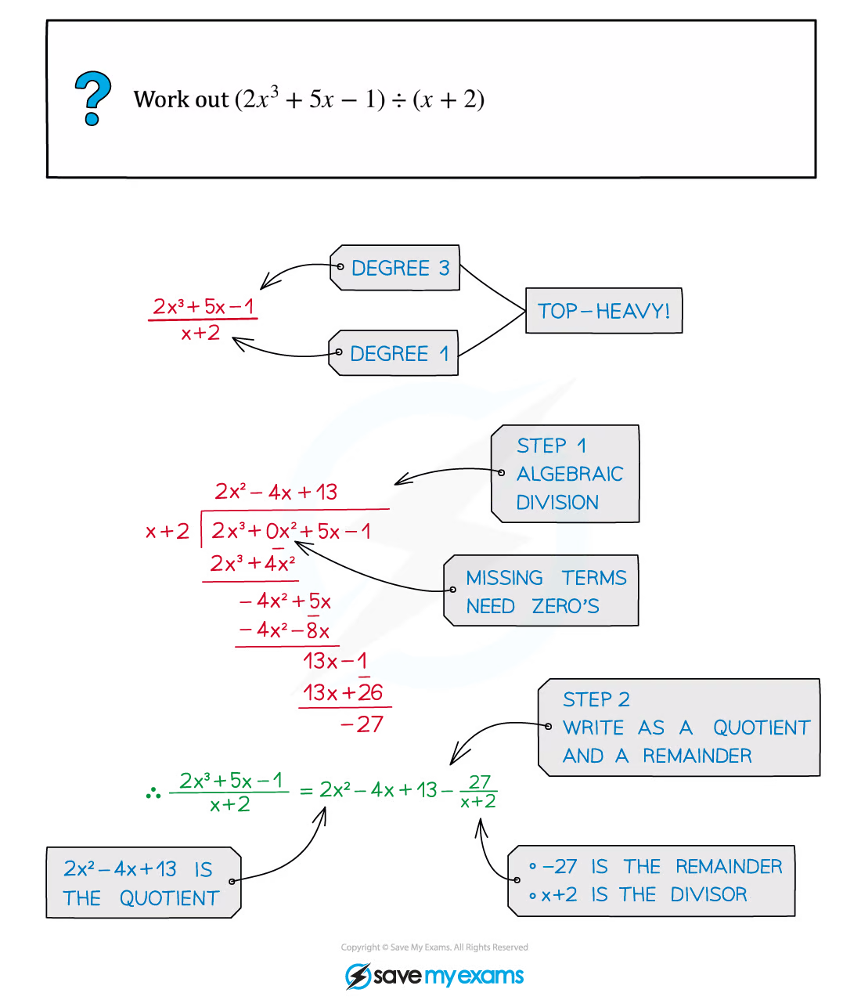
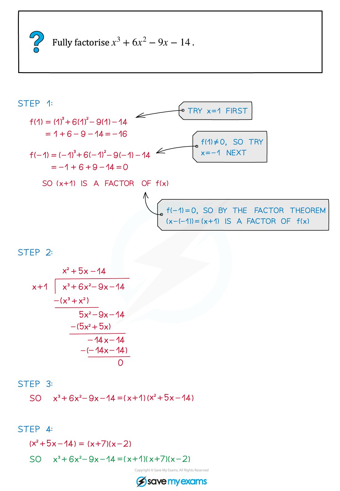
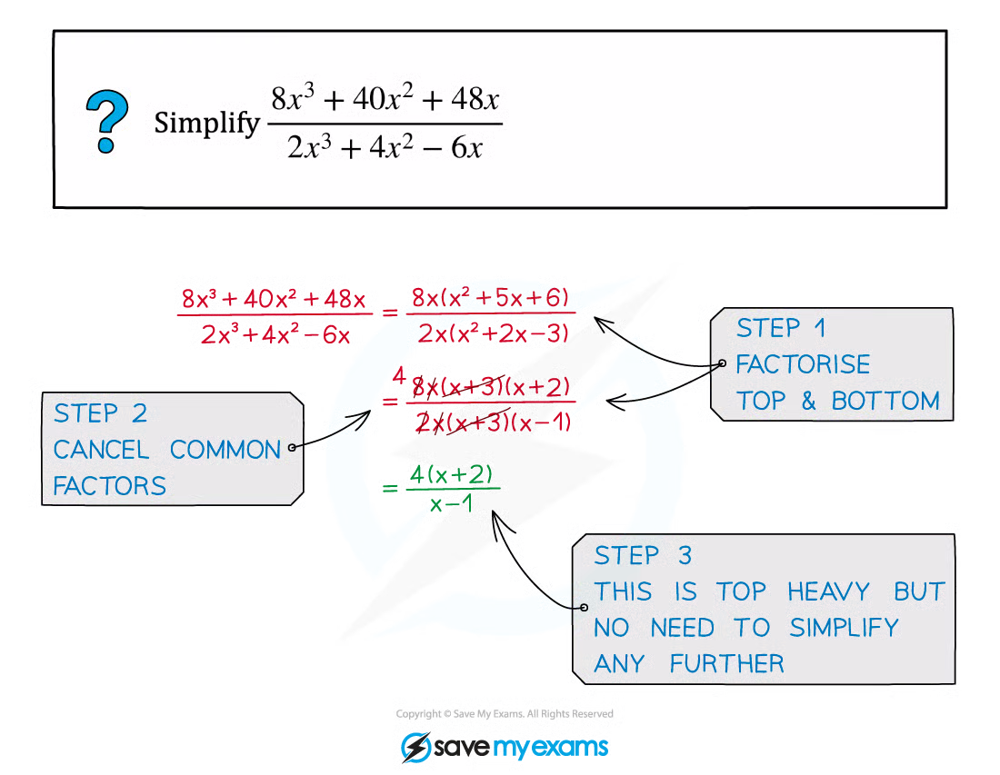
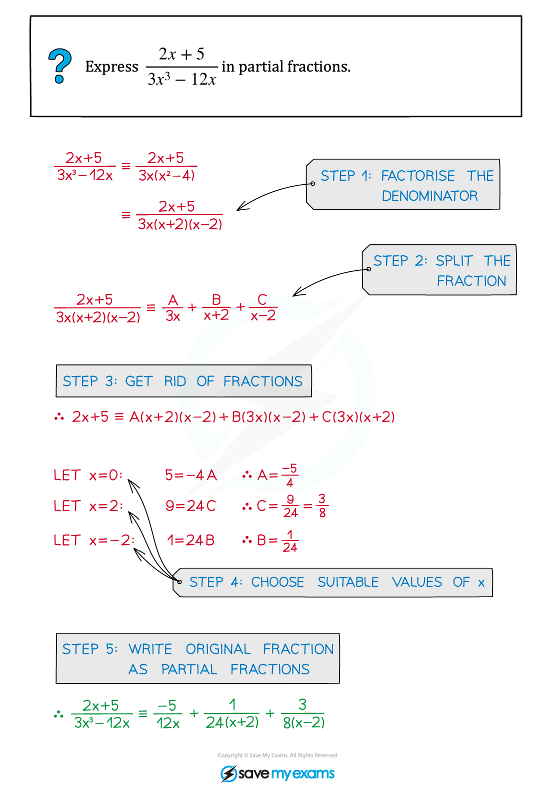
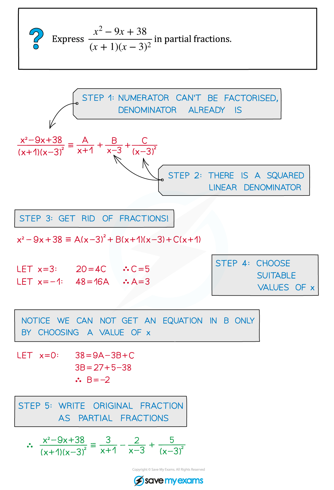
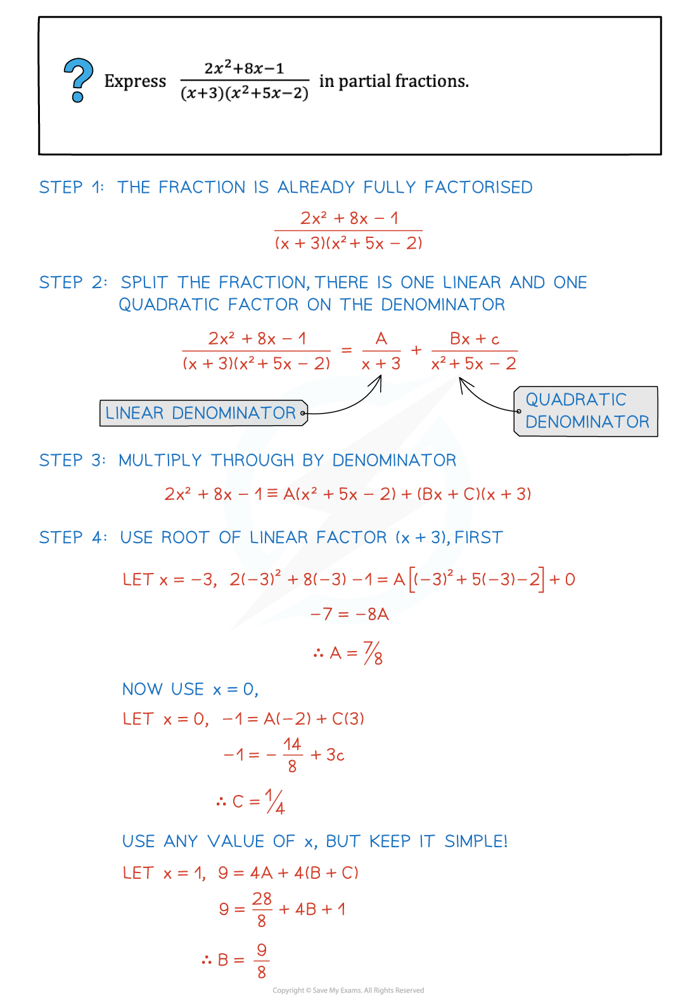
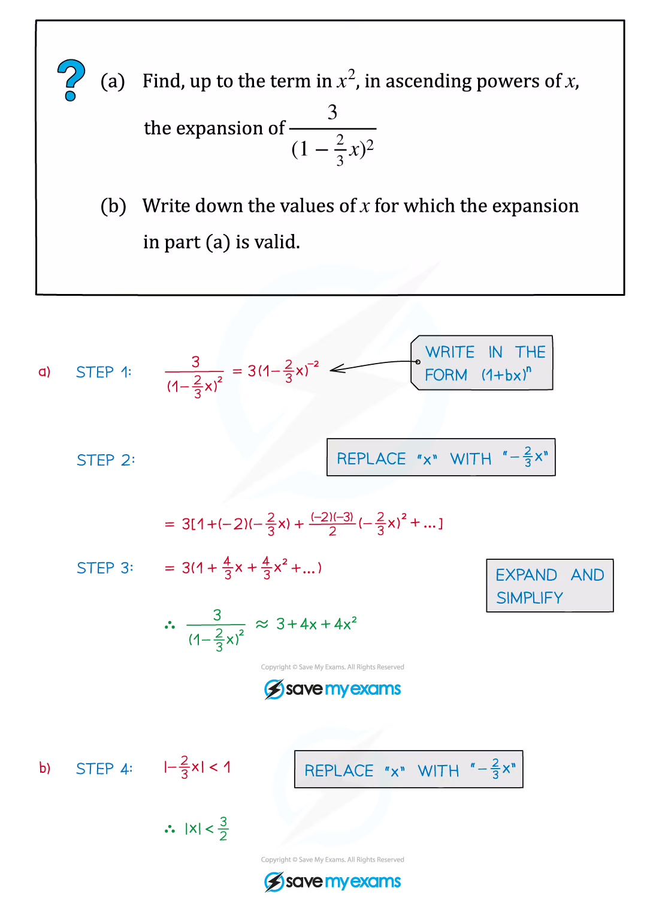
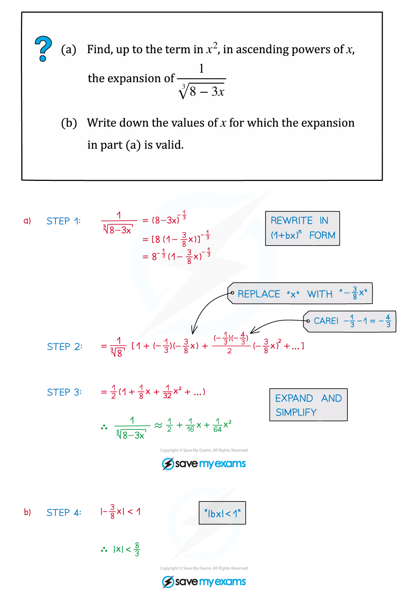
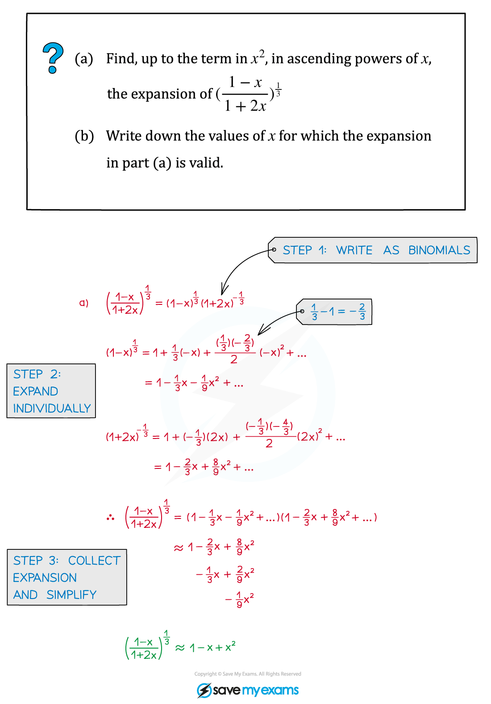
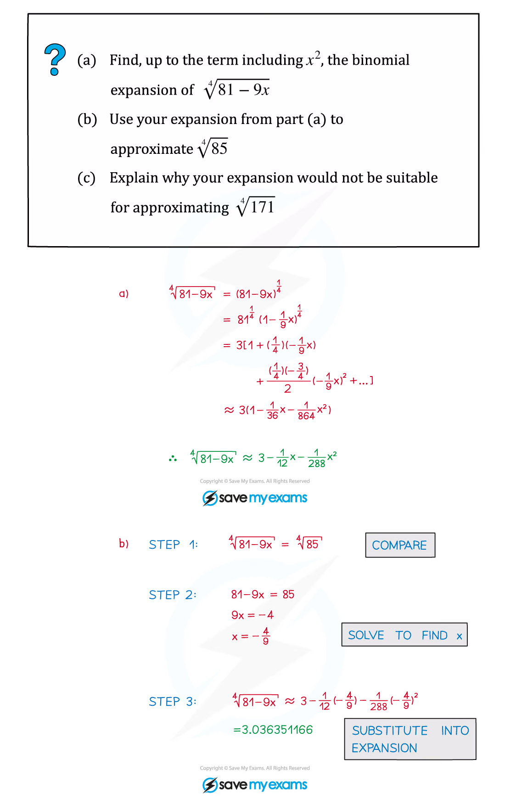

::: {.callout-important}
## 本节考纲要求

本页依据 9709 Mathematics 2026–2027 syllabus 3.1 Algebra，覆盖：

- modulus 的含义、$y=|ax+b|$ 图像，以及 modulus equations and inequalities；
- polynomial division（被除式次数不超过 4）、quotient、remainder、factor theorem 与 remainder theorem；
- 指定形式的 partial fractions；
- $(1+x)^n$ 的 general binomial expansion（$n$ 为有理数）、有效范围与应用。

考纲明确：非线性函数的 $y=|f(x)|$ 与 $y=f(|x|)$ 图像不在本节要求内；partial fractions 不包含分子次数高于分母的情形。
:::

## Learning objectives

::: {.study-card}

- [ ] 能把 $|u|$ 转化为 $u\ge0$ 或 $u<0$ 的分段表达式
- [ ] 能用图像或平方关系解 modulus equations and inequalities
- [ ] 能进行 polynomial division，并明确写出 quotient 与 remainder
- [ ] 能熟练使用 factor theorem 与 remainder theorem
- [ ] 能识别三类考纲规定的 partial-fraction form
- [ ] 能展开 $(1+bx)^n$，判断 validity，并将多个展开相乘或合并

:::

## 1. Modulus

::: {.study-card}
### Meaning and graph of modulus

对于实数 $u$，

$$
|u|=\begin{cases}u,&u\ge0,\\-u,&u<0.\end{cases}
$$

所以 $y=|ax+b|$ 的图像是一个 V 形：先画直线 $y=ax+b$，再把 $x$ 轴下方的部分关于 $x$ 轴反射。顶点位于 $ax+b=0$，即 $\left(-b/a,0\right)$（$a\ne0$）。

常用等价关系：

$$|a|=|b|\iff a^2=b^2,$$

$$|x-a|<b\iff a-b<x<a+b\qquad(b>0).$$
:::

::: {.formula-panel}
### Solving modulus equations and inequalities

遇到 $|f(x)|=|g(x)|$，可以写成 $f(x)=g(x)$ 或 $f(x)=-g(x)$；遇到 $|f(x)|<|g(x)|$，可在两边非负时平方，或先画图确认符号区间。最后必须代回原不等式检查，尤其是严格不等号不能写成等号。
:::

::: {.worked-example}
Worked example · 笔记第 5 页

{.note-figure fig-alt="Worked example showing y equals absolute value of 3x plus 1 and a line"}

这道例题的核心是：$|3x+1|$ 的负值部分要关于 $x$ 轴反射；图像交点个数就是方程解的个数。
:::

::: {.worked-example}
Worked example · 笔记第 8 页

{.note-figure fig-alt="Worked example solving an absolute value equation and inequality"}

解 modulus inequality 时，图像可以直接告诉你应保留两个交点之间还是外侧区间；代数法则要与图像结论一致。
:::

## 2. Polynomial division and theorems

::: {.study-card}
### Polynomial division

若 $f(x)$ 除以 $d(x)$，则

$$
f(x)=d(x)q(x)+r(x),\qquad \deg r<\deg d.
$$

当除式是二次式时，余式至多为一次式。考试中要区分：**quotient 是商，remainder 是余式**，并可用恒等式复核结果。
:::

::: {.worked-example}
Worked example · 笔记第 14 页

{.note-figure fig-alt="Worked example dividing a quartic polynomial by a linear factor"}
:::

::: {.worked-example}
Worked example · 笔记第 31 页

{.note-figure fig-alt="Worked example identifying quotient and remainder after polynomial division"}
:::

::: {.study-card}
### Factor theorem

$$
(x-a)\text{ is a factor of }f(x)\iff f(a)=0.
$$

若除式是 $ax-b$，对应的检验点是 $x=b/a$。要因式分解 cubic，通常先尝试 $x=1,-1,2,-2,3,-3$ 等整数根，再用 polynomial division 降次。
:::

::: {.worked-example}
Worked example · 笔记第 18 页

{.note-figure fig-alt="Worked example using the factor theorem to find factors"}
:::

::: {.study-card}
### Remainder theorem

当 $f(x)$ 除以 $(x-a)$ 时，余数为 $f(a)$：

$$
f(x)=(x-a)q(x)+f(a).
$$

当除式为 $(ax-b)$ 时，余数为 $f\!\left(\frac ba\right)$。这常用于由两个 remainder conditions 建立 simultaneous equations。
:::

::: {.worked-example}
Worked example · 笔记第 20 页

{.note-figure fig-alt="Worked example using two remainder conditions to find coefficients"}
:::

::: {.worked-example}
Worked example · 笔记第 24 页

{.note-figure fig-alt="Worked example fully factorising a cubic polynomial"}
:::

::: {.worked-example}
Worked example · 笔记第 28 页

{.note-figure fig-alt="Worked example simplifying a rational expression by factorising"}
:::

## 3. Partial fractions

::: {.study-card}
### Required forms

先确保分子次数小于分母次数，再完全因式分解 denominator。考纲规定的三种基本形式是：

$$
\frac{P(x)}{(ax+b)(cx+d)(ex+f)}=\frac A{ax+b}+\frac B{cx+d}+\frac C{ex+f},
$$

$$
\frac{P(x)}{(ax+b)(cx+d)^2}=\frac A{ax+b}+\frac B{cx+d}+\frac C{(cx+d)^2},
$$

$$
\frac{P(x)}{(ax+b)(cx^2+d)}=\frac A{ax+b}+\frac{Bx+C}{cx^2+d}.
$$

乘回 denominator 后，优先代入能令某个 factor 为零的 $x$ 值；若无法一次消去未知数，再比较 coefficients 或解 simultaneous equations。
:::

::: {.worked-example}
Worked example · 笔记第 35 页

{.note-figure fig-alt="Worked example decomposing a rational function into partial fractions"}
:::

::: {.worked-example}
Worked example · 笔记第 39 页

{.note-figure fig-alt="Worked example with a repeated linear factor in the denominator"}
:::

::: {.worked-example}
Worked example · 笔记第 41 页

{.note-figure fig-alt="Worked example with one linear and one quadratic denominator factor"}
:::

## 4. General binomial expansion

::: {.formula-panel}
### Formula and validity

$$
(1+x)^n=1+nx+\frac{n(n-1)}{2!}x^2+\frac{n(n-1)(n-2)}{3!}x^3+\cdots
$$

当 $n$ 不是非负整数时，这是 infinite expansion，并且必须满足

$$|x|<1.$$

若括号是 $(1+bx)^n$，有效条件是 $|bx|<1$。对多个 binomial expansion，最终有效范围是各条件的 intersection。
:::

::: {.worked-example}
Worked example · 笔记第 52 页

{.note-figure fig-alt="Worked example expanding a rational expression using the general binomial theorem"}
:::

::: {.worked-example}
Worked example · 笔记第 55 页

{.note-figure fig-alt="Worked example expanding a square-root expression with a binomial series"}
:::

::: {.worked-example}
Worked example · 笔记第 61 页

{.note-figure fig-alt="Worked example multiplying two general binomial expansions"}
:::

::: {.worked-example}
Worked example · 笔记第 65 页

{.note-figure fig-alt="Worked example using a binomial expansion for approximation"}
:::

## 5. Paper 3 past-paper questions

本节保留 **20 道** 与本章考点直接相关的题目：modulus、polynomial division、factor/remainder theorem、partial fractions 和 binomial expansion。题目文字保持原题；答案区按对应 mark scheme 展开方法、临界值/系数和最终结论。

### Modulus

::: {.question-card #q-2020-mj-33}
### Example 1 · Modulus inequality · 9709/33/M/J/20 Q1
modulusinequality

Solve the inequality $|2x-1|>3|x+2|$. **[4]**

Show detailed mark scheme answer

Both sides are non-negative, so squaring preserves the inequality:

$$
(2x-1)^2>9(x+2)^2.
$$

Expanding and collecting terms,

$$4x^2-4x+1>9x^2+36x+36,$$

$$5x^2+40x+35<0,$$

$$5(x+7)(x+1)<0.$$

The critical values are $x=-7$ and $x=-1$. Since the quadratic has positive leading coefficient, it is negative between its roots:

$$\boxed{-7<x<-1}.$$

<label class="done-toggle"><input type="checkbox" data-progress="2020-mj-33"> Completed</label>

<strong>Source:</strong> `PastPaper/2020/2020/9709-s20-qp-33.pdf` and matching mark scheme.

:::

::: {.question-card #q-2020-on-31}
### Example 2 · Modulus inequality · 9709/31/O/N/20 Q1
moduluspiecewise method

Solve the inequality $2-5x>2|x-3|$. **[4]**

Show detailed mark scheme answer

For $x<3$, $|x-3|=3-x$, so

$$2-5x>2(3-x)=6-2x\implies -4>3x\implies x<-\frac43.$$

For $x\ge3$, $|x-3|=x-3$, giving $2-5x>2x-6$, hence $x<8/7$, which is incompatible with $x\ge3$. Thus this branch gives no solutions.

Therefore

$$\boxed{x<-\frac43}.$$

<label class="done-toggle"><input type="checkbox" data-progress="2020-on-31"> Completed</label>

<strong>Source:</strong> `PastPaper/2020/2020/9709_w20_qp_31.pdf` and matching mark scheme.

:::

::: {.question-card #q-2021-mj-31}
### Example 3 · Modulus inequality · 9709/31/M/J/21 Q1
modulusquadratic

Solve the inequality $2|3x-1|<|x+1|$. **[4]**

Show detailed mark scheme answer

Square both non-negative sides:

$$4(3x-1)^2<(x+1)^2.$$

Thus

$$36x^2-24x+4<x^2+2x+1,$$

$$35x^2-26x+3<0.$$

The roots are

$$x=\frac{26\pm\sqrt{(-26)^2-4(35)(3)}}{70}=\frac{26\pm16}{70},$$

so $x=1/7$ or $x=3/5$. The quadratic is negative between the roots:

$$\boxed{\frac17<x<\frac35}.$$

<label class="done-toggle"><input type="checkbox" data-progress="2021-mj-31"> Completed</label>

<strong>Source:</strong> `PastPaper/2021/2021/9709_s21_qp_31.pdf` and matching mark scheme.

:::

::: {.question-card #q-2021-mj-32}
### Example 4 · Modulus inequality · 9709/32/M/J/21 Q1
modulusquadratic

Solve the inequality $|2x-1|<3|x+1|$. **[4]**

Show detailed mark scheme answer

Squaring gives

$$4x^2-4x+1<9x^2+18x+9,$$

$$5x^2+22x+8>0.$$

The roots are

$$x=\frac{-22\pm\sqrt{22^2-4(5)(8)}}{10}=\frac{-22\pm18}{10},$$

namely $-4$ and $-2/5$. Since the quadratic opens upwards, it is positive outside the roots:

$$\boxed{x<-4\quad\text{or}\quad x>-\frac25}.$$

<label class="done-toggle"><input type="checkbox" data-progress="2021-mj-32"> Completed</label>

<strong>Source:</strong> `PastPaper/2021/2021/9709_s21_qp_32.pdf` and matching mark scheme.

:::

::: {.question-card #q-2022-fm-32}
### Example 5 · Modulus inequality · 9709/32/F/M/22 Q1
modulusinequality

Solve the inequality $|2x+3|>3|x+2|$. **[4]**

Show detailed mark scheme answer

Squaring and rearranging,

$$4x^2+12x+9>9x^2+36x+36,$$

$$5x^2+24x+27<0=5(x+3)\left(x+\frac95\right).$$

The roots are $-3$ and $-9/5$. The quadratic is negative between them:

$$\boxed{-3<x<-\frac95}.$$

<label class="done-toggle"><input type="checkbox" data-progress="2022-fm-32"> Completed</label>

<strong>Source:</strong> `PastPaper/2022/2022/9709_m22_qp_32.pdf` and matching mark scheme.

:::

::: {.question-card #q-2022-mj-33}
### Example 6 · Modulus inequality with a parameter · 9709/33/M/J/22 Q1
modulusparameter

Find, in terms of $a$, the set of values of $x$ satisfying $2|3x+a|<|2x+3a|$, where $a$ is a positive constant. **[4]**

Show detailed mark scheme answer

Both sides are non-negative, so square and factor the difference:

$$
4(3x+a)^2<(2x+3a)^2,
$$

$$
[2(3x+a)-(2x+3a)][2(3x+a)+(2x+3a)]<0.
$$

Hence

$$
(4x-a)(8x+5a)<0.
$$

Because $a>0$, the critical values are $x=-5a/8$ and $x=a/4$, and the product is negative between them:

$$\boxed{-\frac{5a}{8}<x<\frac a4}.$$

<label class="done-toggle"><input type="checkbox" data-progress="2022-mj-33"> Completed</label>

<strong>Source:</strong> `PastPaper/2022/2022/9709_s22_qp_33.pdf` and matching mark scheme.

:::

::: {.question-card #q-2022-on-31}
### Example 7 · Modulus graph and inequality · 9709/31/O/N/22 Q1
modulusgraph

**(a)** Sketch the graph of $y=|2x+1|$. **[1]**

**(b)** Solve the inequality $3x+5<|2x+1|$. **[3]**

Show detailed mark scheme answer

The graph is a V with vertex $(-1/2,0)$.

For $x<-1/2$, $|2x+1|=-2x-1$, so

$$3x+5<-2x-1\implies5x<-6\implies x<-\frac65.$$

For $x\ge-1/2$, $|2x+1|=2x+1$, so $3x+5<2x+1$ gives $x<-4$, which is incompatible with $x\ge-1/2$. Therefore

$$\boxed{x<-\frac65}.$$

<label class="done-toggle"><input type="checkbox" data-progress="2022-on-31"> Completed</label>

<strong>Source:</strong> `PastPaper/2022/2022/9709_w22_qp_31.pdf` and matching mark scheme.

:::

::: {.question-card #q-2023-on-32}
### Example 8 · Modulus graph and inequality · 9709/32/O/N/23 Q1
modulusgraph

**(a)** Sketch the graph of $y=|4x-2|$. **[1]**

**(b)** Solve the inequality $1+3x<|4x-2|$. **[4]**

Show detailed mark scheme answer

The graph is a V with vertex $(1/2,0)$.

If $x<1/2$, then $|4x-2|=2-4x$ and

$$1+3x<2-4x\implies7x<1\implies x<\frac17.$$

If $x\ge1/2$, then $|4x-2|=4x-2$ and

$$1+3x<4x-2\implies x>3.$$

Thus

$$\boxed{x<\frac17\quad\text{or}\quad x>3}.$$

<label class="done-toggle"><input type="checkbox" data-progress="2023-on-32"> Completed</label>

<strong>Source:</strong> `PastPaper/2023/2023/9709_w23_qp_32.pdf` and matching mark scheme.

:::

::: {.question-card #q-2024-mj-32}
### Example 9 · Modulus graph and inequality · 9709/32/M/J/24 Q1
modulusparameter

**(a)** Sketch the graph of $y=|x-2a|$, where $a$ is a positive constant. **[1]**

**(b)** Solve the inequality $2x-3a<|x-2a|$. **[2]**

Show detailed mark scheme answer

The V has vertex $(2a,0)$. For the relevant branch $x<2a$, $|x-2a|=2a-x$, so

$$2x-3a<2a-x\implies3x<5a\implies x<\frac53a.$$

The other branch gives $x>5a$, which is incompatible with $x\ge2a$ only if the branch condition is checked? In fact for $x\ge2a$, the inequality becomes $2x-3a<x-2a$, hence $x<a$, incompatible with $x\ge2a$. Therefore

$$\boxed{x<\frac53a}.$$

<label class="done-toggle"><input type="checkbox" data-progress="2024-mj-32"> Completed</label>

<strong>Source:</strong> `PastPaper/2024/2024/A-Level-CAIE数学QP-202406-Mathematics-P32-A-Level题库大全小程序.pdf` and matching mark scheme.

:::

### Polynomial division, theorems and partial fractions

::: {.question-card #q-2020-mj-32}
### Example 10 · Polynomial division · 9709/32/M/J/20 Q1
divisionquotient and remainder

Find the quotient and remainder when $6x^4+x^3-x^2+5x-6$ is divided by $2x^2-x+1$. **[3]**

Show detailed mark scheme answer

First term: $6x^4/(2x^2)=3x^2$. Subtracting $3x^2(2x^2-x+1)$ leaves $4x^3-4x^2+5x-6$.

Next term: $4x^3/(2x^2)=2x$. Subtracting $2x(2x^2-x+1)$ leaves $-2x^2+3x-6$.

Next term: $-2x^2/(2x^2)=-1$. Subtracting $-(2x^2-x+1)$ leaves $2x-5$, whose degree is less than 2. Hence

$$\boxed{q(x)=3x^2+2x-1,\qquad r(x)=2x-5}.$$

<label class="done-toggle"><input type="checkbox" data-progress="2020-mj-32"> Completed</label>

<strong>Source:</strong> `PastPaper/2020/2020/9709-s20-qp-32.pdf` and matching mark scheme.

:::

::: {.question-card #q-2020-mj-2}
### Example 11 · General binomial expansion · 9709/31/M/J/20 Q2(a)
binomialvalidity

Expand $(2-3x)^{-2}$ in ascending powers of $x$, up to and including the term in $x^2$, simplifying the coefficients. **[4]**

Show detailed mark scheme answer

Write

$$
(2-3x)^{-2}=\frac14\left(1-\frac32x\right)^{-2}.
$$

Using $(1+u)^{-2}=1-2u+3u^2+\cdots$ with $u=-3x/2$,

$$
(2-3x)^{-2}=\frac14\left[1+3x+\frac{27}{4}x^2+\cdots\right].
$$

Therefore

$$\boxed{\frac14+\frac34x+\frac{27}{16}x^2}.$$

The validity condition is $|3x/2|<1$, i.e. $|x|<2/3$.

<label class="done-toggle"><input type="checkbox" data-progress="2020-mj-2"> Completed</label>

<strong>Source:</strong> `PastPaper/2020/2020/9709-s20-qp-31.pdf` and matching mark scheme.

:::

::: {.question-card #q-2020-mj-7}
### Example 12 · Partial fractions · 9709/33/M/J/20 Q7(a)
partial fractionslinear factors

Let $f(x)=\dfrac{2}{(2x-1)(2x+1)}$. Express $f(x)$ in partial fractions. **[2]**

Show detailed mark scheme answer

Assume

$$\frac{2}{(2x-1)(2x+1)}=\frac A{2x-1}+\frac B{2x+1}.$$

Multiplying through gives

$$2=A(2x+1)+B(2x-1).$$

Comparing coefficients gives $A+B=0$ and $A-B=2$, so $A=1$ and $B=-1$. Therefore

$$\boxed{f(x)=\frac1{2x-1}-\frac1{2x+1}}.$$

<label class="done-toggle"><input type="checkbox" data-progress="2020-mj-7"> Completed</label>

<strong>Source:</strong> `PastPaper/2020/2020/9709-s20-qp-33.pdf` and matching mark scheme.

:::

::: {.question-card #q-2021-fm-2}
### Example 13 · Factor and remainder theorem · 9709/32/F/M/21 Q2
factor theoremremainder theorem

The polynomial $ax^3+5x^2-4x+b$ is $p(x)$. It is given that $(x+2)$ is a factor of $p(x)$ and that division by $(x+1)$ leaves remainder 2. Find $a$ and $b$. **[5]**

Show detailed mark scheme answer

Factor theorem:

$$p(-2)=0\implies-8a+20+8+b=0\implies-8a+b=-28.$$

Remainder theorem:

$$p(-1)=2\implies-a+5+4+b=2\implies-a+b=-7.$$

Subtracting the second equation from the first gives $-7a=-21$, so $a=3$. Then $-3+b=-7$, giving $b=-4$.

$$\boxed{a=3,\qquad b=-4}.$$

<label class="done-toggle"><input type="checkbox" data-progress="2021-fm-2"> Completed</label>

<strong>Source:</strong> `PastPaper/2021/2021/9709_m21_qp_32.pdf` and matching mark scheme.

:::

::: {.question-card #q-2021-on-31}
### Example 14 · Exponential modulus equation · 9709/31/O/N/21 Q1
modulusexponentials

Solve the equation $4|5^x-1|=5^x$, giving your answers correct to 3 decimal places. **[4]**

Show detailed mark scheme answer

Let $u=5^x$, so $u>0$.

If $u\ge1$, then $4(u-1)=u$, so $3u=4$ and $u=4/3$, giving $x=\ln(4/3)/\ln5=0.179\ldots$.

If $0<u<1$, then $4(1-u)=u$, so $5u=4$ and $u=4/5$, giving $x=\ln(4/5)/\ln5=-0.139\ldots$.

Both values satisfy their assumed cases, hence

$$\boxed{x=0.179\quad\text{or}\quad x=-0.139}.$$

<label class="done-toggle"><input type="checkbox" data-progress="2021-on-31"> Completed</label>

<strong>Source:</strong> `PastPaper/2021/2021/9709_w21_qp_31.pdf` and matching mark scheme.

:::

::: {.question-card #q-2021-on-33}
### Example 15 · Polynomial division · 9709/33/O/N/21 Q1
divisionquotient and remainder

Find the quotient and remainder when $2x^4+1$ is divided by $x^2-x+2$. **[3]**

Show detailed mark scheme answer

The successive quotient terms are $2x^2$, then $2x$, then $-2$:

$$
2x^4+1=(x^2-x+2)(2x^2+2x-2)+(-6x+5).
$$

Therefore

$$\boxed{q(x)=2x^2+2x-2,\qquad r(x)=-6x+5}.$$

<label class="done-toggle"><input type="checkbox" data-progress="2021-on-33"> Completed</label>

<strong>Source:</strong> `PastPaper/2021/2021/9709_w21_qp_33.pdf` and matching mark scheme.

:::

::: {.question-card #q-2023-mj-8}
### Example 16 · Partial fractions with a repeated factor · 9709/31/M/J/23 Q8(a)
partial fractionsrepeated factor

Let $f(x)=\dfrac{3-3x^2}{(2x+1)(x+2)^2}$. Express $f(x)$ in partial fractions. **[5]**

Show detailed mark scheme answer

Use the required form

$$\frac{3-3x^2}{(2x+1)(x+2)^2}=\frac A{2x+1}+\frac B{x+2}+\frac C{(x+2)^2}.$$

After multiplying through by $(2x+1)(x+2)^2$,

$$3-3x^2=A(x+2)^2+B(2x+1)(x+2)+C(2x+1).$$

Putting $x=-1/2$ gives $15/4=(9/4)A$, so $A=1$. Putting $x=-2$ gives $-9=-3C$, so $C=3$. Finally $x=0$ gives $3=4A+2B+C$, hence $B=-2$.

Therefore

$$\boxed{f(x)=\frac1{2x+1}-\frac2{x+2}+\frac3{(x+2)^2}}.$$

<label class="done-toggle"><input type="checkbox" data-progress="2023-mj-8"> Completed</label>

<strong>Source:</strong> `PastPaper/2023/2023/9709_s23_qp_31.pdf` and matching mark scheme.

:::

### Binomial expansion and recent theorem questions

::: {.question-card #q-2021-mj-33}
### Example 17 · Binomial expansion · 9709/33/M/J/21 Q1
binomialseries

Expand $(1+3x)^{2/3}$ in ascending powers of $x$, up to and including the term in $x^3$, simplifying the coefficients. **[4]**

Show detailed mark scheme answer

Use

$$
(1+u)^n=1+nu+\frac{n(n-1)}2u^2+\frac{n(n-1)(n-2)}6u^3+\cdots
$$

with $n=2/3$ and $u=3x$:

$$1+\frac23(3x)+\frac{(2/3)(-1/3)}2(3x)^2+\frac{(2/3)(-1/3)(-4/3)}6(3x)^3.$$

Simplifying,

$$\boxed{1+2x-x^2+\frac43x^3}.$$

<label class="done-toggle"><input type="checkbox" data-progress="2021-mj-33"> Completed</label>

<strong>Source:</strong> `PastPaper/2021/2021/9709_s21_qp_33.pdf` and matching mark scheme.

:::

::: {.question-card #q-2024-fm-32}
### Example 18 · Polynomial division · 9709/32/F/M/24 Q1
divisionquotient and remainder

Find the quotient and remainder when $x^4-3x^3+9x^2-12x+27$ is divided by $x^2+5$. **[3]**

Show detailed mark scheme answer

The quotient begins with $x^2$, then $-3x$, then $+4$:

$$
x^4-3x^3+9x^2-12x+27=(x^2+5)(x^2-3x+4)+(3x+7).
$$

The remainder has degree less than 2, so

$$\boxed{q(x)=x^2-3x+4,\qquad r(x)=3x+7}.$$

<label class="done-toggle"><input type="checkbox" data-progress="2024-fm-32"> Completed</label>

<strong>Source:</strong> `PastPaper/2024/2024/A-Level-CAIE数学QP-202403-Mathematics-P32-A-Level题库大全小程序.pdf` and matching mark scheme.

:::

::: {.question-card #q-2024-mj-31}
### Example 19 · Product of expansions · 9709/31/M/J/24 Q1
binomialseries

Expand $(3+x)(1-2x)^{1/2}$ in ascending powers of $x$, up to and including the term in $x^2$, simplifying the coefficients. **[4]**

Show detailed mark scheme answer

First expand the square-root factor:

$$
(1-2x)^{1/2}=1+\frac12(-2x)+\frac{(1/2)(-1/2)}2(-2x)^2+\cdots
=1-x-\frac12x^2+\cdots.
$$

Now multiply by $(3+x)$ and retain terms through $x^2$:

$$
(3+x)(1-x-\tfrac12x^2)=3-3x-\tfrac32x^2+x-x^2+\cdots.
$$

Hence

$$\boxed{3-2x-\frac52x^2}.$$

<label class="done-toggle"><input type="checkbox" data-progress="2024-mj-31"> Completed</label>

<strong>Source:</strong> `PastPaper/2024/2024/A-Level-CAIE数学QP-202406-Mathematics-P31-A-Level题库大全小程序.pdf` and matching mark scheme.

:::

::: {.question-card #q-2024-on-31}
### Example 20 · Factor and remainder theorem · 9709/31/O/N/24 Q1
factor theoremremainder theorem

The polynomial $4x^3+ax^2+5x+b$, where $a$ and $b$ are constants, is denoted by $p(x)$. It is given that $(2x+1)$ is a factor of $p(x)$. When $p(x)$ is divided by $(x-4)$ the remainder is equal to 3 times the remainder when $p(x)$ is divided by $(x-2)$. Find the values of $a$ and $b$. **[5]**

Show detailed mark scheme answer

Because $2x+1=0$ at $x=-1/2$, the factor theorem gives

$$p(-\tfrac12)=0\implies \frac a4+b=3\implies a+4b=12.$$

The remainder theorem gives $p(4)=3p(2)$:

$$276+16a+b=3(42+4a+b),$$

so

$$2a-b=-75.$$

Solving $a+4b=12$ and $2a-b=-75$ gives $b=11$ and $a=-32$.

$$\boxed{a=-32,\qquad b=11}.$$

<label class="done-toggle"><input type="checkbox" data-progress="2024-on-31"> Completed</label>

<strong>Source:</strong> `PastPaper/2024/2024/A-Level-CAIE数学QP-202410-Mathematics-P31-A-Level题库大全小程序.pdf` and matching mark scheme.

:::

## Chapter checklist

::: {.study-card}

- [ ] 我能画出 $y=|ax+b|$ 并标出顶点
- [ ] 我能在 modulus inequality 中处理严格不等号与区间方向
- [ ] 我能用 $f(a)=0$ 找 factor，并用 $f(a)$ 找 remainder
- [ ] 我能检查 $f(x)=d(x)q(x)+r(x)$ 的 quotient/remainder 结果
- [ ] 我能写出 repeated factor 与 quadratic factor 的 partial-fraction form
- [ ] 我能判断 general binomial expansion 的 validity
- [ ] 我能完成精选的 20 道 2020–2024 past-paper 题组

:::

### Source files

- [9709 Mathematics syllabus 2026–2027](../../697427-2026-2027-syllabus.pdf)
- [Algebra - Functions note PDF](../../Note/P3/P3/1.%20Algebra%20-%20Functions.pdf)

题目来自工作区内的 Cambridge 9709 Paper 3 题包；笔记 worked examples 由原 PDF 的独立图像对象合成白底 WEBP，未使用整页截图。

