::: {.callout-important}
## 本节考纲要求

本页依据 9709 Mathematics 2026–2027 syllabus 3.9，覆盖 complex number 的 real part、imaginary part、modulus、argument、conjugate；Cartesian 与 polar form 的四则运算；real-coefficient polynomial 的 conjugate roots；Argand diagram、square roots 和 loci。
:::

## 1. Core knowledge

::: {.formula-panel}
### Cartesian form and conjugate

设 $z=x+iy$，则

$$
\operatorname{Re}z=x,\qquad \operatorname{Im}z=y,\qquad z^*=x-iy,
$$

$$
|z|=\sqrt{x^2+y^2},\qquad |z|^2=zz^*.
$$

两个 complex numbers 相等，当且仅当 real parts 和 imaginary parts 分别相等。
:::

::: {.worked-example}
Worked example · Note PDF p.3

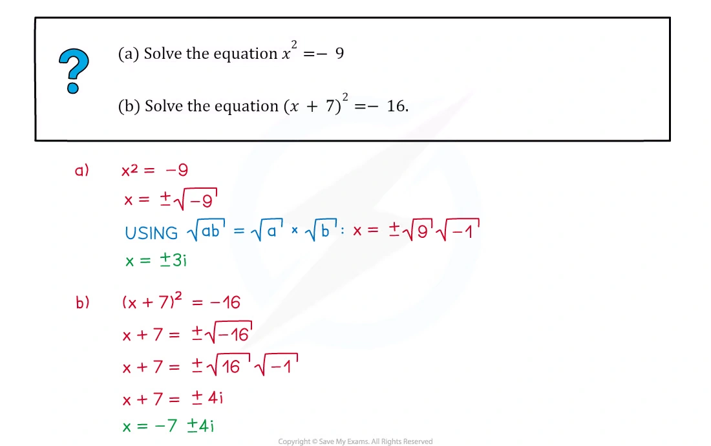{.note-figure fig-alt="Original extracted Complex Numbers note example on Cartesian form"}
:::

::: {.worked-example}
Worked example · Note PDF p.5

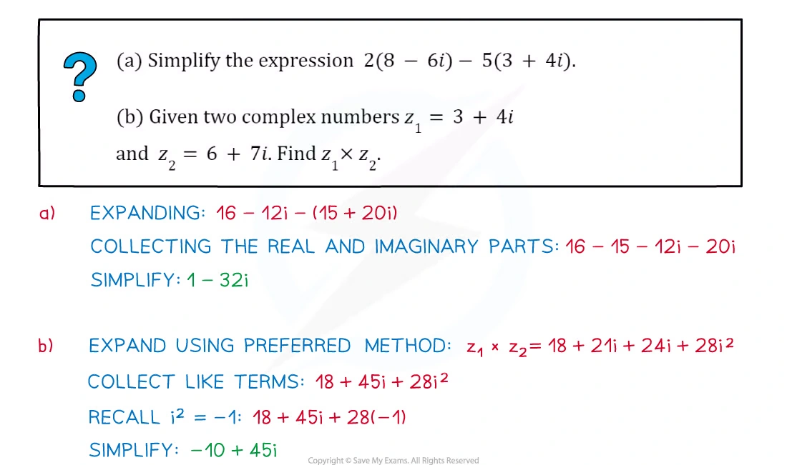{.note-figure fig-alt="Original extracted Complex Numbers note example on complex-number operations"}
:::

::: {.formula-panel}
### Multiplication and division in Cartesian form

$$
(a+bi)(c+di)=(ac-bd)+(ad+bc)i.
$$

除法乘以 denominator 的 conjugate：

$$
\frac{a+bi}{c+di}=\frac{(a+bi)(c-di)}{c^2+d^2}.
$$
:::

::: {.worked-example}
Worked example · Note PDF p.7

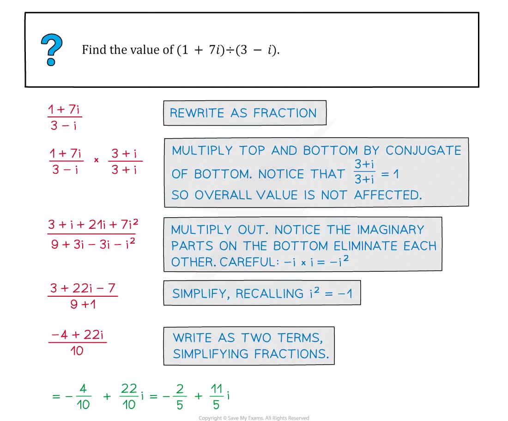{.note-figure fig-alt="Original extracted Complex Numbers note example on conjugates and modulus"}
:::

::: {.worked-example}
Worked example · Note PDF p.11

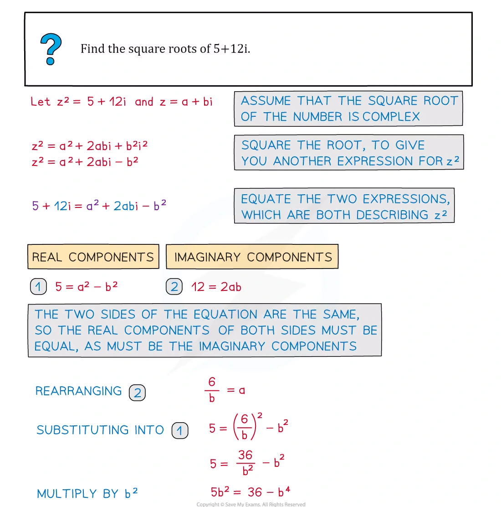{.note-figure fig-alt="Original extracted Complex Numbers note example on quadratic complex roots"}
:::

::: {.formula-panel}
### Polar form

$$
z=r(\cos\theta+i\sin\theta)=re^{i\theta},
\qquad r=|z|,\quad \theta=\arg z.
$$

在 polar form 中：

$$
z_1z_2=r_1r_2e^{i(\theta_1+\theta_2)},
\qquad
\frac{z_1}{z_2}=\frac{r_1}{r_2}e^{i(\theta_1-\theta_2)}.
$$

argument 通常取 $-\pi<\theta\le\pi$，除非题目指定其他 interval。
:::

::: {.worked-example}
Worked example · Note PDF p.19

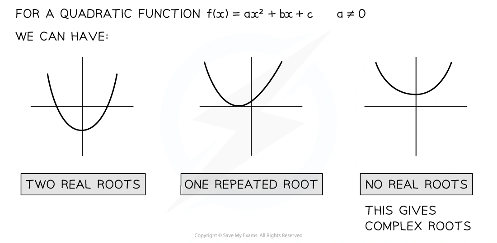{.note-figure fig-alt="Original extracted Complex Numbers note example on Argand representation"}
:::

::: {.worked-example}
Worked example · Note PDF p.30

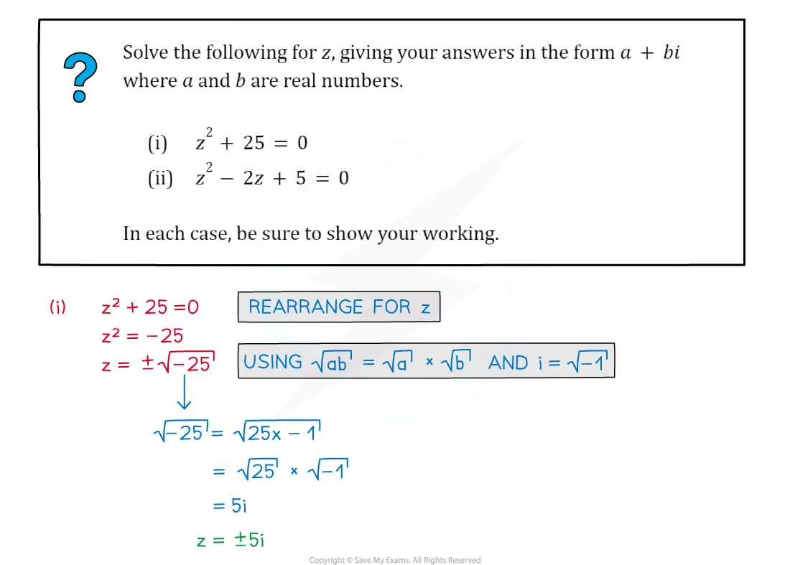{.note-figure fig-alt="Original extracted Complex Numbers note example on modulus loci"}
:::

::: {.formula-panel}
### Argand loci and roots

若 $z=x+iy$，则

$$
|z-(a+ib)|=r
\Longleftrightarrow
(x-a)^2+(y-b)^2=r^2,
$$

是 centre $(a,b)$、radius $r$ 的 circle。

若 polynomial 的 coefficients 全为 real，任何 non-real root $z$ 都对应 conjugate root $z^*$。求 square roots 时设 $w=a+ib$，再比较 real and imaginary parts。
:::

::: {.worked-example}
Worked example · Note PDF p.33

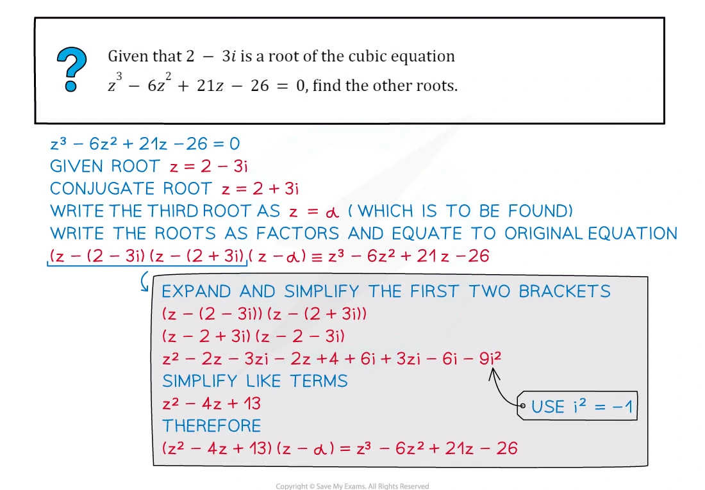{.note-figure fig-alt="Original extracted Complex Numbers note example on circular loci"}
:::

::: {.worked-example}
Worked example · Note PDF p.35

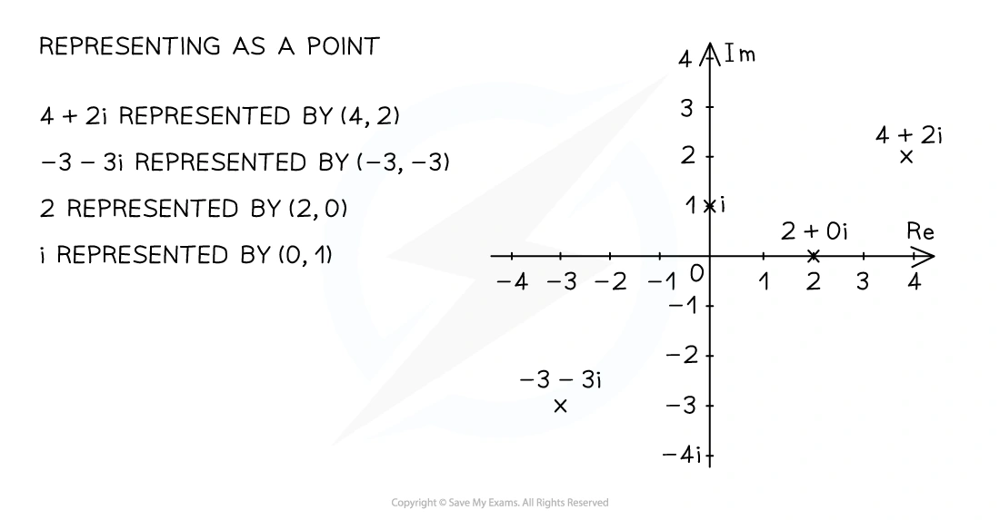{.note-figure fig-alt="Original extracted Complex Numbers note example on argument loci"}
:::

::: {.worked-example}
Worked example · Note PDF p.38

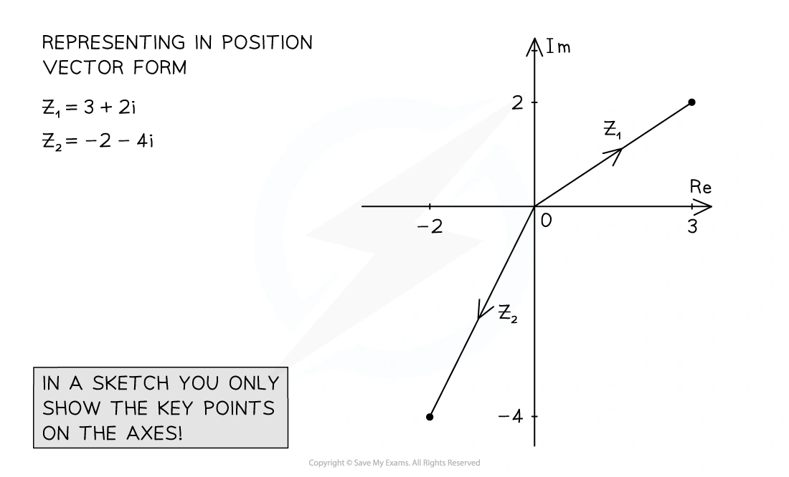{.note-figure fig-alt="Original extracted Complex Numbers note example on inequalities in an Argand diagram"}
:::

::: {.worked-example}
Worked example · Note PDF p.40

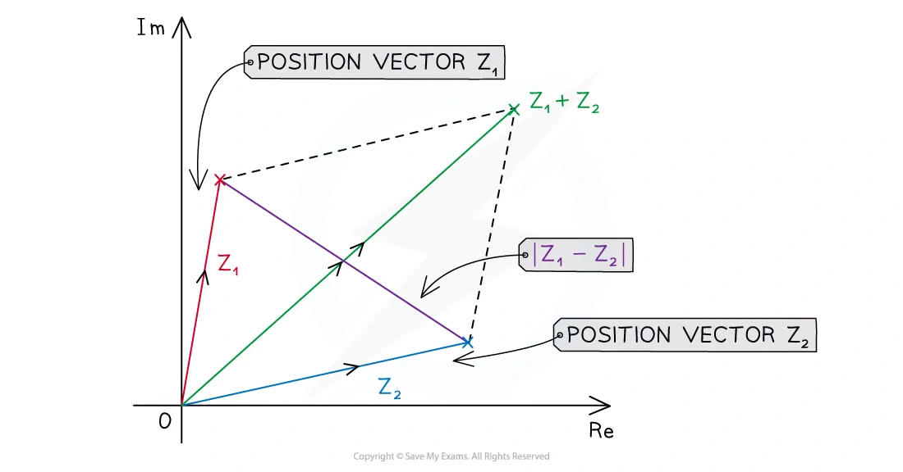{.note-figure fig-alt="Original extracted Complex Numbers note example on distance inequalities"}
:::

::: {.worked-example}
Worked example · Note PDF p.42

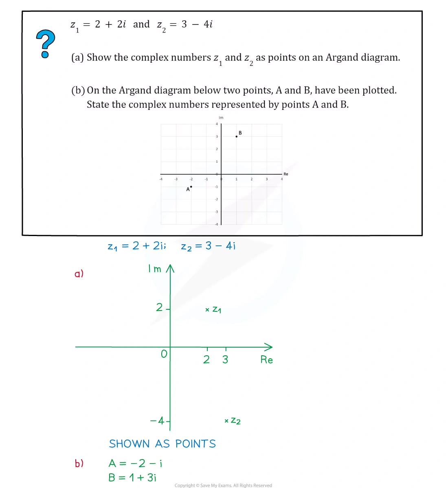{.note-figure fig-alt="Original extracted Complex Numbers note example on argument and modulus regions"}
:::

::: {.worked-example}
Worked example · Note PDF p.44

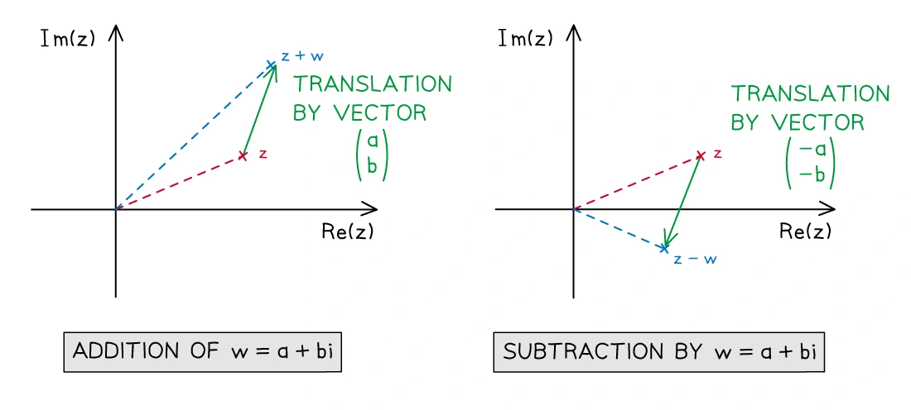{.note-figure fig-alt="Original extracted Complex Numbers note example on argument geometry"}
:::

::: {.worked-example}
Worked example · Note PDF p.50

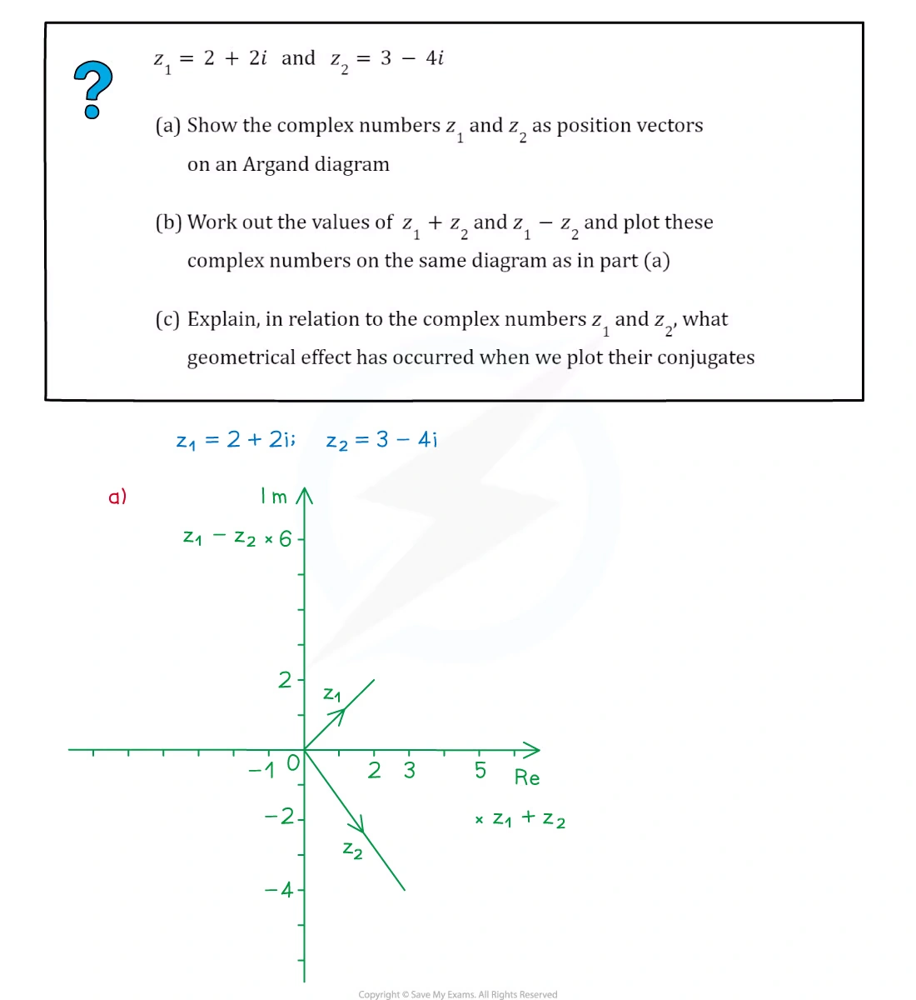{.note-figure fig-alt="Original extracted Complex Numbers note example on polar multiplication"}
:::

::: {.worked-example}
Worked example · Note PDF p.56

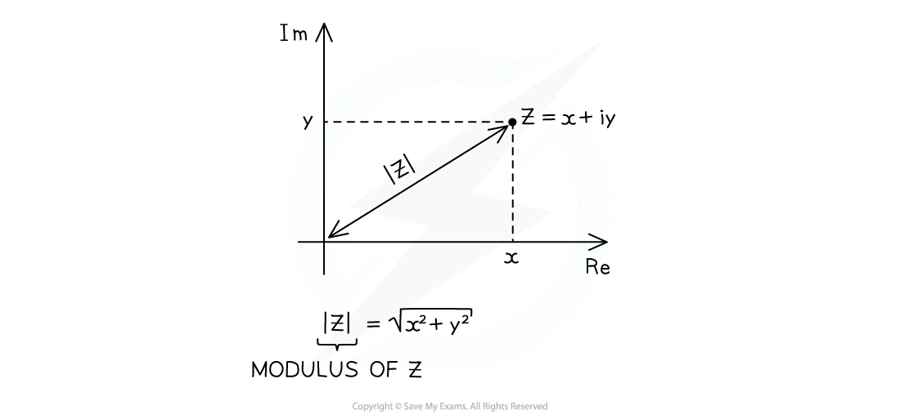{.note-figure fig-alt="Original extracted Complex Numbers note example on polar-form geometry"}
:::

## 2. Paper 3 past-paper questions

以下 20 题保留 past paper 原题文字；只对 PDF 中的排版符号作 LaTeX 规范化。答案按 matching mark scheme 展开。

::: {.question-card #cn-q01}
### Question 1 · 9709/31/O/N/20 Q2

On a sketch of an Argand diagram, shade the region whose points represent complex numbers $z$ satisfying the inequalities

$$
|z|\ge2\quad\text{and}\quad |z-1+i|\le1.
$$

**[4]**

Show detailed mark scheme answer

$|z|\ge2$ is the exterior of the circle centre $(0,0)$ radius $2$; $|z-(1-i)|\le1$ is the interior of the circle centre $(1,-1)$ radius $1$.

在 Argand diagram 上画两条边界：第一条为实线圆 $|z|=2$，第二条为实线圆 $|z-1+i|=1$；阴影取第二圆内部且在第一圆外部的交集。

<label class="done-toggle"><input type="checkbox" data-progress="cn-q01"> Completed</label>

<strong>Source:</strong> `PastPaper/2020/2020/9709_w20_qp_31.pdf`, Q2, and matching mark scheme.

:::

::: {.question-card #cn-q02}
### Question 2 · 9709/32/M/J/20 Q8(a–b)

(a) Solve the equation

$$
(1+2i)w+iw^*=3+5i.
$$

Give your answer in the form $x+iy$, where $x$ and $y$ are real.

(b) (i) On a sketch of an Argand diagram, shade the region whose points represent complex numbers $z$ satisfying the inequalities

$$
|z-2-2i|\le1\quad\text{and}\quad \arg(z-4i)\ge-\frac14\pi.
$$

(ii) Find the least value of $\operatorname{Im}z$ for points in this region, giving your answer in an exact form. **[4+4+2]**

Show detailed mark scheme answer

Let $w=x+iy$, so $w^*=x-iy$. Then

$$
(1+2i)(x+iy)+i(x-iy)=(x-y)+(3x+y)i.
$$

Thus $x-y=3$ and $3x+y=5$, giving $x=2,y=-1$ and

$$
\boxed{w=2-i}.
$$

The first locus is the circle centre $(2,2)$ radius $1$. The second inequality is the region on or above the ray from $(0,4)$ with argument $-\pi/4$.

For the least imaginary part, the lower boundary of the circle meets this ray at

$$
(x-2)^2+(4-x-2)^2=1
\Longrightarrow x=2+\frac1{\sqrt2},quad y=2-\frac1{\sqrt2}.
$$

Therefore

$$
\boxed{\min\operatorname{Im}z=2-\frac1{\sqrt2}}.
$$

<label class="done-toggle"><input type="checkbox" data-progress="cn-q02"> Completed</label>

<strong>Source:</strong> `PastPaper/2020/2020/9709-s20-qp-32.pdf`, Q8(a–b), and matching mark scheme.

:::

::: {.question-card #cn-q03}
### Question 3 · 9709/32/O/N/20 Q6(a–c)

The complex number $u$ is defined by

$$
u=\frac{7+i}{1-i}.
$$

(a) Express $u$ in the form $x+iy$, where $x$ and $y$ are real.

(b) Show on a sketch of an Argand diagram the points $A$, $B$ and $C$ representing $u$, $7+i$ and $1-i$ respectively.

(c) By considering the arguments of $7+i$ and $1-i$, show that

$$
\tan^{-1}\frac43=\tan^{-1}\frac17+\frac14\pi.
$$

**[3+2+3]**

Show detailed mark scheme answer

$$
u=\frac{(7+i)(1+i)}{(1-i)(1+i)}=\frac{6+8i}{2}=\boxed{3+4i}.
$$

The Argand points are $A=(3,4)$, $B=(7,1)$ and $C=(1,-1)$.

Now

$$
\arg u=\arg(7+i)-\arg(1-i)=\tan^{-1}\frac17-\left(-\frac14\pi\right).
$$

Since $u=3+4i$, $\arg u=\tan^{-1}(4/3)$, proving the identity.

<label class="done-toggle"><input type="checkbox" data-progress="cn-q03"> Completed</label>

<strong>Source:</strong> `PastPaper/2020/2020/9709_w20_qp_32.pdf`, Q6(a–c), and matching mark scheme.

:::

::: {.question-card #cn-q04}
### Question 4 · 9709/32/F/M/21 Q8(a–d)

The complex numbers $u$ and $v$ are defined by $u=-4+2i$ and $v=3+i$.

(a) Find $u/v$ in the form $x+iy$, where $x$ and $y$ are real.

(b) Hence express $u/v$ in the form $re^{i\theta}$, where $r$ and $\theta$ are exact.

In an Argand diagram, with origin $O$, the points $A$, $B$ and $C$ represent the complex numbers $u$, $v$ and $2u+v$ respectively.

(c) State fully the geometrical relationship between $OA$ and $BC$.

(d) Prove that angle $AOB=\frac34\pi$. **[3+2+2+2]**

Show detailed mark scheme answer

$$
\frac uv=\frac{(-4+2i)(3-i)}{10}=\boxed{-1+i}.
$$

Hence $r=\sqrt2$ and $\theta=3\pi/4$:

$$
\boxed{\frac uv=\sqrt2e^{3\pi i/4}}.
$$

Since $\overrightarrow{BC}=(2u+v)-v=2u$, $BC$ is parallel to $OA$ and has twice its length, in the same direction.

Finally,

$$
u\cdot v=(-4)(3)+2(1)=-10,
\quad |u||v|=\sqrt{20}\sqrt{10}=10\sqrt2.
$$

Thus $\cos\angle AOB=-1/\sqrt2$, and the angle in $(0,\pi)$ is $\boxed{3\pi/4}$.

<label class="done-toggle"><input type="checkbox" data-progress="cn-q04"> Completed</label>

<strong>Source:</strong> `PastPaper/2021/2021/9709_m21_qp_32.pdf`, Q8(a–d), and matching mark scheme.

:::

::: {.question-card #cn-q05}
### Question 5 · 9709/32/M/J/21 Q2

On a sketch of an Argand diagram, shade the region whose points represent complex numbers $z$ satisfying the inequalities

$$
|z+1-i|\le1\quad\text{and}\quad \arg(z-1)\le\frac34\pi.
$$

**[4]**

Show detailed mark scheme answer

The first inequality is the inside of the circle centre $(-1,1)$ radius $1$. The second is the region on the clockwise side of the ray from $(1,0)$ with argument $3\pi/4$.

画出两条 boundary，并阴影取两条件的交集；圆边界为实线，argument boundary 为从 $(1,0)$ 出发的 ray。

<label class="done-toggle"><input type="checkbox" data-progress="cn-q05"> Completed</label>

<strong>Source:</strong> `PastPaper/2021/2021/9709_s21_qp_32.pdf`, Q2, and matching mark scheme.

:::

::: {.question-card #cn-q06}
### Question 6 · 9709/32/M/J/21 Q5

The complex number $u$ is given by

$$
u=10-4\sqrt6 i.
$$

Find the two square roots of $u$, giving your answers in the form $a+ib$, where $a$ and $b$ are real and exact. **[5]**

Show detailed mark scheme answer

Let a square root be $a+ib$. Comparing with $(a+ib)^2$ gives

$$
a^2-b^2=10,\qquad 2ab=-4\sqrt6.
$$

Also $a^2+b^2=|u|=\sqrt{10^2+(4\sqrt6)^2}=14$. Hence $a^2=12$ and $b^2=2$. The sign condition gives $ab<0$.

Therefore the two roots are

$$
\boxed{2\sqrt3-\sqrt2 i},qquad \boxed{-2\sqrt3+\sqrt2 i}.
$$

<label class="done-toggle"><input type="checkbox" data-progress="cn-q06"> Completed</label>

<strong>Source:</strong> `PastPaper/2021/2021/9709_s21_qp_32.pdf`, Q5, and matching mark scheme.

:::

::: {.question-card #cn-q07}
### Question 7 · 9709/32/O/N/21 Q5(a–b)

(a) On a sketch of an Argand diagram, shade the region whose points represent complex numbers $z$ satisfying the inequalities

$$
|z-3-2i|\le1\quad\text{and}\quad \operatorname{Im}z\ge2.
$$

(b) Find the greatest value of $\arg z$ for points in the shaded region, giving your answer in degrees. **[4+3]**

Show detailed mark scheme answer

The region is the part of the circle centre $(3,2)$ radius $1$ above the line $y=2$.

The greatest argument is obtained by the upper tangent from the origin to the circle. If $\alpha=\arg(3+2i)$, then

$$
\alpha=\tan^{-1}\frac23,qquad \delta=\sin^{-1}\frac1{\sqrt{13}}.
$$

Thus

$$
\boxed{\arg z=\tan^{-1}\frac23+\sin^{-1}\frac1{\sqrt{13}}\approx49.8^\circ}.
$$

<label class="done-toggle"><input type="checkbox" data-progress="cn-q07"> Completed</label>

<strong>Source:</strong> `PastPaper/2021/2021/9709_w21_qp_32.pdf`, Q5(a–b), and matching mark scheme.

:::

::: {.question-card #cn-q08}
### Question 8 · 9709/32/F/M/22 Q6

Find the complex numbers $w$ which satisfy the equation

$$
w^2+2iw^*=1
$$

and are such that $\operatorname{Re}w\le0$. Give your answers in the form $x+iy$, where $x$ and $y$ are real. **[6]**

Show detailed mark scheme answer

Let $w=x+iy$, $w^*=x-iy$. Then

$$
w^2+2iw^*=(x^2-y^2+2y)+2x(y+1)i.
$$

The imaginary part gives $x=0$ or $y=-1$.

If $x=0$, the real part gives $(y-1)^2=0$, so $w=i$. If $y=-1$, the real part gives $x^2=4$; the condition $x\le0$ gives $x=-2$.

Therefore

$$
\boxed{w=i,\qquad w=-2-i}.
$$

<label class="done-toggle"><input type="checkbox" data-progress="cn-q08"> Completed</label>

<strong>Source:</strong> `PastPaper/2022/2022/9709_m22_qp_32.pdf`, Q6, and matching mark scheme.

:::

::: {.question-card #cn-q09}
### Question 9 · 9709/32/M/J/22 Q10(a–d)

The complex number $-1+\sqrt7i$ is denoted by $u$. It is given that $u$ is a root of the equation

$$
2x^3+3x^2+14x+k=0,
$$

where $k$ is a real constant.

(a) Find the value of $k$.

(b) Find the other two roots of the equation.

(c) On an Argand diagram, sketch the locus of points representing complex numbers $z$ satisfying $|z-u|=2$.

(d) Determine the greatest value of $\arg z$ for points on this locus. **[3+4+2+2]**

Show detailed mark scheme answer

Substitution of $u=-1+\sqrt7i$ gives $k=-8$. Since the coefficients are real, the conjugate $-1-\sqrt7i$ is another root. By the sum of roots,

$$
r+(-1+\sqrt7i)+(-1-\sqrt7i)=-\frac32,
$$

so the third root is $1/2$. Thus $\boxed{k=-8}$ and the other roots are $\boxed{-1-\sqrt7i,\ 1/2}$.

The locus is the circle centre $(-1,\sqrt7)$ radius $2$. Its greatest argument is the upper tangent angle:

$$
\boxed{\arg z=\pi-\tan^{-1}(\sqrt7)+\frac14\pi}.
$$

<label class="done-toggle"><input type="checkbox" data-progress="cn-q09"> Completed</label>

<strong>Source:</strong> `PastPaper/2022/2022/9709_s22_qp_32.pdf`, Q10(a–d), and matching mark scheme.

:::

::: {.question-card #cn-q10}
### Question 10 · 9709/33/M/J/22 Q5(a–c)

The complex number $3-i$ is denoted by $u$.

(a) Show, on an Argand diagram with origin $O$, the points $A$, $B$ and $C$ representing the complex numbers $u$, $u^*$ and $u^*-u$ respectively. State the type of quadrilateral formed by the points $O$, $A$, $B$ and $C$.

(b) Express $u^*/u$ in the form $x+iy$, where $x$ and $y$ are real.

(c) By considering the argument of $u^*/u$, or otherwise, prove that

$$
\tan^{-1}\frac34=2\tan^{-1}\frac13.
$$

**[3+3+2]**

Show detailed mark scheme answer

The points are $A=(3,-1)$, $B=(3,1)$ and $C=(0,2)$. Since $\overrightarrow{BC}=(3,-1)=\overrightarrow{OA}$ and $\overrightarrow{AB}=(0,2)=\overrightarrow{OC}$, $OABC$ is a parallelogram.

$$
\frac{u^*}{u}=\frac{3+i}{3-i}=\frac{(3+i)^2}{10}=\boxed{\frac45+\frac35i}.
$$

Now $\arg(u^*/u)=2\tan^{-1}(1/3)$, while the Cartesian form has argument $\tan^{-1}((3/5)/(4/5))=\tan^{-1}(3/4)$. Hence the identity.

<label class="done-toggle"><input type="checkbox" data-progress="cn-q10"> Completed</label>

<strong>Source:</strong> `PastPaper/2022/2022/9709_s22_qp_33.pdf`, Q5(a–c), and matching mark scheme.

:::

::: {.question-card #cn-q11}
### Question 11 · 9709/31/O/N/22 Q2

On a sketch of an Argand diagram shade the region whose points represent complex numbers $z$ satisfying the inequalities

$$
|z|\le3,\qquad \operatorname{Re}z\ge-2,\qquad \frac14\pi\le\arg z\le\pi.
$$

**[4]**

Show detailed mark scheme answer

Draw the circle $|z|=3$, the vertical line $x=-2$, and the two rays $\arg z=\pi/4$ and $\arg z=\pi$. Shade the part inside the circle, to the right of $x=-2$, and between the two rays.

<label class="done-toggle"><input type="checkbox" data-progress="cn-q11"> Completed</label>

<strong>Source:</strong> `PastPaper/2022/2022/9709_w22_qp_31.pdf`, Q2, and matching mark scheme.

:::

::: {.question-card #cn-q12}
### Question 12 · 9709/32/O/N/22 Q5(a–c)

(a) Solve the equation

$$
z^2-6iz-12=0,
$$

giving the answers in the form $x+iy$, where $x$ and $y$ are real and exact.

(b) On a sketch of an Argand diagram with origin $O$, show points $A$ and $B$ representing the roots.

(c) Find the exact modulus and argument of each root. **[3+1+3]**

Show detailed mark scheme answer

$$
z=\frac{6i\pm\sqrt{(-6i)^2+48}}2=\frac{6i\pm\sqrt{12}}2
=\boxed{\sqrt3+3i,\ -\sqrt3+3i}.
$$

Both roots have modulus

$$
|z|=\sqrt{3+9}=\boxed{2\sqrt3}.
$$

The arguments are respectively $\boxed{\pi/3}$ and $\boxed{2\pi/3}$.

<label class="done-toggle"><input type="checkbox" data-progress="cn-q12"> Completed</label>

<strong>Source:</strong> `PastPaper/2022/2022/9709_w22_qp_32.pdf`, Q5(a–c), and matching mark scheme.

:::

::: {.question-card #cn-q13}
### Question 13 · 9709/33/O/N/22 Q5(a–b)

(a) On a sketch of an Argand diagram, shade the region whose points represent complex numbers $z$ satisfying the inequalities

$$
|z+2|\le2\quad\text{and}\quad \operatorname{Im}z\ge1.
$$

(b) Find the greatest value of $\arg z$ for points in the shaded region. **[4+2]**

Show detailed mark scheme answer

The region is the part of the circle centre $(-2,0)$ radius $2$ above $y=1$. The greatest argument occurs at the left intersection with $y=1$:

$$
x=-2-\sqrt3.
$$

Therefore

$$
\boxed{\max\arg z=\pi-\tan^{-1}\left(\frac1{2+\sqrt3}\right)=\frac{11\pi}{12}}.
$$

<label class="done-toggle"><input type="checkbox" data-progress="cn-q13"> Completed</label>

<strong>Source:</strong> `PastPaper/2022/2022/9709_w22_qp_33.pdf`, Q5(a–b), and matching mark scheme.

:::

::: {.question-card #cn-q14}
### Question 14 · 9709/32/F/M/23 Q2(a–b)

(a) On an Argand diagram, shade the region whose points represent complex numbers $z$ satisfying the inequalities

$$
-\frac13\pi\le\arg(z-1-2i)\le\frac13\pi
\quad\text{and}\quad \operatorname{Re}z\le3.
$$

(b) Calculate the least value of $\arg z$ for points in the region from (a). Give your answer in radians correct to 3 decimal places. **[3+2]**

Show detailed mark scheme answer

The first condition is the wedge with vertex $(1,2)$ between the rays at angles $\pm\pi/3$; the second condition is the half-plane $x\le3$.

The least argument is reached where the lower ray meets $x=3$:

$$
y=2-2\sqrt3.
$$

Therefore

$$
\boxed{\min\arg z=\tan^{-1}\left(\frac{2-2\sqrt3}{3}\right)\approx-0.454\text{ rad}}.
$$

<label class="done-toggle"><input type="checkbox" data-progress="cn-q14"> Completed</label>

<strong>Source:</strong> `PastPaper/2023/2023/9709_m23_qp_32.pdf`, Q2(a–b), and matching mark scheme.

:::

::: {.question-card #cn-q15}
### Question 15 · 9709/32/M/J/23 Q3(a–b)

(a) On an Argand diagram, sketch the locus of points representing complex numbers $z$ satisfying

$$
|z+3-2i|=2.
$$

(b) Find the least value of $|z|$ for points on this locus, giving your answer in an exact form. **[2+2]**

Show detailed mark scheme answer

The locus is the circle centre $(-3,2)$ radius $2$. The distance from the origin to the centre is $\sqrt{13}$, so the least distance from the origin to the circle is

$$
\boxed{\sqrt{13}-2}.
$$

<label class="done-toggle"><input type="checkbox" data-progress="cn-q15"> Completed</label>

<strong>Source:</strong> `PastPaper/2023/2023/9709_s23_qp_32.pdf`, Q3(a–b), and matching mark scheme.

:::

::: {.question-card #cn-q16}
### Question 16 · 9709/33/M/J/23 Q3

On a sketch of an Argand diagram, shade the region whose points represent complex numbers $z$ satisfying the inequalities

$$
|z-3-i|\le3\quad\text{and}\quad |z|\ge|z-4i|.
$$

**[4]**

Show detailed mark scheme answer

The first inequality is the disc centre $(3,1)$ radius $3$. For the second,

$$
x^2+y^2\ge x^2+(y-4)^2
\Longleftrightarrow y\ge2.
$$

Shade the part of that disc lying on or above the horizontal line $y=2$.

<label class="done-toggle"><input type="checkbox" data-progress="cn-q16"> Completed</label>

<strong>Source:</strong> `PastPaper/2023/2023/9709_s23_qp_33.pdf`, Q3, and matching mark scheme.

:::

::: {.question-card #cn-q17}
### Question 17 · 9709/31/O/N/21 Q10(a–d)

The complex number $1+2i$ is denoted by $u$. The polynomial $2x^3+ax^2+4x+b$, where $a$ and $b$ are real constants, is denoted by $p(x)$. It is given that $u$ is a root of the equation $p(x)=0$.

(a) Find the values of $a$ and $b$.

(b) State a second complex root of this equation.

(c) Find the real factors of $p(x)$.

(d) (i) On a sketch of an Argand diagram, shade the region whose points represent complex numbers $z$ satisfying $|z-u|\le5$ and $\arg z\le\frac14\pi$.

(ii) Find the least value of $\operatorname{Im}z$. Give your answer in an exact form. **[4+1+2+4+1]**

Show detailed mark scheme answer

With $u=1+2i$, $u^2=-3+4i$ and $u^3=-11-2i$. Substitution gives

$$
(-22-4i)+a(-3+4i)+(4+8i)+b=0.
$$

Comparing parts gives $\boxed{a=-1,b=15}$. The conjugate root is $\boxed{1-2i}$, and

$$
p(x)=(x^2-2x+5)(2x+3).
$$

The locus is the disc centre $(1,2)$ radius $5$, restricted by $\arg z\le\pi/4$. Its lowest point $(1,-3)$ is allowed, so

$$
\boxed{\min\operatorname{Im}z=-3}.
$$

<label class="done-toggle"><input type="checkbox" data-progress="cn-q17"> Completed</label>

<strong>Source:</strong> `PastPaper/2021/2021/9709_w21_qp_31.pdf`, Q10(a–d), and matching mark scheme.

:::

::: {.question-card #cn-q18}
### Question 18 · 9709/31/O/N/23 Q4(a–b)

The complex number $u$ is defined by

$$
u=\frac{3+2i}{a-5i},
$$

where $a$ is real.

(a) Express $u$ in the Cartesian form $x+iy$, where $x$ and $y$ are in terms of $a$.

(b) Given that $\arg u=\frac14\pi$, find the value of $a$. **[3+2]**

Show detailed mark scheme answer

$$
u=\frac{(3+2i)(a+5i)}{a^2+25}
=\frac{3a-10+(2a+15)i}{a^2+25}.
$$

For argument $\pi/4$, the real and imaginary parts are equal and positive:

$$
3a-10=2a+15\Longrightarrow\boxed{a=25}.
$$

<label class="done-toggle"><input type="checkbox" data-progress="cn-q18"> Completed</label>

<strong>Source:</strong> `PastPaper/2023/2023/9709_w23_qp_31.pdf`, Q4(a–b), and matching mark scheme.

:::

::: {.question-card #cn-q19}
### Question 19 · 9709/31/M/J/24 Q7(a–b)

(a) On a single Argand diagram sketch the loci given by the equations

$$
|z-3+2i|=2
$$

and

$$
|w-3+2i|=|w+3-4i|,
$$

where $z$ and $w$ are complex numbers.

(b) Hence find the least value of $|z-w|$ for points on these loci. Give your answer in an exact form. **[4+2]**

Show detailed mark scheme answer

The $z$ locus is the circle centre $(3,-2)$ radius $2$. The $w$ locus is the perpendicular bisector of the points $(3,-2)$ and $(-3,4)$, hence

$$
y=x+1.
$$

The distance from the circle centre $(3,-2)$ to this line is

$$
\frac{|{-2}-3-1|}{\sqrt2}=3\sqrt2.
$$

Subtract the circle radius to obtain

$$
\boxed{\min|z-w|=3\sqrt2-2}.
$$

<label class="done-toggle"><input type="checkbox" data-progress="cn-q19"> Completed</label>

<strong>Source:</strong> `PastPaper/2024/2024/A-Level-CAIE数学QP-202406-Mathematics-P31-A-Level题库大全小程序.pdf`, Q7(a–b), and matching mark scheme.

:::

::: {.question-card #cn-q20}
### Question 20 · 9709/32/O/N/24 Q5(a–b)

(a) The complex number $u$ is given by

$$
u=\frac{\left(\cos\frac17\pi+i\sin\frac17\pi\right)^4}{\cos\frac17\pi-i\sin\frac17\pi}.
$$

Find the exact value of $\arg u$.

(b) The complex numbers $u$ and $u^*$ are plotted on an Argand diagram. Describe the single geometrical transformation that maps $u$ onto $u^*$ and state the exact value of $\arg u^*$. **[2+2]**

Show detailed mark scheme answer

Using polar form,

$$
u=\frac{e^{4\pi i/7}}{e^{-\pi i/7}}=e^{5\pi i/7}.
$$

Therefore $\boxed{\arg u=5\pi/7}$. Conjugation reflects a point in the real axis, so $u^*=e^{-5\pi i/7}$ and

$$
\boxed{\arg u^*=-5\pi/7}.
$$

<label class="done-toggle"><input type="checkbox" data-progress="cn-q20"> Completed</label>

<strong>Source:</strong> `PastPaper/2024/2024/A-Level-CAIE数学QP-202410-Mathematics-P32-A-Level题库大全小程序.pdf`, Q5(a–b), and matching mark scheme.

:::

## Exam checklist

::: {.study-card}

1. Cartesian division 要乘以 denominator 的 conjugate。
2. 求 argument 时先判断 quadrant，再决定 inverse-tangent 的 branch。
3. Real-coefficient polynomial 出现 non-real root 时，要立即写出 conjugate root。
4. Argand loci 先翻译成 circle、line、ray 或 half-plane，再处理交集。
5. Square roots 要比较 real and imaginary parts，并保留两个 roots。

:::
