::: {.callout-important}
## 本节考纲要求

本页依据 9709 Mathematics 2026–2027 syllabus 3.4，覆盖：

- $e^x$、$\ln x$、$\sin x$、$\cos x$、$\tan x$、$\tan^{-1}x$ 的 derivatives；
- constant multiples、sums、differences 和 composite functions；
- product rule 与 quotient rule；
- parametric differentiation 与 implicit differentiation；
- gradients、tangents、normals、stationary points 以及 connected rates of change。

本章不要求 $\sin^{-1}x$ 和 $\cos^{-1}x$ 的 derivatives；syllabus 也不要求用 inflection points 作为本章的必考内容。
:::

## Learning objectives

::: {.study-card}

- [ ] 能正确使用 power、exponential、logarithmic 和 trigonometric derivative rules
- [ ] 能识别 composite function 并完整写出 chain rule 的 inner derivative
- [ ] 能正确使用 product rule 和 quotient rule，避免漏项或符号错误
- [ ] 能从 derivative 求 tangent / normal 的 equation 和 gradient
- [ ] 能找出 stationary points，并用 second derivative 判断 maximum / minimum
- [ ] 能从 implicit equation 解出 $dy/dx$，包括 product terms 中的 $y'$
- [ ] 能从 parametric equations 求 $dy/dx$、stationary points、horizontal / vertical tangents

:::

## 1. Basic derivative rules

::: {.formula-panel}
### Core rules

$$
\frac{d}{dx}(x^n)=nx^{n-1},\qquad
\frac{d}{dx}(e^x)=e^x,\qquad
\frac{d}{dx}(\ln x)=\frac1x.
$$

$$
\frac{d}{dx}(\sin x)=\cos x,\qquad
\frac{d}{dx}(\cos x)=-\sin x,\qquad
\frac{d}{dx}(\tan x)=\sec^2x,
$$

$$
\frac{d}{dx}(\tan^{-1}x)=\frac1{1+x^2}.
$$
:::

::: {.study-card}
### Chain rule

若 $y=f(g(x))$，则

$$
\frac{dy}{dx}=f'(g(x))g'(x).
$$

常见形式：

$$
\frac{d}{dx}e^{g(x)}=e^{g(x)}g'(x),
\quad
\frac{d}{dx}\ln(g(x))=\frac{g'(x)}{g(x)},
$$

$$
\frac{d}{dx}\sin(g(x))=\cos(g(x))g'(x),
\quad
\frac{d}{dx}\cos(g(x))=-\sin(g(x))g'(x).
$$

看到 $\ln(ax)$ 时，导数是 $1/x$；更一般地，$d[\ln(g(x))]/dx=g'(x)/g(x)$。
:::

::: {.worked-example}
Worked example · 笔记第 5 页

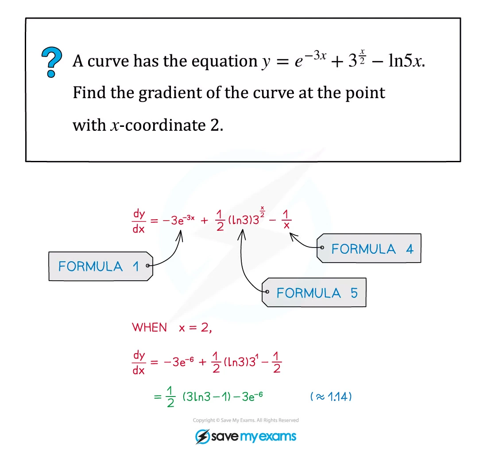{.note-figure fig-alt="Worked example differentiating an exponential trigonometric logarithmic curve"}
:::

## 2. Product rule and quotient rule

::: {.formula-panel}
### Product rule

若 $y=uv$，则

$$
\frac{dy}{dx}=u\frac{dv}{dx}+v\frac{du}{dx}.
$$

记忆顺序：first function × derivative of second + second function × derivative of first。

### Quotient rule

若 $y=u/v$，则

$$
\frac{dy}{dx}=\frac{v\,du/dx-u\,dv/dx}{v^2}.
$$

除非先明显简化，否则不要把 quotient 当成两个函数分别求导再相除。
:::

::: {.worked-example}
Worked example · 笔记第 8 页

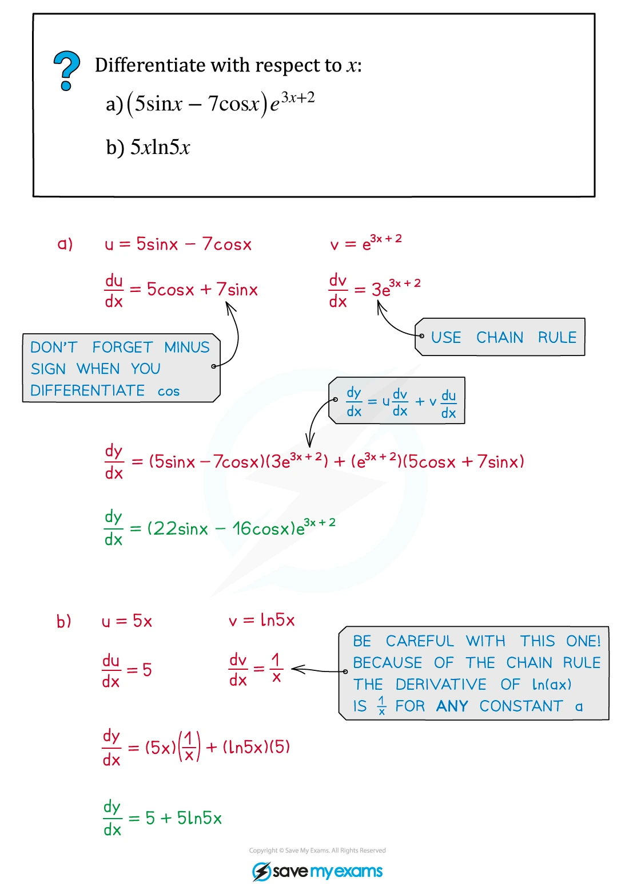{.note-figure fig-alt="Worked example applying the product rule to trigonometric and exponential functions"}
:::

::: {.worked-example}
Worked example · 笔记第 12 页

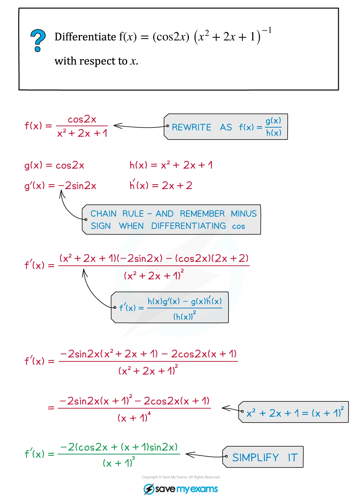{.note-figure fig-alt="Worked example applying quotient and chain rules"}
:::

## 3. Tangents, normals and rates of change

::: {.study-card}
### Gradient and line equations

在点 $(x_1,y_1)$ 处，曲线的 tangent gradient 是

$$
m_{\mathrm{tan}}=\left.\frac{dy}{dx}\right|_{(x_1,y_1)}.
$$

所以 tangent equation 为

$$
y-y_1=m_{\mathrm{tan}}(x-x_1).
$$

若 tangent gradient 非零，normal gradient 为

$$
m_{\mathrm{normal}}=-\frac1{m_{\mathrm{tan}}}.
$$

若 tangent 平行于 $x$-axis，则 $dy/dx=0$；若 tangent 平行于 $y$-axis，则 $dx/dy=0$，也就是 $dy/dx$ 的 denominator 为零而 numerator 不为零。
:::

::: {.worked-example}
Worked example · 笔记第 17 页

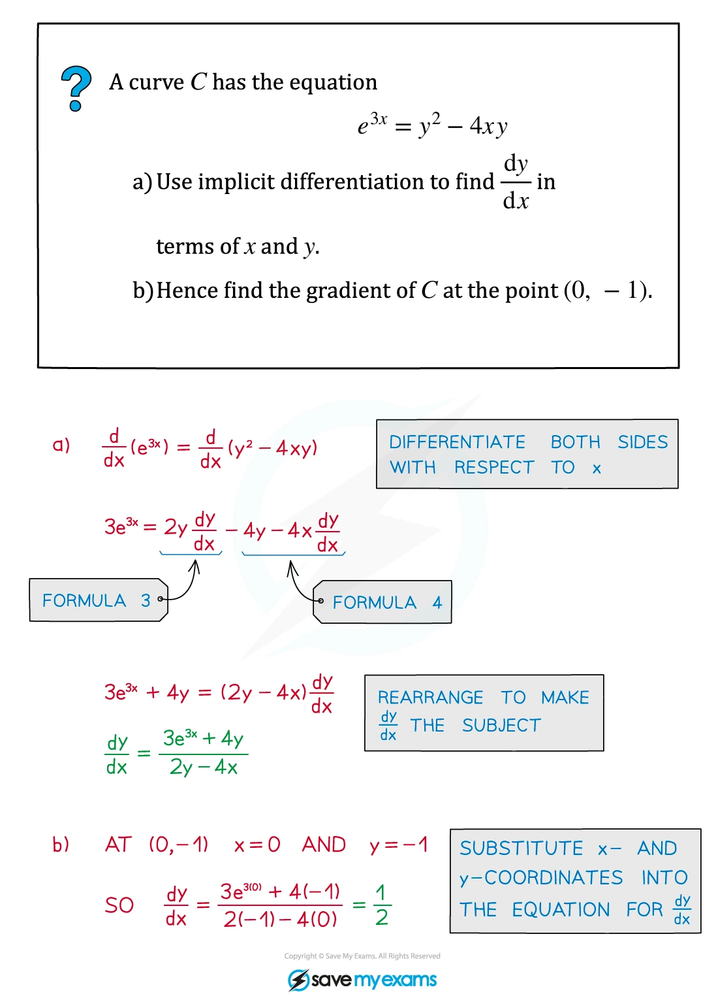{.note-figure fig-alt="Worked example using implicit differentiation to find a gradient"}
:::

::: {.worked-example}
Worked example · 笔记第 36 页

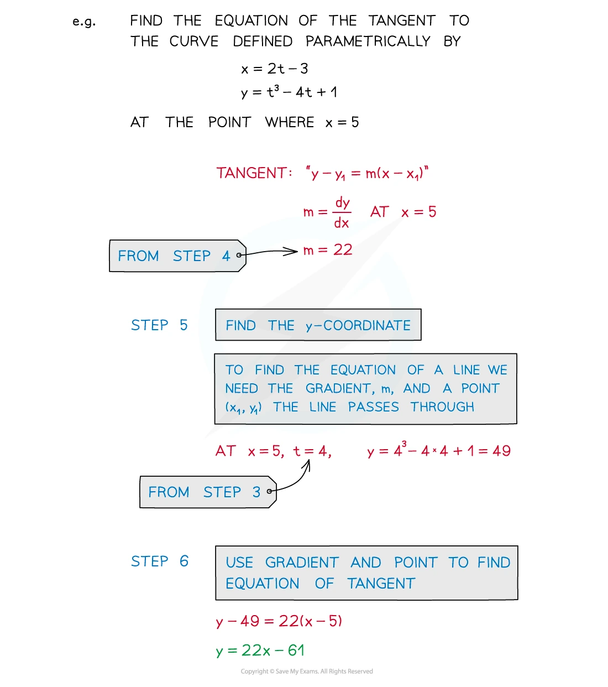{.note-figure fig-alt="Worked example finding tangent and normal equations from parametric equations"}
:::

## 4. Stationary points and connected rates

::: {.study-card}
### Stationary points

stationary point 满足

$$
\frac{dy}{dx}=0.
$$

找到候选点后，可用 second derivative：

$$
\frac{d^2y}{dx^2}<0\Rightarrow\text{local maximum},
\qquad
\frac{d^2y}{dx^2}>0\Rightarrow\text{local minimum}.
$$

也可以检查 $dy/dx$ 在该点两侧的 sign change。不要把 curve 的 domain 中不存在的点当作 stationary point，例如 denominator 为零的点。
:::

::: {.worked-example}
Worked example · 笔记第 31 页

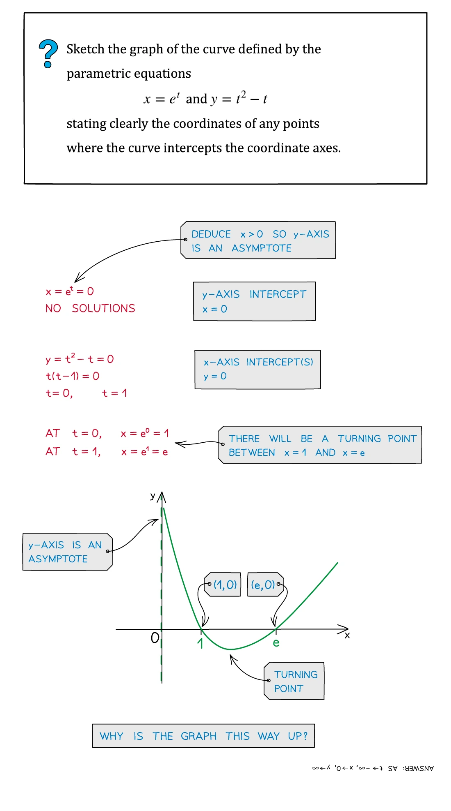{.note-figure fig-alt="Worked example sketching a curve defined parametrically and locating a turning point"}
:::

::: {.worked-example}
Worked example · 笔记第 37 页

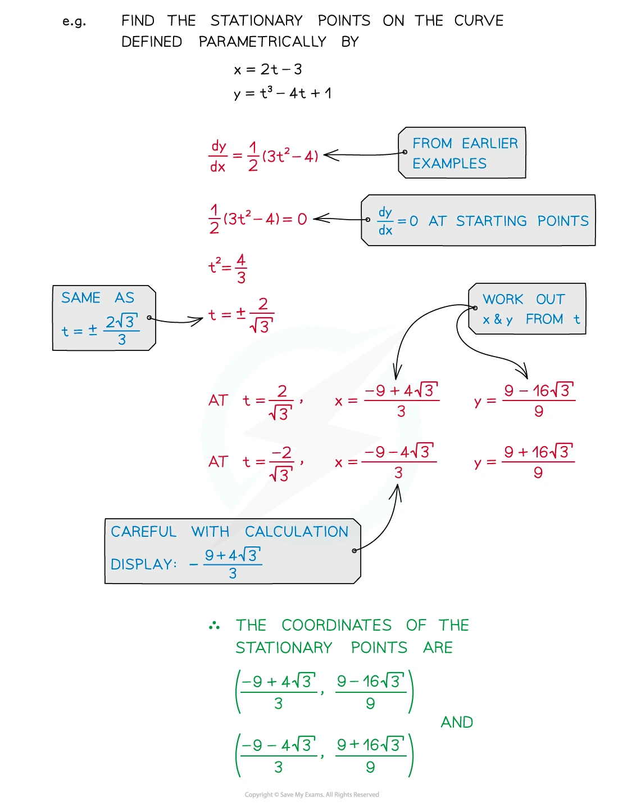{.note-figure fig-alt="Worked example finding stationary points from parametric equations"}
:::

::: {.study-card}
### Connected rates of change

如果变量由另一个变量 $t$ 连接，例如圆的 radius 随时间变化，则对关系式关于 $t$ 求导：

$$
\frac{dA}{dt}=\frac{dA}{dr}\frac{dr}{dt}.
$$

关键是保留每个变量对同一个 independent variable 的 derivative，并在最后一步才代入指定数值。
:::

::: {.worked-example}
Worked application · 笔记第 41–42 页

{.note-figure fig-alt="Worked application finding a parametric normal and an area"}

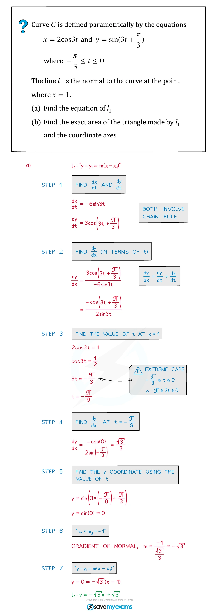{.note-figure fig-alt="Continuation of a parametric normal and area worked application"}
:::

## 5. Implicit differentiation

::: {.study-card}
### Treat $y$ as a function of $x$

implicit equation 中，$y$ 不是 constant：

$$
\frac{d}{dx}(y^n)=ny^{n-1}\frac{dy}{dx},
\qquad
\frac{d}{dx}(\ln y)=\frac1y\frac{dy}{dx}.
$$

例如对 $xy$ 求导要使用 product rule：

$$
\frac{d}{dx}(xy)=y+x\frac{dy}{dx}.
$$

最后把所有含 $dy/dx$ 的项移到一边，再 factorise 出 $dy/dx$。
:::

::: {.worked-example}
Worked example · 笔记第 17 页

{.note-figure fig-alt="Worked example rearranging an implicit derivative"}
:::

## 6. Parametric differentiation

::: {.formula-panel}
### The parametric derivative

若

$$
x=f(t),\qquad y=g(t),
$$

且 $dx/dt\ne0$，则

$$
\frac{dy}{dx}=\frac{dy/dt}{dx/dt}.
$$

stationary point 要求 $dy/dt=0$ 且 $dx/dt\ne0$；vertical tangent 通常对应 $dx/dt=0$ 且 $dy/dt\ne0$。
:::

::: {.worked-example}
Worked example · 笔记第 21 页

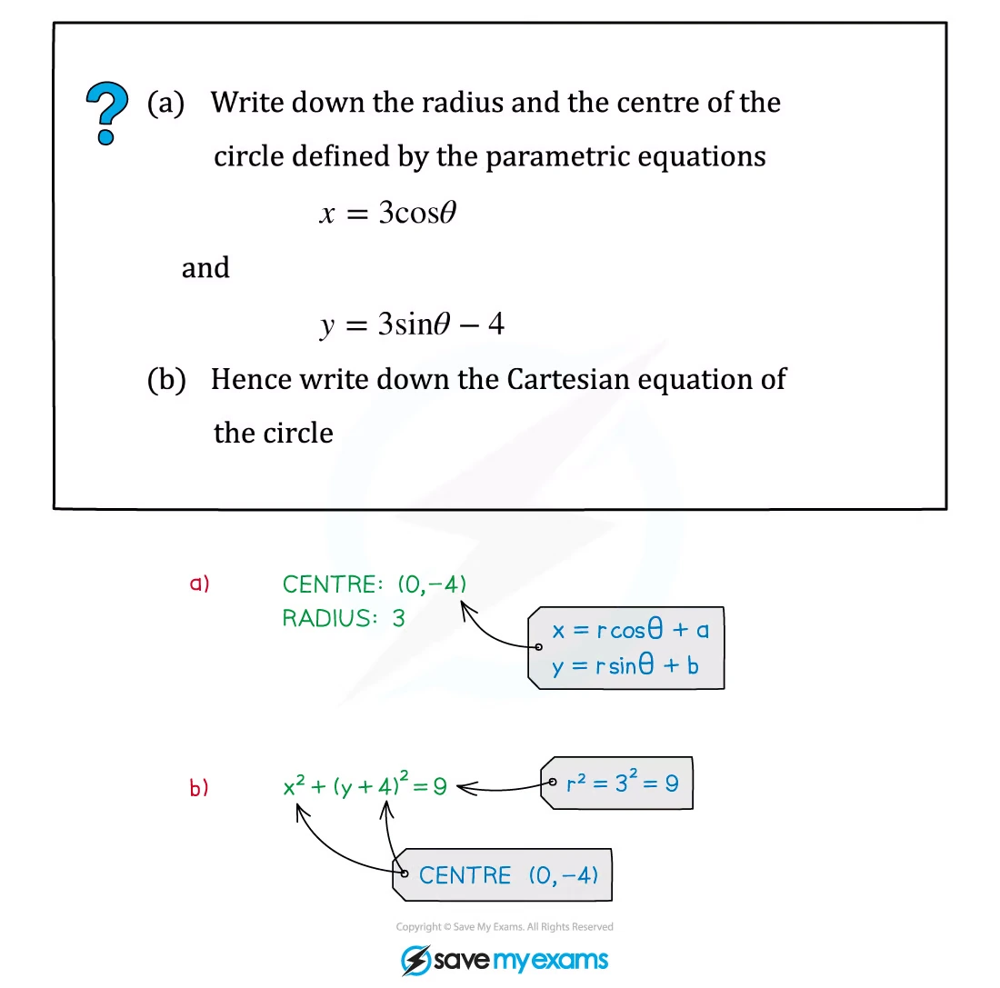{.note-figure fig-alt="Worked example converting a parametric circle into Cartesian form"}
:::

::: {.worked-example}
Worked example · 笔记第 26 页

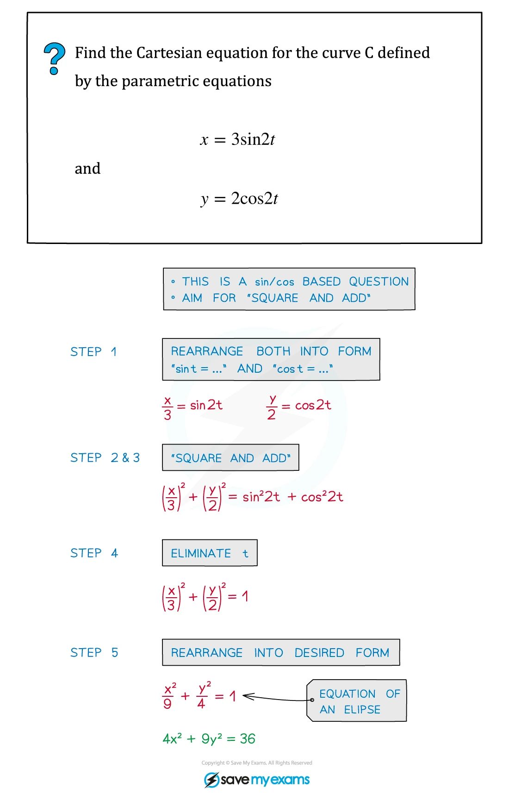{.note-figure fig-alt="Worked example eliminating a parameter from parametric equations"}
:::

::: {.worked-example}
Worked example · 笔记第 35 页

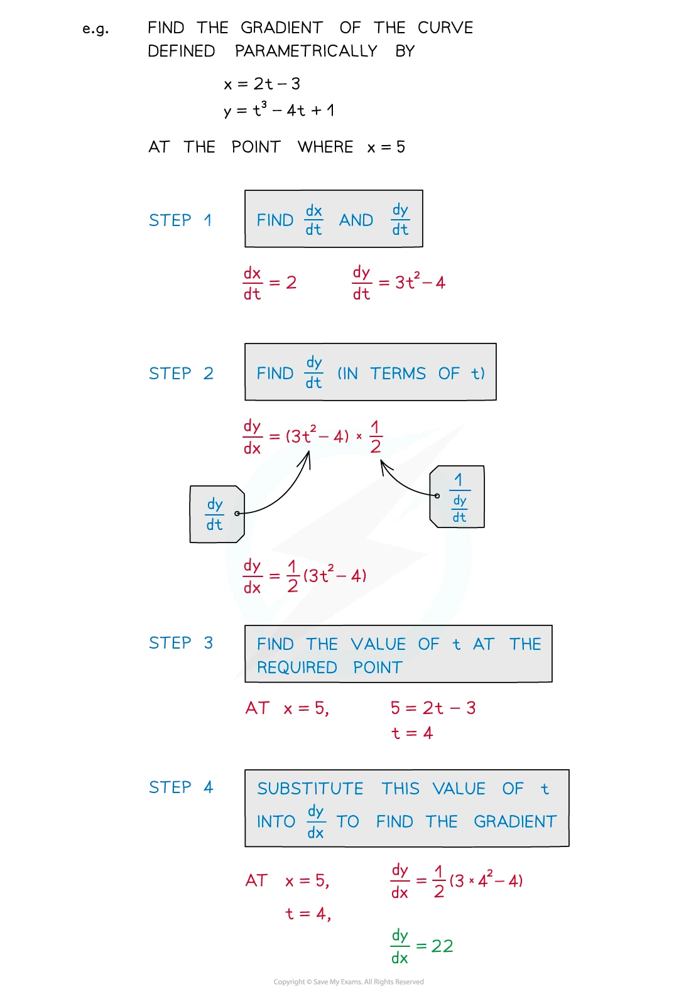{.note-figure fig-alt="Worked example finding the gradient of a parametric curve"}
:::

## 7. Paper 3 past-paper questions

本节精选 **20 道** 2020–2024 Paper 3 Differentiation 题目。题目保留原题的函数、区间和精度要求；答案按 matching mark scheme 展开，并补充 domain、stationary-point 条件和 tangent / normal 的检查。

### Derivative rules and stationary points

::: {.question-card #diff-2020-mj31-q4}
### Example 1 · Exponential-trigonometric stationary point · 9709/31/M/J/20 Q4
product rulestationary point

The curve with equation $y=e^{2x}(\sin x+3\cos x)$ has a stationary point in the interval $0\le x\le\pi$.

(a) Find the $x$-coordinate of this point, giving your answer correct to 2 decimal places.

(b) Determine whether the stationary point is a maximum or a minimum. **[6]**

Show detailed mark scheme answer

用 product rule：

$$
\frac{dy}{dx}=e^{2x}\left[2(\sin x+3\cos x)+(\cos x-3\sin x)\right]
=e^{2x}(7\cos x-\sin x).
$$

因为 $e^{2x}>0$，stationary condition 为

$$
7\cos x-\sin x=0
\Longrightarrow
\tan x=7.
$$

在 $0\le x\le\pi$ 内只有

$$
x=\tan^{-1}7=1.4289...,
$$

所以 $\boxed{x=1.43}$。

再求 second derivative：

$$
\frac{d^2y}{dx^2}=e^{2x}(50\cos x-16\sin x).
$$

在 $\tan x=7$ 处，$\cos x>0$ 且 $\sin x=7\cos x$，所以

$$
\frac{d^2y}{dx^2}=e^{2x}(50-112)\cos x<0.
$$

因此该 stationary point 是 $\boxed{\text{a maximum}}$。

<label class="done-toggle"><input type="checkbox" data-progress="diff-2020-mj31-q4"> Completed</label>

<strong>Source:</strong> `PastPaper/2020/2020/9709-s20-qp-31.pdf` and matching mark scheme.

:::

::: {.question-card #diff-2020-mj32-q4}
### Example 2 · Trigonometric stationary point · 9709/32/M/J/20 Q4
product ruletrigonometry

A curve has equation $y=\cos x\sin2x$.

Find the $x$-coordinate of the stationary point in the interval $0<x<\frac12\pi$, giving your answer correct to 3 significant figures. **[6]**

Show detailed mark scheme answer

先用 product rule：

$$
\frac{dy}{dx}=-\sin x\sin2x+2\cos x\cos2x.
$$

也可以先写成

$$
y=\frac12(\sin3x+\sin x),
$$

所以

$$
\frac{dy}{dx}=\frac12(3\cos3x+\cos x).
$$

令 $c=\cos x$，并使用 $\cos3x=4c^3-3c$：

$$
3(4c^3-3c)+c=0
\Longrightarrow
4c(3c^2-2)=0.
$$

在 $0<x<\pi/2$ 内 $c\ne0$，故

$$
\cos^2x=\frac23
\Longrightarrow
x=\cos^{-1}\sqrt{\frac23}=0.61548... .
$$

答案为 $\boxed{x=0.615}$ radians。

<label class="done-toggle"><input type="checkbox" data-progress="diff-2020-mj32-q4"> Completed</label>

<strong>Source:</strong> `PastPaper/2020/2020/9709-s20-qp-32.pdf` and matching mark scheme.

:::

::: {.question-card #diff-2020-mj33-q4}
### Example 3 · Product rule with inverse tangent · 9709/33/M/J/20 Q4
product ruletangent

The equation of a curve is $y=x\tan^{-1}\left(\frac12x\right)$.

(a) Find $dy/dx$.

(b) The tangent to the curve at the point where $x=2$ meets the $y$-axis at the point with coordinates $(0,p)$. Find $p$. **[6]**

Show detailed mark scheme answer

(a) 使用 product rule 和 chain rule：

$$
\frac{dy}{dx}=\tan^{-1}\left(\frac x2\right)+x\left(\frac{1}{1+(x/2)^2}\right)\frac12
=\tan^{-1}\left(\frac x2\right)+\frac{2x}{x^2+4}.
$$

(b) 当 $x=2$ 时，

$$
y=2\tan^{-1}(1)=\frac\pi2,
\qquad
m=\frac\pi4+\frac12.
$$

tangent equation：

$$
y-\frac\pi2=\left(\frac\pi4+\frac12\right)(x-2).
$$

令 $x=0$，

$$
p=\frac\pi2-2\left(\frac\pi4+\frac12\right)=-1.
$$

所以 $\boxed{p=-1}$。

<label class="done-toggle"><input type="checkbox" data-progress="diff-2020-mj33-q4"> Completed</label>

<strong>Source:</strong> `PastPaper/2020/2020/9709-s20-qp-33.pdf` and matching mark scheme.

:::

::: {.question-card #diff-2020-on31-q3}
### Example 4 · Parametric derivative identity · 9709/31/O/N/20 Q3
parametricchain rule

The parametric equations of a curve are

$$
x=3-\cos2\theta,\qquad y=2\theta+\sin2\theta,
$$

for $0<\theta<\frac12\pi$.

Show that $dy/dx=\cot\theta$. **[5]**

Show detailed mark scheme answer

分别关于 $\theta$ 求导：

$$
\frac{dx}{d\theta}=2\sin2\theta,
\qquad
\frac{dy}{d\theta}=2+2\cos2\theta.
$$

所以

$$
\frac{dy}{dx}=\frac{2+2\cos2\theta}{2\sin2\theta}
=\frac{1+\cos2\theta}{\sin2\theta}.
$$

使用 $1+\cos2\theta=2\cos^2\theta$、$\sin2\theta=2\sin\theta\cos\theta$：

$$
\frac{dy}{dx}=\frac{2\cos^2\theta}{2\sin\theta\cos\theta}=\boxed{\cot\theta}.
$$

<label class="done-toggle"><input type="checkbox" data-progress="diff-2020-on31-q3"> Completed</label>

<strong>Source:</strong> `PastPaper/2020/2020/9709_w20_qp_31.pdf` and matching mark scheme.

:::

::: {.question-card #diff-2020-on32-q5}
### Example 5 · Maximum parametric gradient · 9709/32/O/N/20 Q5
parametricmaximum gradient

The diagram shows the curve with parametric equations $x=\tan\theta$, $y=\cos^2\theta$, for $-\frac12\pi<\theta<\frac12\pi$.

(a) Show that the gradient of the curve at the point with parameter $\theta$ is $-2\sin\theta\cos^3\theta$.

(b) The gradient of the curve has its maximum value at the point $P$. Find the exact value of the $x$-coordinate of $P$. **[7]**

Show detailed mark scheme answer

(a)

$$
\frac{dx}{d\theta}=\sec^2\theta,
\qquad
\frac{dy}{d\theta}=-2\sin\theta\cos\theta.
$$

因此

$$
\frac{dy}{dx}=\frac{-2\sin\theta\cos\theta}{\sec^2\theta}
=\boxed{-2\sin\theta\cos^3\theta}.
$$

(b) 令 $m=-2\sin\theta\cos^3\theta$，则

$$
\frac{dm}{d\theta}=-2\cos^2\theta(\cos^2\theta-3\sin^2\theta).
$$

临界值满足 $\tan^2\theta=1/3$。要使 $m$ 为正，$\theta$ 必须为负，因此 $\theta=-\pi/6$。端点附近 $m\to0$，而

$$
m\left(-\frac\pi6\right)=\frac{3\sqrt3}{8}>0
$$

确实是 maximum。因为 $x=\tan\theta$，

$$
\boxed{x=-\frac1{\sqrt3}}.
$$

<label class="done-toggle"><input type="checkbox" data-progress="diff-2020-on32-q5"> Completed</label>

<strong>Source:</strong> `PastPaper/2020/2020/9709_w20_qp_32.pdf` and matching mark scheme.

:::

### Parametric differentiation and stationary points

::: {.question-card #diff-2021-mj31-q6}
### Example 6 · Always-positive parametric gradient · 9709/31/M/J/21 Q6
parametrictangent

The parametric equations of a curve are

$$
x=\ln(2+3t),\qquad y=\frac{t}{2+3t}.
$$

(a) Show that the gradient of the curve is always positive.

(b) Find the equation of the tangent to the curve at the point where it intersects the $y$-axis. **[8]**

Show detailed mark scheme answer

由于 $x$ 有定义，$2+3t>0$，即 $t>-2/3$。求导：

$$
\frac{dx}{dt}=\frac3{2+3t},
\qquad
\frac{dy}{dt}=\frac2{(2+3t)^2}.
$$

因此

$$
\frac{dy}{dx}=\frac{dy/dt}{dx/dt}=\frac2{3(2+3t)}.
$$

因为 $2+3t>0$，所以 $\boxed{dy/dx>0}$。

在 $y$-axis 上 $x=0$，故 $\ln(2+3t)=0$，从而 $t=-1/3$。此时

$$
(x,y)=\left(0,-\frac13\right),
\qquad
m=\frac23.
$$

tangent equation：

$$
y+\frac13=\frac23x
\Longrightarrow
\boxed{y=\frac23x-\frac13}.
$$

<label class="done-toggle"><input type="checkbox" data-progress="diff-2021-mj31-q6"> Completed</label>

<strong>Source:</strong> `PastPaper/2021/2021/9709_s21_qp_31.pdf` and matching mark scheme.

:::

::: {.question-card #diff-2021-mj31-q9}
### Example 7 · Logarithmic stationary point · 9709/31/M/J/21 Q9
product rulestationary point

The equation of a curve is $y=x^{-2/3}\ln x$ for $x>0$. The curve has one stationary point.

Find the exact coordinates of the stationary point. **[5]**

Show detailed mark scheme answer

用 product rule：

$$
\frac{dy}{dx}=x^{-2/3}\frac1x+\ln x\left(-\frac23x^{-5/3}\right)
=x^{-5/3}\left(1-\frac23\ln x\right).
$$

因为 $x>0$，$x^{-5/3}\ne0$。stationary condition 为

$$
1-\frac23\ln x=0
\Longrightarrow
\ln x=\frac32
\Longrightarrow
x=e^{3/2}.
$$

对应的 $y$ 为

$$
y=(e^{3/2})^{-2/3}\ln(e^{3/2})
=e^{-1}\cdot\frac32=\frac3{2e}.
$$

所以答案为 $\boxed{\left(e^{3/2},\frac3{2e}\right)}$。

<label class="done-toggle"><input type="checkbox" data-progress="diff-2021-mj31-q9"> Completed</label>

<strong>Source:</strong> `PastPaper/2021/2021/9709_s21_qp_31.pdf` and matching mark scheme.

:::

::: {.question-card #diff-2021-mj33-q3}
### Example 8 · Parametric stationary point · 9709/33/M/J/21 Q3
parametricchain rule

The parametric equations of a curve are

$$
x=t+\ln(t+2),\qquad y=(t-1)e^{-2t},
$$

where $t>-2$.

(a) Express $dy/dx$ in terms of $t$, simplifying your answer.

(b) Find the exact $y$-coordinate of the stationary point of the curve. **[7]**

Show detailed mark scheme answer

$$
\frac{dx}{dt}=1+\frac1{t+2}=\frac{t+3}{t+2}.
$$

用 product rule 求 $dy/dt$：

$$
\frac{dy}{dt}=e^{-2t}-2(t-1)e^{-2t}=(3-2t)e^{-2t}.
$$

因此

$$
\frac{dy}{dx}=\frac{(3-2t)e^{-2t}}{(t+3)/(t+2)}
=\frac{(3-2t)(t+2)e^{-2t}}{t+3}.
$$

由于 $t>-2$，且 $dx/dt\ne0$，stationary point 要求 $3-2t=0$，所以 $t=3/2$。代入 $y$：

$$
y=\left(\frac32-1\right)e^{-3}=\frac1{2e^3}.
$$

答案为 $\boxed{y=1/(2e^3)}$。

<label class="done-toggle"><input type="checkbox" data-progress="diff-2021-mj33-q3"> Completed</label>

<strong>Source:</strong> `PastPaper/2021/2021/9709_s21_qp_33.pdf` and matching mark scheme.

:::

::: {.question-card #diff-2021-on31-q3}
### Example 9 · Exponential stationary point · 9709/31/O/N/21 Q3
product rulesecond derivative

The curve with equation $y=xe^{1-2x}$ has one stationary point.

(a) Find the coordinates of this point.

(b) Determine whether the stationary point is a maximum or a minimum. **[6]**

Show detailed mark scheme answer

$$
\frac{dy}{dx}=e^{1-2x}+x(-2)e^{1-2x}=e^{1-2x}(1-2x).
$$

因为 exponential factor 不为零，stationary condition 给出 $1-2x=0$，即 $x=1/2$。于是

$$
y=\frac12e^{1-1}=\frac12.
$$

所以 stationary point 是 $\left(\frac12,\frac12\right)$。

再求

$$
\frac{d^2y}{dx^2}=e^{1-2x}(4x-4).
$$

在 $x=1/2$ 处，$d^2y/dx^2=-2<0$，所以是 $\boxed{\text{a maximum}}$。

<label class="done-toggle"><input type="checkbox" data-progress="diff-2021-on31-q3"> Completed</label>

<strong>Source:</strong> `PastPaper/2021/2021/9709_w21_qp_31.pdf` and matching mark scheme.

:::

### Trigonometric stationary points

::: {.question-card #diff-2022-mj31-q10}
### Example 10 · Square-root trigonometric derivative · 9709/31/M/J/22 Q10
chain rulestationary point

The curve $y=x\sqrt{\sin x}$ has one stationary point in the interval $0<x<\pi$, where $x=a$.

(a) Show that $\tan a=-\frac12a$. **[4]**

Show detailed mark scheme answer

在 $0<x<\pi$ 的题目区间内，先写成 $y=x(\sin x)^{1/2}$。用 product rule 和 chain rule：

$$
\frac{dy}{dx}=\sqrt{\sin x}+x\cdot\frac12(\sin x)^{-1/2}\cos x
=\sqrt{\sin x}+\frac{x\cos x}{2\sqrt{\sin x}}.
$$

在 stationary point，$dy/dx=0$。乘以 $2\sqrt{\sin a}$：

$$
2\sin a+a\cos a=0.
$$

此时 $\cos a\ne0$，因此除以 $2\cos a$ 得

$$
\boxed{\tan a=-\frac12a}.
$$

<label class="done-toggle"><input type="checkbox" data-progress="diff-2022-mj31-q10"> Completed</label>

<strong>Source:</strong> `PastPaper/2022/2022/9709_s22_qp_31.pdf` and matching mark scheme.

:::

::: {.question-card #diff-2022-mj32-q4}
### Example 11 · Trigonometric stationary point · 9709/32/M/J/22 Q4
product ruletrigonometry

The equation of a curve is $y=\cos^3x\sin x$. It is given that the curve has one stationary point in the interval $0<x<\frac12\pi$.

Find the $x$-coordinate of this stationary point, giving your answer correct to 3 significant figures. **[6]**

Show detailed mark scheme answer

$$
\frac{dy}{dx}=(-3\cos^2x\sin x)\sin x+\cos^3x\cos x
=\cos^2x(\cos^2x-3\sin^2x).
$$

在 $0<x<\pi/2$ 内 $\cos x\ne0$，所以

$$
\cos^2x=3\sin^2x
\Longrightarrow
\tan^2x=\frac13.
$$

因为 $x$ 在第一象限，$\tan x=1/\sqrt3$，故

$$
x=\frac\pi6=0.523599... .
$$

答案为 $\boxed{x=0.524}$ radians。

<label class="done-toggle"><input type="checkbox" data-progress="diff-2022-mj32-q4"> Completed</label>

<strong>Source:</strong> `PastPaper/2022/2022/9709_s22_qp_32.pdf` and matching mark scheme.

:::

::: {.question-card #diff-2022-mj33-q4}
### Example 12 · Exponential-trigonometric stationary points · 9709/33/M/J/22 Q4
product ruleexact roots

The curve $y=e^{-4x}\tan x$ has two stationary points in the interval $0\le x<\frac12\pi$.

(a) Obtain an expression for $dy/dx$ and show it can be written in the form $\sec^2x(a+b\sin2x)e^{-4x}$, where $a$ and $b$ are constants.

(b) Hence find the exact $x$-coordinates of the two stationary points. **[7]**

Show detailed mark scheme answer

用 product rule：

$$
\frac{dy}{dx}=e^{-4x}\sec^2x-4e^{-4x}\tan x
=e^{-4x}(\sec^2x-4\tan x).
$$

因为 $\tan x=\frac12\sin2x\sec^2x$，

$$
\frac{dy}{dx}=\sec^2x(1-2\sin2x)e^{-4x}.
$$

所以 $a=1$、$b=-2$。在曲线 domain 内 $\sec^2x$ 和 $e^{-4x}$ 均不为零，stationary condition 为

$$
1-2\sin2x=0
\Longrightarrow
\sin2x=\frac12.
$$

由于 $0\le2x<\pi$，

$$
2x=\frac\pi6\quad\text{or}\quad\frac{5\pi}6.
$$

因此 $\boxed{x=\frac\pi{12},\ \frac{5\pi}{12}}$。

<label class="done-toggle"><input type="checkbox" data-progress="diff-2022-mj33-q4"> Completed</label>

<strong>Source:</strong> `PastPaper/2022/2022/9709_s22_qp_33.pdf` and matching mark scheme.

:::

::: {.question-card #diff-2022-on32-q3}
### Example 13 · Product rule with double angle · 9709/32/O/N/22 Q3
product rulestationary point

The equation of a curve is $y=\sin x\sin2x$. The curve has a stationary point in the interval $0<x<\frac12\pi$.

Find the $x$-coordinate of this point, giving your answer correct to 3 significant figures. **[6]**

Show detailed mark scheme answer

$$
\frac{dy}{dx}=\cos x\sin2x+2\sin x\cos2x.
$$

使用 $\sin2x=2\sin x\cos x$ 和 $\cos2x=\cos^2x-\sin^2x$：

$$
\frac{dy}{dx}=2\sin x\cos^2x+2\sin x(\cos^2x-\sin^2x)
=2\sin x(2\cos^2x-\sin^2x).
$$

在区间内 $\sin x\ne0$，所以

$$
2\cos^2x=\sin^2x
\Longrightarrow
\tan^2x=2.
$$

取第一象限 root：

$$
x=\tan^{-1}\sqrt2=0.955317... .
$$

答案为 $\boxed{x=0.955}$ radians。

<label class="done-toggle"><input type="checkbox" data-progress="diff-2022-on32-q3"> Completed</label>

<strong>Source:</strong> `PastPaper/2022/2022/9709_w22_qp_32.pdf` and matching mark scheme.

:::

### Implicit differentiation

::: {.question-card #diff-2023-mj31-q5}
### Example 14 · Vertical tangent from an implicit curve · 9709/31/M/J/23 Q5
implicitvertical tangent

The equation of a curve is $x^2y-ay^2=4a^3$, where $a$ is a non-zero constant.

(a) Show that

$$
\frac{dy}{dx}=\frac{2xy}{2ay-x^2}.
$$

(b) Hence find the coordinates of the points where the tangent to the curve is parallel to the $y$-axis. **[8]**

Show detailed mark scheme answer

(a) 对两边关于 $x$ 求导：

$$
2xy+x^2\frac{dy}{dx}-2ay\frac{dy}{dx}=0.
$$

整理含 $dy/dx$ 的项：

$$
(x^2-2ay)\frac{dy}{dx}=-2xy
\Longrightarrow
\boxed{\frac{dy}{dx}=\frac{2xy}{2ay-x^2}}.
$$

(b) vertical tangent 对应 denominator 为零：

$$
2ay-x^2=0\Longrightarrow x^2=2ay.
$$

代回原曲线：

$$
x^2y-ay^2=2ay^2-ay^2=ay^2=4a^3,
$$

所以 $y^2=4a^2$，即 $y=\pm2a$。结合 $x^2=2ay$，只有 $y=2a$ 产生 real $x$，并且 $x=\pm2a$。

因此答案为 $\boxed{(2a,2a)\text{ and }(-2a,2a)}$。

<label class="done-toggle"><input type="checkbox" data-progress="diff-2023-mj31-q5"> Completed</label>

<strong>Source:</strong> `PastPaper/2023/2023/9709_s23_qp_31.pdf` and matching mark scheme.

:::

::: {.question-card #diff-2023-mj32-q7}
### Example 15 · Implicit tangent gradient · 9709/32/M/J/23 Q7
implicittangent

The equation of a curve is $3x^2+4xy+3y^2=5$.

(a) Show that

$$
\frac{dy}{dx}=-\frac{3x+2y}{2x+3y}.
$$

(b) Hence find the exact coordinates of the two points on the curve at which the tangent is parallel to $y+2x=0$. **[9]**

Show detailed mark scheme answer

(a)

$$
6x+4\left(x\frac{dy}{dx}+y\right)+6y\frac{dy}{dx}=0.
$$

所以

$$
(4x+6y)\frac{dy}{dx}=-(6x+4y)
\Longrightarrow
\boxed{\frac{dy}{dx}=-\frac{3x+2y}{2x+3y}}.
$$

(b) 直线 $y+2x=0$ 的 gradient 是 $-2$，故

$$
-\frac{3x+2y}{2x+3y}=-2
\Longrightarrow
3x+2y=4x+6y
\Longrightarrow
x+4y=0.
$$

令 $x=-4y$ 代入曲线：

$$
3(16y^2)+4(-4y)y+3y^2=5
\Longrightarrow
35y^2=5
\Longrightarrow
y=\pm\frac1{\sqrt7}.
$$

对应 $x=-4y$，所以两点为

$$
\boxed{\left(\frac4{\sqrt7},-\frac1{\sqrt7}\right),
\left(-\frac4{\sqrt7},\frac1{\sqrt7}\right)}.
$$

<label class="done-toggle"><input type="checkbox" data-progress="diff-2023-mj32-q7"> Completed</label>

<strong>Source:</strong> `PastPaper/2023/2023/9709_s23_qp_32.pdf` and matching mark scheme.

:::

::: {.question-card #diff-2023-on31-q1}
### Example 16 · Quotient derivative and prescribed gradient · 9709/31/O/N/23 Q1
quotient rulegradient

Find the exact coordinates of the points on the curve $y=\dfrac{x^2}{1-3x}$ at which the gradient of the tangent is equal to 8. **[5]**

Show detailed mark scheme answer

用 quotient rule：

$$
\frac{dy}{dx}=\frac{2x(1-3x)-x^2(-3)}{(1-3x)^2}
=\frac{x(2-3x)}{(1-3x)^2}.
$$

令 gradient 等于 8：

$$
\frac{x(2-3x)}{(1-3x)^2}=8
\Longrightarrow
2x-3x^2=8(1-6x+9x^2).
$$

整理为

$$
75x^2-50x+8=0
\Longrightarrow
x=\frac25\quad\text{or}\quad x=\frac4{15}.
$$

分别代回原曲线：

$$
x=\frac25\Rightarrow y=-\frac45,
\qquad
x=\frac4{15}\Rightarrow y=\frac{16}{45}.
$$

答案为 $\boxed{\left(\frac25,-\frac45\right),\ \left(\frac4{15},\frac{16}{45}\right)}$。

<label class="done-toggle"><input type="checkbox" data-progress="diff-2023-on31-q1"> Completed</label>

<strong>Source:</strong> `PastPaper/2023/2023/9709_w23_qp_31.pdf` and matching mark scheme.

:::

::: {.question-card #diff-2023-on32-q2}
### Example 17 · Parametric gradient at a special parameter · 9709/32/O/N/23 Q2
parametricexponential

The parametric equations of a curve are

$$
x=(\ln t)^2,\qquad y=e^{2-t^2},
$$

for $t>0$.

Find the gradient of the curve at the point where $t=e$, simplifying your answer. **[4]**

Show detailed mark scheme answer

$$
\frac{dx}{dt}=\frac{2\ln t}{t},
\qquad
\frac{dy}{dt}=-2t\,e^{2-t^2}.
$$

因此

$$
\frac{dy}{dx}=\frac{-2t e^{2-t^2}}{2\ln t/t}
=-\frac{t^2e^{2-t^2}}{\ln t}.
$$

在 $t=e$ 时，$\ln t=1$：

$$
\boxed{\frac{dy}{dx}=-e^{4-e^2}}.
$$

<label class="done-toggle"><input type="checkbox" data-progress="diff-2023-on32-q2"> Completed</label>

<strong>Source:</strong> `PastPaper/2023/2023/9709_w23_qp_32.pdf` and matching mark scheme.

:::

### 2024 mixed practice

::: {.question-card #diff-2024-mj32-q4}
### Example 18 · Implicit exponential differentiation · 9709/32/M/J/24 Q4
implicitexponential

The equation of a curve is $ye^{2x}+y^2e^x=6$.

Find the gradient of the curve at the point where $y=1$. **[6]**

Show detailed mark scheme answer

先找该点的 $x$。令 $y=1$，得到

$$
e^{2x}+e^x=6.
$$

令 $u=e^x>0$，则 $u^2+u-6=0$，即 $(u+3)(u-2)=0$。由于 $u>0$，$u=2$，所以 $x=\ln2$。

对原式隐式求导：

$$
e^{2x}(2y+y')+e^x(y^2+2yy')=0.
$$

整理：

$$
y'(e^{2x}+2ye^x)=-(2ye^{2x}+y^2e^x).
$$

在 $y=1$、$e^x=2$ 处：

$$
y'(4+4)=-(8+2)=-10
\Longrightarrow
\boxed{\frac{dy}{dx}=-\frac54}.
$$

<label class="done-toggle"><input type="checkbox" data-progress="diff-2024-mj32-q4"> Completed</label>

<strong>Source:</strong> `PastPaper/2024/2024/A-Level-CAIE数学QP-202406-Mathematics-P32-A-Level题库大全小程序.pdf` and matching mark scheme.

:::

::: {.question-card #diff-2024-on31-q3}
### Example 19 · Logarithmic implicit differentiation · 9709/31/O/N/24 Q3
implicitlogarithm

The equation of a curve is $\ln(x+y)=3x^2y$.

Find the gradient of the curve at the point $(1,0)$. **[4]**

Show detailed mark scheme answer

对两边关于 $x$ 求导：

$$
\frac{1+y'}{x+y}=6xy+3x^2y'.
$$

在 $(x,y)=(1,0)$ 处：

$$
1+y'=3y'.
$$

所以

$$
\boxed{y'=\frac12}.
$$

<label class="done-toggle"><input type="checkbox" data-progress="diff-2024-on31-q3"> Completed</label>

<strong>Source:</strong> `PastPaper/2024/2024/A-Level-CAIE数学QP-202410-Mathematics-P31-A-Level题库大全小程序.pdf` and matching mark scheme.

:::

::: {.question-card #diff-2024-on32-q8}
### Example 20 · Parametric tangent and normal · 9709/32/O/N/24 Q8
parametricnormal

The parametric equations of a curve are

$$
x=\tan^2(2t),\qquad y=\cos2t,
$$

for $0\le t\le\frac14\pi$.

(a) Show that

$$
\frac{dy}{dx}=-\frac12\cos^3(2t).
$$

(b) Hence find the equation of the normal to the curve at the point where $t=\frac18\pi$. Give your answer in the form $y=mx+c$. **[8]**

Show detailed mark scheme answer

(a)

$$
\frac{dx}{dt}=4\tan2t\sec^2(2t),
\qquad
\frac{dy}{dt}=-2\sin2t.
$$

所以

$$
\frac{dy}{dx}=\frac{-2\sin2t}{4\tan2t\sec^2(2t)}
=\boxed{-\frac12\cos^3(2t)}.
$$

(b) 当 $t=\pi/8$ 时，$2t=\pi/4$，因此

$$
(x,y)=\left(\tan^2\frac\pi4,\cos\frac\pi4\right)=\left(1,\frac{\sqrt2}{2}\right).
$$

tangent gradient：

$$
m_{\mathrm{tan}}=-\frac12\left(\frac{\sqrt2}{2}\right)^3=-\frac{\sqrt2}{8}.
$$

所以 normal gradient 是

$$
m_{\mathrm{normal}}=-\frac1{m_{\mathrm{tan}}}=4\sqrt2.
$$

normal equation：

$$
y-\frac{\sqrt2}{2}=4\sqrt2(x-1),
$$

即

$$
\boxed{y=4\sqrt2x-\frac{7\sqrt2}{2}}.
$$

<label class="done-toggle"><input type="checkbox" data-progress="diff-2024-on32-q8"> Completed</label>

<strong>Source:</strong> `PastPaper/2024/2024/A-Level-CAIE数学QP-202410-Mathematics-P32-A-Level题库大全小程序.pdf` and matching mark scheme.

:::

::: {.callout-note}
## Exam checklist

1. 先确定 derivative 的对象和 independent variable；parametric 题目不要直接把 $dy/dt$ 当作 $dy/dx$。
2. product / quotient / chain rule 要完整展开，尤其注意 $d(\cos u)/dx=-\sin u\,du/dx$。
3. 找 stationary point 时，先检查 denominator、domain 和被约去的因子，避免引入或漏掉 roots。
4. 求 normal 前先求 tangent gradient；若 tangent gradient 为 0，则 normal 是 vertical line，不能直接写 $-1/m$。
5. implicit differentiation 中每个 $y$ 都依赖 $x$；parametric differentiation 中先分别求 $dx/dt$、$dy/dt$，再取比值。
:::
