::: {.callout-important}
## 本节考纲要求

本页依据 9709 Mathematics 2026–2027 syllabus 3.5，覆盖：

- standard integrals，包括 $e^{ax+b}$、$1/(ax+b)$、$sin(ax+b)$、$cos(ax+b)$、$sec^2(ax+b)$ 和 $1/(x^2+a^2)$；
- 用 trigonometric identities 化简 integrand；
- substitution、definite integral 的换元上下限，以及识别 $f'(x)/f(x)$；
- integration by parts；
- partial fractions 后积分；
- 曲线与坐标轴围成的 area，以及在题目要求时把 area 分段。
:::

## Learning objectives

::: {.study-card}

- [ ] 能从 derivative 反向写出 standard indefinite integrals，并正确保留 $+C$
- [ ] 能识别 inner function，完成 substitution 并同步处理 $dx$ 或积分上下限
- [ ] 能用 trig identities 把 integrand 化成可直接积分的形式
- [ ] 能使用 integration by parts，尤其是 algebraic × exponential / trigonometric / logarithmic
- [ ] 能先做 partial fractions，再逐项积分并处理 repeated linear factors
- [ ] 能根据图形和 x-axis intersections 正确写 area 的积分范围与正负号
- [ ] 能用 mark-scheme 风格的中间步骤检查常数、上下限和 exact form

:::

## 1. Core integration rules

::: {.formula-panel}
### Standard results

$$
\int x^n\,dx=\frac{x^{n+1}}{n+1}+C\quad(n\ne-1),
\qquad \int\frac{1}{x}\,dx=\ln|x|+C.
$$

$$
\int e^{ax+b}\,dx=\frac1a e^{ax+b}+C,
\qquad \int\frac{dx}{ax+b}=\frac1a\ln|ax+b|+C.
$$

$$
\int\sin(ax+b)\,dx=-\frac1a\cos(ax+b)+C,
\qquad
\int\cos(ax+b)\,dx=\frac1a\sin(ax+b)+C.
$$

$$
\int\sec^2(ax+b)\,dx=\frac1a\tan(ax+b)+C,
\qquad
\int\frac{dx}{x^2+a^2}=\frac1a\tan^{-1}\frac{x}{a}+C.
$$

每次写出结果后，都可以对答案求 derivative 检查：系数 $1/a$ 是最容易漏掉的部分。
:::

::: {.study-card}
### Recognising $f'(x)/f(x)$

$$
\int\frac{f'(x)}{f(x)}\,dx=\ln|f(x)|+C.
$$

若分子只是常数倍，例如

$$
\int\frac{6x+4}{3x^2+4x-7}\,dx
=\ln|3x^2+4x-7|+C,
$$

因为 denominator 的 derivative 正好是 $6x+4$。
:::

::: {.worked-example}
Worked example · 笔记第 13 页

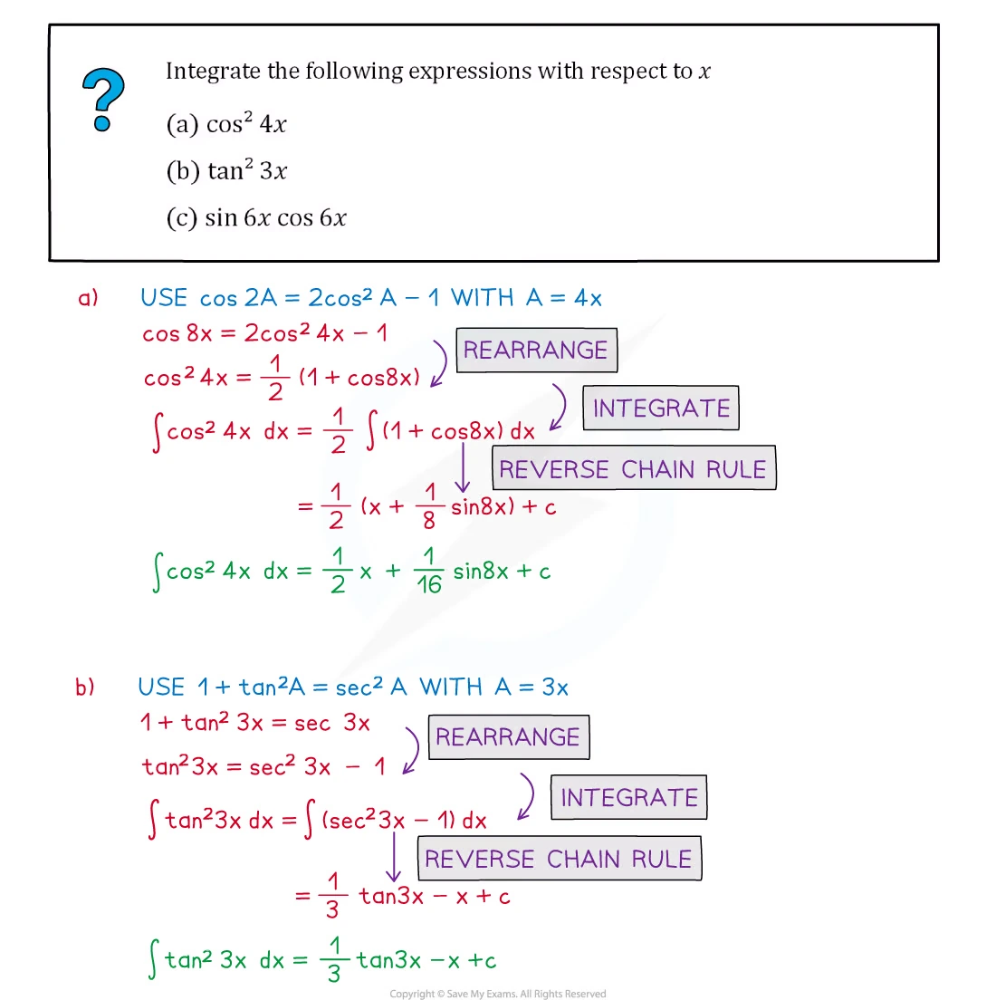{.note-figure fig-alt="Integration note showing trigonometric identities used before integration"}
:::

## 2. Trigonometric identities before integrating

::: {.formula-panel}
常用的转换是

$$
\sin^2x=\frac{1-\cos2x}{2},
\qquad
\cos^2x=\frac{1+\cos2x}{2},
\qquad
\tan^2x=\sec^2x-1,
$$

$$
\sin2x=2\sin x\cos x.
$$

目标不是“看到 trig 就换元”，而是先把 integrand 变为 standard integral 能处理的形式。
:::

::: {.worked-example}
Worked example · 笔记第 16 页

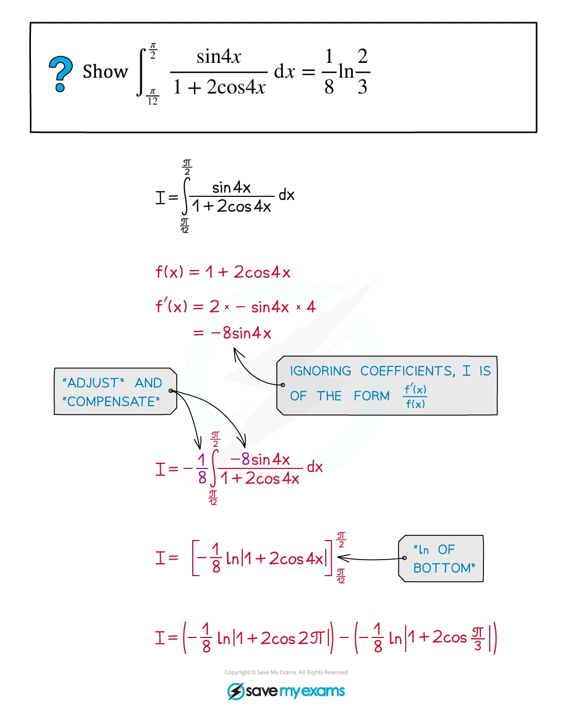{.note-figure fig-alt="Integration note showing substitution in a trigonometric integral"}
:::

## 3. Substitution and reverse chain rule

::: {.study-card}
### Indefinite integrals

令 $u=g(x)$，则 $du=g'(x)\,dx$。完整写法通常是

$$
\int f(g(x))g'(x)\,dx=\int f(u)\,du,
$$

最后把 $u$ 换回 $g(x)$，并写上 $+C$。如果题目已经给出 substitution，按题目指定的 $u$ 走，通常能直接获得 method marks。
:::

::: {.study-card}
### Definite integrals

换元时有两种等价写法：

1. 把 $dx$ 换成 $du$，并把上下限改成 $u$ 的上下限；或
2. 先求出 indefinite integral，最后把 $u$ 换回 $x$，再代原上下限。

第一种方法通常更短，也能减少忘记换上下限的风险。
:::

::: {.worked-example}
Worked example · 笔记第 19 页

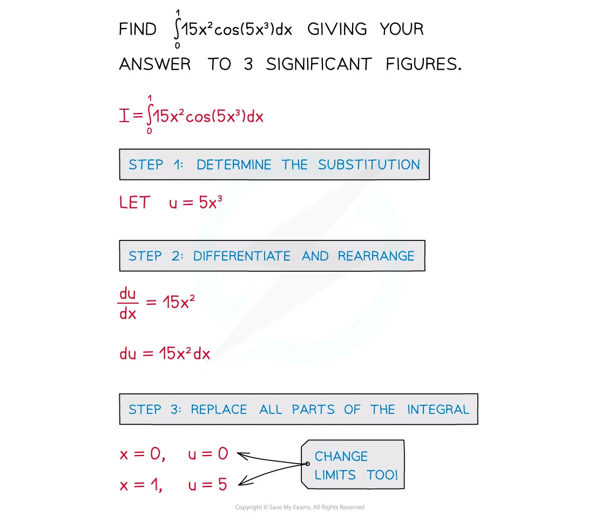{.note-figure fig-alt="Integration note showing a substitution example with a composite cosine"}
:::

::: {.worked-example}
Worked example · 笔记第 22 页

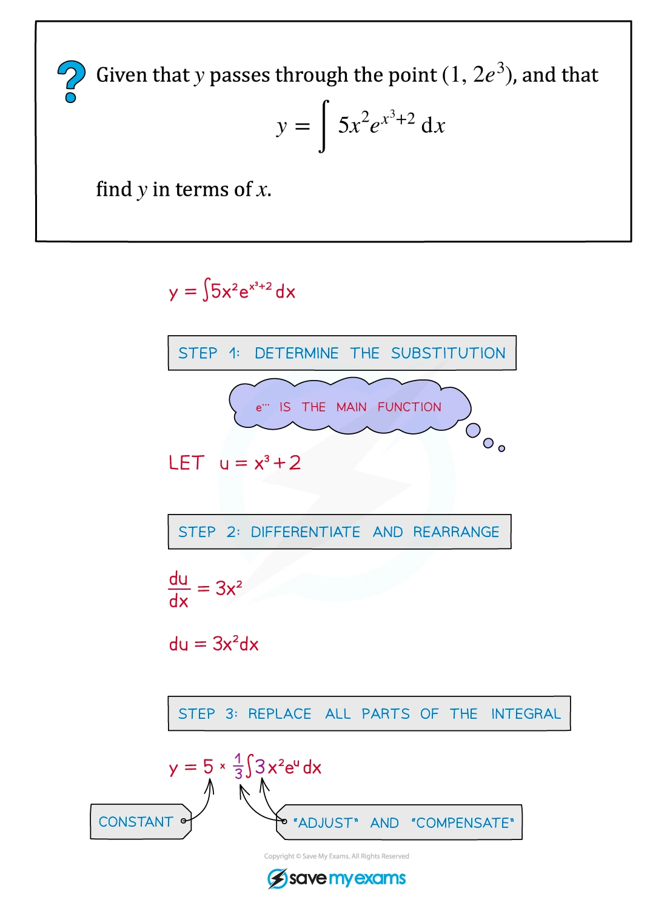{.note-figure fig-alt="Integration note showing substitution followed by an initial condition"}
:::

::: {.worked-example}
Worked example · 笔记第 25 页

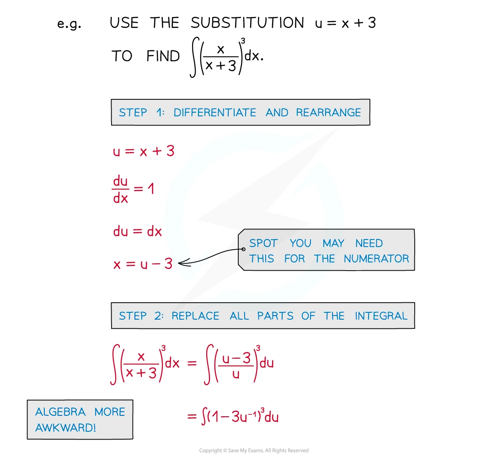{.note-figure fig-alt="Integration note showing a more involved substitution"}
:::

## 4. Integration by parts

::: {.formula-panel}
$$
\int u\,\frac{dv}{dx}\,dx=uv-\int v\,\frac{du}{dx}\,dx,
$$

或简写为

$$
\int u\,dv=uv-\int v\,du.
$$

常见选择：把 algebraic factor 取作 $u$，把 $e^{ax}$、$sin ax$ 或 $cos ax$ 取作 $dv$。若出现 $\ln x$，通常取 $u=\ln x$、$dv=dx$。
:::

::: {.worked-example}
Worked example · 笔记第 32 页

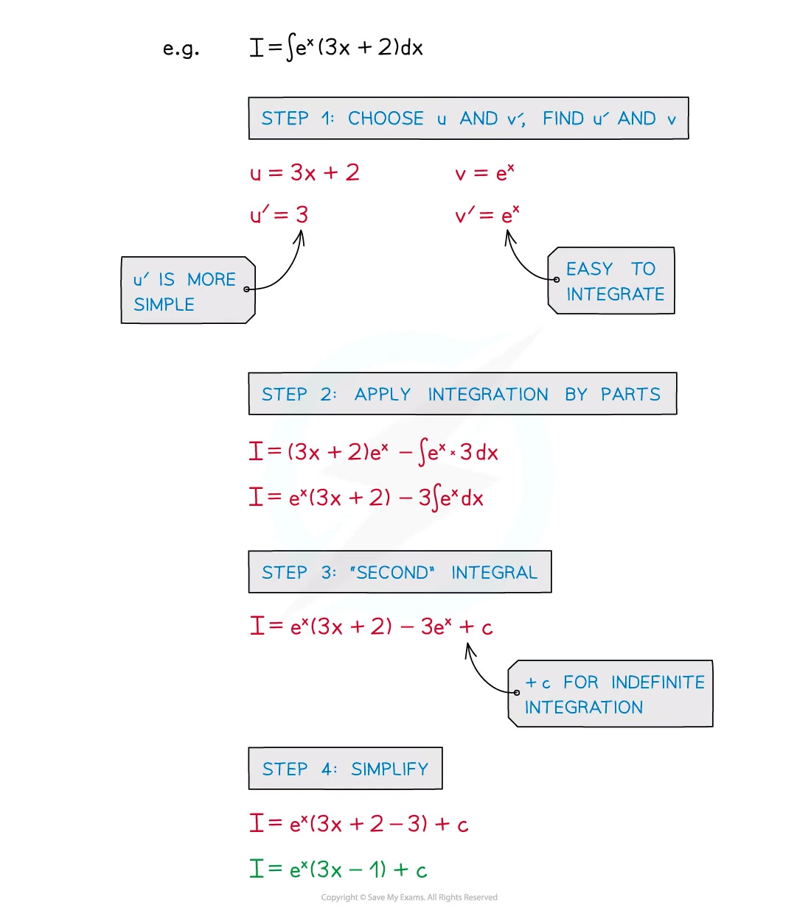{.note-figure fig-alt="Integration note showing integration by parts with an exponential"}
:::

::: {.worked-example}
Worked example · 笔记第 33 页

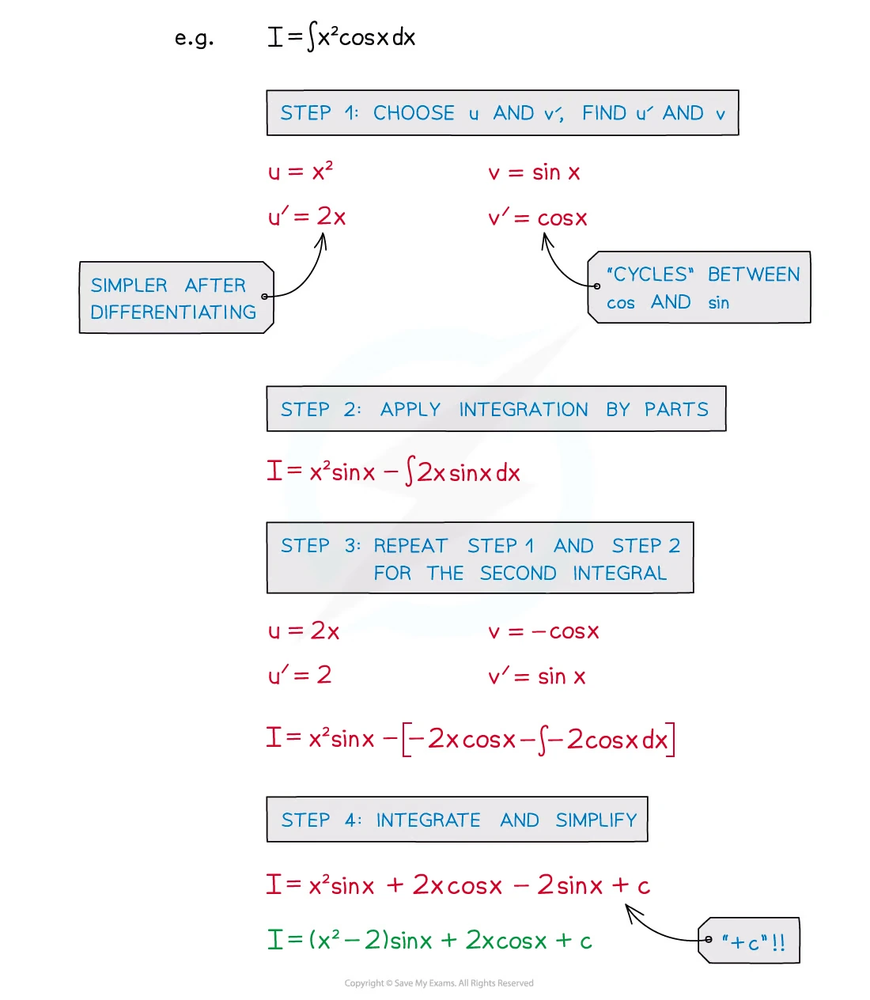{.note-figure fig-alt="Integration note showing repeated integration by parts"}
:::

::: {.worked-example}
Worked example · 笔记第 35 页

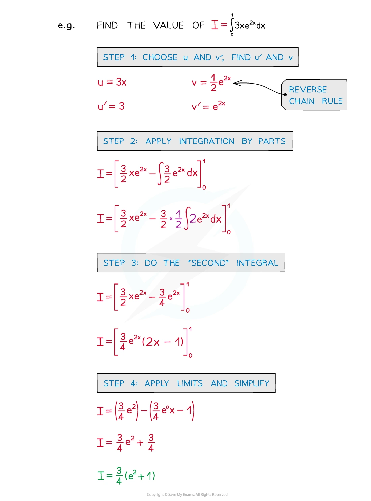{.note-figure fig-alt="Integration note showing definite integration by parts"}
:::

## 5. Partial fractions

::: {.study-card}
若 denominator 已 factorise，例如

$$
\frac{P(x)}{(ax+b)(x^2+c^2)},
$$

先写出合适的 decomposition：

$$
\frac{P(x)}{(ax+b)(x^2+c^2)}
=\frac{A}{ax+b}+\frac{Bx+C}{x^2+c^2}.
$$

如果有 repeated linear factor，要逐层写出：

$$
\frac{P(x)}{(x+a)^2(x+b)}
=\frac{A}{x+b}+\frac{B}{x+a}+\frac{C}{(x+a)^2}.
$$

积分时，linear denominator 产生 logarithm；quadratic denominator 通常拆成 $x/(x^2+a^2)$ 与 $1/(x^2+a^2)$ 两类。
:::

::: {.worked-example}
Worked example · 笔记第 39 页

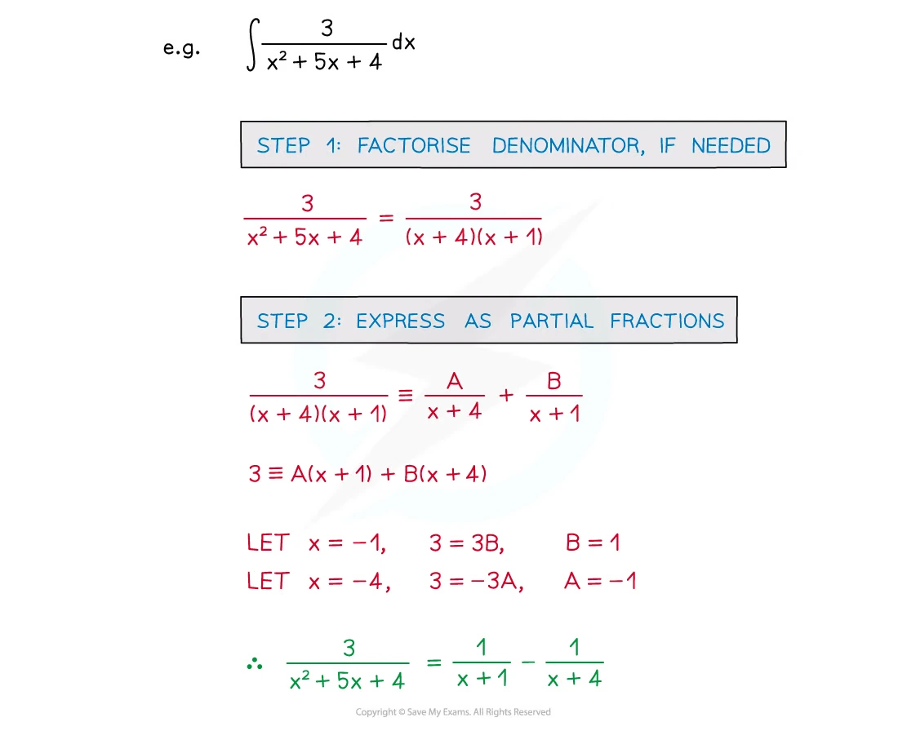{.note-figure fig-alt="Integration note showing partial fractions"}
:::

::: {.worked-example}
Worked example · 笔记第 43 页

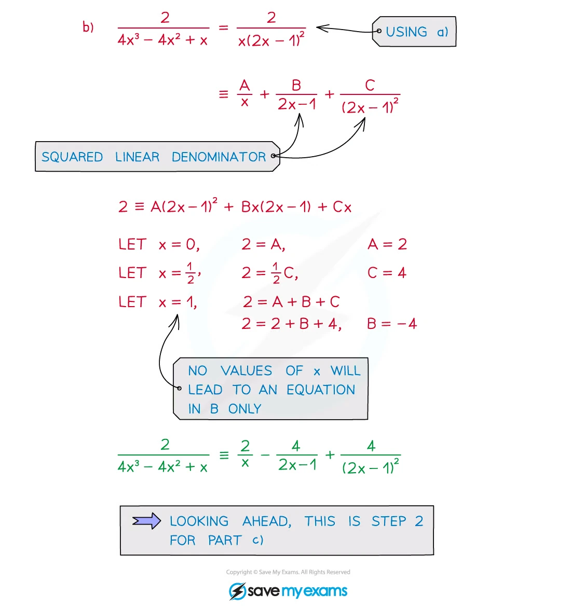{.note-figure fig-alt="Integration note showing partial fractions with a repeated factor"}
:::

## 6. Area and exam decisions

::: {.formula-panel}
若 curve 在 $[a,b]$ 上方，则

$$
\text{area}=\int_a^b y\,dx.
$$

若 curve 在 x-axis 下方，几何 area 要取正值；如果 curve crosses x-axis，则先找 roots，再分段：

$$
\text{area}=\int_a^c y\,dx-\int_c^b y\,dx
\quad\text{when }y\ge0\text{ on }[a,c],\ y\le0\text{ on }[c,b].
$$

遇到 shaded-region diagram，先读出 boundary，再决定 integration limits；不要只看题目给出的最后一个 $x$ 值。
:::

::: {.worked-example}
Worked application · 笔记第 64 页

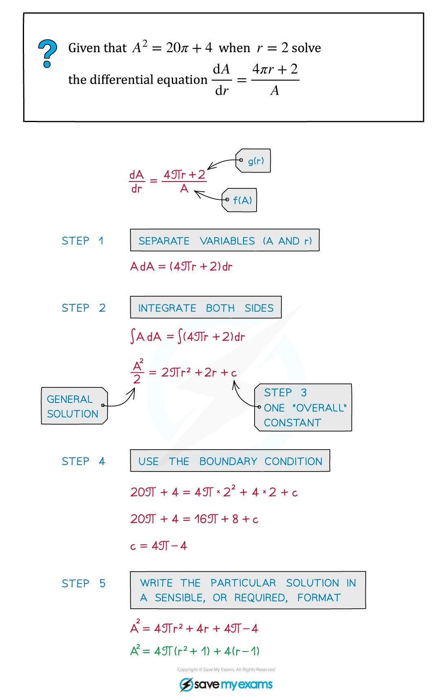{.note-figure fig-alt="Integration note showing separation and integration in a model"}
:::

::: {.worked-example}
Worked application · 笔记第 79 页

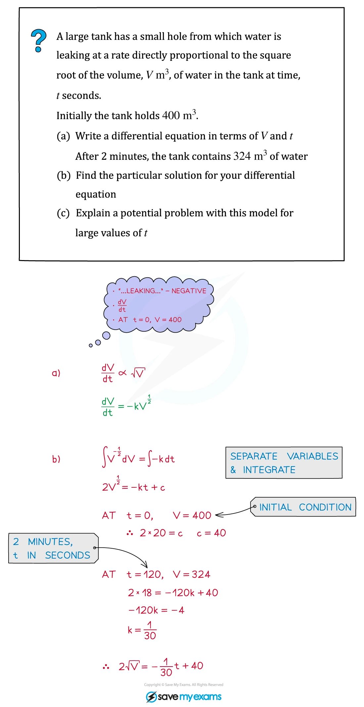{.note-figure fig-alt="Integration note showing an applied tank model involving integration"}
:::

## 7. Selected Paper 3 questions

以下 20 题均保留 past paper 的题目主文，并按对应 mark scheme 的得分路径补充详细解答。题目中的 diagram 使用从 PDF 独立提取的 SVG 矢量内容，不是整页截图。

### Substitution, standard forms and area

::: {.question-card #int-2020-mj32-q6}
### Question 1 · 9709/32/M/J/20 Q6(b)
substitutionarea

The diagram shows the curve $y=\dfrac{x}{1+3x^4}$, for $x\ge0$. Using the substitution $u=3x^2$, find by integration the exact area of the shaded region bounded by the curve, the $x$-axis and the line $x=1$. **[5]**

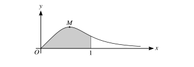{.note-figure fig-alt="Extracted vector diagram for 9709/32/M/J/20 Q6"}

Show detailed mark scheme answer

$$
A=\int_0^1\frac{x}{1+3x^4}\,dx.
$$

令 $u=3x^2$，则 $du=6x\,dx$，且 $3x^4=u^2/3$。因此

$$
\begin{aligned}
A&=\frac16\int_0^3\frac{du}{1+u^2/3}
=\frac12\int_0^3\frac{du}{u^2+3}\\
&=\frac1{2\sqrt3}\left[\tan^{-1}\left(\frac{u}{\sqrt3}\right)\right]_0^3
=\boxed{\frac{\pi}{6\sqrt3}}.
\end{aligned}
$$

<label class="done-toggle"><input type="checkbox" data-progress="int-2020-mj32-q6"> Completed</label>

<strong>Source:</strong> `PastPaper/2020/2020/9709-s20-qp-32.pdf`, Q6(b), and matching mark scheme.

:::

::: {.question-card #int-2020-s20-q2}
### Question 2 · 9709/33/M/J/20 Q2
integration by partsexponential

Find the exact value of

$$
\int_0^1(2-x)e^{-2x}\,dx.
$$

**[5]**

Show detailed mark scheme answer

取 $u=2-x$，$dv=e^{-2x}dx$，则 $du=-dx$、$v=-\frac12e^{-2x}$。

$$
\begin{aligned}
\int(2-x)e^{-2x}\,dx
&=-\frac12(2-x)e^{-2x}-\frac12\int e^{-2x}\,dx\\
&=-\frac12(2-x)e^{-2x}+\frac14e^{-2x}\\
&=\left(\frac{x}{2}-\frac34\right)e^{-2x}.
\end{aligned}
$$

所以

$$
\begin{aligned}
I&=\left[\left(\frac{x}{2}-\frac34\right)e^{-2x}\right]_0^1\\
&=-\frac1{4e^2}-\left(-\frac34\right)
=\boxed{\frac34-\frac1{4e^2}}.
\end{aligned}
$$

<label class="done-toggle"><input type="checkbox" data-progress="int-2020-s20-q2"> Completed</label>

<strong>Source:</strong> `PastPaper/2020/2020/9709-s20-qp-33.pdf`, Q2, and matching mark scheme.

:::

::: {.question-card #int-2020-on31-q10}
### Question 3 · 9709/31/O/N/20 Q10(b)
areaexponential

The diagram shows the curve $y=(2-x)e^{-x/2}$. Find the exact area of the region bounded by the curve and the coordinate axes. **[5]**

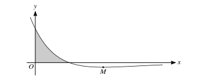{.note-figure fig-alt="Extracted vector diagram for 9709/31/O/N/20 Q10"}

Show detailed mark scheme answer

曲线与 $x$-axis 的交点由 $2-x=0$ 给出，所以 $x=2$；与 $y$-axis 的交点是 $x=0$。因此

$$
A=\int_0^2(2-x)e^{-x/2}\,dx.
$$

直接观察到

$$
\frac{d}{dx}\left(2xe^{-x/2}\right)=(2-x)e^{-x/2}.
$$

于是

$$
A=\left[2xe^{-x/2}\right]_0^2=\boxed{\frac4e}.
$$

<label class="done-toggle"><input type="checkbox" data-progress="int-2020-on31-q10"> Completed</label>

<strong>Source:</strong> `PastPaper/2020/2020/9709_w20_qp_31.pdf`, Q10, and matching mark scheme.

:::

::: {.question-card #int-2020-on32-q9}
### Question 4 · 9709/32/O/N/20 Q9(a–b)
partial fractionsarctangent

Let

$$
f(x)=\frac{7x+18}{(3x+2)(x^2+4)}.
$$

(a) Express $f(x)$ in partial fractions. (b) Hence find the exact value of $\int_0^2f(x)\,dx$. **[11]**

Show detailed mark scheme answer

设

$$
\frac{7x+18}{(3x+2)(x^2+4)}=\frac{A}{3x+2}+\frac{Bx+C}{x^2+4}.
$$

比较

$$
7x+18=A(x^2+4)+(Bx+C)(3x+2).
$$

比较系数得 $A=3$、$B=-1$、$C=3$，所以

$$
f(x)=\frac3{3x+2}+\frac{-x+3}{x^2+4}.
$$

逐项积分：

$$
\begin{aligned}
\int_0^2f(x)dx
&=\left[\ln(3x+2)-\frac12\ln(x^2+4)+\frac32\tan^{-1}\frac{x}{2}\right]_0^2\\
&=\ln4-\frac12\ln2+\frac32\cdot\frac\pi4\\
&=\boxed{\frac32\ln2+\frac{3\pi}{8}}.
\end{aligned}
$$

<label class="done-toggle"><input type="checkbox" data-progress="int-2020-on32-q9"> Completed</label>

<strong>Source:</strong> `PastPaper/2020/2020/9709_w20_qp_32.pdf`, Q9(a–b), and matching mark scheme.

:::

::: {.question-card #int-2021-fm32-q10}
### Question 5 · 9709/32/M/J/21 Q10(a)
trigonometric identitysubstitutionarea

The diagram shows the curve $y=\sin2x\cos^2x$, for $0\le x\le\frac\pi2$. Find the exact area bounded by the curve and the $x$-axis. **[5]**

{.note-figure fig-alt="Extracted vector diagram for 9709/32/M/J/21 Q10"}

Show detailed mark scheme answer

在 $0\le x\le\pi/2$ 上，令 $u=\sin x$，则 $du=\cos x\,dx$，并用 $\sin2x=2\sin x\cos x$：

$$
\begin{aligned}
A&=\int_0^{\pi/2}\sin2x\cos^2x\,dx\\
&=\int_0^{\pi/2}2\sin x\cos^3x\,dx.
\end{aligned}
$$

更方便令 $u=\cos x$，$du=-\sin xdx$：

$$
A=2\int_0^1u^3\,du=\frac12.
$$

因此 $\boxed{A=\frac12}$。

<label class="done-toggle"><input type="checkbox" data-progress="int-2021-fm32-q10"> Completed</label>

<strong>Source:</strong> `PastPaper/2021/2021/9709_m21_qp_32.pdf`, Q10(a), and matching mark scheme.

:::

::: {.question-card #int-2021-s21-q4}
### Question 6 · 9709/32/M/J/21 Q4
integration by partslogarithm

Using integration by parts, find the exact value of

$$
\int_0^2\tan^{-1}\left(\frac{x}{2}\right)dx.
$$

**[5]**

Show detailed mark scheme answer

令 $u=\tan^{-1}(x/2)$，$dv=dx$，则 $v=x$，且

$$
du=\frac{1/2}{1+x^2/4}dx=\frac{2}{x^2+4}dx.
$$

因此

$$
\begin{aligned}
I&=\left[x\tan^{-1}\left(\frac{x}{2}\right)\right]_0^2-\int_0^2\frac{2x}{x^2+4}dx\\
&=2\cdot\frac\pi4-\left[\ln(x^2+4)\right]_0^2\\
&=\frac\pi2-\ln2.
\end{aligned}
$$

所以 $\boxed{I=\frac\pi2-\ln2}$。

<label class="done-toggle"><input type="checkbox" data-progress="int-2021-s21-q4"> Completed</label>

<strong>Source:</strong> `PastPaper/2021/2021/9709_s21_qp_32.pdf`, Q4, and matching mark scheme.

:::

::: {.question-card #int-2021-on33-q9}
### Question 7 · 9709/33/O/N/21 Q9(b)
substitutionarctangent

The function is $f(x)=\dfrac1{(9-x)\sqrt{x}}$. Show that

$$
\int_0^4f(x)\,dx=\frac13\ln5.
$$

**[5]**

Show detailed mark scheme answer

令 $u=\sqrt{x}$，则 $x=u^2$、$dx=2u\,du$，且 $\sqrt{x}=u$：

$$
\begin{aligned}
\int_0^4\frac{dx}{(9-x)\sqrt{x}}
&=\int_0^2\frac{2u\,du}{(9-u^2)u}\\
&=\int_0^2\frac{2}{9-u^2}du.
\end{aligned}
$$

因为

$$
\frac{2}{9-u^2}=\frac13\left(\frac1{3+u}+\frac1{3-u}\right),
$$

所以

$$
\begin{aligned}
I&=\frac13\left[\ln(3+u)-\ln(3-u)\right]_0^2\\
&=\frac13\ln\frac5{1}=\boxed{\frac13\ln5}.
\end{aligned}
$$

<label class="done-toggle"><input type="checkbox" data-progress="int-2021-on33-q9"> Completed</label>

<strong>Source:</strong> `PastPaper/2021/2021/9709_w21_qp_33.pdf`, Q9(b), and matching mark scheme.

:::

### Trigonometric integrals and change of variable

::: {.question-card #int-2022-fm32-q11}
### Question 8 · 9709/32/M/J/22 Q11(b)
trigonometric identityarea

The diagram shows the curve $y=\sin x\cos2x$. Find the exact area enclosed by the curve and the $x$-axis in the first quadrant. **[5]**

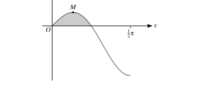{.note-figure fig-alt="Extracted vector diagram for 9709/32/M/J/22 Q11"}

Show detailed mark scheme answer

在第一象限的正区域中，$\cos2x=0$ 时 $x=\pi/4$，所以

$$
A=\int_0^{\pi/4}\sin x\cos2x\,dx.
$$

令 $u=\cos x$，$du=-\sin xdx$，并用 $\cos2x=2u^2-1$：

$$
\begin{aligned}
A&=\int_{\sqrt2/2}^{1}(2u^2-1)du\\
&=\left[\frac23u^3-u\right]_{\sqrt2/2}^{1}\\
&=\boxed{\frac{\sqrt2-1}{3}}.
\end{aligned}
$$

<label class="done-toggle"><input type="checkbox" data-progress="int-2022-fm32-q11"> Completed</label>

<strong>Source:</strong> `PastPaper/2022/2022/9709_m22_qp_32.pdf`, Q11(b), and matching mark scheme.

:::

::: {.question-card #int-2022-s22-q6}
### Question 9 · 9709/31/M/J/22 Q6(a–b)
substitutiondefinite integral

$$
I=\int_0^3\frac{27}{(9+x^2)^2}\,dx.
$$

(a) Show that, using $x=3\tan\theta$,

$$
I=\int_0^{\pi/4}\cos^2\theta\,d\theta.
$$

(b) Hence find the exact value of $I$. **[7]**

Show detailed mark scheme answer

当 $x=3\tan\theta$ 时，$dx=3\sec^2\theta\,d\theta$，并且

$$
9+x^2=9(1+\tan^2\theta)=9\sec^2\theta.
$$

因此

$$
\frac{27}{(9+x^2)^2}dx
=\frac{27}{81\sec^4\theta}\cdot3\sec^2\theta d\theta
=\cos^2\theta d\theta.
$$

$x=0$ 给出 $\theta=0$，$x=3$ 给出 $\theta=\pi/4$，故 (a) 成立。

再用 $\cos^2\theta=(1+\cos2\theta)/2$：

$$
\begin{aligned}
I&=\left[\frac\theta2+\frac{\sin2\theta}{4}\right]_0^{\pi/4}\\
&=\boxed{\frac\pi8+\frac14}.
\end{aligned}
$$

<label class="done-toggle"><input type="checkbox" data-progress="int-2022-s22-q6"> Completed</label>

<strong>Source:</strong> `PastPaper/2022/2022/9709_s22_qp_31.pdf`, Q6(a–b), and matching mark scheme.

:::

::: {.question-card #int-2022-s22-q8}
### Question 10 · 9709/32/M/J/22 Q8(a–b)
partial fractionsarctangent

Let

$$
f(x)=\frac{x^2+9x}{(3x-1)(x^2+3)}.
$$

(a) Express $f(x)$ in partial fractions. (b) Hence find the exact value of $\int_1^3f(x)\,dx$. **[10]**

Show detailed mark scheme answer

设

$$
f(x)=\frac{A}{3x-1}+\frac{Bx+C}{x^2+3}.
$$

比较系数得 $A=1$、$B=0$、$C=3$，所以

$$
f(x)=\frac1{3x-1}+\frac3{x^2+3}.
$$

于是

$$
\begin{aligned}
\int_1^3f(x)dx
&=\left[\frac13\ln(3x-1)+\sqrt3\tan^{-1}\frac{x}{\sqrt3}\right]_1^3\\
&=\frac13\ln4+\sqrt3\left(\frac\pi3-\frac\pi6\right)\\
&=\boxed{\frac13\ln4+\frac{\pi\sqrt3}{6}}.
\end{aligned}
$$

<label class="done-toggle"><input type="checkbox" data-progress="int-2022-s22-q8"> Completed</label>

<strong>Source:</strong> `PastPaper/2022/2022/9709_s22_qp_32.pdf`, Q8(a–b), and matching mark scheme.

:::

::: {.question-card #int-2022-on32-q8}
### Question 11 · 9709/32/O/N/22 Q8
substitutionarea

The diagram shows part of the curve $y=\sin\sqrt{x}$. This part of the curve intersects the $x$-axis at the point where $x=a$.

(a) State the exact value of $a$.

(b) Using the substitution $u=\sqrt{x}$, find the exact area of the shaded region in the first quadrant bounded by this part of the curve and the $x$-axis. **[1+7]**

{.note-figure fig-alt="Extracted vector diagram for 9709/32/O/N/22 Q8"}

Show detailed mark scheme answer

令 $\sin\sqrt a=0$。第一次正的 root 满足 $\sqrt a=\pi$，所以

$$
\boxed{a=\pi^2}.
$$

面积为

$$
A=\int_0^{\pi^2}\sin\sqrt{x}\,dx.
$$

令 $u=\sqrt{x}$，则 $x=u^2$、$dx=2u\,du$：

$$
\begin{aligned}
A&=2\int_0^\pi u\sin u\,du\\
&=2\left[-u\cos u+\sin u\right]_0^\pi\\
&=\boxed{2\pi}.
\end{aligned}
$$

<label class="done-toggle"><input type="checkbox" data-progress="int-2022-on32-q8"> Completed</label>

<strong>Source:</strong> `PastPaper/2022/2022/9709_w22_qp_32.pdf`, Q8, and matching mark scheme.

:::

::: {.question-card #int-2023-s23-q7}
### Question 12 · 9709/33/M/J/23 Q7(a)
substitutionexponential

Use the substitution $u=\cos x$ to show that

$$
\int_0^\pi\sin2x\,e^{2\cos x}\,dx
=\int_{-1}^{1}2u e^{2u}\,du,
$$

**[4]**

Show detailed mark scheme answer

由 $u=\cos x$ 得 $du=-\sin xdx$，又 $\sin2x=2\sin x\cos x=2u\sin x$。上下限为 $x=0\Rightarrow u=1$、$x=\pi\Rightarrow u=-1$：

$$
\int_0^\pi\sin2x e^{2\cos x}dx
=\int_1^{-1}-2u e^{2u}du
=\int_{-1}^12u e^{2u}du.
$$

$$
\int 2u e^{2u}du=e^{2u}\left(u-\frac12\right).
$$

因此

$$
\begin{aligned}
I&=\left[e^{2u}\left(u-\frac12\right)\right]_{-1}^{1}\\
&=\frac12e^2+\frac{3}{2e^2}\\
&=\boxed{\frac{e^4+3}{2e^2}}.
\end{aligned}
$$

<label class="done-toggle"><input type="checkbox" data-progress="int-2023-s23-q7"> Completed</label>

<strong>Source:</strong> `PastPaper/2023/2023/9709_s23_qp_33.pdf`, Q7(a), and matching mark scheme.

:::

### Areas with graph interpretation

::: {.question-card #int-2023-on31-q9}
### Question 13 · 9709/31/O/N/23 Q9(b)
areasubstitutionexponential

The diagram shows the curve $y=xe^{-x^2/4}$, for $x\ge0$, and its maximum point $M$. Using the substitution $x=\sqrt{u}$, or otherwise, find by integration the exact area of the shaded region bounded by the curve, the $x$-axis and the line $x=3$. **[5]**

{.note-figure fig-alt="Extracted vector diagram for 9709/31/O/N/23"}

Show detailed mark scheme answer

$$
A=\int_0^3xe^{-x^2/4}dx.
$$

令 $u=x^2/4$，则 $du=x/2\,dx$，所以 $x\,dx=2du$。上下限为 $0$ 和 $9/4$：

$$
\begin{aligned}
A&=2\int_0^{9/4}e^{-u}du\\
&=2\left[-e^{-u}\right]_0^{9/4}\\
&=\boxed{2\left(1-e^{-9/4}\right)}.
\end{aligned}
$$

<label class="done-toggle"><input type="checkbox" data-progress="int-2023-on31-q9"> Completed</label>

<strong>Source:</strong> `PastPaper/2023/2023/9709_w23_qp_31.pdf`, Q9(b), and matching mark scheme.

:::

::: {.question-card #int-2023-s23-q10}
### Question 14 · 9709/32/M/J/23 Q10(b)
substitutionarea

The diagram shows the curve $y=(x+5)\sqrt{3-2x}$. Using the substitution $u=3-2x$, find by integration the area of the shaded region bounded by the curve and the $x$-axis. **[5]**

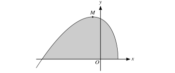{.note-figure fig-alt="Extracted vector diagram for 9709/32/M/J/23 Q10"}

Show detailed mark scheme answer

曲线与 $x$-axis 的交点是 $x=-5$ 和 $x=3/2$，所以

$$
A=\int_{-5}^{3/2}(x+5)\sqrt{3-2x}\,dx.
$$

令 $u=3-2x$，则 $x=(3-u)/2$、$dx=-du/2$，且 $x+5=(13-u)/2$。上下限变为 $u=13$ 和 $u=0$：

$$
\begin{aligned}
A&=\frac14\int_0^{13}(13-u)u^{1/2}du\\
&=\frac14\left[\frac{26}{3}u^{3/2}-\frac25u^{5/2}\right]_0^{13}\\
&=\boxed{\frac{169\sqrt{13}}{15}}.
\end{aligned}
$$

<label class="done-toggle"><input type="checkbox" data-progress="int-2023-s23-q10"> Completed</label>

<strong>Source:</strong> `PastPaper/2023/2023/9709_s23_qp_32.pdf`, Q10(b), and matching mark scheme.

:::

::: {.question-card #int-2024-jun31-q8}
### Question 15 · 9709/31/M/J/24 Q8
substitutiontrigonometric identity

Use the substitution $u=1-\sin x$ to find the exact value of

$$
\int_\pi^{3\pi/2}\frac{\sin2x}{\sqrt{1-\sin x}}\,dx.
$$

**[6]**

Show detailed mark scheme answer

由 $u=1-\sin x$，$du=-\cos xdx$，且

$$
\sin2x=2\sin x\cos x=2(1-u)\cos x.
$$

上下限：$x=\pi\Rightarrow u=1$，$x=3\pi/2\Rightarrow u=2$。故

$$
\begin{aligned}
I&=\int_1^2\frac{-2(1-u)}{\sqrt u}du\\
&=\int_1^2 2(u-1)u^{-1/2}du\\
&=\left[\frac43u^{3/2}-4u^{1/2}\right]_1^2\\
&=\boxed{\frac{8-4\sqrt2}{3}}.
\end{aligned}
$$

<label class="done-toggle"><input type="checkbox" data-progress="int-2024-jun31-q8"> Completed</label>

<strong>Source:</strong> `PastPaper/2024/2024/A-Level-CAIE数学QP-202406-Mathematics-P31-A-Level题库大全小程序.pdf`, Q8, and matching mark scheme.

:::

::: {.question-card #int-2024-oct31-q6}
### Question 16 · 9709/31/O/N/24 Q6(b)
trigonometric identityarea

The diagram shows the curve $y=\sin2x(1+\sin2x)$, for $0\le x\le\frac{3\pi}{4}$. Find the exact area of the region $R$ above the $x$-axis. **[5]**

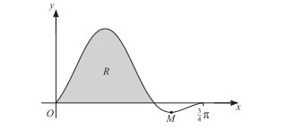{.note-figure fig-alt="Extracted vector diagram for 9709/31/O/N/24 Q6"}

Show detailed mark scheme answer

在 $0\le x\le3\pi/4$ 上，$1+\sin2x\ge0$。curve 在 $x=0$ 到 $x=\pi/2$ 为非负，因此题目所指 above-axis region 的 area 为

$$
A=\int_0^{\pi/2}\sin2x(1+\sin2x)dx.
$$

展开并分别积分：

$$
\begin{aligned}
A&=\int_0^{\pi/2}\sin2x\,dx+\int_0^{\pi/2}\sin^22x\,dx\\
&=1+\int_0^{\pi/2}\frac{1-\cos4x}{2}dx\\
&=\boxed{1+\frac\pi4}.
\end{aligned}
$$

<label class="done-toggle"><input type="checkbox" data-progress="int-2024-oct31-q6"> Completed</label>

<strong>Source:</strong> `PastPaper/2024/2024/A-Level-CAIE数学QP-202410-Mathematics-P31-A-Level题库大全小程序.pdf`, Q6(b), and matching mark scheme.

:::

### Mixed exam-style integrals

::: {.question-card #int-2024-oct32-q11}
### Question 17 · 9709/32/O/N/24 Q11(b)
substitutionpartial fractions

Let

$$
f(x)=\frac{2e^{2x}}{e^{2x}-3e^x+2}.
$$

Use the substitution $u=e^x$ and partial fractions to find the exact value of

$$
\int_{\ln3}^{\ln5}f(x)\,dx.
$$

Give your answer in the form $\ln a$, where $a$ is a rational number in its simplest form. **[9]**

Show detailed mark scheme answer

令 $u=e^x$，则 $du=e^xdx=u\,dx$，所以 $dx=du/u$，上下限变为 $u=3$ 和 $u=5$：

$$
I=\int_3^5\frac{2u}{(u-1)(u-2)}du.
$$

设

$$
\frac{2u}{(u-1)(u-2)}=\frac{A}{u-1}+\frac{B}{u-2}.
$$

比较系数得 $A=-2$、$B=4$。因此

$$
\begin{aligned}
I&=\left[-2\ln(u-1)+4\ln(u-2)\right]_3^5\\
&=(-2\ln4+4\ln3)-(-2\ln2)\\
&=4\ln3-2\ln2\\
&=\boxed{\ln\frac{81}{4}}.
\end{aligned}
$$

<label class="done-toggle"><input type="checkbox" data-progress="int-2024-oct32-q11"> Completed</label>

<strong>Source:</strong> `PastPaper/2024/2024/A-Level-CAIE数学QP-202410-Mathematics-P32-A-Level题库大全小程序.pdf`, Q11(b), and matching mark scheme.

:::

::: {.question-card #int-2021-on31-q5}
### Question 18 · 9709/31/O/N/21 Q5
substitutionarctangent

Using the substitution $u=\sqrt{x}$, find the exact value of

$$
\int_3^4\frac{1}{(x+1)\sqrt{x}}\,dx.
$$

**[6]**

Show detailed mark scheme answer

令 $u=\sqrt{x}$，则 $x=u^2$、$dx=2u\,du$，所以

$$
\frac{dx}{(x+1)\sqrt{x}}=\frac{2u\,du}{(u^2+1)u}=\frac{2}{u^2+1}du.
$$

上下限为 $u=\sqrt3$ 和 $u=2$：

$$
\begin{aligned}
I&=2\int_{\sqrt3}^{2}\frac{du}{1+u^2}\\
&=2\left[\tan^{-1}u\right]_{\sqrt3}^{2}\\
&=\boxed{2\left(\tan^{-1}2-\frac\pi3\right)}.
\end{aligned}
$$

<label class="done-toggle"><input type="checkbox" data-progress="int-2021-on31-q5"> Completed</label>

<strong>Source:</strong> `PastPaper/2021/2021/9709_w21_qp_31.pdf`, Q5, and matching mark scheme.

:::

::: {.question-card #int-2024-jun32-q6}
### Question 19 · 9709/32/M/J/24 Q6(b)
substitutionexponential

The diagram shows the curve $y=xe^{-ax}$, where $a$ is a positive constant. Find the exact value of

$$
\int_0^{2/a}xe^{-ax}\,dx.
$$

**[5]**

Show detailed mark scheme answer

令 $u=ax$，则 $x=u/a$、$dx=du/a$，上下限由 $x=0,2/a$ 变为 $u=0,2$：

$$
\begin{aligned}
I&=\frac1{a^2}\int_0^2ue^{-u}du\\
&=\frac1{a^2}\left[-(u+1)e^{-u}\right]_0^2\\
&=\frac1{a^2}\left(1-3e^{-2}\right).
\end{aligned}
$$

所以

$$
\boxed{I=\frac{1-3e^{-2}}{a^2}}.
$$

<label class="done-toggle"><input type="checkbox" data-progress="int-2024-jun32-q6"> Completed</label>

<strong>Source:</strong> `PastPaper/2024/2024/A-Level-CAIE数学QP-202406-Mathematics-P32-A-Level题库大全小程序.pdf`, Q6(b), and matching mark scheme.

:::

::: {.question-card #int-2023-mj31-q8}
### Question 20 · 9709/31/M/J/23 Q8(b)
partial fractionsdefinite integral

Let

$$
f(x)=\frac{3-3x^2}{(2x+1)(x+2)^2}.
$$

(a) Express $f(x)$ in partial fractions. (b) Hence find the exact value of

$$
\int_0^4f(x)\,dx,
$$

giving your answer in the form $a+b\ln c$, where $a$, $b$ and $c$ are integers. **[10]**

Show detailed mark scheme answer

设

$$
\frac{3-3x^2}{(2x+1)(x+2)^2}
=\frac{A}{2x+1}+\frac{B}{x+2}+\frac{C}{(x+2)^2}.
$$

比较恒等式

$$
3-3x^2=A(x+2)^2+B(2x+1)(x+2)+C(2x+1)
$$

得 $A=1$、$B=-2$、$C=3$。所以

$$
f(x)=\frac1{2x+1}-\frac2{x+2}+\frac3{(x+2)^2}.
$$

逐项积分：

$$
\begin{aligned}
\int_0^4f(x)dx
&=\left[\frac12\ln(2x+1)-2\ln(x+2)-\frac3{x+2}\right]_0^4\\
&=\left(\frac12\ln9-2\ln6-\frac12\right)-\left(-2\ln2-\frac32\right)\\
&=1+\ln3-2\ln3\\
&=\boxed{1-\ln3}.
\end{aligned}
$$

<label class="done-toggle"><input type="checkbox" data-progress="int-2023-mj31-q8"> Completed</label>

<strong>Source:</strong> `PastPaper/2023/2023/9709_m23_qp_31.pdf`, Q8, and matching mark scheme.

:::

::: {.callout-note}
## Exam checklist

1. 先看 integrand 的结构：standard form、$f'/f$、substitution、by parts 和 partial fractions 的优先级不同。
2. definite integral 换元时，$dx$、上下限和 integrand 必须同时改变。
3. integration by parts 每次都要把 $u$、$dv$、$du$、$v$ 写清楚；定积分不要忘记 boundary term。
4. partial fractions 先比较系数，再积分；repeated factors 必须全部写出。
5. area 题先读图、找 roots、判断 curve 在 x-axis 上方还是下方，最后再列 integral。
6. 最终答案按题目要求化成 exact form，例如 single logarithm、$a+b\ln c$ 或含 $\pi$ 的形式。
:::
