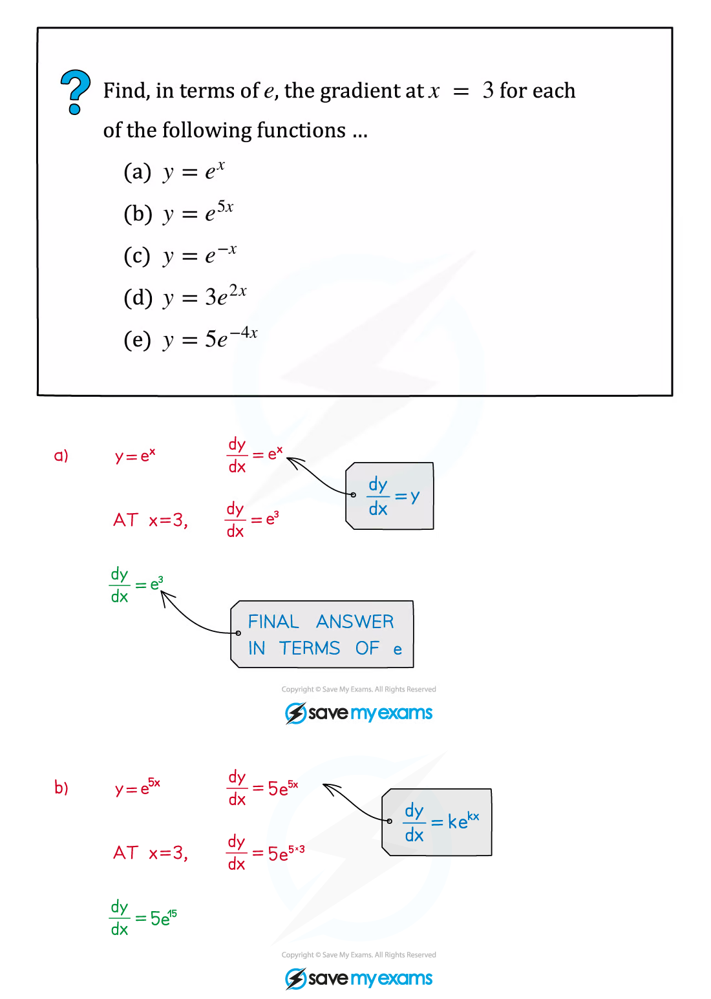
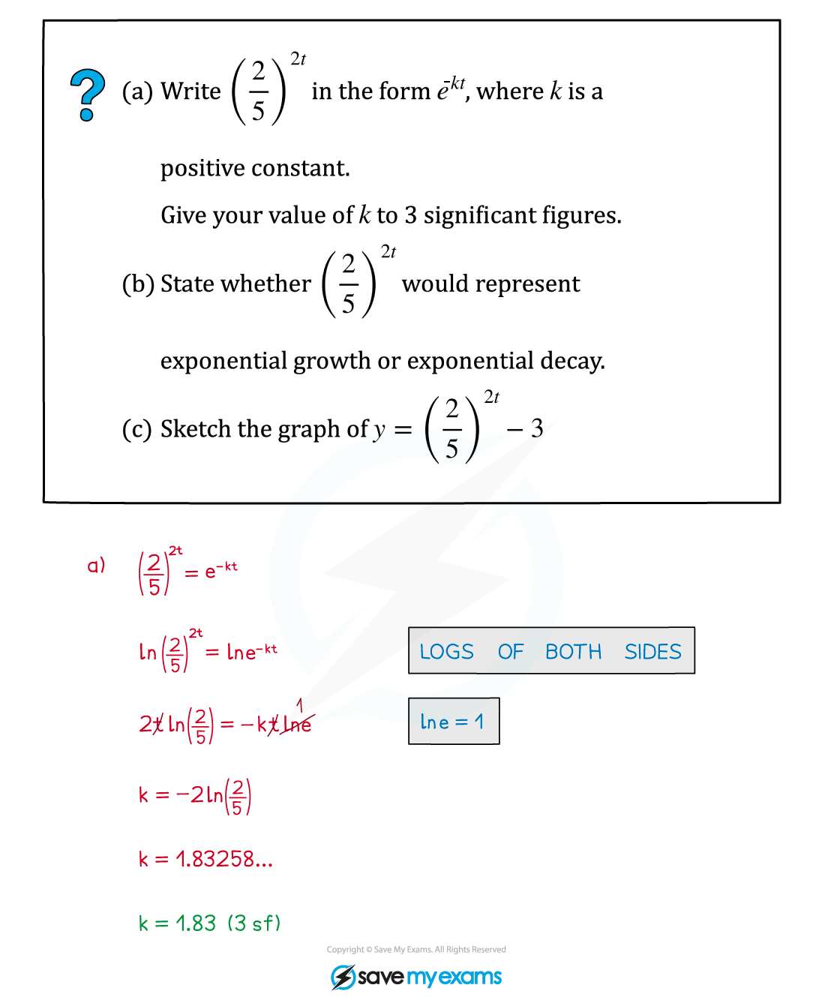
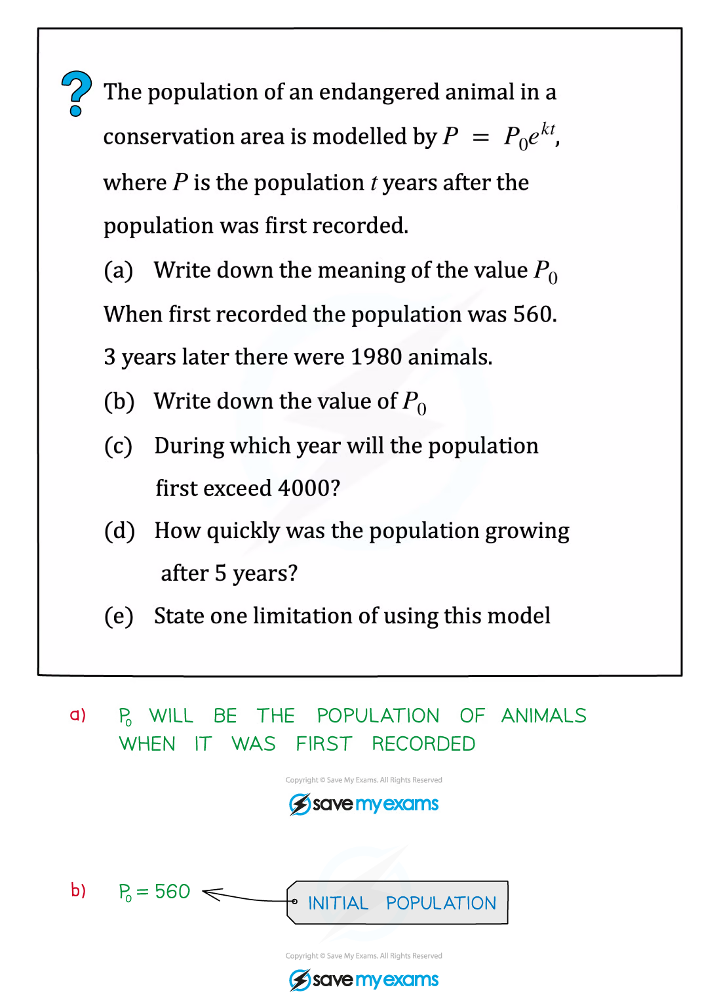

::: {.callout-important}
## 本节考纲要求

本页依据 9709 Mathematics 2026–2027 syllabus 3.2，覆盖：

- logarithms 与 indices 的关系及 laws of logarithms（不要求 change of base）；
- $e^x$ 与 $\ln x$ 的定义、性质、inverse relationship 和图像；
- 用 logarithms 解 unknown 出现在指数中的 equations and inequalities；
- 用 logarithms 把关系式 transform to linear form，并由 gradient/intercept 求未知常数。
:::

## Learning objectives

::: {.study-card}

- [ ] 能写出 logarithm 的定义域并在答案中排除 invalid roots
- [ ] 能使用 product、quotient、power laws 合并或展开 logarithms
- [ ] 能画出 $y=a^x$、$y=e^x$、$y=\ln x$ 以及 $y=Ae^{kx}$ 的基本图像
- [ ] 能用 substitution 把含 $e^{2x}$ 与 $e^{-2x}$ 的方程化为 quadratic
- [ ] 能用 logarithms 解 exponential equations and inequalities
- [ ] 能将 $y=kx^n$、$y=k(a^x)$、$a^y=bx$ 等关系式 linearise
- [ ] 能从 linearised graph 的 gradient/intercept 求模型参数

:::

## 1. Logarithms and indices

::: {.study-card}
### Definition and laws

对于 $a>0$ 且 $a\ne1$，

$$
\log_a x=y\iff a^y=x.
$$

因此 logarithm 是 raising to a power 的 inverse，且定义域为 $x>0$。考纲要求的三条 laws 是：

$$
\log_a(xy)=\log_a x+\log_a y,
$$

$$
\log_a\left(\frac{x}{y}\right)=\log_a x-\log_a y,
$$

$$
\log_a(x^n)=n\log_a x.
$$

常用的反向操作是

$$
\log_a u=\log_a v\implies u=v,
$$

但必须先确认 $u>0$、$v>0$。$ln x$ 表示 $\log_e x$。
:::

::: {.worked-example}
Worked example · 笔记第 26 页

{.note-figure fig-alt="Worked example combining logarithms and checking valid solutions"}

合并 logarithms 后，先解代数方程，再回到每一个原始 logarithm 的定义域检查。
:::

## 2. Exponential functions and graphs

::: {.study-card}
### $y=a^x$ and $y=e^x$

所有 $y=a^x$ 都经过 $(0,1)$，因为 $a^0=1$。

- $a>1$：exponential growth，图像随 $x$ 增大而增大；
- $0<a<1$：exponential decay，图像随 $x$ 增大而减小；
- 两者都以 $y=0$ 为 horizontal asymptote；
- $y=e^x$ 的 inverse function 是 $y=\ln x$，因此 $y=\ln x$ 是 $y=e^x$ 关于 $y=x$ 的反射。

对 $k>0$，$y=e^{kx}$ 是 growth，$y=e^{-kx}$ 是 decay。若有系数 $A$，$y=Ae^{kx}$ 的初始值为 $A$，但 asymptote 仍是 $y=0$。
:::

::: {.worked-example}
Worked example · 笔记第 5 页

{.note-figure fig-alt="Worked example sketching y equals 4 to the x and y equals 0.25 to the x"}
:::

::: {.worked-example}
Worked example · 笔记第 22 页

{.note-figure fig-alt="Worked example finding exact gradients of exponential functions"}
:::

::: {.formula-panel}
### Derivatives needed for graph questions

$$
\frac{d}{dx}e^x=e^x,\qquad \frac{d}{dx}e^{kx}=ke^{kx}.
$$

所以 $y=e^{kx}$ 在 $x=0$ 的 gradient 是 $k$，而 $y=Ae^{kx}$ 在 $x=0$ 的 gradient 是 $Ak$。
:::

## 3. Solving exponential equations

::: {.study-card}
### Direct logarithm method

当未知数只出现在一个指数中，例如 $a^{f(x)}=b$，两边取 logarithm：

$$
f(x)\ln a=\ln b.
$$

若底数相同，可以先用 laws of indices；若出现 $e^{-kx}$，注意 $e^{-kx}=1/e^{kx}$。
:::

::: {.study-card}
### Hidden quadratic

若方程同时含有 $e^{2x}$ 与 $e^{-2x}$，令 $u=e^{2x}$，则 $e^{-2x}=1/u$。乘以 $u$ 后通常得到 quadratic in $u$。解出 $u$ 后，必须保留 $u>0$ 的根，再用 logarithms 求 $x$。
:::

::: {.worked-example}
Worked example · 笔记第 10 页

{.note-figure fig-alt="Worked example solving a hidden quadratic exponential equation"}
:::

::: {.worked-example}
Worked example · 笔记第 31 页

{.note-figure fig-alt="Worked example solving an exponential equation by taking logarithms"}
:::

::: {.formula-panel}
### Exponential inequalities

若 $a>1$，$a^x$ 是 increasing，所以指数不等号方向不变；若 $0<a<1$，$a^x$ 是 decreasing，所以转化为 $x$ 的不等式时方向反转。用 logarithms 时也要注意 $\ln a$ 的正负。
:::

## 4. Linearisation

::: {.study-card}
### Standard linear forms

若

$$y=kx^n,$$

则

$$\ln y=\ln k+n\ln x,$$

所以 plotting $\ln y$ against $\ln x$ 得到 gradient $n$、intercept $\ln k$。

若

$$y=k(a^x),$$

则

$$\ln y=\ln k+x\ln a,$$

所以 plotting $\ln y$ against $x$ 得到 gradient $\ln a$、intercept $\ln k$。

还要识别

$$a^y=bx\implies y=\frac1{\ln a}\ln x+\frac{\ln b}{\ln a}.$$
:::

::: {.worked-example}
Worked example · 笔记第 37 页

{.note-figure fig-alt="Worked example rewriting a power expression in the form e to the k"}
:::

::: {.worked-example}
Worked example · 笔记第 53 页

{.note-figure fig-alt="Worked example finding A and k from a graph of ln N against time"}
:::

## 5. Exponential growth and decay modelling

::: {.study-card}
### Model $N=Ae^{kt}$

在 model $N=Ae^{kt}$ 中：

- $A$ 是 $t=0$ 时的 initial value；
- $k>0$ 表示 growth，$k<0$ 表示 decay；
- growth/decay rate 是

$$
\frac{dN}{dt}=kAe^{kt}=kN;
$$

- 若题目要求“after $t$ years”的 rate，要先求 $N(t)$，再计算 $kN(t)$；
- 必须说明 model 的 limitation，例如 population 不会无限增长、环境条件不会永久不变。
:::

::: {.worked-example}
Worked example · 笔记第 44 页

{.note-figure fig-alt="Worked example using an exponential population model"}
:::

## 6. Paper 3 past-paper questions

本节精选 **20 道** 2020–2024 Paper 3 中与 logarithmic and exponential functions 直接相关的题目。题目保持原题，答案按 mark scheme 写出定义域、代换、线性化步骤和最终答案。

### Equations and inequalities

::: {.question-card #logexp-2020-mj31-q1}
### Example 1 · Exponential inequality · 9709/31/M/J/20 Q1
indicesinequality

Find the set of values of $x$ for which $2(3^{1-2x})<5^x$. Give your answer in a simplified exact form. **[4]**

Show detailed mark scheme answer

Take natural logarithms:

$$
\ln2+(1-2x)\ln3<x\ln5.
$$

Rearranging,

$$
\ln6<x\ln45.
$$

Since $\ln45>0$,

$$\boxed{x>\frac{\ln6}{\ln45}}.$$

<label class="done-toggle"><input type="checkbox" data-progress="logexp-2020-mj31-q1"> Completed</label>

<strong>Source:</strong> `PastPaper/2020/2020/9709-s20-qp-31.pdf` and matching mark scheme.

:::

::: {.question-card #logexp-2020-on31-q2}
### Example 2 · Logarithmic equation · 9709/31/O/N/20 Q2
log lawsdomain

Solve $\log_{10}(2x+1)=2\log_{10}(x+1)-1$. **[4]**

Show detailed mark scheme answer

The logarithms require $2x+1>0$ and $x+1>0$, so $x>-1/2$.

Use $1=\log_{10}10$:

$$
\log_{10}(2x+1)=\log_{10}\left(\frac{(x+1)^2}{10}\right).
$$

Therefore $2x+1=(x+1)^2/10$, so

$$x^2-18x-9=0.$$

Thus $x=9\pm3\sqrt{10}$. Both satisfy $x>-1/2$:

$$\boxed{x=9-3\sqrt{10}\quad\text{or}\quad x=9+3\sqrt{10}}.$$

<label class="done-toggle"><input type="checkbox" data-progress="logexp-2020-on31-q2"> Completed</label>

<strong>Source:</strong> `PastPaper/2020/2020/9709_w20_qp_31.pdf` and matching mark scheme.

:::

::: {.question-card #logexp-2020-on32-q1}
### Example 3 · Logarithm and exponential · 9709/32/O/N/20 Q1
$e^x$3 d.p.

Solve $\ln(1+e^{-3x})=2$. Give the answer correct to 3 decimal places. **[3]**

Show detailed mark scheme answer

Exponentiate both sides:

$$1+e^{-3x}=e^2\implies e^{-3x}=e^2-1.$$

Taking logarithms,

$$-3x=\ln(e^2-1),$$

so

$$\boxed{x=-\frac13\ln(e^2-1)=-0.618\text{ (3 d.p.)}}.$$

<label class="done-toggle"><input type="checkbox" data-progress="logexp-2020-on32-q1"> Completed</label>

<strong>Source:</strong> `PastPaper/2020/2020/9709_w20_qp_32.pdf` and matching mark scheme.

:::

::: {.question-card #logexp-2020-on32-q3}
### Example 4 · Linear form and intersection · 9709/32/O/N/20 Q3
linearisationgradient

The variables $x$ and $y$ satisfy $2^y=3^{1-2x}$.

**(a)** By taking logarithms, show that the graph of $y$ against $x$ is a straight line. State the exact value of its gradient. **[3]**

**(b)** Find the exact $x$-coordinate of the point of intersection of this line with $y=3x$. Give your answer in the form $\dfrac{\ln a}{\ln b}$. **[2]**

Show detailed mark scheme answer

Taking logarithms,

$$y\ln2=(1-2x)\ln3,$$

$$y=\frac{\ln3}{\ln2}-\frac{2\ln3}{\ln2}x.$$

This is linear in $x$, with gradient

$$m=\boxed{-\frac{2\ln3}{\ln2}}.$$

At the intersection, $y=3x$:

$$3x\ln2=(1-2x)\ln3,$$

$$x(3\ln2+2\ln3)=\ln3.$$

Since $3\ln2+2\ln3=\ln(2^3\cdot3^2)=\ln72$,

$$\boxed{x=\frac{\ln3}{\ln72}}.$$

<label class="done-toggle"><input type="checkbox" data-progress="logexp-2020-on32-q3"> Completed</label>

<strong>Source:</strong> `PastPaper/2020/2020/9709_w20_qp_32.pdf` and matching mark scheme.

:::

::: {.question-card #logexp-2021-fm32-q1}
### Example 5 · Logarithmic equation · 9709/32/F/M/21 Q1
log lawsdomain

Solve $\ln(x^3-3)=3\ln x-\ln3$. Give your answer correct to 3 significant figures. **[3]**

Show detailed mark scheme answer

The domains require $x>0$ and $x^3-3>0$, hence $x>\sqrt[3]3$.

Use the logarithm laws:

$$
\ln(x^3-3)=\ln\left(\frac{x^3}{3}\right).
$$

Therefore $x^3-3=x^3/3$, so $2x^3/3=3$ and $x^3=9/2$.

The valid solution is

$$\boxed{x=\sqrt[3]{\frac92}=1.65\text{ (3 s.f.)}}.$$

<label class="done-toggle"><input type="checkbox" data-progress="logexp-2021-fm32-q1"> Completed</label>

<strong>Source:</strong> `PastPaper/2021/2021/9709_m21_qp_32.pdf` and matching mark scheme.

:::

::: {.question-card #logexp-2021-on31-q1}
### Example 6 · Modulus of an exponential · 9709/31/O/N/21 Q1
exponentialcase split

Solve $4|5^x-1|=5^x$, giving your answers correct to 3 decimal places. **[4]**

Show detailed mark scheme answer

Let $u=5^x$, so $u>0$.

If $u\ge1$, then $4(u-1)=u$, giving $u=4/3$ and

$$x=\frac{\ln(4/3)}{\ln5}=0.179\ldots.$$

If $0<u<1$, then $4(1-u)=u$, giving $u=4/5$ and

$$x=\frac{\ln(4/5)}{\ln5}=-0.139\ldots.$$

Both roots satisfy their assumed cases:

$$\boxed{x=0.179\quad\text{or}\quad x=-0.139}.$$

<label class="done-toggle"><input type="checkbox" data-progress="logexp-2021-on31-q1"> Completed</label>

<strong>Source:</strong> `PastPaper/2021/2021/9709_w21_qp_31.pdf` and matching mark scheme.

:::

::: {.question-card #logexp-2021-fm32-q3}
### Example 7 · Linearisation and parameter · 9709/32/F/M/21 Q3
linearisationgradient

The variables $x$ and $y$ satisfy $x=A(3^{-y})$, where $A$ is a constant.

**(a)** Explain why the graph of $y$ against $\ln x$ is a straight line and state its exact gradient. **[3]**

It is given that the line intersects the $y$-axis at $y=1.3$. **(b)** Calculate $A$ correct to 2 decimal places. **[2]**

Show detailed mark scheme answer

Taking logarithms,

$$\ln x=\ln A-y\ln3,$$

so

$$y=-\frac1{\ln3}\ln x+\frac{\ln A}{\ln3}.$$

This is linear in $\ln x$, with gradient

$$\boxed{-\frac1{\ln3}}.$$

At the $y$-axis, $\ln x=0$ and $y=1.3$, so $1.3=\ln A/\ln3$. Thus

$$A=3^{1.3}=4.171\ldots\implies\boxed{A=4.17}.$$

<label class="done-toggle"><input type="checkbox" data-progress="logexp-2021-fm32-q3"> Completed</label>

<strong>Source:</strong> `PastPaper/2021/2021/9709_m21_qp_32.pdf` and matching mark scheme.

:::

::: {.question-card #logexp-2022-mj31-q1}
### Example 8 · Exponential equation · 9709/31/M/J/22 Q1
indices2 d.p.

Solve $2(3^{2x-1})=4^{x+1}$, giving your answer correct to 2 decimal places. **[4]**

Show detailed mark scheme answer

Take logarithms:

$$\ln2+(2x-1)\ln3=(x+1)\ln4.$$

Collect the $x$ terms:

$$x(2\ln3-\ln4)=\ln4+\ln3-\ln2=\ln6.$$

Since $2\ln3-\ln4=\ln(9/4)$,

$$\boxed{x=\frac{\ln6}{\ln(9/4)}=2.21\text{ (2 d.p.)}}.$$

<label class="done-toggle"><input type="checkbox" data-progress="logexp-2022-mj31-q1"> Completed</label>

<strong>Source:</strong> `PastPaper/2022/2022/9709_s22_qp_31.pdf` and matching mark scheme.

:::

::: {.question-card #logexp-2022-mj32-q1}
### Example 9 · Logarithm and exponential · 9709/32/M/J/22 Q1
logarithm3 d.p.

Solve $\ln(e^{2x}+3)=2x+\ln3$, giving your answer correct to 3 decimal places. **[4]**

Show detailed mark scheme answer

The right-hand side is $\ln(3e^{2x})$, so

$$e^{2x}+3=3e^{2x}.$$

Hence $2e^{2x}=3$, so $e^{2x}=3/2$ and

$$\boxed{x=\frac12\ln\frac32=0.203\text{ (3 d.p.)}}.$$

<label class="done-toggle"><input type="checkbox" data-progress="logexp-2022-mj32-q1"> Completed</label>

<strong>Source:</strong> `PastPaper/2022/2022/9709_s22_qp_32.pdf` and matching mark scheme.

:::

::: {.question-card #logexp-2022-fm32-q3}
### Example 10 · Linearised power law · 9709/32/F/M/22 Q3
linearisationpower law

The variables $x$ and $y$ satisfy $x^n y^2=C$. The graph of $\ln y$ against $\ln x$ passes through $(0.31,1.21)$ and $(1.06,0.91)$. Find $n$ and $C$ correct to 2 decimal places. **[5]**

Show detailed mark scheme answer

Take logarithms:

$$n\ln x+2\ln y=\ln C,$$

$$\ln y=-\frac n2\ln x+\frac12\ln C.$$

The gradient is

$$m=\frac{0.91-1.21}{1.06-0.31}=-0.4.$$

Thus $-n/2=-0.4$, giving $n=0.8$.

Using $(0.31,1.21)$,

$$1.21=-0.4(0.31)+\frac12\ln C,$$

so $\ln C=2.668$ and $C=e^{2.668}=14.411\ldots$.

$$\boxed{n=0.80,\qquad C=14.41}.$$

<label class="done-toggle"><input type="checkbox" data-progress="logexp-2022-fm32-q3"> Completed</label>

<strong>Source:</strong> `PastPaper/2022/2022/9709_m22_qp_32.pdf` and matching mark scheme.

:::

::: {.question-card #logexp-2022-on32-q1}
### Example 11 · Exponential equation · 9709/32/O/N/22 Q1
indicesexact logarithm

Solve $2^{3x-1}=5(3^{1-x})$. Give your answer in the form $\dfrac{\ln a}{\ln b}$. **[4]**

Show detailed mark scheme answer

Rewrite both sides to collect the $x$ powers:

$$2^{3x-1}=\frac{2^{3x}}2,\qquad5(3^{1-x})=\frac{15}{3^x}.$$

Multiplying by $2\cdot3^x$ gives

$$6^x2^{3x}=30\implies24^x=30.$$

Therefore

$$\boxed{x=\frac{\ln30}{\ln24}}.$$

<label class="done-toggle"><input type="checkbox" data-progress="logexp-2022-on32-q1"> Completed</label>

<strong>Source:</strong> `PastPaper/2022/2022/9709_w22_qp_32.pdf` and matching mark scheme.

:::

::: {.question-card #logexp-2022-on33-q1}
### Example 12 · Logarithmic equation · 9709/33/O/N/22 Q1
log laws3 d.p.

Solve $\ln(2x-1)=2\ln(x+1)-\ln x$. Give your answer correct to 3 decimal places. **[4]**

Show detailed mark scheme answer

The domain is $x>1/2$. Combine the right-hand side:

$$
\ln(2x-1)=\ln\left(\frac{(x+1)^2}{x}\right).
$$

Thus $x(2x-1)=(x+1)^2$, giving

$$x^2-3x-1=0.$$

The roots are $(3\pm\sqrt{13})/2$; only the positive root lies in $x>1/2$:

$$\boxed{x=\frac{3+\sqrt{13}}2=3.303\text{ (3 d.p.)}}.$$

<label class="done-toggle"><input type="checkbox" data-progress="logexp-2022-on33-q1"> Completed</label>

<strong>Source:</strong> `PastPaper/2022/2022/9709_w22_qp_33.pdf` and matching mark scheme.

:::

::: {.question-card #logexp-2023-fm32-q1}
### Example 13 · Logarithmic rearrangement · 9709/32/F/M/23 Q1
inverse relationshiprearrangement

It is given that $x=\ln(2y-3)-\ln(y+4)$. Express $y$ in terms of $x$. **[3]**

Show detailed mark scheme answer

Combine logarithms:

$$x=\ln\left(\frac{2y-3}{y+4}\right).$$

Exponentiating,

$$e^x=\frac{2y-3}{y+4}.$$

Therefore $e^x(y+4)=2y-3$, so

$$y(2-e^x)=3+4e^x,$$

$$\boxed{y=\frac{3+4e^x}{2-e^x}}.$$

<label class="done-toggle"><input type="checkbox" data-progress="logexp-2023-fm32-q1"> Completed</label>

<strong>Source:</strong> `PastPaper/2023/2023/9709_m23_qp_32.pdf` and matching mark scheme.

:::

::: {.question-card #logexp-2023-mj31-q1}
### Example 14 · Hidden quadratic · 9709/31/M/J/23 Q1
substitutionexponential

Solve $3e^{2x}-4e^{-2x}=5$. Give the answer correct to 3 decimal places. **[3]**

Show detailed mark scheme answer

Let $u=e^{2x}$, so $u>0$ and $e^{-2x}=1/u$. Multiplying by $u$ gives

$$3u^2-5u-4=0.$$

Thus

$$u=\frac{5\pm\sqrt{25+48}}6=\frac{5\pm\sqrt{73}}6.$$

The negative root is impossible because $u=e^{2x}>0$. Hence

$$x=\frac12\ln\left(\frac{5+\sqrt{73}}6\right)=\boxed{0.407\text{ (3 d.p.)}}.$$

<label class="done-toggle"><input type="checkbox" data-progress="logexp-2023-mj31-q1"> Completed</label>

<strong>Source:</strong> `PastPaper/2023/2023/9709_s23_qp_31.pdf` and matching mark scheme.

:::

::: {.question-card #logexp-2023-mj32-q2}
### Example 15 · Logarithmic equation · 9709/32/M/J/23 Q2
domainexact solution

Solve $\ln(2x^2-3)=2\ln x-\ln2$, giving your answer in an exact form. **[3]**

Show detailed mark scheme answer

The right-hand side is $\ln(x^2/2)$, with $x>0$. Also $2x^2-3>0$, so $x>\sqrt{3/2}$.

Equating the positive arguments,

$$2x^2-3=\frac{x^2}{2}.$$

Therefore $3x^2/2=3$, so $x^2=2$. The domain selects the positive root:

$$\boxed{x=\sqrt2}.$$

<label class="done-toggle"><input type="checkbox" data-progress="logexp-2023-mj32-q2"> Completed</label>

<strong>Source:</strong> `PastPaper/2023/2023/9709_s23_qp_32.pdf` and matching mark scheme.

:::

::: {.question-card #logexp-2023-mj33-q1}
### Example 16 · Logarithmic equation · 9709/33/M/J/23 Q1
log laws3 d.p.

Solve $\ln(x+5)=5+\ln x$. Give your answer correct to 3 decimal places. **[4]**

Show detailed mark scheme answer

The domain is $x>0$. Since $5=\ln(e^5)$,

$$\ln(x+5)=\ln(e^5x).$$

Thus $x+5=e^5x$, so

$$x(e^5-1)=5,$$

$$\boxed{x=\frac5{e^5-1}=0.034\text{ (3 d.p.)}}.$$

<label class="done-toggle"><input type="checkbox" data-progress="logexp-2023-mj33-q1"> Completed</label>

<strong>Source:</strong> `PastPaper/2023/2023/9709_s23_qp_33.pdf` and matching mark scheme.

:::

### Linearisation and modelling

::: {.question-card #logexp-2023-on31-q3}
### Example 17 · Linearised exponential model · 9709/31/O/N/23 Q3
linearisation$y=ab^x$

The variables $x$ and $y$ are related by $y=ab^x$. Points on the graph of $\ln y$ against $x$ are $(1,3.7)$ and $(2.2,6.46)$. Find $a$ and $b$. **[4]**

Show detailed mark scheme answer

Taking logarithms,

$$\ln y=\ln a+x\ln b.$$

The gradient is

$$\ln b=\frac{6.46-3.7}{2.2-1}=2.3,$$

so $b=e^{2.3}=9.974\ldots$.

Using $(1,3.7)$,

$$\ln a=3.7-2.3=1.4,$$

so $a=e^{1.4}=4.055\ldots$.

Therefore

$$\boxed{a=4.06,\qquad b=9.97}.$$

<label class="done-toggle"><input type="checkbox" data-progress="logexp-2023-on31-q3"> Completed</label>

<strong>Source:</strong> `PastPaper/2023/2023/9709_w23_qp_31.pdf` and matching mark scheme.

:::

::: {.question-card #logexp-2024-mj31-q2}
### Example 18 · Logarithmic equation · 9709/31/M/J/24 Q2
log laws2 d.p.

Solve $\ln(x-5)=7-\ln x$. Give your answer correct to 2 decimal places. **[4]**

Show detailed mark scheme answer

The domain is $x>5$. Since $7=\ln(e^7)$,

$$\ln(x-5)+\ln x=7=\ln(e^7).$$

Therefore $x(x-5)=e^7$, giving

$$x^2-5x-e^7=0.$$

The roots are

$$x=\frac{5\pm\sqrt{25+4e^7}}2.$$

Only the positive root satisfies $x>5$:

$$\boxed{x=\frac{5+\sqrt{25+4e^7}}2=35.71\text{ (2 d.p.)}}.$$

<label class="done-toggle"><input type="checkbox" data-progress="logexp-2024-mj31-q2"> Completed</label>

<strong>Source:</strong> `PastPaper/2024/2024/A-Level-CAIE数学QP-202406-Mathematics-P31-A-Level题库大全小程序.pdf` and matching mark scheme.

:::

::: {.question-card #logexp-2024-mj31-q3}
### Example 19 · Linearised power relation · 9709/31/M/J/24 Q3
linearisationnearest integer

The variables $x$ and $y$ satisfy $a^y=bx$, where $a$ and $b$ are constants. The graph of $y$ against $\ln x$ passes through $(0.336,1.00)$ and $(1.31,1.50)$. Find $a$ and $b$, giving each value correct to the nearest integer. **[4]**

Show detailed mark scheme answer

Taking logarithms,

$$y\ln a=\ln b+\ln x,$$

$$y=\frac1{\ln a}\ln x+\frac{\ln b}{\ln a}.$$

The gradient is

$$m=\frac{1.50-1.00}{1.31-0.336}=0.51335\ldots=\frac1{\ln a}.$$

Hence $\ln a=1/m=1.947\ldots$, so $a=e^{1.947\ldots}=7.014\ldots$.

The intercept is $1.00-m(0.336)=0.8275\ldots$, which equals $\ln b/\ln a$. Hence $\ln b=1.611\ldots$ and $b=5.012\ldots$.

$$\boxed{a=7,\qquad b=5}.$$

<label class="done-toggle"><input type="checkbox" data-progress="logexp-2024-mj31-q3"> Completed</label>

<strong>Source:</strong> `PastPaper/2024/2024/A-Level-CAIE数学QP-202406-Mathematics-P31-A-Level题库大全小程序.pdf` and matching mark scheme.

:::

::: {.question-card #logexp-2024-on32-q4}
### Example 20 · Exponential equation · 9709/32/O/N/24 Q4
indices3 d.p.

Solve the equation $5^x=5^{x+2}-10$. Give your answer correct to 3 decimal places. **[3]**

Show detailed mark scheme answer

Use the laws of indices:

$$5^{x+2}=25\cdot5^x.$$

Therefore

$$5^x=25\cdot5^x-10\implies24\cdot5^x=10,$$

so $5^x=5/12$. Taking logarithms,

$$x\ln5=\ln\frac5{12}.$$

Hence

$$\boxed{x=\frac{\ln(5/12)}{\ln5}=-0.544\text{ (3 d.p.)}}.$$

<label class="done-toggle"><input type="checkbox" data-progress="logexp-2024-on32-q4"> Completed</label>

<strong>Source:</strong> `PastPaper/2024/2024/A-Level-CAIE数学QP-202410-Mathematics-P32-A-Level题库大全小程序.pdf` and matching mark scheme.

:::

## Chapter checklist

::: {.study-card}

- [ ] 我能写出每个 logarithm 的定义域并排除 invalid solution
- [ ] 我能把 logarithmic equation 化为代数方程
- [ ] 我能识别 hidden quadratic 并保留 $e^{kx}>0$ 的根
- [ ] 我能从 linearised graph 的 gradient/intercept 求参数
- [ ] 我能解释 $A$、$k$ 在 $Ae^{kt}$ model 中的意义
- [ ] 我能完成精选的 20 道本章 past-paper 题目

:::

### Source files

- [9709 Mathematics syllabus 2026–2027](../../697427-2026-2027-syllabus.pdf)
- [Logs - Exponentials note PDF](../../Note/P3/P3/2.%20Logs%20-%20Exponentials.pdf)

笔记 worked examples 使用原 PDF 的独立图像对象合成白底 WEBP；past-paper 题目保持原题文字，未使用整页截图。

