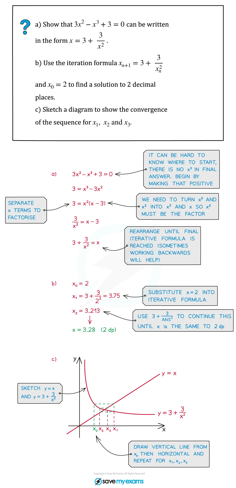

::: {.callout-important}
## 本节考纲要求

本页依据 9709 Mathematics 2026–2027 syllabus 3.6，覆盖：

- 用 graphical considerations 和/或 sign change approximately locate a root，例如找出根所在的两个 consecutive integers；
- 理解表示一列逼近根的 sequence notation；
- 理解给定的 simple iteration $x_{n+1}=F(x_n)$ 与原方程的关系，并使用给定 iteration 或由 rearrangement 得到的 iteration 求 prescribed accuracy 的 root；
- 不要求掌握 convergence condition，但要能理解某个 iteration 可能 fail to converge。
:::

## Learning objectives

::: {.study-card}

- [ ] 能把 $f(a)$、$f(b)$ 的 sign change 与 continuous function 的 root 联系起来
- [ ] 能从图像判断根的数量，并避免把不在指定 interval 内的交点算进去
- [ ] 能把方程整理为 $x=F(x)$，并用 fixed-point 关系解释 iteration
- [ ] 能按题目要求写出 $x_1,x_2,ldots$ 的位数，并用足够多的项确认 rounding
- [ ] 能识别 iteration 发散、振荡或收敛到错误 root 的风险
- [ ] 能从 mark scheme 要求的 bounds、sign change 和 iteration table 得到完整 method marks

:::

## 1. Locating a root

::: {.formula-panel}
若 $f$ 在 $[a,b]$ 上连续，且

$$
f(a)f(b)<0,
$$

则至少有一个 root $alpha$ 满足 $a<alpha<b$。考试中通常要明确写出两端的数值和 sign change，而不是只写“由图可知”。

若题目要求 correct to $n$ decimal places，找到的 bounds 应至少能保证所有可能的值都 round 到同一个答案。例如要证明 $alpha=1.39$ correct to 2 d.p.，可证明

$$
1.385<alpha<1.395.
$$
:::

::: {.worked-example}
Worked example · Numerical Methods 笔记第 3 页

{.note-figure fig-alt="Original extracted Numerical Methods note showing sign changes and bounds"}
:::

::: {.worked-example}
Worked example · Numerical Methods 笔记第 4 页

{.note-figure fig-alt="Original extracted Numerical Methods note showing a graphical root"}
:::

::: {.study-card}
### Graphical method

把方程改写为 $y=g(x)$ 和 $y=h(x)$，在同一坐标系中画两条曲线。它们的 intersections 对应原方程的 roots。答案必须结合题目给出的 interval；例如一个 pair of graphs 可能在全体实数有多个交点，但指定 interval 内只有一个。
:::

## 2. Iteration and fixed points

::: {.formula-panel}
给定

$$
x_{n+1}=F(x_n),
$$

从 initial value $x_1$ 出发，依次计算

$$
x_2=F(x_1),qquad x_3=F(x_2),qquad ldots
$$

如果 sequence 收敛到 $alpha$，则取 limit 得到

$$
alpha=F(alpha).
$$

这只能说明 limit 是 fixed point；题目若已经说明该 interval 内只有一个 root，才能进一步断定它就是要求的 root。不能把“代入 fixed-point equation”误写成“已经证明 iteration 一定收敛”。
:::

::: {.worked-example}
Worked example · Numerical Methods 笔记第 5 页

{.note-figure fig-alt="Original extracted Numerical Methods note introducing iteration notation"}
:::

::: {.worked-example}
Worked example · Numerical Methods 笔记第 7 页

{.note-figure fig-alt="Original extracted Numerical Methods note showing rearrangement to an iterative formula"}
:::

::: {.worked-example}
Worked example · Numerical Methods 笔记第 8 页

{.note-figure fig-alt="Original extracted Numerical Methods note showing repeated iteration"}
:::

::: {.study-card}
### Accuracy rule

按题目要求保留 intermediate values。若最终答案要求 2 d.p.，不要在每一步都先 round 到 2 d.p.；应保留更多位数，直到 consecutive values 已经稳定地 round 到同一个 2 d.p. 答案。若题目要求“each iteration to 4 d.p.”，表格中就按 4 d.p. 显示，但计算器内部保留 full precision。
:::

::: {.worked-example}
Worked example · Numerical Methods 笔记第 10 页

{.note-figure fig-alt="Original extracted Numerical Methods note showing accuracy and stopping rule"}
:::

::: {.worked-example}
Worked example · Numerical Methods 笔记第 11 页

{.note-figure fig-alt="Original extracted Numerical Methods note showing an iteration table"}
:::

::: {.worked-example}
Worked example · Numerical Methods 笔记第 12 页

{.note-figure fig-alt="Original extracted Numerical Methods note showing convergence"}
:::

::: {.worked-example}
Worked example · Numerical Methods 笔记第 13 页

{.note-figure fig-alt="Original extracted Numerical Methods note showing a numerical solution"}
:::

::: {.worked-example}
Worked example · Numerical Methods 笔记第 14 页

{.note-figure fig-alt="Original extracted Numerical Methods note showing further iteration"}
:::

::: {.worked-example}
Worked example · Numerical Methods 笔记第 15 页

{.note-figure fig-alt="Original extracted Numerical Methods note showing a final numerical-methods example"}
:::

## 3. Selected Paper 3 questions

以下 20 题保留原 past-paper 题目的英文主文；答案按对应 mark scheme 的得分路径展开。题目中的 $	an^{-1}$、$cos^{-1}$ 等均按 radians 计算。

### Root location and iteration

::: {.question-card #num-q01}
### Question 1 · 9709/31/M/J/20 Q6(b–c)
sign changeiteration

This equation has one root in the interval $0<x<\frac12\pi$. Verify by calculation that this root lies between $1$ and $1.4$.

Use the iterative formula

$$
x_{n+1}=\tan^{-1}(\pi+x_n)
$$

to determine the root correct to 2 decimal places. Give the result of each iteration to 4 decimal places. **[2+3]**

Show detailed mark scheme answer

令 $f(x)=\tan x-\pi-x$。按题目给出的 interval，计算端点：$f(1)>0$、$f(1.4)<0$，因此有 sign change，root 在 $(1,1.4)$ 内。

题目已经给出 iteration；用 radians 计算：

$$
\begin{array}{c|c}
n&x_n\\ \hline
1&1.0000\ \text{(可取区间内初值)}\\
2&1.3339\\
3&1.3510\\
4&1.3518\\
5&1.3518
\end{array}
$$

连续项 round 到 2 d.p. 都是 $1.35$，所以 root $\boxed{1.35}$。对应得分点是 sign change、至少一次正确 iteration，以及足够的 iterations 支持 rounding。

<label class="done-toggle"><input type="checkbox" data-progress="num-q01"> Completed</label>

<strong>Source:</strong> `PastPaper/2020/2020/9709-s20-qp-31.pdf`, Q6(b–c), and matching mark scheme.

:::

::: {.question-card #num-q02}
### Question 2 · 9709/32/M/J/20 Q9(b)
fixed pointaccuracy

Use the iterative formula

$$
p_{n+1}=\tan^{-1}\left(\frac{1}{1+p_n}\right)
$$

to determine the value of $p$ correct to 3 decimal places. Give the result of each iteration to 5 decimal places. **[3]**

Show detailed mark scheme answer

从题目给出的 iteration 直接重复代入。取 interval 中的初值 $p_1=0.50000$，并保留内部精度：

$$
\begin{array}{c|c}
n&p_n\\ \hline
1&0.50000\\
2&0.58800\\
3&0.56199\\
4&0.56946\\
5&0.56730\\
6&0.56792\\
7&0.56774\\
8&0.56779\\
9&0.56778
\end{array}
$$

因此连续值都 round 到 3 d.p. 的 $0.568$，故 $\boxed{p=0.568}$。mark scheme 的 M1 是正确使用 formula；A1 需要足够多项支持 3 d.p.。

<label class="done-toggle"><input type="checkbox" data-progress="num-q02"> Completed</label>

<strong>Source:</strong> `PastPaper/2020/2020/9709-s20-qp-32.pdf`, Q9(b), and matching mark scheme.

:::

::: {.question-card #num-q03}
### Question 3 · 9709/33/M/J/20 Q6(a–c)
Newton iterationunique root

By sketching a suitable pair of graphs, show that the equation $x^5=2+x$ has exactly one real root.

Show that if a sequence of values given by

$$
x_{n+1}=\frac{4x_n^5+2}{5x_n^4-1}
$$

converges, then it converges to the root. Use the iterative formula with initial value $x_1=1.5$ to calculate the root correct to 3 decimal places. Give the result of each iteration to 5 decimal places. **[2+2+3]**

Show detailed mark scheme answer

画 $y=x^5$ 与 $y=x+2$。在负半轴上 $x^5<0$ 而 $x+2$ 只在 $x<-2$ 才为负，且左侧五次曲线增长更快；在正半轴上两曲线只有一个交点。因此按题目 interval 可确认 exactly one real root。

若 $x_n\to\alpha$，则

$$
\alpha=\frac{4\alpha^5+2}{5\alpha^4-1}
\iff 5\alpha^5-\alpha=4\alpha^5+2
\iff \alpha^5=\alpha+2.
$$

从 $x_1=1.5$ 开始：

$$
\begin{array}{c|c}
n&x_n\\ \hline
1&1.50000\\
2&1.33162\\
3&1.27352\\
4&1.26724\\
5&1.26717\\
6&1.26717
\end{array}
$$

所以 $\boxed{x=1.267}$。fixed-point algebra 给 2 marks 的核心，iteration 至少正确两次并以稳定值结尾。

<label class="done-toggle"><input type="checkbox" data-progress="num-q03"> Completed</label>

<strong>Source:</strong> `PastPaper/2020/2020/9709-s20-qp-33.pdf`, Q6(a–c), and matching mark scheme.

:::

::: {.question-card #num-q04}
### Question 4 · 9709/31/O/N/20 Q5(b)
iterationroot selection

The sequence of values given by the iterative formula

$$
x_{n+1}=\pi-\sin^{-1}\left(\frac{1}{1+e^{-x_n/2}}\right),
$$

with initial value $x_1=2$, converges to one of these roots. Use the formula to determine this root correct to 2 decimal places. Give the result of each iteration to 4 decimal places. **[3]**

Show detailed mark scheme answer

逐项代入，所有 inverse trigonometric functions 用 radians：

$$
\begin{array}{c|c}
n&x_n\\ \hline
1&2.0000\\
2&2.3217\\
3&2.2760\\
4&2.2824\\
5&2.2815\\
6&2.2816\\
7&2.2816
\end{array}
$$

后续值稳定在 $2.2816\ldots$，因此 correct to 2 d.p. 是 $\boxed{2.28}$。这里不能把另一个 root 当作答案，因为题目已说明 initial value $x_1=2$ 所在的 iteration 收敛到其中一个特定 root。

<label class="done-toggle"><input type="checkbox" data-progress="num-q04"> Completed</label>

<strong>Source:</strong> `PastPaper/2020/2020/9709_w20_qp_31.pdf`, Q5(b), and matching mark scheme.

:::

::: {.question-card #num-q05}
### Question 5 · 9709/32/O/N/20 Q10(b)
rearrangementiteration

The sequence of values given by the iterative formula

$$
a_{n+1}=\pi+\tan^{-1}\left(\frac{1}{2a_n}\right),\qquad a_1=3,
$$

converges to $a$. Use this formula to determine $a$ correct to 2 decimal places. Give the result of each iteration to 4 decimal places. **[3]**

Show detailed mark scheme answer

$$
\begin{array}{c|c}
n&a_n\\ \hline
1&3.0000\\
2&3.3067\\
3&3.2917\\
4&3.2923\\
5&3.2923
\end{array}
$$

例如 $a_2=\pi+\tan^{-1}(1/6)=3.306741\ldots$。连续值 round 到 2 d.p. 都是 $3.29$，故 $\boxed{a=3.29}$。mark scheme 要求至少正确使用 formula，并显示足够 terms。

<label class="done-toggle"><input type="checkbox" data-progress="num-q05"> Completed</label>

<strong>Source:</strong> `PastPaper/2020/2020/9709_w20_qp_32.pdf`, Q10(b), and matching mark scheme.

:::

::: {.question-card #num-q06}
### Question 6 · 9709/33/O/N/20 Q5(b)
iterationtrigonometry

The sequence given by

$$
x_{n+1}=\pi-\sin^{-1}\left(\frac{1}{1+e^{-x_n/2}}\right),
$$

with initial value $x_1=2$, converges to one of these roots. Use the formula to determine this root correct to 2 decimal places. Give the result of each iteration to 4 decimal places. **[3]**

Show detailed mark scheme answer

这题的 calculation 与 Question 4 相同：

$$
2.0000\to2.3217\to2.2760\to2.2824\to2.2815\to2.2816\to2.2816.
$$

因此 $x_n\to2.281615\ldots$，所以 $\boxed{x=2.28}$ correct to 2 d.p.。每一项必须把上一项完整代入，而不是把初值 $2$ 重复代入。

<label class="done-toggle"><input type="checkbox" data-progress="num-q06"> Completed</label>

<strong>Source:</strong> `PastPaper/2020/2020/9709_w20_qp_33.pdf`, Q5(b), and matching mark scheme.

:::

::: {.question-card #num-q07}
### Question 7 · 9709/32/M/J/21 Q6(c–d)
fixed pointconvergence

Show that if a sequence of values in the interval $0<x<\frac12\pi$ given by

$$
x_{n+1}=\cos^{-1}\left(2-\frac{x_n}{0.9\sin x_n}\right)
$$

converges, then it converges to the root of the equation in part (a). Use this iterative formula to determine $x$ correct to 2 decimal places. Give the result of each iteration to 4 decimal places. **[2+3]**

Show detailed mark scheme answer

若 $x_n\to x$，则 fixed-point equation 给出

$$
x=\cos^{-1}\left(2-\frac{x}{0.9\sin x}\right).
$$

两边取 cosine：

$$
\cos x=2-\frac{x}{0.9\sin x},
$$

这正是 part (a) 的 equation，因此 limit 是该 root。注意这里证明的是“若 converges，则 limit 是 root”，不是证明 convergence condition。

取 interval 中的 $x_1=0.6000$：

$$
0.6000\to0.6106\to0.6151\to0.6170\to0.6179\to0.6182\to0.6184\to0.6185.
$$

所以 $\boxed{x=0.62}$ correct to 2 d.p.。

<label class="done-toggle"><input type="checkbox" data-progress="num-q07"> Completed</label>

<strong>Source:</strong> `PastPaper/2021/2021/9709_s21_qp_32.pdf`, Q6(c–d), and matching mark scheme.

:::

::: {.question-card #num-q08}
### Question 8 · 9709/33/M/J/21 Q6(b–c)
boundsiteration

Verify by calculation that the root of $\cot\frac{x}{2}=1+e^{-x}$ lies between $1$ and $1.5$. Use

$$
x_{n+1}=2\tan^{-1}\left(\frac{1}{1+e^{-x_n}}\right)
$$

to determine the root correct to 2 decimal places. Give each iteration to 4 decimal places. **[2+3]**

Show detailed mark scheme answer

令 $f(x)=\cot(x/2)-1-e^{-x}$。计算得到 $f(1)$ 与 $f(1.5)$ signs 相反，所以 root 在 $(1,1.5)$。

从 $x_1=1$ 开始：

$$
1.0000\to1.2625\to1.3242\to1.3371\to1.3397\to1.3402\to1.3403\to1.3404.
$$

因此 $x_n\to1.34036\ldots$，答案为 $\boxed{1.34}$。

<label class="done-toggle"><input type="checkbox" data-progress="num-q08"> Completed</label>

<strong>Source:</strong> `PastPaper/2021/2021/9709_s21_qp_33.pdf`, Q6(b–c), and matching mark scheme.

:::

### Rearrangement and prescribed accuracy

::: {.question-card #num-q09}
### Question 9 · 9709/22/O/N/21 Q6(b–d)
logarithmiteration

Verify that the root of $\ln x=2e^{-x}$ lies between $1.5$ and $1.6$. Show that the given iteration

$$
x_{n+1}=e^{2e^{-x_n}}
$$

converges, if it converges, to the root, and determine the root correct to 3 significant figures. Give each iteration to 5 significant figures. **[2+1+3]**

Show detailed mark scheme answer

令 $f(x)=\ln x-2e^{-x}$。代入 $1.5$ 与 $1.6$ 得 opposite signs，因此 root 在该 interval。

若 $x_n\to\alpha$，则

$$
\alpha=e^{2e^{-\alpha}}\iff\ln\alpha=2e^{-\alpha},
$$

正好回到原方程。

取 $x_1=1.50000$：

$$
\begin{array}{c|c}
n&x_n\\ \hline
1&1.50000\\
2&1.56246\\
3&1.52081\\
4&1.54817\\
5&1.53001\\
6&1.54198\\
7&1.53406\\
8&1.53929
\end{array}
$$

sequence oscillates while converging to $1.535\ldots$，所以 root $\boxed{1.54}$ correct to 3 s.f.。

<label class="done-toggle"><input type="checkbox" data-progress="num-q09"> Completed</label>

<strong>Source:</strong> `PastPaper/2021/2021/9709_w21_qp_22.pdf`, Q6(b–d), and matching mark scheme.

:::

::: {.question-card #num-q10}
### Question 10 · 9709/21/M/J/22 Q5(b–d)
two rootssign change

Show that the larger root of $|5-2x|=3\ln x$ satisfies

$$
x=2.5+1.5\ln x.
$$

Show that the larger root lies between $4.5$ and $5.0$. Use an iterative formula based on this equation to find the larger root correct to 3 significant figures. Give each iteration to 5 significant figures. **[1+2+3]**

Show detailed mark scheme answer

对于 larger root，$x>2.5$，所以 $|5-2x|=2x-5$。于是

$$
2x-5=3\ln x\iff x=2.5+1.5\ln x.
$$

令 $f(x)=2.5+1.5\ln x-x$，代入 $4.5$ 与 $5.0$ 得 opposite signs，故 root 在 $(4.5,5.0)$。

用 $x_{n+1}=2.5+1.5\ln x_n$，取 $x_1=4.5$：

$$
4.50000\to4.75612\to4.83915\to4.86511\to4.87313\to4.87561\to4.87637\to4.87660.
$$

所以 larger root $\boxed{4.88}$ correct to 3 s.f.。

<label class="done-toggle"><input type="checkbox" data-progress="num-q10"> Completed</label>

<strong>Source:</strong> `PastPaper/2022/2022/9709_s22_qp_21.pdf`, Q5(b–d), and matching mark scheme.

:::

::: {.question-card #num-q11}
### Question 11 · 9709/22/F/M/22 Q5(c–d)
rearrangementsign change

Show that the $x$-coordinate of $P$ satisfies

$$
x=\ln10-\frac12\ln(2x-1).
$$

Use an iterative formula based on this equation to find the $x$-coordinate of $P$ correct to 3 significant figures. Use an initial value of $2$ and give each iteration to 5 significant figures. **[4+3]**

Show detailed mark scheme answer

直接使用题目要求的 rearrangement：

$$
x_{n+1}=\ln10-\frac12\ln(2x_n-1),\qquad x_1=2.
$$

迭代为

$$
2.00000\to1.75328\to1.84313\to1.80851\to1.82157\to1.81660\to1.81848\to1.81777\to1.81804.
$$

后续值为 $1.8179\ldots$，故 $x$-coordinate $\boxed{1.82}$ correct to 3 s.f.。注意 $2x_n-1$ 必须保持为正，且每一步用上一项而不是初值。

<label class="done-toggle"><input type="checkbox" data-progress="num-q11"> Completed</label>

<strong>Source:</strong> `PastPaper/2022/2022/9709_m22_qp_22.pdf`, Q5(c–d), and matching mark scheme.

:::

::: {.question-card #num-q12}
### Question 12 · 9709/32/M/J/22 Q5(a–c)
graphical rootiteration

By sketching a suitable pair of graphs, show that the equation

$$
\ln x=3x-x^2
$$

has one real root. Verify that the root lies between $2$ and $2.8$. Use the iterative formula

$$
x_{n+1}=\sqrt{3x_n-\ln x_n}
$$

to determine the root correct to 2 decimal places. Give each iteration to 4 decimal places. **[2+2+3]**

Show detailed mark scheme answer

画 $y=\ln x$ 与 $y=3x-x^2$，在 $x>0$ 上只出现一个 intersection。令 $f(x)=3x-x^2-\ln x$，则 $f(2)$ 与 $f(2.8)$ signs 相反，故 root 在 $(2,2.8)$。

若 sequence 收敛到 $\alpha$，则

$$
\alpha=\sqrt{3\alpha-\ln\alpha}
\iff \alpha^2=3\alpha-\ln\alpha
\iff \ln\alpha=3\alpha-\alpha^2.
$$

取 $x_1=2.6000$：

$$
2.6000\to2.6162\to2.6243\to2.6283\to2.6303\to2.6313\to2.6318\to2.6321.
$$

故 root $\boxed{2.63}$ correct to 2 d.p.。

<label class="done-toggle"><input type="checkbox" data-progress="num-q12"> Completed</label>

<strong>Source:</strong> `PastPaper/2022/2022/9709_s22_qp_32.pdf`, Q5(a–c), and matching mark scheme.

:::

::: {.question-card #num-q13}
### Question 13 · 9709/31/M/J/22 Q10(b–d)
convergence statementiteration

The curve $y=x\sin x$ has one stationary point in the interval $0<x<\pi$, where $x=a$.

Verify by calculation that $a$ lies between $2$ and $2.5$. Show that if a sequence of values in $0<x<\pi$ given by

$$
x_{n+1}=\pi-\tan^{-1}\left(\frac{x_n}{2}\right)
$$

converges, then it converges to $a$, the root of the equation in part (a). Use the iterative formula given in part (c) to determine $a$ correct to 2 decimal places. Give the result of each iteration to 4 decimal places. **[2+2+3]**

Show detailed mark scheme answer

端点代入题目 part (a) 的 equation 得 opposite signs，所以 $2<a<2.5$。

若 $x_n\to\alpha$，则

$$
\alpha=\pi-\tan^{-1}(\alpha/2)
\iff\tan(\pi-\alpha)=\alpha/2,
$$

这正是 part (a) 的 root equation，因此 limit 是 $a$。

从 $x_1=2.2000$ 开始：

$$
2.2000\to2.3086\to2.2847\to2.2898\to2.2887\to2.2890\to2.2889.
$$

所以 $\boxed{a=2.29}$。

<label class="done-toggle"><input type="checkbox" data-progress="num-q13"> Completed</label>

<strong>Source:</strong> `PastPaper/2022/2022/9709_s22_qp_31.pdf`, Q10(b–d), and matching mark scheme.

:::

::: {.question-card #num-q14}
### Question 14 · 9709/21/O/N/22 Q4(b)
exponentialiteration

The equation $e^{-x/2}=x^5$ has exactly one real root. Use the iterative formula

$$
x_{n+1}=e^{-x_n/10}
$$

to determine the root correct to 4 significant figures. Give the result of each iteration to 6 significant figures. **[3]**

Show detailed mark scheme answer

由 $e^{-x/2}=x^5$ 取 fifth root 得 $x=e^{-x/10}$，所以 formula 是与 equation 等价的 fixed-point rearrangement。

取正 root 区间内的 $x_1=0.500000$：

$$
0.500000\to0.951229\to0.909261\to0.913085\to0.912736\to0.912768\to0.912765.
$$

因此 root $=0.912765\ldots$，答案为 $\boxed{0.9128}$ correct to 4 s.f.。iteration 结果至少显示到 6 s.f. 才能支持最后的 rounding。

<label class="done-toggle"><input type="checkbox" data-progress="num-q14"> Completed</label>

<strong>Source:</strong> `PastPaper/2022/2022/9709_w22_qp_21.pdf`, Q4(b), and matching mark scheme.

:::

### Trigonometric and mixed-function equations

::: {.question-card #num-q15}
### Question 15 · 9709/32/F/M/23 Q7(b–c)
boundssine iteration

Show by calculation that the root of the equation in (a), $x=\frac34\sin x+\frac12\pi$, lies between $2$ and $2.5$. Use an iterative formula based on the equation in (a) to calculate this root correct to 2 decimal places. Give the result of each iteration to 4 decimal places. **[2+3]**

Show detailed mark scheme answer

令 $f(x)=x-\frac34\sin x-\frac12\pi$。计算 $f(2)$ 与 $f(2.5)$，两者 signs 相反，所以 root 在 $(2,2.5)$。

用

$$
x_{n+1}=\frac34\sin x_n+\frac12\pi,
$$

取 $x_1=2.2000$：

$$
2.2000\to2.1772\to2.1871\to2.1828\to2.1847\to2.1839\to2.1842\to2.1841.
$$

故 root $\boxed{2.18}$ correct to 2 d.p.。

<label class="done-toggle"><input type="checkbox" data-progress="num-q15"> Completed</label>

<strong>Source:</strong> `PastPaper/2023/2023/9709_m23_qp_32.pdf`, Q7(b–c), and matching mark scheme.

:::

::: {.question-card #num-q16}
### Question 16 · 9709/32/M/J/23 Q6(a–c)
inverse trigonometricfixed point

The equation $\cot\frac{x}{2}=3x$ has one root in $0<x<\pi$. Show that the root lies between $0.5$ and $1$. Show that, if positive values given by

$$
x_{n+1}=\frac13\left(x_n+4\tan^{-1}\left(\frac{1}{3x_n}\right)\right)
$$

converge, then they converge to the root. Use this formula to calculate the root correct to 2 decimal places. Give each iteration to 4 decimal places. **[2+2+3]**

Show detailed mark scheme answer

端点代入 $f(x)=\cot(x/2)-3x$ 得 $f(0.5)$ 与 $f(1)$ signs 相反，故 root 在 $(0.5,1)$。

若 $x_n\to\alpha$，则

$$
\alpha=\frac13\left(\alpha+4\tan^{-1}\left(\frac1{3\alpha}\right)\right)
\iff \frac{\alpha}{2}=\tan^{-1}\left(\frac1{3\alpha}\right).
$$

两边取 tangent 即得到 $\cot(\alpha/2)=3\alpha$ 的等价 fixed-point form（在题目指定 interval 内取对应 branch）。

取 $x_1=1$：

$$
1.0000\to0.7623\to0.8037\to0.7921\to0.7951\to0.7943\to0.7945.
$$

所以 root $\boxed{0.79}$。

<label class="done-toggle"><input type="checkbox" data-progress="num-q16"> Completed</label>

<strong>Source:</strong> `PastPaper/2023/2023/9709_s23_qp_32.pdf`, Q6(a–c), and matching mark scheme.

:::

::: {.question-card #num-q17}
### Question 17 · 9709/31/O/N/23 Q8(a–d)
graphical methodlogarithmic iteration

By sketching a suitable pair of graphs, show that the equation $x=e^x-3$ has only one root. Show by calculation that this root lies between $1$ and $2$. Show that, if a sequence given by

$$
x_{n+1}=\ln(3+x_n)
$$

converges, then it converges to the root. Use the iterative formula to calculate the root correct to 2 decimal places. Give each iteration to 4 decimal places. **[2+2+1+3]**

Show detailed mark scheme answer

画 $y=x$ 与 $y=e^x-3$，在题目范围内只有一个 intersection。令 $f(x)=e^x-3-x$，则 $f(1)$ 与 $f(2)$ signs 相反，所以 root 在 $(1,2)$。

若 $x_n\to\alpha$，则

$$
\alpha=\ln(3+\alpha)\iff e^\alpha=3+\alpha,
$$

即回到原 equation。

从 $x_1=1.5000$ 开始：

$$
1.5000\to1.5041\to1.5050\to1.5052\to1.5052.
$$

因此 root $\boxed{1.51}$ correct to 2 d.p.。

<label class="done-toggle"><input type="checkbox" data-progress="num-q17"> Completed</label>

<strong>Source:</strong> `PastPaper/2023/2023/9709_w23_qp_31.pdf`, Q8(a–d), and matching mark scheme.

:::

::: {.question-card #num-q18}
### Question 18 · 9709/32/O/N/23 Q6(b–c)
trigonometric equationiteration

Show by calculation that the root of $\cot x=2-\cos x$ lies between $0.6$ and $0.8$. Use

$$
x_{n+1}=\tan^{-1}\left(\frac{1}{2-\cos x_n}\right)
$$

to determine the root correct to 2 decimal places. Give each iteration to 4 decimal places. **[2+3]**

Show detailed mark scheme answer

令 $f(x)=\cot x-2+\cos x$。$f(0.6)$ 与 $f(0.8)$ signs 相反，故 root 在 $(0.6,0.8)$。

从 $x_1=0.7000$ 开始：

$$
0.7000\to0.6806\to0.6855\to0.6843\to0.6846\to0.6845\to0.6845.
$$

故 root $\boxed{0.68}$ correct to 2 d.p.。因为题目在 interval 内只有 one root，fixed point 的极限不会与另一个 branch 混淆。

<label class="done-toggle"><input type="checkbox" data-progress="num-q18"> Completed</label>

<strong>Source:</strong> `PastPaper/2023/2023/9709_w23_qp_32.pdf`, Q6(b–c), and matching mark scheme.

:::

::: {.question-card #num-q19}
### Question 19 · 9709/31/M/J/23 Q9(b–c)
logarithmic rearrangementiteration

The constant $a$ is such that

$$
\int_0^a xe^{-2x}\,dx=18.
$$

Show that $a=\frac12\ln(4a+2)$. Verify that $a$ lies between $0.5$ and $1$, and use an iterative formula based on this equation to determine $a$ correct to 2 decimal places. Give each iteration to 4 decimal places. **[5+2+3]**

Show detailed mark scheme answer

积分并代入上下限：

$$
\int xe^{-2x}dx=-\frac12xe^{-2x}-\frac14e^{-2x}+C.
$$

把 $0$ 与 $a$ 代入题目给出的 condition，整理后得到

$$
e^{2a}=4a+2\iff a=\frac12\ln(4a+2).
$$

用 $f(a)=\frac12\ln(4a+2)-a$ 检查 $0.5$ 与 $1$，得 sign change；然后用

$$
a_{n+1}=\frac12\ln(4a_n+2),\qquad a_1=0.7000:
$$

$$
0.7000\to0.7843\to0.8183\to0.8313\to0.8362\to0.8381\to0.8388\to0.8390.
$$

因此 $\boxed{a=0.84}$ correct to 2 d.p.。

<label class="done-toggle"><input type="checkbox" data-progress="num-q19"> Completed</label>

<strong>Source:</strong> `PastPaper/2023/2023/9709_s23_qp_31.pdf`, Q9(b–c), and matching mark scheme.

:::

::: {.question-card #num-q20}
### Question 20 · 9709/32/M/J/24 Q5(a–c)
exponential-logarithmiciteration

It is given that the equation

$$
e^{2x}=5+\cos3x
$$

has only one root. Show by calculation that this root lies in the interval $0.7<x<0.8$. Show that if a sequence in this interval given by

$$
x_{n+1}=\frac12\ln(5+\cos3x_n)
$$

converges then it converges to the root. Use this iterative formula to determine the root correct to 3 decimal places. Give the result of each iteration to 5 decimal places. **[2+1+3]**

Show detailed mark scheme answer

令 $f(x)=e^{2x}-5-\cos3x$。代入 $0.7$ 与 $0.8$ 得 opposite signs，所以 root 在 $(0.7,0.8)$。

若 $x_n\to\alpha$，则

$$
\alpha=\frac12\ln(5+\cos3\alpha)
\iff e^{2\alpha}=5+\cos3\alpha,
$$

所以 limit 是原方程的 root。

取区间中点 $x_1=0.75000$：

$$
\begin{array}{c|c}
n&x_n\\ \hline
1&0.75000\\
2&0.73759\\
3&0.74094\\
4&0.74003\\
5&0.74028\\
6&0.74021\\
7&0.74023\\
8&0.74022
\end{array}
$$

因此 root $\boxed{0.740}$ correct to 3 d.p.。这里选 $0.75$ 作为 interval 内初值；每项应按题目要求显示 5 d.p.。

<label class="done-toggle"><input type="checkbox" data-progress="num-q20"> Completed</label>

<strong>Source:</strong> `PastPaper/2024/2024/9709/9709/32/M/J/24`, Q5(a–c), and matching mark scheme.

:::

## Exam checklist

::: {.study-card}

1. 先定义 $f(x)$，再写两端的数值和 sign change。
2. 写 fixed-point proof 时先设 $x_n\to\alpha$，再取 limit；不要声称这一步证明了 convergence。
3. 题目给出的 iteration 优先照用；自己 rearrange 时检查是否会选择错误 root。
4. 每次用上一项代入，保持 radians，并按题目要求输出 iteration 的位数。
5. 最后用 consecutive values 或 bounds 说明 rounding，而不是只写最后一项。

:::
