::: {.callout-important}
## 本节考纲要求

本页依据 9709 Mathematics 2026–2027 syllabus 3.7，覆盖：

- standard vector notation：column vectors、$\mathbf i,\mathbf j,\mathbf k$、$\overrightarrow{AB}$ 和 $\mathbf a$；
- vector 的 addition、subtraction、scalar multiplication 及几何意义；
- magnitude、unit vector、displacement vector 和 position vector；
- 直线的 vector equation $\mathbf r=\mathbf a+t\mathbf b$；
- 判断两条直线 parallel、intersect 或 skew，并在相交时求 intersection；
- 用 scalar product 求 angle、perpendicular、foot of perpendicular 及相关几何量。

本页不引入 vector product；2026–2027 syllabus 不要求 shortest distance between skew lines。
:::

## Learning objectives

::: {.study-card}

- [ ] 能在 position vector、displacement vector 和 direction vector 之间切换
- [ ] 能用 section / midpoint 关系找到点的 position vector
- [ ] 能写出 $\mathbf r=\mathbf a+t\mathbf b$，并从两点得到 direction vector
- [ ] 能通过 equating coordinates 检查两条直线是否相交或 skew
- [ ] 能用 $\mathbf a\cdot\mathbf b=|\mathbf a||\mathbf b|\cos\theta$ 求 angle
- [ ] 能用 perpendicular scalar product 求 foot、距离和几何证明

:::

## 1. Core vector rules

::: {.formula-panel}
若 $A$、$B$ 的 position vectors 分别是 $\mathbf a$、$\mathbf b$，则

$$
\overrightarrow{AB}=\mathbf b-\mathbf a,\qquad
\overrightarrow{BA}=\mathbf a-\mathbf b.
$$

$$
|\mathbf a|=\sqrt{\mathbf a\cdot\mathbf a}
=\sqrt{x^2+y^2+z^2},
\qquad
\text{unit vector in direction }\mathbf a=\frac{\mathbf a}{|\mathbf a|}.
$$

若 $M$ 是 $AB$ 的 midpoint，

$$
\overrightarrow{OM}=\frac12(\mathbf a+\mathbf b).
$$

若 $N$ 在 $AB$ 上且 $AN:NB=m:n$，

$$
\overrightarrow{ON}=\frac{n\mathbf a+m\mathbf b}{m+n}.
$$
:::

## 2. Lines and scalar products

::: {.formula-panel}
经过 position vector $\mathbf a$ 的点、direction vector 为 $\mathbf b$ 的直线：

$$
\mathbf r=\mathbf a+t\mathbf b.
$$

若直线经过两点 $A(\mathbf a)$、$B(\mathbf b)$：

$$
\mathbf r=\mathbf a+t(\mathbf b-\mathbf a).
$$

$$
\mathbf a\cdot\mathbf b
=a_1b_1+a_2b_2+a_3b_3
=|\mathbf a||\mathbf b|\cos\theta.
$$

要求 acute angle 时使用

$$
\cos\theta=\frac{|\mathbf a\cdot\mathbf b|}{|\mathbf a||\mathbf b|}.
$$

判断 3D 直线相交时必须解完三个 coordinate equations；若 direction vectors 不平行且没有共同 solution，则是 skew。
:::

::: {.study-card}
### Foot of perpendicular

若 $F$ 在线 $\mathbf r=\mathbf a+t\mathbf b$ 上，则写

$$
\overrightarrow{OF}=\mathbf a+t_0\mathbf b.
$$

再用 $PF\perp\mathbf b$：

$$
(\overrightarrow{OF}-\overrightarrow{OP})\cdot\mathbf b=0
$$

求 $t_0$。这种写法直接对应 mark scheme 的 perpendicular scalar-product method。
:::

## 3. Essential knowledge points and selected worked examples

本节只保留直接服务于考纲核心方法的代表性图片；重复的 page-like 图和不影响解题的补充图不再全部堆入页面。每个 worked example 都是独立卡片，并紧跟对应知识点。

### Vector notation and direction

箭头表示 direction，线段长度表示 magnitude；同时认识 bold / underlined vector notation。

::: {.worked-example}
Worked example · Vector notation and direction

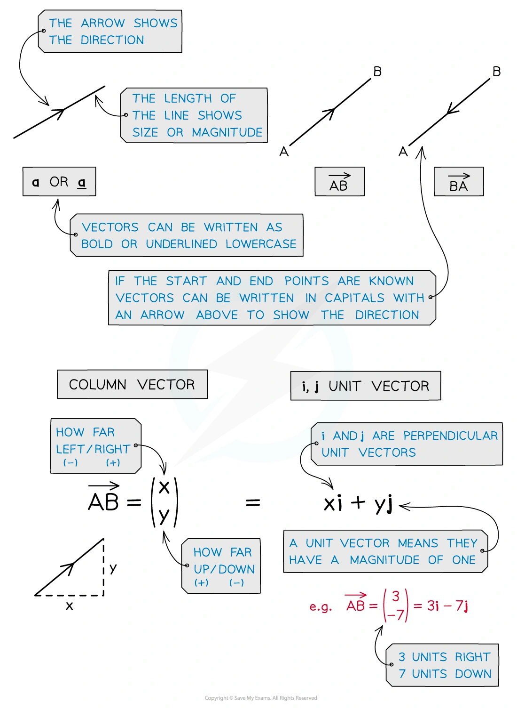{.note-figure fig-alt="Selected original Vectors note image 01: Vector notation and direction"}
:::

### Column vectors and components

用 column vector 表示 horizontal / vertical displacement，并与 i、j unit-vector form 对照。

::: {.worked-example}
Worked example · Column vectors and components

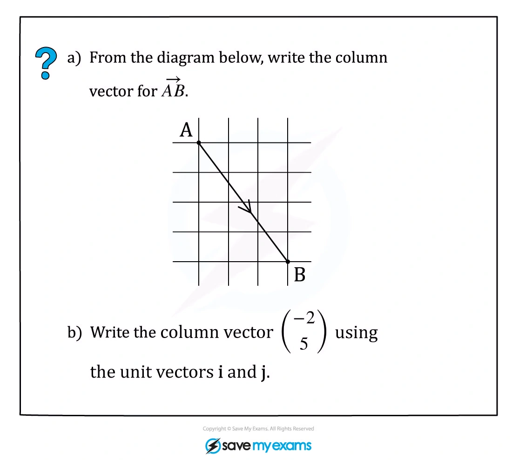{.note-figure fig-alt="Selected original Vectors note image 02: Column vectors and components"}
:::

### Magnitude of a vector

由 components 计算 magnitude，并检查平方根结果。

::: {.worked-example}
Worked example · Magnitude of a vector

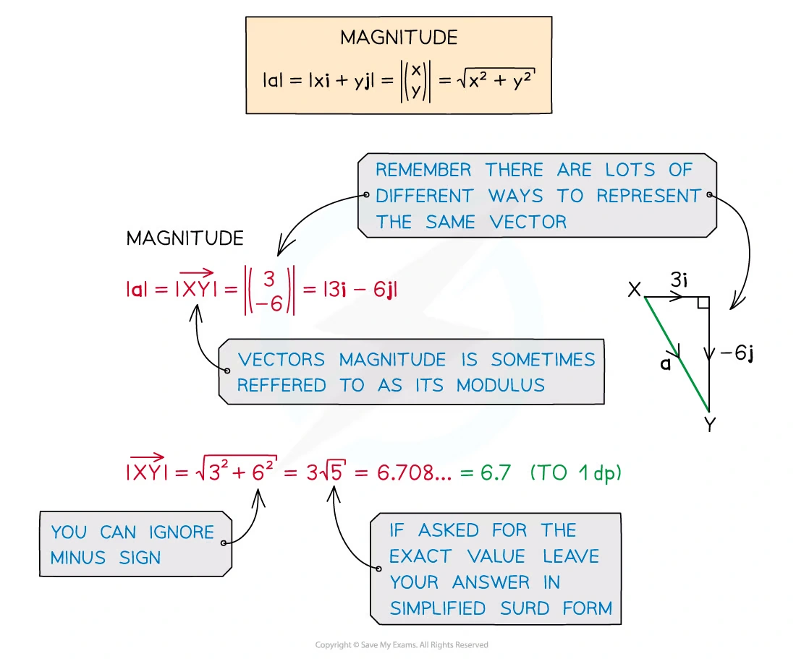{.note-figure fig-alt="Selected original Vectors note image 04: Magnitude of a vector"}
:::

### Unit vector

把 vector 除以 magnitude，得到同方向的 unit vector。

::: {.worked-example}
Worked example · Unit vector

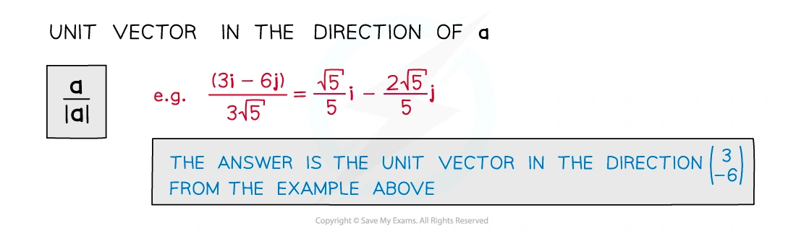{.note-figure fig-alt="Selected original Vectors note image 05: Unit vector"}
:::

### Component form and direction

把 r、magnitude 和 direction angle 联系起来，理解 x/y components。

::: {.worked-example}
Worked example · Component form and direction

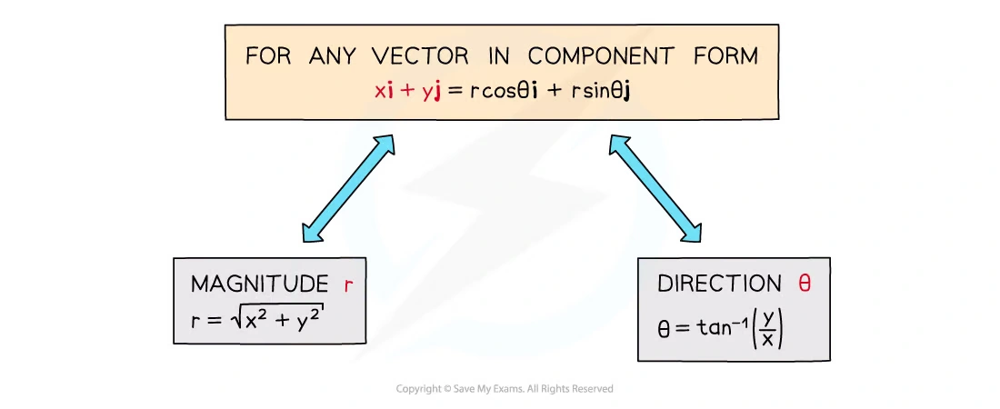{.note-figure fig-alt="Selected original Vectors note image 07: Component form and direction"}
:::

### Displacement and routes

从一个点到另一个点时，用 displacement vectors 记录路线并合并向量。

::: {.worked-example}
Worked example · Displacement and routes

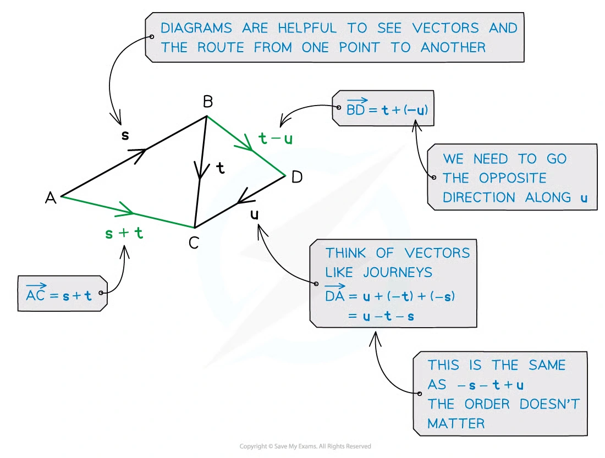{.note-figure fig-alt="Selected original Vectors note image 09: Displacement and routes"}
:::

### Parallelogram geometry

用平行四边形的 opposite-side vectors 建立 position-vector 关系。

::: {.worked-example}
Worked example · Parallelogram geometry

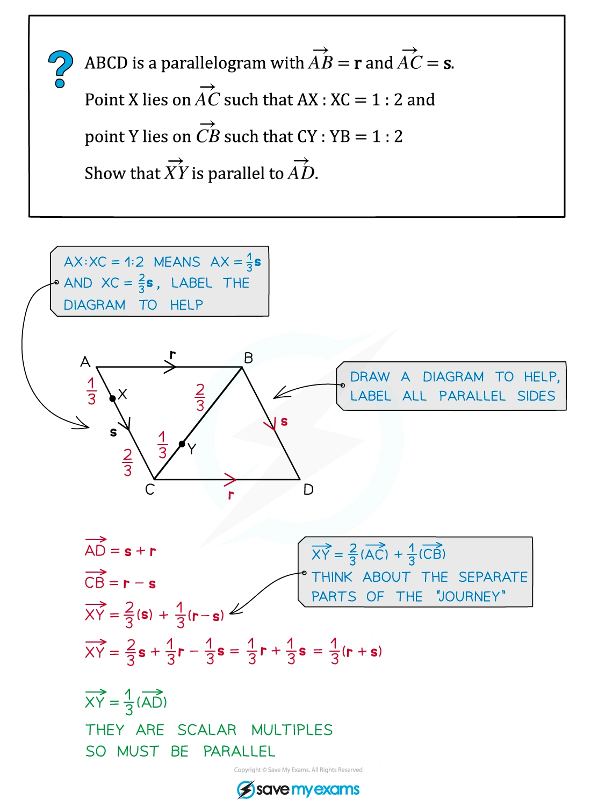{.note-figure fig-alt="Selected original Vectors note image 12: Parallelogram geometry"}
:::

### Distance from position vectors

用两点的 position vectors 求 displacement magnitude，也就是点间距离。

::: {.worked-example}
Worked example · Distance from position vectors

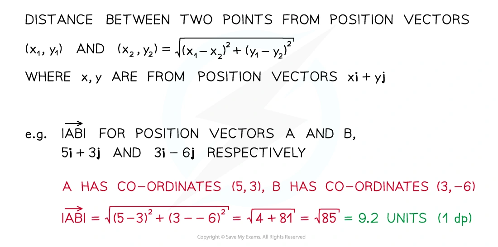{.note-figure fig-alt="Selected original Vectors note image 15: Distance from position vectors"}
:::

### Parallel vectors

判断一个 vector 是否为另一个 vector 的 scalar multiple。

::: {.worked-example}
Worked example · Parallel vectors

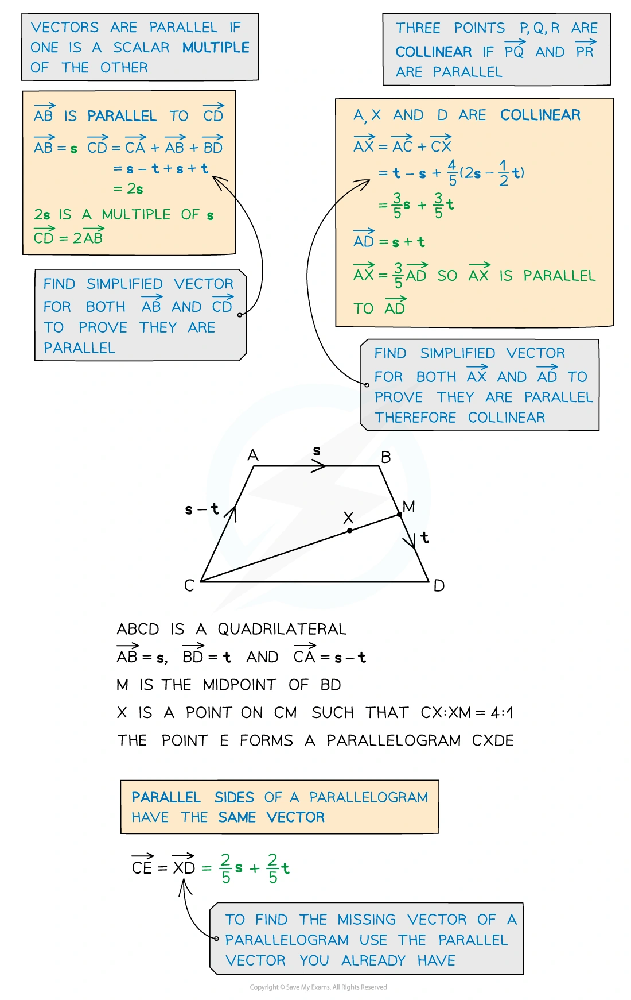{.note-figure fig-alt="Selected original Vectors note image 17: Parallel vectors"}
:::

### Angle in 3D

在 3D triangle 中用 scalar product 求 angle，不依赖二维图像直觉。

::: {.worked-example}
Worked example · Angle in 3D

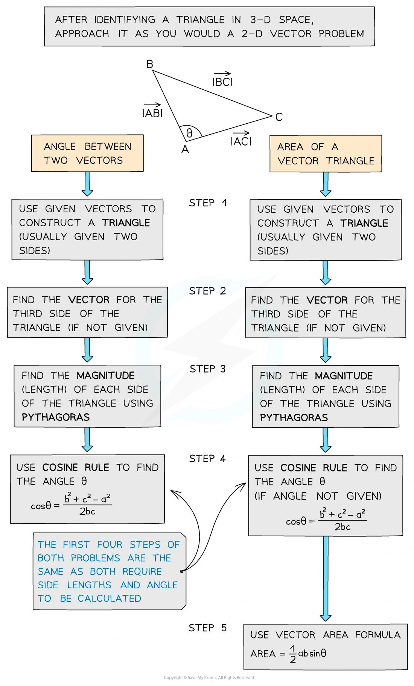{.note-figure fig-alt="Selected original Vectors note image 19: Angle in 3D"}
:::

### Area of a triangle

用 two side vectors 的 magnitudes、included angle 求 triangle area。

::: {.worked-example}
Worked example · Area of a triangle

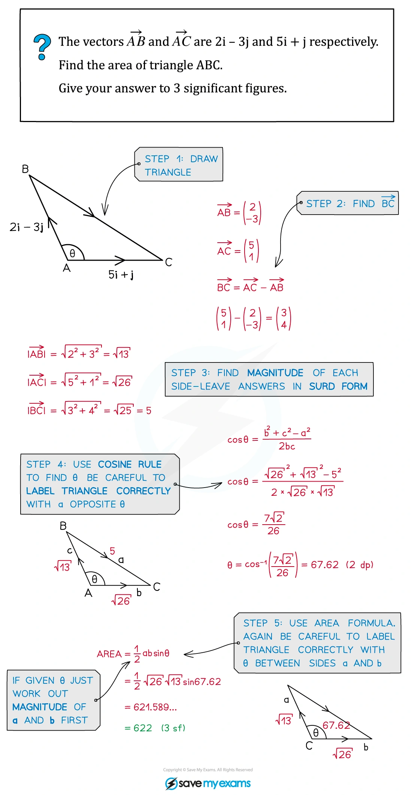{.note-figure fig-alt="Selected original Vectors note image 20: Area of a triangle"}
:::

### Section ratio

用 ratio theorem 找出 line segment 内点的 position vector。

::: {.worked-example}
Worked example · Section ratio

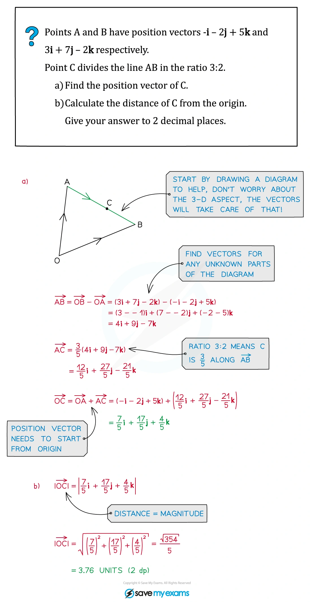{.note-figure fig-alt="Selected original Vectors note image 27: Section ratio"}
:::

### Direction cosines

理解 vector 与 x、y、z axes 的 angles 以及 direction cosines。

::: {.worked-example}
Worked example · Direction cosines

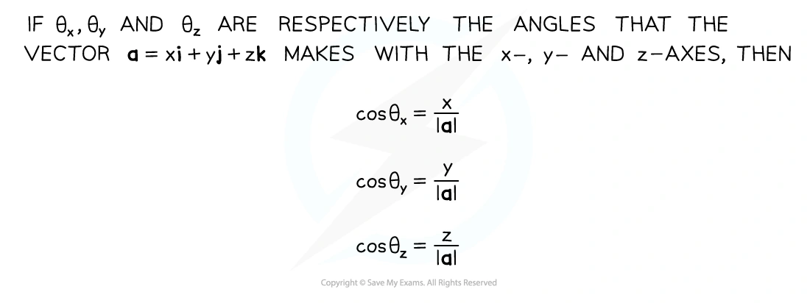{.note-figure fig-alt="Selected original Vectors note image 29: Direction cosines"}
:::

### Vector equation of a line

从一点和 direction vector 写出 r = a + t b。

::: {.worked-example}
Worked example · Vector equation of a line

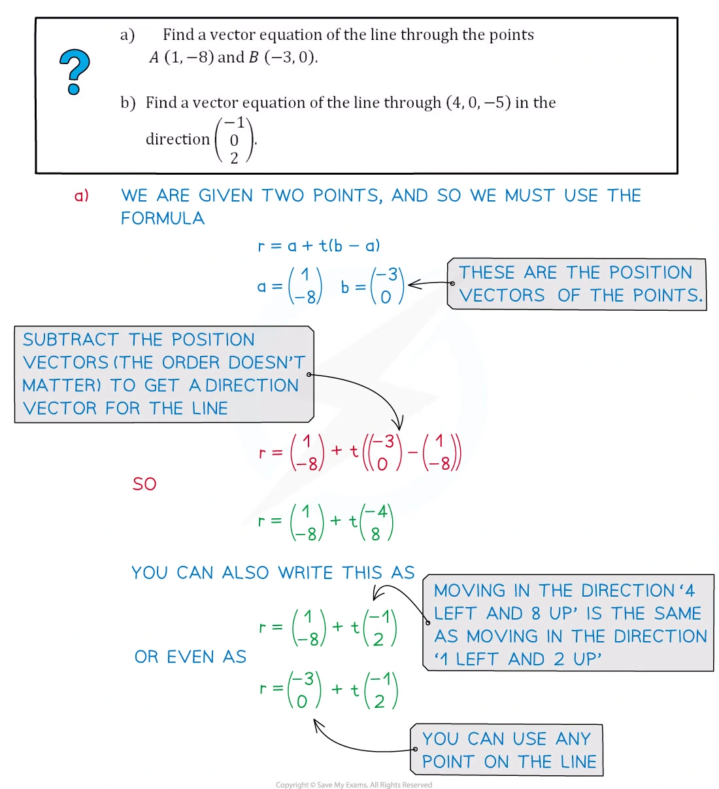{.note-figure fig-alt="Selected original Vectors note image 32: Vector equation of a line"}
:::

### Parallel, intersect or skew

用 parameter equations 判断 3D lines 的关系。

::: {.worked-example}
Worked example · Parallel, intersect or skew

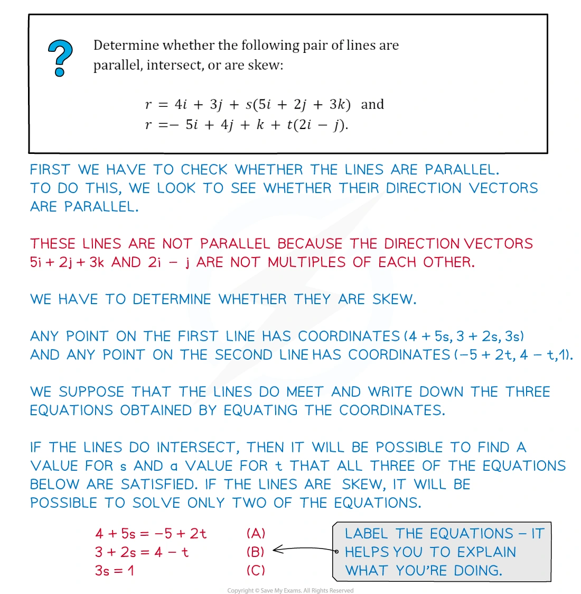{.note-figure fig-alt="Selected original Vectors note image 35: Parallel, intersect or skew"}
:::

### Foot of perpendicular

把 foot 写在线上，再用 scalar product = 0 求最短垂直距离。

::: {.worked-example}
Worked example · Foot of perpendicular

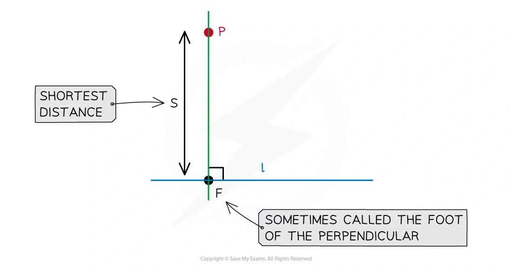{.note-figure fig-alt="Selected original Vectors note image 39: Foot of perpendicular"}
:::

## 4. Selected Paper 3 questions

以下 20 题保留 past paper 的英文题目主文；答案按对应 mark scheme 的得分路径展开。向量角度均按 degrees 报出。

### Position vectors and scalar products

::: {.question-card #vec-q01}
### Question 1 · 9709/31/M/J/20 Q9
scalar productperpendicular distance

With respect to the origin $O$, the vertices of a triangle $ABC$ have position vectors
$$
\overrightarrow{OA}=2\mathbf i+5\mathbf k,\quad
\overrightarrow{OB}=3\mathbf i+2\mathbf j+3\mathbf k,\quad
\overrightarrow{OC}=\mathbf i+\mathbf j+\mathbf k.
$$

(a) Using a scalar product, show that angle $ABC$ is a right angle.

(b) Show that triangle $ABC$ is isosceles.

(c) Find the exact length of the perpendicular from $O$ to the line through $B$ and $C$. **[3+2+4]**

Show detailed mark scheme answer

$$
\overrightarrow{BA}=(-1,-2,2),\quad
\overrightarrow{BC}=(-2,-1,-2),\quad
\overrightarrow{BA}\cdot\overrightarrow{BC}=0.
$$

因此 $\angle ABC=90^\circ$。又 $|AB|=\sqrt9=3=|BC|$，所以 triangle $ABC$ is isosceles。对直线 $BC$ 设 direction 为 $\mathbf d=(-2,-1,-2)$，foot 为 $F=B+t\mathbf d$，使用 $OF\perp BC$：

$$
0=F\cdot\mathbf d=(-14)+9t
\Rightarrow t=\frac{14}{9},
\qquad
F=\left(-\frac19,\frac49,-\frac19\right).
$$

故

$$
d=|OF|=\frac{\sqrt{18}}9=\boxed{\frac{\sqrt2}{3}}.
$$

<label class="done-toggle"><input type="checkbox" data-progress="vec-q01"> Completed</label>

<strong>Source:</strong> PastPaper/2020/2020/9709-s20-qp-31.pdf, Q9, and matching mark scheme.

:::

::: {.question-card #vec-q02}
### Question 2 · 9709/32/M/J/20 Q10(a–b)
midpointline intersection

With respect to the origin $O$, the points $A$ and $B$ have position vectors given by $\overrightarrow{OA}=6\mathbf i+2\mathbf j$ and $\overrightarrow{OB}=2\mathbf i+2\mathbf j+3\mathbf k$. The midpoint of $\overrightarrow{OA}$ is $M$. The point $N$ lying on $AB$, between $A$ and $B$, is such that $AN=2NB$.

(a) Find a vector equation for the line through $M$ and $N$.

The line through $M$ and $N$ intersects the line through $O$ and $B$ at the point $P$.

(b) Find the position vector of $P$. **[5+3]**

Show detailed mark scheme answer

$$
M=(3,1,0),\qquad
N=A+\frac23(B-A)=\left(\frac{10}{3},2,2\right).
$$

所以 $\overrightarrow{MN}=(1/3,1,2)$：

$$
\boxed{\mathbf r=(3,1,0)+t\left(\frac13,1,2\right)}.
$$

令其与 $\mathbf r=s(2,2,3)$ 相等，解 $2t=3s$、$1+t=2s$ 得 $t=3,s=2$，故

$$
\boxed{\overrightarrow{OP}=(4,4,6)}.
$$

<label class="done-toggle"><input type="checkbox" data-progress="vec-q02"> Completed</label>

<strong>Source:</strong> PastPaper/2020/2020/9709-s20-qp-32.pdf, Q10(a–b), and matching mark scheme.

:::

::: {.question-card #vec-q03}
### Question 3 · 9709/33/M/J/20 Q8(a–b)
parallelogramangle

Relative to the origin $O$, the points $A$, $B$ and $D$ have position vectors given by
$$
\overrightarrow{OA}=\mathbf i+2\mathbf j+\mathbf k,\quad
\overrightarrow{OB}=2\mathbf i+5\mathbf j+3\mathbf k,\quad
\overrightarrow{OD}=3\mathbf i+2\mathbf k.
$$
A fourth point $C$ is such that $ABCD$ is a parallelogram.

(a) Find the position vector of $C$ and verify that the parallelogram is not a rhombus.

(b) Find angle $BAD$, giving your answer in degrees. **[5+3]**

Show detailed mark scheme answer

平行四边形满足 $A+C=B+D$：

$$
C=(4,3,4),\quad
\overrightarrow{AB}=(1,3,2),\quad |AB|=\sqrt{14},
\quad \overrightarrow{BC}=(2,-2,1),\quad |BC|=3.
$$

所以不是 rhombus。又 $\overrightarrow{AD}=(2,-2,1)$：

$$
\cos\angle BAD
=\frac{(1,3,2)\cdot(2,-2,1)}{\sqrt{14}\cdot3}
=-\frac2{3\sqrt{14}},
$$

故 $\boxed{\angle BAD=100.3^\circ}$。

<label class="done-toggle"><input type="checkbox" data-progress="vec-q03"> Completed</label>

<strong>Source:</strong> PastPaper/2020/2020/9709-s20-qp-33.pdf, Q8(a–b), and matching mark scheme.

:::

::: {.question-card #vec-q04}
### Question 4 · 9709/31/O/N/20 Q11(a)
intersectionparameter

Two lines have equations
$$
\mathbf r=\mathbf i+2\mathbf j+\mathbf k+s(a\mathbf i+2\mathbf j-\mathbf k)
$$
and
$$
\mathbf r=2\mathbf i+\mathbf j-\mathbf k+t(2\mathbf i-\mathbf j+\mathbf k),
$$
where $a$ is a constant.

(a) Given that the two lines intersect, find the value of $a$ and the position vector of the point of intersection. **[5]**

Show detailed mark scheme answer

Equating coordinates gives

$$
1+as=2+2t,\quad 2+2s=1-t,\quad 1-s=-1+t.
$$

后两式给 $s=-3,t=5$；代入 first equation：

$$
1-3a=12\Rightarrow \boxed{a=-\frac{11}{3}}.
$$

交点为 $\boxed{\overrightarrow{OP}=(12,-4,4)}$。

<label class="done-toggle"><input type="checkbox" data-progress="vec-q04"> Completed</label>

<strong>Source:</strong> PastPaper/2020/2020/9709_w20_qp_31.pdf, Q11(a), and matching mark scheme.

:::

::: {.question-card #vec-q05}
### Question 5 · 9709/32/O/N/20 Q8(a–c)
angleskew lines

With respect to the origin $O$, the position vectors of the points $A$, $B$, $C$ and $D$ are given by
$$
\overrightarrow{OA}=\begin{pmatrix}2\\1\\5\end{pmatrix},\quad
\overrightarrow{OB}=\begin{pmatrix}4\\-1\\1\end{pmatrix},\quad
\overrightarrow{OC}=\begin{pmatrix}1\\1\\2\end{pmatrix},\quad
\overrightarrow{OD}=\begin{pmatrix}3\\2\\3\end{pmatrix}.
$$

(a) Show that $AB=2CD$.

(b) Find the angle between the directions of $\overrightarrow{AB}$ and $\overrightarrow{CD}$.

(c) Show that the line through $A$ and $B$ does not intersect the line through $C$ and $D$. **[3+3+4]**

Show detailed mark scheme answer

$$
\overrightarrow{AB}=(2,-2,-4),\quad |AB|=2\sqrt6,
\qquad \overrightarrow{CD}=(2,1,1),\quad |CD|=\sqrt6.
$$

故 $AB=2CD$，且

$$
\cos\theta=\frac{(2,-2,-4)\cdot(2,1,1)}{(2\sqrt6)(\sqrt6)}
=-\frac16,
\qquad \boxed{\theta=99.6^\circ}.
$$

联立 $A+s\overrightarrow{AB}=C+t\overrightarrow{CD}$，$x,y$ 给 $s=-1/6,t=1/3$，但 $z$ 不成立；方向又不平行，故 lines are skew。

<label class="done-toggle"><input type="checkbox" data-progress="vec-q05"> Completed</label>

<strong>Source:</strong> PastPaper/2020/2020/9709_w20_qp_32.pdf, Q8(a–c), and matching mark scheme.

:::

::: {.question-card #vec-q06}
### Question 6 · 9709/32/F/M/21 Q7(a–b)
skew linesangle between lines

Two lines have equations
$$
\mathbf r=\begin{pmatrix}1\\3\\2\end{pmatrix}
+s\begin{pmatrix}2\\-1\\3\end{pmatrix}
\quad\text{and}\quad
\mathbf r=\begin{pmatrix}2\\1\\4\end{pmatrix}
+t\begin{pmatrix}1\\-1\\4\end{pmatrix}.
$$

(a) Show that the lines are skew.

(b) Find the acute angle between the directions of the two lines. **[5+3]**

Show detailed mark scheme answer

由前两 coordinate equations 得 $s=-1,t=-3$，但第三式不成立；方向向量又不是 scalar multiples，所以 lines are skew。

$$
(2,-1,3)\cdot(1,-1,4)=15,\quad
|d_1|=\sqrt{14},\quad |d_2|=3\sqrt2.
$$

$$
\cos\theta=\frac5{2\sqrt7},
\qquad \boxed{\theta=19.1^\circ}.
$$

<label class="done-toggle"><input type="checkbox" data-progress="vec-q06"> Completed</label>

<strong>Source:</strong> PastPaper/2021/2021/9709_m21_qp_32.pdf, Q7(a–b), and matching mark scheme.

:::

::: {.question-card #vec-q07}
### Question 7 · 9709/32/F/M/22 Q10(a–c)
line equationnon-intersection

The points $A$ and $B$ have position vectors
$$
\overrightarrow{OA}=2\mathbf i+\mathbf j+\mathbf k,\qquad
\overrightarrow{OB}=\mathbf i-2\mathbf j+2\mathbf k.
$$
The line $l$ has vector equation
$$
\mathbf r=\mathbf i+2\mathbf j-3\mathbf k+\mu(\mathbf i-3\mathbf j-2\mathbf k).
$$

(a) Find a vector equation for the line through $A$ and $B$.

(b) Find the acute angle between the directions of $AB$ and $l$, giving your answer in degrees.

(c) Show that the line through $A$ and $B$ does not intersect the line $l$. **[3+3+4]**

Show detailed mark scheme answer

$$
\overrightarrow{AB}=(-1,-3,1),\qquad
\boxed{\mathbf r=(2,1,1)+s(-1,-3,1)}.
$$

$$
\cos\theta=\frac6{\sqrt{11}\sqrt{14}}=\frac6{\sqrt{154}},
\qquad \boxed{\theta=61.1^\circ}.
$$

联立两线，前两 equations 给 $s=1/3,\mu=2/3$，第三 equation 不成立，所以 no intersection；方向不平行，故 skew。

<label class="done-toggle"><input type="checkbox" data-progress="vec-q07"> Completed</label>

<strong>Source:</strong> PastPaper/2022/2022/9709_m22_qp_32.pdf, Q10(a–c), and matching mark scheme.

:::

::: {.question-card #vec-q08}
### Question 8 · 9709/31/M/J/22 Q9(a–c)
cuboidperpendicular distance

In the diagram, $OABCDEFG$ is a cuboid in which $OA=2$ units, $OC=4$ units and $OG=2$ units. Unit vectors $\mathbf i$, $\mathbf j$ and $\mathbf k$ are parallel to $OA$, $OC$ and $OG$ respectively. The point $M$ is the midpoint of $DF$. The point $N$ on $AB$ is such that $AN=3NB$.

(a) Express the vectors $\overrightarrow{OM}$ and $\overrightarrow{MN}$ in terms of $\mathbf i$, $\mathbf j$ and $\mathbf k$.

(b) Find a vector equation for the line through $M$ and $N$.

(c) Show that the length of the perpendicular from $O$ to the line through $M$ and $N$ is $\sqrt{53/6}$. **[3+2+4]**

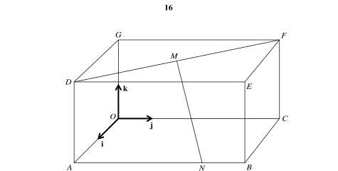{.note-figure fig-alt="Independently extracted vector diagram for 9709/31/M/J/22 Q9"}

Show detailed mark scheme answer

按图 $D=(0,4,2),F=(2,0,2)$，故 $M=(1,2,2)$；$N=(2,3,0)$：

$$
\overrightarrow{OM}=\mathbf i+2\mathbf j+2\mathbf k,\quad
\overrightarrow{MN}=\mathbf i+\mathbf j-2\mathbf k,
$$

$$
\boxed{\mathbf r=(1,2,2)+t(1,1,-2)}.
$$

设 foot 为 $F=M+t_0(1,1,-2)$，令 $(F-O)\cdot(1,1,-2)=0$ 并代回，得到

$$
\boxed{d^2=\frac{53}{6}},\qquad \boxed{d=\sqrt{\frac{53}{6}}}.
$$

<label class="done-toggle"><input type="checkbox" data-progress="vec-q08"> Completed</label>

<strong>Source:</strong> PastPaper/2022/2022/9709_s22_qp_31.pdf, Q9(a–c), matching mark scheme, and independent diagram extraction.

:::

::: {.question-card #vec-q09}
### Question 9 · 9709/33/M/J/22 Q9(a–b)
anglefoot of perpendicular

With respect to the origin $O$, the point $A$ has position vector given by $\overrightarrow{OA}=\mathbf i+5\mathbf j+6\mathbf k$. The line $l$ has vector equation
$$
\mathbf r=4\mathbf i+\mathbf k+\lambda(-\mathbf i+2\mathbf j+3\mathbf k).
$$

(a) Find in degrees the acute angle between the directions of $\overrightarrow{OA}$ and $l$.

(b) Find the position vector of the foot of the perpendicular from $A$ to $l$. **[3+4]**

Show detailed mark scheme answer

令 $\mathbf a=(1,5,6)$、$\mathbf d=(-1,2,3)$：

$$
\mathbf a\cdot\mathbf d=27,\quad |a|=\sqrt{62},\quad |d|=\sqrt{14},
\qquad \boxed{\theta=23.3^\circ}.
$$

foot $F=(4,0,1)+\lambda d$，令 $(F-A)\cdot d=0$，得到 $\lambda=2$，所以

$$
\boxed{\overrightarrow{OF}=(2,4,7)}.
$$

<label class="done-toggle"><input type="checkbox" data-progress="vec-q09"> Completed</label>

<strong>Source:</strong> PastPaper/2022/2022/9709_s22_qp_33.pdf, Q9(a–b), and matching mark scheme.

:::

::: {.question-card #vec-q10}
### Question 10 · 9709/32/O/N/22 Q6(a–b)
triangle areascalar product

Relative to the origin $O$, the points $A$, $B$ and $C$ have position vectors
$$
\overrightarrow{OA}=\begin{pmatrix}1\\3\\1\end{pmatrix},\quad
\overrightarrow{OB}=\begin{pmatrix}3\\1\\2\end{pmatrix},\quad
\overrightarrow{OC}=\begin{pmatrix}5\\3\\-2\end{pmatrix}.
$$

(a) Using a scalar product, find the cosine of angle $BAC$.

(b) Hence find the area of triangle $ABC$. Give your answer in a simplified exact form. **[4+4]**

Show detailed mark scheme answer

$$
\overrightarrow{AB}=(2,-2,1),\quad \overrightarrow{AC}=(4,0,-3),
\quad AB\cdot AC=5,\quad |AB|=3,\quad |AC|=5.
$$

故 $\boxed{\cos\angle BAC=1/3}$，从而 $\s\in\angle BAC=2\sqrt2/3$。因此

$$
\text{Area}=\frac12(3)(5)\frac{2\sqrt2}{3}
=\boxed{5\sqrt2}.
$$

<label class="done-toggle"><input type="checkbox" data-progress="vec-q10"> Completed</label>

<strong>Source:</strong> PastPaper/2022/2022/9709_w22_qp_32.pdf, Q6(a–b), and matching mark scheme.

:::

### Midpoints, intersections and perpendicular constructions

::: {.question-card #vec-q11}
### Question 11 · 9709/33/O/N/22 Q9(a–c)
section ratiointersection

With respect to the origin $O$, the position vectors of the points $A$, $B$ and $C$ are
$$
\overrightarrow{OA}=\begin{pmatrix}0\\5\\2\end{pmatrix},\quad
\overrightarrow{OB}=\begin{pmatrix}1\\0\\1\end{pmatrix},\quad
\overrightarrow{OC}=\begin{pmatrix}4\\-3\\-2\end{pmatrix}.
$$
The midpoint of $AC$ is $M$ and the point $N$ lies on $BC$, between $B$ and $C$, and is such that $BN=2NC$.

(a) Find the position vectors of $M$ and $N$.

(b) Find a vector equation for the line through $M$ and $N$.

(c) Find the position vector of the point $Q$ where the line through $M$ and $N$ intersects the line through $A$ and $B$. **[3+2+4]**

Show detailed mark scheme answer

$$
M=\frac12(A+C)=(2,1,0),
\qquad
N=B+\frac23(C-B)=(3,-2,-1).
$$

$$
\overrightarrow{MN}=(1,-3,-1),
\qquad \boxed{\mathbf r=(2,1,0)+t(1,-3,-1)}.
$$

与 $AB=(0,5,2)+s(1,-5,-1)$ 联立，解得 $t=-3,s=-1$，所以

$$
\boxed{\overrightarrow{OQ}=(-1,10,3)}.
$$

<label class="done-toggle"><input type="checkbox" data-progress="vec-q11"> Completed</label>

<strong>Source:</strong> PastPaper/2022/2022/9709_w22_qp_33.pdf, Q9(a–c), and matching mark scheme.

:::

::: {.question-card #vec-q12}
### Question 12 · 9709/32/F/M/23 Q10(a–c)
line intersectionobtuse angle

With respect to the origin $O$, the points $A$, $B$, $C$ and $D$ have position vectors
$$
\overrightarrow{OA}=\begin{pmatrix}3\\-1\\2\end{pmatrix},\quad
\overrightarrow{OB}=\begin{pmatrix}1\\2\\-3\end{pmatrix},\quad
\overrightarrow{OC}=\begin{pmatrix}1\\-2\\5\end{pmatrix},\quad
\overrightarrow{OD}=\begin{pmatrix}5\\-6\\11\end{pmatrix}.
$$

(a) Find the obtuse angle between the vectors $\overrightarrow{OA}$ and $\overrightarrow{OB}$.

The line $l$ passes through the points $A$ and $B$.

(b) Find a vector equation for the line $l$.

(c) Find the position vector of the point of intersection of the line $l$ and the line passing through $C$ and $D$. **[3+2+4]**

Show detailed mark scheme answer

$$
A\cdot B=-5,\quad |A|=|B|=\sqrt{14}
\Rightarrow \boxed{\theta=\cos^{-1}\left(-\frac5{14}\right)=110.9^\circ}.
$$

$$
\overrightarrow{AB}=(-2,3,-5),
\qquad \boxed{\mathbf r=(3,-1,2)+s(-2,3,-5)}.
$$

与 $C+t(D-C)=C+t(4,-4,6)$ 联立，解得 $s=-3,t=2$，故 intersection 为

$$
\boxed{(9,-10,17)}.
$$

<label class="done-toggle"><input type="checkbox" data-progress="vec-q12"> Completed</label>

<strong>Source:</strong> PastPaper/2023/2023/9709_m23_qp_32.pdf, Q10(a–c), and matching mark scheme.

:::

::: {.question-card #vec-q13}
### Question 13 · 9709/33/M/J/23 Q9(a–b)
unknown constantsperpendicular division

The lines $l$ and $m$ have equations
$$
l:\mathbf r=a\mathbf i+3\mathbf j+b\mathbf k+\lambda(c\mathbf i-2\mathbf j+4\mathbf k),
$$
$$
m:\mathbf r=\mathbf i+2\mathbf j+3\mathbf k+\mu(2\mathbf i-3\mathbf j+\mathbf k).
$$
Relative to the origin $O$, the position vector of the point $P$ is $4\mathbf i+7\mathbf j-2\mathbf k$.

(a) Given that $l$ is perpendicular to $m$ and that $P$ lies on $l$, find the values of the constants $a$, $b$ and $c.

(b) The perpendicular from $P$ meets line $m$ at $Q$. The point $R$ lies on $PQ$ extended, with $PQ:QR=2:3$. Find the position vector of $R$. **[4+6]**

Show detailed mark scheme answer

由 $P\in l$，$3-2\lambda=7$ gives $\lambda=-2$；再由 $x,z$ 得 $a-2c=4,b=6$。Perpendicular directions：

$$
(c,-2,4)\cdot(2,-3,1)=2c+10=0
\Rightarrow \boxed{(a,b,c)=(-6,6,-5)}.
$$

设 $Q=(1+2mu,2-3mu,3+\mu)$。令 $(Q-P)\cdot(2,-3,1)=0$，得 $\mu=-1$、$Q=(-1,5,2)$。于是

$$
R=Q+\frac32(Q-P)
\Rightarrow
\boxed{\overrightarrow{OR}=\left(-\frac{17}{2},2,8\right)}.
$$

<label class="done-toggle"><input type="checkbox" data-progress="vec-q13"> Completed</label>

<strong>Source:</strong> PastPaper/2023/2023/9709_s23_qp_33.pdf, Q9(a–b), and matching mark scheme.

:::

::: {.question-card #vec-q14}
### Question 14 · 9709/31/O/N/23 Q11(a–c)
cuboidangledistance

In the diagram, $OABCDEFG$ is a cuboid in which $OA=3$ units, $OC=2$ units and $OD=2$ units. Unit vectors $\mathbf i$, $\mathbf j$ and $\mathbf k$ are parallel to $OA$, $OD$ and $OC$ respectively. $M$ is the midpoint of $EF$.

(a) Find the position vector of $M$.

The position vector of $P$ is $\mathbf i+\mathbf j+2\mathbf k$.

(b) Calculate angle $PAM$.

(c) Find the exact length of the perpendicular from $P$ to the line passing through $O$ and $M$. **[1+4+5]**

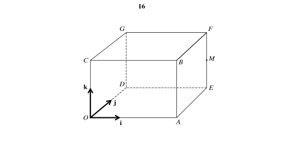{.note-figure fig-alt="Independently extracted vector diagram for 9709/31/O/N/23 Q11"}

Show detailed mark scheme answer

按图 $A=(3,0,0),E=(3,2,0),F=(3,2,2)$，所以

$$
\boxed{M=(3,2,1)}.
$$

$$
\overrightarrow{AP}=(-2,1,2),\quad
\overrightarrow{AM}=(0,2,1),
\quad AP\cdot AM=4,\quad |AP|=3,\quad |AM|=\sqrt5.
$$

因此 $\boxed{\angle PAM=53.4^\circ}$。对 line $OM$ 用 perpendicular-foot condition，得到

$$
d^2=\frac{35}{14}=\frac52,
\qquad \boxed{d=\frac{\sqrt{10}}2}.
$$

<label class="done-toggle"><input type="checkbox" data-progress="vec-q14"> Completed</label>

<strong>Source:</strong> PastPaper/2023/2023/9709_w23_qp_31.pdf, Q11(a–c), matching mark scheme, and independent diagram extraction.

:::

::: {.question-card #vec-q15}
### Question 15 · 9709/32/O/N/23 Q10(a–b)
angle between linesfoot of perpendicular

The equations of the lines $l$ and $m$ are given by
$$
l:\mathbf r=\begin{pmatrix}3\\-2\\1\end{pmatrix}
+\lambda\begin{pmatrix}1\\1\\2\end{pmatrix},
\qquad
m:\mathbf r=\begin{pmatrix}6\\-3\\6\end{pmatrix}
+\mu\begin{pmatrix}-2\\4\\c\end{pmatrix},
$$
where $c$ is a positive constant. It is given that the angle between $l$ and $m$ is $60^\circ$.

(a) Find the value of $c$.

(b) Show that the length of the perpendicular from $(6,-3,6)$ to $l$ is $\sqrt{11}$. **[4+5]**

Show detailed mark scheme answer

$$
\frac{2+2c}{\sqrt6\sqrt{20+c^2}}=\frac12
\Rightarrow 5c^2+16c-52=0.
$$

因 $c>0$，$\boxed{c=2}$。令 $A=(3,-2,1)$、$Q=(6,-3,6)$、$d=(1,1,2)$，则

$$
(Q-A)\cdot d=12,\quad d^2=6
\Rightarrow t=2,\quad F=A+2d=(5,0,5).
$$

故 $|QF|=|(1,-3,1)|=\boxed{\sqrt{11}}$。

<label class="done-toggle"><input type="checkbox" data-progress="vec-q15"> Completed</label>

<strong>Source:</strong> PastPaper/2023/2023/9709_w23_qp_32.pdf, Q10(a–b), and matching mark scheme.

:::

### 2024 Paper 3 applications

::: {.question-card #vec-q16}
### Question 16 · 9709/32/M/J/24 Q8(a–c)
line intersectionequal lengths

The points $A$, $B$ and $C$ have position vectors
$$
\overrightarrow{OA}=-2\mathbf i+\mathbf j+4\mathbf k,\quad
\overrightarrow{OB}=5\mathbf i+2\mathbf j,\quad
\overrightarrow{OC}=8\mathbf i+5\mathbf j-3\mathbf k.
$$
The line $l_1$ passes through $B$ and $C$.

(a) Find a vector equation for $l_1$.

The line $l_2$ has equation
$$
\mathbf r=-2\mathbf i+\mathbf j+4\mathbf k+n(3\mathbf i+\mathbf j-2\mathbf k).
$$

(b) Find the coordinates of the point of intersection of $l_1$ and $l_2$.

(c) The point $D$ on $l_2$ is such that $AB=BD$. Find the position vector of $D$. **[3+4+5]**

Show detailed mark scheme answer

$$
\overrightarrow{BC}=(3,3,-3)=3(1,1,-1),
\quad \boxed{l_1:\mathbf r=(5,2,0)+\lambda(1,1,-1)}.
$$

联立 $l_1,l_2$ 得 $\lambda=2,n=3$，所以 intersection 是 $\boxed{(7,4,-2)}$。

令 $D=(-2,1,4)+n(3,1,-2)$。因 $AB^2=66$：

$$
(-7+3n)^2+(-1+n)^2+(2-2n)^2=66
\Rightarrow 7n^2-26n-6=0.
$$

故

$$
\boxed{n=\frac{13\pm \sqrt{211}}7},
$$

并将这两个值分别代回 $D=(-2+3n,1+n,4-2n)$。

<label class="done-toggle"><input type="checkbox" data-progress="vec-q16"> Completed</label>

<strong>Source:</strong> PastPaper/2024/9709/32/M/J/24, Q8(a–c), and matching mark scheme.

:::

::: {.question-card #vec-q17}
### Question 17 · 9709/32/O/N/24 Q9(a–b)
trapeziumdiagonal intersection

With respect to the origin $O$, the points $A$, $B$ and $C$ have position vectors
$$
\overrightarrow{OA}=\begin{pmatrix}2\\1\\-3\end{pmatrix},\quad
\overrightarrow{OB}=\begin{pmatrix}0\\4\\1\end{pmatrix},\quad
\overrightarrow{OC}=\begin{pmatrix}-3\\-2\\2\end{pmatrix}.
$$
The point $D$ is such that $ABCD$ is a trapezium with $\overrightarrow{DC}=3\overrightarrow{AB}$.

(a) Find the position vector of $D$.

(b) The diagonals of the trapezium intersect at the point $P$. Find the position vector of $P$. **[2+5]**

Show detailed mark scheme answer

$$
\overrightarrow{AB}=(-2,3,4),\qquad
D=C-3\overrightarrow{AB}=(3,-11,-10).
$$

对角线联立：

$$
A+s(C-A)=B+t(D-B).
$$

解得 $s=t=1/4$，故

$$
\boxed{D=(3,-11,-10)},\qquad
\boxed{P=\left(\frac34,\frac14,-\frac74\right)}.
$$

<label class="done-toggle"><input type="checkbox" data-progress="vec-q17"> Completed</label>

<strong>Source:</strong> PastPaper/2024/9709/32/O/N/24, Q9(a–b), and matching mark scheme.

:::

::: {.question-card #vec-q18}
### Question 18 · 9709/31/O/N/24 Q9(a–b)
parallel lineparameter

The position vector of point $A$ relative to the origin $O$ is $8\mathbf i-5\mathbf j+6\mathbf k$. The line $l$ passes through $A$ and is parallel to the vector $2\mathbf i+\mathbf j+4\mathbf k.

(a) State a vector equation for $l$.

(b) The position vector of point $B$ relative to the origin $O$ is $-t\mathbf i+4t\mathbf j+3t\mathbf k$, where $t$ is a constant. The line $l$ also passes through $B$. Find the value of $t$. **[2+3]**

Show detailed mark scheme answer

$$
\boxed{\mathbf r=(8,-5,6)+\lambda(2,1,4)}.
$$

联立 $B=(-t,4t,3t)$：

$$
(8+2\lambda,-5+\lambda,6+4\lambda)=(-t,4t,3t).
$$

前两式给 $\lambda=-3,t=-2$，第三式验证 $-6=3(-2)$。故 $\boxed{t=-2}$。

<label class="done-toggle"><input type="checkbox" data-progress="vec-q18"> Completed</label>

<strong>Source:</strong> PastPaper/2024/9709/31/O/N/24, Q9(a–b), and matching mark scheme.

:::

::: {.question-card #vec-q19}
### Question 19 · 9709/31/M/J/21 Q8(a–b)
angleequal distances

With respect to the origin $O$, the points $A$ and $B$ have position vectors given by
$$
\overrightarrow{OA}=\begin{pmatrix}1\\2\\1\end{pmatrix},\quad
\overrightarrow{OB}=\begin{pmatrix}3\\1\\-2\end{pmatrix}.
$$
The line $l$ has equation
$$
\mathbf r=\begin{pmatrix}2\\3\\1\end{pmatrix}
+\lambda\begin{pmatrix}1\\-2\\1\end{pmatrix}.
$$

(a) Find the acute angle between the directions of $AB$ and $l$.

(b) Find the position vector of the point $P$ on $l$ such that $AP=BP$. **[4+5]**

Show detailed mark scheme answer

$$
\overrightarrow{AB}=(2,-1,-3),\quad d=(1,-2,1),
\quad \overrightarrow{AB}\cdot d=1.
$$

所以

$$
\boxed{\cos\theta=\frac1{\sqrt{84}}},
\qquad \boxed{\theta=83.7^\circ}.
$$

令 $P=(2,3,1)+\lambda d$。由 $AP=BP$，平方并相减：

$$
2P\cdot(B-A)=|B|^2-|A|^2
\Rightarrow \lambda=6.
$$

故 $\boxed{\overrightarrow{OP}=(8,-9,7)}$。

<label class="done-toggle"><input type="checkbox" data-progress="vec-q19"> Completed</label>

<strong>Source:</strong> PastPaper/2021/2021/9709_s21_qp_31.pdf, Q8(a–b), and matching mark scheme.

:::

::: {.question-card #vec-q20}
### Question 20 · 9709/31/M/J/24 Q9(a–d)
perpendicular linesreflection

The equations of two straight lines $l_1$ and $l_2$ are

$$
l_1:\ \mathbf r=\mathbf i-2\mathbf j+3\mathbf k+m(2\mathbf i-\mathbf j+a\mathbf k),
\qquad
l_2:\ \mathbf r=-\mathbf i-\mathbf j-\mathbf k+n(3\mathbf i-2\mathbf j-2\mathbf k),
$$

where $a$ is a constant.

The lines $l_1$ and $l_2$ are perpendicular.

(a) Show that $a=4$.

The lines $l_1$ and $l_2$ also intersect.

(b) Find the position vector of the point of intersection.

The point $A$ has position vector $-5\mathbf i+\mathbf j-9\mathbf k$.

(c) Show that $A$ lies on $l_1$.

The point $B$ is the image of $A$ after a reflection in the line $l_2$.

(d) Find the position vector of $B$. **[1+4+2+2]**

Show detailed mark scheme answer

两条直线的方向向量为 $(2,-1,a)$ 和 $(3,-2,-2)$。垂直条件给出

$$
(2,-1,a)\cdot(3,-2,-2)=6+2-2a=0,
$$

所以 $\boxed{a=4}$。

代入 $a=4$，令两条直线相交：

$$
(1+2m,-2-m,3+4m)=(-1+3n,-1-2n,-1-2n).
$$

解得 $m=-1,n=0$，故交点的 position vector 为

$$
\boxed{-\mathbf i-\mathbf j-\mathbf k}.
$$

当 $m=-3$ 时，

$$
\mathbf i-2\mathbf j+3\mathbf k-3(2\mathbf i-\mathbf j+4\mathbf k)
=-5\mathbf i+\mathbf j-9\mathbf k,
$$

所以 $\boxed{A\text{ lies on }l_1}$。

令 $P=-\mathbf i-\mathbf j-\mathbf k$ 为 $A$ 在 $l_2$ 上的垂足。由于

$$
(A-P)\cdot(3,-2,-2)=(-4,2,-8)\cdot(3,-2,-2)=0,
$$

所以 $P$ 正是垂足，反射点为 $B=2P-A$：

$$
\boxed{\overrightarrow{OB}=3\mathbf i-3\mathbf j+7\mathbf k}.
$$

<label class="done-toggle"><input type="checkbox" data-progress="vec-q20"> Completed</label>

<strong>Source:</strong> `PastPaper/2024/2024/A-Level-CAIE数学QP-202406-Mathematics-P31-A-Level题库大全小程序.pdf`, Q9(a–d), and matching mark scheme.

:::

## Exam checklist

::: {.study-card}

1. 先写 displacement vector，例如 $\overrightarrow{AB}=\mathbf b-\mathbf a$，不要反向。
2. 求 angle between lines 时使用 direction vectors；要求 acute angle 时取 dot product 的 absolute value。
3. 判断 3D lines 是否相交，必须检查三个 coordinate equations。
4. 求 foot of perpendicular 时，先把 foot 写在线上，再用 dot product equal to zero。
5. 题目给 ratio 时确认端点顺序，完成后用 ratio 关系反向检查。
6. Syllabus 不要求 vector product；优先用 scalar product 展开 perpendicular 条件，保证 method marks 清晰。

:::

