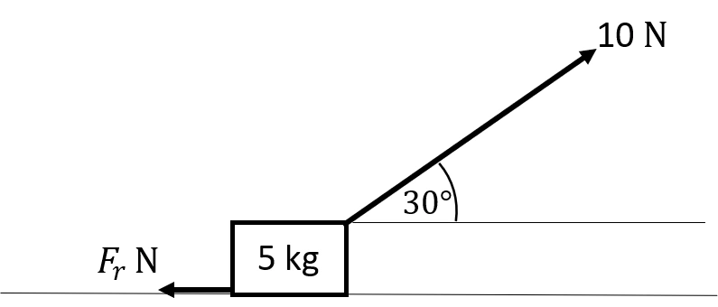
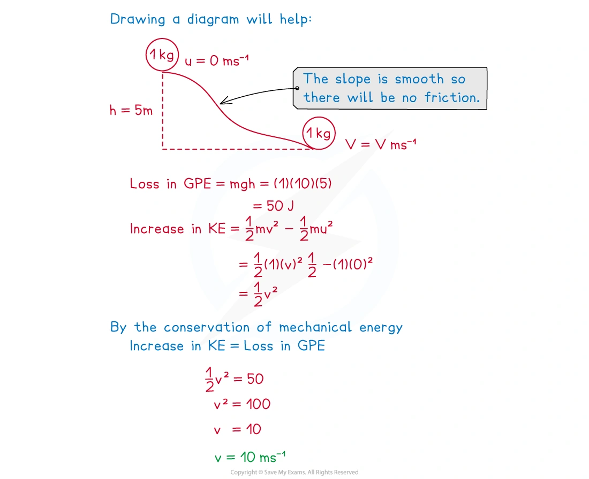
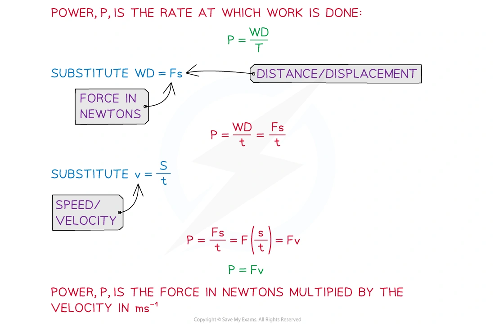
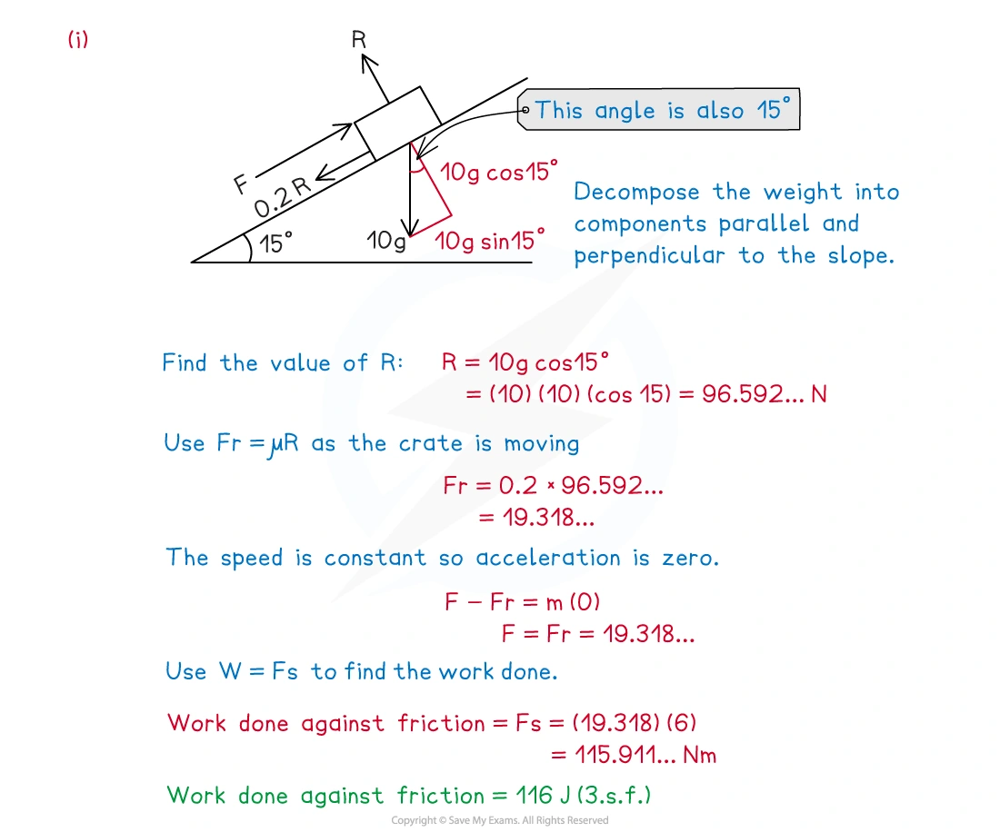
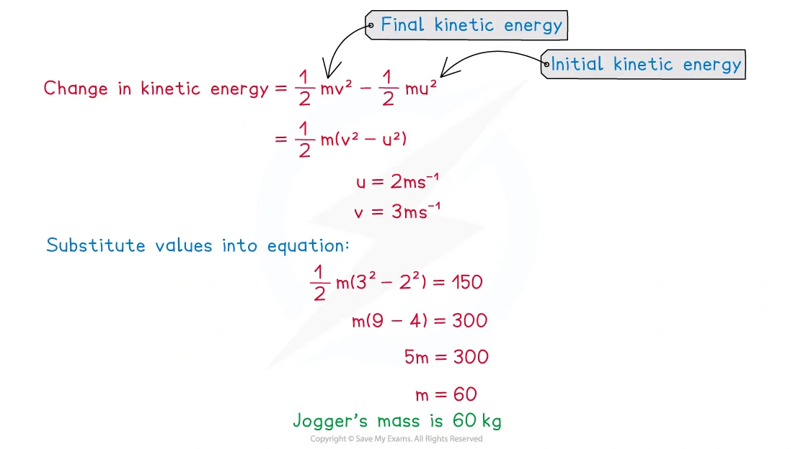
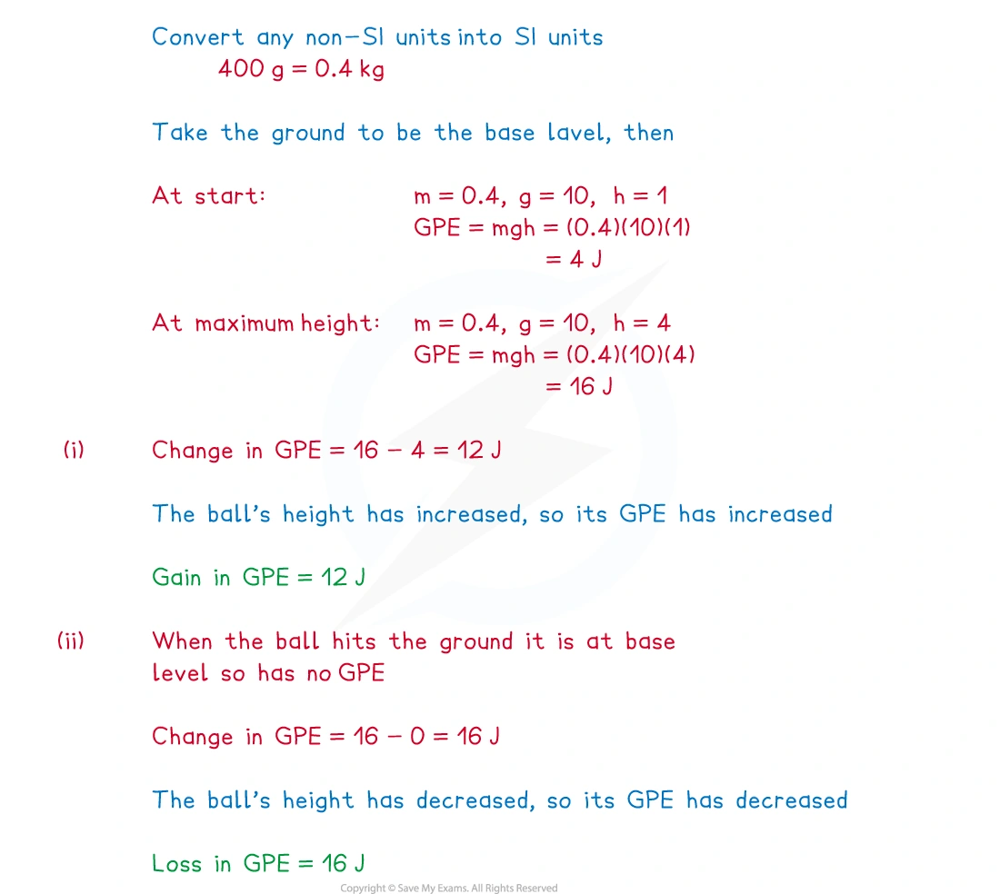
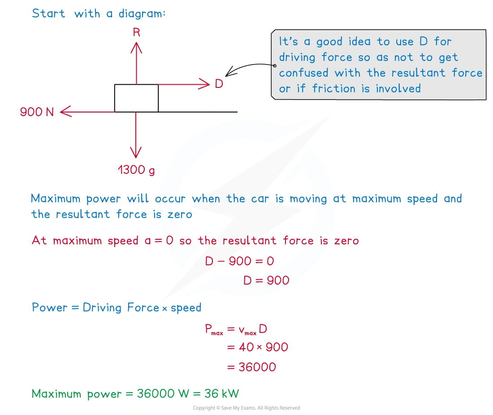

::: {.callout-important}
## 本节考纲要求

本页依据 9709 Mathematics 2026–2027 syllabus 4.5，覆盖：

- use the relation work done $=F s$ when the force and displacement are in the same direction;
- use the relation work done $=F s\cos\theta$ when the force and displacement are at an angle;
- use kinetic energy $\frac12mv^2$ and gravitational potential energy $mgh$;
- use conservation of energy and the work–energy principle;
- use power $P=\dfrac{W}{t}$ and $P=Fv$;
- solve problems involving motion on horizontal and inclined planes, resistance and maximum speed.

题目部分只保留可由本地原始 QP 与对应 mark scheme 核对的完整真题，不改写题目或补造小问。
:::

## Learning objectives

::: {.study-card}

- [ ] 判断 force 与 displacement 的夹角，并正确使用 $W=Fs\cos\theta$
- [ ] 计算 $\mathrm{KE}=\frac12mv^2$、$\mathrm{GPE}=mgh$ 及它们的改变
- [ ] 用 conservation of mechanical energy 处理 smooth plane 和 projectile
- [ ] 用 work–energy principle 处理 driving force、resistance、friction 与斜面
- [ ] 使用 $P=W/t$、$P=Fv$，并判断 maximum speed 时 resultant force 为零

:::

## 1. Core knowledge

### Work done by a force

若大小为 $F$ 的力使物体沿力的方向移动距离 $s$，则

$$
W=Fs.
$$

若力与 displacement 的夹角为 $\theta$，只有沿运动方向的分量做功：

$$
W=Fs\cos\theta.
$$

Work 是 scalar quantity，单位为 joule：$1\,\mathrm J=1\,\mathrm{N\,m}$。垂直于 displacement 的力不做功；resistance/friction 对运动做负功，通常把克服阻力所需的正数写成 “work done against resistance”。

{.note-figure}

在恒速运动中，沿运动方向的 resultant force 为零；因此 driving force 的 work 会平衡 resistance 的 work，并且如果物体上升，还要增加 GPE。

### Kinetic energy and the work–energy principle

质量为 $m$、速度为 $v$ 的 particle 的 kinetic energy 为

$$
\mathrm{KE}=\frac12mv^2.
$$

Resultant work 等于 kinetic energy 的改变：

$$
W_{\rm resultant}=\Delta\mathrm{KE}
=\frac12mv^2-\frac12mu^2.
$$

当有多个外力时，把每个力的 work 带上符号相加。若题目说 “work done against resistance”，这是一个正的能量损失项，在方程右侧作为 loss 扣除。

### Gravitational potential energy

相对于选定的 reference level，高度改变 $h$ 时：

$$
\mathrm{GPE}=mgh.
$$

上升增加 GPE，下降减少 GPE。斜面上沿 line of greatest slope 移动距离 $s$、斜角为 $\theta$ 时，竖直高度改变为 $s\sin\theta$，所以

$$
\Delta\mathrm{GPE}=mg s\sin\theta.
$$

{.note-figure}

### Conservation of mechanical energy

只有 gravity 对 particle 做 work，或其他 external forces 不做 work 时，mechanical energy 守恒：

$$
\mathrm{KE}_1+\mathrm{GPE}_1
=\mathrm{KE}_2+\mathrm{GPE}_2.
$$

在 smooth plane 上没有 friction；在 rough plane 上必须加入 friction work。若有 driving force、resistance 或 air resistance，使用完整能量平衡，不要直接套 mechanical-energy conservation。

### Work–energy principle

更一般地，所有 external forces 的总 work 等于 kinetic energy 的改变：

$$
W_{\rm driving}-W_{\rm resistance}-\Delta\mathrm{GPE}
=\Delta\mathrm{KE}
$$

（这里假设 driving force 沿运动方向，且物体向上运动）。也可以等价地写成

$$
W_{\rm driving}
=\Delta\mathrm{KE}+\Delta\mathrm{GPE}+W_{\rm resistance}.
$$

### Power

Power 是 work done 的 rate：

$$
P=\frac{W}{t}.
$$

当 driving force $F$ 与 velocity $v$ 同方向时：

$$
P=Fv.
$$

单位为 watt：$1\,\mathrm W=1\,\mathrm{J\,s^{-1}}$，$1\,\mathrm{kW}=1000\,\mathrm W$。若 vehicle 以 maximum speed 在水平路面行驶，$a=0$，所以 driving force 等于 resistance；maximum power 可以用 $P_{\max}=F_{\rm resistance}v_{\max}$ 求出。

{.note-figure}

## 2. Note worked examples

每个 Note worked example 单独成卡片，图片只在对应知识点需要时添加，不把多张图堆在同一张卡片中。

::: {.worked-example}
### Worked example 1 · Work against friction on a horizontal surface

A child pulls a box of mass $5\,\mathrm{kg}$ along a rough horizontal surface at a constant speed by a force of magnitude $10\,\mathrm N$ inclined at $30^\circ$ to the horizontal. The only resistance force is friction. Calculate the work done against friction as the child pulls the box $5\,\mathrm m$ along the floor.

Constant speed means zero horizontal resultant force, so

$$
F_r=10\cos30^\circ=5\sqrt3\,\mathrm N.
$$

Therefore

$$
W=F_rs=(5\sqrt3)(5)=\boxed{25\sqrt3\,\mathrm J\approx43.3\,\mathrm J}.
$$

{.note-figure}
:::

::: {.worked-example}
### Worked example 2 · Work on a rough inclined plane

A crate of mass $10\,\mathrm{kg}$ is pushed $6\,\mathrm m$ up a rough ramp inclined at $15^\circ$ to the horizontal by a force $F\,\mathrm N$. The crate moves with constant speed along the line of greatest slope. The coefficient of friction between the crate and the ramp is $0.2$.

The normal reaction is

$$
R=10g\cos15^\circ.
$$

Hence the friction is $0.2R\approx19.318\,\mathrm N$, and

$$
W_{\rm friction}=19.318(6)\approx\boxed{116\,\mathrm J}.
$$

The vertical rise is $6\sin15^\circ$, so

$$
W_{\rm gravity}=mgh=10(10)(6\sin15^\circ)
\approx\boxed{155\,\mathrm J}.
$$

{.note-figure}
:::

::: {.worked-example}
### Worked example 3 · Change in kinetic energy

A jogger increases speed from $2\,\mathrm{m\,s^{-1}}$ to $3\,\mathrm{m\,s^{-1}}$ and her change in kinetic energy is $150\,\mathrm J$. Find the mass of the jogger.

$$
\frac12m(3^2-2^2)=150
\quad\Rightarrow\quad
\frac12m(5)=150,
$$

so

$$
\boxed{m=60\,\mathrm{kg}}.
$$

{.note-figure}
:::

::: {.worked-example}
### Worked example 4 · Gain and loss of GPE

A ball of mass $400\,\mathrm g$ is thrown vertically upwards from a height of $1\,\mathrm m$ above the ground. It reaches a maximum height of $4\,\mathrm m$ before falling to the ground again. Using $g=10\,\mathrm{m\,s^{-2}}$, state clearly whether the change in GPE is a gain or a loss:

(i) between the instant it is thrown and the instant it reaches maximum height;

(ii) between the instant it is thrown and the instant it hits the ground.

Convert $400\,\mathrm g$ to $0.4\,\mathrm{kg}$. For (i),

$$
\Delta\mathrm{GPE}=0.4(10)(4-1)=\boxed{12\,\mathrm J\text{ gain}}.
$$

For (ii), the final height is zero:

$$
\Delta\mathrm{GPE}=0.4(10)(0-1)=-4\,\mathrm J,
$$

so the GPE change is a $\boxed{4\,\mathrm J\text{ loss}}$.

{.note-figure}
:::

::: {.worked-example}
### Worked example 5 · Conservation of mechanical energy

A ball of mass $1\,\mathrm{kg}$ starts from rest and rolls down an uneven smooth slope of varying gradient. At the point when the ball has speed $v\,\mathrm{m\,s^{-1}}$ its vertical height has decreased by $5\,\mathrm m$. Use energy principles to find $v$.

There is no friction, so loss of GPE equals gain of KE:

$$
mg(5)=\frac12mv^2.
$$

With $g=10$,

$$
50=\frac12v^2
\quad\Rightarrow\quad
\boxed{v=10\,\mathrm{m\,s^{-1}}}.
$$

{.note-figure}
:::

::: {.worked-example}
### Worked example 6 · Maximum power

A car of mass $1300\,\mathrm{kg}$, including the driver, moves forwards on a straight horizontal road. There is a constant resistive force of $900\,\mathrm N$ on the car. Its maximum possible speed is $40\,\mathrm{m\,s^{-1}}$. Calculate the maximum power that the engine can produce.

At maximum speed, acceleration is zero, so the driving force is $900\,\mathrm N$. Therefore

$$
P_{\max}=Fv=900(40)=\boxed{36\,000\,\mathrm W=36\,\mathrm{kW}}.
$$

{.note-figure}
:::

## 3. Verified Paper 4 questions

以下 10 张卡均保留完整题干、全部小问和原始分值；答案按对应 mark scheme 的得分步骤展开。

::: {.question-card #p4-energy-q01}
### Question 1 · 9709/41/M/J/24 Q3

A train of mass $180\,000\,\mathrm{kg}$ ascends a straight hill of length $1.5\,\mathrm{km}$, inclined at an angle of $1.5^\circ$ to the horizontal. As it ascends the hill, the total work done to overcome the resistance to motion is $12\,000\,\mathrm{kJ}$ and the speed of the train decreases from $45\,\mathrm{m\,s^{-1}}$ to $40\,\mathrm{m\,s^{-1}}$.

Find the work done by the engine of the train as it ascends the hill, giving your answer in kJ. **[4]**

Show detailed mark scheme answer

The change in kinetic energy is

$$
\Delta\mathrm{KE}=\frac12(180000)(40^2-45^2)
=-38\,250\,\mathrm{kJ}.
$$

The vertical rise is $1500\sin1.5^\circ$, so the gain in GPE is

$$
\Delta\mathrm{GPE}=180000(10)(1500\sin1.5^\circ)
\approx70\,677.8\,\mathrm{kJ}.
$$

Using work–energy,

$$
W_{\rm engine}-12000
=\Delta\mathrm{KE}+\Delta\mathrm{GPE},
$$

therefore

$$
W_{\rm engine}=12000-38250+70677.8
\approx\boxed{44\,400\,\mathrm{kJ}}\quad(3\text{ s.f.}).
$$

<strong>Source:</strong> PastPaper/2024/A-Level-CAIE数学QP-202406-Mathematics-P41-A-Level题库大全小程序.pdf, Q3, with the corresponding 9709/41/M/J/24 mark scheme.

:::

::: {.question-card #p4-energy-q02}
### Question 2 · 9709/42/M/J/24 Q1

A cyclist and bicycle have a total mass of $72\,\mathrm{kg}$. The cyclist rides along a horizontal road against a total resistance force of $28\,\mathrm N$.

Find the total work done by the cyclist to increase his speed from $8\,\mathrm{m\,s^{-1}}$ to $16\,\mathrm{m\,s^{-1}}$ while travelling a distance of $100\,\mathrm m$. **[3]**

Show detailed mark scheme answer

The increase in kinetic energy is

$$
\Delta\mathrm{KE}=\frac12(72)(16^2-8^2)=6912\,\mathrm J.
$$

The work done against resistance is

$$
W_R=28(100)=2800\,\mathrm J.
$$

Hence the cyclist’s total work is

$$
W=\Delta\mathrm{KE}+W_R
=6912+2800
=\boxed{9712\,\mathrm J}.
$$

<strong>Source:</strong> PastPaper/2024/A-Level-CAIE数学QP-202406-Mathematics-P42-A-Level题库大全小程序.pdf, Q1, with the corresponding 9709/42/M/J/24 mark scheme.

:::

::: {.question-card #p4-energy-q03}
### Question 3 · 9709/43/O/N/24 Q1

An athlete has mass $m\,\mathrm{kg}$. The athlete runs along a horizontal road against a constant resistance force of magnitude $24\,\mathrm N$. The total work done by the athlete in increasing his speed from $5\,\mathrm{m\,s^{-1}}$ to $6\,\mathrm{m\,s^{-1}}$ while running a distance of $50\,\mathrm m$ is $1541\,\mathrm J$.

Find the value of $m$. **[4]**

Show detailed mark scheme answer

The work done by the athlete is used to overcome resistance and increase kinetic energy:

$$
1541=24(50)+\frac12m(6^2-5^2).
$$

Thus

$$
1541=1200+\frac12m(11)=1200+5.5m,
$$

so

$$
\boxed{m=62\,\mathrm{kg}}.
$$

<strong>Source:</strong> PastPaper/2024/A-Level-CAIE数学QP-202410-Mathematics-P43-A-Level题库大全小程序.pdf, Q1, with the corresponding 9709/43/O/N/24 mark scheme.

:::

::: {.question-card #p4-energy-q04}
### Question 4 · 9709/42/O/N/24 Q2

A block of mass $20\,\mathrm{kg}$ is held at rest at the top of a plane inclined at $30^\circ$ to the horizontal. The block is projected with speed $5\,\mathrm{m\,s^{-1}}$ down a line of greatest slope of the plane. There is a resistance force acting on the block. As the block moves $2\,\mathrm m$ down the plane from its point of projection, the work done against this resistance force is $50\,\mathrm J$.

Find the speed of the block when it has moved $2\,\mathrm m$ down the plane. **[4]**

Show detailed mark scheme answer

The initial kinetic energy is

$$
\frac12(20)(5^2)=250\,\mathrm J.
$$

The block loses GPE by

$$
20(10)(2\sin30^\circ)=200\,\mathrm J.
$$

Therefore the final kinetic energy is

$$
\frac12(20)v^2=250+200-50=400.
$$

Hence

$$
v^2=40
\quad\Rightarrow\quad
\boxed{v=6.32\,\mathrm{m\,s^{-1}}}.
$$

<strong>Source:</strong> PastPaper/2024/A-Level-CAIE数学QP-202410-Mathematics-P42-A-Level题库大全小程序.pdf, Q2, with the corresponding 9709/42/O/N/24 mark scheme.

:::

::: {.question-card #p4-energy-q05}
### Question 5 · 9709/42/M/J/23 Q4(a–b)

An athlete of mass $84\,\mathrm{kg}$ is running along a straight road.

(a) Initially the road is horizontal and he runs at a constant speed of $3\,\mathrm{m\,s^{-1}}$. The athlete produces a constant power of $60\,\mathrm W$.

Find the resistive force which acts on the athlete. **[1]**

(b) The athlete then runs up a $150\,\mathrm m$ section of the road which is inclined at $0.8\%$ to the horizontal. The speed of the athlete at the start of this section of road is $3\,\mathrm{m\,s^{-1}}$ and he now produces a constant driving force of $24\,\mathrm N$. The total resistive force which acts on the athlete along this section of road has constant magnitude $13\,\mathrm N$.

Use an energy method to find the speed of the athlete at the end of the $150\,\mathrm m$ section of road. **[6]**

Show detailed mark scheme answer

(a) At constant speed, driving force equals resistance:

$$
60=F(3)\quad\Rightarrow\quad \boxed{F=20\,\mathrm N}.
$$

(b) The vertical rise is $150(0.008)=1.2\,\mathrm m$. The driving work is $24(150)=3600\,\mathrm J$, and the resistive work is $13(150)=1950\,\mathrm J$. The GPE increase is

$$
84(10)(1.2)=1008\,\mathrm J.
$$

Thus

$$
\frac12(84)(v^2-3^2)=3600-1950-1008=642.
$$

Therefore

$$
v^2=9+\frac{2(642)}{84}=24.2857,
\qquad
\boxed{v=4.93\,\mathrm{m\,s^{-1}}}.
$$

<strong>Source:</strong> PastPaper/2023/9709_s23_qp_42.pdf, Q4(a–b), with the corresponding 9709/42/M/J/23 mark scheme.

:::

::: {.question-card #p4-energy-q06}
### Question 6 · 9709/41/O/N/23 Q1

A particle of mass $1.6\,\mathrm{kg}$ is projected with a speed of $20\,\mathrm{m\,s^{-1}}$ up a line of greatest slope of a smooth plane inclined at $\theta$ to the horizontal, where $\tan\theta=\frac34$.

Use an energy method to find the distance the particle moves up the plane before coming to instantaneous rest. **[3]**

Show detailed mark scheme answer

From $\tan\theta=3/4$, $\sin\theta=3/5$. The initial kinetic energy is

$$
\frac12(1.6)(20^2)=320\,\mathrm J.
$$

If the distance up the plane is $s$, the gain in GPE is

$$
1.6(10)(s\sin\theta)=1.6(10)s\left(\frac35\right)=9.6s.
$$

At instantaneous rest all the initial KE has become GPE:

$$
9.6s=320
\quad\Rightarrow\quad
\boxed{s=33.3\,\mathrm m}.
$$

<strong>Source:</strong> PastPaper/2023/9709_w23_qp_41.pdf, Q1, with the corresponding 9709/41/O/N/23 mark scheme.

:::

::: {.question-card #p4-energy-q07}
### Question 7 · 9709/43/O/N/23 Q4(a–b)

A car has mass $1600\,\mathrm{kg}$.

(a) The car is moving along a straight horizontal road at a constant speed of $24\,\mathrm{m\,s^{-1}}$ and is subject to a constant resistance of magnitude $480\,\mathrm N$.

Find, in kW, the rate at which the engine of the car is working. **[2]**

The car now moves down a hill inclined at an angle of $\theta$ to the horizontal, where $\sin\theta=0.09$. The engine of the car is working at a constant rate of $12\,\mathrm{kW}$. The speed of the car is $24\,\mathrm{m\,s^{-1}}$ at the top of the hill. Ten seconds later the car has travelled $280\,\mathrm m$ down the hill and has speed $32\,\mathrm{m\,s^{-1}}$.

(b) Given that the resistance is not constant, use an energy method to find the total work done against the resistance during the ten seconds. **[5]**

Show detailed mark scheme answer

(a) Constant speed gives driving force $480\,\mathrm N$, so

$$
P=Fv=480(24)=11520\,\mathrm W
=\boxed{11.5\,\mathrm{kW}}.
$$

(b) Engine work in $10\,\mathrm s$ is $12\times10=120\,\mathrm{kJ}$. The loss of GPE is

$$
1600(10)(280\times0.09)=403.2\,\mathrm{kJ}.
$$

The increase in KE is

$$
\frac12(1600)(32^2-24^2)=358.4\,\mathrm{kJ}.
$$

Thus

$$
120+403.2=358.4+W_R,
$$

so

$$
\boxed{W_R=164.8\,\mathrm{kJ}}.
$$

<strong>Source:</strong> PastPaper/2023/9709_w23_qp_43.pdf, Q4(a–b), with the corresponding 9709/43/O/N/23 mark scheme.

:::

::: {.question-card #p4-energy-q08}
### Question 8 · 9709/42/F/M/22 Q1(a–b)

A crane is used to raise a block of mass $600\,\mathrm{kg}$ vertically upwards at a constant speed through a height of $15\,\mathrm m$. There is a resistance to the motion of the block, which the crane does $10\,000\,\mathrm J$ of work to overcome.

(a) Find the total work done by the crane. **[2]**

(b) Given that the average power exerted by the crane is $12.5\,\mathrm{kW}$, find the total time for which the block is in motion. **[2]**

Show detailed mark scheme answer

(a) At constant speed, the crane supplies the increase in GPE and the resistance loss:

$$
W=600(10)(15)+10000=\boxed{100\,000\,\mathrm J}.
$$

(b)

$$
t=\frac{W}{P}=\frac{100000}{12500}=\boxed{8\,\mathrm s}.
$$

<strong>Source:</strong> PastPaper/2022/9709_m22_qp_42.pdf, Q1(a–b), with the corresponding 9709/42/F/M/22 mark scheme.

:::

::: {.question-card #p4-energy-q09}
### Question 9 · 9709/43/M/J/20 Q5(a–b)

A block $B$ of mass $4\,\mathrm{kg}$ is pushed up a line of greatest slope of a smooth plane inclined at $30^\circ$ to the horizontal by a force applied to $B$, acting in the direction of motion of $B$. The block passes through points $P$ and $Q$ with speeds $12\,\mathrm{m\,s^{-1}}$ and $8\,\mathrm{m\,s^{-1}}$ respectively. $P$ and $Q$ are $10\,\mathrm m$ apart with $P$ below the level of $Q$.

(a) Find the decrease in kinetic energy of the block as it moves from $P$ to $Q$. **[2]**

(b) Hence find the work done by the force pushing the block up the slope as the block moves from $P$ to $Q$. **[3]**

Show detailed mark scheme answer

(a)

$$
\text{decrease in KE}=\frac12(4)(12^2-8^2)=\boxed{160\,\mathrm J}.
$$

(b) The vertical rise is $10\sin30^\circ=5\,\mathrm m$, so the gain in GPE is $4(10)(5)=200\,\mathrm J$. The change in KE is $-160\,\mathrm J$. Therefore, if $W$ is the work done by the pushing force,

$$
W-200=-160
\quad\Rightarrow\quad
\boxed{W=40\,\mathrm J}.
$$

<strong>Source:</strong> PastPaper/2020/9709-s20-qp-43.pdf, Q5(a–b), with the corresponding 9709/43/M/J/20 mark scheme.

:::

::: {.question-card #p4-energy-q10}
### Question 10 · 9709/42/O/N/20 Q2(a–b)

A car of mass $1800\,\mathrm{kg}$ is travelling along a straight horizontal road. The power of the car’s engine is constant. There is a constant resistance to motion of $650\,\mathrm N$.

(a) Find the power of the car’s engine, given that the car’s acceleration is $0.5\,\mathrm{m\,s^{-2}}$ when its speed is $20\,\mathrm{m\,s^{-1}}$. **[3]**

(b) Find the steady speed which the car can maintain with the engine working at this power. **[2]**

Show detailed mark scheme answer

(a) The driving force is

$$
F-650=1800(0.5),
$$

so $F=1550\,\mathrm N$. Hence

$$
P=Fv=1550(20)=\boxed{31\,000\,\mathrm W}=\boxed{31.0\,\mathrm{kW}}.
$$

(b) At steady speed, $a=0$, so the driving force is $650\,\mathrm N$:

$$
650v=31000
\quad\Rightarrow\quad
\boxed{v=47.7\,\mathrm{m\,s^{-1}}}.
$$

<strong>Source:</strong> PastPaper/2020/9709_w20_qp_42.pdf, Q2(a–b), with the corresponding 9709/42/O/N/20 mark scheme.

:::

## Final checklist

::: {.callout-tip}

1. Convert grams, kilometres and kilowatts before substituting.
2. For an inclined plane, calculate the vertical height using $h=s\sin\theta$.
3. Keep resistance as an energy loss and keep the sign of $\Delta\mathrm{KE}$ clear.
4. Use $P=Fv$ only with the force component in the direction of velocity.
5. At steady or maximum speed, check $a=0$ and resultant force $=0$.

:::
