::: {.callout-important}
## 本节考纲要求

本页依据 9709 Mathematics 2026–2027 syllabus 4.1，覆盖：

- identify the forces acting in a given situation，并画出 force diagram；
- 理解 force 的 vector nature，求 components 和 resultants；
- particle in equilibrium 时，所有 force 的 vector sum 为 zero，等价于各方向分量和为 zero；
- 将 contact force 分解为 normal component 与 frictional component；
- smooth contact 模型及其限制；
- limiting friction、limiting equilibrium、coefficient of friction，以及 $F\le\mu R$ 或 $F=\mu R$；
- Newton's third law。

本页严格按考纲 4.1 组织；Newton's laws 的动力学应用留在 Paper 4 后续章节。
:::

## Learning objectives

::: {.study-card}

- [ ] 能为 particle 单独画出完整 force diagram
- [ ] 能沿水平/竖直方向或斜面方向 resolve forces
- [ ] 能用 $\sum F_x=0$、$\sum F_y=0$ 判断和处理 equilibrium
- [ ] 能区分 smooth contact、rough contact、normal reaction、friction 和 resistance
- [ ] 能在 limiting equilibrium 中正确使用 $F=\mu R$
- [ ] 能用 Newton's third law 说明相互作用力的大小、方向和作用对象

:::

## 1. Core knowledge

### Force diagram and standard models

::: {.formula-panel}

对 particle 逐一列出所有外力：

$$
W=mg\quad\text{(weight, vertically downward)}.
$$

接触面产生 normal reaction $R$，方向垂直于接触面。粗糙面还产生 friction $F$，方向反对相对运动或相对运动趋势；光滑面不产生 friction。

light string 的 tension 沿 string、方向 away from the particle；light rigid rod 可以提供 tension 或 thrust；smooth pulley 只改变 string 的方向，理想模型中 string 两侧 tension 相等。

所有数值题取 $g=10\,\mathrm{m\,s^{-2}}$，除非题目另有说明。
:::

::: {.worked-example}
Worked example · Types of force

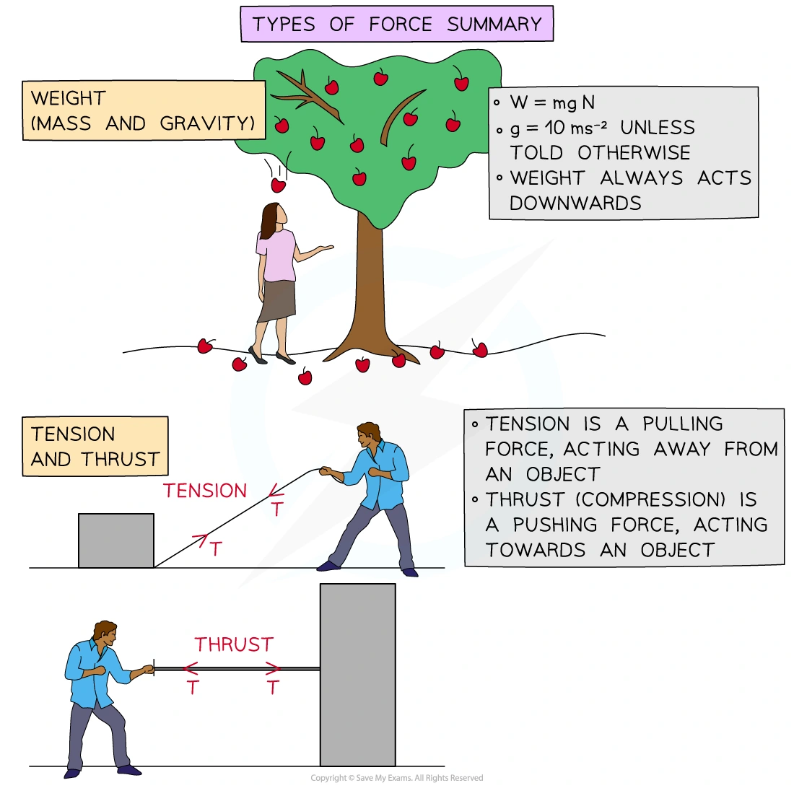{.note-figure fig-alt="Independently extracted Mechanics Toolkit image showing weight, tension and thrust"}
:::

::: {.worked-example}
Worked example · Friction and normal reaction

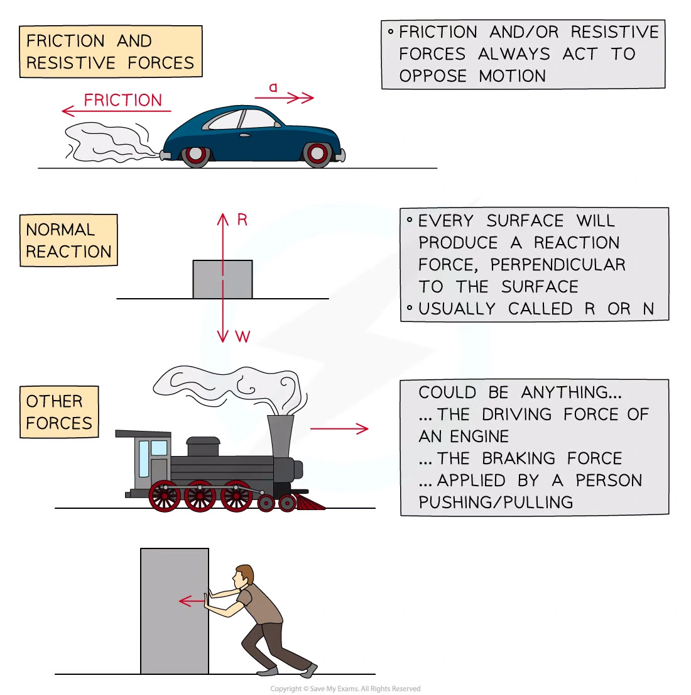{.note-figure fig-alt="Independently extracted Mechanics Toolkit image showing friction, normal reaction and other forces"}
:::

### Components and resultants

If a force $F$ makes angle $\theta$ with the positive horizontal direction, then

$$
F_x=F\cos\theta,\qquad F_y=F\sin\theta.
$$

For equilibrium, resolve in two convenient perpendicular directions:

$$
\sum F_x=0,\qquad \sum F_y=0.
$$

For a resultant with components $X$ and $Y$,

$$
|\mathbf R|=\sqrt{X^2+Y^2},\qquad \tan\alpha=\frac{Y}{X},
$$

with the quadrant checked from the signs of $X$ and $Y$.

::: {.worked-example}
Worked example · Contact force components

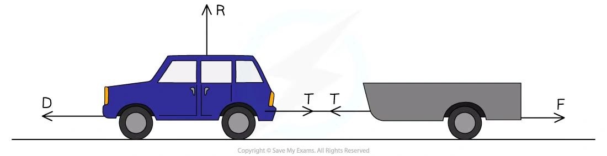{.note-figure fig-alt="Independently extracted Mechanics Toolkit image showing reaction, tension and driving force components"}
:::

### Friction and limiting equilibrium

For a rough contact,

$$
0\le F\le\mu R.
$$

At limiting equilibrium, the particle is just about to move and

$$
F=\mu R.
$$

On an inclined plane at angle $\alpha$, if the applied force has no component perpendicular to the plane,

$$
R=mg\cos\alpha,qquad mg\sin\alpha\text{ acts down the line of greatest slope}.
$$

If a force $P$ is applied at angle $\beta$ above the plane, then its components are $P\cos\beta$ along the plane and $P\sin\beta$ away from the plane:

$$
R=mg\cos\alpha-P\sin\beta.
$$

::: {.worked-example}
Worked example · Modelling assumptions

Two blocks, A and B are attached by means of a light inextensible string running over a smooth pulley. Block A has mass 0.7 kg and is accelerating along a smooth horizontal surface, block B has a mass 0.2 kg. Both A and B are modelled as particles. State how the following modelling assumptions can be used in your calculations:

1. A and B are both particles.
2. The string is light.
3. The string is inextensible.
4. The pulley is smooth.
5. The surface A is moving along is smooth.
:::

### Newton's third law

When two bodies interact, the force exerted by A on B and the force exerted by B on A are equal in magnitude and opposite in direction. They act on different bodies, so they must not be cancelled on one particle's force diagram.

## 2. Verified Paper 4 questions

::: {.question-card #p4-fe-q01}
### Question 1 · 9709/41/M/J/20 Q1

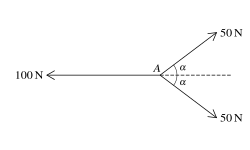{.note-figure fig-alt="Three coplanar forces acting at point A"}

Three coplanar forces of magnitudes $100\,\mathrm N$, $50\,\mathrm N$ and $50\,\mathrm N$ act at a point $A$, as shown in the diagram. The value of $\cos\alpha$ is $\frac45$.

Find the magnitude of the resultant of the three forces and state its direction. **[3]**

Show detailed mark scheme answer

The vertical components of the two $50\,\mathrm N$ forces cancel. Their horizontal resultant is

$$
2(50\cos\alpha)=100\cdot\frac45=80\,\mathrm N
$$

to the right. Combining this with the $100\,\mathrm N$ force to the left gives

$$
R=100-80=20\,\mathrm N.
$$

Therefore the resultant is

$$
\boxed{20\,\mathrm N\text{ to the left}}.
$$

<label class="done-toggle"><input type="checkbox" data-progress="p4-fe-q01"> Completed</label>

<strong>Source:</strong> PastPaper/2020/2020/9709-s20-qp-41.pdf, Q1, and matching 9709-s20-ms-41.pdf. The diagram is an independently extracted SVG; it is not a screenshot.

:::

::: {.question-card #p4-fe-q02}
### Question 2 · 9709/41/M/J/20 Q4(a–b)

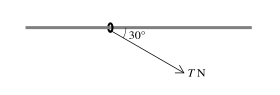{.note-figure fig-alt="Ring on a rough horizontal rod pulled by a force at 30 degrees"}

The diagram shows a ring of mass $0.1\,\mathrm{kg}$ threaded on a fixed horizontal rod. The rod is rough and the coefficient of friction is $0.8$. A force of magnitude $T\,\mathrm N$ acts on the ring at $30^\circ$ to the rod, downwards in the vertical plane containing the rod. Initially the ring is at rest.

(a) Find the greatest value of $T$ for which the ring remains at rest. **[4]**

(b) Find the acceleration of the ring when $T=3$. **[3]**

Show detailed mark scheme answer

(a) The vertical equilibrium gives

$$
R=1+T\sin30^\circ=1+\frac T2.
$$

At the greatest value, friction is limiting:

$$
T\cos30^\circ=0.8R=0.8\left(1+\frac T2\right).
$$

Hence

$$
T=\frac{0.8}{\cos30^\circ-0.4}=1.72\,\mathrm N\quad\text{(3 s.f.)}.
$$

(b) When $T=3$,

$$
R=1+3\sin30^\circ=2.5,\qquad F=0.8R=2.
$$

The resultant horizontal force is $3\cos30^\circ-2=0.598\,\mathrm N$. Therefore

$$
a=\frac{0.598}{0.1}=\boxed{5.98\,\mathrm{m\,s^{-2}}}.
$$

<label class="done-toggle"><input type="checkbox" data-progress="p4-fe-q02"> Completed</label>

<strong>Source:</strong> PastPaper/2020/2020/9709-s20-qp-41.pdf, Q4(a–b), and matching 9709-s20-ms-41.pdf. The diagram is an independently extracted SVG; it is not a screenshot.

:::

::: {.question-card #p4-fe-q03}
### Question 3 · 9709/42/M/J/20 Q2

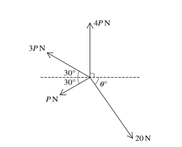{.note-figure fig-alt="Four coplanar forces in equilibrium"}

Coplanar forces of magnitudes $20\,\mathrm N$, $P\,\mathrm N$, $3P\,\mathrm N$ and $4P\,\mathrm N$ act at a point in the directions shown in the diagram. The system is in equilibrium.

Find $P$ and $\theta$. **[6]**

Show detailed mark scheme answer

Resolving horizontally and vertically gives

$$
20\cos\theta=4P\cos30^\circ,
$$

and

$$
4P+3P\sin30^\circ-P\sin30^\circ=20\sin\theta.
$$

The second equation simplifies to $5P=20\sin\theta$, so $P=4\sin\theta$. Substitution in the first equation gives

$$
\tan\theta=\frac5{4\sqrt3}.
$$

Therefore

$$
\boxed{\theta=35.8^\circ,\qquad P=2.34\,\mathrm N}\quad\text{(3 s.f.).}
$$

<label class="done-toggle"><input type="checkbox" data-progress="p4-fe-q03"> Completed</label>

<strong>Source:</strong> PastPaper/2020/2020/9709-s20-qp-42.pdf, Q2, and matching 9709-s20-ms-42.pdf. The diagram is an independently extracted SVG; it is not a screenshot.

:::

::: {.question-card #p4-fe-q04}
### Question 4 · 9709/42/M/J/20 Q3

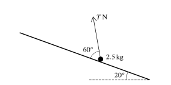{.note-figure fig-alt="Particle on a rough plane with an angled force"}

A particle of mass $2.5\,\mathrm{kg}$ is held in equilibrium on a rough plane inclined at $20^\circ$ to the horizontal by a force of magnitude $T\,\mathrm N$ making an angle of $60^\circ$ with a line of greatest slope of the plane. The coefficient of friction between the particle and the plane is $0.3$.

Find the greatest and least possible values of $T$. **[8]**

Show detailed mark scheme answer

Resolve perpendicular to the plane:

$$
R=25\cos20^\circ-T\sin60^\circ.
$$

For the greatest $T$, friction acts down the plane:

$$
T\cos60^\circ=25\sin20^\circ+0.3R.
$$

This gives

$$
\boxed{T=20.5\,\mathrm N}\quad\text{(3 s.f.).}
$$

For the least $T$, friction acts up the plane:

$$
T\cos60^\circ+0.3R=25\sin20^\circ,
$$

giving

$$
\boxed{T=6.26\,\mathrm N}\quad\text{(3 s.f.).}
$$

<label class="done-toggle"><input type="checkbox" data-progress="p4-fe-q04"> Completed</label>

<strong>Source:</strong> PastPaper/2020/2020/9709-s20-qp-42.pdf, Q3, and matching 9709-s20-ms-42.pdf. The diagram is an independently extracted SVG; it is not a screenshot.

:::

::: {.question-card #p4-fe-q05}
### Question 5 · 9709/43/O/N/20 Q3(a–b)

A string is attached to a block of mass $4\,\mathrm{kg}$ which rests in limiting equilibrium on a rough horizontal table. The string makes an angle of $24^\circ$ above the horizontal and the tension in the string is $30\,\mathrm N$.

(a) Draw a diagram showing all the forces acting on the block. **[1]**

(b) Find the coefficient of friction between the block and the table. **[5]**

Show detailed mark scheme answer

(a) The force diagram contains weight $40\,\mathrm N$ downward, reaction $R$ upward, tension $30\,\mathrm N$ at $24^\circ$ above the horizontal, and limiting friction opposing the horizontal component of the tension.

(b) Vertical equilibrium gives

$$
R+30\sin24^\circ=40
\Longrightarrow R=27.8\,\mathrm N.
$$

At limiting equilibrium,

$$
\mu R=30\cos24^\circ.
$$

Therefore

$$
\boxed{\mu=\frac{30\cos24^\circ}{40-30\sin24^\circ}=0.985}\quad\text{(3 s.f.).}
$$

<label class="done-toggle"><input type="checkbox" data-progress="p4-fe-q05"> Completed</label>

<strong>Source:</strong> PastPaper/2020/2020/9709_w20_qp_43.pdf, Q3(a–b), and matching 9709_w20_ms_43.pdf.

:::

::: {.question-card #p4-fe-q06}
### Question 6 · 9709/42/O/N/20 Q3

A block of mass $m\,\mathrm{kg}$ is held in equilibrium below a horizontal ceiling by two strings. One string is inclined at $45^\circ$ to the horizontal and has tension $T\,\mathrm N$. The other string is inclined at $60^\circ$ to the horizontal and has tension $20\,\mathrm N$.

Find $T$ and $m$. **[5]**

Show detailed mark scheme answer

Horizontal equilibrium gives

$$
T\cos45^\circ=20\cos60^\circ
\Longrightarrow T=10\sqrt2\,\mathrm N.
$$

Vertical equilibrium gives

$$
T\sin45^\circ+20\sin60^\circ=10m.
$$

Hence

$$
\boxed{T=14.1\,\mathrm N,\qquad m=2.73\,\mathrm{kg}}\quad\text{(3 s.f.).}
$$

<label class="done-toggle"><input type="checkbox" data-progress="p4-fe-q06"> Completed</label>

<strong>Source:</strong> PastPaper/2020/2020/9709_w20_qp_42.pdf, Q3, and matching 9709_w20_ms_42.pdf.

:::

::: {.question-card #p4-fe-q07}
### Question 7 · 9709/41/O/N/21 Q4(a–b)

A particle of mass $12\,\mathrm{kg}$ is stationary on a rough plane inclined at $25^\circ$ to the horizontal. A force of magnitude $P\,\mathrm N$ acting parallel to a line of greatest slope is used to prevent the particle sliding down the plane. The coefficient of friction is $0.35$.

(a) Draw a sketch showing the forces acting on the particle. **[1]**

(b) Find the least possible value of $P$. **[5]**

Show detailed mark scheme answer

(a) The force diagram has weight $120\,\mathrm N$ vertically downward, reaction $R$ perpendicular to the plane, $P$ up the plane, and friction up the plane at the limiting case for the least $P$.

(b) Since $P$ has no perpendicular component,

$$
R=120\cos25^\circ.
$$

At the least value, friction is limiting and acts up the plane:

$$
P+0.35R=120\sin25^\circ.
$$

Therefore

$$
\boxed{P=120\sin25^\circ-0.35(120\cos25^\circ)=12.6\,\mathrm N}.
$$

<label class="done-toggle"><input type="checkbox" data-progress="p4-fe-q07"> Completed</label>

<strong>Source:</strong> PastPaper/2021/2021/9709_w21_qp_41.pdf, Q4(a–b), and matching 9709_w21_ms_41.pdf.

:::

::: {.question-card #p4-fe-q08}
### Question 8 · 9709/41/O/N/23 Q2

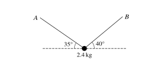{.note-figure fig-alt="Particle held in equilibrium by two strings at 35 and 40 degrees"}

A particle of mass $2.4\,\mathrm{kg}$ is held in equilibrium by two light inextensible strings, one attached to $A$ and the other to $B$. The strings make angles of $35^\circ$ and $40^\circ$ with the horizontal.

Find the tension in each string. **[5]**

Show detailed mark scheme answer

Let $T_A$ be the tension in the string at $35^\circ$ and $T_B$ the tension in the string at $40^\circ$.

$$
T_A\cos35^\circ=T_B\cos40^\circ,
$$

$$
T_A\sin35^\circ+T_B\sin40^\circ=24.
$$

Solving these simultaneous equations gives

$$
T_A=19.0336\ldots,\qquad T_B=20.3532\ldots
$$

Therefore

$$
\boxed{T_A=19.0\,\mathrm N,\qquad T_B=20.4\,\mathrm N}\quad\text{(3 s.f.).}
$$

<label class="done-toggle"><input type="checkbox" data-progress="p4-fe-q08"> Completed</label>

<strong>Source:</strong> PastPaper/2023/2023/9709_w23_qp_41.pdf, Q2. The answer has been checked from the displayed force diagram and simultaneous equilibrium equations; the diagram is an independently extracted SVG, not a screenshot.

:::

::: {.question-card #p4-fe-q09}
### Question 9 · 9709/42/F/M/23 Q5(a)

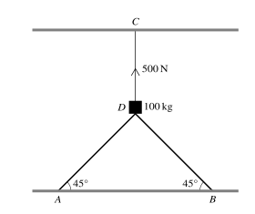{.note-figure fig-alt="Block supported by two sloping struts and a vertical rope"}

The diagram shows a block $D$ of mass $100\,\mathrm{kg}$ supported by two sloping struts $AD$ and $BD$, each attached at $45^\circ$ to fixed points on a horizontal floor. The block is also held in place by a vertical rope $CD$. The tension in $CD$ is $500\,\mathrm N$ and the block rests in equilibrium.

(a) Find the magnitude of the force in each of the struts $AD$ and $BD$. **[3]**

Show detailed mark scheme answer

The weight is $1000\,\mathrm N$ downward and the rope provides $500\,\mathrm N$ upward, so the two struts provide a total upward component of $500\,\mathrm N$.

By symmetry, if the force in each strut is $S$,

$$
2S\sin45^\circ=500.
$$

Hence

$$
\boxed{S=353.6\,\mathrm N}\quad\text{(3 s.f.).}
$$

<label class="done-toggle"><input type="checkbox" data-progress="p4-fe-q09"> Completed</label>

<strong>Source:</strong> PastPaper/2023/2023/9709_m23_qp_42.pdf, Q5(a), and matching 9709_m23_ms_42.pdf. The diagram is an independently extracted SVG; it is not a screenshot.

:::

::: {.question-card #p4-fe-q10}
### Question 10 · 9709/43/O/N/23 Q3(a–c)

A block of mass $8\,\mathrm{kg}$ slides down a rough plane inclined at $30^\circ$ to the horizontal, starting from rest. The coefficient of friction between the block and the plane is $\mu$. The block accelerates uniformly down the plane at $2.4\,\mathrm{m\,s^{-2}}$.

(a) Draw a diagram showing the forces acting on the block. **[1]**

(b) Find the value of $\mu$. **[4]**

(c) Find the speed of the block after it has moved $3\,\mathrm m$ down the plane. **[1]**

Show detailed mark scheme answer

(a) The forces are weight $80\,\mathrm N$ downwards, normal reaction perpendicular to the plane, and friction up the plane.

(b) Resolving down the plane,

$$
80\sin30^\circ-\mu(80\cos30^\circ)=8(2.4).
$$

Thus

$$
\mu=\frac{40-19.2}{80\cos30^\circ}=\boxed{0.300}\quad\text{(3 s.f.).}
$$

(c) Using $v^2=u^2+2as$,

$$
v^2=2(2.4)(3)=14.4,
$$

so $\boxed{v=3.79\,\mathrm{m\,s^{-1}}}$.

<label class="done-toggle"><input type="checkbox" data-progress="p4-fe-q10"> Completed</label>

<strong>Source:</strong> PastPaper/2023/2023/9709_w23_qp_43.pdf, Q3(a–c), and matching 9709_w23_ms_43.pdf.

:::

::: {.question-card #p4-fe-q11}
### Question 11 · 9709/41/M/J/24 Q2(a–b)

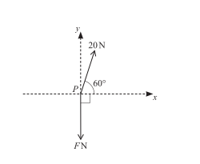{.note-figure fig-alt="Two forces at a point with a resultant condition"}

Two forces of magnitudes $20\,\mathrm N$ and $F\,\mathrm N$ act at a point $P$ in the directions shown in the diagram.

(a) Given that the resultant force has no component in the $y$-direction, calculate $F$. **[2]**

(b) Given instead that $F=10$, find the magnitude and direction of the resultant force. **[5]**

Show detailed mark scheme answer

(a) The $20\,\mathrm N$ force has downward component $20\sin60^\circ$, while the other force has upward component $F$. Therefore

$$
F=20\sin60^\circ=\boxed{10\sqrt3\,\mathrm N}.
$$

(b) When $F=10$, the components of the resultant are

$$
R_x=20\cos60^\circ=10,\qquad R_y=10-20\sin60^\circ=10-10\sqrt3.
$$

Hence

$$
|R|=\sqrt{10^2+(10-10\sqrt3)^2}=\boxed{10.7\,\mathrm N}.
$$

The direction is below the positive $x$-axis, with

$$
\tan\phi=\frac{10\sqrt3-10}{10}=\sqrt3-1,
$$

so $\boxed{\phi=36.2^\circ\text{ below the positive }x\text{-axis}}$.

<label class="done-toggle"><input type="checkbox" data-progress="p4-fe-q11"> Completed</label>

<strong>Source:</strong> `PastPaper/2024/2024/A-Level-CAIE数学QP-202406-Mathematics-P41-A-Level题库大全小程序.pdf`, Q2(a–b), and matching mark scheme. The diagram is an independently extracted SVG; it is not a screenshot.

:::

::: {.question-card #p4-fe-q12}
### Question 12 · 9709/43/O/N/23 Q5(a–b)

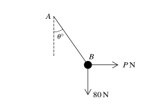{.note-figure fig-alt="Particle of weight 80 N held by a string and a horizontal force"}

A light string $AB$ is fixed at $A$ and has a particle of weight $80\,\mathrm N$ attached at $B$. A horizontal force of magnitude $P\,\mathrm N$ is applied at $B$ so that the string makes an angle $\theta$ with the vertical.

(a) It is given that $P=32$ and the system is in equilibrium. Find the tension in the string and the value of $\theta$. **[4]**

(b) It is given instead that the tension in the string is $120\,\mathrm N$ and that the particle still has weight $80\,\mathrm N$. Find $P$ and $\theta$. **[4]**

Show detailed mark scheme answer

(a)

$$
T\cos\theta=80,\qquad T\sin\theta=32.
$$

Therefore

$$
\boxed{T=16\sqrt{29}=86.1\,\mathrm N,\qquad \theta=21.8^\circ}.
$$

(b)

$$
P^2+80^2=120^2,
$$

so

$$
\boxed{P=40\sqrt5=89.4\,\mathrm N}.
$$

Also $\cos\theta=80/120=2/3$, giving

$$
\boxed{\theta=48.2^\circ}.
$$

<label class="done-toggle"><input type="checkbox" data-progress="p4-fe-q12"> Completed</label>

<strong>Source:</strong> PastPaper/2023/2023/9709_w23_qp_43.pdf, Q5(a–b), and matching 9709_w23_ms_43.pdf. The diagram is an independently extracted SVG; it is not a screenshot.

:::

## 3. Quick checklist

::: {.study-card}

- [ ] Force diagram contains every force and no force belonging to another particle
- [ ] Smooth contact means no friction; rough contact requires a friction direction
- [ ] In limiting equilibrium use $F=\mu R$, not $F=\mu mg$ automatically
- [ ] Resolve perpendicular to the plane before using $F=\mu R$
- [ ] Check the sign and quadrant of a resultant direction
- [ ] Newton's third-law forces act on different bodies

:::
