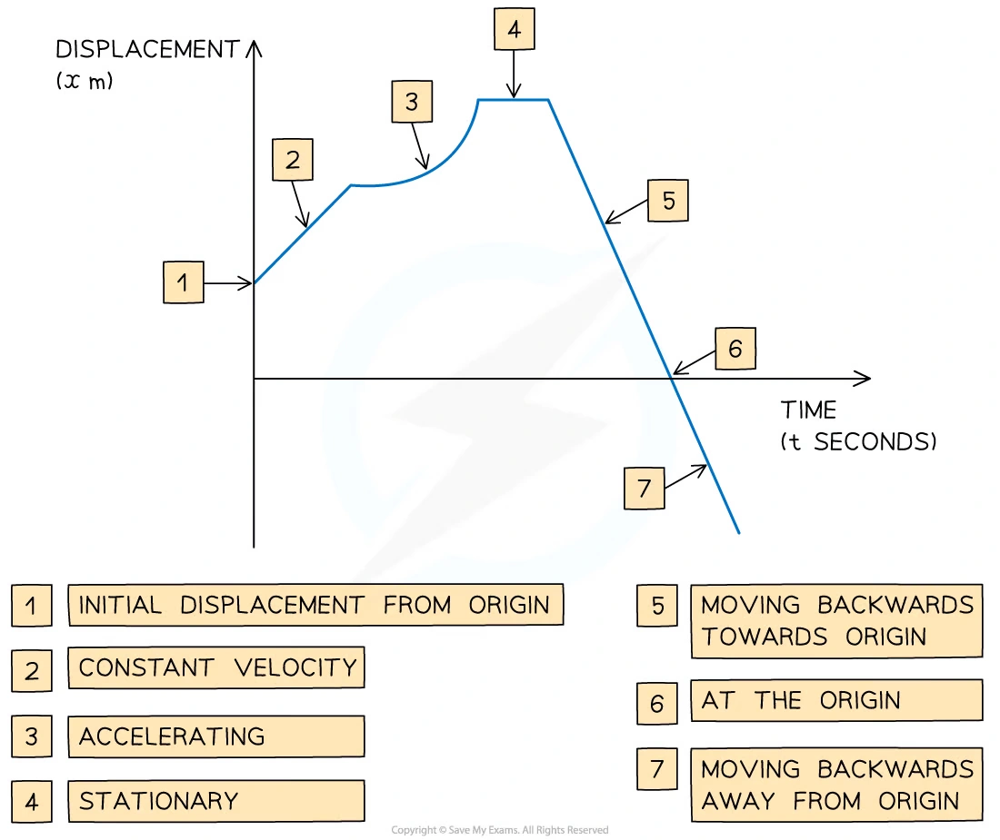
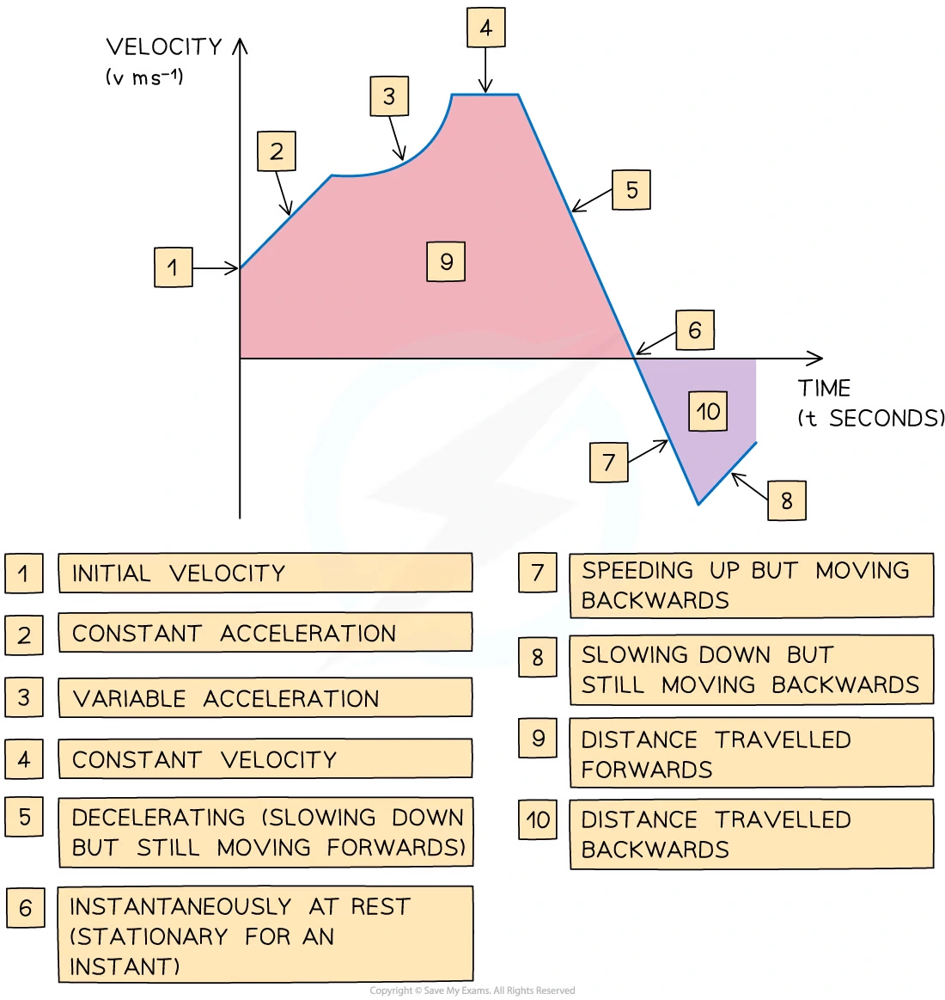
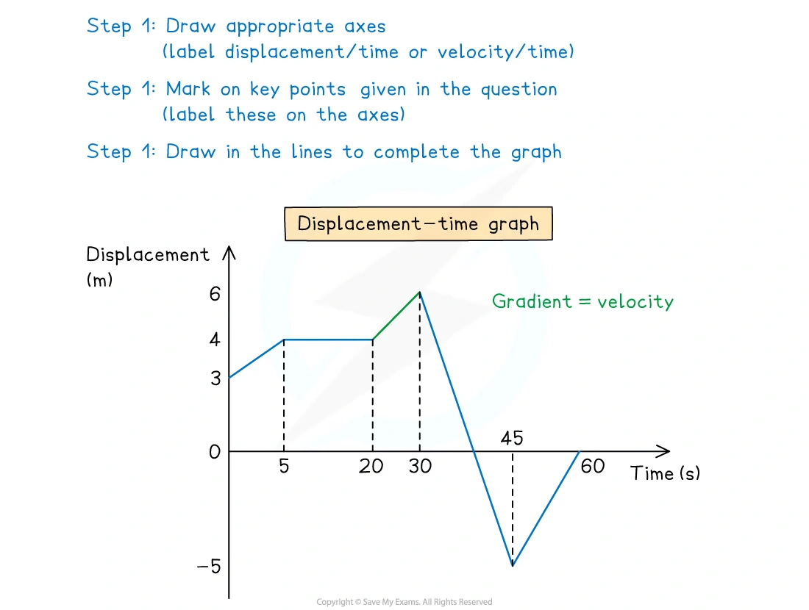
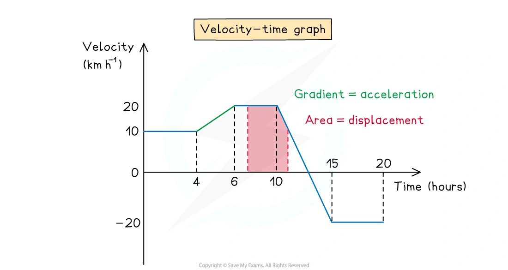
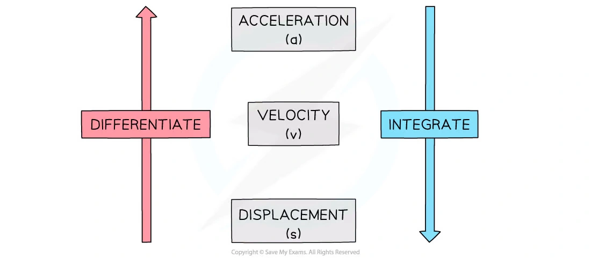
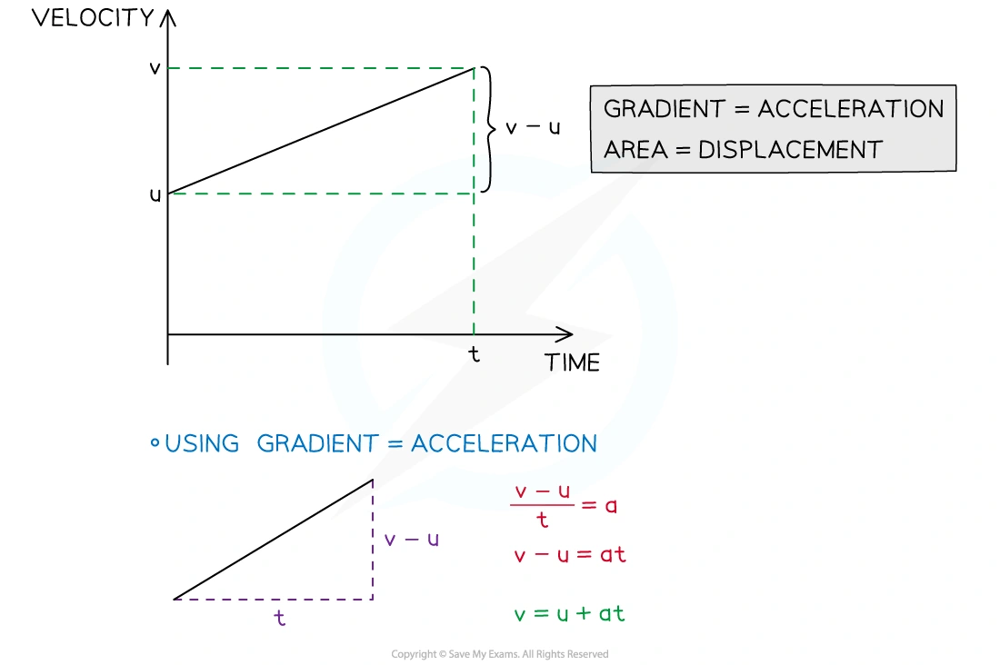
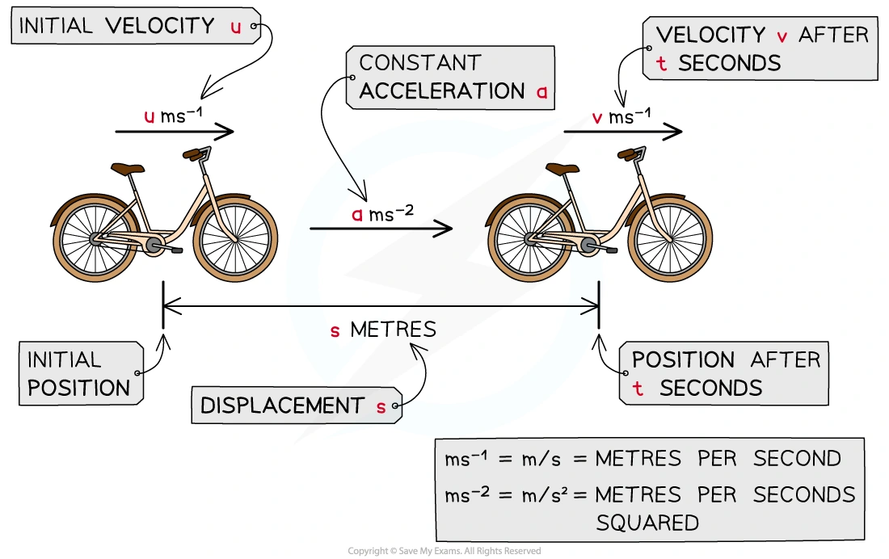
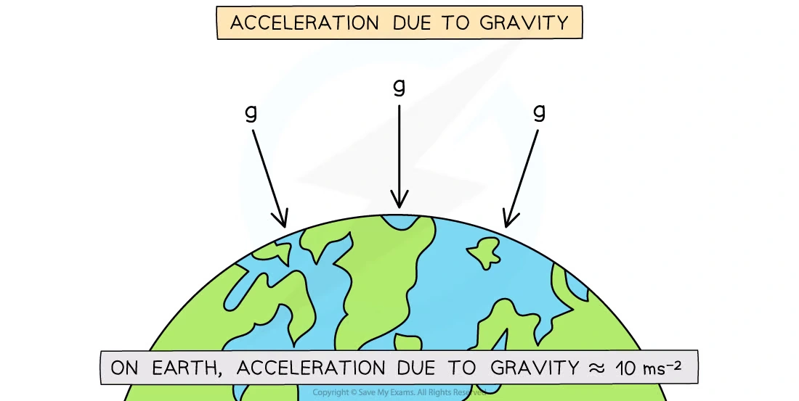
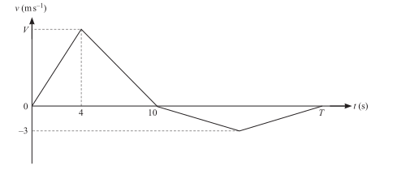
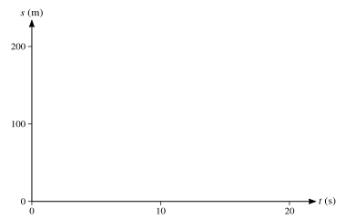

::: {.callout-important}
## 本节考纲要求

本页依据 9709 Mathematics 2026–2027 syllabus 4.2，覆盖：

- distance、speed、displacement、velocity、acceleration 的 scalar/vector nature；
- sketch and interpret displacement-time graphs and velocity-time graphs；
- displacement-time graph 的 gradient 是 velocity，velocity-time graph 的 gradient 是 acceleration；
- velocity-time graph 下的 area 是 displacement；
- 对 time 使用 differentiation 和 integration；
- 使用 constant-acceleration formulae 处理一维直线运动；
- 只讨论 motion in one dimension，所有数值题默认 $g=10\,\mathrm{m\,s^{-2}}$，除非题目另有说明。
:::

## Learning objectives

::: {.study-card}

- [ ] 能区分 distance/speed 与 displacement/velocity
- [ ] 能从 displacement-time graph 读出 velocity，从 velocity-time graph 读出 acceleration 和 displacement
- [ ] 能用 $v=ds/dt$、$a=dv/dt$、$v=\int a\,dt$、$s=\int v\,dt$
- [ ] 能正确使用五个 constant-acceleration formulae，并先确定 positive direction
- [ ] 能处理分段运动、instantaneous rest、distance travelled 与 displacement 的区别
- [ ] 能处理竖直投射、gravity、maximum height 和 return to the ground

:::

## 1. Core knowledge

### Scalars, vectors and the three motion functions

Distance and speed are scalar quantities. Displacement, velocity and acceleration are vector quantities; in one-dimensional questions this means their signs depend on the chosen positive direction.

$$
v=\frac{ds}{dt},\qquad a=\frac{dv}{dt}=\frac{d^2s}{dt^2}.
$$

Average speed uses total distance, while average velocity uses displacement:

$$
\text{average speed}=\frac{\text{total distance travelled}}{\text{time taken}},
\qquad
\text{average velocity}=\frac{\text{displacement}}{\text{time taken}}.
$$

::: {.worked-example}
Note knowledge image · Displacement-time graph

{.note-figure fig-alt="Displacement-time graph features extracted from the Mechanics note"}
:::

### Displacement-time and velocity-time graphs

- Gradient of a displacement-time graph gives velocity.
- Gradient of a velocity-time graph gives acceleration.
- The signed area under a velocity-time graph gives displacement.
- Total distance is obtained by adding the magnitudes of the areas, including regions below the time axis.
- A horizontal displacement-time graph means instantaneous rest; a horizontal velocity-time graph means constant velocity.

::: {.worked-example}
Note worked example · Displacement-time graph

An athlete is training by jogging in a straight line. The displacement-time graph below shows the displacement of the athlete from her starting point throughout her motion.

The note asks:

(a) Calculate the velocity of the athlete during the first 2 seconds.

(b) Describe the motion of the athlete between the times of 2 seconds and 5 seconds.

(c) Calculate the velocity of the athlete at 10 seconds.

(d) Find the total distance travelled by the athlete during the 14 seconds.

Use the gradient for (a) and (c), the horizontal section for (b), and add the forward and backward distances for (d).
:::

::: {.worked-example}
Note worked example · Velocity-time graph

The motion of a bird travelling in a straight line is tracked for 60 seconds. The velocity-time graph in the note asks:

(a) Calculate the acceleration of the bird at 20 seconds.

(b) Calculate the distance travelled in the first 28 seconds.

(c) Calculate the displacement of the bird from its starting point after 60 seconds.

The worked solution uses the gradient for (a), the area above the axis for the forward distance in (b), and signed areas above and below the axis for (c).
:::

::: {.worked-example}
Note knowledge image · Velocity-time graph

{.note-figure fig-alt="Velocity-time graph features extracted from the Mechanics note"}
:::

::: {.worked-example}
Note knowledge image · Drawing travel graphs

{.note-figure fig-alt="Displacement-time graph drawing guidance extracted from the Mechanics note"}
:::

::: {.worked-example}
Note knowledge image · Signed areas on a velocity-time graph

{.note-figure fig-alt="Velocity-time graph areas and directions extracted from the Mechanics note"}
:::

### Differentiation and integration with respect to time

For a function of time,

$$
v=\frac{ds}{dt},\qquad a=\frac{dv}{dt},
$$

and therefore

$$
v=\int a\,dt,\qquad s=\int v\,dt.
$$

Each integration needs a constant of integration. Use phrases such as “starting from rest” ($v=0$ at the stated time) and “returns to its starting point” ($s=0$ at the stated time) to determine it.

::: {.worked-example}
Note worked example · Using calculus in 1D

The velocity of a particle is modelled by

$$
v=t^3-4t^2+3t.
$$

(a) Find the acceleration of the particle in terms of $t$.

(b) Find the displacement of the particle, from its starting position, after 3 seconds.

The corresponding graph and solution are kept as a separate worked-example card; differentiate for (a), integrate for (b), and use $s=0$ at $t=0$.
:::

::: {.worked-example}
Note knowledge image · Calculus links

{.note-figure fig-alt="Differentiation and integration links between displacement, velocity and acceleration"}
:::

### Constant acceleration

For constant acceleration, with $s$ measured from the chosen starting point,

$$
v=u+at,
$$
$$
v^2=u^2+2as,
$$
$$
s=\frac12(u+v)t,
$$
$$
s=ut+\frac12at^2,
$$
$$
s=vt-\frac12at^2.
$$

Choose the equation after listing the known and unknown quantities. The formulae apply only on an interval where the acceleration is constant. For multi-stage motion, restart the variables or carry the final velocity and displacement into the next stage.

::: {.worked-example}
Note worked example · Deriving a constant-acceleration formula

Use the constant-acceleration equations

$$
s=\frac12(u+v)t\qquad\text{and}\qquad v=u+at
$$

to show that

$$
v^2=u^2+2as.
$$

Substitute $t=(v-u)/a$ into the displacement equation and rearrange.
:::

::: {.worked-example}
Note knowledge image · SUVAT derivation

{.note-figure fig-alt="Velocity-time graph derivation of constant-acceleration formulae"}
:::

::: {.worked-example}
Note knowledge image · SUVAT quantities

{.note-figure fig-alt="SUVAT quantities and constant-acceleration notation extracted from the Mechanics note"}
:::

### Vertical motion and gravity

Take the chosen positive direction explicitly. If upwards is positive, then $a=-g$; if downwards is positive, then $a=g$. At maximum height, $v=0$ instantaneously. When a particle returns to its starting point, its displacement from that starting point is $s=0$, not necessarily its velocity.

::: {.worked-example}
Note worked example · Vertical projection

A toy rocket is projected vertically upwards from ground level with initial speed $18\,\mathrm{m\,s^{-1}}$.

(a) Find the maximum height the toy rocket reaches.

(b) Find the time taken from the instant the toy rocket is projected to the instant it returns to the ground.

Use upwards as positive, $a=-10\,\mathrm{m\,s^{-2}}$, $v=0$ at maximum height, and $s=0$ when it returns to the starting point.
:::

::: {.worked-example}
Note knowledge image · Gravity motion

{.note-figure fig-alt="Gravity and one-dimensional vertical motion extracted from the Mechanics note"}
:::

## 2. Verified Paper 4 questions

Each card below keeps the complete selected question, including every sub-question and its original mark allocation. The wording is transcribed from the local question paper; it is not an invented practice question.

::: {.question-card #p4-kin-q01}
### Question 1 · 9709/41/M/J/24 Q1(a–b)

A car starts from rest and accelerates at $2\,\mathrm{m\,s^{-2}}$ for $10\,\mathrm s$. It then travels at a constant speed for $30\,\mathrm s$. The car then uniformly decelerates to rest over a period of $20\,\mathrm s$.

(a) Sketch a velocity-time graph for the motion of the car. **[2]**

(b) Find the total distance travelled by the car. **[2]**

Show detailed mark scheme answer

After 10 s the speed is

$$
V=0+2(10)=20\,\mathrm{m\,s^{-1}}.
$$

The graph consists of a triangle, a rectangle and a triangle. Hence

$$
s=\frac12(10)(20)+(30)(20)+\frac12(20)(20)
=100+600+200.
$$

Therefore

$$
\boxed{s=900\,\mathrm m}.
$$

<strong>Source:</strong> PastPaper/2024/2024/A-Level-CAIE数学QP-202406-Mathematics-P41-A-Level题库大全小程序.pdf, Q1, and matching 2024 M/J/41 mark scheme.

:::

::: {.question-card #p4-kin-q02}
### Question 2 · 9709/41/M/J/24 Q6(a–b)

A particle moves in a straight line, starting from a point $O$. The velocity of the particle at time $t\,\mathrm s$ after leaving $O$ is $v\,\mathrm{m\,s^{-1}}$. It is given that

$$
v=kt^{1/2}-2t-8,
$$

where $k$ is a positive constant. The maximum velocity of the particle is $4.5\,\mathrm{m\,s^{-1}}$.

(a) Show that $k=10$. **[5]**

(b) (i) Verify that $v=0$ when $t=1$ and $t=16$. **[1]**

(ii) Find the distance travelled by the particle in the first $16\,\mathrm s$. **[5]**

Show detailed mark scheme answer

$$
a=\frac{dv}{dt}=\frac{k}{2\sqrt t}-2.
$$

At maximum velocity, $a=0$, so $\sqrt t=k/4$. Substitution into $v=4.5$ gives

$$
\frac{k^2}{8}-8=4.5\quad\Rightarrow\quad k=10.
$$

With $k=10$,

$$
v=10\sqrt t-2t-8.
$$

Putting $x=\sqrt t$ gives $2x^2-10x+8=0$, so $x=1$ or $4$, hence $t=1$ or $16$.

An antiderivative is

$$
s=\frac{20}{3}t^{3/2}-t^2-8t.
$$

The velocity is negative on $0<t<1$ and positive on $1<t<16$. Therefore

$$
\text{distance}=-s(1)+[s(16)-s(1)]
=\frac{22}{3}+50
=\boxed{57.3\,\mathrm m}\quad\text{(3 s.f.)}.
$$

<strong>Source:</strong> PastPaper/2024/2024/A-Level-CAIE数学QP-202406-Mathematics-P41-A-Level题库大全小程序.pdf, Q6(a–b), and matching 2024 M/J/41 mark scheme.

:::

::: {.question-card #p4-kin-q03}
### Question 3 · 9709/41/O/N/24 Q4(a–c)

A bus travels between two stops, $A$ and $B$. The bus starts from rest at $A$ and accelerates at a constant rate of $a\,\mathrm{m\,s^{-2}}$ until it reaches a speed of $16\,\mathrm{m\,s^{-1}}$. It then travels at this constant speed before decelerating at a constant rate of $0.75a\,\mathrm{m\,s^{-2}}$, coming to rest at $B$. The total time for the journey is $240\,\mathrm s$.

(a) Sketch the velocity-time graph for the bus’s journey from $A$ to $B$. **[1]**

(b) Find an expression, in terms of $a$, for the length of time that the bus is travelling with constant speed. **[2]**

(c) Given that the distance from $A$ to $B$ is $3000\,\mathrm m$, find the value of $a$. **[3]**

Show detailed mark scheme answer

Time accelerating: $16/a$. Time decelerating:

$$
\frac{16}{0.75a}=\frac{64}{3a}.
$$

Thus the constant-speed time is

$$
240-\frac{16}{a}-\frac{64}{3a}
=\boxed{240-\frac{112}{3a}\ \mathrm s}.
$$

Using the area under the velocity-time graph,

$$
3000=\frac12(16)\frac{16}{a}+16\left(240-\frac{112}{3a}\right)+\frac12(16)\frac{64}{3a}.
$$

This simplifies to $3000=3840-896/(3a)$, so

$$
\boxed{a=\frac{32}{9}=3.56\,\mathrm{m\,s^{-2}}}\quad\text{(3 s.f.).}
$$

<strong>Source:</strong> PastPaper/2024/2024/A-Level-CAIE数学QP-202410-Mathematics-P41-A-Level题库大全小程序.pdf, Q4(a–c), and matching 2024 O/N/41 mark scheme.

:::

::: {.question-card #p4-kin-q04}
### Question 4 · 9709/42/O/N/24 Q1(a–b)

The velocity of a particle moving in a straight line at time $t$ seconds after leaving a fixed point $O$ is $v\,\mathrm{m\,s^{-1}}$. The diagram shows a velocity-time graph which models the motion of the particle from $t=0$ to $t=T$. The graph consists of four straight line segments. The particle accelerates from rest to a speed of $V\,\mathrm{m\,s^{-1}}$ over a period of 4 s, and then decelerates at $\frac53\,\mathrm{m\,s^{-2}}$ to instantaneous rest over a period of 6 s. The particle then travels back towards $O$, reaching a maximum speed of $3\,\mathrm{m\,s^{-1}}$ before coming to rest at time $t=T$.

{.note-figure fig-alt="Velocity-time graph for the complete Paper 4 question"}

(a) Find the value of $V$. **[2]**

(b) Given that the total distance travelled by the particle from $t=0$ to $t=T$ is $68\,\mathrm m$, find the value of $T$. **[3]**

Show detailed mark scheme answer

From the second segment,

$$
V=\frac53(6)=10\,\mathrm{m\,s^{-1}}.
$$

The positive area is

$$
\frac12(4)(10)+\frac12(6)(10)=50.
$$

The remaining distance is below the axis and has magnitude $68-50=18$:

$$
\frac12(T-10)(3)=18.
$$

Therefore

$$
\boxed{T=22\,\mathrm s}.
$$

<strong>Source:</strong> PastPaper/2024/2024/A-Level-CAIE数学QP-202410-Mathematics-P42-A-Level题库大全小程序.pdf, Q1(a–b), and matching 2024 O/N/42 mark scheme. The graph is an independently extracted SVG, not a screenshot.

:::

::: {.question-card #p4-kin-q05}
### Question 5 · 9709/43/O/N/24 Q6(a–d)

A particle moves in a straight line. It starts from rest, at time $t=0$, and accelerates at $0.6t\,\mathrm{m\,s^{-2}}$ for 4 s, reaching a speed of $V\,\mathrm{m\,s^{-1}}$. The particle then travels at $V\,\mathrm{m\,s^{-1}}$ for 11 s, and finally slows down, with constant deceleration, stopping after a further 5 s.

(a) Show that $V=4.8$. **[1]**

(b) Sketch a velocity-time graph for the motion. **[3]**

(c) Find an expression, in terms of $t$, for the velocity of the particle for $15\le t\le20$. **[2]**

(d) Find the total distance travelled by the particle. **[4]**

Show detailed mark scheme answer

For the first 4 s,

$$
V=\int_0^4 0.6t\,dt=0.3(4)^2=4.8.
$$

The final section has constant acceleration

$$
a=\frac{0-4.8}{5}=-0.96.
$$

Hence, for $15\le t\le20$,

$$
v=4.8-0.96(t-15)=\boxed{19.2-0.96t}.
$$

The total distance is the area under the graph:

$$
s=\frac12(4)(4.8)+(11)(4.8)+\frac12(5)(4.8)
=\boxed{74.4\,\mathrm m}.
$$

<strong>Source:</strong> PastPaper/2024/2024/A-Level-CAIE数学QP-202410-Mathematics-P43-A-Level题库大全小程序.pdf, Q6(a–d), and matching 2024 O/N/43 mark scheme.

:::

::: {.question-card #p4-kin-q06}
### Question 6 · 9709/43/O/N/23 Q6(a)

A particle moves in a straight line. At time $t\,\mathrm s$, the acceleration, $a\,\mathrm{m\,s^{-2}}$, of the particle is given by

$$
a=36-6t.
$$

The velocity of the particle is $27\,\mathrm{m\,s^{-1}}$ when $t=2$.

(a) Find the values of $t$ when the particle is at instantaneous rest. **[4]**

Show detailed mark scheme answer

Integrating,

$$
v=36t-3t^2+C.
$$

Using $v=27$ when $t=2$ gives $C=-33$. Thus

$$
v=-3t^2+36t-33=-3(t-1)(t-11).
$$

Therefore the particle is at instantaneous rest when

$$
\boxed{t=1\,\mathrm s\text{ or }t=11\,\mathrm s}.
$$

<strong>Source:</strong> PastPaper/2023/2023/9709_w23_qp_43.pdf, Q6(a), and matching 2023 O/N/43 mark scheme.

:::

::: {.question-card #p4-kin-q07}
### Question 7 · 9709/41/M/J/23 Q3

A particle moves in a straight line starting from rest. The displacement $s\,\mathrm m$ of the particle from a fixed point $O$ on the line at time $t\,\mathrm s$ is given by

$$
s=t^{5/2}-\frac{15}{4}t^{3/2}+6.
$$

Find the value of $s$ when the particle is again at rest. **[4]**

Show detailed mark scheme answer

$$
v=\frac{ds}{dt}=\frac52t^{3/2}-\frac{45}{8}t^{1/2}
=\frac58\sqrt t(4t-9).
$$

Besides $t=0$, the next time at rest is $t=9/4$. Hence

$$
s=\left(\frac94\right)^{5/2}-\frac{15}{4}\left(\frac94\right)^{3/2}+6
=\boxed{\frac{15}{16}\,\mathrm m}.
$$

<strong>Source:</strong> PastPaper/2023/2023/9709_s23_qp_41.pdf, Q3, and matching 2023 M/J/41 mark scheme.

:::

::: {.question-card #p4-kin-q08}
### Question 8 · 9709/42/M/J/22 Q4(a–c)

A particle $A$, moving along a straight horizontal track with constant speed $8\,\mathrm{m\,s^{-1}}$, passes a fixed point $O$. Four seconds later, another particle $B$ passes $O$, moving along a parallel track in the same direction as $A$. Particle $B$ has speed $20\,\mathrm{m\,s^{-1}}$ when it passes $O$ and has a constant deceleration of $2\,\mathrm{m\,s^{-2}}$. $B$ comes to rest when it returns to $O$.

(a) Find expressions, in terms of $t$, for the displacement from $O$ of each particle $t$ seconds after $B$ passes $O$. **[3]**

(b) Find the values of $t$ when the particles are the same distance from $O$. **[3]**

(c) On the given axes, sketch the displacement-time graphs for both particles, for values of $t$ from 0 to 20. **[3]**

{.note-figure fig-alt="Given displacement-time axes for Question 8(c)"}

Show detailed mark scheme answer

At $t=0$, particle $A$ is already $32\,\mathrm m$ beyond $O$, so

$$
s_A=32+8t.
$$

For $B$,

$$
s_B=20t-t^2\qquad(0\le t\le20).
$$

For the relevant interval, both displacements are non-negative. Equating them gives

$$
32+8t=20t-t^2
\quad\Rightarrow\quad t^2-12t+32=0.
$$

Therefore

$$
\boxed{t=4\,\mathrm s\text{ or }t=8\,\mathrm s}.
$$

The sketch for (c) is the straight line $s_A=32+8t$ and the concave-down parabola $s_B=20t-t^2$, both over $0\le t\le20$.

<strong>Source:</strong> PastPaper/2022/2022/9709_s22_qp_42.pdf, Q4(a–c), and matching 2022 M/J/42 mark scheme.

:::

::: {.question-card #p4-kin-q09}
### Question 9 · 9709/41/M/J/21 Q4(a–b)

Two cyclists, Isabella and Maria, are having a race. They both travel along a straight road with constant acceleration, starting from rest at point $A$.

Isabella accelerates for 5 s at a constant rate $a\,\mathrm{m\,s^{-2}}$. She then travels at the constant speed she has reached for 10 s, before decelerating to rest at a constant rate over a period of 5 s.

Maria accelerates at a constant rate, reaching a speed of $5\,\mathrm{m\,s^{-1}}$ in a distance of $27.5\,\mathrm m$. She then maintains this speed for a period of 10 s, before decelerating to rest at a constant rate over a period of 5 s.

(a) Given that $a=1.1$, find which cyclist travels further. **[5]**

(b) Find the value of $a$ for which the two cyclists travel the same distance. **[2]**

Show detailed mark scheme answer

For Isabella, the final speed is $5a$. Her total distance is

$$
s_I=\frac12(5)(5a)+(10)(5a)+\frac12(5)(5a)=75a.
$$

When $a=1.1$, $s_I=82.5\,\mathrm m$.

Maria travels $27.5+10(5)+\frac12(5)(5)=90\,\mathrm m$, so Maria travels further.

For equal distance,

$$
75a=90\quad\Rightarrow\quad\boxed{a=1.2\,\mathrm{m\,s^{-2}}}.
$$

<strong>Source:</strong> PastPaper/2021/2021/9709_s21_qp_41.pdf, Q4(a–b), and matching 2021 M/J/41 mark scheme.

:::

::: {.question-card #p4-kin-q10}
### Question 10 · 9709/42/M/J/20 Q1(a–c)

A tram starts from rest and moves with uniform acceleration for 20 s. The tram then travels at a constant speed, $V\,\mathrm{m\,s^{-1}}$, for 170 s before being brought to rest with a uniform deceleration of magnitude twice that of the acceleration. The total distance travelled by the tram is $2.775\,\mathrm{km}$.

(a) Sketch a velocity-time graph for the motion, stating the total time for which the tram is moving. **[2]**

(b) Find $V$. **[2]**

(c) Find the magnitude of the acceleration. **[2]**

Show detailed mark scheme answer

If the acceleration is $a$, then $V=20a$. The deceleration is $2a$, so the final 0-to-$V$ time is $V/(2a)=10$ s. The total moving time is therefore

$$
\boxed{200\,\mathrm s}.
$$

The area under the velocity-time graph is

$$
2775=\frac12(20)V+170V+\frac12(10)V=185V.
$$

Thus $V=15\,\mathrm{m\,s^{-1}}$, and

$$
\boxed{a=\frac{15}{20}=0.75\,\mathrm{m\,s^{-2}}}.
$$

<strong>Source:</strong> PastPaper/2020/2020/9709-s20-qp-42.pdf, Q1(a–c), and matching 2020 M/J/42 mark scheme.

:::

::: {.question-card #p4-kin-q11}
### Question 11 · 9709/41/O/N/20 Q4

A particle $P$ moves in a straight line. It starts from rest at a point $O$ on the line and at time $t\,\mathrm s$ after leaving $O$ it has acceleration $a\,\mathrm{m\,s^{-2}}$, where

$$
a=6t-18.
$$

Find the distance $P$ moves before it comes to instantaneous rest. **[6]**

Show detailed mark scheme answer

Integrating the acceleration and using $v=0$ at $t=0$,

$$
v=3t^2-18t=3t(t-6).
$$

The next time at instantaneous rest is $t=6$. Integrating again,

$$
s=t^3-9t^2.
$$

At $t=6$, $s=216-324=-108\,\mathrm m$. The particle has moved in one direction throughout $0<t<6$, so the distance is

$$
\boxed{108\,\mathrm m}.
$$

<strong>Source:</strong> PastPaper/2020/2020/9709_w20_qp_41.pdf, Q4, and matching 2020 O/N/41 mark scheme.

:::

::: {.question-card #p4-kin-q12}
### Question 12 · 9709/43/O/N/20 Q5(a–c)

A particle $P$ moves in a straight line. It starts at a point $O$ on the line and at time $t\,\mathrm s$ after leaving $O$ it has velocity $v\,\mathrm{m\,s^{-1}}$, where

$$
v=4t^2-20t+21.
$$

(a) Find the values of $t$ for which $P$ is at instantaneous rest. **[2]**

(b) Find the initial acceleration of $P$. **[2]**

(c) Find the minimum velocity of $P$. **[2]**

Show detailed mark scheme answer

(a) Set $v=0$:

$$
4t^2-20t+21=0
\quad\Rightarrow\quad
(2t-3)(2t-7)=0.
$$

Hence $\boxed{t=1.5\,\mathrm s\text{ or }t=3.5\,\mathrm s}$.

(b)

$$
a=\frac{dv}{dt}=8t-20,
$$

so the initial acceleration is $\boxed{-20\,\mathrm{m\,s^{-2}}}$.

(c) The minimum velocity occurs when $a=0$, so $t=2.5$. Therefore

$$
v=4(2.5)^2-20(2.5)+21=\boxed{-4\,\mathrm{m\,s^{-1}}}.
$$

<strong>Source:</strong> PastPaper/2020/2020/9709_w20_qp_43.pdf, Q5(a–c), and matching 2020 O/N/43 mark scheme.

:::

## 3. Quick checklist

::: {.study-card}

- [ ] Did I choose a positive direction and keep the signs consistent?
- [ ] Is the question asking for distance or displacement?
- [ ] Is the graph displacement-time or velocity-time?
- [ ] Did I use gradient for velocity/acceleration and area for displacement?
- [ ] Is the acceleration constant before using a SUVAT equation?
- [ ] For vertical motion, did I use $a=\pm g$ and set $v=0$ at maximum height?

:::
