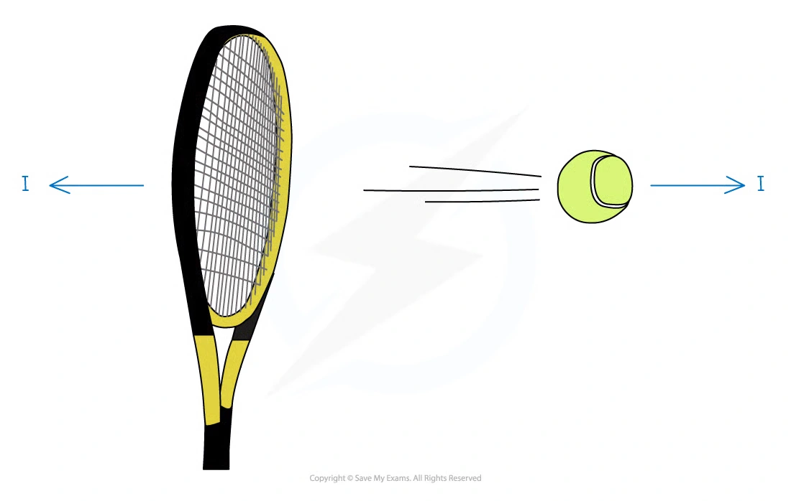
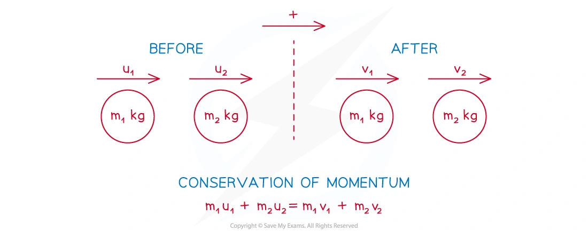

::: {.callout-important}
## 本节考纲要求

本页依据 9709 Mathematics 2026–2027 syllabus 4.3，覆盖：

- use the definition of linear momentum and show understanding of its vector nature；
- use conservation of linear momentum to solve one-dimensional direct-impact problems；
- direct impact of two bodies where the bodies coalesce on impact。

本考纲明确说明：只讨论一维运动；不要求 impulse 或 coefficient of restitution。
:::

## Learning objectives

::: {.study-card}

- [ ] 能用 $p=mv$ 定义 linear momentum，并正确处理方向和正负号
- [ ] 能在碰撞前后写出同一正方向下的 momentum equation
- [ ] 能处理 coalescence、反弹、连续碰撞和多个粒子
- [ ] 能把 momentum conservation 与 kinematics 结合，求碰撞时间、位置和后续运动
- [ ] 能计算 collision 前后的 kinetic energy，并求 loss of kinetic energy

:::

## 1. Note knowledge points

### Momentum and its vector nature

动量定义为质量与速度的乘积：

$$
p=mv.
$$

Momentum 是 vector quantity，方向与 velocity 相同；选定正方向后，反方向的 velocity 和 momentum 都写成负值。SI unit 为 $\mathrm{kg\,m\,s^{-1}}$，也可写成 $\mathrm{N\,s}$。

{.note-figure}

接触的两个物体之间的 interaction 遵守 Newton’s third law：两物体受到大小相等、方向相反的力。在没有外力的系统中，一个物体 momentum 的改变与另一个物体 momentum 的改变大小相等、方向相反。

### Direct collisions

Direct collision 指两个物体沿同一直线运动并发生碰撞。碰撞前可以有一个物体静止、同向运动或相向运动；碰撞后可以有一个或两个物体静止、改变方向、同向运动，或 coalesce 成一个物体。Explosion 是相反过程：一个物体分成沿同一直线运动的两个物体。

### Conservation of momentum

如果研究系统没有外部 resultant force，碰撞前后的总动量相等：

$$
m_1u_1+m_2u_2=m_1v_1+m_2v_2.
$$

解题时先选择 positive direction，再画 before/after diagram；未知方向可以先假设，若算出的 velocity 为负，就说明真实方向相反。若两个物体 coalesce，碰撞后速度相同：

$$
m_1u_1+m_2u_2=(m_1+m_2)v.
$$

{.note-figure}

### Multiple collisions

多次碰撞必须逐次处理：第一次碰撞的 after-velocity 是下一次碰撞的 before-velocity。碰撞后检查物体的相对速度和位置，判断是否还会发生 second collision；如果撞墙，也要先把撞墙后的速度方向反转，再检查它是否追上其他物体。

## 2. Note worked examples

每个 Note worked example 单独成卡片，并保留其原始情境。

::: {.worked-example}
### Worked example 1 · Basic momentum

A dog of mass $15\,\mathrm{kg}$ is running with speed $6\,\mathrm{m\,s^{-1}}$. Find the momentum of the dog.

$$
p=mv=15\times6=\boxed{90\,\mathrm{kg\,m\,s^{-1}}}.
$$
:::

::: {.worked-example}
### Worked example 2 · Direct collision

Two particles $P$ and $Q$, with masses $3\,\mathrm{kg}$ and $5\,\mathrm{kg}$ respectively, are travelling in opposite directions towards each other along the same straight line on a smooth horizontal table. Immediately before the collision the speeds of $P$ and $Q$ are $4\,\mathrm{m\,s^{-1}}$ and $2\,\mathrm{m\,s^{-1}}$ respectively. Immediately after the collision the direction of motion of $P$ is reversed and its speed is $1\,\mathrm{m\,s^{-1}}$. Find the speed and direction of motion of $Q immediately after the collision.

Take the initial direction of $P$ as positive. Then

$$
3(4)+5(-2)=3(-1)+5v,
$$

so $v=1\,\mathrm{m\,s^{-1}}$. Therefore $Q$ continues in its original direction with speed $\boxed{1\,\mathrm{m\,s^{-1}}}$.
:::

::: {.worked-example}
### Worked example 3 · Multiple collisions

Three uniform balls $A$, $B$ and $C$ of equal radius, and masses $0.1\,\mathrm{kg}$, $0.2\,\mathrm{kg}$ and $0.3\,\mathrm{kg}$ respectively, can move along the same straight line on a smooth horizontal table, with $B$ in the middle of $A$ and $C$. $A$ and $B$ are projected towards each other in opposite directions with speeds $10\,\mathrm{m\,s^{-1}}$ and $2\,\mathrm{m\,s^{-1}}$ respectively while $C$ is at rest. $A$ and $B$ collide directly, which does not change the direction of motion of $A$, and subsequently $A$ moves with speed $1\,\mathrm{m\,s^{-1}}$.

(a) The first collision gives

$$
0.1(10)+0.2(-2)=0.1(1)+0.2v_B,
$$

so $\boxed{v_B=2.5\,\mathrm{m\,s^{-1}}}$.

(b) At the subsequent $B$–$C$ collision, if $C$ leaves with speed $1.5\,\mathrm{m\,s^{-1}}$,

$$
0.2(2.5)+0.3(0)=0.2u_B+0.3(1.5),
$$

giving $u_B=0.25\,\mathrm{m\,s^{-1}}$. After the $B$–$C$ collision, $A$ is behind $B$ but moving faster, so $A$ catches $B$ and there will be another collision between them.
:::

## 3. Core knowledge

### Linear momentum and its vector nature

For a particle of mass $m$ moving with velocity $v$,

$$
p=mv.
$$

Momentum is a vector quantity. Choose one direction as positive and use signed velocities throughout. A particle moving in the opposite direction has negative momentum.

The SI unit is

$$
\mathrm{kg\,m\,s^{-1}}.
$$

### Conservation of momentum

For a closed system with no external resultant force in the direction of motion,

$$
\text{total momentum before impact}
=
\text{total momentum after impact}.
$$

For two particles moving on one line,

$$
m_1u_1+m_2u_2=m_1v_1+m_2v_2.
$$

Use the velocities as signed quantities; do not replace them by speeds until the direction has been established.

### Direct impact and coalescence

If two particles coalesce on impact, they have one common velocity $v$ immediately afterwards:

$$
m_1u_1+m_2u_2=(m_1+m_2)v.
$$

For a chain of collisions, apply conservation of momentum separately to each collision, carrying the resulting velocity into the next stage.

### Kinetic energy and loss in a collision

Momentum is conserved, but kinetic energy generally is not. The kinetic energy is

$$
E_k=\frac12mv^2.
$$

The loss of kinetic energy is

$$
\text{loss}=E_{k,\,\text{before}}-E_{k,\,\text{after}}.
$$

It is not necessary to assume conservation of kinetic energy unless the question explicitly gives that condition.

### A reliable collision method

1. Draw or describe the direction of motion before and after impact.
2. Choose one positive direction.
3. Write every momentum with its sign.
4. Apply conservation of momentum to the relevant system.
5. Use kinematics separately if the question asks for a later collision or a collision time.
6. Check that the final direction agrees with the wording of the question.

## 4. Verified Paper 4 questions

Each card keeps the complete selected question, including all sub-questions and the original mark allocation. The wording is transcribed from the local question papers; it is not an invented practice question.

::: {.question-card #p4-mom-q01}
### Question 1 · 9709/43/M/J/24 Q1

Two particles $P$ and $Q$ of masses $0.2\,\mathrm{kg}$ and $0.5\,\mathrm{kg}$ respectively are at rest on a smooth horizontal plane. Particle $P$ is projected with a speed $6\,\mathrm{m\,s^{-1}}$ directly towards $Q$. After $P$ and $Q$ collide, $P$ moves with a speed of $1\,\mathrm{m\,s^{-1}}$.

Find the two possible speeds of $Q$ after the collision. **[3]**

Show detailed mark scheme answer

Take the original direction of $P$ as positive. Initial momentum is

$$
0.2(6)=1.2.
$$

If $P$ continues in the original direction,

$$
1.2=0.2(1)+0.5v_Q
\quad\Rightarrow\quad v_Q=2.0.
$$

If $P$ reverses direction,

$$
1.2=0.2(-1)+0.5v_Q
\quad\Rightarrow\quad v_Q=2.8.
$$

Therefore the two possible speeds are

$$
\boxed{2.0\,\mathrm{m\,s^{-1}}\text{ and }2.8\,\mathrm{m\,s^{-1}}}.
$$

<strong>Source:</strong> PastPaper/2024/2024/A-Level-CAIE数学QP-202406-Mathematics-P43-A-Level题库大全小程序.pdf, Q1, and matching 2024 M/J/43 mark scheme.

:::

::: {.question-card #p4-mom-q02}
### Question 2 · 9709/42/M/J/24 Q6(a–b)

Three particles $A$, $B$ and $C$ of masses $5\,\mathrm{kg}$, $1\,\mathrm{kg}$ and $2\,\mathrm{kg}$ respectively lie at rest in that order on a straight smooth horizontal track $XYZ$. Initially $A$ is at $X$, $B$ is at $Y$ and $C$ is at $Z$. Particle $A$ is projected towards $B$ with a speed of $6\,\mathrm{m\,s^{-1}}$ and at the same instant $C$ is projected towards $B$ with a speed of $v\,\mathrm{m\,s^{-1}}$. In the subsequent motion, $A$ collides and coalesces with $B$ to form particle $D$. Particle $D$ then collides and coalesces with $C$ to form particle $E$ and $E$ moves towards $Z$.

(a) Show that after the second collision the speed of $E$ is $\frac{15-v}{4}\,\mathrm{m\,s^{-1}}$. **[3]**

(b) The total loss of kinetic energy of the system due to the two collisions is $63\,\mathrm J$. Use the result from (a) to show that $v=3$. **[3]**

Show detailed mark scheme answer

After the first collision, $A$ and $B$ coalesce. Their common velocity is

$$
u_D=\frac{5(6)+1(0)}{5+1}=5\,\mathrm{m\,s^{-1}}
$$

in the direction towards $Z$. Particle $C$ has velocity $-v$ in this direction. Thus after the second collision,

$$
8u_E=6(5)+2(-v)=30-2v,
$$

so

$$
u_E=\boxed{\frac{15-v}{4}}.
$$

The initial kinetic energy is

$$
\frac12(5)(6^2)+\frac12(2)v^2=90+v^2.
$$

The final kinetic energy is

$$
\frac12(8)\left(\frac{15-v}{4}\right)^2=\frac{(15-v)^2}{4}.
$$

Therefore

$$
90+v^2-\frac{(15-v)^2}{4}=63.
$$

This gives $v^2+10v-39=0$. Since $v>0$,

$$
\boxed{v=3\,\mathrm{m\,s^{-1}}}.
$$

<strong>Source:</strong> PastPaper/2024/2024/A-Level-CAIE数学QP-202406-Mathematics-P42-A-Level题库大全小程序.pdf, Q6(a–b), and matching 2024 M/J/42 mark scheme.

:::

::: {.question-card #p4-mom-q03}
### Question 3 · 9709/41/M/J/23 Q1(a–b)

Two particles $P$ and $Q$, of masses $m\,\mathrm{kg}$ and $0.3\,\mathrm{kg}$ respectively, are at rest on a smooth horizontal plane. $P$ is projected at a speed of $5\,\mathrm{m\,s^{-1}}$ directly towards $Q$. After $P$ and $Q$ collide, $P$ moves with a speed of $2\,\mathrm{m\,s^{-1}}$ in the same direction as it was originally moving.

(a) Find, in terms of $m$, the speed of $Q$ after the collision. **[2]**

After this collision, $Q$ moves directly towards a third particle $R$, of mass $0.6\,\mathrm{kg}$, which is at rest on the plane. $Q$ is brought to rest in the collision with $R$, and $R$ begins to move with a speed of $1.5\,\mathrm{m\,s^{-1}}$.

(b) Find the value of $m$. **[2]**

Show detailed mark scheme answer

(a) Conservation of momentum in the first collision gives

$$
5m=2m+0.3v_Q,
$$

so

$$
v_Q=\boxed{10m\,\mathrm{m\,s^{-1}}}.
$$

(b) In the second collision, $Q$ stops and $R$ moves at $1.5\,\mathrm{m\,s^{-1}}$:

$$
0.3(10m)=0.6(1.5).
$$

Hence

$$
\boxed{m=0.3\,\mathrm{kg}}.
$$

<strong>Source:</strong> PastPaper/2023/2023/9709_s23_qp_41.pdf, Q1(a–b), and matching 2023 M/J/41 mark scheme.

:::

::: {.question-card #p4-mom-q04}
### Question 4 · 9709/42/M/J/23 Q2(a–b)

Two particles $A$ and $B$, of masses $3.2\,\mathrm{kg}$ and $2.4\,\mathrm{kg}$ respectively, lie on a smooth horizontal table. $A$ moves towards $B$ with a speed of $v\,\mathrm{m\,s^{-1}}$ and collides with $B$, which is moving towards $A$ with a speed of $6\,\mathrm{m\,s^{-1}}$. In the collision the two particles come to rest.

(a) Find the value of $v$. **[2]**

(b) Find the loss of kinetic energy of the system due to the collision. **[2]**

Show detailed mark scheme answer

Take the direction of $A$ as positive. Since both particles come to rest,

$$
3.2v-2.4(6)=0,
$$

so

$$
\boxed{v=4.5\,\mathrm{m\,s^{-1}}}.
$$

The final kinetic energy is zero. Therefore the loss is

$$
\frac12(3.2)(4.5^2)+\frac12(2.4)(6^2)
=32.4+43.2
=\boxed{75.6\,\mathrm J}.
$$

<strong>Source:</strong> PastPaper/2023/2023/9709_s23_qp_42.pdf, Q2(a–b), and matching 2023 M/J/42 mark scheme.

:::

::: {.question-card #p4-mom-q05}
### Question 5 · 9709/42/O/N/22 Q6(a–c)

Three particles $A$, $B$ and $C$ of masses $0.3\,\mathrm{kg}$, $0.4\,\mathrm{kg}$ and $m\,\mathrm{kg}$ respectively lie at rest in a straight line on a smooth horizontal plane. The distance between $B$ and $C$ is $2.1\,\mathrm m$. $A$ is projected directly towards $B$ with speed $2\,\mathrm{m\,s^{-1}}$. After $A$ collides with $B$ the speed of $A$ is reduced to $0.6\,\mathrm{m\,s^{-1}}$, still moving in the same direction.

(a) Show that the speed of $B$ after the collision is $1.05\,\mathrm{m\,s^{-1}}$. **[2]**

After the collision between $A$ and $B$, $B$ moves directly towards $C$. Particle $B$ now collides with $C$. After this collision, the two particles coalesce and have a combined speed of $0.5\,\mathrm{m\,s^{-1}}$.

(b) Find $m$. **[2]**

(c) Find the time that it takes, from the instant when $B$ and $C$ collide, until $A$ collides with the combined particle. **[5]**

Show detailed mark scheme answer

(a)

$$
0.3(2)=0.3(0.6)+0.4v_B,
$$

so $v_B=\boxed{1.05\,\mathrm{m\,s^{-1}}}$.

(b)

$$
0.4(1.05)=(0.4+m)(0.5),
$$

so $\boxed{m=0.44\,\mathrm{kg}}$.

(c) $B$ reaches $C$ after

$$
\frac{2.1}{1.05}=2\,\mathrm s.
$$

In those 2 s, $A$ travels $0.6(2)=1.2\,\mathrm m$. At the instant of the second collision, $A$ is therefore $1.2\,\mathrm m$ behind the combined particle. The combined particle travels at $0.5\,\mathrm{m\,s^{-1}}$, while $A$ travels at $0.6\,\mathrm{m\,s^{-1}}$. Hence

$$
t=\frac{1.2}{0.6-0.5}=\boxed{12\,\mathrm s}.
$$

<strong>Source:</strong> PastPaper/2022/2022/9709_w22_qp_42.pdf, Q6(a–c), and matching 2022 O/N/42 mark scheme.

:::

::: {.question-card #p4-mom-q06}
### Question 6 · 9709/41/M/J/21 Q3(a–b)

Three particles $P$, $Q$ and $R$, of masses $0.1\,\mathrm{kg}$, $0.2\,\mathrm{kg}$ and $0.5\,\mathrm{kg}$ respectively, are at rest in a straight line on a smooth horizontal plane. Particle $P$ is projected towards $Q$ at a speed of $5\,\mathrm{m\,s^{-1}}$. After $P$ and $Q$ collide, $P$ rebounds with speed $1\,\mathrm{m\,s^{-1}}$.

(a) Find the speed of $Q$ immediately after the collision with $P$. **[3]**

$Q$ now collides with $R$. Immediately after the collision with $Q$, $R$ begins to move with speed $V\,\mathrm{m\,s^{-1}}$.

(b) Given that there is no subsequent collision between $P$ and $Q$, find the greatest possible value of $V$. **[3]**

Show detailed mark scheme answer

(a) Take the direction of the initial motion of $P$ as positive:

$$
0.1(5)=0.1(-1)+0.2v_Q.
$$

Therefore $v_Q=\boxed{3\,\mathrm{m\,s^{-1}}}$.

(b) After the second collision, let the velocity of $Q$ be $w$. Conservation of momentum for $Q$ and $R$ gives

$$
0.2(3)=0.2w+0.5V,
$$

so $w=3-2.5V$. For there to be no subsequent collision with $P$, $Q$ must not move backwards towards $P$, so $w\ge0$. Hence

$$
3-2.5V\ge0
\quad\Rightarrow\quad
\boxed{V\le1.2\,\mathrm{m\,s^{-1}}}.
$$

The greatest possible value is $\boxed{1.2\,\mathrm{m\,s^{-1}}}$.

<strong>Source:</strong> PastPaper/2021/2021/9709_s21_qp_41.pdf, Q3(a–b), and matching 2021 M/J/41 mark scheme.

:::

::: {.question-card #p4-mom-q07}
### Question 7 · 9709/42/M/J/20 Q4(a–c)

Small smooth spheres $A$ and $B$, of equal radii and of masses $4\,\mathrm{kg}$ and $2\,\mathrm{kg}$ respectively, lie on a smooth horizontal plane. Initially $B$ is at rest and $A$ is moving towards $B$ with speed $10\,\mathrm{m\,s^{-1}}$. After the spheres collide $A$ continues to move in the same direction but with half the speed of $B$.

(a) Find the speed of $B$ after the collision. **[2]**

A third small smooth sphere $C$, of mass $1\,\mathrm{kg}$ and with the same radius as $A$ and $B$, is at rest on the plane. $B$ now collides directly with $C$. After this collision $B$ continues to move in the same direction but with one third the speed of $C$.

(b) Show that there is another collision between $A$ and $B$. **[3]**

(c) $A$ and $B$ coalesce during this collision. Find the total loss of kinetic energy in the system due to the three collisions. **[5]**

Show detailed mark scheme answer

(a) Let the speed of $A$ be $x$ and that of $B$ be $2x$ after the first collision:

$$
4(10)=4x+2(2x),
$$

so $x=5$ and $v_B=\boxed{10\,\mathrm{m\,s^{-1}}}$.

(b) Let the speeds of $B$ and $C$ after the second collision be $y$ and $3y$:

$$
2(10)=2y+1(3y),
$$

giving $y=4$. Thus after the second collision $A$ has speed $5$ and $B$ has speed $4$ in the same direction. Since $A$ is behind $B$ and is now faster, another collision occurs.

(c) Initial kinetic energy is $200\,\mathrm J$. After the first collision it is

$$
\frac12(4)(5^2)+\frac12(2)(10^2)=150\,\mathrm J.
$$

After the second collision it is

$$
\frac12(4)(5^2)+\frac12(2)(4^2)+\frac12(1)(12^2)=138\,\mathrm J.
$$

Before the third collision the momentum of $A$ and $B$ is $4(5)+2(4)=28$. Their common speed after coalescing is $28/6=14/3$, so final kinetic energy is $196/3\,\mathrm J$. Total loss:

$$
200-\frac{196}{3}=\boxed{134.7\,\mathrm J}\quad\text{(3 s.f.)}.
$$

<strong>Source:</strong> PastPaper/2020/2020/9709-s20-qp-42.pdf, Q4(a–c), and matching 2020 M/J/42 mark scheme.

:::

::: {.question-card #p4-mom-q08}
### Question 8 · 9709/42/O/N/20 Q1(a–b)

Two particles $P$ and $Q$, of masses $0.2\,\mathrm{kg}$ and $0.5\,\mathrm{kg}$ respectively, are at rest on a smooth horizontal plane. $P$ is projected towards $Q$ with speed $2\,\mathrm{m\,s^{-1}}$.

(a) Write down the momentum of $P$. **[1]**

(b) After the collision $P$ continues to move in the same direction with speed $0.3\,\mathrm{m\,s^{-1}}$. Find the speed of $Q$ after the collision. **[2]**

Show detailed mark scheme answer

(a)

$$
p=mv=0.2(2)=\boxed{0.4\,\mathrm{kg\,m\,s^{-1}}}.
$$

(b) Conservation of momentum gives

$$
0.4=0.2(0.3)+0.5v_Q.
$$

Hence

$$
\boxed{v_Q=0.68\,\mathrm{m\,s^{-1}}}.
$$

<strong>Source:</strong> PastPaper/2020/2020/9709_w20_qp_42.pdf, Q1(a–b), and matching 2020 O/N/42 mark scheme.

:::

::: {.question-card #p4-mom-q09}
### Question 9 · 9709/41/M/J/20 Q1(a–b)

A particle $B$ of mass $5\,\mathrm{kg}$ is at rest on a smooth horizontal table. A particle $A$ of mass $2.5\,\mathrm{kg}$ moves on the table with a speed of $6\,\mathrm{m\,s^{-1}}$ and collides directly with $B$. In the collision the two particles coalesce.

(a) Find the speed of the combined particle after the collision. **[2]**

(b) Find the loss of kinetic energy of the system due to the collision. **[3]**

Show detailed mark scheme answer

(a)

$$
2.5(6)=(2.5+5)v,
$$

so $\boxed{v=2\,\mathrm{m\,s^{-1}}}$.

(b) Initial kinetic energy is $\frac12(2.5)(6^2)=45\,\mathrm J$. Final kinetic energy is $\frac12(7.5)(2^2)=15\,\mathrm J$. Therefore

$$
\boxed{\text{loss}=30\,\mathrm J}.
$$

<strong>Source:</strong> PastPaper/2020/2020/9709_w20_qp_41.pdf, Q1(a–b), and matching 2020 O/N/41 mark scheme.

:::

## 5. Quick checklist

::: {.study-card}

- [ ] Did I choose and state a positive direction?
- [ ] Did I use signed velocities rather than unsigned speeds in the momentum equation?
- [ ] If particles coalesce, did I give them one common final velocity?
- [ ] For several collisions, did I solve them in chronological order?
- [ ] Did I calculate kinetic-energy loss from before minus after, rather than assume energy is conserved?
- [ ] Did I keep momentum and kinetic energy as separate ideas?

:::
