::: {.callout-important}
## 本节考纲要求

本页依据 9709 Mathematics 2026–2027 syllabus 4.4，覆盖：

- use Newton’s laws of motion for a particle of constant mass moving under the action of constant forces, including friction;
- use the relation $W=mg$;
- solve problems involving motion in a vertical plane and on an inclined plane with constant acceleration;
- solve problems involving connected particles, light inextensible strings, smooth pulleys and light rigid rods.

题目部分只收录可由本地 Paper 4 原始 QP 与对应 mark scheme 核对的完整真题；不把 Note 的 worked example 改写成真题。
:::

## Learning objectives

::: {.study-card}

- [ ] 为每个 particle 画出完整 force diagram，并明确正方向
- [ ] 用 $F=ma$、$W=mg$ 和分力处理水平、竖直及斜面运动
- [ ] 在 connected particles 中正确使用相同加速度、相同 tension 和系统方程
- [ ] 区分 light inextensible string、smooth pulley、light rigid tow-bar 的模型含义
- [ ] 判断 friction 的方向，并使用 $F\leq\mu R$ 与 limiting friction $F=\mu R$

:::

## 1. Core knowledge

### Forces and force diagrams

常见力包括 weight、normal reaction、tension、thrust、friction 和 resistance。先把研究对象单独取出，再只画作用在它上的外力。

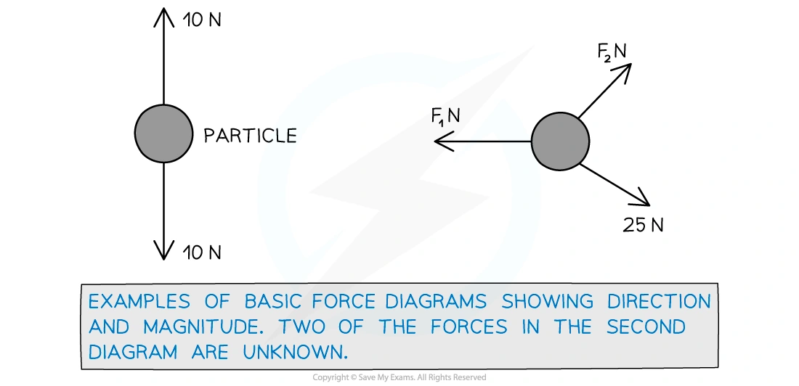{.note-figure}

对于接触面上的 particle：

$$
W=mg,
\qquad R\perp\text{ contact surface}.
$$

若物体在粗糙面上运动，friction 与相对运动（或将发生的相对运动）相反；若处于 limiting equilibrium，$F=\mu R$，否则只知道 $F\leq\mu R$。

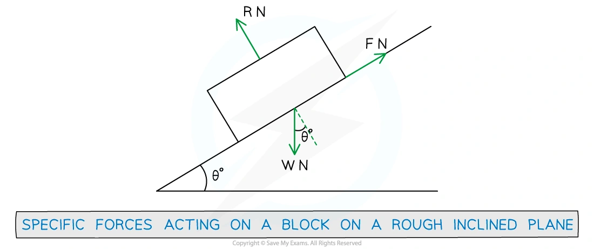{.note-figure}

### Newton’s first and second laws

当 resultant force 为零时，particle 保持静止或以恒速直线运动。对质量恒定的 particle，沿选定方向：

$$
\sum F=ma.
$$

同一题中可以分别沿斜面、垂直斜面、水平或竖直方向列方程。若物体静止或匀速，$a=0$，方程就变成 equilibrium 方程。

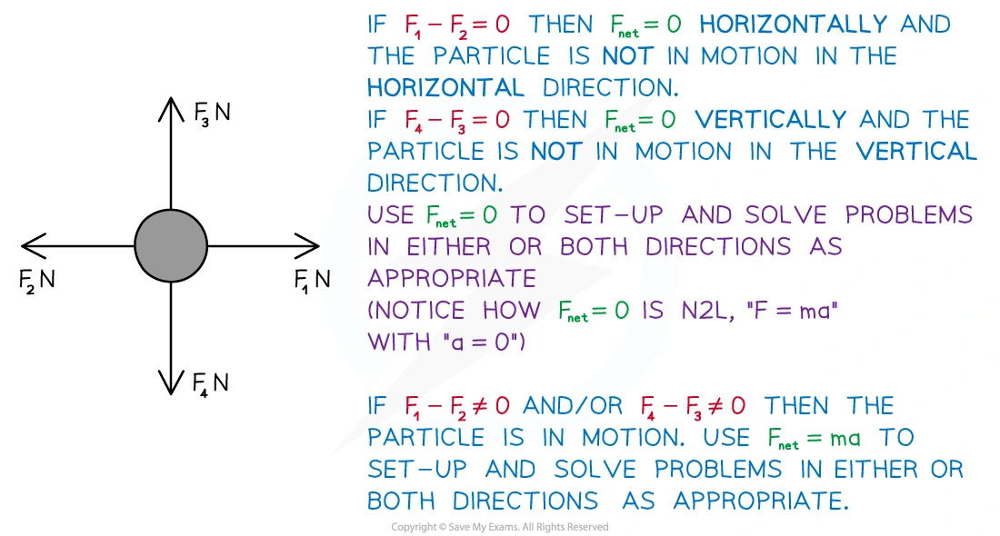{.note-figure}

### Newton’s third law

作用力与反作用力：大小相等、方向相反、作用在不同物体上。因此不能把一对 third-law forces 同时放入同一个 particle 的 force diagram。

### Connected particles

对于 light inextensible string：

- string 的质量忽略不计，因此同一根绳上的 tension 相同；
- inextensible 表示绳长不变，连接 particle 的 acceleration magnitudes 相同；
- string 只能提供 tension，不能提供 thrust。

对于 light rigid tow-bar，杆可以传递 tension 或 thrust；连接物体仍有相同的 acceleration。

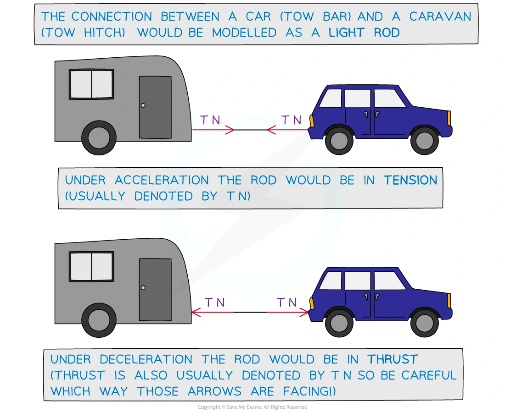{.note-figure}

先把所有连接物体作为一个 system，可以消去 internal tension；若要找 tension，再对其中一个 particle 单独列 $F=ma$。

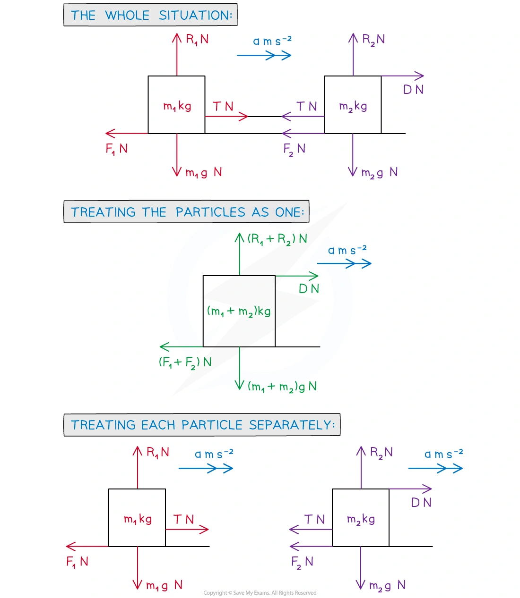{.note-figure}

### Vertical motion and lifts

竖直向上为正时，lift、load 或 cable 的方程必须保留符号。例如 lift 向上加速时：

$$
T-mg=ma.
$$

若 lift 向下加速，$a$ 在上述正方向下为负。load 的 normal reaction 是 load 所受的力；它不等于 load 的 weight，除非 load 没有竖直加速度。

### Pulleys

在 light inextensible string over a smooth pulley 的模型中，绳两侧 tension 相同，两个 particle 的 acceleration magnitudes 相同。对每个 particle 分别画图，再按各自运动方向列方程。

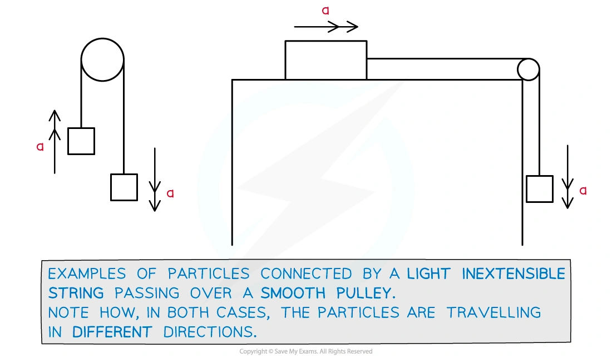{.note-figure}

### Resolving forces and friction

斜面角为 $\theta$ 时，weight 的分量为：

$$
mg\sin\theta\quad\text{parallel to the plane},
\qquad
mg\cos\theta\quad\text{perpendicular to the plane}.
$$

外力若与斜面夹角为 $\alpha$，先将它分解到 parallel/perpendicular 两个方向，再用 perpendicular 方程求 $R$，最后判断 friction：

$$
F\leq\mu R,
\qquad
F_{\max}=\mu R.
$$

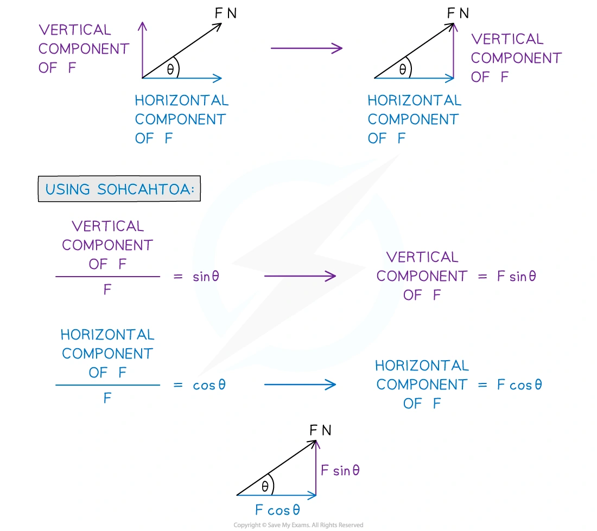{.note-figure}

## 2. Note worked examples

每个 worked example 单独成卡片，保留 Note 中的建模情境，并把关键方程和结果列出。

::: {.worked-example}
### Worked example 1 · Force diagram on a rough plane

A block has weight $52\,\mathrm N$ and is on a rough plane inclined at angle $\theta$ to the horizontal. It is connected by a light inextensible string, passing over a smooth pulley, to a particle of mass $2\,\mathrm{kg}$ which hangs freely. The particle is at rest. Add all the forces acting on the block and the particle, and state the possible directions of acceleration.

For the block, include weight $52\,\mathrm N$, the normal reaction, the tension and friction. For the hanging particle, include its weight $2g\,\mathrm N$ and the tension. The two possible directions are determined by which side would move down if the system were released; friction opposes that impending motion.

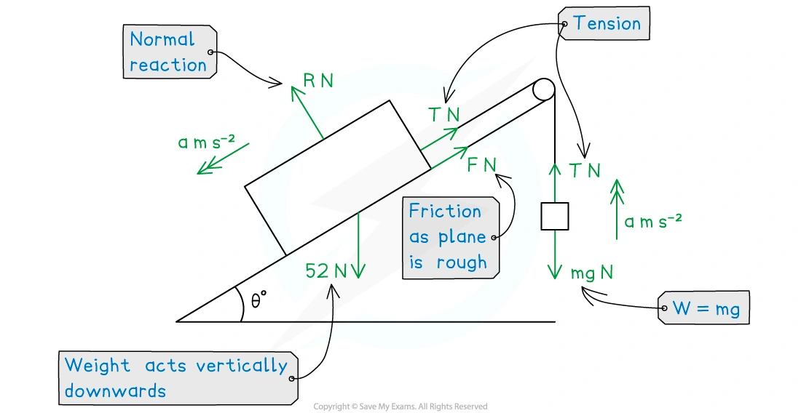{.note-figure}
:::

::: {.worked-example}
### Worked example 2 · Equilibrium in one dimension

A rectangular sign of mass $(4x-8)\,\mathrm{kg}$ is held in equilibrium by two light inextensible strings. The upward forces in the strings are $(20x+9)\,\mathrm N$ and $(10x+11)\,\mathrm N$. Find $x$, using $g=10\,\mathrm{m\,s^{-2}}$.

Since the sign is in equilibrium,

$$
(20x+9)+(10x+11)=(4x-8)\times10.
$$

Hence $30x+20=40x-80$, so

$$
\boxed{x=10}.
$$
:::

::: {.worked-example}
### Worked example 3 · Resultant force and acceleration

A train engine of mass $5$ tonnes is moving along a straight track with constant acceleration. In an eight second period, it covers a distance of $250\,\mathrm m$ at which point it has velocity $35\,\mathrm{m\,s^{-1}}$. Find its acceleration, the resultant force, and the total resistance if the driving force is $6250\,\mathrm N$.

Using $s=vt-\frac12at^2$,

$$
250=35(8)-\frac12a(8^2),
$$

so the Note’s worked calculation gives $a=0.9375\,\mathrm{m\,s^{-2}}$. Therefore

$$
F_{\rm resultant}=5000(0.9375)=4687.5\,\mathrm N,
$$

and the resistance is

$$
6250-4687.5=\boxed{1562.5\,\mathrm N}.
$$
:::

::: {.worked-example}
### Worked example 4 · Connected bodies and tow-bar

A small plane of mass $1250\,\mathrm{kg}$ tows a glider of mass $300\,\mathrm{kg}$. The acceleration is $1.5\,\mathrm{m\,s^{-2}}$; the resistances are $580\,\mathrm N$ on the plane and $255\,\mathrm N$ on the glider. The tow rope is light and inextensible. The Note result is an engine force of $\boxed{3160\,\mathrm N}$ and a tow-rope tension of $\boxed{705\,\mathrm N}$.

For the glider, $T-255=300(1.5)$, giving $T=705\,\mathrm N$. For the whole system, engine force minus total resistance equals $(1250+300)(1.5)$, giving $3160\,\mathrm N$.
:::

::: {.worked-example}
### Worked example 5 · The lift problem

A lift of mass $800\,\mathrm{kg}$ is moving vertically downwards with acceleration $0.3\,\mathrm{m\,s^{-2}}$. A load of mass $m\,\mathrm{kg}$ lies on the floor of the lift. The reaction force exerted on the load by the lift is $399\,\mathrm N$. Explain why the force $800g\,\mathrm N$ occurs, find $m$, and find the cable tension $T$.

The $800g$ term is the weight of the lift. Taking upward as positive for the load,

$$
399-mg=m(-0.3),
$$

so $m\approx44.1\,\mathrm{kg}$. For the lift and load together,

$$
T-800g-mg=-(800+m)(0.3),
$$

giving $\boxed{T\approx8160\,\mathrm N}$.
:::

::: {.worked-example}
### Worked example 6 · Pulley system

A $25\,\mathrm{kg}$ block on a horizontal table is connected over a smooth pulley to a $60\,\mathrm{kg}$ hanging block by a light inextensible string. The system is released. Find the tension $T$ and the acceleration $a$.

For the $25\,\mathrm{kg}$ block, $T=25a$. For the hanging block, $60g-T=60a$. Hence

$$
60g=85a,
\qquad a\approx7.06\,\mathrm{m\,s^{-2}},
$$

and

$$
\boxed{T\approx176\,\mathrm N}.
$$
:::

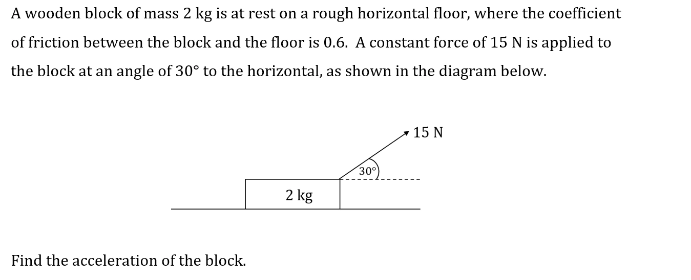{.note-figure}

## 3. Verified Paper 4 questions

以下每张卡均保留完整题干、所有小问和原始分值；图像从对应 QP 原始 PDF 的题图区域独立提取，不使用整页截图。

::: {.question-card #p4-newton-q01}
### Question 1 · 9709/41/M/J/24 Q4

A car of mass $1700\,\mathrm{kg}$ is pulling a trailer of mass $300\,\mathrm{kg}$ along a straight horizontal road. The car and trailer are connected by a light inextensible cable which is parallel to the road. There are constant resistances to motion of $400\,\mathrm N$ on the car and $150\,\mathrm N$ on the trailer. The power of the car’s engine is $14\,000\,\mathrm W$.

Find the acceleration of the car and the tension in the cable when the speed is $20\,\mathrm{m\,s^{-1}}$. **[6]**

Show detailed mark scheme answer

The driving force at this instant is

$$
P=Fv\quad\Rightarrow\quad F=\frac{14000}{20}=700\,\mathrm N.
$$

For the car and trailer together,

$$
700-400-150=(1700+300)a,
$$

so $a=0.075\,\mathrm{m\,s^{-2}}$. For the trailer,

$$
T-150=300(0.075),
$$

therefore

$$
\boxed{a=0.075\,\mathrm{m\,s^{-2}},\qquad T=172.5\,\mathrm N}.
$$

<strong>Source:</strong> PastPaper/2024/A-Level-CAIE数学QP-202406-Mathematics-P41-A-Level题库大全小程序.pdf, Q4, with the corresponding 9709/41/M/J/24 mark scheme.

:::

::: {.question-card #p4-newton-q02}
### Question 2 · 9709/41/M/J/20 Q2(a–b)

A car of mass $1800\,\mathrm{kg}$ is towing a trailer of mass $400\,\mathrm{kg}$ along a straight horizontal road. The car and trailer are connected by a light rigid tow-bar. The car is accelerating at $1.5\,\mathrm{m\,s^{-2}}$. There are constant resistance forces of $250\,\mathrm N$ on the car and $100\,\mathrm N$ on the trailer.

(a) Find the tension in the tow-bar. **[2]**

(b) Find the power of the engine of the car at the instant when the speed is $20\,\mathrm{m\,s^{-1}}$. **[3]**

Show detailed mark scheme answer

(a) For the trailer,

$$
T-100=400(1.5),
$$

so $\boxed{T=700\,\mathrm N}$.

(b) Let $E$ be the engine force. For the car,

$$
E-700-250=1800(1.5),
$$

so $E=3650\,\mathrm N$. Hence

$$
P=Ev=3650(20)=\boxed{73\,000\,\mathrm W}=\boxed{73.0\,\mathrm{kW}}.
$$

<strong>Source:</strong> PastPaper/2020/9709-s20-qp-41.pdf, Q2, with the corresponding 9709/41/M/J/20 mark scheme.

:::

::: {.question-card #p4-newton-q03}
### Question 3 · 9709/41/O/N/20 Q5(a–b)

Two particles of masses $0.8\,\mathrm{kg}$ and $0.2\,\mathrm{kg}$ are connected by a light inextensible string that passes over a fixed smooth pulley. The system is released from rest with both particles $0.5\,\mathrm m$ above a horizontal floor (see diagram). In the subsequent motion the $0.2\,\mathrm{kg}$ particle does not reach the pulley.

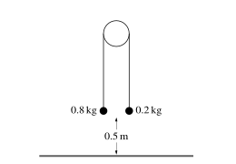{.question-figure}

(a) Show that the magnitude of the acceleration of the particles is $6\,\mathrm{m\,s^{-2}}$ and find the tension in the string. **[4]**

(b) When the $0.8\,\mathrm{kg}$ particle reaches the floor it comes to rest. Find the greatest height of the $0.2\,\mathrm{kg}$ particle above the floor. **[3]**

Show detailed mark scheme answer

(a) For the $0.8\,\mathrm{kg}$ particle, taking downward as positive,

$$
8-T=0.8a.
$$

For the $0.2\,\mathrm{kg}$ particle,

$$
T-2=0.2a.
$$

Adding gives $6= a$, so $a=6\,\mathrm{m\,s^{-2}}$. Then

$$
T=2+0.2(6)=\boxed{3.2\,\mathrm N}.
$$

(b) Before the heavier particle reaches the floor,

$$
v^2=u^2+2as=0+2(6)(0.5)=6.
$$

The lighter particle has risen $0.5\,\mathrm m$, so its height is $1.0\,\mathrm m$. After the heavier particle stops, the lighter particle rises further against gravity:

$$
0=v^2-2g\Delta h
\quad\Rightarrow\quad
\Delta h=\frac{6}{20}=0.3\,\mathrm m.
$$

Greatest height $=1.0+0.3=\boxed{1.3\,\mathrm m}$.

<strong>Source:</strong> PastPaper/2020/9709_w20_qp_41.pdf, Q5(a–b), with the corresponding 9709/41/O/N/20 mark scheme.

:::

::: {.question-card #p4-newton-q04}
### Question 4 · 9709/42/O/N/21 Q2(a–b)

A van of mass $3600\,\mathrm{kg}$ is towing a trailer of mass $1200\,\mathrm{kg}$ along a straight horizontal road using a light horizontal rope. There are resistance forces of $700\,\mathrm N$ on the van and $300\,\mathrm N$ on the trailer.

(a) The driving force exerted by the van is $2500\,\mathrm N$. Find the tension in the rope. **[4]**

The driving force is now removed and the van driver applies a braking force which acts only on the van. The resistance forces remain unchanged.

(b) Find the least possible value of the braking force which will cause the rope to become slack. **[2]**

Show detailed mark scheme answer

(a) For the system,

$$
2500-700-300=(3600+1200)a,
$$

so $a=0.3125\,\mathrm{m\,s^{-2}}$. For the trailer,

$$
T-300=1200(0.3125),
$$

giving $\boxed{T=675\,\mathrm N}$.

(b) At the instant the rope is just slack, $T=0$. The trailer then has

$$
a=\frac{-300}{1200}=-0.25\,\mathrm{m\,s^{-2}}.
$$

For the van, with braking force $B$,

$$
-B-700=3600(-0.25),
$$

so $B=\boxed{200\,\mathrm N}$.

<strong>Source:</strong> PastPaper/2021/9709_w21_qp_42.pdf, Q2(a–b), with the corresponding 9709/42/O/N/21 mark scheme.

:::

::: {.question-card #p4-newton-q05}
### Question 5 · 9709/42/O/N/22 Q5(a–b)

A block A of mass $80\,\mathrm{kg}$ is connected by a light, inextensible rope to a block B of mass $40\,\mathrm{kg}$. The rope joining the two blocks is taut and is parallel to a line of greatest slope of a plane which is inclined at an angle of $20^\circ$ to the horizontal. A force of magnitude $500\,\mathrm N$ inclined at an angle of $15^\circ$ above the same line of greatest slope acts on A (see diagram). The blocks move up the plane and there is a resistance force of $50\,\mathrm N$ on B, but no resistance force on A.

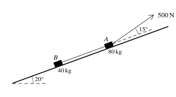{.question-figure}

(a) Find the acceleration of the blocks and the tension in the rope. **[5]**

(b) Find the time that it takes for the blocks to reach a speed of $1.2\,\mathrm{m\,s^{-1}}$ from rest. **[2]**

Show detailed mark scheme answer

Taking up the plane as positive, for the two blocks together,

$$
500\cos15^\circ-120\sin20^\circ-50=120a.
$$

Thus $a\approx0.1878\,\mathrm{m\,s^{-2}}$. For block B,

$$
T-40g\sin20^\circ-50=40a,
$$

so $T\approx\boxed{194\,\mathrm N}$. Therefore

$$
\boxed{a\approx0.188\,\mathrm{m\,s^{-2}}}.
$$

(b) Using $v=u+at$,

$$
t=\frac{1.2}{0.1878}\approx\boxed{6.39\,\mathrm s}.
$$

<strong>Source:</strong> PastPaper/2022/9709_w22_qp_42.pdf, Q5(a–b), with the corresponding 9709/42/O/N/22 mark scheme.

:::

::: {.question-card #p4-newton-q06}
### Question 6 · 9709/42/F/M/23 Q4(a–c)

A toy railway locomotive of mass $0.8\,\mathrm{kg}$ is towing a truck of mass $0.4\,\mathrm{kg}$ on a straight horizontal track at a constant speed of $2\,\mathrm{m\,s^{-1}}$. There is a constant resistance force of magnitude $0.2\,\mathrm N$ on the locomotive, but no resistance force on the truck. There is a light rigid horizontal coupling connecting the locomotive and the truck.

(a) State the tension in the coupling. **[1]**

(b) Find the power produced by the locomotive’s engine. **[1]**

The power produced by the locomotive’s engine is now changed to $1.2\,\mathrm W$.

(c) Find the magnitude of the tension in the coupling at the instant that the locomotive begins to accelerate. **[5]**

Show detailed mark scheme answer

(a) The truck has no resistance and constant speed, so its resultant force is zero. Hence $\boxed{T=0}$.

(b) The engine force balances the $0.2\,\mathrm N$ resistance, so

$$
P=Fv=0.2(2)=\boxed{0.4\,\mathrm W}.
$$

(c) At speed $2\,\mathrm{m\,s^{-1}}$, the new engine force is

$$
F=\frac{1.2}{2}=0.6\,\mathrm N.
$$

For both particles,

$$
0.6-0.2=(0.8+0.4)a,
$$

so $a=1/3\,\mathrm{m\,s^{-2}}$. For the truck,

$$
T=0.4\left(\frac13\right)=\boxed{0.133\,\mathrm N}.
$$

<strong>Source:</strong> PastPaper/2023/9709_m23_qp_42.pdf, Q4(a–c), with the corresponding 9709/42/F/M/23 mark scheme.

:::

::: {.question-card #p4-newton-q07}
### Question 7 · 9709/42/F/M/21 Q4(a–c)

An elevator moves vertically, supported by a cable. The diagram shows a velocity-time graph which models the motion of the elevator. The graph consists of 7 straight line segments.

The elevator accelerates upwards from rest to a speed of $2\,\mathrm{m\,s^{-1}}$ over a period of $1.5\,\mathrm s$ and then travels at this speed for $4.5\,\mathrm s$, before decelerating to rest over a period of $1\,\mathrm s$.

The elevator then remains at rest for $6\,\mathrm s$, before accelerating to a speed of $V\,\mathrm{m\,s^{-1}}$ downwards over a period of $2\,\mathrm s$. The elevator travels at this speed for a period of $5\,\mathrm s$, before decelerating to rest over a period of $1.5\,\mathrm s$.

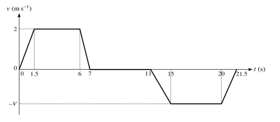{.question-figure}

(a) Find the acceleration of the elevator during the first $1.5\,\mathrm s$. **[1]**

(b) Given that the elevator starts and finishes its journey on the ground floor, find $V$. **[2]**

(c) The combined weight of the elevator and passengers on its upward journey is $1500\,\mathrm{kg}$. Assuming that there is no resistance to motion, find the tension in the elevator cable on its upward journey when the elevator is decelerating. **[3]**

Show detailed mark scheme answer

(a)

$$
a=\frac{2-0}{1.5}=\boxed{\frac43\,\mathrm{m\,s^{-2}}}.
$$

(b) The upward displacement is the positive area under the graph:

$$
\frac12(1.5)(2)+(4.5)(2)+\frac12(1)(2)=11.5.
$$

The downward displacement is

$$
\frac12(2)V+5V+\frac12(1.5)V=6.75V.
$$

Equating distances gives $V=11.5/6.75=\boxed{46/27\approx1.70\,\mathrm{m\,s^{-1}}}$.

(c) During upward deceleration, $a=-2\,\mathrm{m\,s^{-2}}$. Taking upward as positive,

$$
T-1500(10)=1500(-2),
$$

so $\boxed{T=12\,000\,\mathrm N}$.

<strong>Source:</strong> PastPaper/2021/9709_m21_qp_42.pdf, Q4(a–c), with the corresponding 9709/42/F/M/21 mark scheme.

:::

## Final checklist

::: {.callout-tip}

1. Isolate each particle before writing equations.
2. Choose a positive direction and keep every force signed.
3. Use a system equation to remove internal tension, then a single-particle equation to recover it.
4. For strings, check equal tension and equal acceleration magnitude; for tow-bars, remember thrust is possible.
5. Check units, direction, and whether friction is static or limiting.

:::
