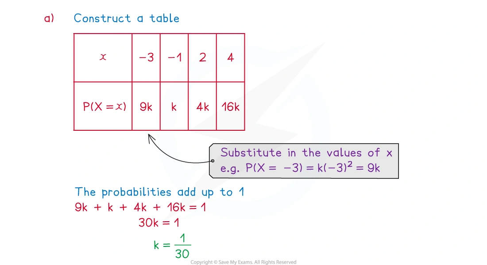
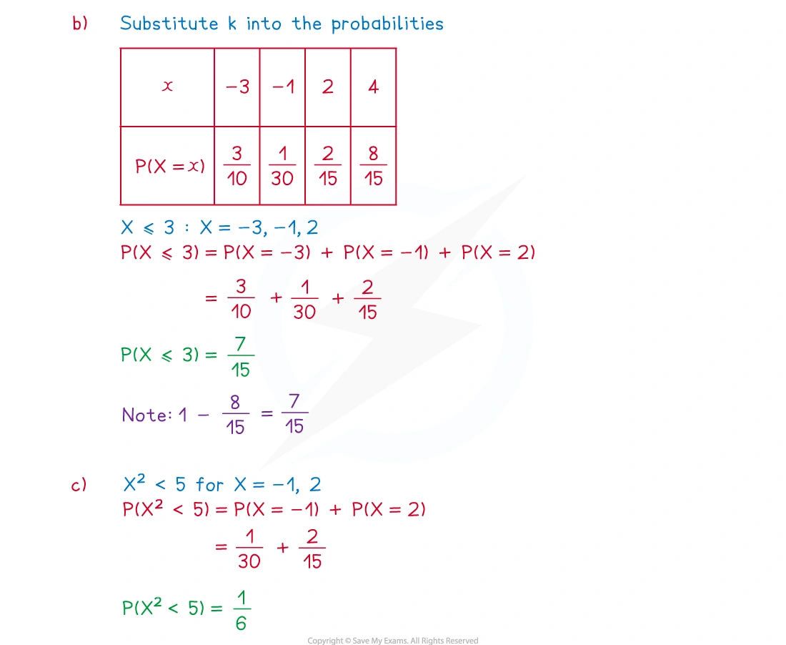
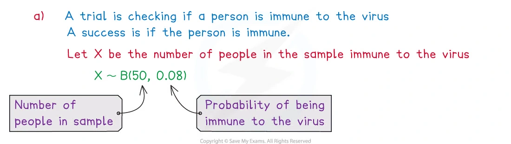
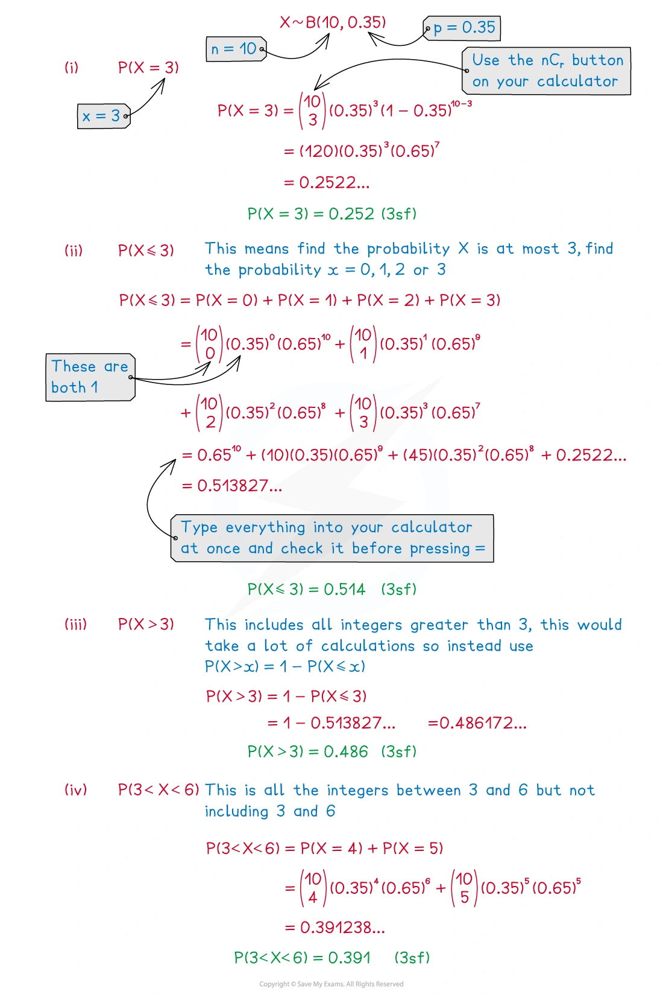
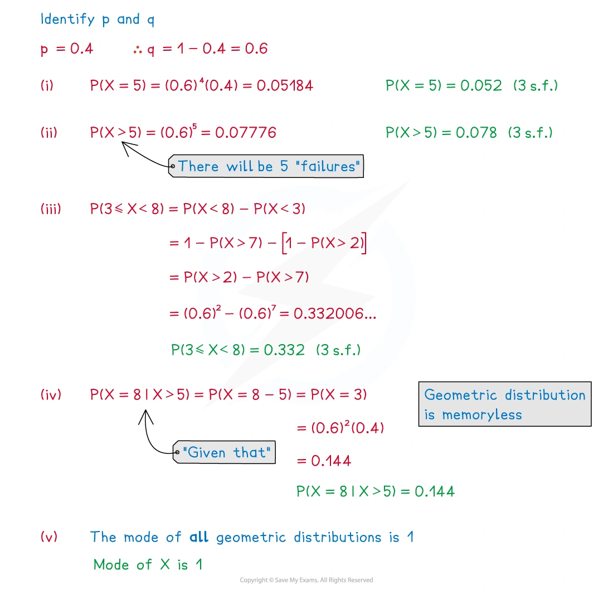

::: {.callout-important}
## 本节考纲要求

本页依据 9709 Mathematics 2026–2027 syllabus 5.4，覆盖：

- draw up a probability distribution table for a discrete random variable $X$, and calculate $E(X)$ and $operatorname{Var}(X)$;
- use the binomial and geometric distributions, including recognising suitable practical models;
- use the formulae for the expectation and variance of a binomial distribution and the expectation of a geometric distribution.

考纲中的几何分布使用 $\operatorname{Geo}(p)$，其中

$$
P(X=r)=p(1-p)^{r-1},\qquad r=1,2,3,\ldots.
$$

真题均来自本地原始 QP，并与对应 mark scheme 核对；题目保持原文，不改写或编造。
:::

## Learning objectives

::: {.study-card}

- [ ] 检查离散随机变量的所有可能取值，并令所有概率之和为 $1$
- [ ] 使用 $E(X)=\sum xP(X=x)$、$E(X^2)=\sum x^2P(X=x)$
- [ ] 用 $\operatorname{Var}(X)=E(X^2)-[E(X)]^2$
- [ ] 识别并使用 $X\sim B(n,p)$，包括 $P(X=r)$、$E(X)=np$ 和 $\operatorname{Var}(X)=np(1-p)$
- [ ] 识别并使用 $X\sim\operatorname{Geo}(p)$，包括 $P(X=r)$、$P(X>r)$ 和 $E(X)=1/p$
- [ ] 正确解释 at most、at least、more than、fewer than 与 first success

:::

## 1. Core knowledge

### Discrete probability distributions

离散随机变量 $X$ 只能取有限或可数的值。Probability distribution table 必须列出每一个可能的 $x$ 和对应的 $P(X=x)$，并满足

$$
0\leq P(X=x)\leq1,
\qquad
\sum_xP(X=x)=1.
$$

如果题目给出 $P(X=x)$ 的函数，先把所有可能的 $x$ 代入，再利用概率总和等于 $1$ 求常数。

### Expectation and variance

期望是长期平均值：

$$
E(X)=\sum_x xP(X=x).
$$

先求平方的期望：

$$
E(X^2)=\sum_x x^2P(X=x),
$$

再计算

$$
\operatorname{Var}(X)=E(X^2)-[E(X)]^2.
$$

Variance 必须非负；如果算出负值，应检查是否把 $E(X^2)$ 与 $[E(X)]^2$ 混淆。

### Binomial distribution

若 $X$ 统计固定 $n$ 次试验中的 success 次数，并满足以下条件，则可以使用

$$
X\sim B(n,p):
$$

1. 试验次数固定为 $n$；
2. 每次试验只有 success/failure 两种结果；
3. 各次试验相互独立；
4. 每次 success probability 都是同一个 $p$。

精确得到 $r$ 次 success：

$$
P(X=r)=\binom nrp^r(1-p)^{n-r},
\qquad r=0,1,\ldots,n.
$$

期望与方差：

$$
E(X)=np,
\qquad
\operatorname{Var}(X)=np(1-p).
$$

“At most $r$” 是 $P(X\leq r)$；“more than $r$” 是 $P(X>r)=1-P(X\leq r)$；“at least $r$” 是 $P(X\geq r)=1-P(X\leq r-1)$。

### Geometric distribution

若每次试验独立、success probability 恒为 $p$，而 $X$ 表示第一次 success 所需的试验次数，则

$$
X\sim\operatorname{Geo}(p),
\qquad
P(X=r)=(1-p)^{r-1}p.
$$

前 $r-1$ 次必须 failure，第 $r$ 次必须 success。常用结果：

$$
P(X>r)=(1-p)^r,
\qquad
P(X\leq r)=1-(1-p)^r,
\qquad
E(X)=\frac1p.
$$

几何分布具有 memoryless property：

$$
P(X>s+t\mid X>s)=P(X>t).
$$

### 文字条件的转换

- exactly $r$：$P(X=r)$
- at most $r$：$P(X\le r)$
- fewer than $r$：$P(X<r)=P(X\le r-1)$
- more than $r$：$P(X>r)$
- no more than $r$：$P(X\le r)$
- first success on trial $r$：$(1-p)^{r-1}p$

## 2. Note worked examples

每个 worked example 单独成卡片；图片均由原始 `3. Statistical Distributions.pdf` 的内嵌资源独立提取，不使用页面截图。

::: {.worked-example}
### Worked example 1 · Constructing a discrete distribution

The probability distribution of the discrete random variable is given by

$$
P(X=x)=
\begin{cases}
kx^2,&x=-3,-1,2,4,\\
0,&\text{otherwise}.
\end{cases}
$$

(a) Show that $k=1/30$.

(b) Calculate $P(X\leq3)$.

(c) Calculate $P(X^2<5)$.

For (a), the probabilities are $9k,k,4k,16k$, so

$$
9k+k+4k+16k=1
\implies \boxed{k=\frac1{30}}.
$$

Thus

$$
P(X\leq3)=\frac3{10}+\frac1{30}+\frac2{15}=\boxed{\frac7{15}},
$$

and $X^2<5$ means $X=-1$ or $X=2$:

$$
P(X^2<5)=\frac1{30}+\frac2{15}=\boxed{\frac16}.
$$

{.note-figure}

{.note-figure}
:::

::: {.worked-example}
### Worked example 2 · Expectation and variance

The discrete random variable $X$ has the probability distribution:

| $x$ | 2 | 3 | 5 | 7 |
|---:|---:|---:|---:|---:|
| $P(X=x)$ | 0.1 | 0.3 | 0.2 | 0.4 |

Find $E(X)$, $E(X^2)$ and $\operatorname{Var}(X)$.

$$
E(X)=2(0.1)+3(0.3)+5(0.2)+7(0.4)=\boxed{4.9}.
$$

$$
E(X^2)=2^2(0.1)+3^2(0.3)+5^2(0.2)+7^2(0.4)=27.7.
$$

Therefore

$$
\operatorname{Var}(X)=27.7-(4.9)^2=\boxed{3.69}.
$$

{.note-figure}
:::

::: {.worked-example}
### Worked example 3 · Modelling a binomial distribution

It is known that 8% of a large population are immune to a particular virus. Mark takes a sample of 50 people. State the distribution Mark uses and the assumptions needed for a binomial model.

Let $X$ be the number of people in the sample who are immune. Then

$$
\boxed{X\sim B(50,0.08)}.
$$

The model assumes that each person is independently selected and that the probability of being immune is the same $0.08$ for every selected person. There are two outcomes for each trial: immune or not immune.

{.note-figure}
:::

::: {.worked-example}
### Worked example 4 · Binomial probabilities

If $X\sim B(10,0.35)$, find:

(i) $P(X=3)$;

(ii) $P(X\leq3)$;

(iii) $P(X>3)$;

(iv) $P(3<X<6)$.

$$
P(X=3)=\binom{10}{3}(0.35)^3(0.65)^7
=\boxed{0.252\text{ (3 s.f.)}}.
$$

$$
P(X\leq3)=\sum_{r=0}^{3}\binom{10}{r}(0.35)^r(0.65)^{10-r}
=\boxed{0.514\text{ (3 s.f.)}}.
$$

$$
P(X>3)=1-P(X\leq3)=\boxed{0.486\text{ (3 s.f.)}}.
$$

$$
P(3<X<6)=P(X=4)+P(X=5)
=\boxed{0.391\text{ (3 s.f.)}}.
$$

{.note-figure}
:::

::: {.worked-example}
### Worked example 5 · Geometric probabilities

Given that $X\sim\operatorname{Geo}(0.4)$, find:

(i) $P(X=5)$;

(ii) $P(X>5)$;

(iii) $P(3\leq X<8)$;

(iv) $P(X=8\mid X>5)$;

(v) the mode of $X$.

Let $p=0.4$ and $q=0.6$. Then

$$
P(X=5)=q^4p=\boxed{0.052\text{ (3 s.f.)}},
$$

$$
P(X>5)=q^5=\boxed{0.078\text{ (3 s.f.)}},
$$

$$
P(3\leq X<8)=P(X>2)-P(X>7)=q^2-q^7
=\boxed{0.332\text{ (3 s.f.)}}.
$$

By the memoryless property,

$$
P(X=8\mid X>5)=P(X=3)=q^2p=\boxed{0.144}.
$$

The geometric distribution decreases as $r$ increases, so its mode is

$$
\boxed{1}.
$$

{.note-figure}
:::

## 3. Verified Paper 5 questions

以下题组保持原始题干、全部小问和原始分值；答案按对应 mark scheme 的得分路径展开。

::: {.question-card #p5-drv-q01}
### Question 1 · 9709/51/M/J/20 Q1(a–d)

The score when two fair six-sided dice are thrown is the sum of the two numbers on the upper faces.

(a) Show that the probability that the score is 4 is $\frac1{12}$. **[1]**

The two dice are thrown repeatedly until a score of 4 is obtained. The number of throws taken is denoted by the random variable $X$.

(b) Find the mean of $X$. **[1]**

(c) Find the probability that a score of 4 is first obtained on the 6th throw. **[1]**

(d) Find $P(X<8)$. **[2]**

Show detailed mark scheme answer

(a) The ordered outcomes giving a total of 4 are $(1,3),(2,2),(3,1)$, so

$$
P(\text{score }4)=\frac3{36}=\boxed{\frac1{12}}.
$$

Thus $X\sim\operatorname{Geo}(1/12)$.

(b)

$$
\boxed{E(X)=\frac1p=12}.
$$

(c) Five failures followed by a success:

$$
P(X=6)=\left(\frac{11}{12}\right)^5\frac1{12}
=\boxed{0.0539\text{ (3 s.f.)}}.
$$

(d)

$$
P(X<8)=P(X\leq7)=1-P(X>7)
=1-\left(\frac{11}{12}\right)^7
=\boxed{0.456\text{ (3 s.f.)}}.
$$

<strong>Source:</strong> PastPaper/2020/2020/9709-s20-qp-51.pdf, Q1(a–d), with the corresponding 9709/51/M/J/20 mark scheme.

:::

::: {.question-card #p5-drv-q02}
### Question 2 · 9709/51/M/J/20 Q3(a–b)

A company produces small boxes of sweets that contain 5 jellies and 3 chocolates. Jemeel chooses 3 sweets at random from a box.

(a) Draw up the probability distribution table for the number of jellies that Jemeel chooses. **[4]**

The company also produces large boxes of sweets. For any large box, the probability that it contains more jellies than chocolates is 0.64. 10 large boxes are chosen at random.

(b) Find the probability that no more than 7 of these boxes contain more jellies than chocolates. **[3]**

Show detailed mark scheme answer

(a) Let $X$ be the number of jellies. The total number of selections is $\binom83=56$:

$$
\begin{array}{c|cccc}
x&0&1&2&3\\ \hline
P(X=x)&\dfrac1{56}&\dfrac{15}{56}&\dfrac{30}{56}&\dfrac{10}{56}
\end{array}
$$

For example, $P(X=2)=\binom52\binom31/\binom83=30/56$.

(b) Let $Y$ be the number of large boxes containing more jellies than chocolates. Then $Y\sim B(10,0.64)$:

$$
P(Y\leq7)=1-P(Y\geq8)
$$

$$
=1-\left[\binom{10}{8}(0.64)^8(0.36)^2
+\binom{10}{9}(0.64)^9(0.36)+(0.64)^{10}\right]
=\boxed{0.759\text{ (3 s.f.)}}.
$$

<strong>Source:</strong> PastPaper/2020/2020/9709-s20-qp-51.pdf, Q3(a–b), with the corresponding 9709/51/M/J/20 mark scheme.

:::

::: {.question-card #p5-drv-q03}
### Question 3 · 9709/53/O/N/22 Q4(a–d)

Three fair 4-sided spinners each have sides labelled 1, 2, 3, 4. The spinners are spun at the same time and the number on the side on which each spinner lands is recorded. The random variable $X$ denotes the highest number recorded.

(a) Show that $P(X=2)=\frac7{64}$. **[3]**

(b) Complete the probability distribution table for $X$. **[2]**

On another occasion, one of the fair 4-sided spinners is spun repeatedly until a 3 is obtained. The random variable $Y$ is the number of spins required to obtain a 3.

(c) Find $P(Y=6)$. **[1]**

(d) Find $P(Y>4)$. **[2]**

Show detailed mark scheme answer

(a) $X=2$ means all three scores are at most 2, but not all are at most 1:

$$
P(X=2)=\left(\frac24\right)^3-\left(\frac14\right)^3
=\frac8{64}-\frac1{64}
=\boxed{\frac7{64}}.
$$

(b)

$$
\begin{array}{c|cccc}
x&1&2&3&4\\ \hline
P(X=x)&\dfrac1{64}&\dfrac7{64}&\dfrac{19}{64}&\dfrac{37}{64}
\end{array}
$$

The last value is $1-(1+7+19)/64=37/64$.

(c) $Y\sim\operatorname{Geo}(1/4)$, so

$$
P(Y=6)=\left(\frac34\right)^5\frac14
=\boxed{\frac{243}{4096}}.
$$

(d)

$$
P(Y>4)=\left(\frac34\right)^4
=\boxed{\frac{81}{256}}.
$$

<strong>Source:</strong> PastPaper/2022/2022/9709_w22_qp_53.pdf, Q4(a–d), with the corresponding 9709/53/O/N/22 mark scheme.

:::

::: {.question-card #p5-drv-q04}
### Question 4 · 9709/52/O/N/22 Q5(a–c)

Eric has three coins. One of the coins is fair. The other two coins are each biased so that the probability of obtaining a head on any throw is $\frac14$, independently of all other throws. Eric throws all three coins at the same time.

Events A and B are defined as follows.

A: all three coins show the same result

B: at least one of the biased coins shows a head

(a) Show that $P(B)=\frac7{16}$. **[2]**

(b) Find $P(A\mid B)$. **[2]**

The random variable $X$ is the number of heads obtained when Eric throws the three coins.

(c) Draw up the probability distribution table for $X$. **[3]**

Show detailed mark scheme answer

(a) Both biased coins must be tails for $B'$:

$$
P(B)=1-\left(\frac34\right)^2=\boxed{\frac7{16}}.
$$

(b) $A\cap B$ occurs only when all three coins are heads:

$$
P(A)=\frac12\left(\frac14\right)^2+\frac12\left(\frac34\right)^2=\frac5{16},
$$

$$
P(A\cap B)=\frac12\left(\frac14\right)^2=\frac1{32}.
$$

Therefore

$$
P(A\mid B)=\frac{1/32}{7/16}=\boxed{\frac1{14}}.
$$

(c)

$$
\begin{array}{c|cccc}
x&0&1&2&3\\ \hline
P(X=x)&\dfrac9{32}&\dfrac{15}{32}&\dfrac7{32}&\dfrac1{32}
\end{array}
$$

For example, $P(X=1)=\frac12(\frac34)^2+\frac12\binom21(\frac14)(\frac34)=9/32+6/32=15/32$.

<strong>Source:</strong> PastPaper/2022/2022/9709_w22_qp_52.pdf, Q5(a–c), with the corresponding 9709/52/O/N/22 mark scheme.

:::

::: {.question-card #p5-drv-q05}
### Question 5 · 9709/52/F/M/23 Q2(a–c)

Alisha has four coins. One of these coins is biased so that the probability of obtaining a head is 0.6. The other three coins are fair. Alisha throws the four coins at the same time. The random variable $X$ denotes the number of heads obtained.

(a) Show that the probability of obtaining exactly one head is 0.225. **[3]**

(b) Complete the following probability distribution table for $X$.

| $x$ | 0 | 1 | 2 | 3 | 4 |
|---:|---:|---:|---:|---:|---:|
| $P(X=x)$ | 0.05 | 0.225 |  |  | 0.075 |

**[2]**

(c) Given that $E(X)=2.1$, find the value of $\operatorname{Var}(X)$. **[2]**

Show detailed mark scheme answer

(a) Exactly one head occurs either when the biased coin is a head and all fair coins are tails, or when the biased coin is a tail and exactly one fair coin is a head:

$$
0.6\left(\frac12\right)^3+0.4\binom31\left(\frac12\right)^3
=0.075+0.15
=\boxed{0.225}.
$$

(b) The completed table is

$$
\begin{array}{c|ccccc}
x&0&1&2&3&4\\ \hline
P(X=x)&0.05&0.225&0.375&0.275&0.075
\end{array}
$$

(c)

$$
E(X^2)=0^2(0.05)+1^2(0.225)+2^2(0.375)+3^2(0.275)+4^2(0.075)=5.4.
$$

Therefore

$$
\boxed{\operatorname{Var}(X)=5.4-(2.1)^2=0.99}.
$$

<strong>Source:</strong> PastPaper/2023/2023/9709_m23_qp_52.pdf, Q2(a–c), with the corresponding 9709/52/F/M/23 mark scheme.

:::

::: {.question-card #p5-drv-q06}
### Question 6 · 9709/53/M/J/23 Q1(a–c)

Two fair coins are thrown at the same time repeatedly until a pair of heads is obtained. The number of throws taken is denoted by the random variable $X$.

(a) State the value of $E(X)$. **[1]**

(b) Find the probability that exactly 5 throws are required to obtain a pair of heads. **[1]**

(c) Find the probability that fewer than 7 throws are required to obtain a pair of heads. **[2]**

Show detailed mark scheme answer

The probability of a pair of heads on one throw is $p=1/4$, so $X\sim\operatorname{Geo}(1/4)$.

(a)

$$
\boxed{E(X)=\frac1p=4}.
$$

(b)

$$
P(X=5)=\left(\frac34\right)^4\frac14
=\boxed{\frac{81}{1024}}.
$$

(c)

$$
P(X<7)=P(X\leq6)=1-P(X>6)
=1-\left(\frac34\right)^6
=\boxed{\frac{3367}{4096}}.
$$

<strong>Source:</strong> PastPaper/2023/2023/9709_s23_qp_53.pdf, Q1(a–c), with the corresponding 9709/53/M/J/23 mark scheme.

:::

::: {.question-card #p5-drv-q07}
### Question 7 · 9709/51/M/J/24 Q6(a–b)

Harry has three coins:

- One coin is biased so that the probability of obtaining a head when it is thrown is $\frac13$.
- The second coin is biased so that the probability of obtaining a head when it is thrown is $\frac14$.
- The third coin is biased so that the probability of obtaining a head when it is thrown is $\frac15$.

Harry throws the three coins. The random variable $X$ is the number of heads that he obtains.

(a) Draw up the probability distribution table for $X$. **[4]**

Harry has two other coins, each of which is biased so that the probability of obtaining a head when it is thrown is $p$. He throws all five coins at the same time. The random variable $Y$ is the number of heads that he obtains.

(b) Given that $P(Y=0)=6P(Y=5)$, find the value of $p$. **[3]**

Show detailed mark scheme answer

(a) The probability generating product is

$$
\left(\frac23+\frac13t\right)
\left(\frac34+\frac14t\right)
\left(\frac45+\frac15t\right)
=\frac{24+26t+9t^2+t^3}{60}.
$$

Therefore

$$
\begin{array}{c|cccc}
x&0&1&2&3\\ \hline
P(X=x)&\dfrac{24}{60}&\dfrac{26}{60}&\dfrac9{60}&\dfrac1{60}
\end{array}
$$

(b) The first three coins contribute $2/5$ to the probability of no heads and $1/60$ to the probability of three heads:

$$
P(Y=0)=\frac25(1-p)^2,
\qquad
P(Y=5)=\frac1{60}p^2.
$$

Thus

$$
\frac25(1-p)^2=6\left(\frac1{60}p^2\right)
\implies4(1-p)^2=p^2.
$$

Since $0<p<1$, $2(1-p)=p$, giving

$$
\boxed{p=\frac23}.
$$

<strong>Source:</strong> PastPaper/2024/2024/qp-202406-mathematics-p51.pdf, Q6(a–b), with the corresponding 9709/51/M/J/24 mark scheme.

:::

::: {.question-card #p5-drv-q08}
### Question 8 · 9709/53/M/J/24 Q1(a–b)

The numbers on the faces of a fair six-sided dice are 1, 2, 2, 3, 3, 3. The random variable $X$ is the total score when the dice is rolled twice.

(a) Draw up the probability distribution table for $X$. **[3]**

(b) Find the value of $\operatorname{Var}(X)$. **[3]**

Show detailed mark scheme answer

The single-die probabilities are $P(1)=1/6$, $P(2)=2/6$, $P(3)=3/6$. Convolution gives

$$
\begin{array}{c|ccccc}
x&2&3&4&5&6\\ \hline
P(X=x)&\dfrac1{36}&\dfrac4{36}&\dfrac{10}{36}&\dfrac{12}{36}&\dfrac9{36}
\end{array}
$$

For example, $P(X=5)=P(2,3)+P(3,2)=2(2/6)(3/6)=12/36$.

$$
E(X)=\frac{1(2)+4(3)+10(4)+12(5)+9(6)}{36}=\frac{14}{3},
$$

$$
E(X^2)=\frac{1(2^2)+4(3^2)+10(4^2)+12(5^2)+9(6^2)}{36}=\frac{206}{9}.
$$

Hence

$$
\boxed{\operatorname{Var}(X)=\frac{206}{9}-\left(\frac{14}{3}\right)^2=\frac{10}{9}}.
$$

<strong>Source:</strong> PastPaper/2024/2024/qp-202406-mathematics-p53.pdf, Q1(a–b), with the corresponding 9709/53/M/J/24 mark scheme.

:::

::: {.question-card #p5-drv-q09}
### Question 9 · 9709/51/O/N/24 Q2(a–b)

The random variable $X$ takes the values $-2,-1,0,2,3$. It is given that

$$
P(X=x)=k(x^2+2),
$$

where $k$ is a positive constant.

(a) Draw up the probability distribution table for $X$, giving the probabilities as numerical fractions. **[3]**

(b) Find the value of $\operatorname{Var}(X)$. **[3]**

Show detailed mark scheme answer

(a) The weights are $6k,3k,2k,6k,11k$, so

$$
28k=1\implies k=\frac1{28}.
$$

Therefore

$$
\begin{array}{c|ccccc}
x&-2&-1&0&2&3\\ \hline
P(X=x)&\dfrac6{28}&\dfrac3{28}&\dfrac2{28}&\dfrac6{28}&\dfrac{11}{28}
\end{array}
$$

(b)

$$
E(X)=\frac{-2(6)-1(3)+0(2)+2(6)+3(11)}{28}=\frac{15}{14}.
$$

$$
E(X^2)=\frac{4(6)+1(3)+0(2)+4(6)+9(11)}{28}.
$$

The numerator is $24+3+24+99=150$, so

$$
E(X^2)=\frac{150}{28}=\frac{75}{14}.
$$

Thus

$$
\boxed{\operatorname{Var}(X)=\frac{75}{14}-\left(\frac{15}{14}\right)^2=\frac{825}{196}\approx4.21}.
$$

<strong>Source:</strong> PastPaper/2024/2024/qp-202410-mathematics-p51.pdf, Q2(a–b), with the corresponding 9709/51/O/N/24 mark scheme.

:::

::: {.question-card #p5-drv-q10}
### Question 10 · 9709/52/F/M/22 Q1(a–b)

A fair red spinner has edges numbered 1, 2, 2, 3. A fair blue spinner has edges numbered $-3,-2,-1,-1$. Each spinner is spun once and the number on the edge on which each spinner lands is noted. The random variable $X$ denotes the sum of the resulting two numbers.

(a) Draw up the probability distribution table for $X$. **[3]**

(b) Given that $E(X)=0.25$, find the value of $\operatorname{Var}(X)$. **[2]**

Show detailed mark scheme answer

Enumerating the $4\times4=16$ equally likely pairs gives

$$
\begin{array}{c|ccccc}
x&-2&-1&0&1&2\\ \hline
P(X=x)&\dfrac1{16}&\dfrac3{16}&\dfrac5{16}&\dfrac5{16}&\dfrac2{16}
\end{array}
$$

Using the given $E(X)=0.25$,

$$
E(X^2)=\frac{4(1)+1(3)+0(5)+1(5)+4(2)}{16}=\frac{20}{16}=1.25.
$$

Therefore

$$
\boxed{\operatorname{Var}(X)=1.25-(0.25)^2=\frac{19}{16}=1.1875}.
$$

<strong>Source:</strong> PastPaper/2022/2022/9709_m22_qp_52.pdf, Q1(a–b), with the corresponding 9709/52/F/M/22 mark scheme.

:::
