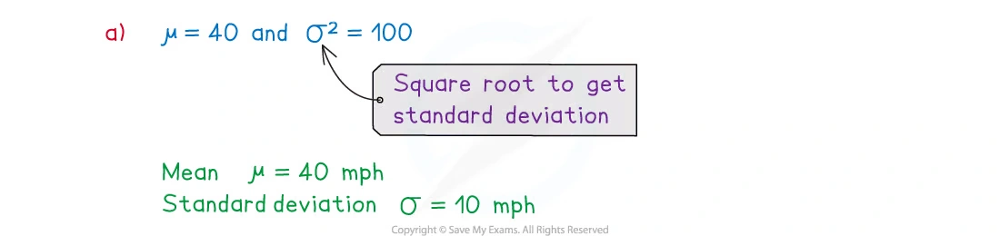
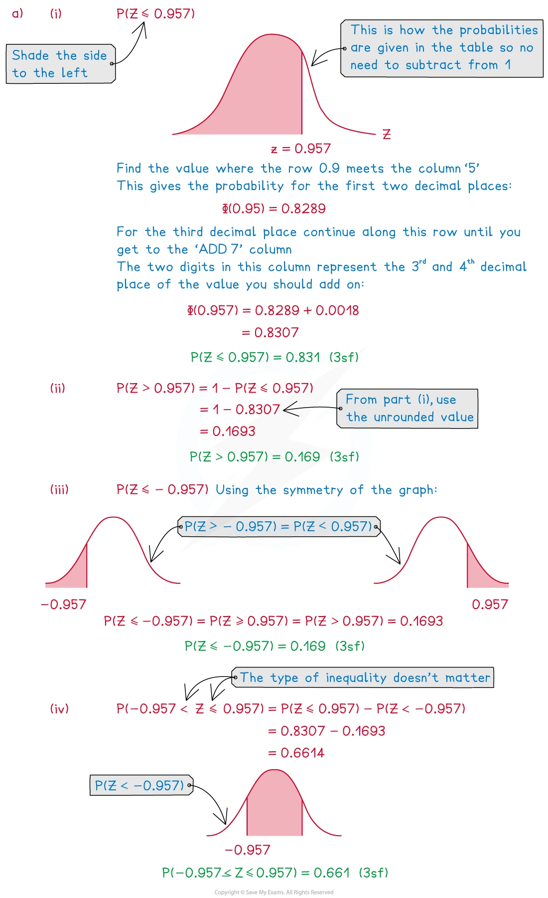
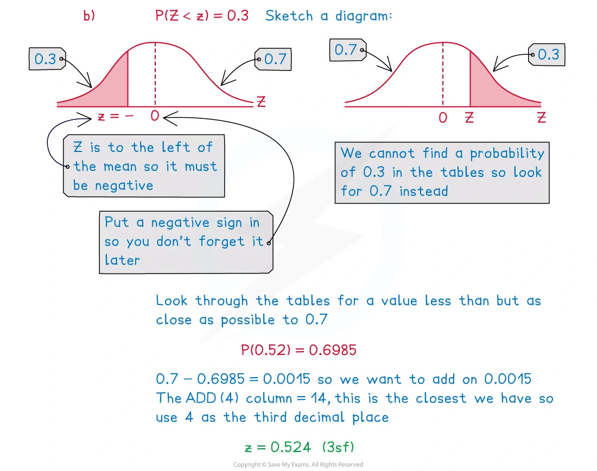
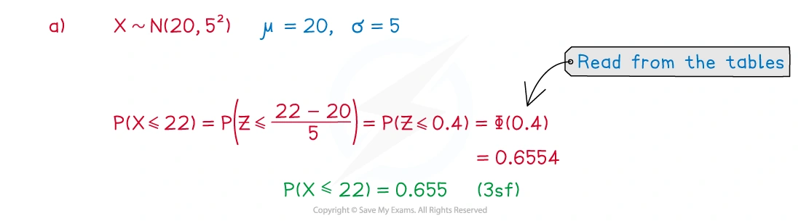
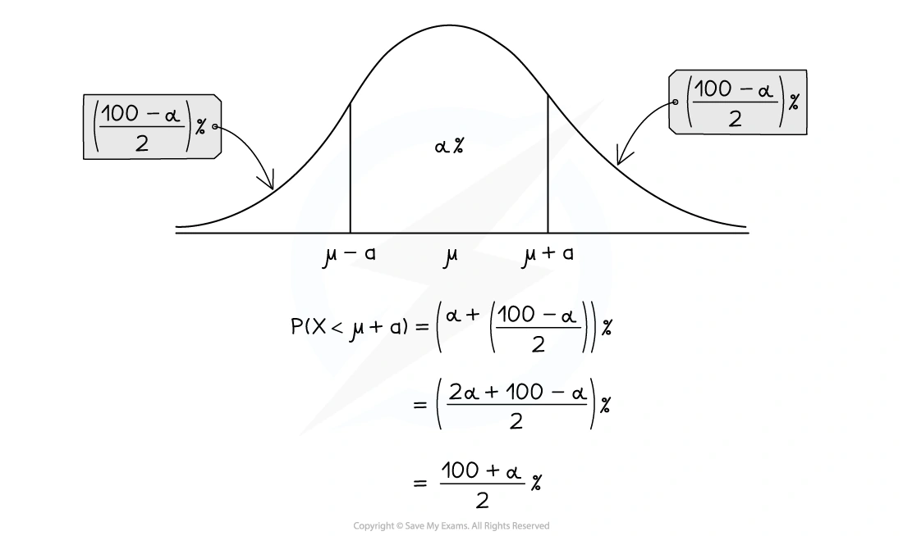
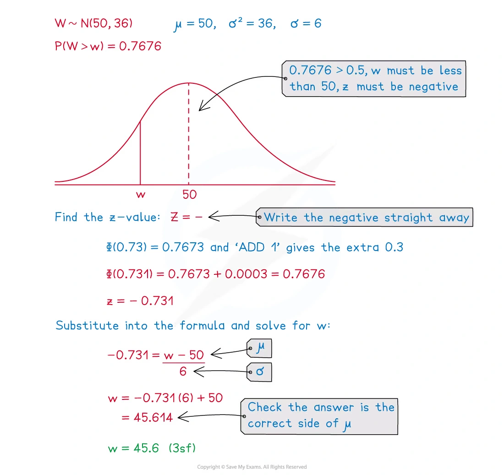
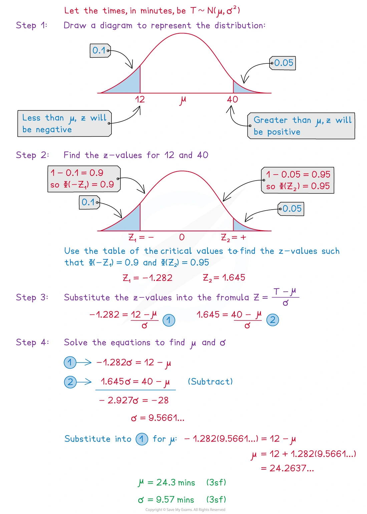
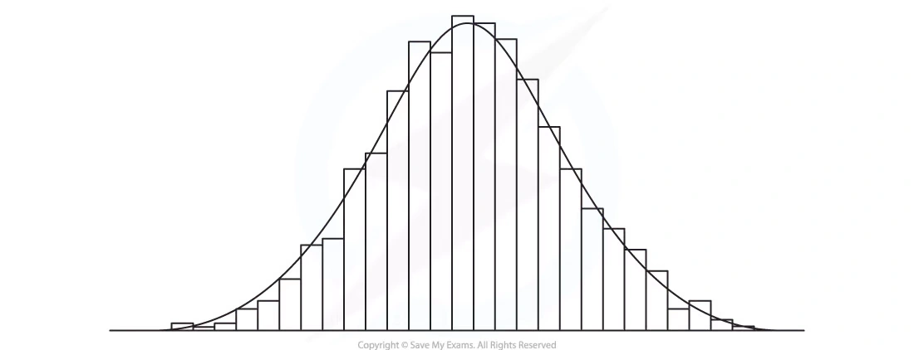
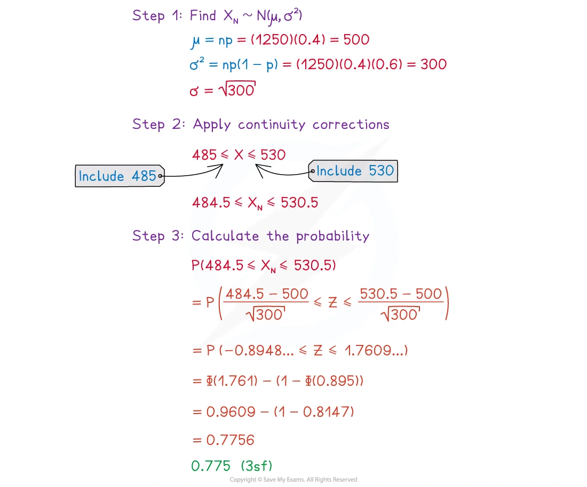

::: {.callout-important}
## 本节考纲要求

本页依据 9709 Mathematics 2026–2027 syllabus 5.5，覆盖：

- 用正态分布模拟连续随机变量，并使用正态分布表；
- 对 $X\sim N(\mu,\sigma^2)$ 求概率，或由给定概率反求未知的 $x$、$\mu$ 或 $\sigma$；
- 记住二项分布作正态近似的条件：$n$ 足够大，且 $np>5$、$nq>5$，其中 $q=1-p$；
- 使用 continuity correction。

真题均来自本地原始 QP，并与对应 mark scheme 核对；题目保持原文，不改写或编造。
:::

## Learning objectives

::: {.study-card}

- [ ] 正确解释 $X\sim N(\mu,\sigma^2)$：第二个参数是 variance，不是 standard deviation
- [ ] 用 $z=\dfrac{x-\mu}{\sigma}$ 把任意正态分布标准化为 $Z\sim N(0,1)$
- [ ] 从表中读取 $\Phi(z)=P(Z\le z)$，并处理右尾、负值和区间概率
- [ ] 由概率反查 $z$，再用 $x=\mu+z\sigma$ 或 $z=\dfrac{x-\mu}{\sigma}$ 求未知量
- [ ] 由两个概率建立两个标准化方程，求未知的 $\mu$ 与 $\sigma$
- [ ] 用 $Y\sim B(n,p)$ 的 $np$、$npq$ 建立正态近似，并使用 continuity correction

:::

## 1. Core knowledge

### Normal model and notation

连续随机变量的取值可以落在一个区间内。若其分布近似对称、单峰、钟形，且总体足够大，常可用正态分布建模：

$$
X\sim N(\mu,\sigma^2),
$$

其中 $\mu$ 是 mean，$\sigma^2$ 是 variance，$\sigma$ 是 standard deviation。注意：若题目给出 $N(\mu,100)$，则 standard deviation 是 $\sqrt{100}=10$，不是 $100$。

正态曲线关于 $\mu$ 对称，因此

$$
P(X<\mu)=P(X>\mu)=0.5.
$$

### Standardisation

把 $X$ 转成标准正态变量 $Z$：

$$
Z=\frac{X-\mu}{\sigma},\qquad Z\sim N(0,1).
$$

正态分布表给出

$$
\Phi(z)=P(Z\le z).
$$

因此

$$
P(X\le x)=\Phi\!\left(\frac{x-\mu}{\sigma}\right),
$$

$$
P(X>x)=1-\Phi\!\left(\frac{x-\mu}{\sigma}\right),
$$

$$
P(a<X<b)=\Phi\!\left(\frac{b-\mu}{\sigma}\right)-
\Phi\!\left(\frac{a-\mu}{\sigma}\right).
$$

连续分布中单点概率为 $0$，所以 $P(X\le x)=P(X<x)$。

### Reading the normal table

常用对称性：

$$
\Phi(-z)=1-\Phi(z),
$$

所以负的 $z$ 值通常先查正的 $z$ 值，再用 $1-$该结果。区间概率必须先画出左右边界和阴影方向，避免把左尾、右尾混淆。

例如，若 $z=0.957$，则

$$
\Phi(0.957)=0.8307,
$$

$$
P(Z>0.957)=1-0.8307=0.1693,
$$

$$
P(-0.957<Z\le0.957)=0.8307-0.1693=0.6614.
$$

### Inverse normal problems

若给出概率，先用表反查相应的 $z$ 值，再代回

$$
z=\frac{x-\mu}{\sigma}
\quad\text{or}\quad
x=\mu+z\sigma.
$$

如果概率大于 $0.5$，相应的 $z$ 通常在均值右侧为正；如果概率小于 $0.5$，相应的 $z$ 通常为负。画草图可以确定不等号方向。

若要由两个概率求 $\mu$ 和 $\sigma$，分别写出两个标准化方程，然后消元。例如

$$
\frac{x_1-\mu}{\sigma}=z_1,
\qquad
\frac{x_2-\mu}{\sigma}=z_2.
$$

### Normal approximation to a binomial distribution

若 $Y\sim B(n,p)$，令 $q=1-p$。当 $n$ 足够大、$np>5$ 且 $nq>5$ 时，可以用

$$
Y\approx N(np,npq)
$$

作近似。这里 $npq$ 是 approximating normal distribution 的 variance。

二项分布是离散的，正态分布是连续的，所以需要 continuity correction：

$$
P(Y=k)\approx P(k-0.5<X<k+0.5),
$$

$$
P(Y\le k)\approx P(X<k+0.5),
$$

$$
P(Y\ge k)\approx P(X>k-0.5),
$$

$$
P(a\le Y\le b)\approx P(a-0.5<X<b+0.5).
$$

## 2. Note worked examples

每个 worked example 单独成卡片；图片均由原始 `3. Statistical Distributions.pdf` 的内嵌资源独立提取，不使用页面截图。

::: {.worked-example}
### Worked example 1 · Modelling with a normal distribution

The random variable $X$ represents the speeds (mph) of a certain species of cheetahs when they run. The variable is modelled using $N(40,100)$.

(a) Write down the mean and standard deviation of the running speeds of cheetahs.

(b) State the two assumptions that have been made in order to use this model.

Since the second parameter is the variance,

$$
\mu=40,\qquad \sigma^2=100,
$$

so

$$
\boxed{\mu=40\text{ mph},\qquad \sigma=10\text{ mph}}.
$$

The model assumes that the distribution of speeds is **symmetrical** and **bell-shaped**.

{.note-figure}
:::

::: {.worked-example}
### Worked example 2 · Standard normal probabilities

By sketching a graph and using the table of the normal distribution, find:

(i) $P(Z\le0.957)$

(ii) $P(Z>0.957)$

(iii) $P(Z\le-0.957)$

(iv) $P(-0.957<Z\le0.957)$

Also find the value of $z$ such that $P(Z<z)=0.3$.

From the table, $\Phi(0.957)=0.8307$. Therefore,

$$
P(Z\le0.957)=\boxed{0.8307},
$$

$$
P(Z>0.957)=1-0.8307=\boxed{0.1693},
$$

$$
P(Z\le-0.957)=1-0.8307=\boxed{0.1693},
$$

$$
P(-0.957<Z\le0.957)=0.8307-0.1693=\boxed{0.6614}.
$$

For $P(Z<z)=0.3$, use symmetry: the corresponding positive left-tail probability is $0.7$. The table gives $z=0.524$ for $P(Z<z)=0.7$, so the required value is

$$
\boxed{z=-0.524}.
$$

{.note-figure}

{.note-figure}
:::

::: {.worked-example}
### Worked example 3 · Calculating normal probabilities

The random variable $X\sim N(20,5^2)$. Calculate:

(a) $P(X\le22)$

(b) $P(18\le X<27)$

For (a),

$$
P(X\le22)=P\left(Z\le\frac{22-20}{5}\right)=P(Z\le0.4)
$$

$$
=\Phi(0.4)=\boxed{0.6554}.
$$

For (b),

$$
\begin{aligned}
P(18\le X<27)
&=P\left(-0.4\le Z<1.4\right)\\
&=\Phi(1.4)-\Phi(-0.4)\\
&=0.9192-(1-0.6554)\\
&=\boxed{0.5746}.
\end{aligned}
$$

{.note-figure}
:::

::: {.worked-example}
### Worked example 4 · Inverse normal distribution

The random variable $W\sim N(50,36)$. Find the value of $w$ such that $P(W>w)=0.7676$.

Since the right-tail probability is greater than $0.5$, $w$ is below the mean. Thus

$$
P(W\le w)=1-0.7676=0.2324.
$$

From the normal table, the corresponding value is $z\approx-0.731$. Hence

$$
\frac{w-50}{6}=-0.731
$$

and

$$
w=50-0.731(6)=\boxed{45.6\text{ (3 s.f.)}}.
$$

{.note-figure}

{.note-figure}
:::

::: {.worked-example}
### Worked example 5 · Finding $\mu$ and $\sigma$

It is known that the times, in minutes, taken by students at a school to eat their lunch can be modelled as a normal distribution with mean $\mu$ minutes and standard deviation $\sigma$ minutes. Given that 10% of students take less than 12 minutes and 5% take more than 40 minutes, find $\mu$ and $\sigma$.

The critical values are

$$
\frac{12-\mu}{\sigma}=-1.282,
\qquad
\frac{40-\mu}{\sigma}=1.645.
$$

Therefore

$$
12-\mu=-1.282\sigma,
\qquad
40-\mu=1.645\sigma.
$$

Subtracting gives

$$
28=(1.645+1.282)\sigma
\implies \sigma\approx9.57.
$$

Then

$$
\mu=12+1.282(9.57)\approx24.3.
$$

Hence

$$
\boxed{\mu=24.3\text{ min},\qquad \sigma=9.57\text{ min}}.
$$

{.note-figure}
:::

::: {.worked-example}
### Worked example 6 · Normal approximation to a binomial distribution

In a population of cows, the masses of the cows can be modelled using a normal distribution with mean $550$ kg and standard deviation $80$ kg. A farmer classifies cows as beefy if they weigh more than $700$ kg. The farmer takes a random sample of 10 cows. Find the probability that at most one cow is beefy.

For one cow,

$$
P(\text{beefy})=P(X>700)=P\left(Z>\frac{700-550}{80}\right)=P(Z>1.875)
$$

$$
=1-\Phi(1.875)\approx0.0307.
$$

Let $Y$ be the number of beefy cows in the sample. Then $Y\sim B(10,0.0307)$, so

$$
\begin{aligned}
P(Y\le1)
&=P(Y=0)+P(Y=1)\\
&=(0.9693)^{10}+10(0.0307)(0.9693)^9\\
&\approx\boxed{0.965\text{ (3 s.f.)}}.
\end{aligned}
$$

{.note-figure}
:::

::: {.worked-example}
### Worked example 7 · Continuity correction

The random variable $X\sim B(1250,0.4)$. Use a suitable approximating distribution to approximate $P(485\le X\le530)$.

The conditions for a normal approximation hold. The approximating distribution has

$$
\mu=np=1250(0.4)=500,
$$

$$
\sigma^2=npq=1250(0.4)(0.6)=300.
$$

Apply continuity correction:

$$
P(485\le X\le530)\approx P(484.5<X<530.5).
$$

Thus

$$
\begin{aligned}
P(484.5<X<530.5)
&=P\left(\frac{484.5-500}{\sqrt{300}}<Z<\frac{530.5-500}{\sqrt{300}}\right)\\
&=P(-0.895<Z<1.761)\\
&\approx\boxed{0.775}.
\end{aligned}
$$

{.note-figure}
:::

## 3. Verified Paper 5 questions

以下题组保持原始题干、全部小问和原始分值；答案按对应 mark scheme 的得分路径展开。

::: {.question-card #p5-normal-q01}
### Question 1 · 9709/51/M/J/20 Q6(a–b)

The lengths of female snakes of a particular species are normally distributed with mean 54 cm and standard deviation 6.1 cm.

(a) Find the probability that a randomly chosen female snake of this species has length between 50 cm and 60 cm. **[4]**

The lengths of male snakes of this species also have a normal distribution. A scientist measures the lengths of a random sample of 200 male snakes of this species. He finds that 32 have lengths less than 45 cm and 17 have lengths more than 56 cm.

(b) Find estimates for the mean and standard deviation of the lengths of male snakes of this species. **[5]**

Show detailed mark scheme answer

(a) Let $X$ be the female snake length. Standardise both endpoints:

$$
P(50<X<60)=P\left(\frac{50-54}{6.1}<Z<\frac{60-54}{6.1}\right)
=P(-0.6557<Z<0.9836).
$$

Hence

$$
P=\Phi(0.9836)-\Phi(-0.6557)
=0.8375+0.7441-1
=\boxed{0.582}.
$$

(b) For the male distribution, $P(X<45)=32/200=0.16$, so $z=-0.994$. Also $P(X<56)=1-17/200=0.915$, so $z=1.372$:

$$
\frac{45-\mu}{\sigma}=-0.994,
\qquad
\frac{56-\mu}{\sigma}=1.372.
$$

Subtracting,

$$
\frac{11}{\sigma}=2.366
\implies \sigma=4.65.
$$

Then $45-\mu=-0.994(4.65)$, giving

$$
\boxed{\mu=49.6\text{ cm},\qquad \sigma=4.65\text{ cm}}.
$$

<strong>Source:</strong> PastPaper/2020/2020/9709-s20-qp-51.pdf, Q6(a–b), with the corresponding 9709/51/M/J/20 mark scheme.

:::

::: {.question-card #p5-normal-q02}
### Question 2 · 9709/52/O/N/20 Q3(a–c)

Pia runs 2 km every day and her times in minutes are normally distributed with mean 10.1 and standard deviation 1.3.

(a) Find the probability that on a randomly chosen day Pia takes longer than 11.3 minutes to run 2 km. **[3]**

(b) On 75% of days, Pia takes longer than $t$ minutes to run 2 km. Find the value of $t$. **[3]**

(c) On how many days in a period of 90 days would you expect Pia to take between 8.9 and 11.3 minutes to run 2 km? **[3]**

Show detailed mark scheme answer

(a)

$$
P(X>11.3)=P\left(Z>\frac{11.3-10.1}{1.3}\right)
=P(Z>0.9231)
$$

$$
=1-\Phi(0.9231)=1-0.8221=\boxed{0.1779\text{ (3 s.f.)}}.
$$

(b) Since $P(X>t)=0.75$, $P(X<t)=0.25$, so $z=-0.674$:

$$
\frac{t-10.1}{1.3}=-0.674
\implies t=10.1-0.674(1.3)=\boxed{9.22\text{ min}}.
$$

(c) The interval is symmetric about the mean, and the upper tail is the probability from (a):

$$
P(8.9<X<11.3)=1-2(0.1779)=0.6442.
$$

Expected number $=90(0.6442)=57.98$, so the answer is

$$
\boxed{58\text{ days}}.
$$

The mark scheme accepts 57 or 58 days because this is an expected count.

<strong>Source:</strong> PastPaper/2020/2020/9709_w20_qp_52.pdf, Q3(a–c), with the corresponding 9709/52/O/N/20 mark scheme.

:::

::: {.question-card #p5-normal-q03}
### Question 3 · 9709/53/O/N/21 Q4(a–c)

Raj wants to improve his fitness, so every day he goes for a run. The times, in minutes, of his runs have a normal distribution with mean 41.2 and standard deviation 3.6.

(a) Find the probability that on a randomly chosen day Raj runs for more than 43.2 minutes. **[3]**

(b) Find an estimate for the number of days in a year (365 days) on which Raj runs for less than 43.2 minutes. **[2]**

(c) On 95% of days, Raj runs for more than $t$ minutes. Find the value of $t$. **[3]**

Show detailed mark scheme answer

(a)

$$
P(X>43.2)=P\left(Z>\frac{43.2-41.2}{3.6}\right)
=P(Z>0.5556)
$$

$$
=1-\Phi(0.5556)=1-0.7108=\boxed{0.289\text{ (3 s.f.)}}.
$$

(b)

$$
P(X<43.2)=1-0.2892=0.7108.
$$

$$
365(0.7108)=259.4,
$$

so an estimated number of days is

$$
\boxed{259\text{ days}}
$$

with 260 also accepted by the mark scheme.

(c) $P(X>t)=0.95$, so $t$ is below the mean and the relevant critical value is $z=-1.645$:

$$
\frac{t-41.2}{3.6}=-1.645
\implies t=41.2-1.645(3.6)=\boxed{35.3\text{ min}}.
$$

<strong>Source:</strong> PastPaper/2021/2021/9709_w21_qp_53.pdf, Q4(a–c), with the corresponding 9709/53/O/N/21 mark scheme.

:::

::: {.question-card #p5-normal-q04}
### Question 4 · 9709/52/F/M/22 Q4(a–c)

The weights of male leopards in a particular region are normally distributed with mean 55 kg and standard deviation 6 kg.

(a) Find the probability that a randomly chosen male leopard from this region weighs between 46 and 62 kg. **[4]**

The weights of female leopards in this region are normally distributed with mean 42 kg and standard deviation $\sigma$ kg. It is known that 25% of female leopards in the region weigh less than 36 kg.

(b) Find the value of $\sigma$. **[3]**

The distributions of the weights of male and female leopards are independent of each other. A male leopard and a female leopard are each chosen at random.

(c) Find the probability that both the weights of these leopards are less than 46 kg. **[4]**

Show detailed mark scheme answer

(a)

$$
P(46<X<62)=P\left(-1.5<Z<\frac76\right)
$$

$$
=\Phi\left(\frac76\right)-\Phi(-1.5)
=0.8784+(0.9332-1)
=\boxed{0.812}.
$$

(b) Since $P(X<36)=0.25$, use $z=-0.674$:

$$
\frac{36-42}{\sigma}=-0.674
\implies \sigma=\frac6{0.674}=\boxed{8.9\text{ kg}}.
$$

(c) For a male leopard,

$$
P(M<46)=1-\Phi\left(\frac{46-55}{6}\right)=1-0.9332=0.0668.
$$

For a female leopard,

$$
P(F<46)=\Phi\left(\frac{46-42}{8.9}\right)=\Phi(0.449)=0.6732.
$$

Independence gives

$$
P(M<46\text{ and }F<46)=0.0668(0.6732)=\boxed{0.0450}.
$$

<strong>Source:</strong> PastPaper/2022/2022/9709_m22_qp_52.pdf, Q4(a–c), with the corresponding 9709/52/F/M/22 mark scheme.

:::

::: {.question-card #p5-normal-q05}
### Question 5 · 9709/52/O/N/22 Q2(a–b)

The lengths of the rods produced by a company are normally distributed with mean 55.6 mm and standard deviation 1.2 mm.

(a) In a random sample of 400 of these rods, how many would you expect to have length less than 54.8 mm? **[4]**

(b) Find the probability that a randomly chosen rod produced by this company has a length that is within half a standard deviation of the mean. **[3]**

Show detailed mark scheme answer

(a)

$$
P(X<54.8)=P\left(Z<\frac{54.8-55.6}{1.2}\right)=P(Z<-0.6667)
$$

$$
=1-\Phi(0.6667)=1-0.7477=0.2523.
$$

Expected number $=400(0.2523)=100.92$, hence

$$
\boxed{100\text{ or }101\text{ rods}}.
$$

(b) Within half a standard deviation of the mean standardises directly to $-0.5<Z<0.5$:

$$
P(\mu-0.5\sigma<X<\mu+0.5\sigma)=P(-0.5<Z<0.5).
$$

Therefore

$$
P=\Phi(0.5)-\Phi(-0.5)=2\Phi(0.5)-1
=2(0.6915)-1
=\boxed{0.383}.
$$

<strong>Source:</strong> PastPaper/2022/2022/9709_w22_qp_52.pdf, Q2(a–b), with the corresponding 9709/52/O/N/22 mark scheme.

:::

::: {.question-card #p5-normal-q06}
### Question 6 · 9709/52/M/J/23 Q5(a–c)

The lengths of Western bluebirds are normally distributed with mean 16.5 cm and standard deviation 0.6 cm.

A random sample of 150 of these birds is selected.

(a) How many of these 150 birds would you expect to have length between 15.4 cm and 16.8 cm? **[4]**

The lengths of Eastern bluebirds are normally distributed with mean 18.4 cm and standard deviation $\sigma$ cm. It is known that 72% of Eastern bluebirds have length greater than 17.1 cm.

(b) Find the value of $\sigma$. **[3]**

A random sample of 120 Eastern bluebirds is chosen.

(c) Use an approximation to find the probability that fewer than 80 of these 120 bluebirds have length greater than 17.1 cm. **[5]**

Show detailed mark scheme answer

(a)

$$
P(15.4<X<16.8)=P(-1.833<Z<0.5)
$$

$$
=0.6915+0.9666-1=0.6581.
$$

Expected number $=150(0.6581)=98.715$, so

$$
\boxed{98\text{ or }99\text{ birds}}.
$$

(b) $P(X>17.1)=0.72$ gives $z=-0.583$:

$$
\frac{17.1-18.4}{\sigma}=-0.583
\implies \sigma=\frac{1.3}{0.583}=\boxed{2.23\text{ cm}}.
$$

(c) Let $Y$ be the number of Eastern bluebirds with length greater than 17.1 cm. Then $Y\sim B(120,0.72)$, and

$$
\mu=np=86.4,\qquad \sigma^2=npq=120(0.72)(0.28)=24.192.
$$

The conditions for a normal approximation hold. Since fewer than 80 means $Y\le79$,

$$
P(Y<80)\approx P(X<79.5).
$$

Therefore

$$
P\left(Z<\frac{79.5-86.4}{\sqrt{24.192}}\right)
=P(Z<-1.403)
=1-\Phi(1.403)
=\boxed{0.0804}.
$$

<strong>Source:</strong> PastPaper/2023/2023/9709_s23_qp_52.pdf, Q5(a–c), with the corresponding 9709/52/M/J/23 mark scheme.

:::

::: {.question-card #p5-normal-q07}
### Question 7 · 9709/52/F/M/23 Q6(a–c)

In a cycling event the times taken to complete a course are modelled by a normal distribution with mean 62.3 minutes and standard deviation 8.4 minutes.

(a) Find the probability that a randomly chosen cyclist has a time less than 74 minutes. **[2]**

(b) Find the probability that 4 randomly chosen cyclists all have times between 50 and 74 minutes. **[4]**

In a different cycling event, the times can also be modelled by a normal distribution. 23% of the cyclists have times less than 36 minutes and 10% of the cyclists have times greater than 54 minutes.

(c) Find estimates for the mean and standard deviation of this distribution. **[5]**

Show detailed mark scheme answer

(a)

$$
P(X<74)=P\left(Z<\frac{74-62.3}{8.4}\right)=P(Z<1.393)=\boxed{0.918}.
$$

(b)

$$
P(50<X<74)=P(-1.464<Z<1.393)
$$

$$
=\Phi(1.464)+\Phi(1.393)-1
=0.9285+0.9182-1=0.8467.
$$

The four choices are independent, so

$$
P(\text{all four})=(0.8467)^4=\boxed{0.514\text{ (3 s.f.)}}.
$$

(c) For 23% below 36, $z_1=-0.739$. For 10% above 54, 90% are below 54, so $z_2=1.282$:

$$
\frac{36-\mu}{\sigma}=-0.739,
\qquad
\frac{54-\mu}{\sigma}=1.282.
$$

Subtracting,

$$
18=(0.739+1.282)\sigma
\implies \sigma=8.91.
$$

Then

$$
\mu=36+0.739(8.91)=42.6.
$$

Hence

$$
\boxed{\mu=42.6\text{ min},\qquad \sigma=8.91\text{ min}}.
$$

<strong>Source:</strong> PastPaper/2023/2023/9709_m23_qp_52.pdf, Q6(a–c), with the corresponding 9709/52/F/M/23 mark scheme.

:::

::: {.question-card #p5-normal-q08}
### Question 8 · 9709/51/M/J/24 Q2(a–b)

The lengths of the tails of adult raccoons of a certain species are normally distributed with mean 28 cm and standard deviation 3.3 cm.

(a) Find the probability that a randomly chosen adult raccoon of this species has a tail length between 23 cm and 35 cm. **[4]**

The masses of adult raccoons of this species are normally distributed with mean 8.5 kg and standard deviation $\sigma$ kg. 75% of adult raccoons of this species have mass greater than 7.6 kg.

(b) Find the value of $\sigma$. **[3]**

Show detailed mark scheme answer

(a)

$$
P(23<X<35)=P\left(\frac{23-28}{3.3}<Z<\frac{35-28}{3.3}\right)
=P(-1.515<Z<2.121).
$$

$$
P=\Phi(2.121)-\Phi(-1.515)
=0.9830-(1-0.9347)
=\boxed{0.9177\text{ (approximately)}}.
$$

(b) Since $P(X>7.6)=0.75$, the corresponding left-tail probability is $0.25$, so $z=-0.674$:

$$
\frac{7.6-8.5}{\sigma}=-0.674
\implies \sigma=\frac{0.9}{0.674}=\boxed{1.33\text{ kg}}.
$$

<strong>Source:</strong> PastPaper/2024/2024/qp-202406-mathematics-p51.pdf, Q2(a–b), with the corresponding 9709/51/M/J/24 mark scheme.

:::

::: {.question-card #p5-normal-q09}
### Question 9 · 9709/51/O/N/24 Q5(a–b)

The weights of the green apples sold by a shop are normally distributed with mean 90 grams and standard deviation 8 grams.

(a) Find the probability that a randomly chosen green apple weighs between 83 grams and 95 grams. **[4]**

The shop also sells red apples. 60% of the red apples sold by the shop weigh more than 80 grams. 160 red apples are chosen at random.

Use a suitable approximation to find the probability that fewer than 105 of the chosen red apples weigh more than 80 grams. **[5]**

Show detailed mark scheme answer

(a)

$$
P(83<X<95)=P(-0.875<Z<0.625)
$$

$$
=\Phi(0.625)+\Phi(0.875)-1
=0.7340+0.8092-1
=\boxed{0.543}.
$$

(b) Let $Y$ be the number of red apples weighing more than 80 grams. Then $Y\sim B(160,0.6)$. The normal approximation has

$$
\mu=np=96,\qquad \sigma^2=npq=160(0.6)(0.4)=38.4.
$$

The approximation is suitable since $np=96>5$ and $nq=64>5$. Fewer than 105 means $Y\le104$, so apply continuity correction:

$$
P(Y<105)\approx P(X<104.5).
$$

Hence

$$
P\left(Z<\frac{104.5-96}{\sqrt{38.4}}\right)
=P(Z<1.372)
=\Phi(1.372)
=\boxed{0.915}.
$$

<strong>Source:</strong> PastPaper/2024/2024/qp-202410-mathematics-p51.pdf, Q5(a–b), with the corresponding 9709/51/O/N/24 mark scheme.

:::

::: {.question-card #p5-normal-q10}
### Question 10 · 9709/52/O/N/24 Q4(a–b)

The heights, in metres, of white pine trees are normally distributed with mean 19.8 and standard deviation 2.4.

In a certain forest there are 450 white pine trees.

(a) How many of these trees would you expect to have height less than 18.2 metres? **[4]**

The heights, in metres, of red pine trees are normally distributed with mean 23.4 and standard deviation $\sigma$. It is known that 26% of red pine trees have height greater than 25.5 metres.

(b) Find the value of $\sigma$. **[3]**

Show detailed mark scheme answer

(a)

$$
P(X<18.2)=P\left(Z<\frac{18.2-19.8}{2.4}\right)=P(Z<-0.6667)
$$

$$
=1-\Phi(0.6667)=1-0.7477=0.2523.
$$

Expected number $=450(0.2523)=113.5$, so

$$
\boxed{113\text{ or }114\text{ trees}}.
$$

(b) Since $P(X>25.5)=0.26$, the corresponding standard normal value is $z=0.643$:

$$
\frac{25.5-23.4}{\sigma}=0.643
\implies \sigma=\frac{2.1}{0.643}=\boxed{3.27\text{ m}}.
$$

<strong>Source:</strong> PastPaper/2024/2024/qp-202410-mathematics-p52.pdf, Q4(a–b), with the corresponding 9709/52/O/N/24 mark scheme.

:::

::: {.question-card #p5-normal-q11}
### Question 11 · 9709/53/O/N/24 Q3(a–b)

In Molimba, the heights, in cm, of adult males are normally distributed with mean 176 cm and standard deviation 4.8 cm.

(a) Find the probability that a randomly chosen adult male in Molimba has a height greater than 170 cm. **[3]**

60% of adult males in Molimba have a height between 170 cm and $k$ cm, where $k$ is greater than 170.

(b) Find the value of $k$, giving your answer correct to 1 decimal place. **[4]**

Show detailed mark scheme answer

(a)

$$
P(X>170)=P\left(Z>\frac{170-176}{4.8}\right)
=P(Z>-1.25)=\Phi(1.25)
=\boxed{0.894}.
$$

(b) From (a),

$$
P(X<170)=1-0.8944=0.1056.
$$

The probability below $k$ is therefore

$$
P(X<k)=0.1056+0.6=0.7056.
$$

The table gives $z=0.541$, so

$$
\frac{k-176}{4.8}=0.541
\implies k=176+4.8(0.541)=\boxed{178.6\text{ cm}}.
$$

<strong>Source:</strong> PastPaper/2024/2024/qp-202410-mathematics-p53.pdf, Q3(a–b), with the corresponding 9709/53/O/N/24 mark scheme.

:::

::: {.callout-note}
## Exam checklist

1. 写出 $X\sim N(\mu,\sigma^2)$ 后，标准化分母使用 $\sigma$，不是 $\sigma^2$。
2. 右尾要用 $1-\Phi(z)$；负的 $z$ 值要结合对称性处理。
3. 反查概率时先画草图，确认取正的还是负的 critical value。
4. 二项分布正态近似要写出 $np$、$npq$，并检查 $np>5$、$nq>5$。
5. 离散到连续一定做 continuity correction，例如 $Y<105$ 对应 $X<104.5$。
:::
