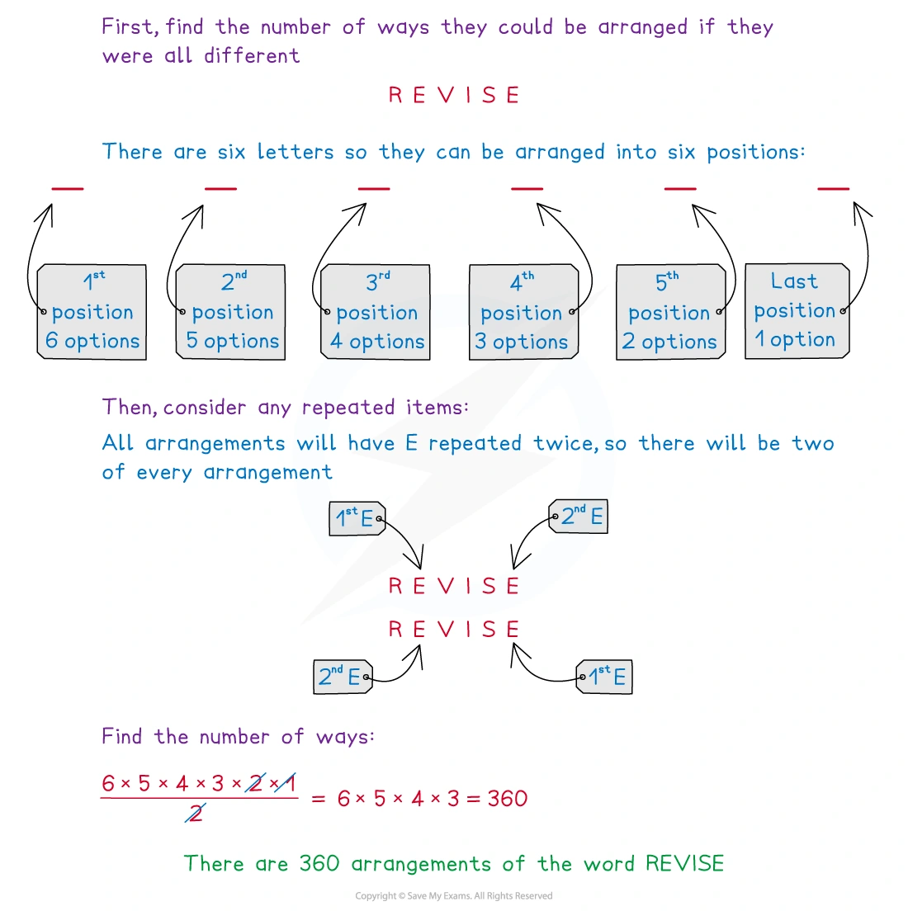
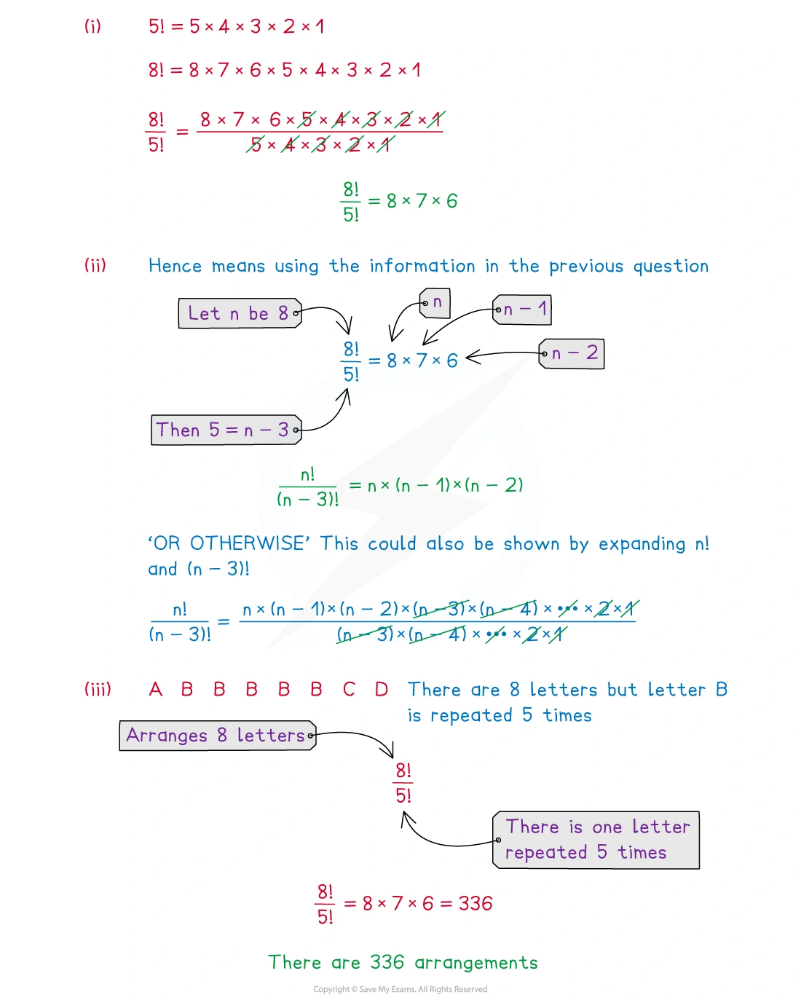
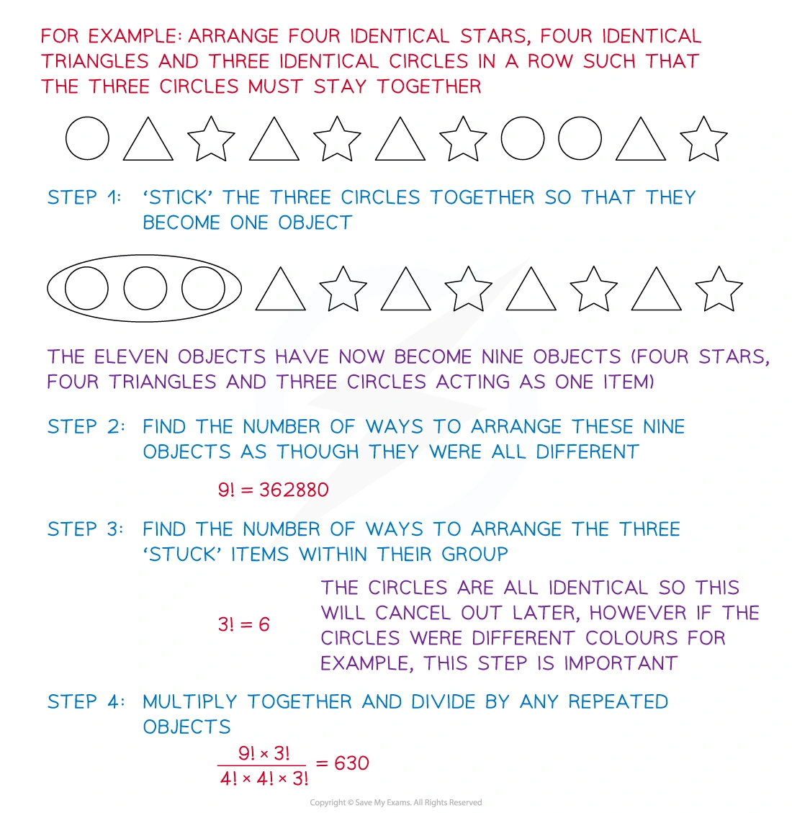
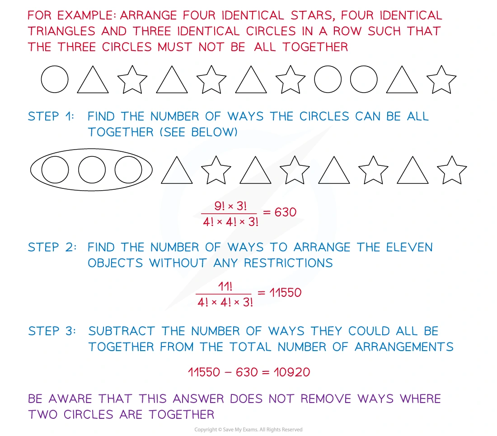
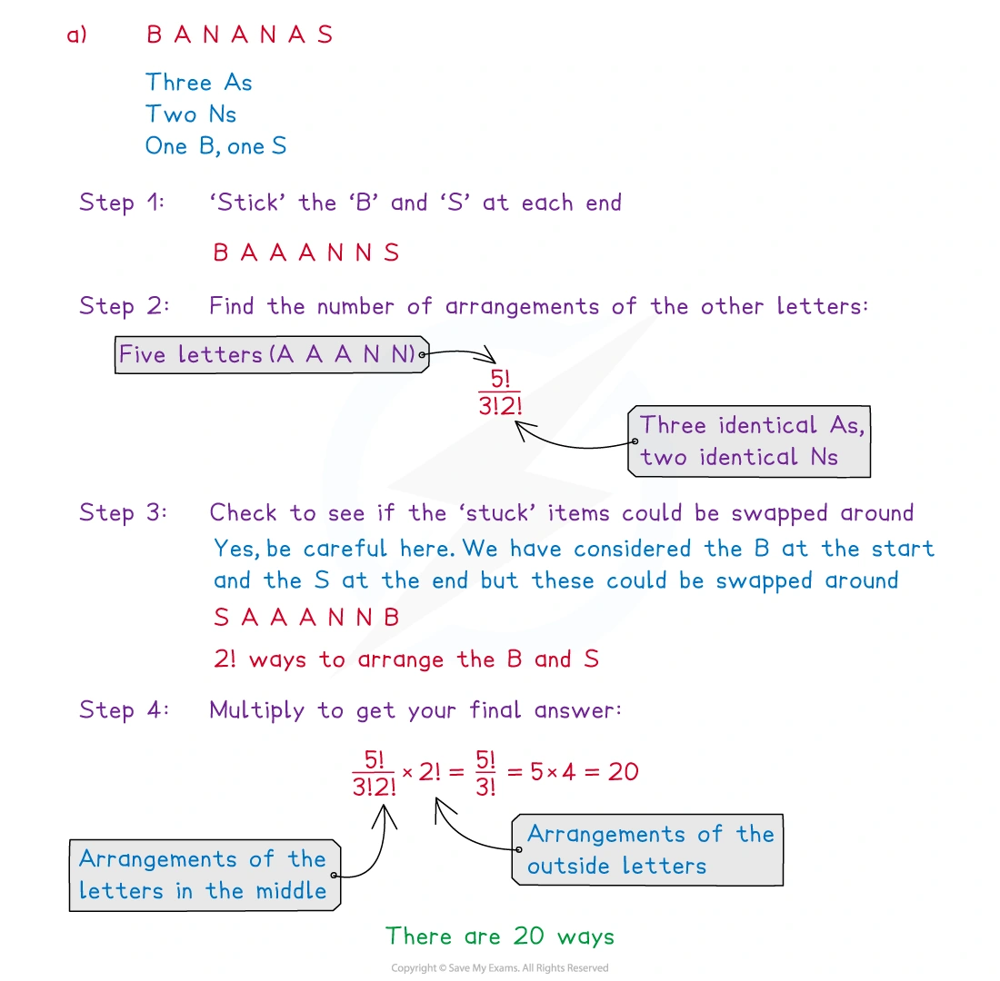
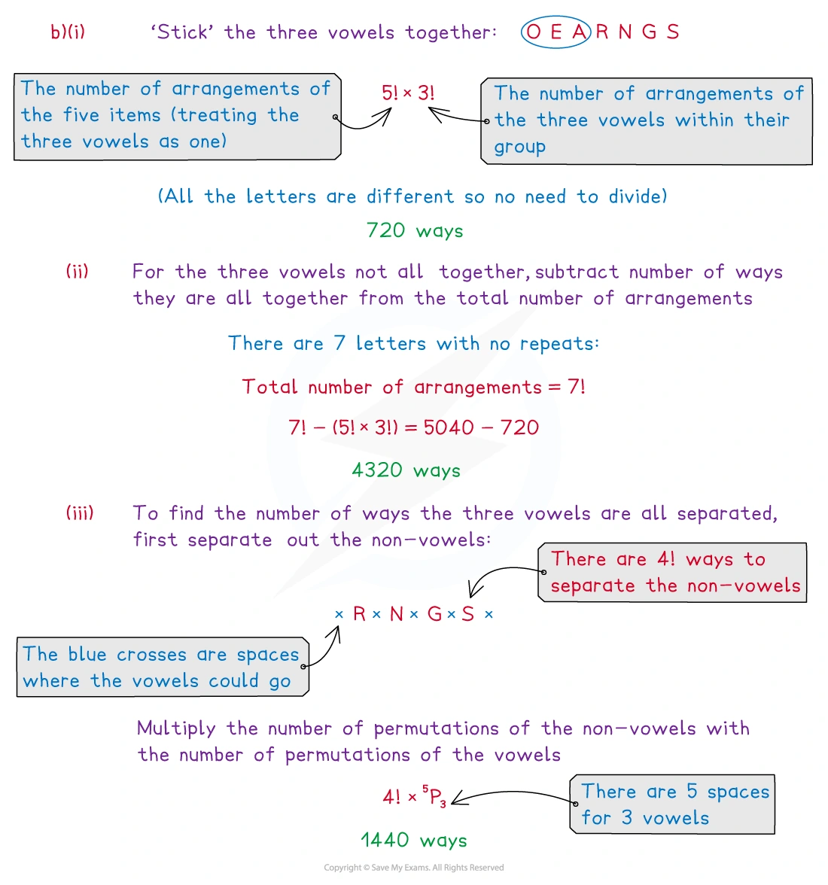
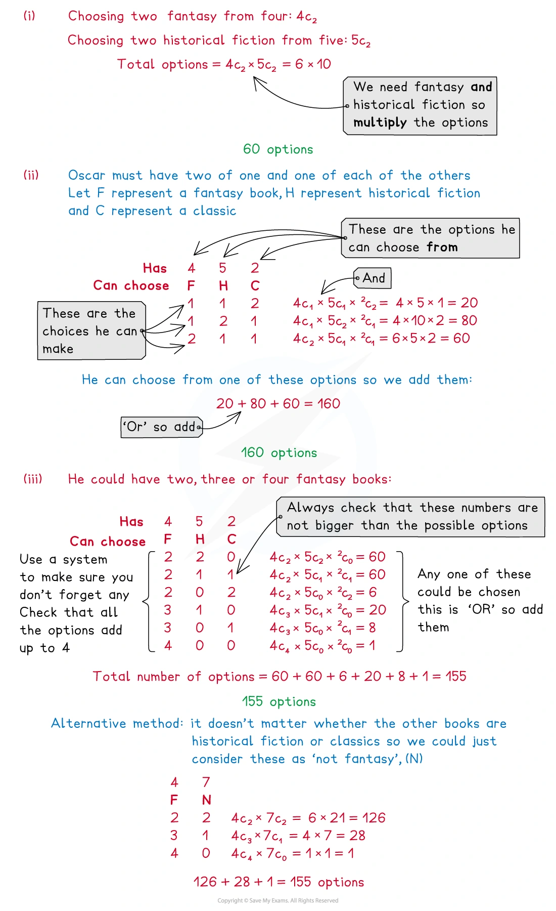

::: {.callout-important}
## 本节考纲要求

本页依据 9709 Mathematics 2026–2027 syllabus 5.2，覆盖：

- understand the terms permutation and combination and solve simple problems involving selections;
- arrangements of objects in a line, including arrangements with repetition;
- arrangements with restrictions, such as objects that must or must not stand next to each other;
- use permutations and combinations in selection problems with conditions such as at least, at most and exactly.

本考纲不要求 circular arrangements。本页真题均来自本地原始 QP，并与对应 mark scheme 核对；题目保持原文，不改写或编造。
:::

## Learning objectives

::: {.study-card}

- [ ] 用乘法原理和阶乘计算不同对象的线性排列
- [ ] 识别重复对象，并用重复次数的阶乘除去重复计数
- [ ] 区分 permutation（顺序重要）与 combination（只选择，顺序不重要）
- [ ] 正确使用 ${}^nP_r$ 和 ${}^nC_r$，处理 at least、at most、exactly
- [ ] 用 block method、补集和 gaps method 处理相邻、分离、固定位置等限制

:::

## 1. Core knowledge

### Factorials and the multiplication principle

$$
n!=n(n-1)(n-2)\cdots 2\times1,
\qquad 0!=1.
$$

排列一行中的 $n$ 个不同对象时，第一格有 $n$ 种选择，第二格有 $n-1$ 种，依此类推，因此总数是

$$
n(n-1)\cdots1=n!.
$$

如果有一个对象重复 $r$ 次，先把它们暂时标记为不同对象会把同一排列重复计算 $r!$ 次，所以

$$
\text{different arrangements}=
\frac{n!}{r!}.
$$

若有多个重复组，则分别除以各组的阶乘：

$$
\frac{n!}{r!s!\cdots}.
$$

### Permutations

Permutation 是有顺序的排列或有顺序的选择。由 $n$ 个不同对象取出并排列 $r$ 个：

$$
{}^nP_r=n(n-1)\cdots(n-r+1)
=\frac{n!}{(n-r)!}.
$$

例如，$5$ 个不同对象中取 $3$ 个排成一行是

$$
{}^5P_3=5\times4\times3=60.
$$

### Combinations

Combination 是选择，顺序不重要。由 $n$ 个不同对象选 $r$ 个：

$$
{}^nC_r=\binom nr=\frac{n!}{r!(n-r)!}.
$$

排列与组合的关系是

$$
{}^nP_r=r!\,{}^nC_r.
$$

因为每一个选出的 $r$ 个对象还可以有 $r!$ 种排列。

常用对称性：

$$
\binom nr=\binom n{n-r},
\qquad
\binom n0=\binom nn=1.
$$

### Restrictions in arrangements

**必须相邻 / together：** 把必须相邻的对象视为一个 block，先排 block 和其他对象；如果 block 内部还有不同排列，再乘上 block 内部的排列数。

**不能相邻 / not together：** 常用

$$
\text{required}=
\text{all arrangements}-\text{arrangements in which the objects are together}.
$$

若要求若干对象完全分离，可先排列其他对象，再利用两端和对象之间的 gaps 放入受限制对象。若有 $m$ 个 gaps，要放入 $r$ 个不同对象，通常会出现

$$
\binom mr r!={}^{m}P_r.
$$

### Restrictions in selections

“and”通常表示相乘，“or”表示把互斥情形相加。例如从不同类别中各选一些：

$$
\binom ab\binom cd
$$

表示先从第一类选，再从第二类选。遇到 at least、at most、exactly，要列出所有可能的类别数量，避免遗漏或重复。

### 题目检查清单

1. 是 arrangement 还是 selection？顺序是否重要？
2. 对象是否有相同字母/数字？先写出每组重复次数。
3. “together” 是否可以作为 block？“not together” 能否用补集？
4. 固定首尾或固定位置后，剩余对象数量是否改变？
5. 题目若要求 probability，分母必须与随机选择/随机排列的样本空间一致。

## 2. Note worked examples

每个 worked example 单独成卡片；以下图片均由原始 `2. Probability.pdf` 的内嵌图像独立提取。

::: {.worked-example}
### Worked example 1 · Repeated letters: REVISE

By considering the number of options for each position, find the number of different arrangements of the letters in the word REVISE.

There are six letters, so if all were different there would be

$$
6\times5\times4\times3\times2\times1=6!.
$$

The two Es are identical, so each arrangement has been counted twice. Therefore

$$
\frac{6!}{2!}=\boxed{360}.
$$

{.note-figure}
:::

::: {.worked-example}
### Worked example 2 · Factorials and repeated objects

(i) Show, by writing $8!$ and $5!$ in their full form and cancelling, that

$$
\frac{8!}{5!}=8\times7\times6.
$$

(ii) Hence, simplify

$$
\frac{n!}{(n-3)!}.
$$

(iii) The letters A, B, B, B, B, B, C and D are arranged in a row. How many different ways are there to arrange the 8 letters in a row?

For (i),

$$
\frac{8!}{5!}
=\frac{8\times7\times6\times5!}{5!}
=8\times7\times6.
$$

For (ii),

$$
\frac{n!}{(n-3)!}
=\frac{n(n-1)(n-2)(n-3)!}{(n-3)!}
=n(n-1)(n-2).
$$
$$

For (iii), the B is repeated five times, so

$$
\frac{8!}{5!}=8\times7\times6=\boxed{336}.
$$

{.note-figure}
:::

::: {.worked-example}
### Worked example 3 · Block method with identical objects

Arrange four identical stars, four identical triangles and three identical circles in a row such that the three circles must stay together.

Treat the three circles as one block. There are now nine objects: the circle block, four stars and four triangles. Arrange these objects and divide by the repeated stars and triangles:

$$
\frac{9!}{4!4!}.
$$

The three circles are identical, so their internal $3!$ arrangements do not create new arrangements. Equivalently, including and cancelling that factor gives

$$
\frac{9!\times3!}{4!4!3!}
=\boxed{630}.
$$

{.note-figure}
:::

::: {.worked-example}
### Worked example 4 · Complement: objects not all together

Arrange four identical stars, four identical triangles and three identical circles in a row such that the three circles must not be all together.

The unrestricted number is

$$
\frac{11!}{4!4!3!}=11550.
$$

From Worked example 3, the number with all three circles together is $630$. Hence

$$
11550-630=\boxed{10920}.
$$

This subtraction removes only the arrangements in which all three circles are together, so arrangements with exactly two adjacent circles remain included.

{.note-figure}
:::

::: {.worked-example}
### Worked example 5 · Restricted ends: BANANAS

(a) How many ways are there to rearrange the letters in the word BANANAS if the B and the S must be at each end?

Place B and S at the two ends. The five middle letters are A, A, A, N, N:

$$
\frac{5!}{3!2!}\times2!=\boxed{20}.
$$

The factor $2!$ allows B and S to swap ends.

(b) How many ways are there to rearrange the letters in the word ORANGES if:

(i) the three vowels (A, E and O) must be together?

(ii) the three vowels must not all be together?

(iii) the three vowels must all be separated?

For (i), treat the three vowels as one block, then arrange the five objects and the vowels within the block:

$$
5!\times3!=\boxed{720}.
$$

For (ii), subtract the together case from the unrestricted arrangements:

$$
7!-5!\times3!=5040-720=\boxed{4320}.
$$

For (iii), arrange the four non-vowels in $4!$ ways. They create five gaps, and place the three distinct vowels in three of those gaps:

$$
4!\times{}^5P_3=4!\times5\times4\times3=\boxed{1440}.
$$

{.note-figure}
:::

::: {.worked-example}
### Worked example 6 · Separated objects and gaps

The key idea in a “must be separated” question is to arrange the unrestricted objects first. The spaces before, between and after them are then available for the restricted objects.

For example, after arranging four non-vowels, there are five gaps. Placing three distinct vowels into three different gaps gives

$$
{}^5P_3=\binom53 3!
$$

possibilities for the vowels, which is then multiplied by the $4!$ arrangements of the non-vowels.

This method ensures that no two of the three vowels occupy the same gap, so no two vowels are adjacent.

{.note-figure}
:::

::: {.worked-example}
### Worked example 7 · Combinations with conditions

Oscar has four fantasy books, five historical fiction books and two classics available. In how many ways can he choose:

(i) two fantasy books and two historical fiction books?

(ii) at least one of each type of book?

(iii) at least two fantasy books?

For (i),

$$
\binom42\binom52=6\times10=\boxed{60}.
$$

For (ii), the possible type-counts are $(1,1,2)$, $(1,2,1)$ and $(2,1,1)$, so

$$
\binom41\binom51\binom22
+\binom41\binom52\binom21
+\binom42\binom51\binom21
=20+80+60=\boxed{160}.
$$

For (iii), count the cases with two, three or four fantasy books:

$$
\binom42\binom72
+\binom43\binom71
+\binom44\binom70
=60+28+1=\boxed{155}.
$$

{.note-figure}
:::

## 3. Verified Paper 5 questions

以下题组保持原始题干、全部小问和原始分值；答案按对应 mark scheme 的得分路径展开。

::: {.question-card #p5-pc-q01}
### Question 1 · 9709/51/M/J/20 Q2(a–b)

(a) Find the number of different arrangements that can be made from the 9 letters of the word JEWELLERY in which the three Es are together and the two Ls are together. **[2]**

(b) Find the number of different arrangements that can be made from the 9 letters of the word JEWELLERY in which the two Ls are not next to each other. **[4]**

Show detailed mark scheme answer

(a) Treat EEE and LL as blocks. Together with J, W, R and Y, this gives six objects:

$$
\boxed{6! = 720}.
$$

(b) First count all arrangements:

$$
\frac{9!}{3!2!}=30240.
$$

If the two Ls are together, treat LL as one block:

$$
\frac{8!}{3!}=6720.
$$

Therefore the required number is

$$
30240-6720=\boxed{23520}.
$$

<strong>Source:</strong> PastPaper/2020/2020/9709-s20-qp-51.pdf, Q2(a–b), with the corresponding 9709/51/M/J/20 mark scheme.

:::

::: {.question-card #p5-pc-q02}
### Question 2 · 9709/52/M/J/20 Q6(a–c)

(a) Find the number of different ways in which the 10 letters of the word SUMMERTIME can be arranged so that there is an E at the beginning and an E at the end. **[2]**

(b) Find the number of different ways in which the 10 letters of the word SUMMERTIME can be arranged so that the Es are not together. **[4]**

(c) Four letters are selected from the 10 letters of the word SUMMERTIME. Find the number of different selections if the four letters include at least one M and exactly one E. **[3]**

Show detailed mark scheme answer

The word has three Ms, two Es and five other distinct letters.

(a) Fix the two Es at the ends. Arrange the remaining eight letters, with three identical Ms:

$$
\boxed{\frac{8!}{3!}=6720}.
$$

(b) Total arrangements minus arrangements with the two Es together:

$$
\frac{10!}{3!2!}-\frac{9!}{3!}
=302400-60480
=\boxed{241920}.
$$

(c) Choose exactly one E. For the number of Ms equal to $1,2,3$, the remaining non-E, non-M letters chosen are respectively $2,1,0$:

$$
\binom52+\binom51+\binom50
=10+5+1
=\boxed{16}.
$$

<strong>Source:</strong> PastPaper/2020/2020/9709-s20-qp-52.pdf, Q6(a–c), with the corresponding 9709/52/M/J/20 mark scheme.

:::

::: {.question-card #p5-pc-q03}
### Question 3 · 9709/51/O/N/20 Q7(a–d)

(a) Find the number of different ways in which the 10 letters of the word SHOPKEEPER can be arranged so that all 3 Es are together. **[2]**

(b) Find the number of different ways in which the 10 letters of the word SHOPKEEPER can be arranged so that the Ps are not next to each other. **[4]**

(c) Find the probability that a randomly chosen arrangement of the 10 letters of the word SHOPKEEPER has an E at the beginning and an E at the end. **[2]**

Four letters are selected from the 10 letters of the word SHOPKEEPER.

(d) Find the number of different selections if the four letters include exactly one P. **[3]**

Show detailed mark scheme answer

The word has E repeated three times, P repeated twice and five other distinct letters.

(a) Treat EEE as one block. There are eight objects, with two identical Ps:

$$
\boxed{\frac{8!}{2!}=20160}.
$$

(b)

$$
\text{all} = \frac{10!}{3!2!}=302400,
\qquad
\text{Ps together}=\frac{9!}{3!}=60480.
$$

Hence

$$
\boxed{302400-60480=241920}.
$$

(c) With an E fixed at each end, arrange the remaining eight letters:

$$
\frac{8!}{2!}=20160.
$$

The sample space has $10!/(3!2!)=302400$ arrangements, so

$$
\boxed{\frac{20160}{302400}=\frac1{15}}.
$$

(d) Choose one P, then choose three from the remaining three Es and five distinct letters. The number of non-E letters chosen can be $3,2,1,0$ respectively:

$$
\binom53+\binom52+\binom51+\binom50
=10+10+5+1
=\boxed{26}.
$$

<strong>Source:</strong> PastPaper/2020/2020/9709_w20_qp_51.pdf, Q7(a–d), with the corresponding 9709/51/O/N/20 mark scheme.

:::

::: {.question-card #p5-pc-q04}
### Question 4 · 9709/52/F/M/21 Q6(a–c)

(a) Find the total number of different arrangements of the 11 letters in the word CATERPILLAR. **[2]**

(b) Find the total number of different arrangements of the 11 letters in the word CATERPILLAR in which there is an R at the beginning and an R at the end, and the two As are not together. **[4]**

(c) Find the total number of different selections of 6 letters from the 11 letters of the word CATERPILLAR that contain both Rs and at least one A and at least one L. **[4]**

Show detailed mark scheme answer

There are two As, two Rs, two Ls and five other distinct letters.

(a)

$$
\boxed{\frac{11!}{2!2!2!}=4989600}.
$$

(b) Fix the two Rs at the ends. The remaining nine letters contain A2, L2 and five distinct letters. Count all such arrangements and subtract those with AA together:

$$
\frac{9!}{2!2!}-\frac{8!}{2!}
=90720-20160
=\boxed{70560}.
$$

(c) The two Rs are already selected, so select four more letters. Enumerating the required numbers of As and Ls gives

$$
\begin{aligned}
&\binom21\binom21\binom52
 +\binom21\binom22\binom51\\
&\quad+\binom22\binom21\binom51
 +\binom22\binom22\binom50\\
&=40+10+10+1=\boxed{61}.
\end{aligned}
$$

<strong>Source:</strong> PastPaper/2021/2021/9709_m21_qp_52.pdf, Q6(a–c), with the corresponding 9709/52/F/M/21 mark scheme.

:::

::: {.question-card #p5-pc-q05}
### Question 5 · 9709/51/M/J/22 Q1(a–b)

(a) Find the number of different arrangements of the 8 letters in the word DECEIVED in which all three Es are together and the two Ds are together. **[2]**

(b) Find the number of different arrangements of the 8 letters in the word DECEIVED in which the three Es are not all together. **[4]**

Show detailed mark scheme answer

(a) Treat EEE and DD as blocks. With C, I and V, there are five objects:

$$
\boxed{5!=120}.
$$

(b) Total arrangements minus arrangements with EEE together:

$$
\text{all}=\frac{8!}{3!2!}=3360,
\qquad
\text{EEE together}=\frac{6!}{2!}=360.
$$

Therefore

$$
\boxed{3360-360=3000}.
$$

<strong>Source:</strong> PastPaper/2022/2022/9709_s22_qp_51.pdf, Q1(a–b), with the corresponding 9709/51/M/J/22 mark scheme.

:::

::: {.question-card #p5-pc-q06}
### Question 6 · 9709/52/O/N/22 Q7(a–c)

(a) Find the number of different arrangements of the 9 letters in the word ALLIGATOR in which the two As are together and the two Ls are together. **[2]**

(b) The 9 letters in the word ALLIGATOR are arranged in a random order. Find the probability that the two Ls are together and there are exactly 6 letters between the two As. **[5]**

(c) Find the number of different selections of 5 letters from the 9 letters in the word ALLIGATOR which contain at least one A and at most one L. **[3]**

Show detailed mark scheme answer

The word has A2, L2 and five other distinct letters.

(a) Treat AA and LL as blocks:

$$
\boxed{7!=5040}.
$$

(b) The total number of arrangements is

$$
\frac{9!}{2!2!}=90720.
$$

For the As to have exactly six letters between them, their positions are $(1,8)$ or $(2,9)$. If the As are at $(1,8)$, there are six available adjacent pairs for LL; if at $(2,9)$, there are five. The remaining five distinct letters can be arranged in $5!$ ways:

$$
\text{required}= (6+5)5!=1320.
$$

Thus

$$
\boxed{P=\frac{1320}{90720}=\frac{11}{756}}.
$$

(c) After choosing the required As and at most one L, choose the remaining letters from the five singleton letters. The four mutually exclusive cases are:

$$
\binom54+\binom53+\binom53+\binom52
=5+10+10+10
=\boxed{35}.
$$

<strong>Source:</strong> PastPaper/2022/2022/9709_w22_qp_52.pdf, Q7(a–c), with the corresponding 9709/52/O/N/22 mark scheme.

:::

::: {.question-card #p5-pc-q07}
### Question 7 · 9709/52/F/M/23 Q7(a–c)

(a) Find the number of different arrangements of the 9 letters in the word DELIVERED in which the three Es are together and the two Ds are not next to each other. **[4]**

(b) Find the probability that a randomly chosen arrangement of the 9 letters in the word DELIVERED has exactly 4 letters between the two Ds. **[5]**

Five letters are selected from the 9 letters in the word DELIVERED.

(c) Find the number of different selections if the 5 letters include at least one D and at least one E. **[3]**

Show detailed mark scheme answer

The letters are D2, E3 and four other distinct letters.

(a) With EEE as a block, the total is $7!/2!$; with DD also together, it is $6!$. Hence

$$
\boxed{\frac{7!}{2!}-6!=2520-720=1800}.
$$

(b) The total sample space is

$$
\frac{9!}{2!3!}=30240.
$$

For exactly four letters between the Ds, the D positions can be $(1,6),(2,7),(3,8)$ or $(4,9)$: four choices. The remaining positions contain E3 and four distinct letters, so they can be arranged in $7!/3!$ ways:

$$
\text{required}=4\times\frac{7!}{3!}=3360.
$$

Therefore

$$
\boxed{P=\frac{3360}{30240}=\frac19}.
$$

(c) Choose $d=1,2$ Ds and $e=1,2,3$ Es; the rest are chosen from four singleton letters:

$$
\begin{aligned}
&\binom21\binom31\binom43
 +\binom21\binom32\binom42
 +\binom21\binom33\binom41\\
&+\binom22\binom31\binom42
 +\binom22\binom32\binom41
 +\binom22\binom33\binom40\\
&=4+6+4+6+4+1=\boxed{25}.
\end{aligned}
$$

<strong>Source:</strong> PastPaper/2023/2023/9709_m23_qp_52.pdf, Q7(a–c), with the corresponding 9709/52/F/M/23 mark scheme.

:::

::: {.question-card #p5-pc-q08}
### Question 8 · 9709/52/M/J/23 Q6(a–c)

In a group of 25 people there are 6 swimmers, 8 cyclists and 11 runners. Each person competes in only one of these sports. A team of 7 people is selected from these 25 people to take part in a competition.

(a) Find the number of different ways in which the team of 7 can be selected if it consists of exactly 1 swimmer, at least 4 cyclists and at most 2 runners. **[4]**

For another competition, a team of 9 people consists of 2 swimmers, 3 cyclists and 4 runners. The team members stand in a line for a photograph.

(b) How many different arrangements are there of the 9 people if the swimmers stand together, the cyclists stand together and the runners stand together? **[2]**

(c) How many different arrangements are there of the 9 people if none of the cyclists stand next to each other? **[4]**

Show detailed mark scheme answer

(a) With one swimmer, the possible $(c,r)$ pairs are $(4,2)$, $(5,1)$ and $(6,0)$:

$$
\begin{aligned}
&\binom61\binom84\binom{11}2
 +\binom61\binom85\binom{11}1
 +\binom61\binom86\binom{11}0\\
&=23100+3696+168=\boxed{26964}.
\end{aligned}
$$

(b) Treat each sport as one block. Arrange the three blocks and arrange people within them:

$$
3!\times2!\times3!\times4!=\boxed{10368}.
$$

(c) Arrange the six non-cyclists first in $6!$ ways. They create seven gaps. Choose three different gaps for the three distinct cyclists and arrange the cyclists:

$$
6!\times\binom73\times3!
=720\times35\times6
=\boxed{151200}.
$$

<strong>Source:</strong> PastPaper/2023/2023/9709_s23_qp_52.pdf, Q6(a–c), with the corresponding 9709/52/M/J/23 mark scheme.

:::

::: {.question-card #p5-pc-q09}
### Question 9 · 9709/51/M/J/24 Q7(a–c)

The eight digits 1, 2, 2, 3, 4, 4, 4, 5 are arranged in a line.

(a) How many different arrangements are there of these 8 digits? **[1]**

(b) Find the number of different arrangements of the 8 digits in which there is a 2 at the beginning, a 2 at the end and the three 4s are not all together. **[4]**

Three digits are selected at random from the eight digits 1, 2, 2, 3, 4, 4, 4, 5.

(c) Find the probability that the three digits are all different. **[5]**

Show detailed mark scheme answer

(a) Divide by the repeated 2s and repeated 4s:

$$
\boxed{\frac{8!}{2!3!}=3360}.
$$

(b) Fix 2 at each end. The middle six digits are 1, 3, 4, 4, 4, 5:

$$
\text{all}=\frac{6!}{3!}=120.
$$

If the 4s are together, treat 444 as one block:

$$
\frac{4!}{1!}=24.
$$

Therefore

$$
\boxed{120-24=96}.
$$

(c) The total number of physical selections is

$$
\binom83=56.
$$

For all different values, choose three from the available values $1,2,3,4,5$, weighting the repeated digits by their multiplicity:

$$
2+6+2+3+1+3+6+2+6+3=34.
$$

Hence

$$
\boxed{P=\frac{34}{\binom83}=\frac{17}{28}}.
$$

<strong>Source:</strong> PastPaper/2024/2024/qp-202406-mathematics-p51.pdf, Q7(a–c), with the corresponding 9709/51/M/J/24 mark scheme.

:::

::: {.question-card #p5-pc-q10}
### Question 10 · 9709/52/M/J/24 Q7(a–c)

(a) How many different arrangements are there of the 10 letters in the word REGENERATE? **[1]**

(b) How many different arrangements are there of the 10 letters in the word REGENERATE in which the 4 Es are together and the 2 Rs have exactly 3 letters in between them? **[4]**

(c) Find the probability that a randomly chosen arrangement of the 10 letters in the word REGENERATE is one in which the consonants (G, N, R, R, T) and vowels (A, E, E, E, E) alternate, so that no two consonants are next to each other and no two vowels are next to each other. **[5]**

Show detailed mark scheme answer

The word has E4, R2 and four other distinct letters.

(a)

$$
\boxed{\frac{10!}{2!4!}=75600}.
$$

(b) Treat EEEE as one block. For the two Rs to have exactly three letters between them, the three intervening letters must be selected and arranged from the four distinct letters G, N, A and T:

$$
{}^4P_3=4!.
$$

The E block and the remaining distinct letter can then be arranged with the R-block structure in $3!=6$ ways. Thus, in the mark-scheme form,

$$
\boxed{4!\times3!=144}.
$$

(c) The five consonants can be arranged in $5!/2!$ ways and the five vowels in $5!/4!$ ways. There are two alternating patterns, beginning with a consonant or a vowel:

$$
\text{required}=\frac{5!}{2!}\times\frac{5!}{4!}\times2=600.
$$

Using the denominator from (a),

$$
\boxed{P=\frac{600}{75600}=\frac1{126}}.
$$

<strong>Source:</strong> PastPaper/2024/2024/qp-202406-mathematics-p52.pdf, Q7(a–c), with the corresponding 9709/52/M/J/24 mark scheme.

:::

::: {.question-card #p5-pc-q11}
### Question 11 · 9709/52/O/N/24 Q2(a–b)

(a) Find the number of different arrangements of the 9 letters in the word ALGEBRAIC. **[1]**

(b) Find the number of different arrangements of the 9 letters in the word ALGEBRAIC in which there are no more than two letters between the two As. **[3]**

Show detailed mark scheme answer

(a) Only A is repeated:

$$
\boxed{\frac{9!}{2!}=181440}.
$$

(b) “No more than two letters between” means that the two As are separated by 0, 1 or 2 letters. The number of possible position-pairs is

$$
(9-1)+(9-2)+(9-3)=8+7+6=21.
$$

For each pair, arrange the remaining seven distinct letters in $7!$ ways:

$$
\boxed{21\times7!=105840}.
$$

<strong>Source:</strong> PastPaper/2024/2024/qp-202410-mathematics-p52.pdf, Q2(a–b), with the corresponding 9709/52/O/N/24 mark scheme.

:::
