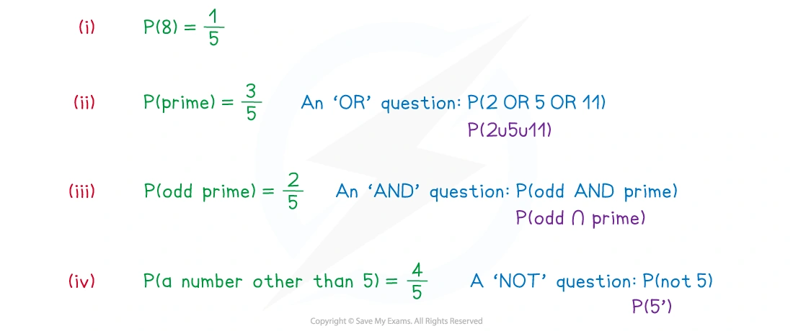
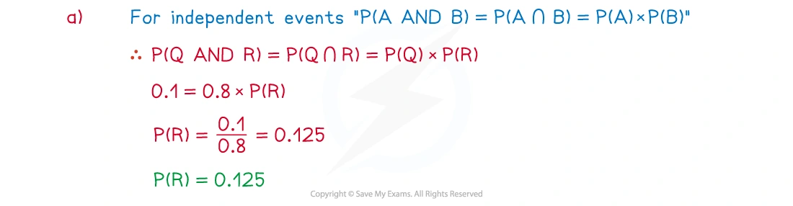
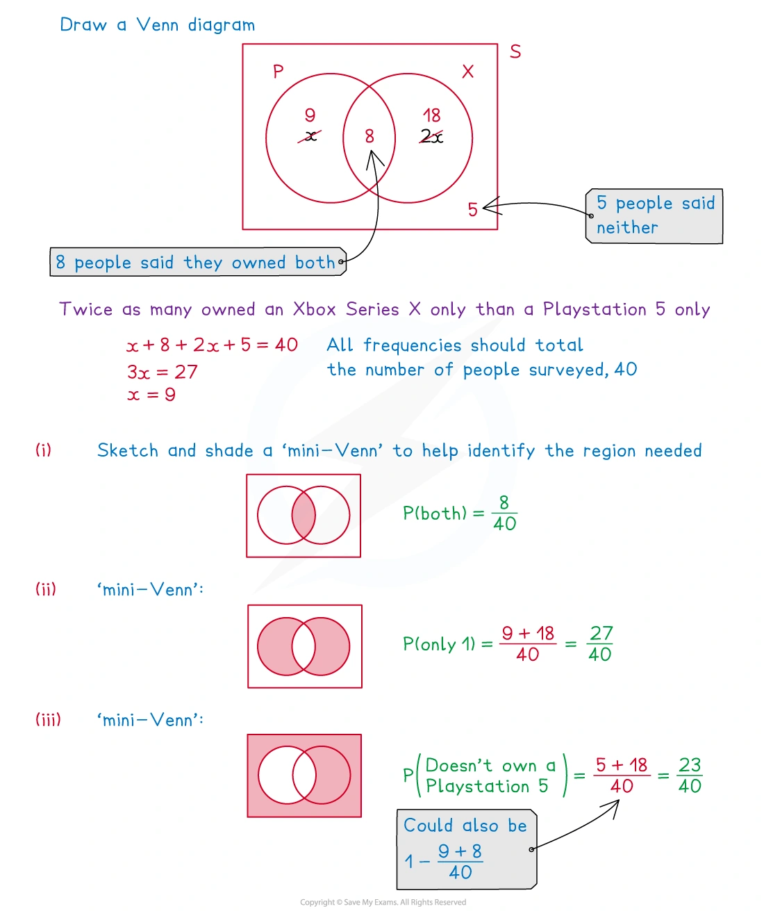
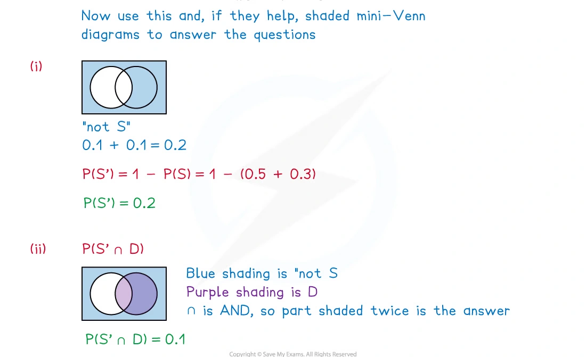
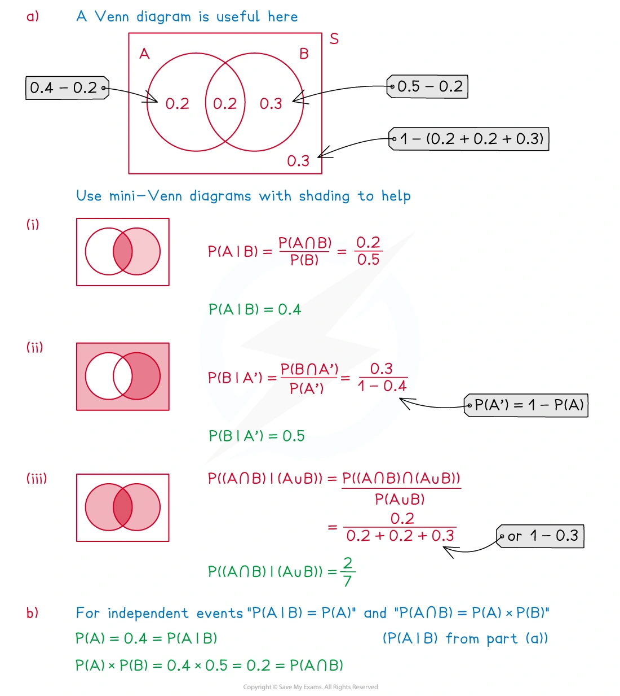
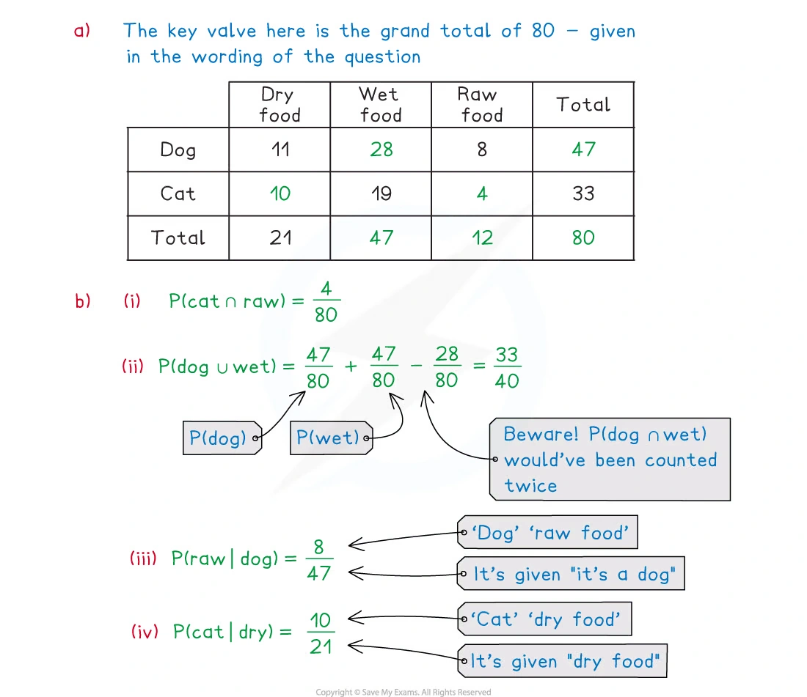
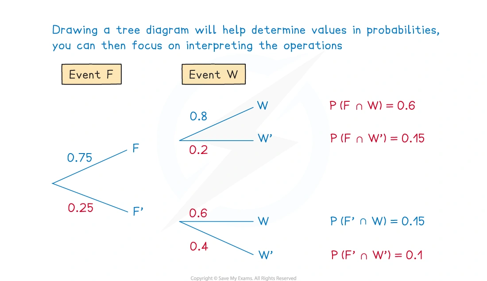
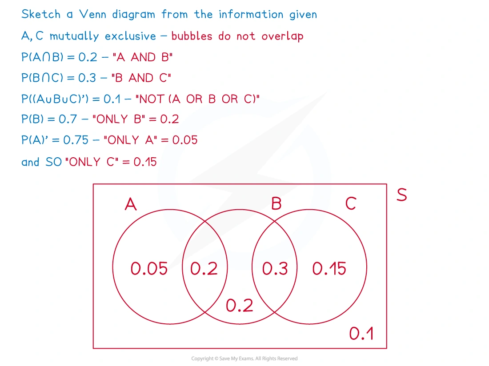
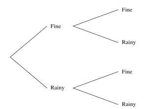
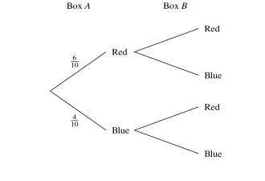

::: {.callout-important}
## 本节考纲要求

本页依据 9709 Mathematics 2026–2027 syllabus 5.3，覆盖：

- evaluate probabilities in simple cases by enumeration of equiprobable elementary events, or by calculation using permutations or combinations;
- use addition and multiplication of probabilities, as appropriate, in simple cases;
- understand exclusive and independent events, including deciding whether two events are independent;
- calculate and use conditional probabilities in simple cases, including situations represented by a sample space or a tree diagram.

真题均来自本地原始 QP，并与对应 mark scheme 核对；题目保持原文，不改写或编造。考纲说明不要求显式使用一般的 $P(A\cup B)$ 公式，但理解 union、intersection、complement 和 conditional probability 仍是本节基础。
:::

## Learning objectives

::: {.study-card}

- [ ] 从 equiprobable sample space 枚举 favourable outcomes 并计算概率
- [ ] 正确解释 $A\cap B$、$A\cup B$、$A'$ 和 “given that”
- [ ] 使用 addition rule、multiplication rule 和 complement
- [ ] 判断 mutually exclusive 与 independent，不把两者混淆
- [ ] 读取和绘制 tree diagrams、Venn diagrams 与 two-way tables
- [ ] 用 $P(A\mid B)=P(A\cap B)/P(B)$ 处理简单条件概率

:::

## 1. Core knowledge

### Sample space and elementary events

An **experiment** 是一个可观察结果的重复过程；所有可能结果组成 sample space $S$。如果所有 elementary outcomes equiprobable，则

$$
P(A)=\frac{\text{number of outcomes in }A}{\text{number of outcomes in }S}.
$$

例如两个公平六面骰子有 $6\times6=36$ 个有序结果。即使总分相同，$(2,3)$ 和 $(3,2)$ 仍是两个不同的 elementary outcomes。

### Event notation

若 $A$、$B$ 是 events：

$$
A\cap B \quad\text{表示 A and B},
$$

$$
A\cup B \quad\text{表示 A or B or both},
$$

$$
A' \quad\text{表示 not A},
\qquad
P(A')=1-P(A).
$$

如果 $A$ 与 $B$ 互斥，则不能同时发生，$A\cap B=\varnothing$，因此

$$
P(A\cup B)=P(A)+P(B).
$$

对于不一定互斥的两个事件，重叠部分不能重复计算：

$$
P(A\cup B)=P(A)+P(B)-P(A\cap B).
$$

### Addition and multiplication

“OR” 通常对应相加，特别是当列出的 cases 互斥时；“AND” 通常对应相乘。沿 tree diagram 的一条完整路径相乘，不同的完整路径再相加：

$$
P(A\cap B)=P(A)P(B\mid A).
$$

若两个事件独立，则 $P(B\mid A)=P(B)$，所以

$$
P(A\cap B)=P(A)P(B).
$$

### Mutually exclusive and independent

**Mutually exclusive**：两个事件不能同时发生，故 $P(A\cap B)=0$。如果两者概率都为正，它们不可能 independent。

**Independent**：一个事件是否发生不改变另一个事件的概率。可以比较

$$
P(A\cap B)\quad\text{和}\quad P(A)P(B).
$$

相等才是 independent；不相等则不是。

不要把 “mutually exclusive” 和 “independent” 当作同义词：互斥强调不能同时发生，独立强调一个事件不影响另一个事件。

### Conditional probability

“Given that $B$” 表示 sample space 已经缩小到 $B$。因此

$$
P(A\mid B)=\frac{P(A\cap B)}{P(B)},
\qquad P(B)>0.
$$

计算时先找 numerator “both $A$ and $B$”，再用 given event $B$ 作 denominator。条件概率也可以通过 tree diagram 的后续 branch 读取。

### Tree diagrams

Tree diagram 中每条 branch 的概率必须与同一节点发出的其他 branch 概率加起来为 $1$。一条完整路径的概率是 branch probabilities 的乘积；如果题目事件包含多条路径，把这些路径的概率相加。

有 replacement 时，后续 branch probability 通常不变；without replacement 时，分母和分子会随前一结果改变。

### Venn diagrams and two-way tables

Venn diagram 中：

- overlap 是 $A\cap B$；
- 两个 bubbles 覆盖的区域是 $A\cup B$；
- circle 外部是 complement。

Two-way table 的 row total、column total 和 grand total 可以直接给出 marginal probabilities。若给定一行或一列，条件概率的 denominator 应使用对应的 row/column total，而不是 grand total。

### 常见失分点

1. 两个骰子的结果按有序 pair 计数，不要只列不同的总分。
2. “at least one” 通常用 $1-P(\text{none})$ 更快。
3. “given that” 改变 denominator；不要仍然使用整个 sample space。
4. 路径相乘、路径相加的顺序不能混淆。
5. 判断 independent 要比较两个数，不是因为两个事件“看起来没有关系”就直接下结论。

## 2. Note worked examples

每个 worked example 单独成卡片；图片均来自原始 `2. Probability.pdf` 的内嵌资源独立提取，不使用页面截图。

::: {.worked-example}
### Worked example 1 · A fair five-sided spinner

A fair, five-sided spinner has its sides labelled $2,5,8,10$ and $11$. Find, from one spin, the probability that the spinner shows:

(i) $8$;

(ii) a prime number;

(iii) an odd prime number;

(iv) a number other than $5$.

All five outcomes are equally likely. Hence

$$
P(8)=\frac15,
\qquad
P(\text{prime})=P(2\text{ or }5\text{ or }11)=\frac35,
$$

$$
P(\text{odd prime})=P(5\text{ or }11)=\frac25,
\qquad
P(\text{not }5)=\frac45.
$$

{.note-figure}
:::

::: {.worked-example}
### Worked example 2 · Independent and mutually exclusive events

(a) Two events $Q$ and $R$ are such that $P(Q)=0.8$ and $P(Q\cap R)=0.1$. Given that $Q$ and $R$ are independent, find $P(R)$.

(b) Two events $S$ and $T$ are such that $P(S)=2P(T)$. Given that $S$ and $T$ are mutually exclusive and that $P(S\cup T)=0.6$, find $P(S)$ and $P(T)$.

(c) A fair five-sided spinner has sides labelled $2,3,5,7,11$. Find the probability that it lands on a number greater than $5$.

For (a), independence gives

$$
0.1=P(Q)P(R)=0.8P(R),
\qquad
\boxed{P(R)=0.125}.
$$

For (b), mutual exclusivity gives $P(S\cup T)=P(S)+P(T)$. Let $P(T)=t$, so $P(S)=2t$:

$$
2t+t=0.6,
\qquad
\boxed{P(S)=0.4,\;P(T)=0.2}.
$$

For (c), the outcomes greater than $5$ are $7$ and $11$, so the probability is $2/5$.

{.note-figure}
:::

::: {.worked-example}
### Worked example 3 · Venn diagram and basic events

40 people were surveyed about which games consoles they owned. 8 owned a PlayStation 5 ($P$) and an Xbox Series X ($X$). 5 owned neither console. Of those people who owned either console, twice as many owned an Xbox Series X only than a PlayStation 5 only. Find the probability that a randomly chosen person:

(i) owns both consoles;

(ii) owns exactly one console;

(iii) does not own a PlayStation 5.

Let the number owning only $P$ be $x$; only $X$ is $2x$. Then

$$
x+8+2x+5=40 \implies x=9.
$$

Therefore

$$
P(\text{both})=\frac8{40},
$$

$$
P(\text{exactly one})=\frac{9+18}{40}=\frac{27}{40},
$$

$$
P(P')=\frac{5+18}{40}=\frac{23}{40}.
$$

{.note-figure}
:::

::: {.worked-example}
### Worked example 4 · Complement and intersection

The members of a local tennis club decide whether to play in a singles competition ($S$) or a doubles competition ($D$). Given

$$
P(S)=2P(D),\qquad P(S\cup D)=0.9,\qquad P(S\cap D)=0.3,
$$

find $P(S')$, $P(S'\cap D)$, $P(S\cup D')$ and $P((S\cup D)')$.

From $P(S)=2P(D)$ and

$$
P(S\cup D)=P(S)+P(D)-P(S\cap D),
$$

we get $2d+d-0.3=0.9$, so $P(D)=0.4$ and $P(S)=0.8$. Hence

$$
P(S')=1-0.8=0.2,
$$

$$
P(S'\cap D)=P(D)-P(S\cap D)=0.4-0.3=0.1,
$$

$$
P(S\cup D')=1-P(S'\cap D)=0.9,
$$

$$
P((S\cup D)')=1-P(S\cup D)=0.1.
$$

{.note-figure}
:::

::: {.worked-example}
### Worked example 5 · Conditional probability

The probabilities of two events, $A$ and $B$, are $P(A)=0.4$ and $P(B)=0.5$. It is also known that $P(A\cap B)=0.2$. Find

(a) $P(A\mid B)$;

(b) $P(B\mid A')$;

(c) $P((A\cap B)\mid(A\cup B))$.

Using $P(A\mid B)=P(A\cap B)/P(B)$:

$$
P(A\mid B)=\frac{0.2}{0.5}=\boxed{0.4}.
$$

Since $P(A')=0.6$ and $P(B\cap A')=P(B)-P(A\cap B)=0.3$,

$$
P(B\mid A')=\frac{0.3}{0.6}=\boxed{0.5}.
$$

Also $P(A\cup B)=0.4+0.5-0.2=0.7$, so

$$
P((A\cap B)\mid(A\cup B))=\frac{0.2}{0.7}=\boxed{\frac27}.
$$

{.note-figure}
:::

::: {.worked-example}
### Worked example 6 · Two-way table

The incomplete two-way table below shows the type of main meal provided by 80 owners to their cats or dogs.

| | Dry food | Wet food | Raw food | Total |
|---|---:|---:|---:|---:|
| Dog | 11 | 28 | 8 | 47 |
| Cat | 10 | 19 | 4 | 33 |
| Total | 21 | 47 | 12 | 80 |

For example,

$$
P(\text{cat and raw})=\frac4{80},
$$

$$
P(\text{dog or wet})=\frac{47}{80}+\frac{47}{80}-\frac{28}{80}=\frac{33}{40},
$$

$$
P(\text{raw}\mid\text{dog})=\frac8{47},
\qquad
P(\text{cat}\mid\text{dry})=\frac{10}{21}.
$$

{.note-figure}
:::

::: {.worked-example}
### Worked example 7 · A multi-stage tree diagram

The event $F$ has a 75% probability of occurring. The event $W$ follows event $F$, and if $F$ has occurred, event $W$ has an 80% chance of occurring. It is also known that $P(F'\cap W)=0.15$. Find the relevant joint probabilities.

The branch probabilities are

$$
P(F)=0.75,quad P(F')=0.25,quad P(W\mid F)=0.8,quad P(W'\mid F)=0.2.
$$

Thus

$$
P(F\cap W)=0.75\times0.8=0.6,
$$

$$
P(F\cap W')=0.75\times0.2=0.15,
$$

and, because $P(F'\cap W)=0.15$, the final branch probability is

$$
P(F'\cap W')=1-(0.6+0.15+0.15)=0.1.
$$

{.note-figure}
:::

::: {.worked-example}
### Worked example 8 · Three-event Venn diagram

Three events $A$, $B$ and $C$ are such that $A$ and $C$ are mutually exclusive,

$$
P(A\cap B)=0.2,\quad P(B\cap C)=0.3,\quad P((A\cup B\cup C)')=0.1,
$$

$$
P(B)=0.7,\qquad P(A')=0.75.
$$

Since $A$ and $C$ are mutually exclusive, the regions are

$$
P(A\text{ only})=0.75-0.7=0.05,
$$

$$
P(C\text{ only})=1-(0.05+0.2+0.3+0.2+0.1)=0.15.
$$

For example,

$$
P(A\mid B)=\frac{P(A\cap B)}{P(B)}=\frac{0.2}{0.7}=\boxed{\frac27},
$$

and

$$
P(A'\mid C)=\frac{P(A'\cap C)}{P(C)}=1,
$$

because $A$ and $C$ are mutually exclusive.

{.note-figure}
:::

## 3. Verified Paper 5 questions

以下题组保持原始题干、全部小问和原始分值；答案按对应 mark scheme 的得分路径展开。真题中的 tree diagram 只保留必要图形，图片来自原始 QP 的矢量内容，不使用截图。

::: {.question-card #p5-prob-q01}
### Question 1 · 9709/51/O/N/20 Q1(a–b)

Two ordinary fair dice, one red and the other blue, are thrown.

Event A is ‘the score on the red die is divisible by 3’.

Event B is ‘the sum of the two scores is at least 9’.

(a) Find $P(A\cap B)$. **[2]**

(b) Hence determine whether or not the events A and B are independent. **[2]**

Show detailed mark scheme answer

(a) There are $36$ ordered outcomes. For the red die to be divisible by $3$, its score is $3$ or $6$. The favourable outcomes for $A\cap B$ are:

- red $3$, blue $6$;
- red $6$, blue $3,4,5,6$.

Thus there are five favourable outcomes:

$$
\boxed{P(A\cap B)=\frac5{36}}.
$$

(b)

$$
P(A)=\frac26=\frac13,
\qquad
P(B)=\frac{10}{36}=\frac5{18}.
$$

If independent, $P(A\cap B)=P(A)P(B)$. But

$$
P(A)P(B)=\frac13\times\frac5{18}=\frac5{54}\ne\frac5{36}.
$$

Therefore $\boxed{A\text{ and }B\text{ are not independent}}$.

<strong>Source:</strong> PastPaper/2020/2020/9709_w20_qp_51.pdf, Q1(a–b), with the corresponding 9709/51/O/N/20 mark scheme.

:::

::: {.question-card #p5-prob-q02}
### Question 2 · 9709/53/M/J/20 Q1(a–b)

Juan goes to college each day by any one of car or bus or walking. The probability that he goes by car is 0.2, the probability that he goes by bus is 0.45 and the probability that he walks is 0.35. When Juan goes by car, the probability that he arrives early is 0.6. When he goes by bus, the probability that he arrives early is 0.1. When he walks he always arrives early.

(a) Draw a fully labelled tree diagram to represent this information. **[2]**

(b) Find the probability that Juan goes to college by car given that he arrives early. **[4]**

Show detailed mark scheme answer

(a) The first branches are car $0.2$, bus $0.45$, walking $0.35$. The corresponding early/late branches are:

$$
\begin{array}{c|cc}
&\text{early}&\text{not early}\\ \hline
\text{car}&0.6&0.4\\
\text{bus}&0.1&0.9\\
\text{walking}&1&0
\end{array}
$$

(b) The probability of arriving early is

$$
P(E)=0.2(0.6)+0.45(0.1)+0.35(1)=0.515.
$$

The probability of car and early is $0.2(0.6)=0.12$. Therefore

$$
P(\text{car}\mid E)=\frac{0.12}{0.515}
=\boxed{\frac{24}{103}\approx0.233}.
$$

<strong>Source:</strong> PastPaper/2020/2020/9709-s20-qp-53.pdf, Q1(a–b), with the corresponding 9709/53/M/J/20 mark scheme.

:::

::: {.question-card #p5-prob-q03}
### Question 3 · 9709/52/O/N/20 Q4(a–d)

In a certain country, the weather each day is classified as fine or rainy. The probability that a fine day is followed by a fine day is 0.75 and the probability that a rainy day is followed by a fine day is 0.4. The probability that it is fine on 1 April is 0.8. The tree diagram below shows the possibilities for the weather on 1 April and 2 April.

{.question-figure}

(a) Complete the tree diagram to show the probabilities. **[1]**

(b) Find the probability that 2 April is fine. **[2]**

Let $X$ be the event that 1 April is fine and $Y$ be the event that 3 April is rainy.

(c) Find the value of $P(X\cap Y)$. **[3]**

(d) Find the probability that 1 April is fine given that 3 April is rainy. **[3]**

Show detailed mark scheme answer

(a) Complete branches: after fine, fine $0.75$ and rainy $0.25$; after rainy, fine $0.4$ and rainy $0.6$.

(b)

$$
P(\text{fine on 2 April})=0.8(0.75)+0.2(0.4)
=\boxed{0.68}.
$$

(c) Starting with fine on 1 April, 3 April is rainy through two paths:

$$
P(X\cap Y)=0.8(0.75)(0.25)+0.8(0.25)(0.6)
=\boxed{0.27}.
$$

(d) The probability that 3 April is rainy is

$$
P(Y)=0.27+0.2(0.4)(0.25)+0.2(0.6)(0.6)
=0.362.
$$

Therefore

$$
P(X\mid Y)=\frac{P(X\cap Y)}{P(Y)}
=\frac{0.27}{0.362}
=\boxed{0.746\text{ (3 s.f.)}}.
$$

<strong>Source:</strong> PastPaper/2020/2020/9709_w20_qp_52.pdf, Q4(a–d), with the corresponding 9709/52/O/N/20 mark scheme.

:::

::: {.question-card #p5-prob-q04}
### Question 4 · 9709/52/M/J/20 Q2(a–c)

A total of 500 students were asked which one of four colleges they attended and whether they preferred soccer or hockey. The numbers of students in each category are shown in the following table.

| | Soccer | Hockey | Total |
|---|---:|---:|---:|
| Amos | 54 | 32 | 86 |
| Benn | 84 | 72 | 156 |
| Canton | 22 | 56 | 78 |
| Devar | 120 | 60 | 180 |
| Total | 280 | 220 | 500 |

(a) Find the probability that a randomly chosen student is at Canton college and prefers hockey. **[1]**

(b) Find the probability that a randomly chosen student is at Devar college given that he prefers soccer. **[2]**

(c) One of the students is chosen at random. Determine whether the events ‘the student prefers hockey’ and ‘the student is at Amos college or Benn college’ are independent, justifying your answer. **[2]**

Show detailed mark scheme answer

(a)

$$
\boxed{P(\text{Canton and hockey})=\frac{56}{500}=\frac{14}{125}}.
$$

(b) Given soccer, use the soccer column total $280$:

$$
\boxed{P(\text{Devar}\mid\text{soccer})=\frac{120}{280}=\frac37}.
$$

(c) Let $H$ be hockey and $C$ be Amos or Benn. Then

$$
P(H\cap C)=\frac{32+72}{500}=\frac{104}{500}=0.208,
$$

whereas

$$
P(H)P(C)=\frac{220}{500}\times\frac{86+156}{500}
=0.44\times0.484=0.21296.
$$

The values are not equal, so

$$
\boxed{H\text{ and }C\text{ are not independent}}.
$$

<strong>Source:</strong> PastPaper/2020/2020/9709-s20-qp-52.pdf, Q2(a–c), with the corresponding 9709/52/M/J/20 mark scheme.

:::

::: {.question-card #p5-prob-q05}
### Question 5 · 9709/51/O/N/21 Q3

For her bedtime drink, Suki has either chocolate, tea or milk with probabilities 0.45, 0.35 and 0.2 respectively. When she has chocolate, the probability that she has a biscuit is 0.3. When she has tea, the probability that she has a biscuit is 0.6. When she has milk, she never has a biscuit.

Find the probability that Suki has tea given that she does not have a biscuit. **[5]**

Show detailed mark scheme answer

Let $N$ denote no biscuit. The required numerator is

$$
P(\text{tea}\cap N)=0.35(1-0.6)=0.14.
$$

The probability of no biscuit is

$$
P(N)=0.45(1-0.3)+0.35(1-0.6)+0.2(1)
=0.315+0.14+0.2=0.655.
$$

Therefore

$$
P(\text{tea}\mid N)=\frac{0.14}{0.655}
=\boxed{\frac{28}{131}\approx0.214}.
$$

<strong>Source:</strong> PastPaper/2021/2021/9709_w21_qp_51.pdf, Q3, with the corresponding 9709/51/O/N/21 mark scheme.

:::

::: {.question-card #p5-prob-q06}
### Question 6 · 9709/53/O/N/21 Q7(a–c)

Box A contains 6 red balls and 4 blue balls. Box B contains $x$ red balls and 9 blue balls. A ball is chosen at random from box A and placed in box B. A ball is then chosen at random from box B.

{.question-figure}

(a) Complete the tree diagram below, giving the remaining four probabilities in terms of $x$. **[3]**

(b) Show that the probability that both balls chosen are blue is $\dfrac{4}{x+10}$. **[2]**

It is given that the probability that both balls chosen are blue is $\dfrac16$.

(c) Find the probability, correct to 3 significant figures, that the ball chosen from box A is red given that the ball chosen from box B is red. **[5]**

Show detailed mark scheme answer

(a) If a red ball is transferred, box B has $x+1$ red and $9$ blue balls. If a blue ball is transferred, box B has $x$ red and $10$ blue balls. Thus the missing branch probabilities are

$$
\frac{x+1}{x+10},\quad\frac9{x+10},\quad
\frac{x}{x+10},\quad\frac{10}{x+10}.
$$

(b) Both selected balls are blue only when the first selection from A is blue:

$$
P(\text{both blue})=\frac4{10}\times\frac{10}{x+10}
=\boxed{\frac4{x+10}}.
$$

(c) From $4/(x+10)=1/6$,

$$
6\times4=x+10\implies x=14.
$$

Now

$$
P(A_R\cap B_R)=\frac6{10}\times\frac{15}{24}=\frac38,
$$

and

$$
P(B_R)=\frac6{10}\times\frac{15}{24}
 +\frac4{10}\times\frac{14}{24}
=\frac{73}{120}.
$$

Therefore

$$
P(A_R\mid B_R)=\frac{3/8}{73/120}
=\frac{45}{73}
=\boxed{0.616\text{ (3 s.f.)}}.
$$

<strong>Source:</strong> PastPaper/2021/2021/9709_w21_qp_53.pdf, Q7(a–c), with the corresponding 9709/53/O/N/21 mark scheme.

:::

::: {.question-card #p5-prob-q07}
### Question 7 · 9709/53/M/J/22 Q6(a–c)

Sajid is practising for a long jump competition. He counts any jump that is longer than 6 m as a success. On any day, the probability that he has a success with his first jump is 0.2. For any subsequent jump, the probability of a success is 0.3 if the previous jump was a success and 0.1 otherwise. Sajid makes three jumps.

(a) Draw a tree diagram to illustrate this information, showing all the probabilities. **[2]**

(b) Find the probability that Sajid has exactly one success given that he has at least one success. **[5]**

On another day, Sajid makes six jumps.

(c) Find the probability that only his first three jumps are successes or only his last three jumps are successes. **[3]**

Show detailed mark scheme answer

(a) First jump: success $0.2$, failure $0.8$. After a success: success $0.3$, failure $0.7$. After a failure: success $0.1$, failure $0.9$.

(b) The exactly-one-success paths are SFF, FSF and FFS:

$$
P(\text{exactly one})
=0.2(0.7)(0.9)+0.8(0.1)(0.7)+0.8(0.9)(0.1)
=0.254.
$$

The probability of at least one success is

$$
P(\text{at least one})=1-P(FFF)=1-0.8(0.9)(0.9)=0.352.
$$

Hence

$$
\boxed{P(\text{exactly one}\mid\text{at least one})
=\frac{0.254}{0.352}=\frac{127}{176}\approx0.722}.
$$

(c) The two required paths are SSSFFF and FFFSSS:

$$
P(SSSFFF)=0.2(0.3)(0.3)(0.7)(0.9)(0.9)=0.010206,
$$

$$
P(FFFSSS)=0.8(0.9)(0.9)(0.1)(0.3)(0.3)=0.005832.
$$

They are mutually exclusive, so

$$
\boxed{P=0.010206+0.005832=0.016038}.
$$

<strong>Source:</strong> PastPaper/2022/2022/9709_s22_qp_53.pdf, Q6(a–c), with the corresponding 9709/53/M/J/22 mark scheme.

:::

::: {.question-card #p5-prob-q08}
### Question 8 · 9709/53/O/N/22 Q7(a–c)

Sam and Tom are playing a game which involves a bag containing 5 white discs and 3 red discs. They take turns to remove one disc from the bag at random. Discs that are removed are not replaced into the bag. The game ends as soon as one player has removed two red discs from the bag. That player wins the game. Sam removes the first disc.

(a) Find the probability that Tom removes a red disc on his first turn. **[2]**

(b) Find the probability that Tom wins the game on his second turn. **[4]**

(c) Find the probability that Sam removes a red disc on his first turn given that Tom wins the game on his second turn. **[2]**

Show detailed mark scheme answer

(a) Tom’s first turn is the second draw:

$$
P(T\text{ red})=\frac58\frac37+\frac38\frac27
=\boxed{\frac38}.
$$

(b) For Tom to win on his second turn, the second and fourth draws must both be red. Since there are only three red discs, Sam cannot already have two red discs before the fourth draw in this event:

$$
P(T_1R\text{ and }T_2R)=\frac38\times\frac27
=\boxed{\frac3{28}}.
$$

(c) The numerator for “Sam’s first disc is red and Tom wins on his second turn” is the path R, R, W, R:

$$
P(S_1R\cap T\text{ wins on second})
=\frac38\times\frac27\times\frac56\times\frac15
=\frac1{56}.
$$

Therefore

$$
P(S_1R\mid T\text{ wins on second})
=\frac{1/56}{3/28}
=\boxed{\frac16}.
$$

<strong>Source:</strong> PastPaper/2022/2022/9709_w22_qp_53.pdf, Q7(a–c), with the corresponding 9709/53/O/N/22 mark scheme.

:::

::: {.question-card #p5-prob-q09}
### Question 9 · 9709/52/M/J/24 Q2(a–b)

Seva has a coin which is biased so that when it is thrown the probability of obtaining a head is $\frac13$. He also has a bag containing 4 red marbles and 5 blue marbles.

Seva throws the coin. If he obtains a head, he selects one marble from the bag at random. If he obtains a tail, he selects two marbles from the bag at random and without replacement.

(a) Find the probability that Seva selects at least one red marble. **[3]**

(b) Find the probability that Seva obtains a head given that he selects no red marbles. **[2]**

Show detailed mark scheme answer

(a) If the coin is a head, the probability of at least one red is $4/9$. If it is a tail, the probability is

$$
1-\frac{\binom52}{\binom92}=1-\frac5{18}=\frac{13}{18}.
$$

Hence

$$
P(\text{at least one red})
=\frac13\frac49+\frac23\frac{13}{18}
=\boxed{\frac{17}{27}}.
$$

(b) The probability of no red is

$$
P(\text{no red})=\frac13\frac59+\frac23\frac{\binom52}{\binom92}
=\frac5{27}+\frac5{27}=\frac{10}{27}.
$$

Therefore

$$
P(H\mid\text{no red})=\frac{(1/3)(5/9)}{10/27}
=\boxed{\frac12}.
$$

<strong>Source:</strong> PastPaper/2024/2024/qp-202406-mathematics-p52.pdf, Q2(a–b), with the corresponding 9709/52/M/J/24 mark scheme.

:::

::: {.question-card #p5-prob-q10}
### Question 10 · 9709/53/M/J/24 Q3(a–b)

Box A contains 6 green balls and 3 yellow balls.

Box B contains 4 green balls and $x$ yellow balls.

A ball is chosen at random from box A and placed in box B. A ball is then chosen at random from box B.

(a) Draw a tree diagram to represent this information, showing the probability on each of the branches. **[4]**

The probability that both the balls chosen are the same colour is $\frac8{15}$.

(b) Find the value of $x$. **[3]**

Show detailed mark scheme answer

(a) The first branches are green $6/9=2/3$ and yellow $3/9=1/3$. If green is transferred, box B has 5 green and $x$ yellow balls; if yellow is transferred, it has 4 green and $x+1$ yellow balls. The second branches are therefore

$$
\begin{array}{c|cc}
&\text{green from B}&\text{yellow from B}\\ \hline
\text{green transferred}&\dfrac5{x+5}&\dfrac{x}{x+5}\\[6pt]
\text{yellow transferred}&\dfrac4{x+5}&\dfrac{x+1}{x+5}
\end{array}
$$

(b) “Same colour” means green-green or yellow-yellow:

$$
\frac23\frac5{x+5}+\frac13\frac{x+1}{x+5}=\frac8{15}.
$$

Thus

$$
\frac{x+11}{3(x+5)}=\frac8{15}
\implies 15x+165=24x+120
\implies \boxed{x=5}.
$$

<strong>Source:</strong> PastPaper/2024/2024/qp-202406-mathematics-p53.pdf, Q3(a–b), with the corresponding 9709/53/M/J/24 mark scheme.

:::
