::: {.callout-important}
## 本节考纲要求

本页依据 9709 Mathematics 2026–2027 syllabus 5.1，覆盖：

- select a suitable way of presenting raw statistical data and discuss advantages and disadvantages;
- draw and interpret stem-and-leaf diagrams, including back-to-back diagrams, box-and-whisker plots, histograms and cumulative frequency graphs;
- use mean, median, mode, range, interquartile range and standard deviation;
- use cumulative frequency graphs to estimate medians, quartiles, percentiles and proportions;
- calculate mean and standard deviation from raw, grouped or coded data, including given totals and two data sets.

真题部分只收录可由本地原始 QP 与对应 mark scheme 核对的完整题组，不改写或编造题目。
:::

## Learning objectives

::: {.study-card}

- [ ] 判断数据是 qualitative/quantitative、discrete/continuous，并选择合适图表
- [ ] 正确绘制和读取 stem-and-leaf、box plot、histogram、cumulative frequency graph
- [ ] 计算并解释 mean、median、mode、range、IQR、variance 和 standard deviation
- [ ] 处理 frequency table、grouped data、coding 和给定的 $\sum x$、$\sum x^2$
- [ ] 用 median/IQR 或 mean/standard deviation 比较两组数据，并结合 context 作答

:::

## 1. Core knowledge

### Types of data

- **Qualitative data** 用文字描述特征，例如颜色或类别。
- **Quantitative data** 用数值表示 count 或 measurement。
- **Discrete data** 只能取特定数值，例如家庭宠物数量。
- **Continuous data** 可以在范围内取任意值，例如身高或时间。

Age 既可以是 discrete 也可以是 continuous，取决于题目把它定义为“年龄多少年”还是“实际年龄多长时间”。

### Measures of central tendency

对于 $n$ 个数据值 $x_1,x_2,\ldots,x_n$：

$$
\bar x=\frac{\sum x}{n}.
$$

**Mean** 使用所有数据，但容易受 outlier 影响；**median** 是排序后的中间值，对极端值更稳健；**mode** 是出现次数最多的值或 class。

数据量为偶数时，median 是中间两个值的平均。Quartiles 通常使用排序后位于 $(n+1)/4$ 和 $3(n+1)/4$ 位置的值；若位置不是整数，取相邻两个值的 midpoint。

### Measures of variation

$$
\text{range}=\text{maximum}-\text{minimum},
\qquad
\mathrm{IQR}=Q_3-Q_1.
$$

Variance 与 standard deviation 衡量数据的 spread。对一组数据：

$$
\sigma^2=\frac{\sum x^2}{n}-\bar x^2,
\qquad
\sigma=\sqrt{\frac{\sum x^2}{n}-\bar x^2}.
$$

如果使用 frequency table：

$$
\bar x=\frac{\sum fx}{\sum f},
\qquad
\sigma^2=\frac{\sum fx^2}{\sum f}-\bar x^2.
$$

对 grouped data，$x$ 用 class midpoint，因此 mean 和 standard deviation 都是 estimates。单位方面，standard deviation 与原数据相同，variance 是原单位的平方。

### Coding

若使用

$$
y=ax+b,
$$

则

$$
\bar y=a\bar x+b,
\qquad
\sigma_y=|a|\sigma_x.
$$

如果 $y=x-a$，则

$$
\bar x=\bar y+a,
\qquad
\sigma_x=\sigma_y.
$$

加减常数会改变 mean 但不改变 standard deviation；乘除常数会按其绝对值改变 standard deviation。

### Frequency tables and grouped data

Ungrouped frequency table 记录每个 discrete value 和对应 frequency。Grouped frequency table 用 class interval 汇总 continuous data；原始数据丢失后，不能得到精确 mean、median 或 standard deviation，只能得到 estimate。

计算 grouped mean/SD 时：

1. 找每个 class 的 midpoint；
2. 计算 $fx$ 和 $fx^2$；
3. 使用 $\sum f$、$\sum fx$、$\sum fx^2$。

注意 class boundaries。比如数据按 nearest cm 记录时，$10$–$19$ 应对应 $9.5\leq x<19.5$。

### Stem-and-leaf diagrams

Stem-and-leaf diagram 保留所有 raw data，同时显示数据的形状。必须写清 key，例如

$$
2\mid3\mid5
$$

可能表示左侧 $32$、右侧 $35$。Back-to-back diagram 中两侧 leaves 必须分别按正确方向排列。它可以直接读出 minimum、maximum、median、quartiles、mode 和 outliers。

### Box-and-whisker plots

Box plot 使用五数概括：minimum、$Q_1$、median、$Q_3$、maximum。Box 的长度是 IQR，whiskers 表示两端范围；只有一条 horizontal axis，必须有清楚且带单位的 scale。

比较两组数据时，应同时评论 location 和 spread，例如“median 较高”以及“IQR 较大”。不能只说一组“更好”，要说明在题目 context 中代表什么。

### Histograms

Histogram 用于 continuous grouped data。相邻 bars 之间没有 gaps，且 bar 的面积与 frequency 成正比：

$$
\text{frequency density}
=\frac{\text{frequency}}{\text{class width}},
\qquad
\text{frequency}=\text{frequency density}\times\text{class width}.
$$

Class widths 不相等时，不能把 frequency 直接当作 bar height；必须用 frequency density。读取某一部分 frequency 时，要计算相应 bar 的 area。

### Cumulative frequency graphs

对于 grouped data，cumulative frequency 记录“到某个 upper class boundary 为止”的累计人数。绘图时把每个 upper boundary 与 cumulative frequency 作点，并用平滑曲线连接。

总频数为 $n$ 时，在图上读取：

$$
Q_1:\frac n4,\qquad
\text{median}:\frac n2,\qquad
Q_3:\frac{3n}{4}.
$$

由图得到 $Q_1,Q_2,Q_3$ 后，IQR 为 $Q_3-Q_1$。若要求高于某值的比例，先读出不超过该值的 cumulative frequency，再用

$$
\frac{n-\text{CF}}{n}\times100\%.
$$

### Skewness and interpretation

- Positive skew：右侧 tail 较长，通常 $\text{mean}>\text{median}>\text{mode}$。
- Negative skew：左侧 tail 较长，通常 $\text{mean}<\text{median}<\text{mode}$。
- Symmetric data：mean 与 median 通常接近。

比较数据时，mean 应搭配 standard deviation，median 应搭配 IQR；包含 outliers 时，median/IQR 通常比 mean/SD 更合适。

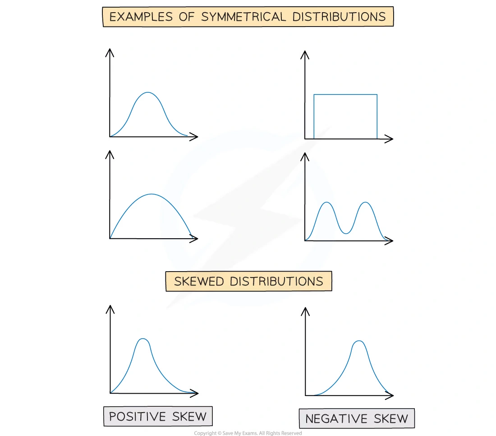{.note-figure}

## 2. Note worked examples

每个 Note worked example 单独成卡片；图片来自原始 Note PDF 的嵌入图，不使用页面截图。

::: {.worked-example}
### Worked example 1 · Mean, median and mode

For the data set $23,19,14,28,27,19$, find the mode, median and mean.

Sorted data are $14,19,19,23,27,28$. Hence

$$
\text{mode}=19,
\qquad
\text{median}=\frac{19+23}{2}=21,
$$

and

$$
\bar x=\frac{23+19+14+28+27+19}{6}
=\boxed{21.7\text{ (3 s.f.)}}.
$$

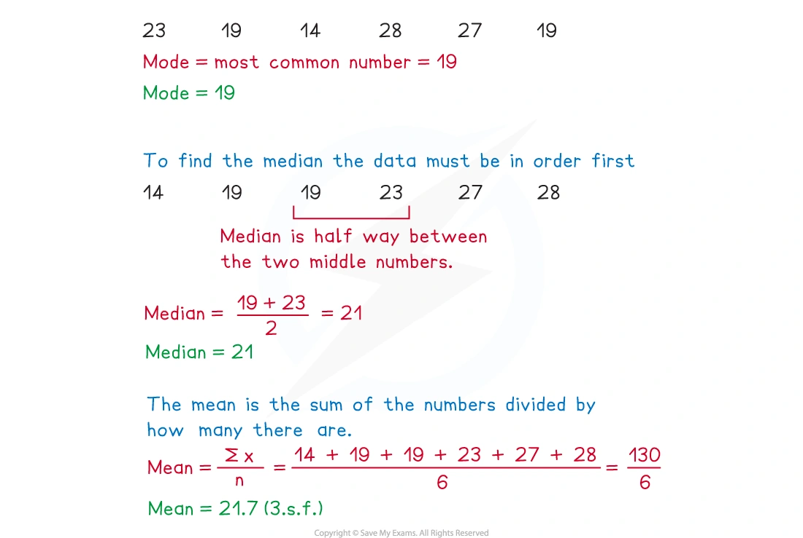{.note-figure}
:::

::: {.worked-example}
### Worked example 2 · Quartiles and IQR

Find the range and interquartile range for $43,29,70,31,84,56,17,53$.

Sorted data are $17,29,31,43,53,56,70,84$. Therefore

$$
\text{range}=84-17=67,
$$

$$
Q_1=\frac{29+31}{2}=30,
\qquad
Q_3=\frac{56+70}{2}=63,
$$

so

$$
\boxed{\mathrm{IQR}=63-30=33}.
$$

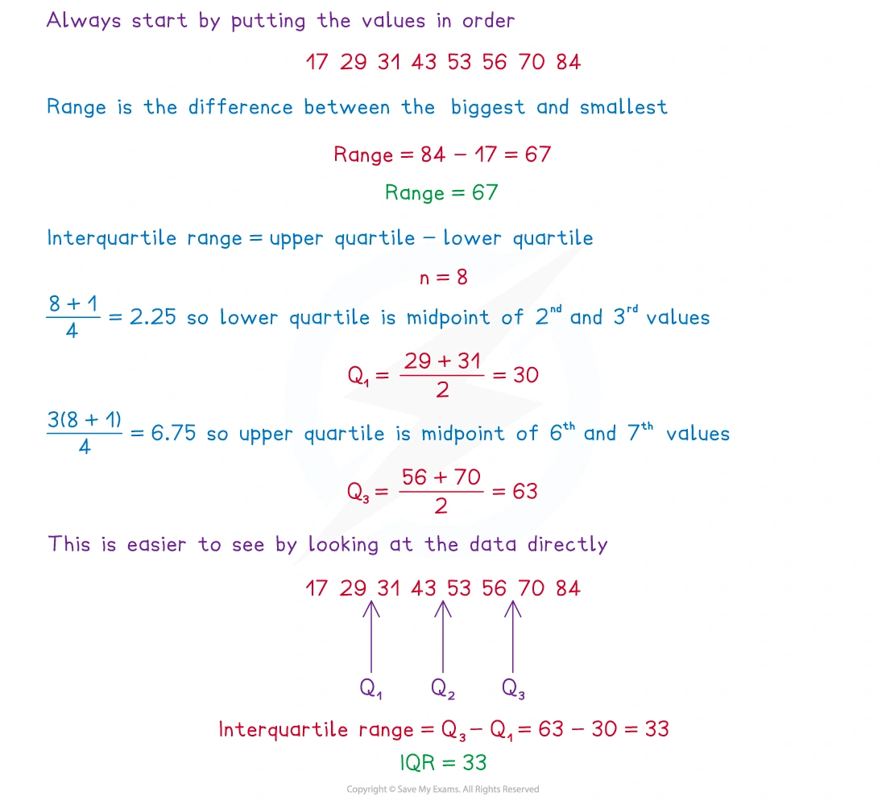{.note-figure}
:::

::: {.worked-example}
### Worked example 3 · Ungrouped frequency table

The shoe sizes of 60 students are summarised by sizes $37,37.5,38,38.5,39,39.5,40,40.5,41$ with frequencies $3,3,12,5,16,9,7,4,1$ respectively. Find the mode, median and mean.

The modal shoe size is $39$. The 30th and 31st ordered values are both $39$, so the median is $39$. Using $\bar x=\sum fx/\sum f$ gives

$$
\boxed{\bar x\approx38.3}.
$$

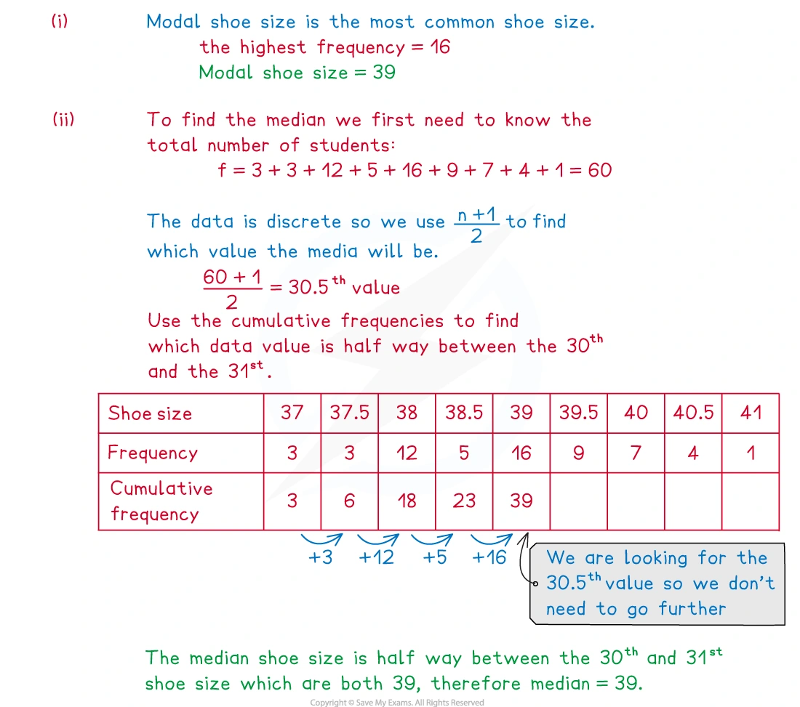{.note-figure}
:::

::: {.worked-example}
### Worked example 4 · Estimated mean from grouped data

The heights of 25 students are grouped as follows:

| Height $h$ (cm) | $150\leq h<155$ | $155\leq h<160$ | $160\leq h<165$ | $165\leq h<170$ | $170\leq h<175$ |
|---|---:|---:|---:|---:|---:|
| Frequency | 3 | 5 | 9 | 7 | 1 |

Using midpoints $152.5,157.5,162.5,167.5,172.5$,

$$
\sum f=25,
\qquad
\sum fx=4052.5,
$$

so the estimated mean height is

$$
\boxed{\bar x=162.1\,\mathrm{cm}}.
$$

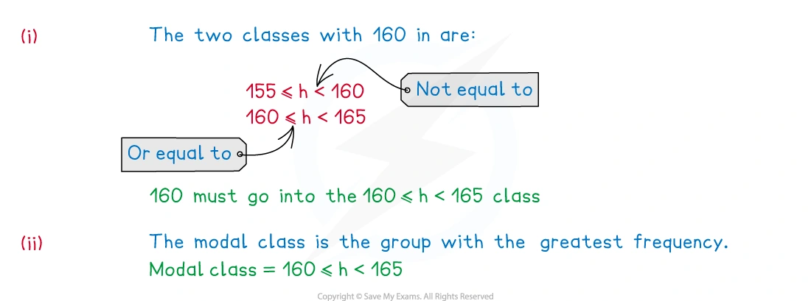{.note-figure}
:::

::: {.worked-example}
### Worked example 5 · Estimated variance and standard deviation

For the grouped time table with intervals $2\leq t<4$, $4\leq t<6$, $6\leq t<8$, $8\leq t<10$, $10\leq t<12$, $12\leq t<20$ and frequencies $1,4,7,5,2,2$, use midpoints $3,5,7,9,11,16$.

The totals are $\sum f=21$, $\sum ft=171$, and $\sum ft^2=1611$. Thus

$$
\sigma^2=\frac{1611}{21}-\left(\frac{171}{21}\right)^2
\approx10.408,
$$

and

$$
\boxed{\sigma\approx3.23\text{ minutes}}.
$$

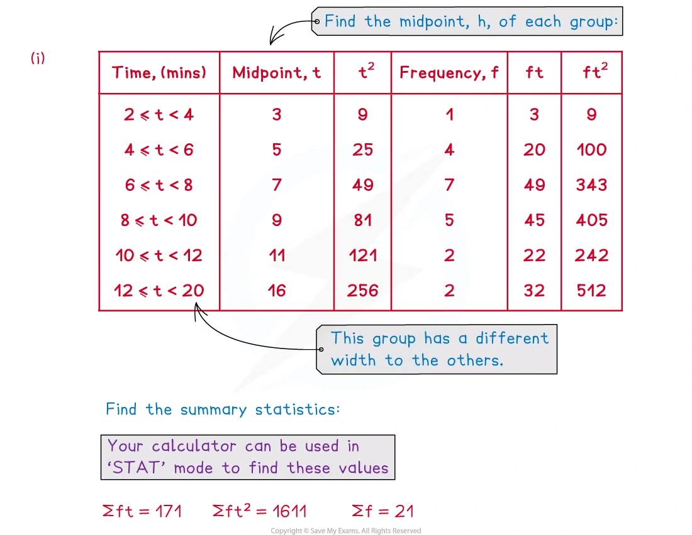{.note-figure}
:::

::: {.worked-example}
### Worked example 6 · Coding with an assumed mean

A coffee machine dispenses 150 ml per cup. For a random sample of 20 cups,

$$
\sum(c-150)=-16,
\qquad
\sum(c-150)^2=112.
$$

The coded mean is $-16/20=-0.8$, so

$$
\bar c=150-0.8=\boxed{149.2\,\mathrm{ml}}.
$$

The standard deviation is

$$
\sigma=\sqrt{\frac{112}{20}-(-0.8)^2}
=\boxed{2.23\,\mathrm{ml}}.
$$

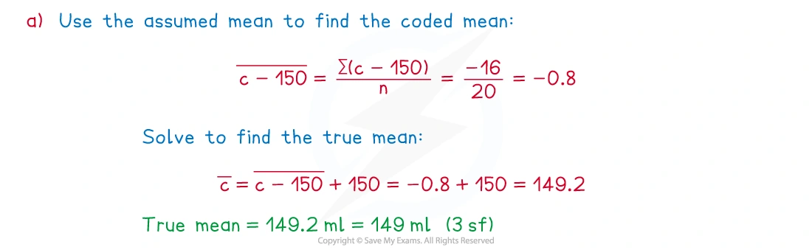{.note-figure}
:::

::: {.worked-example}
### Worked example 7 · Comparing two stem-and-leaf data sets

A stem-and-leaf diagram compares the times taken by children and adults to complete a computer game. The summary values are:

| Group | Median | IQR |
|---|---:|---:|
| Children | $32$ s | $16$ s |
| Adults | $30$ s | $13$ s |

Therefore the children took longer on average, while the adults’ times were less spread out and more consistent.

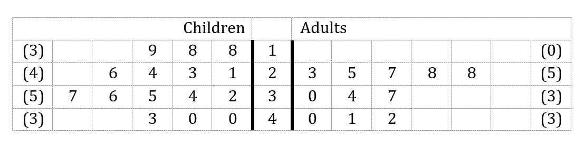{.note-figure}
:::

::: {.worked-example}
### Worked example 8 · Completing and reading a box plot

An incomplete box plot shows students’ pet tail lengths. The median is $21\,\mathrm{cm}$. Completing the plot gives minimum $8\,\mathrm{cm}$, lower quartile $14\,\mathrm{cm}$, upper quartile $30\,\mathrm{cm}$ and maximum $58\,\mathrm{cm}$.

Hence

$$
\boxed{\text{range}=58-8=50\,\mathrm{cm}},
\qquad
\boxed{\mathrm{IQR}=30-14=16\,\mathrm{cm}}.
$$

{.note-figure}
:::

::: {.worked-example}
### Worked example 9 · Cumulative frequency graph

A cumulative frequency graph for puppy lengths has total frequency $n=30$. Reading at $n/4=7.5$ and $3n/4=22.5$ gives approximately $Q_1=39.5\,\mathrm{cm}$ and $Q_3=51.25\,\mathrm{cm}$.

Therefore

$$
\boxed{\mathrm{IQR}\approx51.25-39.5=11.75\,\mathrm{cm}}.
$$

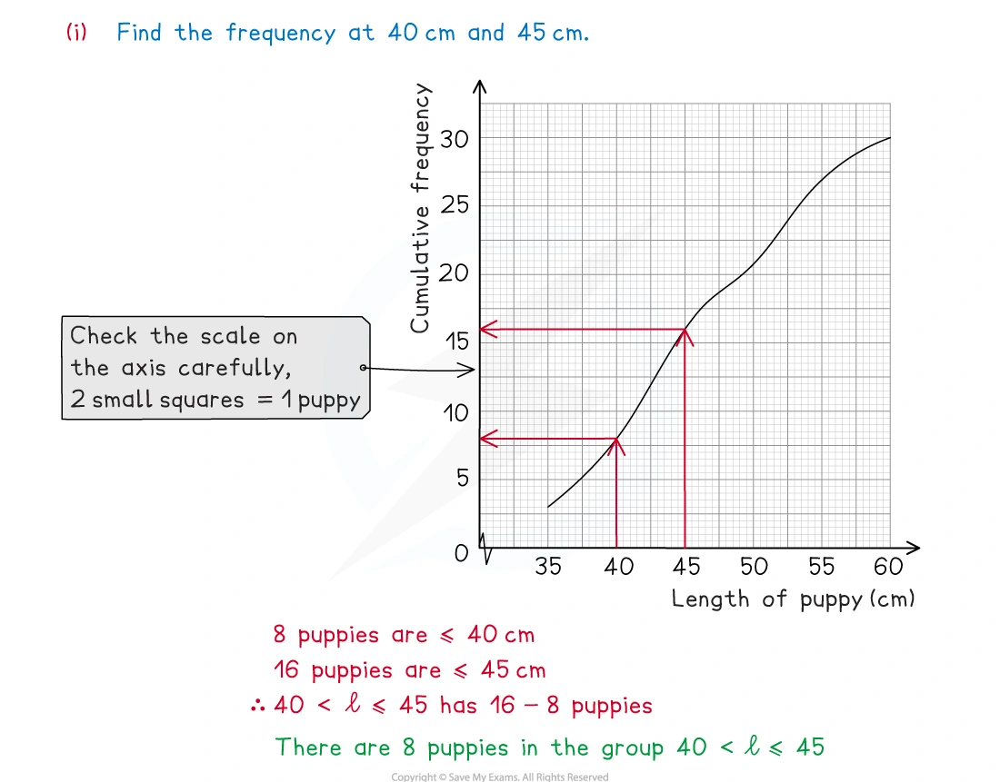{.note-figure}
:::

::: {.worked-example}
### Worked example 10 · Skewness and comparison

For two box plots of kangaroo hopping speeds, the Red Kangaroos have median $13\,\mathrm{m\,s^{-1}}$ and IQR $4\,\mathrm{m\,s^{-1}}$; the Eastern Greys have median $10.8\,\mathrm{m\,s^{-1}}$ and IQR $2.6\,\mathrm{m\,s^{-1}}$.

The Red Kangaroos are faster on average, but their hopping speeds are more variable. A longer right-hand tail indicates positive skew; a longer left-hand tail indicates negative skew.

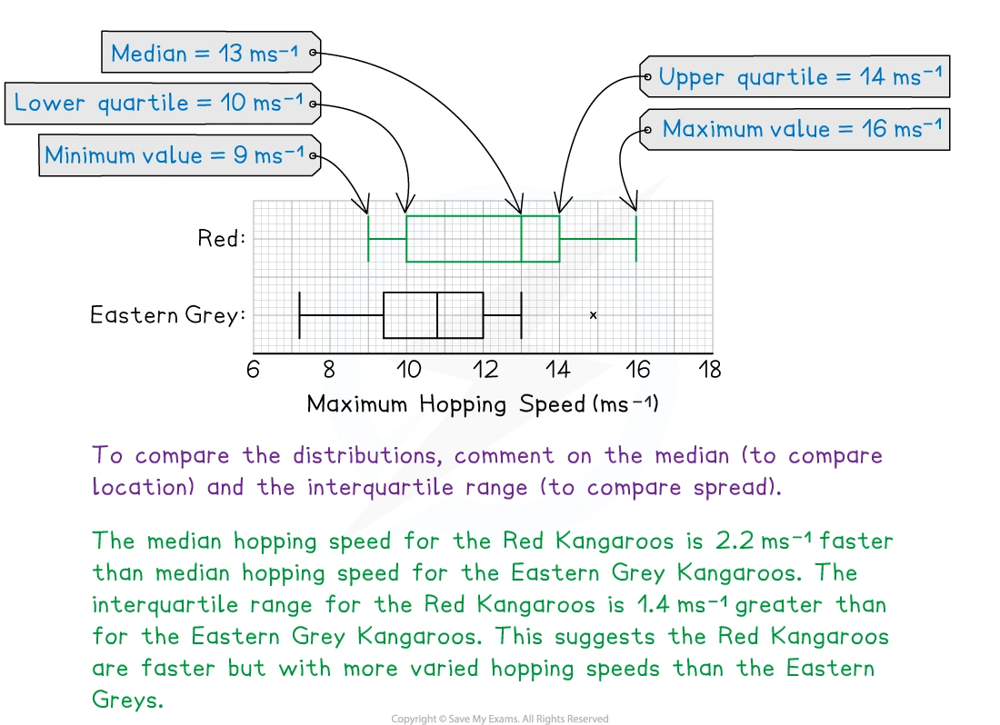{.note-figure}
:::

## 3. Verified Paper 5 questions

以下 10 张卡保留完整题干、所有小问和原始分值；需要绘图的题目保留原始数据或原始空白图，并在答案中给出应绘制的关键数值。

::: {.question-card #p5-data-q01}
### Question 1 · 9709/51/M/J/24 Q1(a–b)

A summary of 20 values of $x$ gives

$$
\sum(x-30)=439,\qquad \sum(x-30)^2=12405.
$$

A summary of another 25 values of $x$ gives

$$
\sum(x-30)=470,\qquad \sum(x-30)^2=11346.
$$

(a) Find the mean of all 45 values of $x$. **[2]**

(b) Find the standard deviation of all 45 values of $x$. **[2]**

Show detailed mark scheme answer

For all 45 values,

$$
\sum(x-30)=439+470=909.
$$

(a)

$$
\sum x=909+45(30)=2259,
\qquad
\boxed{\bar x=\frac{2259}{45}=50.2}.
$$

(b) Adding the coded squared totals gives $\sum(x-30)^2=23751$. Coding by subtracting a constant does not change standard deviation:

$$
\sigma^2=\frac{23751}{45}-\left(\frac{909}{45}\right)^2
=119.76,
$$

so

$$
\boxed{\sigma=10.9}\quad(3\text{ s.f.}).
$$

<strong>Source:</strong> PastPaper/2024/qp-202406-mathematics-p51.pdf, Q1(a–b), with the corresponding 9709/51/M/J/24 mark scheme.

:::

::: {.question-card #p5-data-q02}
### Question 2 · 9709/51/M/J/24 Q3(a–b)

The heights, in cm, of 200 adults in Barimba are summarised in the following table.

| Height $h$ (cm) | $130\leq h<150$ | $150\leq h<160$ | $160\leq h<170$ | $170\leq h<175$ | $175\leq h<195$ |
|---|---:|---:|---:|---:|---:|
| Frequency | 16 | 32 | 76 | 64 | 12 |

(a) Draw a histogram to represent this information. **[4]**

(b) The interquartile range is $R$ cm. Show that $R$ is not greater than $15$. **[2]**

Show detailed mark scheme answer

(a) Use frequency density $f/\text{class width}$. The bar heights are:

$$
0.8,\quad3.2,\quad7.6,\quad12.8,\quad0.6
$$

for the five intervals respectively.

(b) The 50th value is in $160\leq h<170$, so $Q_1\geq160$. The 150th value is in $170\leq h<175$, so $Q_3<175$. Hence

$$
R=Q_3-Q_1<175-160=15,
$$

therefore $\boxed{R\text{ is not greater than }15}$.

<strong>Source:</strong> PastPaper/2024/qp-202406-mathematics-p51.pdf, Q3(a–b), with the corresponding 9709/51/M/J/24 mark scheme.

:::

::: {.question-card #p5-data-q03}
### Question 3 · 9709/52/M/J/24 Q4(a–c)

The back-to-back stem-and-leaf diagram shows the annual salaries of 19 employees at each of two companies, Petral and Ravon.

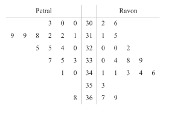{.question-figure}

Key: $2\mid31\mid5$ means $\$31\,200$ for a Petral employee and $\$31\,500$ for a Ravon employee.

(a) Find the median and the interquartile range of the salaries of the Petral employees. **[3]**

The median salary of the Ravon employees is $\$33\,800$, the lower quartile is $\$32\,000$ and the upper quartile is $\$34\,400$.

(b) Represent the data shown in the back-to-back stem-and-leaf diagram by a pair of box-and-whisker plots in a single diagram. **[3]**

(c) Comment on whether the mean or the median would be a better representation of the data for the employees at Petral. **[1]**

Show detailed mark scheme answer

(a) For Petral, the ordered values give

$$
Q_1=\$31\,200,\qquad
\text{median}=\$32\,000,\qquad
Q_3=\$33\,500.
$$

Therefore

$$
\boxed{\mathrm{IQR}=\$2300}.
$$

(b) The five-number summaries are:

| Company | Minimum | $Q_1$ | Median | $Q_3$ | Maximum |
|---|---:|---:|---:|---:|---:|
| Petral | $\$30\,000$ | $\$31\,200$ | $\$32\,000$ | $\$33\,500$ | $\$36\,800$ |
| Ravon | $\$30\,200$ | $\$32\,000$ | $\$33\,800$ | $\$34\,400$ | $\$36\,900$ |

Plot both box plots on one common salary scale.

(c) The Petral data contain a high value at $\$36\,800$, so the mean would be pulled upward. The $\boxed{\text{median}}$ is the better representation.

<strong>Source:</strong> PastPaper/2024/qp-202406-mathematics-p52.pdf, Q4(a–c), with the corresponding 9709/52/M/J/24 mark scheme.

:::

::: {.question-card #p5-data-q04}
### Question 4 · 9709/53/M/J/24 Q4(a–c)

The times taken, in seconds, by 15 members of each of two swimming clubs, the Penguins and the Dolphins, to swim 50 metres are shown in the following table.

| Penguins | 35 | 39 | 42 | 44 | 45 | 45 | 48 | 50 | 56 | 58 | 59 | 61 | 66 | 68 | 72 |
|---|---:|---:|---:|---:|---:|---:|---:|---:|---:|---:|---:|---:|---:|---:|---:|
| Dolphins | 36 | 41 | 43 | 48 | 49 | 49 | 50 | 51 | 54 | 56 | 56 | 60 | 61 | 64 | 71 |

(a) Draw a back-to-back stem-and-leaf diagram to represent this information, with Penguins on the left-hand side. **[4]**

The diagram shows a box-and-whisker plot representing the times for the Penguins.

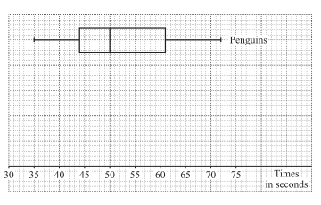{.question-figure}

(b) On the same diagram, draw a box-and-whisker plot to represent the times for the Dolphins. **[3]**

(c) Hence state one difference between the distributions of the times for the Penguins and the Dolphins. **[1]**

Show detailed mark scheme answer

(a) Use stems $3,4,5,6,7$ and place each leaf in order, with Penguins on the left.

(b) For Dolphins,

$$
\min=36,\quad Q_1=48,\quad \text{median}=51,\quad Q_3=60,\quad \max=71.
$$

Plot these values on the supplied common scale.

(c) Penguins have median $50$ and IQR $61-44=17$; Dolphins have median $51$ and IQR $60-48=12$. One valid comparison is that the Dolphins’ times have a smaller IQR, so they are less variable.

<strong>Source:</strong> PastPaper/2024/qp-202406-mathematics-p53.pdf, Q4(a–c), with the corresponding 9709/53/M/J/24 mark scheme.

:::

::: {.question-card #p5-data-q05}
### Question 5 · 9709/51/O/N/24 Q3(a–c)

The time taken, in minutes, to walk to school was recorded for 200 pupils at a certain school. These times are summarised in the following table.

| Time taken | $t\leq15$ | $t\leq25$ | $t\leq30$ | $t\leq40$ | $t\leq50$ | $t\leq70$ |
|---|---:|---:|---:|---:|---:|---:|
| Cumulative frequency | 18 | 46 | 88 | 140 | 176 | 200 |

(a) Draw a cumulative frequency graph to illustrate the data. **[2]**

(b) Use your graph to estimate the median and the interquartile range of the data. **[3]**

(c) Calculate an estimate for the mean value of the times taken by the 200 pupils to walk to school. **[3]**

Show detailed mark scheme answer

(a) Plot $(15,18),(25,46),(30,88),(40,140),(50,176),(70,200)$ and join with a smooth curve.

(b) Read at cumulative frequencies $50,100,150$. Approximate readings are

$$
Q_1\approx25.5,\qquad \text{median}\approx32.3,\qquad Q_3\approx42.8.
$$

Thus

$$
\boxed{\mathrm{IQR}\approx17.3\text{ minutes}}.
$$

(c) Use class frequencies $18,28,42,52,36,24$ and midpoints $7.5,20,27.5,35,45,60$:

$$
\bar t\approx\frac{18(7.5)+28(20)+42(27.5)+52(35)+36(45)+24(60)}{200}
=\boxed{33.7\text{ minutes}}.
$$

<strong>Source:</strong> PastPaper/2024/qp-202410-mathematics-p51.pdf, Q3(a–c), with the corresponding 9709/51/O/N/24 mark scheme.

:::

::: {.question-card #p5-data-q06}
### Question 6 · 9709/53/O/N/24 Q4(a–c)

On a certain day, the heights of 150 sunflower plants grown by children at a local school are measured, correct to the nearest cm. These heights are summarised in the following table.

| Height (cm) | 10–19 | 20–29 | 30–39 | 40–44 | 45–49 | 50–54 | 55–59 |
|---|---:|---:|---:|---:|---:|---:|---:|
| Frequency | 10 | 18 | 32 | 42 | 28 | 14 | 6 |

(a) Draw a cumulative frequency graph to illustrate the data. **[4]**

(b) Use your graph to estimate the 30th percentile of the heights of the sunflower plants. **[2]**

(c) Calculate estimates for the mean and the standard deviation of the heights of the 150 sunflower plants. **[5]**

Show detailed mark scheme answer

(a) Since heights are to the nearest cm, use upper boundaries $19.5,29.5,39.5,44.5,49.5,54.5,59.5$ with cumulative frequencies $10,28,60,102,130,144,150$.

(b) The 30th percentile is at cumulative frequency $0.30(150)=45$. Reading/interpolating between $(29.5,28)$ and $(39.5,60)$ gives

$$
\boxed{34.8\,\mathrm{cm}\text{ approximately}}.
$$

(c) Use class midpoints $14.5,24.5,34.5,42,47,52,57$. Then

$$
\sum f=150,\quad \sum fx=5840,\quad \sum fx^2=244285.
$$

Therefore

$$
\bar x=\frac{5840}{150}=38.933\ldots,
$$

and

$$
\sigma=\sqrt{\frac{244285}{150}-\left(\frac{5840}{150}\right)^2}
=\boxed{10.6\,\mathrm{cm}}.
$$

<strong>Source:</strong> PastPaper/2024/qp-202410-mathematics-p53.pdf, Q4(a–c), with the corresponding 9709/53/O/N/24 mark scheme.

:::

::: {.question-card #p5-data-q07}
### Question 7 · 9709/51/M/J/23 Q5(a–c)

The populations of 150 villages in the UK, to the nearest hundred, are summarised in the table.

| Population | 100–800 | 900–1200 | 1300–2000 | 2100–3200 | 3300–4800 |
|---|---:|---:|---:|---:|---:|
| Number of villages | 8 | 12 | 50 | 48 | 32 |

(a) Draw a histogram to represent this information. **[4]**

(b) Write down the class interval which contains the median for this information. **[1]**

(c) Find the greatest possible value of the interquartile range for the populations of the 150 villages. **[2]**

Show detailed mark scheme answer

(a) As the values are to the nearest hundred, use continuous class boundaries and frequency density. The density is frequency divided by class width.

(b) The cumulative frequencies are $8,20,70,118,150$. The median is the 75th value, so it lies in

$$
\boxed{2100\text{–}3200}.
$$

(c) $Q_1$ is in $1300$–$2000$ and $Q_3$ is in $2100$–$3200$. Using the mark-scheme bounds,

$$
\mathrm{IQR}_{\max}=3249-1250=\boxed{1999},
$$

with $2000$ accepted when the continuous boundaries are used directly.

<strong>Source:</strong> PastPaper/2023/9709_s23_qp_51.pdf, Q5(a–c), with the corresponding 9709/51/M/J/23 mark scheme.

:::

::: {.question-card #p5-data-q08}
### Question 8 · 9709/53/O/N/23 Q4(a–b)

The weights, $x\,\mathrm{kg}$, of 120 students in a sports college are recorded. The results are summarised in the following table.

| Weight | $x\leq40$ | $x\leq60$ | $x\leq65$ | $x\leq70$ | $x\leq85$ | $x\leq100$ |
|---|---:|---:|---:|---:|---:|---:|
| Cumulative frequency | 0 | 14 | 38 | 60 | 106 | 120 |

(a) Draw a cumulative frequency graph to represent this information. **[2]**

(b) It is found that 35% of the students weigh more than $W\,\mathrm{kg}$. Use your graph to estimate the value of $W$. **[2]**

Show detailed mark scheme answer

(a) Plot $(40,0),(60,14),(65,38),(70,60),(85,106),(100,120)$ and join with a smooth curve.

(b) If 35% are above $W$, then 65% are at or below $W$:

$$
0.65(120)=78.
$$

Read the weight at cumulative frequency $78$ from the graph. Linear interpolation between CF $60$ at $70$ kg and CF $106$ at $85$ kg gives approximately

$$
W\approx70+\frac{78-60}{106-60}(15)
\approx\boxed{75.9\,\mathrm{kg}}.
$$

<strong>Source:</strong> PastPaper/2023/9709_w23_qp_53.pdf, Q4(a–b), with the corresponding 9709/53/O/N/23 mark scheme.

:::

::: {.question-card #p5-data-q09}
### Question 9 · 9709/52/O/N/22 Q4(a–b)

The times taken, in minutes, to complete a word processing task by 250 employees at a particular company are summarised in the table.

| Time taken $t$ (minutes) | $0\leq t<20$ | $20\leq t<40$ | $40\leq t<50$ | $50\leq t<60$ | $60\leq t<100$ |
|---|---:|---:|---:|---:|---:|
| Frequency | 32 | 46 | 96 | 52 | 24 |

(a) Draw a histogram to represent this information. **[4]**

From the data, the estimate of the mean time taken by these 250 employees is $43.2$ minutes.

(b) Calculate an estimate for the standard deviation of these times. **[3]**

Show detailed mark scheme answer

(a) The frequency densities are

$$
1.6,\quad2.3,\quad9.6,\quad5.2,\quad0.6
$$

for the five intervals respectively.

(b) Using midpoints $10,30,45,55,80$,

$$
\sum fx^2=549900,
\qquad
\bar x=43.2.
$$

Therefore

$$
\sigma=\sqrt{\frac{549900}{250}-43.2^2}
=\boxed{18.3\text{ minutes}}.
$$

<strong>Source:</strong> PastPaper/2022/9709_w22_qp_52.pdf, Q4(a–b), with the corresponding 9709/52/O/N/22 mark scheme.

:::

::: {.question-card #p5-data-q10}
### Question 10 · 9709/51/O/N/22 Q3(a–c)

The Lions and the Tigers are two basketball clubs. The heights, in cm, of the 11 players in each of their first team squads are given in the table.

| Lions | 178 | 186 | 181 | 187 | 179 | 190 | 189 | 190 | 180 | 169 | 196 |
|---|---:|---:|---:|---:|---:|---:|---:|---:|---:|---:|---:|
| Tigers | 194 | 179 | 187 | 190 | 183 | 201 | 184 | 180 | 195 | 191 | 197 |

(a) Draw a back-to-back stem-and-leaf diagram to represent this information, with the Lions on the left. **[4]**

(b) Find the median and the interquartile range of the heights of the Lions first team squad. **[3]**

It is given that for the Tigers, the lower quartile is $183$ cm, the median is $190$ cm and the upper quartile is $195$ cm.

(c) Make two comparisons between the heights of the players in the Lions first team squad and the heights of the players in the Tigers first team squad. **[2]**

Show detailed mark scheme answer

(a) Use stems $16,17,18,19,20$ and put leaves in order, with Lions on the left.

(b) The ordered Lions data are

$$
169,178,179,180,181,186,187,189,190,190,196.
$$

Thus

$$
\boxed{\text{median}=186\,\mathrm{cm}},
$$

$$
Q_1=\frac{178+179}{2}=178.5,
\qquad
Q_3=\frac{190+190}{2}=190,
$$

so

$$
\boxed{\mathrm{IQR}=11.5\,\mathrm{cm}}.
$$

(c) The Tigers have a higher median ($190$ cm compared with $186$ cm), so they are taller on average. The Tigers’ IQR is $195-183=12$ cm, slightly larger than the Lions’ $11.5$ cm, so their heights are slightly more variable.

<strong>Source:</strong> PastPaper/2022/9709_w22_qp_51.pdf, Q3(a–c), with the corresponding 9709/51/O/N/22 mark scheme.

:::

## Final checklist

::: {.callout-tip}

1. Sort raw data before finding median and quartiles.
2. For a histogram, use frequency density, not frequency, as the bar height.
3. For grouped data, use midpoints and label results as estimates.
4. For a cumulative frequency graph, read $n/4$, $n/2$ and $3n/4$.
5. Compare both location and spread, and always write the conclusion in context.

:::
