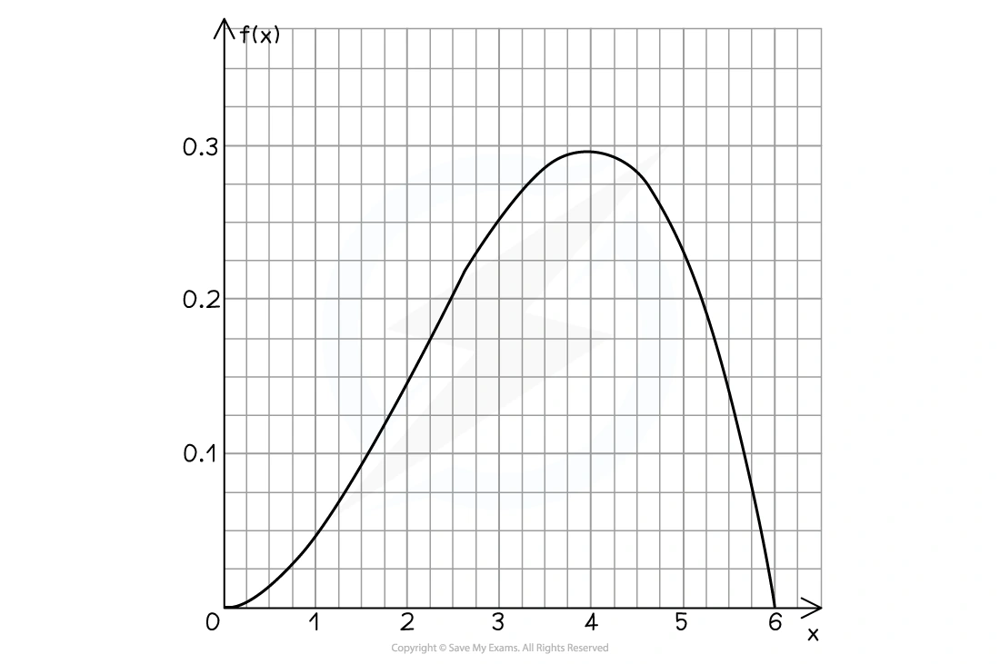
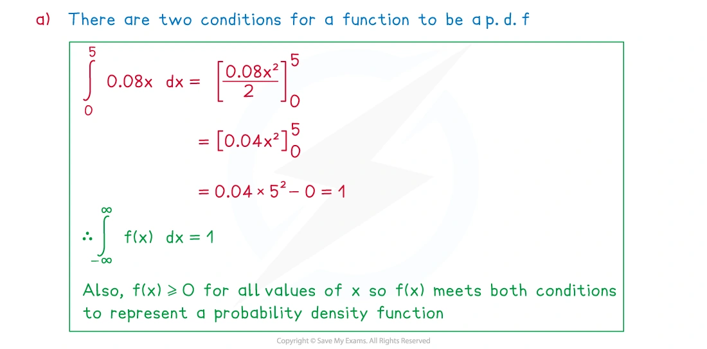
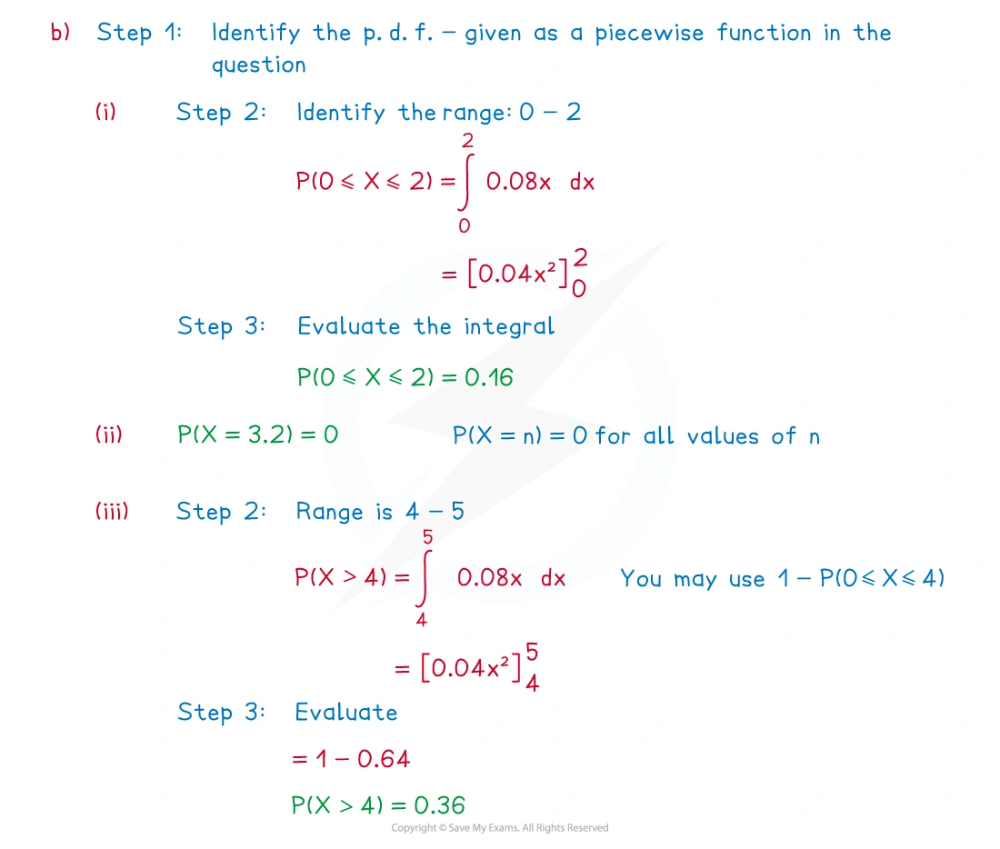
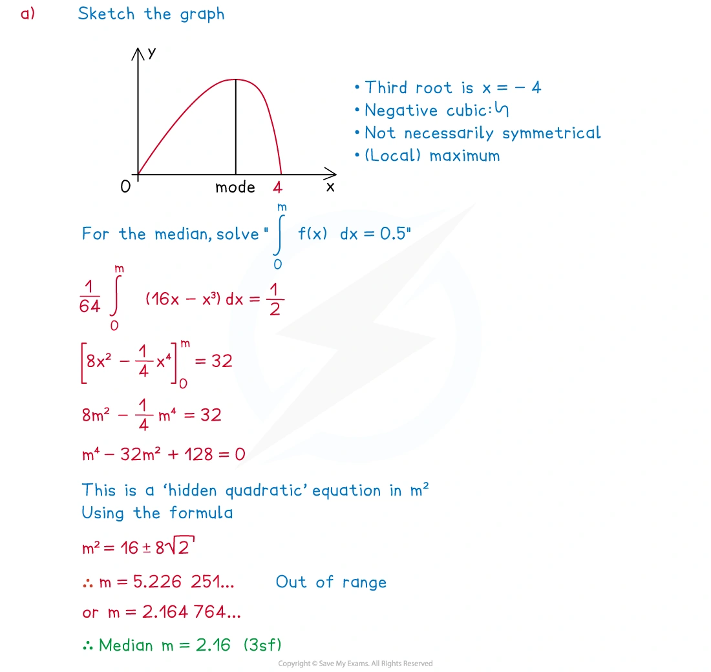
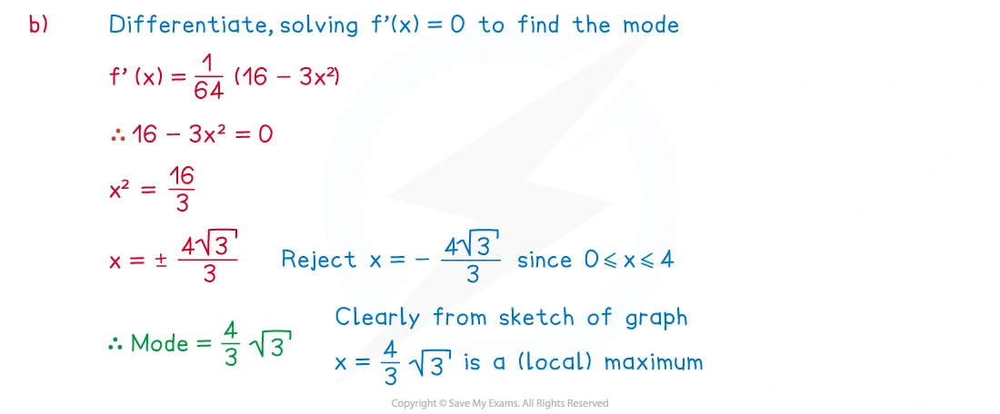
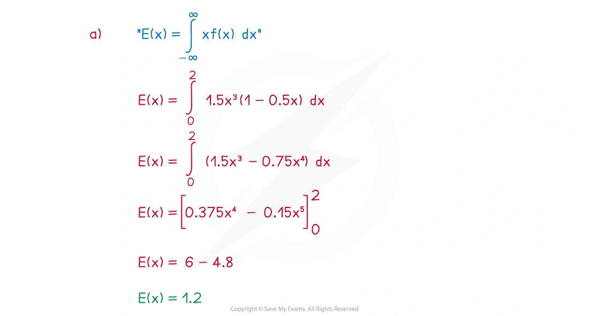
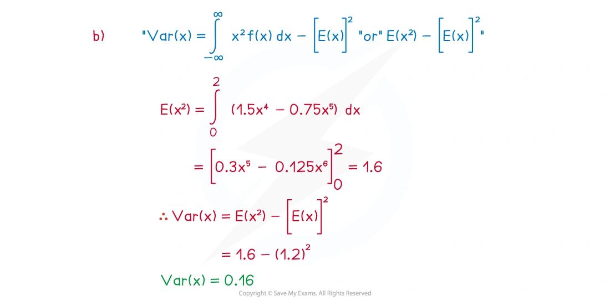
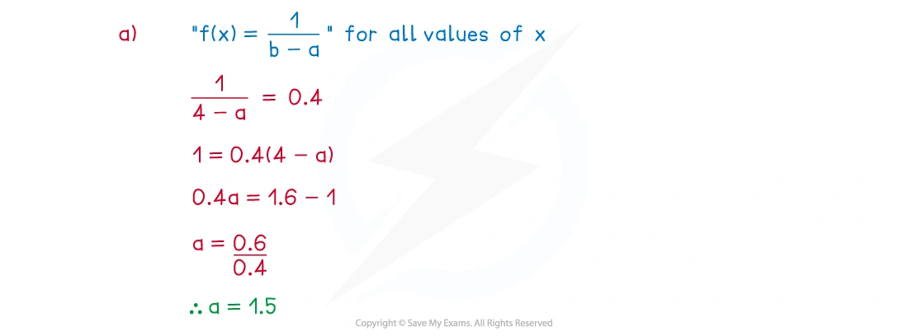
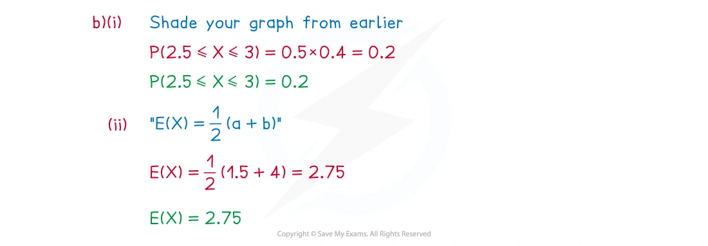

::: {.callout-important}
## 本节考纲要求

本页依据 9709 Mathematics 2026–2027 syllabus 6.3，覆盖：

- 理解 continuous random variable 和 probability density function 的性质；
- 使用 p.d.f. 通过面积或积分求概率；
- 使用 p.d.f. 计算分布的 mean 和 variance；
- 由面积求 median 和其他 percentiles；
- 处理定义在单个区间上的 p.d.f.，区间可以是有限或无限的。

考纲不要求显式使用 cumulative distribution function；本页均直接使用 p.d.f. 的积分面积。

真题均来自本地原始 QP，并与对应 mark scheme 核对；题目保持原文，不改写或编造。
:::

## Learning objectives

::: {.study-card}

- [ ] 检查 $f(x)\ge0$，并使用 $\int_{-\infty}^{\infty}f(x)\,dx=1$
- [ ] 用 $P(a<X<b)=\int_a^b f(x)\,dx$
- [ ] 记住连续变量中 $P(X=a)=0$，所以开闭端点不影响概率
- [ ] 使用 $E(X)=\int xf(x)\,dx$
- [ ] 使用 $\operatorname{Var}(X)=\int x^2f(x)\,dx-[E(X)]^2$
- [ ] 通过面积等于 $0.5$ 求 median，通过面积等于目标概率求 percentile
- [ ] 识别 uniform distribution，并使用矩形面积、mean 和 variance 公式

:::

## 1. Core knowledge

### Probability density function

连续随机变量 $X$ 的 probability density function（p.d.f.）$f(x)$ 必须满足

$$
f(x)\ge0,
\qquad
\int_{-\infty}^{\infty}f(x)\,dx=1.
$$

概率是曲线下的面积：

$$
P(a<X<b)=\int_a^b f(x)\,dx.
$$

连续变量在单点处的概率为零：

$$
P(X=a)=0,
$$

所以 $P(a<X<b)$、$P(a\le X<b)$ 和 $P(a\le X\le b)$ 相等。

{.note-figure}

### Checking a p.d.f.

若 $f(x)$ 含有未知常数，先使用总面积为 1：

$$
\int_a^b f(x)\,dx=1.
$$

然后检查在定义域内 $f(x)\ge0$。超出给定区间通常有 $f(x)=0$。

### Mean and variance

连续随机变量的 mean 为

$$
E(X)=\int_{-\infty}^{\infty}xf(x)\,dx.
$$

先求 second moment：

$$
E(X^2)=\int_{-\infty}^{\infty}x^2f(x)\,dx.
$$

再求 variance：

$$
\operatorname{Var}(X)=E(X^2)-[E(X)]^2.
$$

注意最后一项是 mean 的平方，不是 $E(X^2)$。

### Median, mode and percentiles

Median $m$ 满足左右各有一半面积：

$$
P(X<m)=0.5
\quad\Longleftrightarrow\quad
\int_{-\infty}^{m}f(x)\,dx=0.5.
$$

更一般地，若 $q$-percentile 为 $c$，则

$$
P(X<c)=q
\quad\Longleftrightarrow\quad
\int_{-\infty}^{c}f(x)\,dx=q.
$$

Mode 是 $f(x)$ 取得最大值时的 $x$ 值。若曲线对称，median 位于对称轴上；但求 mode 仍要找密度的最高点。

### Continuous uniform distribution

若 $X$ 在 $a\le X\le b$ 上均匀分布，则 p.d.f. 为

$$
f(x)=
\begin{cases}
\dfrac1{b-a},&a\le x\le b,\\
0,&\text{otherwise}.
\end{cases}
$$

图像是高度为 $1/(b-a)$ 的矩形。常用结果：

$$
E(X)=\frac{a+b}{2},
\qquad
\operatorname{Var}(X)=\frac{(b-a)^2}{12}.
$$

## 2. Note worked examples

每个 worked example 单独成卡片；图片均由原始 `2. Statistical Distributions.pdf` 的内嵌资源独立提取，不使用页面截图。

::: {.worked-example}
### Worked example 1 · Checking a p.d.f. and calculating probabilities

The continuous random variable $X$ has probability density function

$$
f(x)=
\begin{cases}
0.08x,&0\le x\le5,\\
0,&\text{otherwise}.
\end{cases}
$$

(a) Show that $f(x)$ can represent a probability density function.

(b) Find:

(i) $P(0\le X\le2)$;

(ii) $P(X=3.2)$;

(iii) $P(X>4)$.

For (a),

$$
\int_0^5 0.08x\,dx=0.04x^2\Big|_0^5=1,
$$

and $f(x)\ge0$ on $0\le x\le5$.

For (b),

$$
P(0\le X\le2)=\int_0^2 0.08x\,dx=\boxed{0.16},
$$

$$
P(X=3.2)=\boxed{0},
$$

and

$$
P(X>4)=\int_4^5 0.08x\,dx=\boxed{0.36}.
$$

{.note-figure}

{.note-figure}
:::

::: {.worked-example}
### Worked example 2 · Median and mode

The continuous random variable $X$ has probability density function

$$
f(x)=\frac{x(16-x^2)}{64},\qquad 0\le x\le4.
$$

(a) Find the median of $X$, giving your answer to three significant figures.

(b) Find the exact value of the mode of $X$.

For the median $m$,

$$
\int_0^m\frac{x(16-x^2)}{64}\,dx=0.5.
$$

This gives

$$
\frac{m^2}{8}-\frac{m^4}{256}=0.5.
$$

Solving within $0\le m\le4$ gives

$$
\boxed{m=2.16\text{ (3 s.f.)}}.
$$

For the mode, differentiate:

$$
f(x)=\frac{16x-x^3}{64},
\qquad
f'(x)=\frac{16-3x^2}{64}.
$$

Thus $f'(x)=0$ gives $x=4/\sqrt3$, and this is the maximum point:

$$
\boxed{\text{mode}=\frac4{\sqrt3}}.
$$

{.note-figure}

{.note-figure}
:::

::: {.worked-example}
### Worked example 3 · Mean and variance from a p.d.f.

The continuous random variable $X$ has p.d.f.

$$
f(x)=
\begin{cases}
1.5x^2(1-0.5x),&0\le x\le2,\\
0,&\text{otherwise}.
\end{cases}
$$

Find $E(X)$ and $\operatorname{Var}(X)$.

First,

$$
\begin{aligned}
E(X)&=\int_0^2x\cdot1.5x^2(1-0.5x)\,dx\\
&=\int_0^2(1.5x^3-0.75x^4)\,dx\\
&=\boxed{1.2}.
\end{aligned}
$$

Next,

$$
E(X^2)=\int_0^2x^2\cdot1.5x^2(1-0.5x)\,dx=1.6.
$$

Therefore

$$
\operatorname{Var}(X)=1.6-(1.2)^2=\boxed{0.16}.
$$

{.note-figure}

{.note-figure}
:::

::: {.worked-example}
### Worked example 4 · Continuous uniform distribution

The continuous random variable $X$ is modelled by the uniform distribution such that $f(x)=0.4$ for $a\le x\le4$ and $f(x)=0$ otherwise.

(a) Show that $a=1.5$.

(b) Find:

(i) $P(2.5\le X\le3)$;

(ii) $E(X)$.

(c) Find the standard deviation of $X$, giving your answer in the form $a\sqrt3$, where $a$ is a rational number.

Since the rectangle has total area 1,

$$
0.4(4-a)=1
\implies \boxed{a=1.5}.
$$

Then

$$
P(2.5\le X\le3)=0.4(3-2.5)=\boxed{0.2},
$$

$$
E(X)=\frac{1.5+4}{2}=\boxed{2.75}.
$$

The variance is

$$
\operatorname{Var}(X)=\frac{(4-1.5)^2}{12}=\frac{25}{48},
$$

so

$$
\operatorname{sd}(X)=\sqrt{\frac{25}{48}}=\boxed{\frac5{12}\sqrt3}.
$$

{.note-figure}

{.note-figure}
:::

## 3. Verified Paper 6 questions

以下题组保持原始题干、全部小问和原始分值；答案按对应 mark scheme 的得分路径展开。

::: {.question-card #p6-crv-q01}
### Question 1 · 9709/61/M/J/20 Q6(a–f)

The length of time, $T$ minutes, that a passenger has to wait for a bus at a certain bus stop is modelled by the probability density function given by

$$
f(t)=
\begin{cases}
\dfrac3{4000}(20t-t^2),&0\le t\le20,\\
0,&\text{otherwise}.
\end{cases}
$$

(a) Sketch the graph of $y=f(t)$. **[1]**

(b) Hence explain, without calculation, why $E(T)=10$. **[1]**

(c) Find $\operatorname{Var}(T)$. **[3]**

(d) It is given that $P(T<10+a)=p$, where $0<a<10$. Find $P(10-a<T<10+a)$ in terms of $p$. **[2]**

(e) Find $P(8<T<12)$. **[3]**

(f) Give one reason why this model may be unrealistic. **[1]**

Show detailed mark scheme answer

(a) The graph is a downward-opening quadratic with roots at $t=0$ and $t=20$, shown only on $0\le t\le20$.

(b) The p.d.f. is symmetrical about $t=10$, so the mean is at the line of symmetry:

$$
\boxed{E(T)=10}.
$$

(c)

$$
E(T^2)=\int_0^{20}t^2\frac3{4000}(20t-t^2)\,dt=120.
$$

Thus

$$
\operatorname{Var}(T)=E(T^2)-[E(T)]^2=120-10^2=\boxed{20}.
$$

(d) By symmetry, $P(T<10-a)=1-p$. Therefore

$$
P(10-a<T<10+a)=p-(1-p)=\boxed{2p-1}.
$$

(e)

$$
\begin{aligned}
P(8<T<12)
&=\int_8^{12}\frac3{4000}(20t-t^2)\,dt\\
&=\boxed{\frac{37}{125}=0.296}.
\end{aligned}
$$

(f) For example, the model does not allow waiting times greater than 20 minutes.

<strong>Source:</strong> PastPaper/2020/2020/9709-s20-qp-61.pdf, Q6(a–f), with the corresponding 9709/61/M/J/20 mark scheme.

:::

::: {.question-card #p6-crv-q02}
### Question 2 · 9709/63/M/J/20 Q6(a–c)

The length, $X$ centimetres, of worms of a certain type is modelled by the probability density function

$$
f(x)=
\begin{cases}
\dfrac6{125}(10-x)(x-5),&5\le x\le10,\\
0,&\text{otherwise}.
\end{cases}
$$

(a) State the value of $E(X)$. **[1]**

(b) Find $\operatorname{Var}(X)$. **[3]**

(c) Two worms of this type are chosen at random. Find the probability that exactly one of them has length less than 6 cm. **[5]**

Show detailed mark scheme answer

(a) The p.d.f. is symmetrical about $x=7.5$, so

$$
\boxed{E(X)=7.5}.
$$

(b)

$$
\begin{aligned}
E(X^2)&=\int_5^{10}x^2\frac6{125}(10-x)(x-5)\,dx\\
&=57.5.
\end{aligned}
$$

Therefore

$$
\operatorname{Var}(X)=57.5-(7.5)^2=\boxed{1.25}.
$$

(c) First find the probability that one worm is shorter than 6 cm:

$$
\begin{aligned}
p=P(X<6)
&=\int_5^6\frac6{125}(10-x)(x-5)\,dx\\
&=0.104.
\end{aligned}
$$

Exactly one of two independent worms has this property, so

$$
P=2p(1-p)=2(0.104)(0.896)=\boxed{0.186\text{ (3 s.f.)}}.
$$

<strong>Source:</strong> PastPaper/2020/2020/9709-s20-qp-63.pdf, Q6(a–c), with the corresponding 9709/63/M/J/20 mark scheme.

:::

::: {.question-card #p6-crv-q03}
### Question 3 · 9709/61/O/N/21 Q4(a–c)

A random variable $X$ has probability density function given by

$$
f(x)=
\begin{cases}
\dfrac1{18}(9-x^2),&0\le x\le3,\\
0,&\text{otherwise}.
\end{cases}
$$

(a) Find $P(X<1.2)$. **[3]**

(b) Find $E(X)$. **[3]**

The median of $X$ is $m$.

(c) Show that $m^3-27m+27=0$. **[3]**

Show detailed mark scheme answer

(a)

$$
\begin{aligned}
P(X<1.2)
&=\frac1{18}\int_0^{1.2}(9-x^2)\,dx\\
&=\frac1{18}\left[9x-\frac{x^3}{3}\right]_0^{1.2}\\
&=\boxed{\frac{71}{125}=0.568}.
\end{aligned}
$$

(b)

$$
\begin{aligned}
E(X)&=\frac1{18}\int_0^3x(9-x^2)\,dx\\
&=\frac1{18}\left[\frac{9x^2}{2}-\frac{x^4}{4}\right]_0^3\\
&=\boxed{\frac98=1.125}.
\end{aligned}
$$

(c) Since $m$ is the median,

$$
\frac1{18}\int_0^m(9-x^2)\,dx=0.5.
$$

Hence

$$
\frac1{18}\left(9m-\frac{m^3}{3}\right)=\frac12
\implies 27m-m^3=27,
$$

so

$$
\boxed{m^3-27m+27=0}.
$$

<strong>Source:</strong> PastPaper/2021/2021/9709_w21_qp_61.pdf, Q4(a–c), with the corresponding 9709/61/O/N/21 mark scheme.

:::

::: {.question-card #p6-crv-q04}
### Question 4 · 9709/62/F/M/22 Q6(a–d)

In a game a ball is rolled down a slope and along a track until it stops. The distance, in metres, travelled by the ball is modelled by the random variable $X$ with probability density function

$$
f(x)=
\begin{cases}
-k(x-1)(x-3),&1\le x\le3,\\
0,&\text{otherwise},
\end{cases}
$$

where $k$ is a constant.

(a) Without calculation, explain why $E(X)=2$. **[1]**

(b) Show that $k=\dfrac34$. **[3]**

(c) Find $\operatorname{Var}(X)$. **[3]**

One turn consists of rolling the ball 3 times and noting the largest value of $X$ obtained. If this largest value is greater than 2.5, the player scores a point.

(d) Find the probability that on a particular turn the player scores a point. **[4]**

Show detailed mark scheme answer

(a) The density is a quadratic symmetric about $x=2$, so the mean is

$$
\boxed{E(X)=2}.
$$

(b) Since the total area is 1,

$$
\begin{aligned}
1&=-k\int_1^3(x^2-4x+3)\,dx\\
&=-k\left[\frac{x^3}{3}-2x^2+3x\right]_1^3\\
&=k\frac43.
\end{aligned}
$$

Therefore $\boxed{k=3/4}$.

(c)

$$
\begin{aligned}
E(X^2)&=-\frac34\int_1^3(x^4-4x^3+3x^2)\,dx\\
&=\frac{21}{5}.
\end{aligned}
$$

Thus

$$
\operatorname{Var}(X)=\frac{21}{5}-2^2=\boxed{0.2}.
$$

(d) First,

$$
P(X>2.5)=-\frac34\int_{2.5}^{3}(x^2-4x+3)\,dx=\frac5{32}.
$$

The probability that the maximum of three rolls is at most 2.5 is $(1-5/32)^3$. Therefore

$$
P(\text{score})=1-\left(\frac{27}{32}\right)^3
=\boxed{0.399\text{ (3 s.f.)}}.
$$

<strong>Source:</strong> PastPaper/2022/2022/9709_m22_qp_62.pdf, Q6(a–d), with the corresponding 9709/62/F/M/22 mark scheme.

:::

::: {.question-card #p6-crv-q05}
### Question 5 · 9709/62/O/N/24 Q6(a–d)

The time, $X$ hours, taken by a large number of people to complete a challenge is modelled by the probability density function given by

$$
f(x)=
\begin{cases}
\dfrac1{x^2},&a\le x\le b,\\
0,&\text{otherwise},
\end{cases}
$$

where $a$ and $b$ are constants.

(a) State what the constants $a$ and $b$ represent in this context. **[1]**

(b) Show that $a=\dfrac{b}{b+1}$. **[3]**

It is given that $E(X)=\ln3$.

(c) Show that $b=2$ and find the value of $a$. **[4]**

(d) Find the median of $X$. **[3]**

Show detailed mark scheme answer

(a) $a$ is the minimum completion time and $b$ is the maximum completion time.

(b) Total area is 1:

$$
\int_a^b\frac1{x^2}\,dx=1
\implies\left[-\frac1x\right]_a^b=1.
$$

Hence

$$
-\frac1b+\frac1a=1
\implies b-a=ab
\implies \boxed{a=\frac{b}{b+1}}.
$$

(c)

$$
E(X)=\int_a^b x\cdot\frac1{x^2}\,dx
=\int_a^b\frac1x\,dx
=\ln b-\ln a.
$$

Using $a=b/(b+1)$,

$$
\ln b-\ln\left(\frac{b}{b+1}\right)=\ln(b+1)=\ln3.
$$

Thus $b+1=3$, so

$$
\boxed{b=2,\qquad a=\frac23}.
$$

(d) If the median is $m$,

$$
\int_{2/3}^{m}\frac1{x^2}\,dx=0.5.
$$

Therefore

$$
-\frac1m+\frac32=\frac12
\implies \boxed{m=1}.
$$

<strong>Source:</strong> PastPaper/2024/2024/qp-202410-mathematics-p62.pdf, Q6(a–d), with the corresponding 9709/62/O/N/24 mark scheme.

:::

::: {.question-card #p6-crv-q06}
### Question 6 · 9709/63/O/N/24 Q4(a–b)

A random variable $X$ has probability density function $f$ defined by

$$
f(x)=
\begin{cases}
\dfrac{a}{x^2}-\dfrac{18}{x^3},&2\le x\le3,\\
0,&\text{otherwise},
\end{cases}
$$

where $a$ is a constant.

(a) Show that $a=\dfrac{27}{2}$. **[3]**

(b) Show that

$$
E(X)=\frac{27}{2}\ln\frac32-3.
$$

**[3]**

Show detailed mark scheme answer

(a) Use total area 1:

$$
\begin{aligned}
1&=\int_2^3\left(\frac{a}{x^2}-\frac{18}{x^3}\right)\,dx\\
&=\left[-\frac{a}{x}+\frac9{x^2}\right]_2^3\\
&=\frac{a}{6}-\frac54.
\end{aligned}
$$

Thus $a/6=9/4$, so

$$
\boxed{a=\frac{27}{2}}.
$$

(b)

$$
\begin{aligned}
E(X)&=\int_2^3x\left(\frac{a}{x^2}-\frac{18}{x^3}\right)\,dx\\
&=\int_2^3\left(\frac{a}{x}-\frac{18}{x^2}\right)\,dx\\
&=\left[a\ln x+\frac{18}{x}\right]_2^3\\
&=\frac{27}{2}\ln3+6-\frac{27}{2}\ln2-9\\
&=\boxed{\frac{27}{2}\ln\frac32-3}.
\end{aligned}
$$

<strong>Source:</strong> PastPaper/2024/2024/qp-202410-mathematics-p63.pdf, Q4(a–b), with the corresponding 9709/63/O/N/24 mark scheme.

:::

::: {.callout-note}
## Exam checklist

1. p.d.f. 的总面积必须为 1，且定义域内不能出现负密度。
2. 连续变量的单点概率为 0，题目中的等号通常不改变概率。
3. 求 variance 时使用 $E(X^2)-[E(X)]^2$，不要把两者混淆。
4. median / percentile 要把左侧面积设为 $0.5$ / 指定概率。
5. 对称 p.d.f. 可以直接确定 mean 或 median 的位置，但仍要检查题目要求的是哪一个量。
:::
