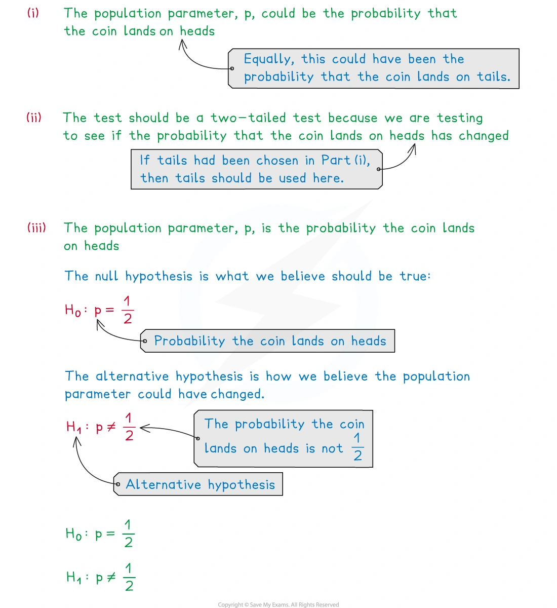
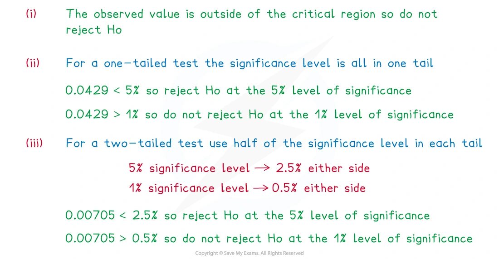
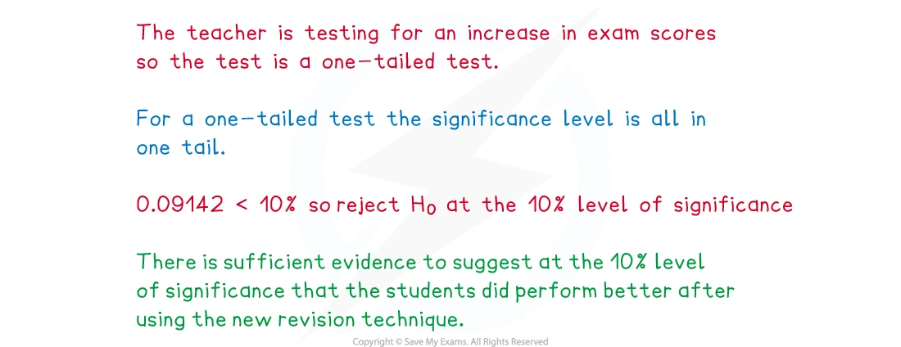
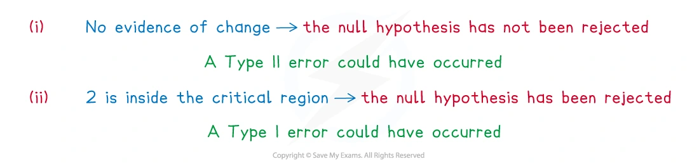
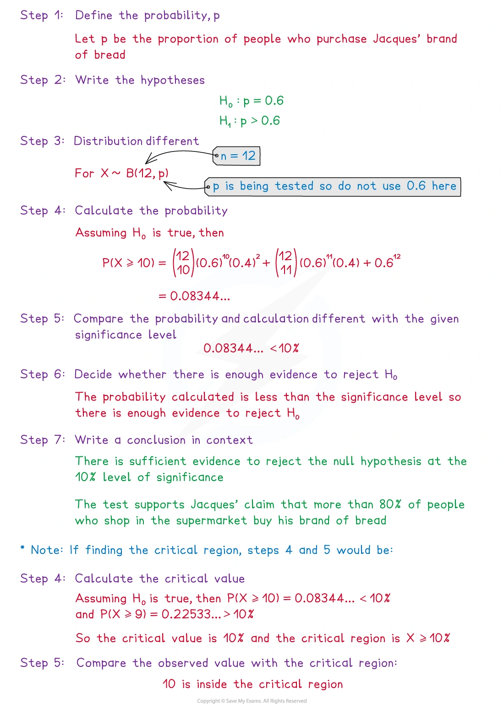
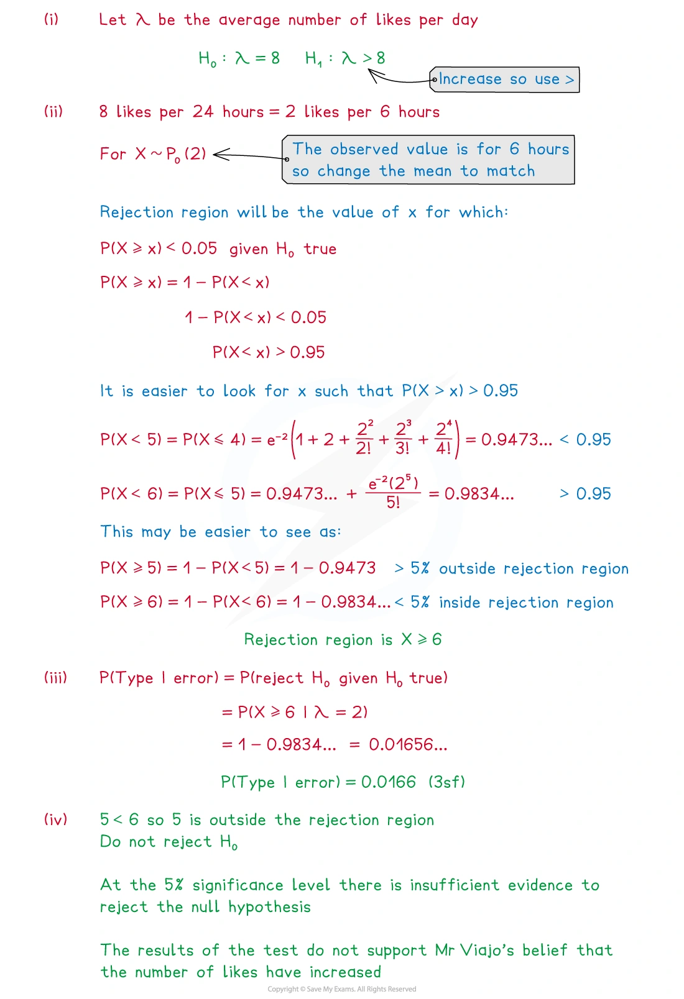
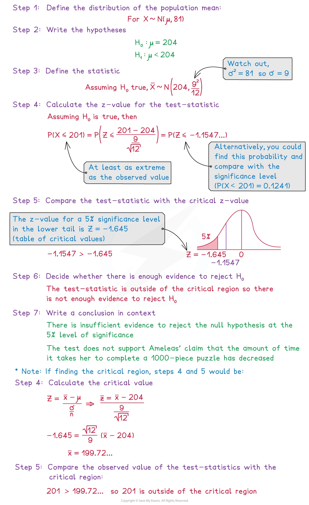

::: {.callout-important}
## 本节考纲要求

本页依据 9709 Mathematics 2026–2027 syllabus 6.5，覆盖：

- 理解 hypothesis test、one-tailed test、two-tailed test、null hypothesis、alternative hypothesis、significance level、critical/rejection region、acceptance region 和 test statistic；
- 对单个 binomial 或 Poisson observation 进行检验，可直接计算概率，也可在适当时使用 normal approximation；
- 在总体正态且方差已知，或样本量较大时，对总体均值进行检验；
- 理解并计算 Type I error 和 Type II error 的概率；
- 在实际语境中写出是否 reject $H_0$ 的结论。

真题均来自本地原始 QP，并与对应 mark scheme 核对；题目保持原文，不改写或编造。
:::

## Learning objectives

::: {.study-card}

- [ ] 根据题意判断 one-tailed 还是 two-tailed test
- [ ] 正确写出 $H_0$ 和 $H_1$，并定义 population parameter
- [ ] 用 probability、critical value 或 test statistic 完成检验
- [ ] 区分 significance level、actual significance level、p-value 和 critical region
- [ ] 在结论中写出“reject / do not reject $H_0$”以及语境中的 evidence
- [ ] 识别 Type I error 和 Type II error，并计算它们的概率

:::

## 1. Core knowledge

### Hypotheses and the direction of the test

先定义待检验的总体参数，再写假设。若检验总体比例 $p$：

$$
H_0:p=p_0.
$$

alternative hypothesis 取决于题目措辞：

$$
\begin{array}{c|c|c}
\text{题意}&\text{test}&H_1\\ \hline
\text{increased / greater than}&\text{one-tailed}&p>p_0\\
\text{decreased / less than}&\text{one-tailed}&p<p_0\\
\text{changed / different from / not equal}&\text{two-tailed}&p\ne p_0
\end{array}
$$

总体均值 $\mu$ 和 Poisson mean $\lambda$ 使用完全相同的逻辑。$H_0$ 通常写成等号；不要把题目的 claim 直接写成 $H_0$ 而没有定义参数。

### Significance level and critical region

significance level $\alpha$ 是在 $H_0$ 为真时错误 reject $H_0$ 的最大允许概率。若 test 是 one-tailed，全部 $\alpha$ 放在对应的一端；若是 two-tailed，两个尾部各放 $\alpha/2$。

**Critical region** 是会导致 reject $H_0$ 的 observed values。离散分布中，由于只能取整数，实际落入 critical region 的概率可能小于题目给出的 significance level；这就是 actual significance level。

对于连续正态分布，常用临界 $z$ 值为

$$
\begin{array}{c|c|c}
\text{test}&\alpha&\text{critical value}\\ \hline
\text{one-tailed}&0.05&1.645\\
\text{one-tailed}&0.025&1.960\\
\text{two-tailed}&0.05&\pm1.960\\
\text{two-tailed}&0.01&\pm2.576
\end{array}
$$

### Direct tests for binomial and Poisson variables

若单次 observation 是成功次数，先在 $H_0$ 下建立分布：

$$
X\sim B(n,p_0).
$$

若 observation 是固定时间或空间区间中的事件次数，则在 $H_0$ 下建立

$$
X\sim\operatorname{Po}(\lambda_0).
$$

然后计算 observed value 或更极端结果的概率，并与 $\alpha$ 比较。比如检验 $p>p_0$ 时，较大的 $X$ 支持 $H_1$，所以使用 $P(X\ge x)$；检验 $p<p_0$ 时使用 $P(X\le x)$。two-tailed test 必须考虑两端的 extreme values，或使用对应的两个 critical values。

当 $n$ 大、$p$ 小且 $np$ 合适时，可以用 Poisson approximation to binomial；当 binomial 或 Poisson 的分布适合时，也可以用 normal approximation，并使用 continuity correction。

### Tests for a population mean

若总体为 $N(\mu,\sigma^2)$ 且 $\sigma$ 已知，或样本量较大，则

$$
\bar X\sim N\left(\mu,\frac{\sigma^2}{n}\right)
$$

在 $H_0:\mu=\mu_0$ 下，test statistic 为

$$
z=\frac{\bar x-\mu_0}{\sigma/\sqrt n}.
$$

也可以先求 critical value，再将 observed $\bar x$ 与它比较。结论必须在题目语境中表达：

- reject $H_0$：有 sufficient evidence 支持 alternative claim；
- do not reject $H_0$：没有 sufficient evidence 支持 alternative claim。

不要写成“证明 $H_0$ 为真”或“证明 claim 错误”。

### Type I and Type II errors

$$
\begin{array}{c|cc}
&H_0\text{ true}&H_1\text{ true}\\ \hline
\text{reject }H_0&\text{Type I error}&\text{correct decision}\\
\text{do not reject }H_0&\text{correct decision}&\text{Type II error}
\end{array}
$$

Type I error 的概率就是 actual significance level；若题目直接给出 significance level，通常先判断离散 critical region 的实际概率。Type II error 则要在给定的 alternative parameter value 下，计算 observation 落在 acceptance region 的概率。

## 2. Note worked examples

每个 worked example 单独成卡片；图片均由原始 `3. Hypothesis Testing.pdf` 的对应页面独立提取，不使用页面截图。

::: {.worked-example}
### Worked example 1 · Choosing hypotheses for a coin test

题目要求在 5% significance level 检验一枚硬币是否 fair。总体参数是得到 heads 的 probability $p$。因为题目问是否 fair，偏离 $1/2$ 的两边都属于 evidence against $H_0$，所以使用 two-tailed test：

$$
H_0:p=\frac12,
\qquad
H_1:p\ne\frac12.
$$

先定义 parameter，再由“fair / not fair”判断检验方向。

{.note-figure}
:::

::: {.worked-example}
### Worked example 2 · Critical region and actual significance level

若离散 test statistic 的 critical region 是 $X\le3$，而 observed value 是 $4$，则 observed value 不在 critical region 中，因此不 reject $H_0$。

如果在 $H_0$ 为真时，observed value 或更极端值的 one-tailed probability 是 $0.0429$，则：

$$
0.0429<0.05
$$

因此，**reject $H_0$ at the 5% level**。

而在 two-tailed test 中，需要把 significance level 分配到两端，并比较对应的 two-tailed probability（Note 中的示例为 $0.00705$）。离散分布中应以实际 critical region 为准。

{.note-figure}
:::

::: {.worked-example}
### Worked example 3 · Writing a conclusion

一名教师在 10% significance level 检验新的 revision technique 是否使学生表现更好。题目给出的 observed value 或更极端值的 probability 为 $0.09142$。

这是 increase 的 one-tailed test，因此

$$
0.09142<0.10
$$

因此，**reject $H_0$ at the 10% level**。

合适的语境结论是：有 sufficient evidence at the 10% significance level，表明使用新的 revision technique 后学生表现得更好。结论应写回题目的 context。

{.note-figure}
:::

::: {.worked-example}
### Worked example 4 · Type I and Type II errors

判断 error 时，要先看最后作出的 decision：

- 若测试没有发现 crop growth 的变化，实际却发生了变化，这是 **Type II error**；
- 若测试发现 waiting time 已减少，实际却没有减少，这是 **Type I error**。

因此 Type I 是“reject a true $H_0$”，Type II 是“do not reject a false $H_0$”。

{.note-figure}
:::

::: {.worked-example}
### Worked example 5 · Binomial hypothesis test

一名面包师声称，超过 60% 的顾客在店内购买面包。随机抽取 12 名顾客，其中 10 人在店内购买。令 $X$ 为样本中在店内购买的人数：

$$
H_0:p=0.6,\qquad H_1:p>0.6,\qquad X\sim B(12,0.6).
$$

在 $H_0$ 下，observed value $X=10$ 或更大值的概率为

$$
P(X\ge10)=0.08344\ldots<0.10.
$$

所以在 10% significance level reject $H_0$，有 sufficient evidence 支持超过 60% 的 claim。也可以先找 critical region：$P(X\ge10)\le0.10$，而把边界再向前移会超过 10%，所以 critical region 是 $X\ge10$。

{.note-figure}
:::

::: {.worked-example}
### Worked example 6 · Poisson hypothesis test

Poisson test 中先把 observation 的时间区间和 $\lambda$ 的单位统一，再写 $H_0$。例如要检验平均 daily count 是否增加：

$$
H_0:\lambda=\lambda_0,
\qquad H_1:\lambda>\lambda_0.
$$

在 $H_0$ 下使用 $X\sim\operatorname{Po}(\lambda_0)$，计算 $P(X\ge x)$；若这个概率不大于 significance level，就 reject $H_0$。Note 的 worked example 还强调了 upper tail 的累计概率和 critical region 的写法。

{.note-figure}
:::

::: {.worked-example}
### Worked example 7 · Normal test for a population mean

若 puzzle completion time $X\sim N(204,81)$，样本量为 12，sample mean 为 $201$，要检验平均时间是否减少：

$$
H_0:\mu=204,\qquad H_1:\mu<204,
$$

并且

$$
\bar X\sim N\left(204,\frac{81}{12}\right).
$$

检验统计量为

$$
z=\frac{201-204}{9/\sqrt{12}}=-1.155\text{ (approximately)}.
$$

5% one-tailed critical value 是 $-1.645$。因为 $-1.155>-1.645$，所以不 reject $H_0$，没有 sufficient evidence 表明平均 completion time 已减少。

{.note-figure}

{.note-figure}
:::

## 3. Verified Paper 6 questions

以下题组保持原始题干、全部小问和原始分值；答案按对应 mark scheme 的得分路径展开。

::: {.question-card #p6-ht-q01}
### Question 1 · 9709/61/M/J/20 Q2(a–b)

In the past the yield of a certain crop, in tonnes per hectare, had mean 0.56 and standard deviation 0.08. Following the introduction of a new fertilizer, the farmer intends to test at the 2.5% significance level whether the mean yield has increased. He finds that the mean yield over 10 years is 0.61 tonnes per hectare.

(a) State two assumptions that are necessary for the test. **[2]**

(b) Carry out the test. **[5]**

Show detailed mark scheme answer

(a) The two assumptions are:

1. the standard deviation is unchanged, so it remains $0.08$;
2. the yields are normally distributed.

(b) Since the question asks whether the mean has **increased**, use a one-tailed test:

$$
H_0:\mu=0.56,
\qquad
H_1:\mu>0.56.
$$

The test statistic is

$$
z=\frac{0.61-0.56}{0.08/\sqrt{10}}=1.976.
$$

At the 2.5% one-tailed level, the critical value is $1.96$. Since

$$
1.976>1.96,
$$

reject $H_0$. There is sufficient evidence to suggest that the mean yield has increased.

**Source:** PastPaper/2020/2020/9709-s20-qp-61.pdf, Q2(a–b), with the corresponding 9709-s20-ms-61.pdf.
:::

::: {.question-card #p6-ht-q02}
### Question 2 · 9709/62/M/J/20 Q2(a–c)

A shop obtains apples from a certain farm. It has been found that 5% of apples from this farm are Grade A. Following a change in growing conditions at the farm, the shop management plan to carry out a hypothesis test to find out whether the proportion of Grade A apples has increased. They select 25 apples at random. If the number of Grade A apples is more than 3 they will conclude that the proportion has increased.

(a) State suitable null and alternative hypotheses for the test. **[1]**

(b) Find the probability of a Type I error. **[3]**

In fact 2 of the 25 apples were Grade A.

(c) Which of the errors, Type I or Type II, is possible? Justify your answer. **[2]**

Show detailed mark scheme answer

(a)

$$
H_0:p=0.05,
\qquad
H_1:p>0.05.
$$

(b) Under $H_0$,

$$
X\sim B(25,0.05).
$$

The test rejects $H_0$ when $X>3$, so

$$
\begin{aligned}
P(\text{Type I error})
&=P(X\ge4)\\
&=1-P(X\le3)\\
&=1-\left[0.95^{25}+25(0.95)^{24}(0.05)\right.\\
&\qquad\left.+\binom{25}{2}(0.95)^{23}(0.05)^2
+\binom{25}{3}(0.95)^{22}(0.05)^3\right]\\
&=\boxed{0.0341}.
\end{aligned}
$$

(c) Since the observed value is $X=2$, the test does not reject $H_0$. If in reality $p>0.05$, this is a **Type II error**: concluding that the proportion has not increased when it has.

**Source:** PastPaper/2020/2020/9709-s20-qp-62.pdf, Q2(a–c), with the corresponding 9709-s20-ms-62.pdf.
:::

::: {.question-card #p6-ht-q03}
### Question 3 · 9709/62/M/J/21 Q1(a–b)

In a game, a ball is thrown and lands in one of 4 slots, labelled A, B, C and D. Raju wishes to test whether the probability that the ball will land in slot A is $\frac14$.

(a) State suitable null and alternative hypotheses for Raju’s test. **[1]**

The ball is thrown 100 times and it lands in slot A 15 times.

(b) Use a suitable approximating distribution to carry out the test at the 2% significance level. **[5]**

Show detailed mark scheme answer

(a) “Whether” means a two-tailed test:

$$
H_0:p=\frac14,
\qquad
H_1:p\ne\frac14.
$$

(b) Let $X$ be the number of times the ball lands in slot A. Under $H_0$,

$$
X\sim B\left(100,\frac14\right),
$$

and a suitable normal approximation is

$$
X\approx N\left(25,\frac{75}{4}\right).
$$

Using continuity correction for the lower observed value $15$,

$$
z=\frac{15.5-25}{\sqrt{75/4}}=-2.194\text{ (approximately)}.
$$

At the 2% two-tailed level, the critical values are $\pm2.326$. Since

$$
|-2.194|<2.326,
$$

do not reject $H_0$. There is no evidence to reject the claim that the probability is $\frac14$.

**Source:** PastPaper/2021/2021/9709_s21_qp_62.pdf, Q1(a–b), with the corresponding 9709_s21_ms_62.pdf.
:::

::: {.question-card #p6-ht-q04}
### Question 4 · 9709/63/M/J/21 Q2(a–c)

In the past, the time, in hours, for a particular train journey has had mean 1.40 and standard deviation 0.12. Following the introduction of some new signals, it is required to test whether the mean journey time has decreased.

(a) State what is meant by a Type II error in this context. **[1]**

(b) The mean time for a random sample of 50 journeys is found to be 1.36 hours. Assuming that the standard deviation of journey times is still 0.12 hours, test at the 2.5% significance level whether the population mean journey time has decreased. **[5]**

(c) State, with a reason, which of the errors, Type I or Type II, might have been made in the test in part (b). **[2]**

Show detailed mark scheme answer

(a) A Type II error is concluding that the mean journey time has not decreased when in fact it has decreased.

(b) Use a one-tailed test:

$$
H_0:\mu=1.40,
\qquad
H_1:\mu<1.40.
$$

The test statistic is

$$
z=\frac{1.36-1.40}{0.12/\sqrt{50}}=-2.357.
$$

At the 2.5% one-tailed level, the critical value is $-1.96$. Since

$$
-2.357<-1.96,
$$

reject $H_0$. There is sufficient evidence to suggest that the population mean journey time has decreased.

(c) Since $H_0$ was rejected, the possible error is Type I: rejecting $H_0$ when it is true.

**Source:** PastPaper/2021/2021/9709_s21_qp_63.pdf, Q2(a–c), with the corresponding 9709_s21_ms_63.pdf.
:::

::: {.question-card #p6-ht-q05}
### Question 5 · 9709/63/M/J/21 Q3(a(i)–b)

The local council claims that the average number of accidents per year on a particular road is 0.8. Jane claims that the true average is greater than 0.8. She looks at the records for a random sample of 3 recent years and finds that the total number of accidents during those 3 years was 5.

(a) Assume that the number of accidents per year follows a Poisson distribution.

(i) State null and alternative hypotheses for a test of Jane’s claim. **[1]**

(ii) Test at the 5% significance level whether Jane’s claim is justified. **[4]**

(b) Jane finds that the number of accidents per year has been gradually increasing over recent years. State how this might affect the validity of the test carried out in part (a)(ii). **[1]**

Show detailed mark scheme answer

(a)(i) Over 3 years, the null mean is $3(0.8)=2.4$. Therefore

$$
H_0:\lambda=2.4,
\qquad
H_1:\lambda>2.4.
$$

(a)(ii) Let $X$ be the total number of accidents in the 3 years. Under $H_0$,

$$
X\sim\operatorname{Po}(2.4).
$$

The observed value is $5$, so the upper-tail probability is

$$
\begin{aligned}
P(X\ge5)
&=1-P(X\le4)\\
&=1-e^{-2.4}\left(1+2.4+\frac{2.4^2}{2!}+\frac{2.4^3}{3!}+\frac{2.4^4}{4!}\right)\\
&=0.0959\text{ (3 s.f.)}.
\end{aligned}
$$

Since $0.0959>0.05$, do not reject $H_0$. There is insufficient evidence to support Jane’s claim that the average is greater than 0.8.

(b) The mean is not constant, so the Poisson model is not valid for the test.

**Source:** PastPaper/2021/2021/9709_s21_qp_63.pdf, Q3(a(i)–b), with the corresponding 9709_s21_ms_63.pdf.
:::

::: {.question-card #p6-ht-q06}
### Question 6 · 9709/63/M/J/22 Q2(a–c)

Anton believes that 10% of students at his college are left-handed. Aliya believes that this is an underestimate. She plans to carry out a hypothesis test of the null hypothesis $p=0.1$ against the alternative hypothesis $p>0.1$, where $p$ is the actual proportion of students at the college that are left-handed. She chooses a random sample of 20 students from the college. She will reject the null hypothesis if at least 5 of these students are left-handed.

(a) Explain what is meant by a Type I error in this context. **[1]**

(b) Find the probability of a Type I error in the test. **[3]**

(c) Given that the true value of $p$ is 0.3, find the probability of a Type II error in the test. **[2]**

Show detailed mark scheme answer

(a) A Type I error would be concluding that more than 10% of the students are left-handed when this is not true.

(b) Under $H_0$, $X\sim B(20,0.1)$. The test rejects $H_0$ when $X\ge5$, so

$$
\begin{aligned}
P(\text{Type I error})
&=P(X\ge5)\\
&=1-P(X\le4)\\
&=1-\left[0.9^{20}+20(0.9)^{19}(0.1)+\binom{20}{2}(0.9)^{18}(0.1)^2\right.\\
&\qquad\left.+\binom{20}{3}(0.9)^{17}(0.1)^3+\binom{20}{4}(0.9)^{16}(0.1)^4\right]\\
&=\boxed{0.0432\text{ (3 s.f.)}}.
\end{aligned}
$$

(c) If $p=0.3$, a Type II error means accepting $H_0$ even though $H_1$ is true. The acceptance region is $X\le4$, hence

$$
\begin{aligned}
P(\text{Type II error})
&=P(X\le4\mid p=0.3)\\
&=\sum_{r=0}^{4}\binom{20}{r}(0.3)^r(0.7)^{20-r}\\
&=\boxed{0.238\text{ (3 s.f.)}}.
\end{aligned}
$$

**Source:** PastPaper/2022/2022/9709_s22_qp_63.pdf, Q2(a–c), with the corresponding 9709_s22_ms_63.pdf.
:::

::: {.question-card #p6-ht-q07}
### Question 7 · 9709/62/M/J/24 Q6(a–b)

The masses of cereal boxes filled by a certain machine have mean 510 grams. An adjustment is made to the machine and an inspector wishes to test whether the mean mass of cereal boxes filled by the machine has decreased.

After the adjustment is made, he chooses a random sample of 120 cereal boxes. The mean mass of these boxes is found to be 508 grams.

Assume that the standard deviation of the masses is 10 grams.

(a) Test at the 2.5% significance level whether the mean mass of cereal boxes filled by the machine has decreased. **[5]**

Later the inspector carries out a similar test at the 2.5% significance level, using the same hypotheses and another 120 randomly chosen cereal boxes.

(b) Given that the mean mass is now actually 506 grams, find the probability of a Type II error. **[5]**

Show detailed mark scheme answer

(a) Use a one-tailed test:

$$
H_0:\mu=510,
\qquad
H_1:\mu<510.
$$

The test statistic is

$$
z=\frac{508-510}{10/\sqrt{120}}=-2.191.
$$

At the 2.5% one-tailed level, the critical value is $-1.96$. Since $-2.191<-1.96$, reject $H_0$. There is sufficient evidence to suggest that the mean mass has decreased.

(b) The critical sample mean is found from

$$
\frac{c-510}{10/\sqrt{120}}=-1.96,
$$

so

$$
c=508.21.
$$

When the true mean is $506$, a Type II error is accepting $H_0$, which occurs when $\bar X>508.21$. Thus

$$
\begin{aligned}
P(\text{Type II error})
&=P(\bar X>508.21\mid\mu=506)\\
&=1-\Phi\left(\frac{508.21-506}{10/\sqrt{120}}\right)\\
&=1-\Phi(2.421)\\
&=\boxed{0.0077\text{ to }0.0080}.
\end{aligned}
$$

**Source:** PastPaper/2024/2024/qp-202406-mathematics-p62.pdf, Q6(a–b), with the corresponding ms-202406-mathematics-p62.pdf.
:::

::: {.question-card #p6-ht-q08}
### Question 8 · 9709/63/O/N/24 Q5(a–b)

The lengths, in centimetres, of worms of a certain kind are normally distributed with mean $\mu$ and standard deviation 2.3. An article in a magazine states that the value of $\mu$ is 12.7. A scientist wishes to test whether this value is correct. He measures the lengths, $x$ cm, of a random sample of 50 worms of this kind and finds that $\sum x=597.1$. He plans to carry out a test, at the 1% significance level, of whether the true value of $\mu$ is different from 12.7.

(a) State, with a reason, whether he should use a one-tailed or a two-tailed test. **[1]**

(b) Carry out the test. **[5]**

Show detailed mark scheme answer

(a) Use a two-tailed test because the question asks whether the value is **different** from 12.7; both an increase and a decrease would count as evidence against $H_0$.

(b)

$$
H_0:\mu=12.7,
\qquad
H_1:\mu\ne12.7.
$$

The sample mean is $\bar x=597.1/50=11.942$. The test statistic is

$$
z=\frac{11.942-12.7}{2.3/\sqrt{50}}=-2.330.
$$

At the 1% two-tailed level, the critical values are $\pm2.576$. Since $-2.330>-2.576$, the statistic is not in the critical region. Do not reject $H_0$.

There is insufficient evidence to suggest that the true value of $\mu$ is different from 12.7 cm.

**Source:** PastPaper/2024/2024/qp-202410-mathematics-p63.pdf, Q5(a–b), with the corresponding ms-202410-mathematics-p63.pdf.
:::
