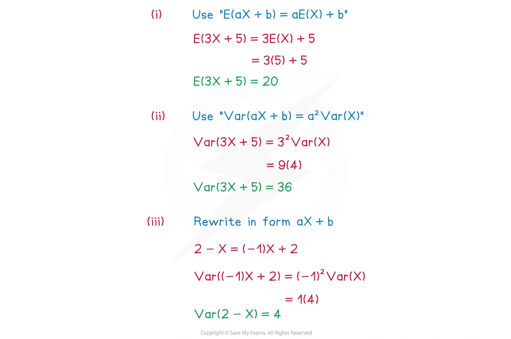
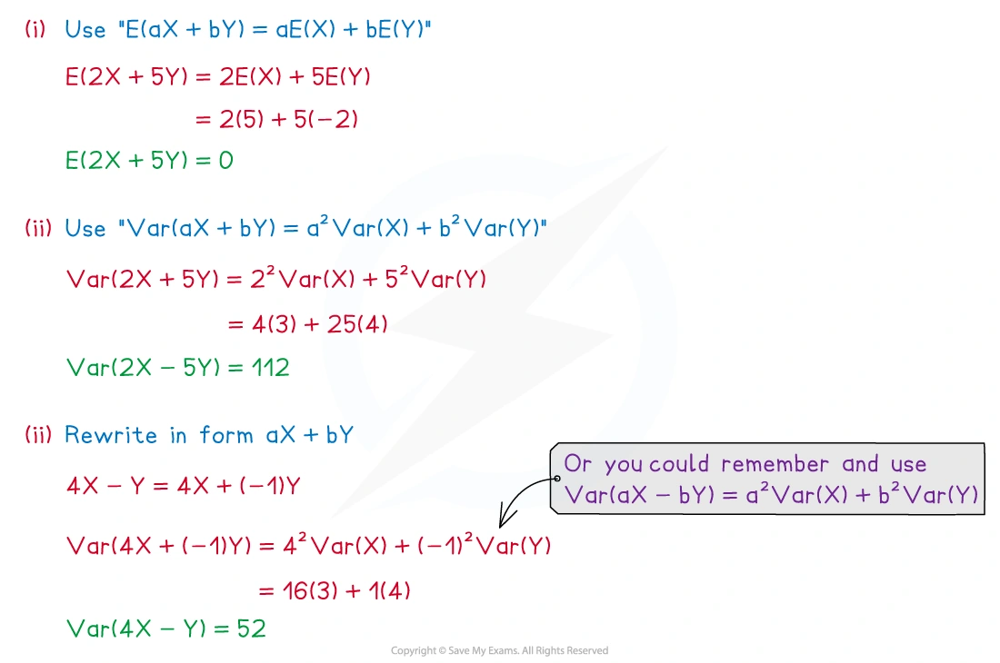
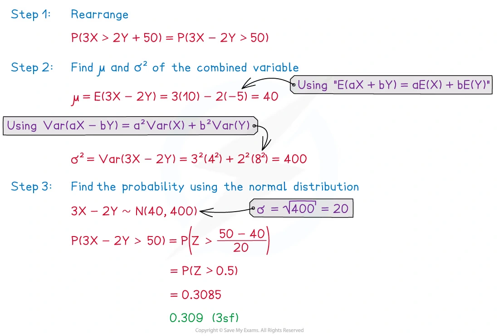

::: {.callout-important}
## 本节考纲要求

本页依据 9709 Mathematics 2026–2027 syllabus 6.2，覆盖：

- 使用 $E(aX+b)=aE(X)+b$ 和 $\operatorname{Var}(aX+b)=a^2\operatorname{Var}(X)$；
- 使用 $E(aX+bY)=aE(X)+bE(Y)$；
- 当 $X,Y$ independent 时，使用 $\operatorname{Var}(aX+bY)=a^2\operatorname{Var}(X)+b^2\operatorname{Var}(Y)$；
- 正态随机变量的线性组合仍为正态分布；
- independent normal random variables 的线性组合的分布；
- independent Poisson random variables 的和仍为 Poisson 分布。

真题均来自本地原始 QP，并与对应 mark scheme 核对；题目保持原文，不改写或编造。
:::

## Learning objectives

::: {.study-card}

- [ ] 区分 mean 的线性变化和 variance 的平方因子变化
- [ ] 对 $aX+b$ 求 expectation、variance 和 distribution
- [ ] 对 independent $X,Y$ 求 $E(aX+bY)$ 和 $\operatorname{Var}(aX+bY)$
- [ ] 处理负号：variance 中系数平方，但 mean 中保留符号
- [ ] 由 independent normal variables 的线性组合写出新的 normal distribution
- [ ] 由 independent Poisson variables 的和写出 $\operatorname{Po}(\lambda_1+\lambda_2)$
- [ ] 将不等式先整理成一个线性组合，再标准化求概率

:::

## 1. Core knowledge

### One random variable: $aX+b$

若 $X$ 的 mean 为 $\mu$、variance 为 $\sigma^2$，则

$$
E(aX+b)=a\mu+b,
$$

$$
\operatorname{Var}(aX+b)=a^2\sigma^2.
$$

加上常数 $b$ 只改变 mean，不改变 variance；乘以 $a$ 会把 mean 乘以 $a$，并把 variance 乘以 $a^2$。

如果 $X\sim N(\mu,\sigma^2)$，则

$$
aX+b\sim N(a\mu+b,a^2\sigma^2).
$$

### Two independent random variables: $aX+bY$

无论 $X,Y$ 是否 independent，expectation 都满足

$$
E(aX+bY)=aE(X)+bE(Y).
$$

当 $X,Y$ independent 时，variance 为

$$
\operatorname{Var}(aX+bY)
=a^2\operatorname{Var}(X)+b^2\operatorname{Var}(Y).
$$

如果不独立，不能直接删去 covariance 项；本考纲题目中使用该公式时，必须确认题目给出了 independent。

### Independent normal variables

若

$$
X\sim N(\mu_X,\sigma_X^2),
\qquad
Y\sim N(\mu_Y,\sigma_Y^2),
$$

且 $X,Y$ independent，则

$$
aX+bY\sim
N\left(a\mu_X+b\mu_Y,
a^2\sigma_X^2+b^2\sigma_Y^2\right).
$$

处理概率题时，先把不等式整理成 $aX+bY$ 的形式。例如

$$
Y<X_1+X_2
\quad\Longleftrightarrow\quad
Y-X_1-X_2<0.
$$

然后求该线性组合的 mean 和 variance，再用

$$
Z=\frac{\text{value}-\text{mean}}{\text{standard deviation}}.
$$

### Independent Poisson variables

若

$$
X\sim\operatorname{Po}(\lambda_1),
\qquad
Y\sim\operatorname{Po}(\lambda_2),
$$

且 $X,Y$ independent，则

$$
X+Y\sim\operatorname{Po}(\lambda_1+\lambda_2).
$$

多个 independent Poisson variables 的和同样把所有 mean 相加：

$$
X_1+X_2+\cdots+X_k
\sim\operatorname{Po}(\lambda_1+\lambda_2+\cdots+\lambda_k).
$$

注意：$X-Y$ 一般不是 Poisson 分布；只有和可以直接使用这个结论。

## 2. Note worked examples

每个 worked example 单独成卡片；图片均由原始 `2. Statistical Distributions.pdf` 的内嵌资源独立提取，不使用页面截图。

::: {.worked-example}
### Worked example 1 · Transforming one random variable

The random variable $X$ has $E(X)=5$ and $\operatorname{Var}(X)=4$. Find:

(i) $E(3X+5)$

(ii) $\operatorname{Var}(3X+5)$

(iii) $\operatorname{Var}(2-X)$

Using the linear expectation rule,

$$
E(3X+5)=3E(X)+5=3(5)+5=\boxed{20}.
$$

For variance, square the coefficient of $X$:

$$
\operatorname{Var}(3X+5)=3^2\operatorname{Var}(X)=9(4)=\boxed{36},
$$

and

$$
\operatorname{Var}(2-X)=(-1)^2\operatorname{Var}(X)=\boxed{4}.
$$

{.note-figure}
:::

::: {.worked-example}
### Worked example 2 · Combining two independent random variables

$X$ and $Y$ are independent random variables such that

$$
E(X)=5,\quad \operatorname{Var}(X)=3,
\qquad
E(Y)=-2,\quad \operatorname{Var}(Y)=4.
$$

Find:

(i) $E(2X+5Y)$

(ii) $\operatorname{Var}(2X+5Y)$

(iii) $\operatorname{Var}(4X-Y)$

$$
E(2X+5Y)=2(5)+5(-2)=\boxed{0}.
$$

Since $X,Y$ are independent,

$$
\operatorname{Var}(2X+5Y)=2^2(3)+5^2(4)=12+100=\boxed{112}.
$$

Finally,

$$
\operatorname{Var}(4X-Y)=4^2(3)+(-1)^2(4)=48+4=\boxed{52}.
$$

{.note-figure}
:::

::: {.worked-example}
### Worked example 3 · Probability from a normal linear combination

$$
X\sim N(10,4^2),
\qquad
Y\sim N(-5,8^2),
$$

and $X,Y$ are independent. Find $P(3X>2Y+50)$.

Rearrange the inequality:

$$
3X>2Y+50
\quad\Longleftrightarrow\quad
3X-2Y>50.
$$

The linear combination has

$$
\mu=3(10)-2(-5)=40,
$$

$$
\sigma^2=3^2(4^2)+(-2)^2(8^2)=144+256=400.
$$

Therefore $3X-2Y\sim N(40,400)$, with standard deviation $20$. Hence

$$
\begin{aligned}
P(3X-2Y>50)
&=P\left(Z>\frac{50-40}{20}\right)\\
&=P(Z>0.5)\\
&=\boxed{0.309\text{ (3 s.f.)}}.
\end{aligned}
$$

{.note-figure}
:::

## 3. Verified Paper 6 questions

以下题组保持原始题干、全部小问和原始分值；答案按对应 mark scheme 的得分路径展开。

::: {.question-card #p6-linear-q01}
### Question 1 · 9709/63/M/J/20 Q2

Each day at the gym, Sarah completes three runs. The distances, in metres, that she completes in the three runs have the independent distributions

$$
W\sim N(1520,450),\qquad X\sim N(2250,720),\qquad Y\sim N(3860,1050).
$$

Find the probability that, on a particular day, $Y$ is less than the total of $W$ and $X$. **[5]**

Show detailed mark scheme answer

Let $D=Y-W-X$. Since the variables are independent and the second parameters in the question are variances,

$$
E(D)=3860-1520-2250=90,
$$

$$
\operatorname{Var}(D)=1050+450+720=2220.
$$

Thus $D\sim N(90,2220)$. The required event is $D<0$:

$$
P(D<0)=P\left(Z<\frac{0-90}{\sqrt{2220}}\right)
=P(Z<-1.910).
$$

Therefore

$$
P(D<0)=1-\Phi(1.910)=\boxed{0.0281}.
$$

<strong>Source:</strong> PastPaper/2020/2020/9709-s20-qp-63.pdf, Q2, with the corresponding 9709/63/M/J/20 mark scheme.

:::

::: {.question-card #p6-linear-q02}
### Question 2 · 9709/62/M/J/21 Q4(a–c)

Wendy’s journey to work consists of three parts: walking to the train station, riding on the train and then walking to the office. The times, in minutes, for the three parts of her journey are independent and have the distributions

$$
N(15.0,1.1^2),\qquad N(32.0,3.5^2),\qquad N(8.6,1.2^2)
$$

respectively.

(a) Find the mean and variance of the total time for Wendy’s journey. **[2]**

If Wendy’s journey takes more than 60 minutes, she is late for work.

(b) Find the probability that, on a randomly chosen day, Wendy will be late for work. **[3]**

(c) Find the probability that the mean of Wendy’s journey times over 15 randomly chosen days will be less than 54.5 minutes. **[3]**

Show detailed mark scheme answer

Let $T$ be the total journey time. Independence gives

$$
E(T)=15.0+32.0+8.6=\boxed{55.6},
$$

$$
\operatorname{Var}(T)=1.1^2+3.5^2+1.2^2=\boxed{14.9}.
$$

(b) The sum is normal, so $T\sim N(55.6,14.9)$. Hence

$$
P(T>60)=P\left(Z>\frac{60-55.6}{\sqrt{14.9}}\right)
=P(Z>1.140)
=\boxed{0.127}.
$$

(c) For the mean of 15 independent journey times,

$$
\bar T\sim N\left(55.6,\frac{14.9}{15}\right).
$$

Therefore

$$
P(\bar T<54.5)=P\left(Z<\frac{54.5-55.6}{\sqrt{14.9/15}}\right)
=P(Z<-1.104)
=\boxed{0.135}.
$$

<strong>Source:</strong> PastPaper/2021/2021/9709_s21_qp_62.pdf, Q4(a–c), with the corresponding 9709/62/M/J/21 mark scheme.

:::

::: {.question-card #p6-linear-q03}
### Question 3 · 9709/61/O/N/22 Q4(a–b)

Each month a company sells $X$ kg of brown sugar and $Y$ kg of white sugar, where $X$ and $Y$ have the independent distributions

$$
X\sim N(2500,120^2),\qquad Y\sim N(3700,130^2)
$$

respectively.

(a) Find the mean and standard deviation of the total amount of sugar that the company sells in 3 randomly chosen months. **[3]**

The company makes a profit of $\$1.50$ per kilogram of brown sugar sold and makes a loss of $\$0.20$ per kilogram of white sugar sold.

(b) Find the probability that, in a randomly chosen month, the total profit is less than $\$3000$. **[5]**

Show detailed mark scheme answer

(a) The total over three months has mean

$$
3(2500+3700)=\boxed{18600\text{ kg}}.
$$

Its variance is

$$
3(120^2+130^2)=93900,
$$

so the standard deviation is

$$
\boxed{\sqrt{93900}=306\text{ kg (3 s.f.)}}.
$$

(b) Let the monthly profit be $P=1.5X-0.2Y$. Then

$$
E(P)=1.5(2500)-0.2(3700)=3010,
$$

$$
\operatorname{Var}(P)=1.5^2(120^2)+(-0.2)^2(130^2)=33076.
$$

Therefore

$$
P(P<3000)=P\left(Z<\frac{3000-3010}{\sqrt{33076}}\right)
=P(Z<-0.055)
=\boxed{0.478}.
$$

<strong>Source:</strong> PastPaper/2022/2022/9709_w22_qp_61.pdf, Q4(a–b), with the corresponding 9709/61/O/N/22 mark scheme.

:::

::: {.question-card #p6-linear-q04}
### Question 4 · 9709/62/F/M/23 Q5(a–b)

The masses, in grams, of large and small packets of Maxwheat cereal have the independent distributions

$$
L\sim N(410.0,3.6^2),\qquad S\sim N(206.0,3.7^2)
$$

respectively.

(a) Find the probability that a randomly chosen large packet has a mass that is more than double the mass of a randomly chosen small packet. **[5]**

The packets are placed in boxes. The boxes are identical in appearance. 60% of the boxes contain exactly 10 randomly chosen large packets. 40% of the boxes contain exactly 20 randomly chosen small packets.

(b) Find the probability that a randomly chosen box contains packets with a total mass of more than 4080 grams. **[6]**

Show detailed mark scheme answer

(a) Let $D=L-2S$. Then

$$
E(D)=410-2(206)=-2,
$$

$$
\operatorname{Var}(D)=3.6^2+(-2)^2(3.7^2)=67.72.
$$

Thus

$$
P(L>2S)=P(D>0)
=P\left(Z>\frac{0-(-2)}{\sqrt{67.72}}\right)
=P(Z>0.243)
=\boxed{0.404}.
$$

(b) For 10 large packets,

$$
T_L\sim N(10(410),10(3.6^2))=N(4100,129.6).
$$

For 20 small packets,

$$
T_S\sim N(20(206),20(3.7^2))=N(4120,273.8).
$$

For the 60% type of box,

$$
P(T_L>4080)=P\left(Z>\frac{4080-4100}{\sqrt{129.6}}\right)
=\Phi(1.757)=0.9605.
$$

For the 40% type,

$$
P(T_S>4080)=P\left(Z>\frac{4080-4120}{\sqrt{273.8}}\right)
=\Phi(2.417)=0.9921.
$$

The two box types are mutually exclusive, so

$$
P=0.6(0.9605)+0.4(0.9921)=\boxed{0.973}.
$$

<strong>Source:</strong> PastPaper/2023/2023/9709_m23_qp_62.pdf, Q5(a–b), with the corresponding 9709/62/F/M/23 mark scheme.

:::

::: {.question-card #p6-linear-q05}
### Question 5 · 9709/62/F/M/24 Q4(a–b)

Each year a transport firm uses $X$ litres of gasoline and $Y$ litres of diesel fuel, where $X$ and $Y$ have the independent distributions

$$
X\sim N(10700,950^2),\qquad Y\sim N(13400,1210^2).
$$

(a) Find the probability that in a randomly chosen year the firm uses more gasoline than diesel fuel. **[5]**

The costs per litre of gasoline and diesel fuel are $\$0.80$ and $\$0.85$ respectively.

(b) Find the probability that the total cost of gasoline and diesel fuel in a randomly chosen year is between $\$20000$ and $\$22000$. **[5]**

Show detailed mark scheme answer

(a) Let $D=X-Y$. Then

$$
E(D)=10700-13400=-2700,
$$

$$
\operatorname{Var}(D)=950^2+1210^2=2366600.
$$

Thus

$$
P(X>Y)=P(D>0)
=P\left(Z>\frac{0-(-2700)}{\sqrt{2366600}}\right)
=P(Z>1.755)
=\boxed{0.0397}.
$$

(b) Let total cost be $C=0.8X+0.85Y$. Then

$$
E(C)=0.8(10700)+0.85(13400)=19950,
$$

$$
\operatorname{Var}(C)=0.8^2(950^2)+0.85^2(1210^2)=1635412.25.
$$

Therefore

$$
P(20000<C<22000)
=\Phi\left(\frac{22000-19950}{\sqrt{1635412.25}}\right)
-\Phi\left(\frac{20000-19950}{\sqrt{1635412.25}}\right).
$$

The $z$ values are $1.603$ and $0.0391$, so

$$
P=0.9455-0.5156=\boxed{0.430}.
$$

<strong>Source:</strong> PastPaper/2024/2024/qp-202403-mathematics-p62.pdf, Q4(a–b), with the corresponding 9709/62/F/M/24 mark scheme.

:::

::: {.question-card #p6-linear-q06}
### Question 6 · 9709/61/M/J/24 Q2

The random variable $X$ has the distribution $N(31.2,10.4^2)$. Two independent random values of $X$, denoted by $X_1$ and $X_2$, are chosen.

Find $P(X_1\ge3X_2)$. **[5]**

Show detailed mark scheme answer

Let $D=X_1-3X_2$. Then

$$
E(D)=31.2-3(31.2)=-62.4,
$$

and, using independence,

$$
\operatorname{Var}(D)=10.4^2+(-3)^2(10.4^2)=1081.6.
$$

Since $D$ is a linear combination of independent normal variables,

$$
D\sim N(-62.4,1081.6).
$$

The required event is $D\ge0$:

$$
\begin{aligned}
P(D\ge0)
&=P\left(Z>\frac{0-(-62.4)}{\sqrt{1081.6}}\right)\\
&=1-\Phi(1.897)\\
&=\boxed{0.0289\text{ (3 s.f.)}}.
\end{aligned}
$$

<strong>Source:</strong> PastPaper/2024/2024/qp-202406-mathematics-p61.pdf, Q2, with the corresponding 9709/61/M/J/24 mark scheme.

:::

::: {.question-card #p6-linear-q07}
### Question 7 · 9709/63/O/N/24 Q2

The masses, in kilograms, of small and large bags of wheat have the independent distributions

$$
S\sim N(16.0,0.4),\qquad L\sim N(51.0,0.9)
$$

respectively.

Find the probability that the total mass of 3 randomly chosen small bags is greater than the mass of one randomly chosen large bag. **[5]**

Show detailed mark scheme answer

The second parameters in the question are variances. Let $D=S_1+S_2+S_3-L$. Then

$$
E(D)=3(16)-51=-3,
$$

$$
\operatorname{Var}(D)=3(0.4)+0.9=2.1.
$$

Thus $D\sim N(-3,2.1)$ and

$$
\begin{aligned}
P(D>0)
&=P\left(Z>\frac{0-(-3)}{\sqrt{2.1}}\right)\\
&=P(Z>2.070)\\
&=\boxed{0.0192\text{ (3 s.f.)}}.
\end{aligned}
$$

<strong>Source:</strong> PastPaper/2024/2024/qp-202410-mathematics-p63.pdf, Q2, with the corresponding 9709/63/O/N/24 mark scheme.

:::

::: {.question-card #p6-linear-q08}
### Question 8 · 9709/62/O/N/24 Q5(a–c)

A machine puts sweets into bags at random. The numbers of lemon and orange sweets in a bag have the independent distributions $\operatorname{Po}(3.7)$ and $\operatorname{Po}(2.6)$ respectively.

A bag of sweets is chosen at random.

(a) Find the probability that the number of lemon sweets in the bag is more than 2 but not more than 5. **[2]**

(b) Find the probability that the total number of lemon and orange sweets in the bag is less than 4. **[3]**

10 bags of sweets are chosen at random.

(c) Use approximating distributions to find the probability that the total number of lemon sweets in the 10 bags is less than the total number of orange sweets in the 10 bags. **[6]**

Show detailed mark scheme answer

(a) For lemon sweets, $L\sim\operatorname{Po}(3.7)$:

$$
\begin{aligned}
P(2<L\le5)
&=e^{-3.7}\left(\frac{3.7^3}{3!}+\frac{3.7^4}{4!}+\frac{3.7^5}{5!}\right)\\
&=\boxed{0.545\text{ (3 s.f.)}}.
\end{aligned}
$$

(b) Since independent Poisson variables add,

$$
L+O\sim\operatorname{Po}(3.7+2.6)=\operatorname{Po}(6.3).
$$

Therefore

$$
\begin{aligned}
P(L+O<4)
&=P(L+O\le3)\\
&=e^{-6.3}\left(1+6.3+\frac{6.3^2}{2!}+\frac{6.3^3}{3!}\right)\\
&=\boxed{0.126\text{ (3 s.f.)}}.
\end{aligned}
$$

(c) Over 10 bags, let $L_T$ and $O_T$ be the total numbers of lemon and orange sweets. Then

$$
L_T\sim\operatorname{Po}(37),\qquad O_T\sim\operatorname{Po}(26).
$$

Using normal approximations,

$$
L_T\approx N(37,37),\qquad O_T\approx N(26,26).
$$

Let $D=O_T-L_T$. The variables are independent, so

$$
D\approx N(-11,63).
$$

The required event is $D>0$:

$$
P(D>0)=P\left(Z>\frac{0-(-11)}{\sqrt{63}}\right)
=P(Z>1.386)
=\boxed{0.0829\text{ (3 s.f.)}}.
$$

The mark scheme also accepts $0.0737$ when continuity correction is applied to the difference.

<strong>Source:</strong> PastPaper/2024/2024/qp-202410-mathematics-p62.pdf, Q5(a–c), with the corresponding 9709/62/O/N/24 mark scheme.

:::

::: {.callout-note}
## Exam checklist

1. Mean 中的系数保留正负号；variance 中的每个系数必须平方。
2. 只有在题目说明 independent 时，才能直接相加各项 variance。
3. $N(\mu,\sigma^2)$ 的第二个参数是 variance；若要求 standard deviation，要再开平方。
4. 先把概率不等式整理成一个线性组合，再求该组合的 mean 和 variance。
5. Independent Poisson variables 的和仍是 Poisson，但差一般不能直接写成 Poisson。
:::
