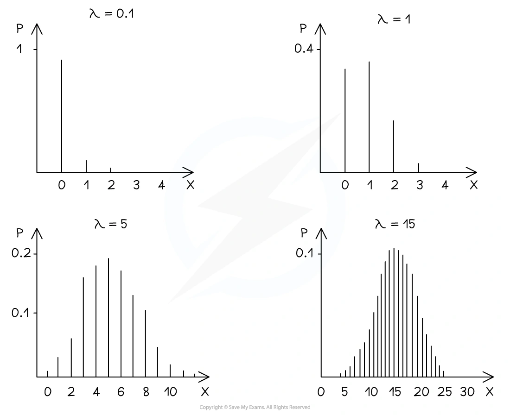
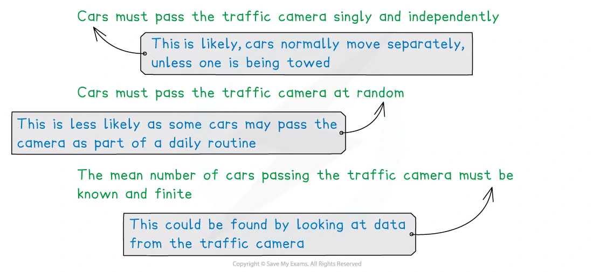
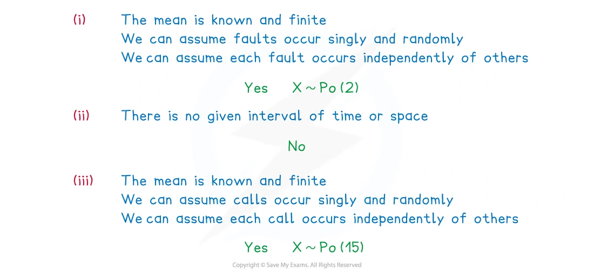
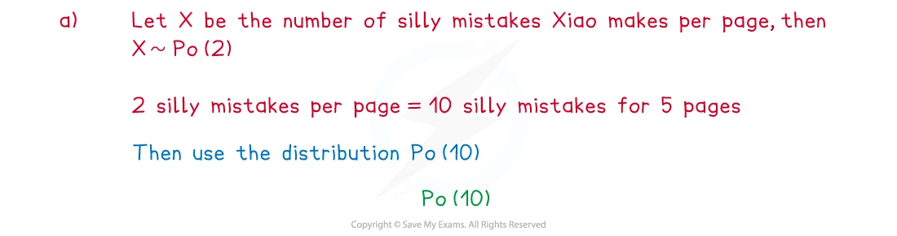

::: {.callout-important}
## 本节考纲要求

本页依据 9709 Mathematics 2026–2027 syllabus 6.1，覆盖：

- 使用公式计算 $X\sim\operatorname{Po}(\lambda)$ 的概率；
- 使用 Poisson 分布的 mean 和 variance 都等于 $\lambda$；
- 理解 Poisson 分布适合描述随机事件，并判断 Poisson model 的条件；
- 在 $n$ 大、$p$ 小时用 Poisson 分布近似二项分布，约记 $n>50$、$np<5$；
- 在 $\lambda$ 较大时用带 continuity correction 的正态分布近似 Poisson 分布，约记 $\lambda>15$。

真题均来自本地原始 QP，并与对应 mark scheme 核对；题目保持原文，不改写或编造。
:::

## Learning objectives

::: {.study-card}

- [ ] 识别 $X\sim\operatorname{Po}(\lambda)$，并知道 $E(X)=\lambda$、$\operatorname{Var}(X)=\lambda$
- [ ] 使用 $P(X=r)=e^{-\lambda}\dfrac{\lambda^r}{r!}$
- [ ] 正确处理 exactly、at most、more than、between 等措辞
- [ ] 按比例改变时间或空间区间对应的 mean $\lambda$
- [ ] 判断事件是否 singly、random、independent，以及平均速率是否 constant
- [ ] 用 $\lambda=np$ 作二项分布的 Poisson approximation
- [ ] 用 $X\approx N(\lambda,\lambda)$ 作 Poisson 的 normal approximation，并使用 continuity correction

:::

## 1. Core knowledge

### Poisson distribution

Poisson 分布用于描述固定时间或空间区间内某类事件发生的次数。若

$$
X\sim\operatorname{Po}(\lambda),
$$

则 $\lambda$ 是该区间内的平均发生次数，并且

$$
P(X=r)=e^{-\lambda}\frac{\lambda^r}{r!},
\qquad r=0,1,2,\ldots
$$

$$
E(X)=\lambda,
\qquad
\operatorname{Var}(X)=\lambda.
$$

### Conditions for a Poisson model

在题目情境中，通常需要说明：

1. 事件在给定区间内发生 singly，即不会同时发生；
2. 事件以 random 的方式发生；
3. 各事件相互 independent；
4. 平均发生率 constant，且该区间的平均次数已知并且 finite。

并不是所有“计数”都适合 Poisson。若没有给定时间或空间区间，或者事件明显按固定规律发生，就不能直接建立 Poisson model。

### Probabilities and wording

$$
P(X\le r)=e^{-\lambda}\sum_{k=0}^{r}\frac{\lambda^k}{k!}
$$

$$
P(X>r)=1-P(X\le r)
$$

$$
P(a\le X\le b)=e^{-\lambda}\sum_{k=a}^{b}\frac{\lambda^k}{k!}.
$$

常见翻译：

- exactly $r$：$P(X=r)$；
- at most $r$：$P(X\le r)$；
- fewer than $r$：$P(X\le r-1)$；
- more than $r$：$P(X>r)=1-P(X\le r)$；
- between $a$ and $b$ inclusive：$P(a\le X\le b)$。

### Changing the interval

若平均速率为 $r$ 次/单位时间，时间区间变为原来的 $c$ 倍，则 mean 也变为 $c$ 倍：

$$
\lambda_{\text{new}}=c\lambda_{\text{old}}.
$$

例如，8 小时平均 25.2 个订单，则 3 小时的 mean 是

$$
25.2\times\frac38=9.45.
$$

### Poisson approximation to the binomial

若 $Y\sim B(n,p)$，且 $n$ 很大、$p$ 很小，可用

$$
Y\approx\operatorname{Po}(\lambda),
\qquad \lambda=np.
$$

考纲给出的近似条件约为 $n>50$、$np<5$。使用近似时，先求 $\lambda=np$，再用 Poisson 概率公式。

### Normal approximation to Poisson

当 $\lambda$ 较大（约 $\lambda>15$）时，可用

$$
X\sim\operatorname{Po}(\lambda)
\quad\Longrightarrow\quad
X\approx N(\lambda,\lambda),
$$

其中第二个参数是 variance。因为 Poisson 是离散分布，正态分布是连续分布，必须使用 continuity correction：

$$
P(X\le r)\approx P(Y<r+0.5),
$$

$$
P(X\ge r)\approx P(Y>r-0.5),
$$

$$
P(a\le X\le b)\approx P(a-0.5<Y<b+0.5).
$$

## 2. Note worked examples

每个 worked example 单独成卡片；图片均由原始 `2. Statistical Distributions.pdf` 的内嵌资源独立提取，不使用页面截图。

::: {.worked-example}
### Worked example 1 · Properties of a Poisson distribution

Poisson 分布的形状由 $\lambda$ 决定。$\lambda$ 较小时，图像通常右偏；随着 $\lambda$ 增大，分布变得更对称、更接近钟形。

$$
X\sim\operatorname{Po}(\lambda)
\quad\Longrightarrow\quad
E(X)=\operatorname{Var}(X)=\lambda.
$$

{.note-figure}
:::

::: {.worked-example}
### Worked example 2 · Conditions for a Poisson model

The random variable $X$ represents the number of cars that pass a traffic camera per day. State the conditions that would need to be met for $X$ to follow a Poisson distribution.

The events must occur singly, randomly and independently. The mean number of cars passing the camera must also be known and finite. In context, the rate should be constant over the chosen day or comparable days.

{.note-figure}
:::

::: {.worked-example}
### Worked example 3 · Deciding whether a Poisson model is suitable

State, with reasons, whether the following can be modelled using a Poisson distribution and state the distribution when appropriate.

(i) Faults occur in a length of cloth at a mean rate of 2 per metre.

(ii) On average 4% of a certain population has green eyes.

(iii) An emergency service company receives, on average, 15 calls per hour.

(i) is suitable if faults occur singly, randomly and independently and the mean is known and finite; then $X\sim\operatorname{Po}(2)$.

(ii) is not a Poisson model because there is no given time or space interval in which the events are counted.

(iii) is suitable if calls occur singly, randomly and independently and the mean is known and finite; then $X\sim\operatorname{Po}(15)$.

{.note-figure}
:::

::: {.worked-example}
### Worked example 4 · Changing the mean and cumulative probabilities

Xiao makes silly mistakes in his maths homework at a mean rate of 2 per page.

(a) Define a suitable distribution to model the number of silly mistakes Xiao would make in a piece of homework that is five pages long. State any assumptions you have made.

(b) Find the probability that in any random page of Xiao's homework book there are:

(i) exactly three silly mistakes;

(ii) at most three silly mistakes;

(iii) more than three silly mistakes.

For one page, let $X$ be the number of mistakes. Then $X\sim\operatorname{Po}(2)$. For five pages, the mean becomes $5\times2=10$, so the homework count is modelled by $\operatorname{Po}(10)$, assuming mistakes occur singly, randomly and independently at a constant mean rate.

For one random page,

$$
P(X=3)=e^{-2}\frac{2^3}{3!}=\boxed{0.180\text{ (3 s.f.)}}.
$$

$$
\begin{aligned}
P(X\le3)
&=e^{-2}\left(1+2+\frac{2^2}{2!}+\frac{2^3}{3!}\right)\\
&=\boxed{0.857\text{ (3 s.f.)}}.
\end{aligned}
$$

$$
P(X>3)=1-P(X\le3)=1-0.857=\boxed{0.143\text{ (3 s.f.)}}.
$$

{.note-figure}
:::

## 3. Verified Paper 6 questions

以下题组保持原始题干、全部小问和原始分值；答案按对应 mark scheme 的得分路径展开。

::: {.question-card #p6-poisson-q01}
### Question 1 · 9709/62/O/N/20 Q5(a–d)

Customers arrive at a shop at a constant average rate of 2.3 per minute.

(a) State another condition for the number of customers arriving per minute to have a Poisson distribution. **[1]**

It is now given that the number of customers arriving per minute has the distribution $\operatorname{Po}(2.3)$.

(b) Find the probability that exactly 3 customers arrive during a 1-minute period. **[2]**

(c) Find the probability that more than 3 customers arrive during a 2-minute period. **[3]**

(d) Five 1-minute periods are chosen at random. Find the probability that no customers arrive during exactly 2 of these 5 periods. **[3]**

Show detailed mark scheme answer

(a) A valid additional condition is that customers arrive independently, singly or randomly. For example, state that arrivals are independent.

(b)

$$
P(X=3)=e^{-2.3}\frac{2.3^3}{3!}=\boxed{0.203\text{ (3 s.f.)}}.
$$

(c) Over 2 minutes the mean is $\lambda=2(2.3)=4.6$. Therefore

$$
\begin{aligned}
P(X>3)
&=1-P(X\le3)\\
&=1-e^{-4.6}\left(1+4.6+\frac{4.6^2}{2!}+\frac{4.6^3}{3!}\right)\\
&=\boxed{0.674\text{ (3 s.f.)}}.
\end{aligned}
$$

(d) The probability that no customer arrives in one minute is

$$
q=P(X=0)=e^{-2.3}.
$$

Let $Y$ be the number of the five periods with no arrivals. Then $Y\sim B(5,q)$, so

$$
\begin{aligned}
P(Y=2)
&=\binom52(e^{-2.3})^2(1-e^{-2.3})^3\\
&=\boxed{0.0732\text{ (3 s.f.)}}.
\end{aligned}
$$

<strong>Source:</strong> PastPaper/2020/2020/9709_w20_qp_62.pdf, Q5(a–d), with the corresponding 9709/62/O/N/20 mark scheme.

:::

::: {.question-card #p6-poisson-q02}
### Question 2 · 9709/61/O/N/21 Q2

The number of enquiries received per day at a customer service desk has a Poisson distribution with mean 45.2. If more than 60 enquiries are received in a day, the customer service desk cannot deal with them all.

Use a suitable approximating distribution to find the probability that, on a randomly chosen day, the customer service desk cannot deal with all the enquiries that are received. **[4]**

Show detailed mark scheme answer

Let $X$ be the number of enquiries. Since $X\sim\operatorname{Po}(45.2)$ and $\lambda=45.2$ is sufficiently large,

$$
X\approx N(45.2,45.2).
$$

More than 60 means $X\ge61$. With continuity correction,

$$
P(X>60)\approx P(Y>60.5).
$$

Standardising,

$$
P(Y>60.5)=P\left(Z>\frac{60.5-45.2}{\sqrt{45.2}}\right)
=P(Z>2.276).
$$

Therefore

$$
P=1-\Phi(2.276)=\boxed{0.0114}.
$$

<strong>Source:</strong> PastPaper/2021/2021/9709_w21_qp_61.pdf, Q2, with the corresponding 9709/61/O/N/21 mark scheme.

:::

::: {.question-card #p6-poisson-q03}
### Question 3 · 9709/63/M/J/22 Q5(a–c)

The number of clients who arrive at an information desk has a Poisson distribution with mean 2.2 per 5-minute period.

(a) Find the probability that, in a randomly chosen 15-minute period, exactly 6 clients arrive at the desk. **[3]**

(b) If more than 4 clients arrive during a 5-minute period, they cannot all be served. Find the probability that, during a randomly chosen 5-minute period, not all the clients who arrive at the desk can be served. **[2]**

(c) Use a suitable approximating distribution to find the probability that, during a randomly chosen 1-hour period, fewer than 20 clients arrive at the desk. **[4]**

Show detailed mark scheme answer

(a) A 15-minute period is three times as long as a 5-minute period, so $\lambda=3(2.2)=6.6$:

$$
P(X=6)=e^{-6.6}\frac{6.6^6}{6!}=\boxed{0.156\text{ (3 s.f.)}}.
$$

(b)

$$
\begin{aligned}
P(X>4)
&=1-e^{-2.2}\left(1+2.2+\frac{2.2^2}{2!}+\frac{2.2^3}{3!}+\frac{2.2^4}{4!}\right)\\
&=\boxed{0.0725\text{ (3 s.f.)}}.
\end{aligned}
$$

(c) One hour contains twelve 5-minute periods, so $\lambda=12(2.2)=26.4$. Use

$$
X\approx N(26.4,26.4).
$$

Fewer than 20 means $X\le19$. After continuity correction,

$$
P(X<20)\approx P(Y<19.5).
$$

Thus

$$
P\left(Z<\frac{19.5-26.4}{\sqrt{26.4}}\right)
=P(Z<-1.343)
=\boxed{0.0897\text{ (3 s.f.)}}.
$$

<strong>Source:</strong> PastPaper/2022/2022/9709_s22_qp_63.pdf, Q5(a–c), with the corresponding 9709/63/M/J/22 mark scheme.

:::

::: {.question-card #p6-poisson-q04}
### Question 4 · 9709/62/F/M/23 Q2(a–c)

The number of orders arriving at a shop during an 8-hour working day is modelled by the random variable $X$ with distribution $\operatorname{Po}(25.2)$.

(a) State two assumptions that are required for the Poisson model to be valid in this context. **[2]**

(b) (i) Find the probability that the number of orders that arrive in a randomly chosen 3-hour period is between 3 and 5 inclusive. **[3]**

(ii) Find the probability that, in two randomly chosen 1-hour periods, exactly 1 order will arrive in one of the 1-hour periods, and at least 2 orders will arrive in the other 1-hour period. **[4]**

(c) The shop can only deal with a maximum of 120 orders during any 36-hour period. Use a suitable approximating distribution to find the probability that, in a randomly chosen 36-hour period, there will be too many orders for the shop to deal with. **[4]**

Show detailed mark scheme answer

(a) Any two valid assumptions include: orders arrive at a constant mean rate; orders arrive randomly; orders arrive independently; orders arrive singly.

(b)(i) A 3-hour period is $3/8$ of a working day, so

$$
\lambda=25.2\times\frac38=9.45.
$$

$$
\begin{aligned}
P(3\le X\le5)
&=e^{-9.45}\left(\frac{9.45^3}{3!}+\frac{9.45^4}{4!}+\frac{9.45^5}{5!}\right)\\
&=\boxed{0.0866\text{ (3 s.f.)}}.
\end{aligned}
$$

(b)(ii) For one hour, $\lambda=25.2/8=3.15$. The two possible orders of the conditions are disjoint, so

$$
\begin{aligned}
P
&=2P(X=1)P(X\ge2)\\
&=2\left(e^{-3.15}\frac{3.15^1}{1!}\right)
\left[1-e^{-3.15}(1+3.15)\right]\\
&=\boxed{0.222\text{ (3 s.f.)}}.
\end{aligned}
$$

(c) In 36 hours, $\lambda=25.2(36/8)=113.4$. Use

$$
X\approx N(113.4,113.4).
$$

Too many orders means $X\ge121$, so continuity correction gives

$$
P(X\ge121)\approx P(Y>120.5).
$$

$$
P\left(Z>\frac{120.5-113.4}{\sqrt{113.4}}\right)
=P(Z>0.667)
=\boxed{0.252\text{ (3 s.f.)}}.
$$

<strong>Source:</strong> PastPaper/2023/2023/9709_m23_qp_62.pdf, Q2(a–c), with the corresponding 9709/62/F/M/23 mark scheme.

:::

::: {.question-card #p6-poisson-q05}
### Question 5 · 9709/61/M/J/24 Q5(a–c)

Sales of cell phones at a certain shop occur singly, randomly and independently.

(a) State one further condition that must be satisfied for the number of sales in a certain time period to be well modelled by a Poisson distribution. **[1]**

The average number of sales per hour is 1.2. Assume now that a Poisson distribution is a suitable model.

(b) Find the probability that the number of sales during a randomly chosen 12-hour period will be more than 12 and less than 16. **[3]**

(c) Use a suitable approximating distribution to find the probability that the number of sales during a randomly chosen 1-month period (140 hours) will be less than 150. **[4]**

Show detailed mark scheme answer

(a) The average rate must be constant.

(b) For 12 hours, $\lambda=12(1.2)=14.4$. More than 12 and less than 16 means $X=13,14,15$:

$$
\begin{aligned}
P(12<X<16)
&=e^{-14.4}\left(\frac{14.4^{13}}{13!}+\frac{14.4^{14}}{14!}+\frac{14.4^{15}}{15!}\right)\\
&=\boxed{0.309\text{ (3 s.f.)}}.
\end{aligned}
$$

(c) For 140 hours, $\lambda=140(1.2)=168$. Use

$$
X\approx N(168,168).
$$

Fewer than 150 means $X\le149$, so

$$
P(X<150)\approx P(Y<149.5).
$$

Therefore

$$
P\left(Z<\frac{149.5-168}{\sqrt{168}}\right)
=P(Z<-1.427)
=\boxed{0.0768\text{ (3 s.f.)}}.
$$

<strong>Source:</strong> PastPaper/2024/2024/qp-202406-mathematics-p61.pdf, Q5(a–c), with the corresponding 9709/61/M/J/24 mark scheme.

:::

::: {.question-card #p6-poisson-q06}
### Question 6 · 9709/62/O/N/24 Q1

A random variable $X$ has the distribution $B\left(4500000,\dfrac1{1000000}\right)$.

Use a Poisson distribution to calculate an estimate of $P(X\ge4)$. **[3]**

Show detailed mark scheme answer

Here

$$
n=4500000,\qquad p=\frac1{1000000},
$$

so the Poisson approximation has

$$
\lambda=np=4500000\left(\frac1{1000000}\right)=4.5.
$$

Therefore

$$
\begin{aligned}
P(X\ge4)
&\approx1-P(X\le3)\\
&=1-e^{-4.5}\left(1+4.5+\frac{4.5^2}{2!}+\frac{4.5^3}{3!}\right)\\
&=\boxed{0.658\text{ (3 s.f.)}}.
\end{aligned}
$$

<strong>Source:</strong> PastPaper/2024/2024/qp-202410-mathematics-p62.pdf, Q1, with the corresponding 9709/62/O/N/24 mark scheme.

:::

::: {.callout-note}
## Exam checklist

1. 先确认题目给出的 $\lambda$ 对应哪个时间或空间区间。
2. “more than $r$” 从 $1-P(X\le r)$ 开始；“fewer than $r$” 是 $P(X\le r-1)$。
3. 改变区间后要按比例改变 $\lambda$，不能继续使用原来的 mean。
4. Poisson 正态近似使用 $N(\lambda,\lambda)$，第二个参数是 variance。
5. 离散到连续必须做 continuity correction，例如 $X\ge121$ 对应 $Y>120.5$。
:::
