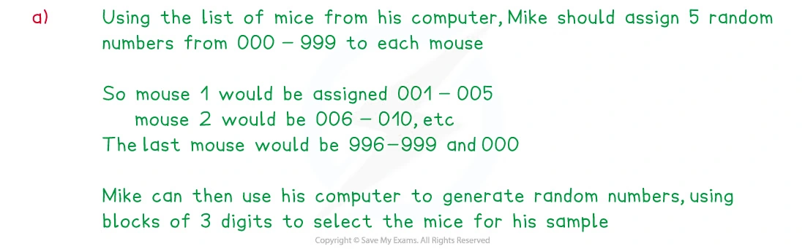
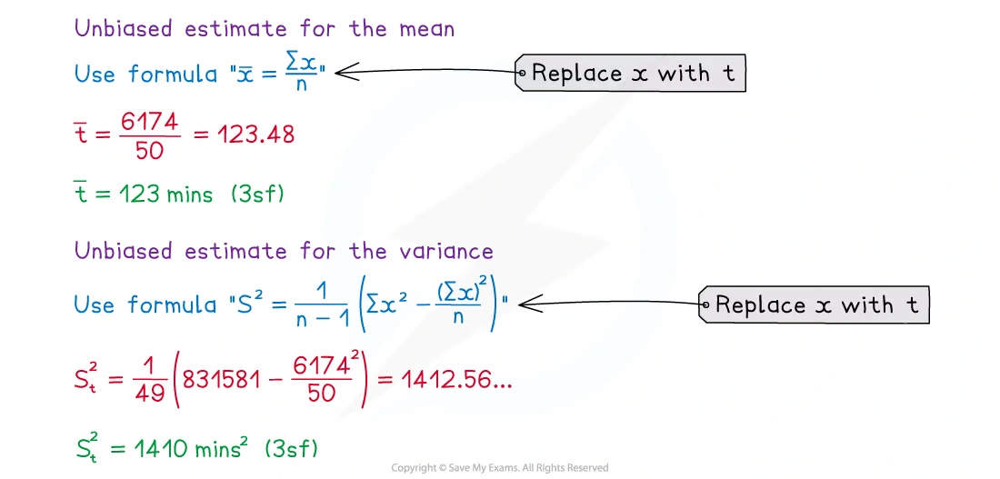
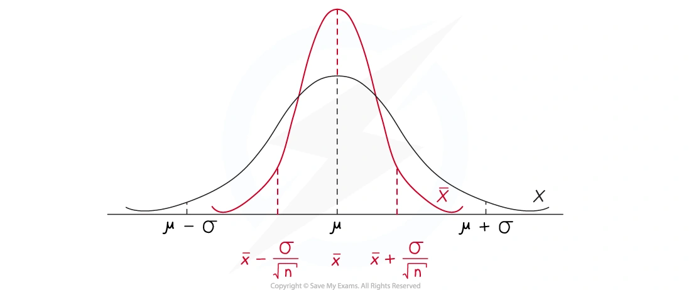
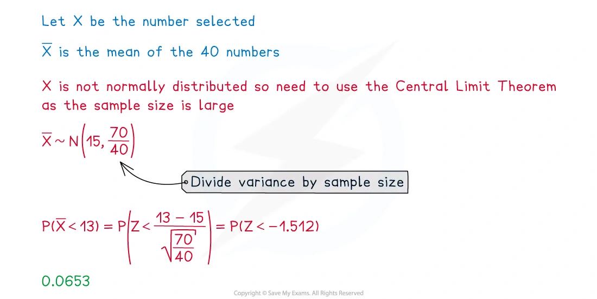
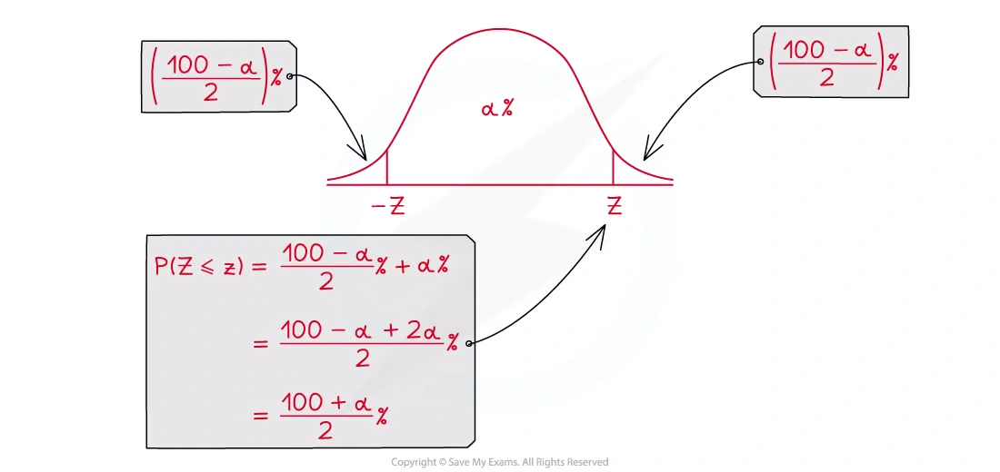
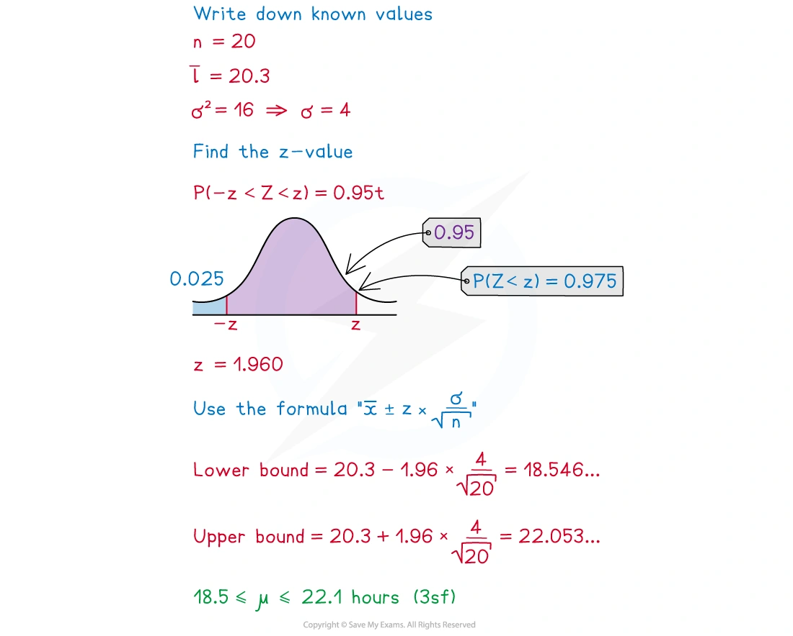
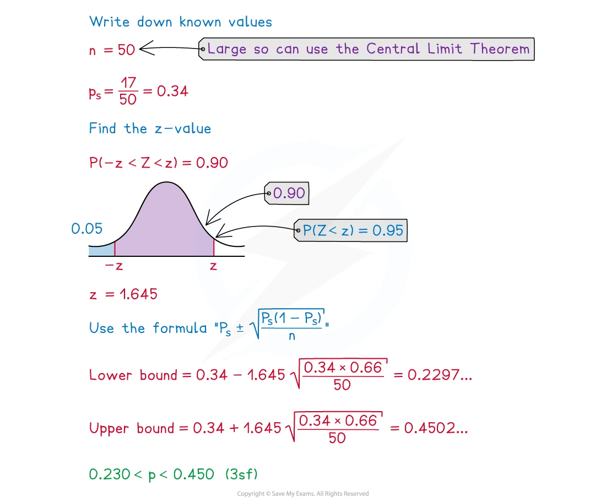

::: {.callout-important}
## 本节考纲要求

本页依据 9709 Mathematics 2026–2027 syllabus 6.4，覆盖：

- 区分 population、sample、sampling frame、parameter 和 statistic，并理解为什么抽样需要随机性；
- 使用 elementary random-number sampling，识别 sampling bias，以及说明某种抽样方法为什么可能不理想；
- 使用样本均值作为总体均值的估计，并使用无偏样本方差估计总体方差；
- 使用 $E(\bar X)=\mu$ 和 $\operatorname{Var}(\bar X)=\sigma^2/n$；
- 当总体正态或样本量较大时，使用样本均值的正态分布；
- 在总体方差已知或样本量较大时，求总体均值的 confidence interval；
- 用大样本近似求总体 proportion 的 confidence interval。

真题均来自本地原始 QP，并与对应 mark scheme 核对；题目保持原文，不改写或编造。
:::

## Learning objectives

::: {.study-card}

- [ ] 区分 population、sample、sampling frame、parameter 和 statistic
- [ ] 说明 random sampling 的作用，并识别 bias、under-coverage、非代表性样本和 census 的实际问题
- [ ] 从 raw data 或 summary statistics 计算无偏的总体均值和方差估计
- [ ] 使用 $E(\bar X)=\mu$、$\operatorname{Var}(\bar X)=\sigma^2/n$ 和 $\operatorname{sd}(\bar X)=\sigma/\sqrt n$
- [ ] 判断何时使用 normal distribution，何时必须使用 Central Limit Theorem
- [ ] 求并解释总体均值和总体比例的 confidence interval

:::

## 1. Core knowledge

### Population, sample and sampling frame

**Population** 是研究对象的完整集合；从 population 中实际观察到的一部分称为 **sample**。列出 population 中每个成员的清单称为 **sampling frame**。总体的未知数值（例如总体均值 $\mu$ 或总体方差 $\sigma^2$）是 **parameter**；由样本计算出的数值（例如 $\bar X$ 或 $s^2$）是 **statistic**。

抽样的目的是用较小的 sample 推断 population。样本必须尽量有代表性；如果某些成员被系统性排除，或者选择与目标特征有关，就会产生 bias。random sampling 使每个成员有已知且通常相等的机会被选中，从而减少选择偏差。用 calculator 的 random digits 时，可以给每个成员编号，并按位数读取不重复的编号，跳过超出范围的数字。

**Census** 调查 population 的每个成员，理论上没有 sampling error，但通常耗时、昂贵，并且可能难以取得全部成员的回应。因此实际调查常使用合适的 random sample。

### Unbiased estimates

给定随机样本 $X_1,X_2,\ldots,X_n$，总体均值的无偏估计为

$$
\widehat\mu=\bar X=\frac{\sum X}{n}.
$$

总体方差的无偏估计为

$$
s^2=\frac{1}{n-1}\left(\sum X^2-\frac{(\sum X)^2}{n}\right).
$$

分母是 $n-1$，不是 $n$。使用 $n$ 会得到 biased estimate of the population variance。

### Distribution of the sample mean

如果总体的 mean 为 $\mu$，variance 为 $\sigma^2$，则

$$
E(\bar X)=\mu,
\qquad
\operatorname{Var}(\bar X)=\frac{\sigma^2}{n},
\qquad
\operatorname{sd}(\bar X)=\frac{\sigma}{\sqrt n}.
$$

如果 $X$ 本身是正态分布，则

$$
\bar X\sim N\left(\mu,\frac{\sigma^2}{n}\right).
$$

如果总体分布未知或不是正态分布，但 $n$ 足够大，则由 **Central Limit Theorem**，$\bar X$ 可以近似看作上述正态分布。注意：CLT 使 sample mean 近似正态，不是使原始 observations 变成正态。

### Confidence interval for a population mean

当总体方差已知，或者样本量足够大而可以使用 CLT 时，confidence interval for $\mu$ 为

$$
\bar x\pm z\frac{\sigma}{\sqrt n},
$$

其中 $z$ 由 confidence level 决定，例如

$$
\begin{array}{c|c}
\text{confidence level}&z\\ \hline
90\%&1.645\\
95\%&1.960\\
98\%&2.326\\
99\%&2.576
\end{array}
$$

若题目要求的是 98% interval，就使用 $z=2.326$，而不是把 0.98 直接放进公式。

Confidence interval 的正确解释是：这种构造方法长期重复使用时，约有相应百分比的区间会包含真实的 population mean。它不是说相同比例的 individual observations 会落在该区间内。

### Confidence interval for a population proportion

若样本中有 $r$ 个成员具有目标性质，样本比例为

$$
\hat p=\frac rn.
$$

大样本下，population proportion $p$ 的 approximate confidence interval 为

$$
\hat p\pm z\sqrt{\frac{\hat p(1-\hat p)}{n}}.
$$

要使 interval 变窄，可以增大 sample size，或选择较低的 confidence level（较小的 $z$）。

## 2. Note worked examples

每个 worked example 单独成卡片；图片均由原始 `1. Statistical Sampling.pdf` 的对应页面独立提取，不使用页面截图。

::: {.worked-example}
### Worked example 1 · Choosing a sampling method

Note 先比较 different sampling methods。抽样方法必须结合 population、sampling frame、是否需要随机性和可能的 bias 一起判断：

- simple random sampling：从完整 sampling frame 中随机选择，通常最能减少选择偏差；
- systematic sampling：按固定间隔选择，执行方便，但要留意名单中的周期性；
- stratified sampling：先按重要特征分层，再按各层比例抽样，可保证各层都有代表；
- opportunity sampling：选择最容易接触到的人，方便但很容易产生 bias。

判断一个方法是否 satisfactory 时，要说明它是否能代表目标 population，而不是只写“random”或“not random”。

{.note-figure}
:::

::: {.worked-example}
### Worked example 2 · Unbiased estimates from summary data

50 名学生完成任务所需时间 $t$ 的 summary data 为

$$
n=50,\qquad \sum t=6174,\qquad \sum t^2=831581.
$$

总体均值的估计为

$$
\widehat\mu=\bar t=\frac{6174}{50}=123.48\approx\boxed{123\text{ (3 s.f.)}}.
$$

总体方差的无偏估计为

$$
\begin{aligned}
s^2
&=\frac1{49}\left(831581-\frac{6174^2}{50}\right)\\
&=139.9\ldots\\
&\approx\boxed{140\text{ (3 s.f.)}}.
\end{aligned}
$$

关键是使用 $n-1=49$，并先减去 $ (\sum t)^2/n$。

{.note-figure}
:::

::: {.worked-example}
### Worked example 3 · Distribution of a sample mean

若 $X\sim N(30,5^2)$，从总体中随机抽取 $n=10$ 个 observations，样本均值的分布为

$$
\bar X\sim N\left(30,\frac{5^2}{10}\right)=\boxed{N(30,2.5)}.
$$

这里第二个参数是 variance，不是 standard deviation；所以样本均值的 standard deviation 是

$$
\sqrt{2.5}=\frac5{\sqrt{10}}.
$$

{.note-figure}
:::

::: {.worked-example}
### Worked example 4 · Central Limit Theorem

从整数 $1,2,\ldots,29$ 中随机抽取一个数。总体 mean 和 variance 为

$$
\mu=15,\qquad \sigma^2=70.
$$

对 $n=40$ 个数的样本均值，CLT 给出

$$
\bar X\approx N\left(15,\frac{70}{40}\right).
$$

因此

$$
\begin{aligned}
P(\bar X<13)
&=P\left(Z<\frac{13-15}{\sqrt{70/40}}\right)\\
&=P(Z<-1.51)\\
&\approx\boxed{0.0653}.
\end{aligned}
$$

必须使用 CLT，因为原始 population 是离散的、并不是正态分布，而 sample size $40$ 足够大，使 sample mean 可以近似正态。

{.note-figure}
:::

::: {.worked-example}
### Worked example 5 · Confidence interval for a population mean

电池寿命 $L$ 为正态分布，population variance 为 $16$。随机抽取 20 部手机，得到 sample mean $\bar l=20.3$。95% confidence interval 使用 $z=1.96$：

$$
\begin{aligned}
\bar l\pm z\frac{\sigma}{\sqrt n}
&=20.3\pm1.96\frac4{\sqrt{20}}\\
&=\boxed{18.5\le\mu\le22.1\quad\text{(3 s.f.)}}.
\end{aligned}
$$

这个 interval 是对 population mean $\mu$ 的估计，不是说 95% 的 individual battery lives 落在 interval 内。

{.note-figure}

{.note-figure}
:::

::: {.worked-example}
### Worked example 6 · Confidence interval for a population proportion

从 50 条鱼中随机抽取的样本有 17 条符合目标条件，所以

$$
\hat p=\frac{17}{50}=0.34.
$$

90% confidence interval 使用 $z=1.645$：

$$
\begin{aligned}
\hat p\pm z\sqrt{\frac{\hat p(1-\hat p)}n}
&=0.34\pm1.645\sqrt{\frac{0.34(0.66)}{50}}\\
&=\boxed{0.230\le p\le0.450\quad\text{(3 s.f.)}}.
\end{aligned}
$$

{.note-figure}
:::

## 3. Verified Paper 6 questions

以下题组保持原始题干、全部小问和原始分值；答案按对应 mark scheme 的得分路径展开。

::: {.question-card #p6-se-q01}
### Question 1 · 9709/61/M/J/20 Q1(a–b)

The lengths, $X$ centimetres, of a random sample of 7 leaves from a certain variety of tree are as follows.

$$
5.2\quad 4.8\quad 5.5\quad 6.1\quad 4.8\quad 3.9\quad 4.4
$$

(a) Calculate unbiased estimates of the population mean and variance of $X$. **[3]**

It is now given that the true value of the population variance of $X$ is 0.55, and that $X$ has a normal distribution.

(b) Find a 95% confidence interval for the population mean of $X$. **[3]**

Show detailed mark scheme answer

First calculate the required totals:

$$
\sum x=34.7,\qquad \sum x^2=175.15,\qquad n=7.
$$

(a)

$$
\widehat\mu=\bar x=\frac{34.7}{7}=4.9571\ldots\approx\boxed{4.96}.
$$

Using the unbiased variance formula,

$$
s^2=\frac16\left(175.15-\frac{34.7^2}{7}\right)=\boxed{0.523\text{ (3 s.f.)}}.
$$

(b) Since $X$ is normal, the sample mean is normal. Following the corresponding mark scheme calculation,

$$
\bar X\sim N\left(\mu,\frac{0.523}{7}\right).
$$

With $z=1.96$,

$$
\bar x\pm z\sqrt{\frac{0.523}{7}}
=4.9571\pm1.96\sqrt{\frac{0.523}{7}}.
$$

Therefore the 95% confidence interval is

$$
\boxed{4.42\le\mu\le5.49\quad\text{(3 s.f.)}}.
$$

<strong>Source:</strong> PastPaper/2020/2020/9709-s20-qp-61.pdf, Q1(a–b), with the corresponding 9709/61/M/J/20 mark scheme.

:::

::: {.question-card #p6-se-q02}
### Question 2 · 9709/62/F/M/21 Q1(a–b)

A construction company notes the time, $t$ days, that it takes to build each house of a certain design. The results for a random sample of 60 such houses are summarised as follows.

$$
\sum t=4820\qquad \sum t^2=392050
$$

(a) Calculate a 98% confidence interval for the population mean time. **[6]**

(b) Explain why it was necessary to use the Central Limit theorem in part (a). **[1]**

Show detailed mark scheme answer

(a) Estimate the mean:

$$
\bar t=\frac{4820}{60}=80.333\ldots.
$$

Estimate the population variance without bias:

$$
\begin{aligned}
s^2
&=\frac1{59}\left(392050-\frac{4820^2}{60}\right)\\
&=82.0904\ldots.
\end{aligned}
$$

For 98% confidence, $z=2.326$. Hence

$$
\bar t\pm z\sqrt{\frac{s^2}{60}}
=\frac{4820}{60}\pm2.326\sqrt{\frac{82.0904}{60}}.
$$

Thus the interval is

$$
\boxed{77.6\le\mu\le83.1\text{ days}\quad\text{(3 s.f.)}}.
$$

(b) The population distribution of building times is unknown (in particular, it is not given to be normal), so the Central Limit theorem is needed to justify treating $\bar t$ as approximately normal.

<strong>Source:</strong> PastPaper/2021/2021/9709_m21_qp_62.pdf, Q1(a–b), with the corresponding 9709_m21_ms_62.pdf.

:::

::: {.question-card #p6-se-q03}
### Question 3 · 9709/61/M/J/22 Q1(a–b)

The diameters, $x$ millimetres, of a random sample of 200 discs made by a certain machine were recorded. The results are summarised below.

$$
n=200\qquad \sum x=2520\qquad \sum x^2=31852
$$

(a) Calculate a 95% confidence interval for the population mean diameter. **[6]**

(b) Jean chose 40 random samples and used each sample to calculate a 95% confidence interval for the population mean diameter. How many of these 40 confidence intervals would be expected to include the true value of the population mean diameter? **[1]**

Show detailed mark scheme answer

(a) The sample mean is

$$
\bar x=\frac{2520}{200}=12.6.
$$

The unbiased variance estimate is

$$
\begin{aligned}
s^2
&=\frac1{199}\left(31852-\frac{2520^2}{200}\right)\\
&=0.5025\ldots.
\end{aligned}
$$

For 95% confidence, $z=1.96$. Therefore

$$
12.6\pm1.96\sqrt{\frac{0.5025}{200}}
$$

gives

$$
\boxed{12.5\le\mu\le12.7\text{ mm}\quad\text{(3 s.f.)}}.
$$

(b) The expected number is

$$
0.95\times40=\boxed{38}.
$$

<strong>Source:</strong> PastPaper/2022/2022/9709_s22_qp_61.pdf, Q1(a–b), with the corresponding 9709_s22_ms_61.pdf.

:::

::: {.question-card #p6-se-q04}
### Question 4 · 9709/62/F/M/23 Q1(a–b)

Anita carried out a survey of 140 randomly selected students at her college. She found that 49 of these students watched a TV programme called Bunch.

(a) Calculate an approximate 98% confidence interval for the proportion, $p$, of students at Anita’s college who watch Bunch. **[3]**

Carlos says that the confidence interval found in (a) is not useful because it is too wide.

(b) Explain how the confidence interval could be made narrower. **[1]**

Show detailed mark scheme answer

(a) The sample proportion is

$$
\hat p=\frac{49}{140}=0.35.
$$

For 98% confidence, $z=2.326$. Hence

$$
\begin{aligned}
\hat p\pm z\sqrt{\frac{\hat p(1-\hat p)}{140}}
&=0.35\pm2.326\sqrt{\frac{0.35(0.65)}{140}}\\
&=\boxed{0.256\le p\le0.444\quad\text{(3 s.f.)}}.
\end{aligned}
$$

(b) Use a larger sample, or use a lower confidence level (for example 90%), which gives a smaller value of $z$.

<strong>Source:</strong> PastPaper/2023/2023/9709_m23_qp_62.pdf, Q1(a–b), with the corresponding 9709_m23_ms_62.pdf.

:::

::: {.question-card #p6-se-q05}
### Question 5 · 9709/62/M/J/24 Q2(a–c)

Henri wants to choose a random sample from the 804 students at his college. He numbers the students from 1 to 804 and then uses random numbers generated by his calculator. The first 20 random digits produced by his calculator are as follows.

$$
5\ 6\ 7\quad1\ 0\ 9\quad8\ 4\ 3\quad1\ 0\ 9\quad6\ 6\ 5\quad0\ 2\ 1\quad7\ 6
$$

Henri’s first two student numbers are 567 and 109.

(a) Use Henri’s digits to find the numbers of the next two students in the sample. **[2]**

There were 30 students in Henri’s sample. He asked each of them how much time, $X$ hours, they spent on social media each week, on average. He summarised the results as follows.

$$
n=30\qquad \sum x=610\qquad \sum x^2=12405
$$

(b) Use this information to calculate an unbiased estimate of the mean of $X$ and show that an unbiased estimate of the variance of $X$ is less than 0.1. **[3]**

(c) Henri’s friend claims that Henri has probably made a mistake in his calculation of $\sum x$ or $\sum x^2$. Use your answer to part (b) to comment on this claim. **[1]**

Show detailed mark scheme answer

(a) Read the remaining digits in groups of three, rejecting a group above 804 and continuing from the next digit when needed:

$$
\boxed{665\text{ and }021}.
$$

(b) The unbiased estimate of the mean is

$$
\widehat\mu=\bar x=\frac{610}{30}=\boxed{20.3\text{ hours (3 s.f.)}}.
$$

The unbiased variance estimate is

$$
\begin{aligned}
s^2
&=\frac1{29}\left(12405-\frac{610^2}{30}\right)\\
&=0.05747\ldots\\
&=\boxed{0.0575\text{ (3 s.f.)}<0.1}.
\end{aligned}
$$

(c) The estimated variance is unrealistically small, so Henri has probably made a mistake; his friend’s claim is probably correct.

<strong>Source:</strong> PastPaper/2024/2024/qp-202406-mathematics-p62.pdf, Q2(a–c), with the corresponding ms-202406-mathematics-p62.pdf.

:::

::: {.question-card #p6-se-q06}
### Question 6 · 9709/61/M/J/24 Q3(a–c)

The time taken in minutes for a certain daily train journey has a normal distribution with standard deviation 5.8. For a random sample of 20 days the journey times were noted and the mean journey time was found to be 81.5 minutes.

(a) Calculate a 98% confidence interval for the population mean journey time. **[3]**

A student was asked for the meaning of this confidence interval. The student replied as follows.

> ‘The times for 98% of these journeys are likely to be within the confidence interval.’

(b) Explain briefly whether this statement is true or not. **[1]**

Two independent 98% confidence intervals are found.

(c) Given that at least one of these intervals contains the population mean, find the probability that both intervals contain the population mean. **[2]**

Show detailed mark scheme answer

(a) Since the population standard deviation is given, use $\sigma=5.8$ and $z=2.326$ for 98% confidence:

$$
81.5\pm2.326\frac{5.8}{\sqrt{20}}
$$

so the interval is

$$
\boxed{78.5\le\mu\le84.5\text{ minutes}\quad\text{(3 s.f.)}}.
$$

(b) The statement is not true. The confidence interval is for the population **mean** journey time, not for individual journey times.

(c) Each interval contains $\mu$ with probability $0.98$, independently. Hence

$$
P(\text{both})=0.98^2=0.9604,
\qquad
P(\text{at least one})=1-0.02^2=0.9996.
$$

Therefore

$$
P(\text{both}\mid\text{at least one})
=\frac{0.98^2}{1-0.02^2}
=\boxed{0.961\text{ (3 s.f.)}}.
$$

<strong>Source:</strong> PastPaper/2024/2024/qp-202406-mathematics-p61.pdf, Q3(a–c), with the corresponding ms-202406-mathematics-p61.pdf.

:::

::: {.question-card #p6-se-q07}
### Question 7 · 9709/63/O/N/24 Q3(a–b)

The times, $T$ minutes, taken by a random sample of 75 students to complete a test were noted. The results were summarised by $\sum t=230$ and $\sum t^2=930$.

(a) Calculate unbiased estimates of the population mean and variance of $T$. **[3]**

You should now assume that your estimates from part (a) are the true values of the population mean and variance of $T$.

(b) The times taken by another random sample of 75 students were noted, and the sample mean, $\bar T$, was found. Find the value of $a$ such that $P(\bar T\ge a)=0.234$. **[3]**

Show detailed mark scheme answer

(a)

$$
\widehat\mu=\bar t=\frac{230}{75}=3.0666\ldots=\boxed{3.07\text{ (3 s.f.)}}.
$$

The unbiased variance estimate is

$$
\begin{aligned}
s^2
&=\frac1{74}\left(930-\frac{230^2}{75}\right)\\
&=3.0360\ldots=\boxed{3.04\text{ (3 s.f.)}}.
\end{aligned}
$$

(b) For the second sample,

$$
\bar T\approx N\left(3.0667,\frac{3.04}{75}\right).
$$

Because $P(\bar T\ge a)=0.234$, the corresponding standard normal value is $z=0.726$:

$$
\frac{a-3.0667}{\sqrt{3.04/75}}=0.726.
$$

Thus

$$
a=3.0667+0.726\sqrt{\frac{3.04}{75}}=\boxed{3.21\text{ (3 s.f.)}}.
$$

<strong>Source:</strong> PastPaper/2024/2024/qp-202410-mathematics-p63.pdf, Q3(a–b), with the corresponding ms-202410-mathematics-p63.pdf.

:::
